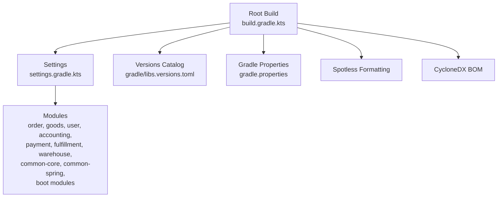
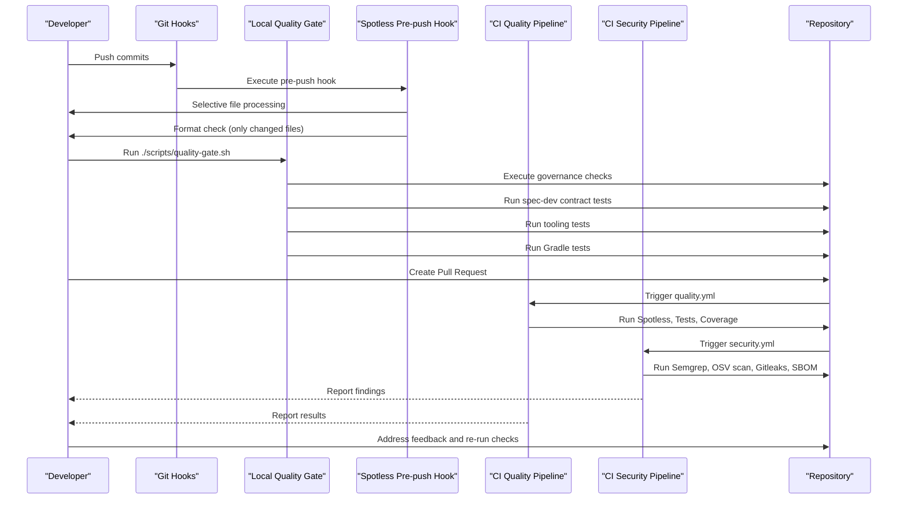
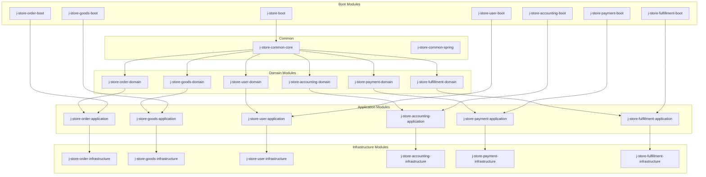

# Development Workflow & Process

<cite>
**Referenced Files in This Document**
- [README.md](file://README.md)
- [AGENTS.md](file://AGENTS.md)
- [SECURITY.md](file://SECURITY.md)
- [build.gradle.kts](file://build.gradle.kts)
- [settings.gradle.kts](file://settings.gradle.kts)
- [gradle.properties](file://gradle.properties)
- [gradle/libs.versions.toml](file://gradle/libs.versions.toml)
- [.github/pull_request_template.md](file://.github/pull_request_template.md)
- [scripts/quality-gate.sh](file://scripts/quality-gate.sh)
- [scripts/check-agent-governance.sh](file://scripts/check-agent-governance.sh)
- [scripts/git-hooks/pre-push](file://scripts/git-hooks/pre-push)
- [tests/tooling/test_spotless_pre_push.py](file://tests/tooling/test_spotless_pre_push.py)
- [requirements-quality.txt](file://requirements-quality.txt)
- [qodana.yaml](file://qodana.yaml)
- [.github/workflows/quality.yml](file://.github/workflows/quality.yml)
- [.github/workflows/security.yml](file://.github/workflows/security.yml)
- [.github/dependabot.yml](file://.github/dependabot.yml)
</cite>

## Update Summary
**Changes Made**
- Enhanced Quality Gate Process section with tooling tests integration details
- Updated Pre-push Hook Configuration section with new incremental formatting workflow
- Added Selective File Processing capabilities in the Developer Experience section
- Updated troubleshooting guidance for the new pre-push hook system
- Enhanced local development workflow documentation

## Table of Contents
1. Introduction
2. Project Structure
3. Core Components
4. Architecture Overview
5. Detailed Component Analysis
6. Dependency Analysis
7. Performance Considerations
8. Troubleshooting Guide
9. Conclusion
10. Appendices

## Introduction
This document defines the complete development workflow for contributing to J-Store, a Kotlin/Spring Boot multi-module e-commerce backend using DDD, Spring Data JPA, PostgreSQL, and Redis. It covers feature branching strategy, commit message conventions, pull request process, code review requirements, automated checks, quality gates (static analysis, security scanning, test coverage), release and versioning strategy, deployment procedures, dependency management via Gradle and centralized versions, CI/CD pipeline stages, troubleshooting build failures, conflict resolution strategies, and merge best practices.

## Project Structure
J-Store is organized as a Gradle multi-module project with clear module boundaries aligned to domain layers: common core/spring, order, goods, user, accounting, payment, fulfillment, warehouse, and boot modules per service. The root build configures toolchain, repositories, Spotless formatting, and CycloneDX BOM generation. Module inclusion is declared centrally.

**Diagram sources**
- [build.gradle.kts:1-64](file://build.gradle.kts#L1-L64)
- [settings.gradle.kts:1-83](file://settings.gradle.kts#L1-L83)
- [gradle/libs.versions.toml:1-111](file://gradle/libs.versions.toml#L1-L111)
- [gradle.properties:1-6](file://gradle.properties#L1-L6)

**Section sources**
- [README.md:1-71](file://README.md#L1-L71)
- [build.gradle.kts:1-64](file://build.gradle.kts#L1-L64)
- [settings.gradle.kts:1-83](file://settings.gradle.kts#L1-L83)
- [gradle.properties:1-6](file://gradle.properties#L1-L6)
- [gradle/libs.versions.toml:1-111](file://gradle/libs.versions.toml#L1-L111)

## Core Components
- Quality Gate Script: Orchestrates governance checks, spec-dev contract tests, tooling tests, and Gradle regression tests.
- Governance Check Script: Validates repository contracts, required files, secrets policy, and consistency between docs and build configurations; enforces security workflow expectations.
- Incremental Pre-push Hook: Provides smart formatting checks that only process changed files during git push operations.
- Qodana Configuration: Defines static analysis profile and thresholds for code quality.
- Security Requirements: Declares Semgrep for static analysis.
- Pull Request Template: Standardizes PR intent, evidence, independent review, and residual risk documentation.

Key responsibilities:
- Local pre-push formatting via Spotless with selective file processing.
- Centralized version management via libs.versions.toml.
- Automated testing and quality gates locally and in CI.
- Security scanning and SBOM generation.

**Section sources**
- [scripts/quality-gate.sh:1-33](file://scripts/quality-gate.sh#L1-L33)
- [scripts/check-agent-governance.sh:1-109](file://scripts/check-agent-governance.sh#L1-L109)
- [scripts/git-hooks/pre-push:1-86](file://scripts/git-hooks/pre-push#L1-86)
- [tests/tooling/test_spotless_pre_push.py:1-85](file://tests/tooling/test_spotless_pre_push.py#L1-85)
- [qodana.yaml:1-50](file://qodana.yaml#L1-50)
- [requirements-security.txt:1-2](file://requirements-security.txt#L1-L2)
- [.github/pull_request_template.md:1-26](file://.github/pull_request_template.md#L1-L26)

## Architecture Overview
The development workflow integrates local and CI processes with enhanced incremental processing:

**Diagram sources**
- [scripts/quality-gate.sh:1-33](file://scripts/quality-gate.sh#L1-L33)
- [scripts/git-hooks/pre-push:1-86](file://scripts/git-hooks/pre-push#L1-86)
- [.github/workflows/quality.yml](file://.github/workflows/quality.yml)
- [.github/workflows/security.yml](file://.github/workflows/security.yml)
- [build.gradle.kts:31-57](file://build.gradle.kts#L31-L57)

## Detailed Component Analysis

### Feature Branching Strategy
- Use descriptive branch names scoped by feature or fix, e.g., feature/order-stock-before-payment, fix/user-auth-token-validation.
- Keep branches focused on a single change set to simplify reviews and reduce conflicts.
- Rebase frequently onto main/master to maintain linear history and minimize merge conflicts.
- Avoid long-lived branches; aim for short iteration cycles.

[No sources needed since this section provides general guidance]

### Commit Message Conventions
- Follow conventional commits: type(scope): description
  - Types: feat, fix, chore, docs, refactor, test, ci, perf, build
  - Scope: module or area (e.g., order, goods, user, accounting)
- Include context for breaking changes and migration notes when applicable.
- Reference related issues or specs in the body.

[No sources needed since this section provides general guidance]

### Pull Request Process
- Use the provided PR template to document intent, evidence, independent review, and residual risk.
- Ensure all checks pass before requesting review.
- Link relevant specs and deltas if behavior changes.
- Confirm public API/event/schema compatibility considerations are addressed.

**Section sources**
- [.github/pull_request_template.md:1-26](file://.github/pull_request_template.md#L1-L26)

### Code Review Requirements
- Automated checks:
  - Spotless formatting enforcement with selective file processing.
  - Unit and integration tests execution.
  - Static analysis via Qodana and Semgrep.
  - Security scanning via Semgrep and OSV scanner.
  - SBOM generation via CycloneDX.
- Manual review criteria:
  - Alignment with DDD guidelines and module boundaries.
  - Test coverage adequacy and meaningful assertions.
  - Migration safety and rollback strategies.
  - Security implications and secret handling.
- Approval workflows:
  - Implementers cannot approve their own changes.
  - High-risk changes require independent evaluation and human approval.
  - Authentication, authorization, tenant isolation, privacy, irreversible operations, and production changes need explicit human approval.

**Section sources**
- [AGENTS.md:1-66](file://AGENTS.md#L1-L66)
- [SECURITY.md:1-17](file://SECURITY.md#L1-L17)
- [build.gradle.kts:31-57](file://build.gradle.kts#L31-L57)
- [qodana.yaml:1-50](file://qodana.yaml#L1-50)
- [requirements-security.txt:1-2](file://requirements-security.txt#L1-L2)

### Quality Gate Process
- Static analysis:
  - Qodana configured with starter profile and thresholds.
  - Spotless ensures consistent code style across Java, Kotlin, and Gradle Kotlin DSL.
- Security scanning:
  - Semgrep for static analysis.
  - OSV scanner for dependency vulnerabilities.
  - Gitleaks CLI for secret detection in git history.
- Test coverage:
  - Qodana supports coverage thresholds; configure fresh and total thresholds as needed.
  - Run full suite via quality gate script.
- Tooling Tests Integration:
  - Spec-dev contract tests validate specification compliance.
  - Governance tests ensure repository structure and policies.
  - Tooling tests verify Git hook functionality and incremental processing.

**Updated** Enhanced with tooling tests integration for comprehensive validation of development tooling components.

**Section sources**
- [qodana.yaml:1-50](file://qodana.yaml#L1-50)
- [build.gradle.kts:31-57](file://build.gradle.kts#L31-L57)
- [requirements-security.txt:1-2](file://requirements-security.txt#L1-L2)
- [scripts/check-agent-governance.sh:90-101](file://scripts/check-agent-governance.sh#L90-L101)
- [scripts/quality-gate.sh:10-27](file://scripts/quality-gate.sh#L10-L27)

### Pre-push Hook Configuration
- Installation: Execute `./gradlew spotlessInstallGitPrePushHook` to install the incremental pre-push hook.
- Selective Processing: The hook analyzes only changed files (Java, Kotlin, Gradle Kotlin) during push operations.
- Smart Skipping: Documentation-only pushes automatically skip formatting checks.
- Automatic Formatting: When formatting issues are detected, the hook applies fixes and requires re-committing formatted code.
- Dry Run Support: Environment variable `SPOTLESS_PRE_PUSH_DRY_RUN=1` enables testing without actual formatting.

**New** Comprehensive pre-push hook system with intelligent file selection and automatic formatting capabilities.

**Section sources**
- [scripts/git-hooks/pre-push:1-86](file://scripts/git-hooks/pre-push#L1-86)
- [build.gradle.kts:85-98](file://build.gradle.kts#L85-L98)
- [tests/tooling/test_spotless_pre_push.py:55-80](file://tests/tooling/test_spotless_pre_push.py#L55-L80)

### Release Process and Versioning Strategy
- Versioning:
  - Centralized version defined in gradle.properties (projectVersion).
  - All modules inherit group and version from root build configuration.
- Release steps:
  - Update version in gradle.properties.
  - Ensure all quality gates pass locally and in CI.
  - Generate SBOM via CycloneDX for production dependencies.
  - Tag release and publish artifacts through CI pipeline.
- Deployment:
  - Docker images built from module Dockerfiles.
  - Kubernetes manifests available for deployment.

**Section sources**
- [gradle.properties:1-6](file://gradle.properties#L1-L6)
- [build.gradle.kts:8-11](file://build.gradle.kts#L8-L11)
- [build.gradle.kts:59-64](file://build.gradle.kts#L59-L64)

### Dependency Management via Gradle
- Centralized versions catalog:
  - All library versions defined in gradle/libs.versions.toml.
  - Plugins and libraries referenced via aliasing for consistency.
- Dependency updates:
  - Dependabot configured to propose updates automatically.
  - Review and validate updates before merging.
- Repository configuration:
  - Maven Central, Aliyun mirror, and local Maven repository.

**Section sources**
- [gradle/libs.versions.toml:1-111](file://gradle/libs.versions.toml#L1-111)
- [.github/dependabot.yml](file://.github/dependabot.yml)
- [build.gradle.kts:19-25](file://build.gradle.kts#L19-L25)

### CI/CD Pipeline Stages
- Quality Pipeline:
  - Runs Spotless checks.
  - Executes unit and integration tests.
  - Generates coverage reports.
- Security Pipeline:
  - Runs Semgrep static analysis.
  - Performs OSV dependency vulnerability scanning.
  - Scans git history with Gitleaks.
  - Generates CycloneDX SBOM for production dependencies.

**Section sources**
- [.github/workflows/quality.yml](file://.github/workflows/quality.yml)
- [.github/workflows/security.yml](file://.github/workflows/security.yml)
- [scripts/check-agent-governance.sh:90-101](file://scripts/check-agent-governance.sh#L90-L101)

### Troubleshooting Build Failures
- Common issues:
  - Spotless formatting failures: run spotlessApply and commit formatted code.
  - Test failures: run targeted module tests and inspect logs.
  - Secret detection: remove any credentials or private keys from tracked files.
  - Version mismatches: ensure docs/project-overview.md matches build versions.
  - Pre-push hook issues: verify hook installation and environment variables.
- Resolution steps:
  - Use quality gate script to identify failing checks.
  - Fix issues incrementally and re-run checks.
  - Consult AGENTS.md for agent-specific constraints and escalation rules.
  - For pre-push hook problems, use dry run mode to diagnose issues.

**Updated** Added troubleshooting guidance for the new pre-push hook system and dry run capabilities.

**Section sources**
- [README.md:5-21](file://README.md#L5-L21)
- [scripts/quality-gate.sh:1-33](file://scripts/quality-gate.sh#L1-L33)
- [scripts/check-agent-governance.sh:60-89](file://scripts/check-agent-governance.sh#L60-L89)
- [AGENTS.md:45-66](file://AGENTS.md#L45-L66)
- [scripts/git-hooks/pre-push:67-69](file://scripts/git-hooks/pre-push#L67-L69)

### Conflict Resolution Strategies and Merge Best Practices
- Resolve conflicts early by rebasing onto target branch.
- Prioritize small, focused PRs to reduce conflict likelihood.
- Communicate changes affecting shared modules or APIs.
- Use squash merges for clean history when appropriate.
- Ensure all checks pass before merging.

[No sources needed since this section provides general guidance]

## Dependency Analysis
The project uses a layered architecture with clear module boundaries enforced by DDD principles. Dependencies flow from infrastructure to application to domain layers, with common modules providing shared functionality.

**Diagram sources**
- [settings.gradle.kts:14-83](file://settings.gradle.kts#L14-L83)

**Section sources**
- [settings.gradle.kts:14-83](file://settings.gradle.kts#L14-L83)

## Performance Considerations
- Optimize Gradle builds by leveraging parallel execution and incremental compilation.
- Use targeted test execution for faster feedback during development.
- Configure JVM arguments appropriately for large projects.
- Monitor CI build times and optimize slow stages.
- Leverage incremental pre-push hooks for faster local development feedback.

**Updated** Added performance benefits of incremental pre-push hooks for improved developer experience.

[No sources needed since this section provides general guidance]

## Troubleshooting Guide
- Local environment setup:
  - Ensure Docker Compose services are running.
  - Import .env variables into the development environment.
- Running quality gates:
  - Execute ./scripts/quality-gate.sh to run all checks including tooling tests.
  - Address failures reported by governance and test scripts.
- Pre-push hook issues:
  - Verify hook installation with `./gradlew spotlessInstallGitPrePushHook`.
  - Use dry run mode with `SPOTLESS_PRE_PUSH_DRY_RUN=1` for testing.
  - Check that only relevant files are being processed during push operations.
- Security issues:
  - Remove any detected secrets immediately.
  - Rotate compromised credentials as per security policy.
- Documentation drift:
  - Update docs/project-overview.md to match build versions.
  - Ensure Docker runtime versions align with toolchain settings.

**Updated** Enhanced with pre-push hook troubleshooting and dry run capabilities.

**Section sources**
- [README.md:22-51](file://README.md#L22-L51)
- [scripts/quality-gate.sh:1-33](file://scripts/quality-gate.sh#L1-L33)
- [SECURITY.md:1-17](file://SECURITY.md#L1-L17)
- [scripts/check-agent-governance.sh:79-89](file://scripts/check-agent-governance.sh#L79-L89)
- [scripts/git-hooks/pre-push:67-69](file://scripts/git-hooks/pre-push#L67-L69)

## Conclusion
This development workflow ensures high-quality, secure, and maintainable code through standardized processes, automated checks, and clear governance. By following the branching strategy, commit conventions, PR template, and quality gates, contributors can collaborate effectively while maintaining system integrity and security posture. The enhanced pre-push hook system and tooling tests integration provide faster feedback loops and better developer experience.

[No sources needed since this section summarizes without analyzing specific files]

## Appendices

### Quick Start Commands
- Format code: ./gradlew spotlessApply
- Check formatting: ./gradlew spotlessCheck
- Install pre-push hook: ./gradlew spotlessInstallGitPrePushHook
- Run quality gate: ./scripts/quality-gate.sh
- Run module tests: ./gradlew :module-name:test
- Test pre-push hook in dry run: SPOTLESS_PRE_PUSH_DRY_RUN=1 ./gradlew spotlessCheck

**Updated** Added dry run command for pre-push hook testing.

**Section sources**
- [README.md:5-21](file://README.md#L5-L21)
- [README.md:53-66](file://README.md#L53-L66)
- [scripts/git-hooks/pre-push:67-69](file://scripts/git-hooks/pre-push#L67-L69)

### Enhanced Developer Experience Features
- **Selective File Processing**: Only processes changed files during git push operations, significantly improving performance.
- **Smart Skip Logic**: Automatically skips formatting checks for documentation-only pushes.
- **Automatic Formatting**: Applies formatting fixes automatically when issues are detected.
- **Dry Run Mode**: Supports testing hook functionality without making changes.
- **Tooling Tests**: Comprehensive test coverage for Git hook functionality and incremental processing.

**New** Comprehensive developer experience improvements through intelligent automation and performance optimizations.

**Section sources**
- [scripts/git-hooks/pre-push:49-62](file://scripts/git-hooks/pre-push#L49-L62)
- [tests/tooling/test_spotless_pre_push.py:55-80](file://tests/tooling/test_spotless_pre_push.py#L55-L80)
- [scripts/quality-gate.sh:17-18](file://scripts/quality-gate.sh#L17-L18)