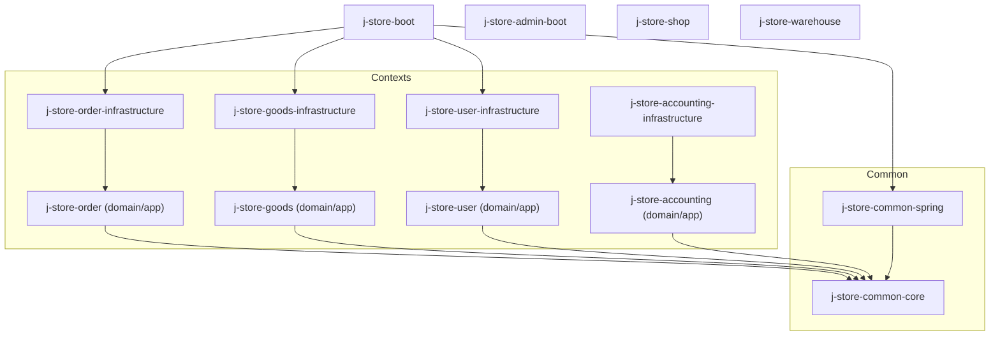
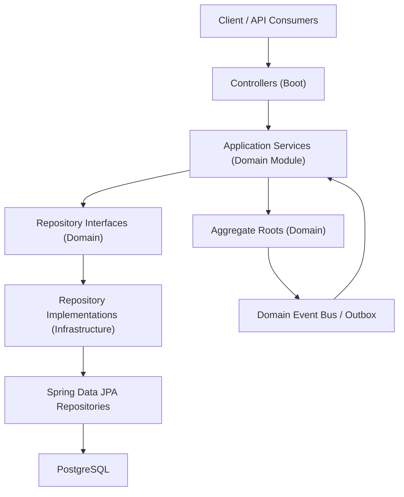
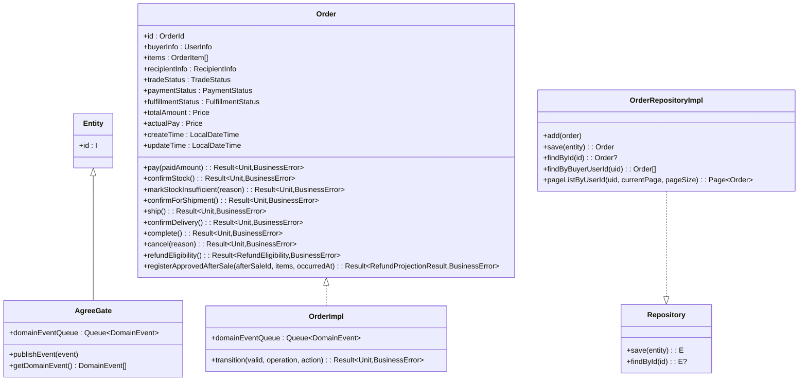
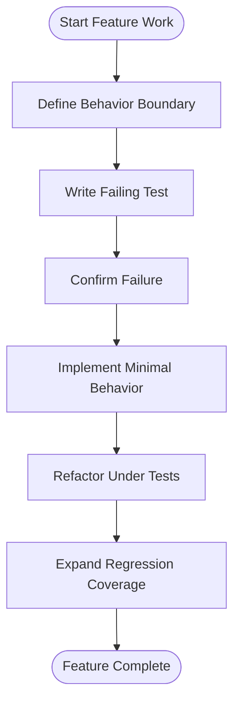
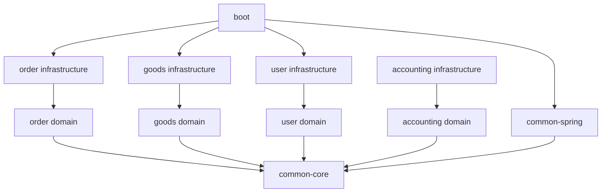

# Development Guidelines and Best Practices

<cite>
**Referenced Files in This Document**
- [README.md](file://README.md)
- [build.gradle.kts](file://build.gradle.kts)
- [project-overview.md](file://docs/project-overview.md)
- [ddd-guidelines.md](file://docs/steering/ddd-guidelines.md)
- [tdd-guidelines.md](file://docs/steering/tdd-guidelines.md)
- [agent-memory-guidelines.md](file://docs/steering/agent-memory-guidelines.md)
- [AGENTS.md](file://AGENTS.md)
- [Order.kt](file://j-store-order/src/main/kotlin/com/jstore/order/domain/order/Order.kt)
- [OrderImpl.kt](file://j-store-order/src/main/kotlin/com/jstore/order/domain/order/OrderImpl.kt)
- [Entity.kt](file://j-store-common-core/src/main/kotlin/com/jstore/common/framework/Entity.kt)
- [AgreeGate.kt](file://j-store-common-core/src/main/kotlin/com/jstore/common/framework/AgreeGate.kt)
- [Repository.kt](file://j-store-common-core/src/main/kotlin/com/jstore/common/framework/Repository.kt)
- [OrderRepositoryImpl.kt](file://j-store-order-infrastructure/src/main/kotlin/com/jstore/order/domain/order/OrderRepositoryImpl.kt)
- [NicknamePropertyTest.kt](file://j-store-user/src/test/kotlin/com/jstore/user/NicknamePropertyTest.kt)
- [CreateDraftCopyDataIntegrityPropertyTest.kt](file://j-store-goods/src/test/kotlin/com/jstore/goods/domain/commodity/CreateDraftCopyDataIntegrityPropertyTest.kt)
</cite>

## Table of Contents
1. Introduction
2. Project Structure
3. Core Components
4. Architecture Overview
5. Detailed Component Analysis
6. Dependency Analysis
7. Performance Considerations
8. Troubleshooting Guide
9. Conclusion
10. Appendices

## Introduction
This document provides comprehensive development guidelines and best practices for J-Store, focusing on Domain-Driven Design (DDD), Test-Driven Development (TDD) with Kotest property-based testing, code style conventions, naming patterns, architectural principles, Git workflow, AI agent integration, memory management, code review practices, documentation standards, quality assurance procedures, and guidance for extending the system with new modules and features. It synthesizes repository steering documents, module structure, and concrete domain implementations to make these practices actionable for both new and experienced contributors.

## Project Structure
J-Store is a Kotlin/Spring Boot e-commerce system organized by bounded contexts into Gradle modules. Each context is split into a domain/application module and an infrastructure module, plus shared common modules and boot modules for runtime composition. The dependency direction is strictly enforced: boot → infrastructure → domain → common-core.

Key structural elements:
- Common core: framework base types, Result, errors, event primitives, utilities, properties (e.g., Price, PhoneNumber).
- Common Spring: Spring-specific integrations for events, Outbox, and geo services.
- Context modules: order, goods, user, accounting, each with domain/application and infrastructure layers.
- Boot modules: j-store-boot as the primary application entrypoint; admin/shop/warehouse skeletons present.

**Diagram sources**
- [project-overview.md](file://docs/project-overview.md)
- [ddd-guidelines.md](file://docs/steering/ddd-guidelines.md)

**Section sources**
- [project-overview.md](file://docs/project-overview.md)
- [ddd-guidelines.md](file://docs/steering/ddd-guidelines.md)
- [build.gradle.kts](file://build.gradle.kts)

## Core Components
Core components underpin DDD and cross-cutting concerns:
- Entity and Aggregate Root abstractions:
  - Entity<I>: base entity interface requiring a typed id.
  - AgreeGate<I>: aggregate root interface providing a domain event queue and publish/get methods.
- Repository abstraction:
  - Repository<I, E>: generic save and findById contract used across aggregates.
- Value objects and properties:
  - Immutable value objects like Price, PhoneNumber, UserId, OrderId encapsulate validation and semantics.
- Result and BusinessError:
  - Result<T, E> models expected business failures without exceptions; BusinessError defines error metadata.

These are defined in common-core and consumed by domain modules. Infrastructure modules implement repositories and persistence details.

**Section sources**
- [Entity.kt](file://j-store-common-core/src/main/kotlin/com/jstore/common/framework/Entity.kt)
- [AgreeGate.kt](file://j-store-common-core/src/main/kotlin/com/jstore/common/framework/AgreeGate.kt)
- [Repository.kt](file://j-store-common-core/src/main/kotlin/com/jstore/common/framework/Repository.kt)
- [ddd-guidelines.md](file://docs/steering/ddd-guidelines.md)

## Architecture Overview
The architecture follows strict DDD layering and modular boundaries:
- Domain layer contains aggregates, entities, value objects, commands, domain events, and repository interfaces.
- Application layer orchestrates use cases via services, using domain logic and repositories.
- Infrastructure implements repositories, POs, JPA repositories, and external adapters (ACL).
- Boot composes modules, wires Spring configuration, and exposes controllers.

**Diagram sources**
- [project-overview.md](file://docs/project-overview.md)
- [ddd-guidelines.md](file://docs/steering/ddd-guidelines.md)

## Detailed Component Analysis

### DDD Implementation Guidelines
- Aggregate design:
  - Use AgreeGate<I> for aggregate roots; maintain domainEventQueue; publish events via publishEvent().
  - One transaction modifies one aggregate; coordinate cross-aggregate behavior through domain events.
- Value object creation:
  - Immutable data classes or val-only properties; validate in init blocks; prefer over primitives.
- Repository pattern:
  - Interface in domain module; implementation in infrastructure module; no PO or framework types in interfaces.
- Commands and events:
  - Commands: verb phrase + CMD/Command suffix; data carriers only.
  - Events: past-tense verb + Event suffix; implement DomainEvent; published via aggregate.
- Anti-corruption layer (ACL):
  - Interfaces in consuming domain module; implementations in infrastructure; convert external models to local domain models.
- Error handling:
  - Use Result<T, BusinessError>; define context-specific error constants; propagate early with onFailure.

Examples from the codebase:
- Order aggregate interface and implementation demonstrate state transitions, event publishing, and Result usage.
- UserAccount aggregate shows lifecycle operations with immutable value objects.

**Diagram sources**
- [Entity.kt](file://j-store-common-core/src/main/kotlin/com/jstore/common/framework/Entity.kt)
- [AgreeGate.kt](file://j-store-common-core/src/main/kotlin/com/jstore/common/framework/AgreeGate.kt)
- [Repository.kt](file://j-store-common-core/src/main/kotlin/com/jstore/common/framework/Repository.kt)
- [Order.kt](file://j-store-order/src/main/kotlin/com/jstore/order/domain/order/Order.kt)
- [OrderImpl.kt](file://j-store-order/src/main/kotlin/com/jstore/order/domain/order/OrderImpl.kt)
- [OrderRepositoryImpl.kt](file://j-store-order-infrastructure/src/main/kotlin/com/jstore/order/domain/order/OrderRepositoryImpl.kt)

**Section sources**
- [ddd-guidelines.md](file://docs/steering/ddd-guidelines.md)
- [Order.kt](file://j-store-order/src/main/kotlin/com/jstore/order/domain/order/Order.kt)
- [OrderImpl.kt](file://j-store-order/src/main/kotlin/com/jstore/order/domain/order/OrderImpl.kt)
- [OrderRepositoryImpl.kt](file://j-store-order-infrastructure/src/main/kotlin/com/jstore/order/domain/order/OrderRepositoryImpl.kt)

### TDD and Property-Based Testing with Kotest
Guidelines:
- Write failing tests first; implement minimal behavior; refactor under test protection.
- Layered testing:
  - Domain: fast unit tests covering invariants, state transitions, events.
  - Value objects: constructor validation, immutability, serialization round-trips.
  - Application services: fake repositories/mocks for orchestration verification.
  - Infrastructure: narrow integration tests for PO↔domain mapping, JPA queries, transactions, Outbox.
- Property-based testing scenarios:
  - Large input spaces with clear invariants.
  - Value object validation/formatting/serialization.
  - PO↔domain conversion round-trips.
  - State machine illegal transitions, repeated operations, boundary quantities.

Examples:
- NicknamePropertyTest validates constraints via Kotest property checks.
- CreateDraftCopyDataIntegrityPropertyTest ensures data integrity across draft copy operations.

**Diagram sources**
- [tdd-guidelines.md](file://docs/steering/tdd-guidelines.md)

**Section sources**
- [tdd-guidelines.md](file://docs/steering/tdd-guidelines.md)
- [NicknamePropertyTest.kt](file://j-store-user/src/test/kotlin/com/jstore/user/NicknamePropertyTest.kt)
- [CreateDraftCopyDataIntegrityPropertyTest.kt](file://j-store-goods/src/test/kotlin/com/jstore/goods/domain/commodity/CreateDraftCopyDataIntegrityPropertyTest.kt)

### Code Style Conventions and Naming Patterns
- Entities & Aggregates: business nouns; implementations add Impl suffix.
- Value Objects: business nouns; immutable; validate in init.
- Commands: verb phrase + CMD/Command; placed in command package.
- Domain Events: past-tense verb + Event; placed in event package.
- Repositories: Root + Repository (interface); Root + RepositoryImpl (implementation).
- Application Services: Context + Service.
- Factories: Root + Factory.
- ACL Interfaces: External context + Service.
- Persistence Objects: Entity + PO; JPA Repositories: Entity + POJpaRepository.
- Errors: Context + Errors.

Prohibited patterns include domain imports of Spring/JPA, anemic models, cross-aggregate mutations in single transactions, PO types in domain, business logic in services/controllers, direct aggregate references, persistence details in repository interfaces, and mutable value objects.

**Section sources**
- [ddd-guidelines.md](file://docs/steering/ddd-guidelines.md)

### Architectural Principles
- Strict dependency direction: boot → infrastructure → domain → common-core.
- Domain isolation: no Spring/JPA/Hibernate in domain modules.
- One aggregate per transaction; cross-aggregate coordination via domain events.
- ACL for cross-context communication; convert external models to local domain models.
- Result-based error propagation; avoid exceptions for expected business failures.

**Section sources**
- [project-overview.md](file://docs/project-overview.md)
- [ddd-guidelines.md](file://docs/steering/ddd-guidelines.md)

### Git Workflow and Contribution Process
Recommended workflow aligned with the project’s spec-driven pipeline:
- Intake: clarify scope and propose feature slug.
- Planner produces requirement.md.
- Designer produces design.md.
- Tasker produces tasks.md; generator updates checkboxes during implementation.
- Evaluator reviews per task; gates enforce quality before merging.

Contribution steps:
- Fork and create a feature branch named after the feature slug.
- Follow TDD: write failing tests first, then minimal implementation, then refactor.
- Ensure all relevant tests pass; run module-specific tests and full suite.
- Update docs/spec artifacts if behavior changes; keep AGENTS.md index updated.
- Submit PR with clear description linking to spec artifacts and test results.

**Section sources**
- [claude-workflow.md](file://claude-workflow.md)
- [AGENTS.md](file://AGENTS.md)

### AI Agent Integration and Memory Management
Agent memory organization:
- AGENTS.md serves as a long-term memory index with links and brief descriptions.
- Detailed rules, constraints, and decisions live in docs/steering/*.
- New long-term memory entries should be categorized and linked; avoid duplicating content across files.
- Keep memory files short, stable, and executable; do not log transient states or one-off processes.

Maintenance principles:
- Prefer specs and steering docs for long-term facts and constraints.
- If code conflicts with docs, prioritize code/tests and update docs accordingly.

**Section sources**
- [agent-memory-guidelines.md](file://docs/steering/agent-memory-guidelines.md)
- [AGENTS.md](file://AGENTS.md)

### Code Review Practices and Documentation Standards
Code review checklist:
- DDD compliance: aggregates encapsulate behavior; no anemic models; ID-only references between aggregates.
- Repository pattern: interfaces in domain, implementations in infrastructure; no PO/framework leakage.
- Error handling: Result-based; context-specific errors; no exceptions for expected failures.
- Testing: TDD followed; property tests cover invariants; integration tests cover PO↔domain and Outbox.
- Documentation: specs updated; steering docs current; AGENTS.md index accurate.

Documentation standards:
- Specs under docs/spec/<feature>/ with requirement.md, design.md, tasks.md.
- Steering docs under docs/steering/ for architecture, testing, and agent memory.
- Requirement and planning materials under docs/requirement/.

**Section sources**
- [project-overview.md](file://docs/project-overview.md)
- [ddd-guidelines.md](file://docs/steering/ddd-guidelines.md)
- [tdd-guidelines.md](file://docs/steering/tdd-guidelines.md)

### Quality Assurance Procedures
- Run module-specific tests before full suite:
  - ./gradlew :j-store-order:test
  - ./gradlew :j-store-goods:test
  - ./gradlew :j-store-user:test
  - ./gradlew :j-store-accounting:test
  - ./gradlew :j-store-common-spring:test
  - ./gradlew :j-store-authentication-spring-sdk:test
- For database/outbox/Spring assembly, run infrastructure/common-spring/boot tests.
- Local environment setup via docker-compose.postgres.yml; verify PostgreSQL and Redis connectivity.

**Section sources**
- [tdd-guidelines.md](file://docs/steering/tdd-guidelines.md)
- [README.md](file://README.md)

### Extending the System with New Modules and Features
Steps:
- Define bounded context and module names following j-store-{context} and j-store-{context}-infrastructure patterns.
- Place domain/application code in domain module; repository interfaces there too.
- Implement repositories and POs in infrastructure module; converters for PO↔domain mapping.
- Wire up in boot module; ensure dependency direction is respected.
- Add specs under docs/spec/<feature>/; follow planner-designer-tasker-generator-evaluator pipeline.
- Include property-based tests for value objects and conversions; integrate Outbox for events.

**Section sources**
- [project-overview.md](file://docs/project-overview.md)
- [ddd-guidelines.md](file://docs/steering/ddd-guidelines.md)

## Dependency Analysis
Module dependencies must adhere to DDD layering:
- Domain modules depend only on common-core.
- Infrastructure modules depend on their corresponding domain modules and Spring frameworks.
- Boot composes modules and configurations.

**Diagram sources**
- [project-overview.md](file://docs/project-overview.md)
- [ddd-guidelines.md](file://docs/steering/ddd-guidelines.md)

**Section sources**
- [project-overview.md](file://docs/project-overview.md)
- [ddd-guidelines.md](file://docs/steering/ddd-guidelines.md)

## Performance Considerations
- Prefer immutable value objects and small, focused aggregates to reduce mutation complexity.
- Use Result-based flows to avoid exception overhead for expected failures.
- Minimize cross-aggregate calls; rely on domain events for asynchronous processing where appropriate.
- Optimize repository queries with pagination and sorting at the JPA level; map efficiently in converters.
- Avoid heavy transformations in hot paths; cache immutable value objects when necessary.

[No sources needed since this section provides general guidance]

## Troubleshooting Guide
Common issues and resolutions:
- Domain layer imports Spring/JPA: move to infrastructure; ensure domain purity.
- Anemic models: add behavior to aggregates/entities; move logic out of services/controllers.
- Cross-aggregate mutations: split transactions; use domain events for coordination.
- Repository interface leaks PO/framework types: refactor to domain types only.
- Missing Result usage: replace exceptions with Result and BusinessError; propagate failures explicitly.
- Property tests brittle due to random data: constrain generators to meaningful ranges.

Debugging tips:
- Run minimal related tests first; isolate failures to specific modules.
- Inspect domain event queues and Outbox persistence for event flow issues.
- Validate PO↔domain converters for backward compatibility and null safety.

**Section sources**
- [ddd-guidelines.md](file://docs/steering/ddd-guidelines.md)
- [tdd-guidelines.md](file://docs/steering/tdd-guidelines.md)

## Conclusion
J-Store’s development guidelines emphasize strict DDD boundaries, robust TDD with property-based testing, and disciplined module architecture. By adhering to these practices—aggregate design, value object immutability, repository patterns, Result-based error handling, and spec-driven workflows—teams can maintain high-quality, extensible systems. The AI agent integration and memory management guidelines further streamline collaboration and knowledge retention. Following the outlined contribution process, code review practices, and QA procedures ensures consistent delivery and reliability.

[No sources needed since this section summarizes without analyzing specific files]

## Appendices
- Quick start commands for local services and testing are available in README and project overview.
- Spec artifacts and steering docs provide detailed requirements and constraints for feature development.

**Section sources**
- [README.md](file://README.md)
- [project-overview.md](file://docs/project-overview.md)