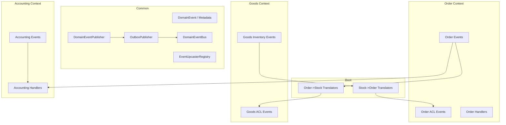
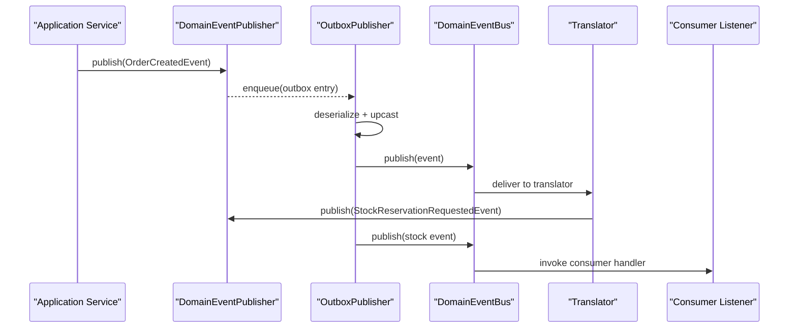
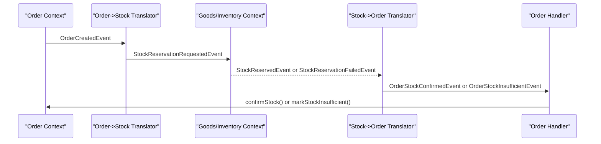
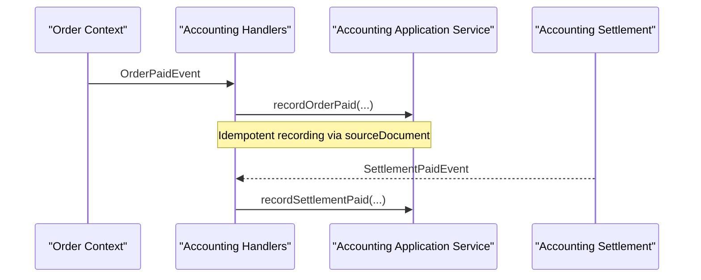
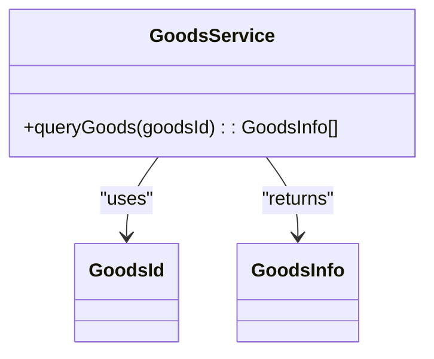
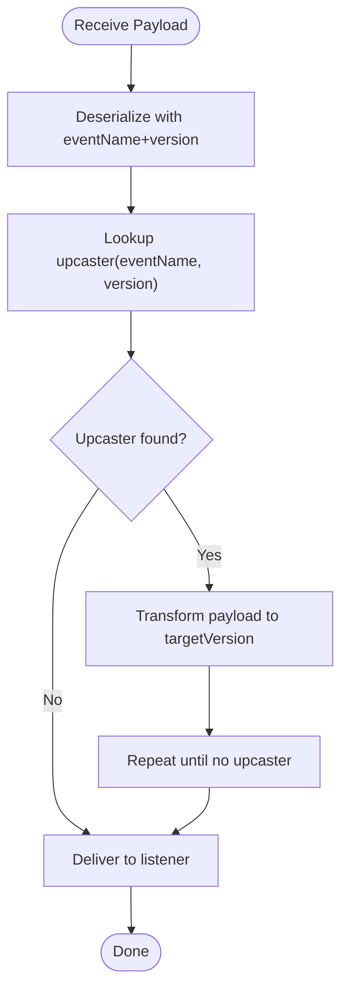
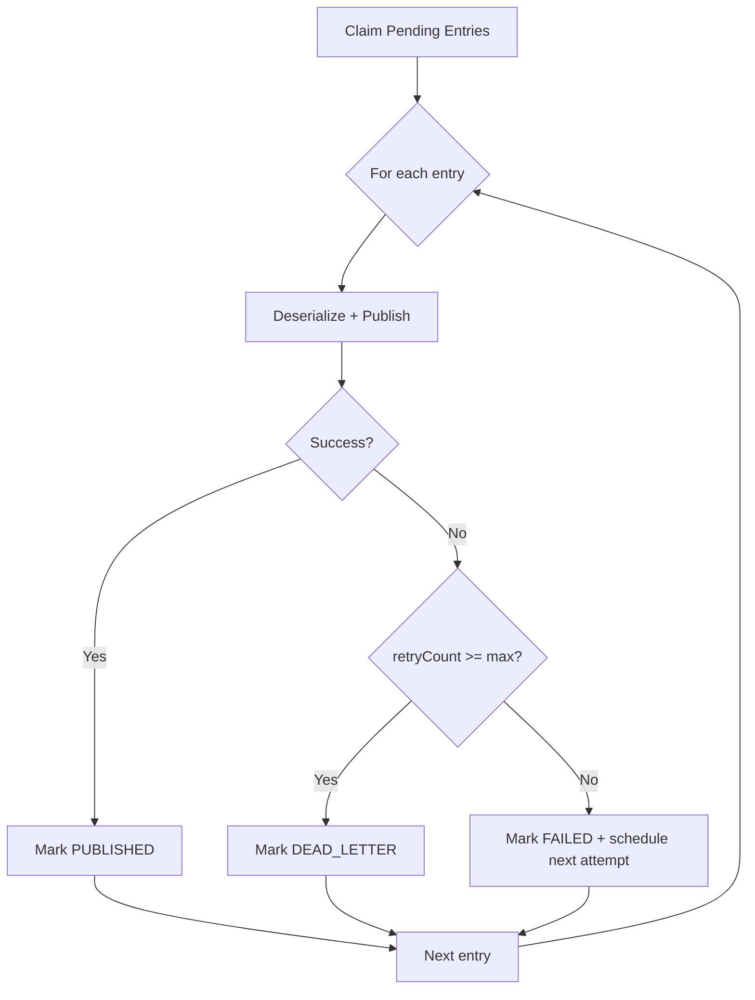
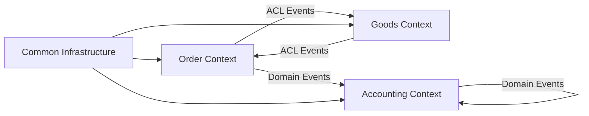

# Cross-Context Communication

<cite>
**Referenced Files in This Document**
- [DomainEvent.kt](file://j-store-common-core/src/main/kotlin/com/jstore/common/framework/event/DomainEvent.kt)
- [DomainEventBus.kt](file://j-store-common-core/src/main/kotlin/com/jstore/common/framework/event/DomainEventBus.kt)
- [DomainEventPublisher.kt](file://j-store-common-core/src/main/kotlin/com/jstore/common/framework/event/DomainEventPublisher.kt)
- [OutboxPublisher.kt](file://j-store-common-spring/src/main/kotlin/com/jstore/common/framework/event/outbox/OutboxPublisher.kt)
- [EventUpcaster.kt](file://j-store-common-core/src/main/kotlin/com/jstore/common/framework/event/outbox/EventUpcaster.kt)
- [OrderToStockEventTranslator.kt](file://j-store-boot/src/main/kotlin/com/jstore/translator/OrderToStockEventTranslator.kt)
- [StockToOrderEventTranslator.kt](file://j-store-boot/src/main/kotlin/com/jstore/translator/StockToOrderEventTranslator.kt)
- [GoodsService.kt](file://j-store-order/src/main/kotlin/com/jstore/order/acl/GoodsService.kt)
- [OrderStockEventHandler.kt](file://j-store-order/src/main/kotlin/com/jstore/order/service/OrderStockEventHandler.kt)
- [OrderStockInsufficientEventHandler.kt](file://j-store-order/src/main/kotlin/com/jstore/order/service/OrderStockInsufficientEventHandler.kt)
- [StockConfirmRequestedEvent.kt](file://j-store-goods/src/main/kotlin/com/jstore/goods/acl/event/StockConfirmRequestedEvent.kt)
- [InventoryDomainEvent.kt](file://j-store-goods/src/main/kotlin/com/jstore/goods/domain/inventory/event/InventoryDomainEvent.kt)
- [AccountingEventHandler.kt](file://j-store-accounting/src/main/kotlin/com/jstore/accounting/service/AccountingEventHandler.kt)
- [SettlementPaidEvent.kt](file://j-store-accounting/src/main/kotlin/com/jstore/accounting/domain/settlement/event/SettlementPaidEvent.kt)
- [SettlementConfirmedEvent.kt](file://j-store-accounting/src/main/kotlin/com/jstore/accounting/domain/settlement/event/SettlementConfirmedEvent.kt)
- [领域事件基础设施架构.md](file://docs/technic/领域事件基础设施架构.md)
</cite>

## Table of Contents
1. Introduction
2. Project Structure
3. Core Components
4. Architecture Overview
5. Detailed Component Analysis
6. Dependency Analysis
7. Performance Considerations
8. Troubleshooting Guide
9. Conclusion

## Introduction
This document explains J-Store’s cross-context event communication patterns across bounded contexts (Order, Goods/Inventory, Accounting). It focuses on:
- Domain events and the transactional outbox for reliable delivery
- Anti-Corruption Layer (ACL) and event translation between contexts
- Protocol adaptation via translators in the boot layer
- Event versioning and upcasting for backward compatibility
- Security, filtering, and access control considerations
- Practical flows: order-to-stock, payment confirmation, and settlement processing
- Failure handling and migration strategies

## Project Structure
J-Store is organized into modular bounded contexts with shared infrastructure:
- Common core provides domain event abstractions, publisher/bus, and outbox utilities
- Spring integration adds outbox publishing, listener registration, and idempotency
- Boot module hosts cross-context translators that bridge Order and Goods events
- Context modules (Order, Goods, Accounting) define their own ACL events and handlers

**Diagram sources**
- [DomainEvent.kt](file://j-store-common-core/src/main/kotlin/com/jstore/common/framework/event/DomainEvent.kt)
- [DomainEventPublisher.kt](file://j-store-common-core/src/main/kotlin/com/jstore/common/framework/event/DomainEventPublisher.kt)
- [DomainEventBus.kt](file://j-store-common-core/src/main/kotlin/com/jstore/common/framework/event/DomainEventBus.kt)
- [OutboxPublisher.kt](file://j-store-common-spring/src/main/kotlin/com/jstore/common/framework/event/outbox/OutboxPublisher.kt)
- [EventUpcaster.kt](file://j-store-common-core/src/main/kotlin/com/jstore/common/framework/event/outbox/EventUpcaster.kt)
- [OrderToStockEventTranslator.kt](file://j-store-boot/src/main/kotlin/com/jstore/translator/OrderToStockEventTranslator.kt)
- [StockToOrderEventTranslator.kt](file://j-store-boot/src/main/kotlin/com/jstore/translator/StockToOrderEventTranslator.kt)
- [AccountingEventHandler.kt](file://j-store-accounting/src/main/kotlin/com/jstore/accounting/service/AccountingEventHandler.kt)

**Section sources**
- [领域事件基础设施架构.md](file://docs/technic/领域事件基础设施架构.md)

## Core Components
- DomainEvent and ExplicitDomainEvent define stable metadata (eventId, eventName, eventVersion, occurredAt, aggregateType, aggregateId) used for idempotency and routing.
- DomainEventPublisher is the transactional outbox publisher; DomainEventBus handles in-process dispatch to listeners.
- OutboxPublisher polls pending entries, deserializes events (with upcasting), publishes via DomainEventBus, and updates status or retries/dead-letter.
- EventUpcasterRegistry supports versioned payloads and chained upcasting for backward compatibility.
- Translators in the boot layer convert between context-specific events without leaking external types.

**Section sources**
- [DomainEvent.kt](file://j-store-common-core/src/main/kotlin/com/jstore/common/framework/event/DomainEvent.kt)
- [DomainEventPublisher.kt](file://j-store-common-core/src/main/kotlin/com/jstore/common/framework/event/DomainEventPublisher.kt)
- [DomainEventBus.kt](file://j-store-common-core/src/main/kotlin/com/jstore/common/framework/event/DomainEventBus.kt)
- [OutboxPublisher.kt](file://j-store-common-spring/src/main/kotlin/com/jstore/common/framework/event/outbox/OutboxPublisher.kt)
- [EventUpcaster.kt](file://j-store-common-core/src/main/kotlin/com/jstore/common/framework/event/outbox/EventUpcaster.kt)

## Architecture Overview
Cross-context communication follows a publish-subscribe model with strict boundaries:
- Bounded contexts emit domain events within their own process.
- Outbox ensures durable, eventually consistent delivery across services.
- Translators adapt messages at the assembly boundary, preserving loose coupling.
- Consumers implement DomainEventListener with idempotent handling.

**Diagram sources**
- [DomainEventPublisher.kt](file://j-store-common-core/src/main/kotlin/com/jstore/common/framework/event/DomainEventPublisher.kt)
- [OutboxPublisher.kt](file://j-store-common-spring/src/main/kotlin/com/jstore/common/framework/event/outbox/OutboxPublisher.kt)
- [DomainEventBus.kt](file://j-store-common-core/src/main/kotlin/com/jstore/common/framework/event/DomainEventBus.kt)
- [OrderToStockEventTranslator.kt](file://j-store-boot/src/main/kotlin/com/jstore/translator/OrderToStockEventTranslator.kt)

## Detailed Component Analysis

### Order-to-Stock Event Flow
Order emits domain events; translators convert them to inventory ACL events. Inventory responds with stock reserved or failure events, which are translated back to Order ACL events. Order handlers update order state accordingly.

**Diagram sources**
- [OrderToStockEventTranslator.kt](file://j-store-boot/src/main/kotlin/com/jstore/translator/OrderToStockEventTranslator.kt)
- [StockToOrderEventTranslator.kt](file://j-store-boot/src/main/kotlin/com/jstore/translator/StockToOrderEventTranslator.kt)
- [OrderStockEventHandler.kt](file://j-store-order/src/main/kotlin/com/jstore/order/service/OrderStockEventHandler.kt)
- [OrderStockInsufficientEventHandler.kt](file://j-store-order/src/main/kotlin/com/jstore/order/service/OrderStockInsufficientEventHandler.kt)
- [StockConfirmRequestedEvent.kt](file://j-store-goods/src/main/kotlin/com/jstore/goods/acl/event/StockConfirmRequestedEvent.kt)
- [InventoryDomainEvent.kt](file://j-store-goods/src/main/kotlin/com/jstore/goods/domain/inventory/event/InventoryDomainEvent.kt)

**Section sources**
- [OrderToStockEventTranslator.kt](file://j-store-boot/src/main/kotlin/com/jstore/translator/OrderToStockEventTranslator.kt)
- [StockToOrderEventTranslator.kt](file://j-store-boot/src/main/kotlin/com/jstore/translator/StockToOrderEventTranslator.kt)
- [OrderStockEventHandler.kt](file://j-store-order/src/main/kotlin/com/jstore/order/service/OrderStockEventHandler.kt)
- [OrderStockInsufficientEventHandler.kt](file://j-store-order/src/main/kotlin/com/jstore/order/service/OrderStockInsufficientEventHandler.kt)
- [StockConfirmRequestedEvent.kt](file://j-store-goods/src/main/kotlin/com/jstore/goods/acl/event/StockConfirmRequestedEvent.kt)
- [InventoryDomainEvent.kt](file://j-store-goods/src/main/kotlin/com/jstore/goods/domain/inventory/event/InventoryDomainEvent.kt)

### Payment Confirmation and Accounting Integration
Order Paid events are consumed by accounting handlers to record revenue and commissions. Settlement paid events drive settlement payment journal entries.

**Diagram sources**
- [AccountingEventHandler.kt](file://j-store-accounting/src/main/kotlin/com/jstore/accounting/service/AccountingEventHandler.kt)
- [SettlementPaidEvent.kt](file://j-store-accounting/src/main/kotlin/com/jstore/accounting/domain/settlement/event/SettlementPaidEvent.kt)
- [SettlementConfirmedEvent.kt](file://j-store-accounting/src/main/kotlin/com/jstore/accounting/domain/settlement/event/SettlementConfirmedEvent.kt)

**Section sources**
- [AccountingEventHandler.kt](file://j-store-accounting/src/main/kotlin/com/jstore/accounting/service/AccountingEventHandler.kt)
- [SettlementPaidEvent.kt](file://j-store-accounting/src/main/kotlin/com/jstore/accounting/domain/settlement/event/SettlementPaidEvent.kt)
- [SettlementConfirmedEvent.kt](file://j-store-accounting/src/main/kotlin/com/jstore/accounting/domain/settlement/event/SettlementConfirmedEvent.kt)

### ACL and Event Translation Patterns
ACL interfaces isolate bounded contexts from external types. Translators perform pure mapping between domain events and ACL events.

**Diagram sources**
- [GoodsService.kt](file://j-store-order/src/main/kotlin/com/jstore/order/acl/GoodsService.kt)

**Section sources**
- [GoodsService.kt](file://j-store-order/src/main/kotlin/com/jstore/order/acl/GoodsService.kt)

### Event Versioning and Upcasting
Events carry explicit versions. The upcaster registry chains transformations to ensure consumers can handle older payloads safely.

**Diagram sources**
- [EventUpcaster.kt](file://j-store-common-core/src/main/kotlin/com/jstore/common/framework/event/outbox/EventUpcaster.kt)

**Section sources**
- [EventUpcaster.kt](file://j-store-common-core/src/main/kotlin/com/jstore/common/framework/event/outbox/EventUpcaster.kt)

### Outbox Delivery and Reliability
OutboxPublisher claims pending entries, deserializes with upcasting, publishes via DomainEventBus, and updates status. Failures increment retry count with exponential backoff; max retries move entries to dead-letter.

**Diagram sources**
- [OutboxPublisher.kt](file://j-store-common-spring/src/main/kotlin/com/jstore/common/framework/event/outbox/OutboxPublisher.kt)

**Section sources**
- [OutboxPublisher.kt](file://j-store-common-spring/src/main/kotlin/com/jstore/common/framework/event/outbox/OutboxPublisher.kt)

## Dependency Analysis
- Order depends on Goods only through ACL events and translators; direct domain type leakage is avoided.
- Accounting consumes Order and Settlement events via dedicated handlers.
- Common infrastructure decouples persistence and messaging from business logic.

**Diagram sources**
- [OrderToStockEventTranslator.kt](file://j-store-boot/src/main/kotlin/com/jstore/translator/OrderToStockEventTranslator.kt)
- [StockToOrderEventTranslator.kt](file://j-store-boot/src/main/kotlin/com/jstore/translator/StockToOrderEventTranslator.kt)
- [AccountingEventHandler.kt](file://j-store-accounting/src/main/kotlin/com/jstore/accounting/service/AccountingEventHandler.kt)

**Section sources**
- [OrderToStockEventTranslator.kt](file://j-store-boot/src/main/kotlin/com/jstore/translator/OrderToStockEventTranslator.kt)
- [StockToOrderEventTranslator.kt](file://j-store-boot/src/main/kotlin/com/jstore/translator/StockToOrderEventTranslator.kt)
- [AccountingEventHandler.kt](file://j-store-accounting/src/main/kotlin/com/jstore/accounting/service/AccountingEventHandler.kt)

## Performance Considerations
- Use batched outbox polling with lock timeouts to avoid contention.
- Keep translators lightweight; avoid heavy I/O inside event handlers.
- Prefer idempotent consumers leveraging eventId and consumption repository checks.
- Monitor dead-letter queues and adjust retry/backoff parameters based on error rates.

[No sources needed since this section provides general guidance]

## Troubleshooting Guide
- If events are not delivered, check outbox entries for FAILED/DEAD_LETTER states and lastError messages.
- Verify upcaster registrations for new event versions; mismatched versions cause deserialization failures.
- Ensure consumers are registered and support the expected event type generics.
- Investigate idempotency blocks when tryStart returns false; duplicate consumption should be skipped.

**Section sources**
- [OutboxPublisher.kt](file://j-store-common-spring/src/main/kotlin/com/jstore/common/framework/event/outbox/OutboxPublisher.kt)
- [EventUpcaster.kt](file://j-store-common-core/src/main/kotlin/com/jstore/common/framework/event/outbox/EventUpcaster.kt)

## Conclusion
J-Store’s cross-context communication leverages domain events, transactional outbox, ACLs, and translators to maintain loose coupling and service boundaries. Versioned events with upcasting ensure backward compatibility, while idempotent consumers and robust retry/dead-letter mechanisms provide reliability. Following these patterns enables scalable, resilient distributed workflows across Order, Goods, and Accounting contexts.

[No sources needed since this section summarizes without analyzing specific files]