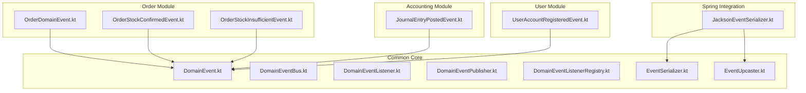
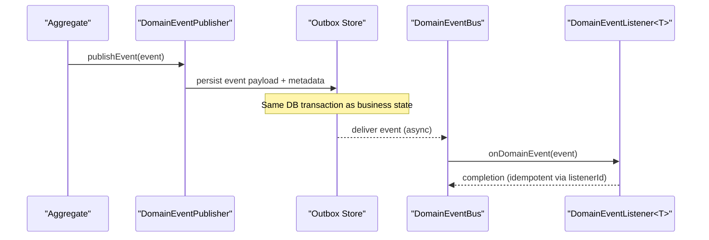
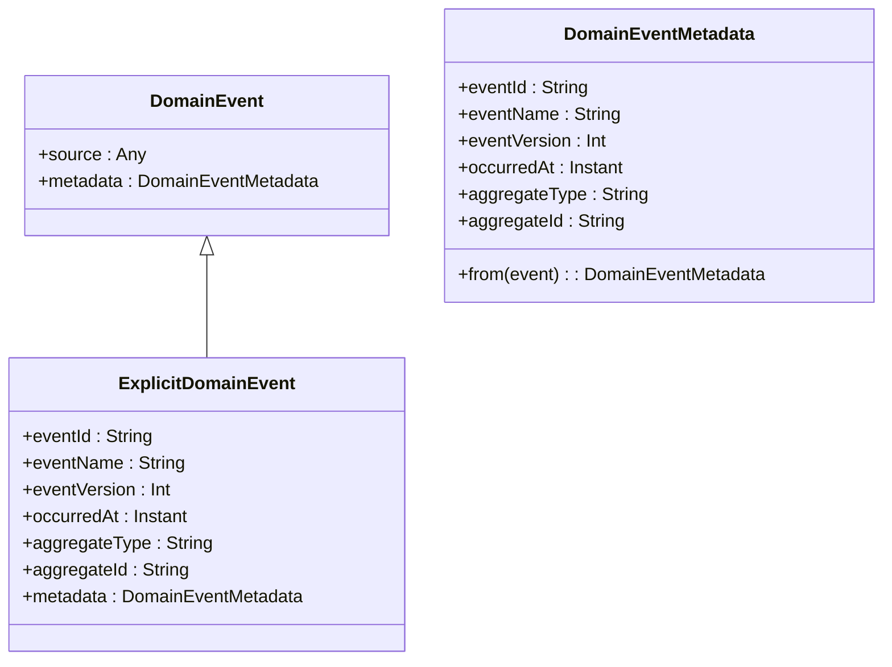
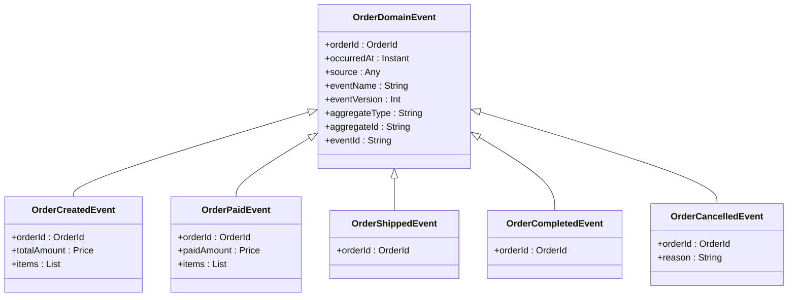
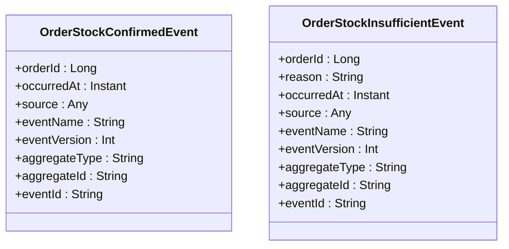
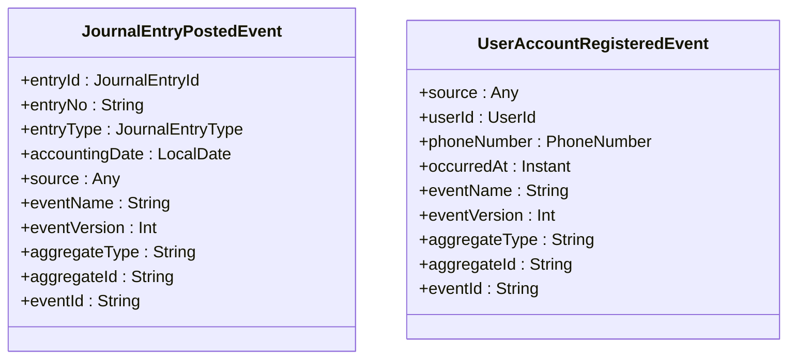
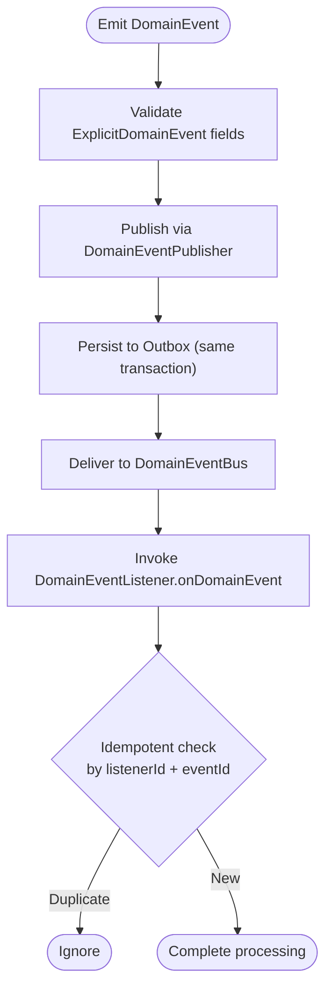
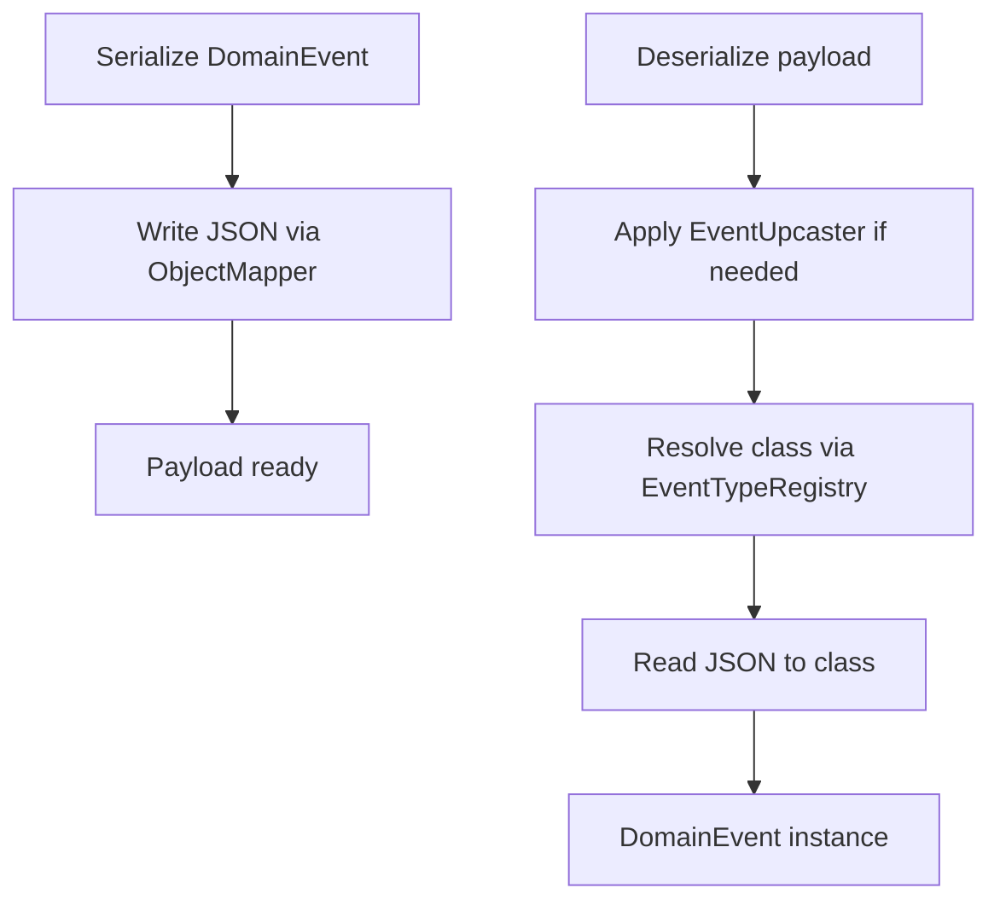
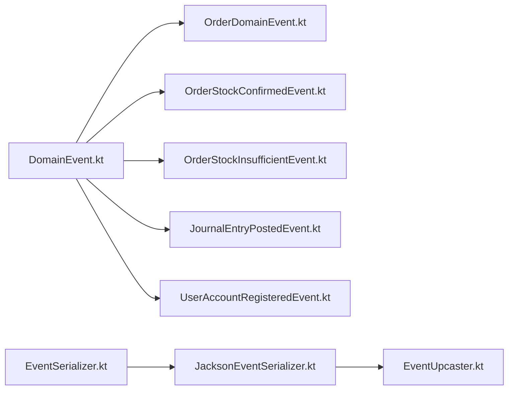

# Domain Events Design

<cite>
**Referenced Files in This Document**
- [DomainEvent.kt](file://j-store-common-core/src/main/kotlin/com/jstore/common/framework/event/DomainEvent.kt)
- [DomainEventBus.kt](file://j-store-common-core/src/main/kotlin/com/jstore/common/framework/event/DomainEventBus.kt)
- [DomainEventListener.kt](file://j-store-common-core/src/main/kotlin/com/jstore/common/framework/event/DomainEventListener.kt)
- [DomainEventPublisher.kt](file://j-store-common-core/src/main/kotlin/com/jstore/common/framework/event/DomainEventPublisher.kt)
- [DomainEventListenerRegistry.kt](file://j-store-common-core/src/main/kotlin/com/jstore/common/framework/event/DomainEventListenerRegistry.kt)
- [OrderDomainEvent.kt](file://j-store-order/src/main/kotlin/com/jstore/order/domain/order/event/OrderDomainEvent.kt)
- [OrderStockConfirmedEvent.kt](file://j-store-order/src/main/kotlin/com/jstore/order/acl/event/OrderStockConfirmedEvent.kt)
- [OrderStockInsufficientEvent.kt](file://j-store-order/src/main/kotlin/com/jstore/order/acl/event/OrderStockInsufficientEvent.kt)
- [JournalEntryPostedEvent.kt](file://j-store-accounting/src/main/kotlin/com/jstore/accounting/domain/journal/event/JournalEntryPostedEvent.kt)
- [UserAccountRegisteredEvent.kt](file://j-store-user/src/main/kotlin/com/jstore/user/domain/useraccount/event/UserAccountRegisteredEvent.kt)
- [EventSerializer.kt](file://j-store-common-core/src/main/kotlin/com/jstore/common/framework/event/outbox/EventSerializer.kt)
- [JacksonEventSerializer.kt](file://j-store-common-spring/src/main/kotlin/com/jstore/common/framework/event/outbox/JacksonEventSerializer.kt)
- [EventUpcaster.kt](file://j-store-common-core/src/main/kotlin/com/jstore/common/framework/event/outbox/EventUpcaster.kt)
</cite>

## Table of Contents
1. [Introduction](#introduction)
2. [Project Structure](#project-structure)
3. [Core Components](#core-components)
4. [Architecture Overview](#architecture-overview)
5. [Detailed Component Analysis](#detailed-component-analysis)
6. [Dependency Analysis](#dependency-analysis)
7. [Performance Considerations](#performance-considerations)
8. [Troubleshooting Guide](#troubleshooting-guide)
9. [Conclusion](#conclusion)
10. [Appendices](#appendices)

## Introduction
This document explains J-Store’s domain event design patterns with a focus on the DomainEvent interface, naming conventions, payload design, serialization and versioning, lifecycle, metadata handling, cross-context communication, testing strategies, and best practices for event-driven business logic. It includes concrete examples from the order module (OrderCreatedEvent, OrderPaidEvent, OrderCompletedEvent) and shows how events integrate with the outbox pattern and upcasting for backward compatibility.

## Project Structure
J-Store organizes domain events across modules:
- Common core defines the event interfaces, metadata, and outbox primitives.
- Order module defines domain events for order lifecycle and ACL integration events.
- Accounting and User modules provide additional domain events as examples of consistent patterns.
- Spring integration provides serialization and runtime wiring for event publishing and consumption.

**Diagram sources**
- [DomainEvent.kt](file://j-store-common-core/src/main/kotlin/com/jstore/common/framework/event/DomainEvent.kt)
- [DomainEventBus.kt](file://j-store-common-core/src/main/kotlin/com/jstore/common/framework/event/DomainEventBus.kt)
- [DomainEventListener.kt](file://j-store-common-core/src/main/kotlin/com/jstore/common/framework/event/DomainEventListener.kt)
- [DomainEventPublisher.kt](file://j-store-common-core/src/main/kotlin/com/jstore/common/framework/event/DomainEventPublisher.kt)
- [DomainEventListenerRegistry.kt](file://j-store-common-core/src/main/kotlin/com/jstore/common/framework/event/DomainEventListenerRegistry.kt)
- [EventSerializer.kt](file://j-store-common-core/src/main/kotlin/com/jstore/common/framework/event/outbox/EventSerializer.kt)
- [EventUpcaster.kt](file://j-store-common-core/src/main/kotlin/com/jstore/common/framework/event/outbox/EventUpcaster.kt)
- [JacksonEventSerializer.kt](file://j-store-common-spring/src/main/kotlin/com/jstore/common/framework/event/outbox/JacksonEventSerializer.kt)
- [OrderDomainEvent.kt](file://j-store-order/src/main/kotlin/com/jstore/order/domain/order/event/OrderDomainEvent.kt)
- [OrderStockConfirmedEvent.kt](file://j-store-order/src/main/kotlin/com/jstore/order/acl/event/OrderStockConfirmedEvent.kt)
- [OrderStockInsufficientEvent.kt](file://j-store-order/src/main/kotlin/com/jstore/order/acl/event/OrderStockInsufficientEvent.kt)
- [JournalEntryPostedEvent.kt](file://j-store-accounting/src/main/kotlin/com/jstore/accounting/domain/journal/event/JournalEntryPostedEvent.kt)
- [UserAccountRegisteredEvent.kt](file://j-store-user/src/main/kotlin/com/jstore/user/domain/useraccount/event/UserAccountRegisteredEvent.kt)

**Section sources**
- [DomainEvent.kt](file://j-store-common-core/src/main/kotlin/com/jstore/common/framework/event/DomainEvent.kt)
- [OrderDomainEvent.kt](file://j-store-order/src/main/kotlin/com/jstore/order/domain/order/event/OrderDomain.kt)

## Core Components
- DomainEvent: Marker interface for domain facts emitted by aggregates or services. Provides source and stable metadata via ExplicitDomainEvent.
- ExplicitDomainEvent: Enforces stable envelope fields (eventId, eventName, eventVersion, occurredAt, aggregateType, aggregateId) and derives metadata automatically.
- DomainEventBus: In-process dispatcher for local listeners; not responsible for durable delivery.
- DomainEventPublisher: Transactional publisher that writes to the transactional outbox for reliable delivery.
- DomainEventListener<T>: Consumer contract with a stable listenerId for idempotent processing.
- DomainEventListenerRegistry: Registration and lookup of listeners.
- EventSerializer and JacksonEventSerializer: JSON serialization/deserialization with type registry and upcasting support.
- EventUpcaster and registries: Version migration mechanism to evolve payloads without breaking consumers.

Key responsibilities:
- Stable identity: eventId derived deterministically from name, version, aggregate type/id, and timestamp.
- Metadata: Consistent envelope for outbox delivery, diagnostics, and idempotency.
- Separation of concerns: In-process bus vs. transactional publisher.

**Section sources**
- [DomainEvent.kt](file://j-store-common-core/src/main/kotlin/com/jstore/common/framework/event/DomainEvent.kt)
- [DomainEventBus.kt](file://j-store-common-core/src/main/kotlin/com/jstore/common/framework/event/DomainEventBus.kt)
- [DomainEventListener.kt](file://j-store-common-core/src/main/kotlin/com/jstore/common/framework/event/DomainEventListener.kt)
- [DomainEventPublisher.kt](file://j-store-common-core/src/main/kotlin/com/jstore/common/framework/event/DomainEventPublisher.kt)
- [DomainEventListenerRegistry.kt](file://j-store-common-core/src/main/kotlin/com/jstore/common/framework/event/DomainEventListenerRegistry.kt)
- [EventSerializer.kt](file://j-store-common-core/src/main/kotlin/com/jstore/common/framework/event/outbox/EventSerializer.kt)
- [JacksonEventSerializer.kt](file://j-store-common-spring/src/main/kotlin/com/jstore/common/framework/event/outbox/JacksonEventSerializer.kt)
- [EventUpcaster.kt](file://j-store-common-core/src/main/kotlin/com/jstore/common/framework/event/outbox/EventUpcaster.kt)

## Architecture Overview
The event architecture separates in-process dispatch from durable publishing:
- Aggregates emit DomainEvent instances.
- DomainEventPublisher persists events into the outbox within the same DB transaction as business state changes.
- Outbox infrastructure publishes events asynchronously to downstream contexts.
- Consumers implement DomainEventListener<T> and process events using stable listenerId for idempotency.
- Serialization uses Jackson with an event type registry and optional upcasters for version evolution.

**Diagram sources**
- [DomainEventPublisher.kt](file://j-store-common-core/src/main/kotlin/com/jstore/common/framework/event/DomainEventPublisher.kt)
- [DomainEventBus.kt](file://j-store-common-core/src/main/kotlin/com/jstore/common/framework/event/DomainEventBus.kt)
- [DomainEventListener.kt](file://j-store-common-core/src/main/kotlin/com/jstore/common/framework/event/DomainEventListener.kt)
- [EventSerializer.kt](file://j-store-common-core/src/main/kotlin/com/jstore/common/framework/event/outbox/EventSerializer.kt)
- [JacksonEventSerializer.kt](file://j-store-common-spring/src/main/kotlin/com/jstore/common/framework/event/outbox/JacksonEventSerializer.kt)

## Detailed Component Analysis

### DomainEvent Interface and Metadata
- DomainEvent exposes source and metadata.
- ExplicitDomainEvent enforces stable envelope fields and computes metadata automatically.
- stableDomainEventId ensures deterministic event IDs for idempotency.

**Diagram sources**
- [DomainEvent.kt](file://j-store-common-core/src/main/kotlin/com/jstore/common/framework/event/DomainEvent.kt)

**Section sources**
- [DomainEvent.kt](file://j-store-common-core/src/main/kotlin/com/jstore/common/framework/event/DomainEvent.kt)

### Order Domain Events
Order module defines a sealed base for order events and concrete events for lifecycle transitions. The base derives metadata and identifiers consistently.

**Diagram sources**
- [OrderDomainEvent.kt](file://j-store-order/src/main/kotlin/com/jstore/order/domain/order/event/OrderDomainEvent.kt)

**Section sources**
- [OrderDomainEvent.kt](file://j-store-order/src/main/kotlin/com/jstore/order/domain/order/event/OrderDomainEvent.kt)

### ACL Integration Events (Cross-Context Communication)
ACL events bridge bounded contexts with minimal coupling. They follow ExplicitDomainEvent and use stable names and versions.

- OrderStockConfirmedEvent: Signals successful stock reservation.
- OrderStockInsufficientEvent: Signals insufficient inventory with reason.

**Diagram sources**
- [OrderStockConfirmedEvent.kt](file://j-store-order/src/main/kotlin/com/jstore/order/acl/event/OrderStockConfirmedEvent.kt)
- [OrderStockInsufficientEvent.kt](file://j-store-order/src/main/kotlin/com/jstore/order/acl/event/OrderStockInsufficientEvent.kt)

**Section sources**
- [OrderStockConfirmedEvent.kt](file://j-store-order/src/main/kotlin/com/jstore/order/acl/event/OrderStockConfirmedEvent.kt)
- [OrderStockInsufficientEvent.kt](file://j-store-order/src/main/kotlin/com/jstore/order/acl/event/OrderStockInsufficientEvent.kt)

### Other Domain Events Examples
- JournalEntryPostedEvent: Demonstrates explicit event definition with rich value types.
- UserAccountRegisteredEvent: Shows user account lifecycle event with PhoneNumber and UserId.

**Diagram sources**
- [JournalEntryPostedEvent.kt](file://j-store-accounting/src/main/kotlin/com/jstore/accounting/domain/journal/event/JournalEntryPostedEvent.kt)
- [UserAccountRegisteredEvent.kt](file://j-store-user/src/main/kotlin/com/jstore/user/domain/useraccount/event/UserAccountRegisteredEvent.kt)

**Section sources**
- [JournalEntryPostedEvent.kt](file://j-store-accounting/src/main/kotlin/com/jstore/accounting/domain/journal/event/JournalEntryPostedEvent.kt)
- [UserAccountRegisteredEvent.kt](file://j-store-user/src/main/kotlin/com/jstore/user/domain/useraccount/event/UserAccountRegisteredEvent.kt)

### Event Lifecycle and Metadata Handling
Lifecycle flow:
- Emit event from aggregate/service.
- Publish via DomainEventPublisher to outbox within DB transaction.
- Outbox delivers to in-process bus or external transport.
- Listener processes with stable listenerId for idempotency.

Metadata handling:
- ExplicitDomainEvent ensures consistent envelope fields.
- stableDomainEventId produces deterministic IDs for deduplication.
- metadata.from validates explicit implementation.

**Diagram sources**
- [DomainEventPublisher.kt](file://j-store-common-core/src/main/kotlin/com/jstore/common/framework/event/DomainEventPublisher.kt)
- [DomainEventBus.kt](file://j-store-common-core/src/main/kotlin/com/jstore/common/framework/event/DomainEventBus.kt)
- [DomainEventListener.kt](file://j-store-common-core/src/main/kotlin/com/jstore/common/framework/event/DomainEventListener.kt)
- [DomainEvent.kt](file://j-store-common-core/src/main/kotlin/com/jstore/common/framework/event/DomainEvent.kt)

**Section sources**
- [DomainEventPublisher.kt](file://j-store-common-core/src/main/kotlin/com/jstore/common/framework/event/DomainEventPublisher.kt)
- [DomainEventBus.kt](file://j-store-common-core/src/main/kotlin/com/jstore/common/framework/event/DomainEventBus.kt)
- [DomainEventListener.kt](file://j-store-common-core/src/main/kotlin/com/jstore/common/framework/event/DomainEventListener.kt)
- [DomainEvent.kt](file://j-store-common-core/src/main/kotlin/com/jstore/common/framework/event/DomainEvent.kt)

### Serialization and Versioning Strategies
Serialization:
- JacksonEventSerializer serializes DomainEvent to JSON and deserializes with type resolution.
- Supports upcasting to handle schema evolution.

Versioning:
- Each event has eventName and eventVersion.
- EventUpcaster transforms older payloads to newer schemas safely.
- EventTypeRegistry maps eventName+version to concrete classes.

**Diagram sources**
- [JacksonEventSerializer.kt](file://j-store-common-spring/src/main/kotlin/com/jstore/common/framework/event/outbox/JacksonEventSerializer.kt)
- [EventSerializer.kt](file://j-store-common-core/src/main/kotlin/com/jstore/common/framework/event/outbox/EventSerializer.kt)
- [EventUpcaster.kt](file://j-store-common-core/src/main/kotlin/com/jstore/common/framework/event/outbox/EventUpcaster.kt)

**Section sources**
- [JacksonEventSerializer.kt](file://j-store-common-spring/src/main/kotlin/com/jstore/common/framework/event/outbox/JacksonEventSerializer.kt)
- [EventSerializer.kt](file://j-store-common-core/src/main/kotlin/com/jstore/common/framework/event/outbox/EventSerializer.kt)
- [EventUpcaster.kt](file://j-store-common-core/src/main/kotlin/com/jstore/common/framework/event/outbox/EventUpcaster.kt)

## Dependency Analysis
- DomainEvent is the foundational contract used across modules.
- OrderDomainEvent builds on ExplicitDomainEvent for consistent metadata.
- ACL events depend on ExplicitDomainEvent for cross-context contracts.
- Serialization depends on Jackson and registries for robust evolution.

**Diagram sources**
- [DomainEvent.kt](file://j-store-common-core/src/main/kotlin/com/jstore/common/framework/event/DomainEvent.kt)
- [OrderDomainEvent.kt](file://j-store-order/src/main/kotlin/com/jstore/order/domain/order/event/OrderDomainEvent.kt)
- [OrderStockConfirmedEvent.kt](file://j-store-order/src/main/kotlin/com/jstore/order/acl/event/OrderStockConfirmedEvent.kt)
- [OrderStockInsufficientEvent.kt](file://j-store-order/src/main/kotlin/com/jstore/order/acl/event/OrderStockInsufficientEvent.kt)
- [JournalEntryPostedEvent.kt](file://j-store-accounting/src/main/kotlin/com/jstore/accounting/domain/journal/event/JournalEntryPostedEvent.kt)
- [UserAccountRegisteredEvent.kt](file://j-store-user/src/main/kotlin/com/jstore/user/domain/useraccount/event/UserAccountRegisteredEvent.kt)
- [EventSerializer.kt](file://j-store-common-core/src/main/kotlin/com/jstore/common/framework/event/outbox/EventSerializer.kt)
- [JacksonEventSerializer.kt](file://j-store-common-spring/src/main/kotlin/com/jstore/common/framework/event/outbox/JacksonEventSerializer.kt)
- [EventUpcaster.kt](file://j-store-common-core/src/main/kotlin/com/jstore/common/framework/event/outbox/EventUpcaster.kt)

**Section sources**
- [DomainEvent.kt](file://j-store-common-core/src/main/kotlin/com/jstore/common/framework/event/DomainEvent.kt)
- [OrderDomainEvent.kt](file://j-store-order/src/main/kotlin/com/jstore/order/domain/order/event/OrderDomainEvent.kt)
- [OrderStockConfirmedEvent.kt](file://j-store-order/src/main/kotlin/com/jstore/order/acl/event/OrderStockConfirmedEvent.kt)
- [OrderStockInsufficientEvent.kt](file://j-store-order/src/main/kotlin/com/jstore/order/acl/event/OrderStockInsufficientEvent.kt)
- [JournalEntryPostedEvent.kt](file://j-store-accounting/src/main/kotlin/com/jstore/accounting/domain/journal/event/JournalEntryPostedEvent.kt)
- [UserAccountRegisteredEvent.kt](file://j-store-user/src/main/kotlin/com/jstore/user/domain/useraccount/event/UserAccountRegisteredEvent.kt)
- [EventSerializer.kt](file://j-store-common-core/src/main/kotlin/com/jstore/common/framework/event/outbox/EventSerializer.kt)
- [JacksonEventSerializer.kt](file://j-store-common-spring/src/main/kotlin/com/jstore/common/framework/event/outbox/JacksonEventSerializer.kt)
- [EventUpcaster.kt](file://j-store-common-core/src/main/kotlin/com/jstore/common/framework/event/outbox/EventUpcaster.kt)

## Performance Considerations
- Prefer lightweight payloads: include only necessary data to minimize serialization overhead.
- Use immutable value objects (e.g., Price, UserId) to reduce copying and ensure stability.
- Avoid heavy computations in event constructors; compute lazily if needed.
- Ensure stable listenerId to enable efficient idempotency checks.
- Batch outbox operations where possible to reduce DB round-trips.
- Monitor consumer throughput and adjust parallelism per listener.

[No sources needed since this section provides general guidance]

## Troubleshooting Guide
Common issues and resolutions:
- Missing ExplicitDomainEvent: If metadata.from throws an exception, ensure the event implements ExplicitDomainEvent with all required fields.
- Serialization failures: JacksonEventSerializer wraps errors with descriptive messages including eventName, version, and payload summary. Inspect JSON validity and type registration.
- Unknown event type: Ensure EventTypeRegistry maps eventName+version to the correct class.
- Duplicate event processing: Verify listenerId uniqueness and idempotency checks based on eventId.

**Section sources**
- [DomainEvent.kt](file://j-store-common-core/src/main/kotlin/com/jstore/common/framework/event/DomainEvent.kt)
- [JacksonEventSerializer.kt](file://j-store-common-spring/src/main/kotlin/com/jstore/common/framework/event/outbox/JacksonEventSerializer.kt)

## Conclusion
J-Store’s domain event design emphasizes stable envelopes, clear separation between in-process dispatch and durable publishing, and robust serialization with versioning. By following the patterns shown in OrderDomainEvent and ACL events, teams can create reliable, evolvable, and testable event-driven systems while maintaining backward compatibility through upcasting and idempotent consumption.

[No sources needed since this section summarizes without analyzing specific files]

## Appendices

### Naming Conventions
- eventName: lowercase, dot-separated namespace, e.g., "order.created", "order.paid", "order.completed".
- eventVersion: integer starting at 1; increment when payload changes incompatibly.
- aggregateType: singular noun representing the aggregate, e.g., "Order".
- aggregateId: string representation of the aggregate identifier.
- eventId: deterministic ID generated from eventName, eventVersion, aggregateType, aggregateId, occurredAt.

**Section sources**
- [OrderDomainEvent.kt](file://j-store-order/src/main/kotlin/com/jstore/order/domain/order/event/OrderDomainEvent.kt)
- [DomainEvent.kt](file://j-store-common-core/src/main/kotlin/com/jstore/common/framework/event/DomainEvent.kt)

### Payload Design Principles
- Keep payloads small and focused on what consumers need.
- Use value objects for typed fields (Price, UserId, PhoneNumber).
- Avoid circular references; prefer identifiers and snapshots where necessary.
- Include occurredAt for ordering and auditing.
- Provide reason fields for negative outcomes (e.g., cancellation reasons).

**Section sources**
- [OrderDomainEvent.kt](file://j-store-order/src/main/kotlin/com/jstore/order/domain/order/event/OrderDomainEvent.kt)
- [JournalEntryPostedEvent.kt](file://j-store-accounting/src/main/kotlin/com/jstore/accounting/domain/journal/event/JournalEntryPostedEvent.kt)
- [UserAccountRegisteredEvent.kt](file://j-store-user/src/main/kotlin/com/jstore/user/domain/useraccount/event/UserAccountRegisteredEvent.kt)

### Creating New Domain Events
Steps:
- Define a data class implementing ExplicitDomainEvent or extending a sealed base like OrderDomainEvent.
- Annotate with @DomainEventType specifying name and version.
- Implement stable fields: eventName, eventVersion, aggregateType, aggregateId, occurredAt, eventId.
- Register the event type in EventTypeRegistry if not auto-discovered.
- Add EventUpcaster if evolving existing payloads.

**Section sources**
- [OrderDomainEvent.kt](file://j-store-order/src/main/kotlin/com/jstore/order/domain/order/event/OrderDomainEvent.kt)
- [JacksonEventSerializer.kt](file://j-store-common-spring/src/main/kotlin/com/jstore/common/framework/event/outbox/JacksonEventSerializer.kt)
- [EventUpcaster.kt](file://j-store-common-core/src/main/kotlin/com/jstore/common/framework/event/outbox/EventUpcaster.kt)

### Testing Strategies
- Unit tests: Assert event emission from aggregate methods with expected payloads.
- Property tests: Validate serialization round-trips and field constraints.
- Integration tests: Verify outbox persistence and listener invocation with stable listenerId.
- Idempotency tests: Ensure duplicate events are ignored based on eventId.

**Section sources**
- [JacksonEventSerializer.kt](file://j-store-common-spring/src/main/kotlin/com/jstore/common/framework/event/outbox/JacksonEventSerializer.kt)
- [DomainEventListener.kt](file://j-store-common-core/src/main/kotlin/com/jstore/common/framework/event/DomainEventListener.kt)