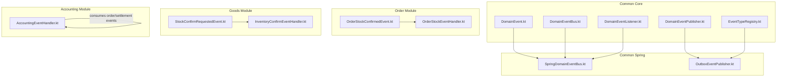
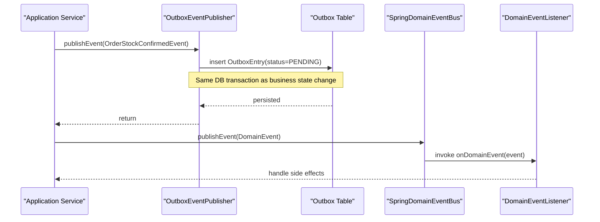
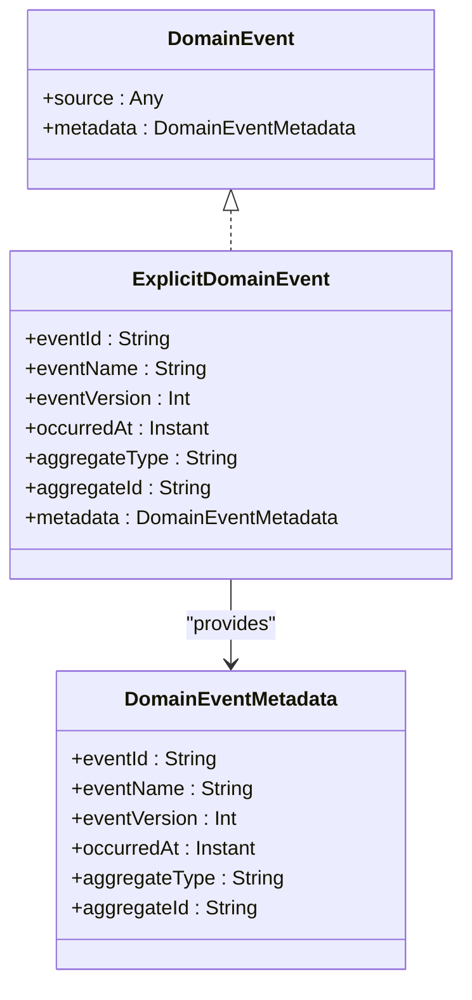
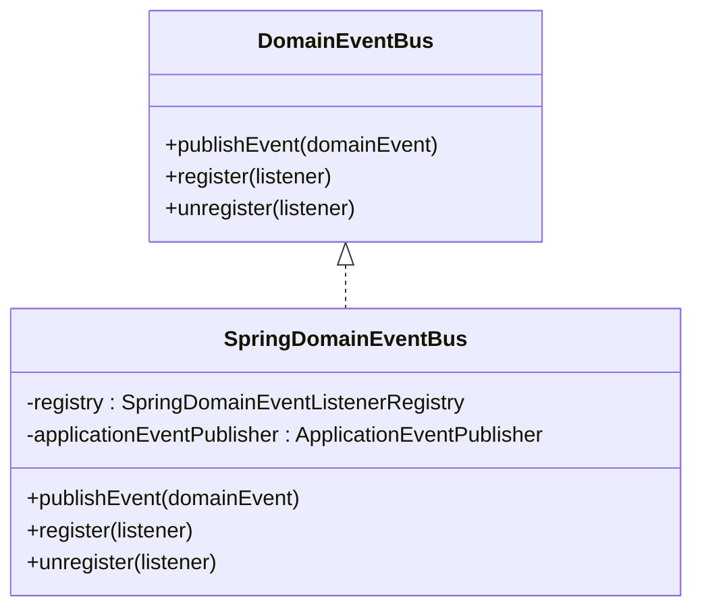
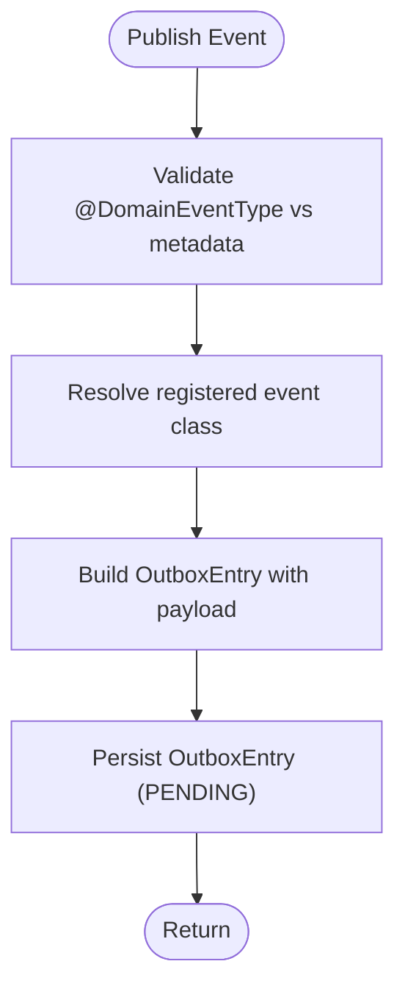
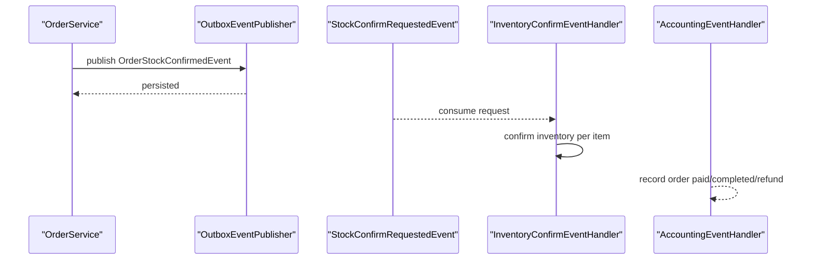
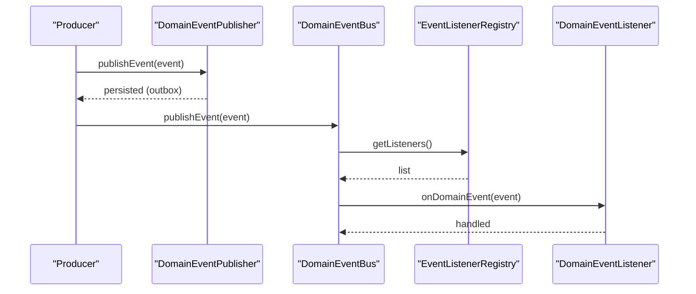
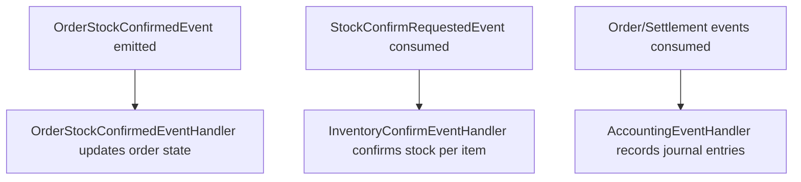
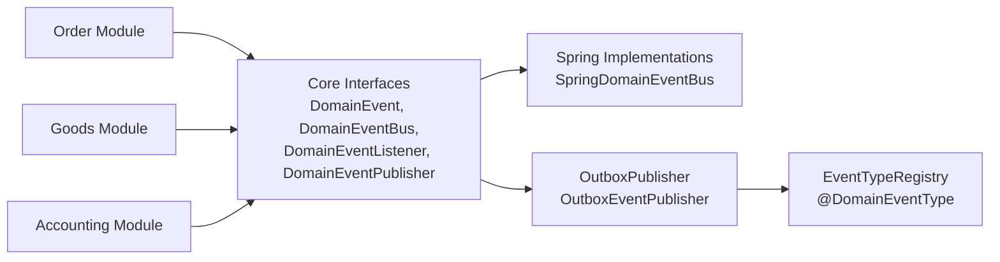

# Event-Driven Architecture

<cite>
**Referenced Files in This Document**
- [DomainEvent.kt](file://j-store-common-core/src/main/kotlin/com/jstore/common/framework/event/DomainEvent.kt)
- [DomainEventBus.kt](file://j-store-common-core/src/main/kotlin/com/jstore/common/framework/event/DomainEventBus.kt)
- [DomainEventListener.kt](file://j-store-common-core/src/main/kotlin/com/jstore/common/framework/event/DomainEventListener.kt)
- [DomainEventPublisher.kt](file://j-store-common-core/src/main/kotlin/com/jstore/common/framework/event/DomainsEventPublisher.kt)
- [SpringDomainEventBus.kt](file://j-store-common-spring/src/main/kotlin/com/jstore/common/framework/event/SpringDomainEventBus.kt)
- [OutboxEventPublisher.kt](file://j-store-common-spring/src/main/kotlin/com/jstore/common/framework/event/outbox/OutboxEventPublisher.kt)
- [EventTypeRegistry.kt](file://j-store-common-core/src/main/kotlin/com/jstore/common/framework/event/outbox/EventTypeRegistry.kt)
- [OrderStockConfirmedEvent.kt](file://j-store-order/src/main/kotlin/com/jstore/order/acl/event/OrderStockConfirmedEvent.kt)
- [StockConfirmRequestedEvent.kt](file://j-store-goods/src/main/kotlin/com/jstore/goods/acl/event/StockConfirmRequestedEvent.kt)
- [OrderStockEventHandler.kt](file://j-store-order/src/main/kotlin/com/jstore/order/service/OrderStockEventHandler.kt)
- [InventoryConfirmEventHandler.kt](file://j-store-goods/src/main/kotlin/com/jstore/goods/service/InventoryConfirmEventHandler.kt)
- [AccountingEventHandler.kt](file://j-store-accounting/src/main/kotlin/com/jstore/accounting/service/AccountingEventHandler.kt)
</cite>

## Table of Contents
1. Introduction
2. Project Structure
3. Core Components
4. Architecture Overview
5. Detailed Component Analysis
6. Dependency Analysis
7. Performance Considerations
8. Troubleshooting Guide
9. Conclusion
10. Appendices

## Introduction
This document explains J-Store’s event-driven architecture, focusing on domain event design patterns, the transactional outbox for reliable delivery, and Spring-based event publishing/consumption. It covers how orders trigger inventory updates and accounting entries, configuration options for handlers, error handling and retry strategies, and guidelines for designing new events and listeners. The goal is to make the system understandable for both technical and non-technical readers while providing concrete references to the codebase.

## Project Structure
J-Store organizes event infrastructure across shared modules and domain modules:
- Common core defines domain event abstractions and outbox primitives.
- Common Spring provides Spring integration (event bus, outbox publisher, registry).
- Domain modules define cross-context ACL events and event listeners that implement business workflows.

**Diagram sources**
- [DomainEvent.kt](file://j-store-common-core/src/main/kotlin/com/jstore/common/framework/event/DomainEvent.kt)
- [DomainEventBus.kt](file://j-store-common-core/src/main/kotlin/com/jstore/common/framework/event/DomainEventBus.kt)
- [DomainEventListener.kt](file://j-store-common-core/src/main/kotlin/com/jstore/common/framework/event/DomainEventListener.kt)
- [DomainEventPublisher.kt](file://j-store-common-core/src/main/kotlin/com/jstore/common/framework/event/DomainsEventPublisher.kt)
- [EventTypeRegistry.kt](file://j-store-common-core/src/main/kotlin/com/jstore/common/framework/event/outbox/EventTypeRegistry.kt)
- [SpringDomainEventBus.kt](file://j-store-common-spring/src/main/kotlin/com/jstore/common/framework/event/SpringDomainEventBus.kt)
- [OutboxEventPublisher.kt](file://j-store-common-spring/src/main/kotlin/com/jstore/common/framework/event/outbox/OutboxEventPublisher.kt)
- [OrderStockConfirmedEvent.kt](file://j-store-order/src/main/kotlin/com/jstore/order/acl/event/OrderStockConfirmedEvent.kt)
- [StockConfirmRequestedEvent.kt](file://j-store-goods/src/main/kotlin/com/jstore/goods/acl/event/StockConfirmRequestedEvent.kt)
- [OrderStockEventHandler.kt](file://j-store-order/src/main/kotlin/com/jstore/order/service/OrderStockEventHandler.kt)
- [InventoryConfirmEventHandler.kt](file://j-store-goods/src/main/kotlin/com/jstore/goods/service/InventoryConfirmEventHandler.kt)
- [AccountingEventHandler.kt](file://j-store-accounting/src/main/kotlin/com/jstore/accounting/service/AccountingEventHandler.kt)

**Section sources**
- [DomainEvent.kt](file://j-store-common-core/src/main/kotlin/com/jstore/common/framework/event/DomainEvent.kt)
- [DomainEventBus.kt](file://j-store-common-core/src/main/kotlin/com/jstore/common/framework/event/DomainEventBus.kt)
- [DomainEventListener.kt](file://j-store-common-core/src/main/kotlin/com/jstore/common/framework/event/DomainEventListener.kt)
- [DomainEventPublisher.kt](file://j-store-common-core/src/main/kotlin/com/jstore/common/framework/event/DomainsEventPublisher.kt)
- [SpringDomainEventBus.kt](file://j-store-common-spring/src/main/kotlin/com/jstore/common/framework/event/SpringDomainEventBus.kt)
- [OutboxEventPublisher.kt](file://j-store-common-spring/src/main/kotlin/com/jstore/common/framework/event/outbox/OutboxEventPublisher.kt)
- [EventTypeRegistry.kt](file://j-store-common-core/src/main/kotlin/com/jstore/common/framework/event/outbox/EventTypeRegistry.kt)
- [OrderStockConfirmedEvent.kt](file://j-store-order/src/main/kotlin/com/jstore/order/acl/event/OrderStockConfirmedEvent.kt)
- [StockConfirmRequestedEvent.kt](file://j-store-goods/src/main/kotlin/com/jstore/goods/acl/event/StockConfirmRequestedEvent.kt)
- [OrderStockEventHandler.kt](file://j-store-order/src/main/kotlin/com/jstore/order/service/OrderStockEventHandler.kt)
- [InventoryConfirmEventHandler.kt](file://j-store-goods/src/main/kotlin/com/jstore/goods/service/InventoryConfirmEventHandler.kt)
- [AccountingEventHandler.kt](file://j-store-accounting/src/main/kotlin/com/jstore/accounting/service/AccountingEventHandler.kt)

## Core Components
- DomainEvent and ExplicitDomainEvent: Stable envelope metadata including eventId, eventName, eventVersion, occurredAt, aggregateType, and aggregateId. Metadata is derived from explicit fields or computed via a stable id generator.
- DomainEventBus: In-process event dispatcher interface; does not guarantee transactional delivery.
- DomainEventListener: Pure domain listener with a stable listenerId used as consumer key for idempotent processing.
- DomainEventPublisher: Transactional publisher abstraction; default production implementation uses the outbox pattern.
- SpringDomainEventBus: Bridges DomainEventBus to Spring ApplicationEventPublisher and registers/unregisters listeners via Spring registry.
- OutboxEventPublisher: Writes serialized events into an outbox table within the same database transaction as business data, ensuring atomicity between state changes and event emission.
- EventTypeRegistry and @DomainEventType: Startup registration and validation of event name/version mappings to classes.

Key responsibilities:
- Decouple producers from consumers using explicit domain events.
- Ensure reliable delivery through outbox persistence and scheduled relay.
- Provide idempotency via stable eventId and listenerId.

**Section sources**
- [DomainEvent.kt](file://j-store-common-core/src/main/kotlin/com/jstore/common/framework/event/DomainEvent.kt)
- [DomainEventBus.kt](file://j-store-common-core/src/main/kotlin/com/jstore/common/framework/event/DomainEventBus.kt)
- [DomainEventListener.kt](file://j-store-common-core/src/main/kotlin/com/jstore/common/framework/event/DomainEventListener.kt)
- [DomainEventPublisher.kt](file://j-store-common-core/src/main/kotlin/com/jstore/common/framework/event/DomainsEventPublisher.kt)
- [SpringDomainEventBus.kt](file://j-store-common-spring/src/main/kotlin/com/jstore/common/framework/event/SpringDomainEventBus.kt)
- [OutboxEventPublisher.kt](file://j-store-common-spring/src/main/kotlin/com/jstore/common/framework/event/outbox/OutboxEventPublisher.kt)
- [EventTypeRegistry.kt](file://j-store-common-core/src/main/kotlin/com/jstore/common/framework/event/outbox/EventTypeRegistry.kt)

## Architecture Overview
The event-driven flow spans multiple bounded contexts:
- Order context emits ACL events when stock reservation succeeds.
- Goods context consumes these events to confirm inventory deductions.
- Accounting context listens to order lifecycle events to record journal entries.

**Diagram sources**
- [OutboxEventPublisher.kt](file://j-store-common-spring/src/main/kotlin/com/jstore/common/framework/event/outbox/OutboxEventPublisher.kt)
- [SpringDomainEventBus.kt](file://j-store-common-spring/src/main/kotlin/com/jstore/common/framework/event/SpringDomainEventBus.kt)
- [OrderStockConfirmedEvent.kt](file://j-store-order/src/main/kotlin/com/jstore/order/acl/event/OrderStockConfirmedEvent.kt)

## Detailed Component Analysis

### Domain Events and Envelope
- ExplicitDomainEvent enforces stable identifiers and timestamps.
- stableDomainEventId ensures deterministic eventId generation based on eventName, version, aggregateType, aggregateId, and occurredAt.
- DomainEventMetadata centralizes envelope fields for outbox storage and idempotent consumption.

**Diagram sources**
- [DomainEvent.kt](file://j-store-common-core/src/main/kotlin/com/jstore/common/framework/event/DomainEvent.kt)

**Section sources**
- [DomainEvent.kt](file://j-store-common-core/src/main/kotlin/com/jstore/common/framework/event/DomainEvent.kt)

### Spring-Based Event Bus
- SpringDomainEventBus delegates publishEvent to Spring ApplicationEventPublisher and manages listener registration via SpringDomainEventListenerRegistry.
- Keeps domain logic free of framework dependencies by using DomainEventBus interface.

**Diagram sources**
- [DomainEventBus.kt](file://j-store-common-core/src/main/kotlin/com/jstore/common/framework/event/DomainEventBus.kt)
- [SpringDomainEventBus.kt](file://j-store-common-spring/src/main/kotlin/com/jstore/common/framework/event/SpringDomainEventBus.kt)

**Section sources**
- [DomainEventBus.kt](file://j-store-common-core/src/main/kotlin/com/jstore/common/framework/event/DomainEventBus.kt)
- [SpringDomainEventBus.kt](file://j-store-common-spring/src/main/kotlin/com/jstore/common/framework/event/SpringDomainEventBus.kt)

### Outbox Pattern Implementation
- OutboxEventPublisher serializes events and persists them as OutboxEntry with status PENDING inside a mandatory transaction.
- Validates @DomainEventType annotation against metadata and startup registration to prevent drift.
- Uses SnowFlakSequence for unique outbox entry ids and stable eventId from event metadata.

**Diagram sources**
- [OutboxEventPublisher.kt](file://j-store-common-spring/src/main/kotlin/com/jstore/common/framework/event/outbox/OutboxEventPublisher.kt)
- [EventTypeRegistry.kt](file://j-store-common-core/src/main/kotlin/com/jstore/common/framework/event/outbox/EventTypeRegistry.kt)

**Section sources**
- [OutboxEventPublisher.kt](file://j-store-common-spring/src/main/kotlin/com/jstore/common/framework/event/outbox/OutboxEventPublisher.kt)
- [EventTypeRegistry.kt](file://j-store-common-core/src/main/kotlin/com/jstore/common/framework/event/outbox/EventTypeRegistry.kt)

### Cross-Context Communication Patterns
- Order context emits OrderStockConfirmedEvent when stock reservation succeeds.
- Goods context listens to StockConfirmRequestedEvent to convert pre-reservations to confirmed deductions.
- Accounting context listens to order lifecycle events to create journal entries.

**Diagram sources**
- [OrderStockConfirmedEvent.kt](file://j-store-order/src/main/kotlin/com/jstore/order/acl/event/OrderStockConfirmedEvent.kt)
- [StockConfirmRequestedEvent.kt](file://j-store-goods/src/main/kotlin/com/jstore/goods/acl/event/StockConfirmRequestedEvent.kt)
- [InventoryConfirmEventHandler.kt](file://j-store-goods/src/main/kotlin/com/jstore/goods/service/InventoryConfirmEventHandler.kt)
- [AccountingEventHandler.kt](file://j-store-accounting/src/main/kotlin/com/jstore/accounting/service/AccountingEventHandler.kt)

**Section sources**
- [OrderStockConfirmedEvent.kt](file://j-store-order/src/main/kotlin/com/jstore/order/acl/event/OrderStockConfirmedEvent.kt)
- [StockConfirmRequestedEvent.kt](file://j-store-goods/src/main/kotlin/com/jstore/goods/acl/event/StockConfirmRequestedEvent.kt)
- [InventoryConfirmEventHandler.kt](file://j-store-goods/src/main/kotlin/com/jstore/goods/service/InventoryConfirmEventHandler.kt)
- [AccountingEventHandler.kt](file://j-store-accounting/src/main/kotlin/com/jstore/accounting/service/AccountingEventHandler.kt)

### Event Publishing and Consumption Flow
- Producers call DomainEventPublisher.publishEvent within a transaction to persist outbox entries.
- Consumers implement DomainEventListener<T>, exposing listenerId for idempotent tracking.
- SpringDomainEventBus dispatches events to registered listeners.

**Diagram sources**
- [DomainEventPublisher.kt](file://j-store-common-core/src/main/kotlin/com/jstore/common/framework/event/DomainsEventPublisher.kt)
- [SpringDomainEventBus.kt](file://j-store-common-spring/src/main/kotlin/com/jstore/common/framework/event/SpringDomainEventBus.kt)
- [DomainEventListener.kt](file://j-store-common-core/src/main/kotlin/com/jstore/common/framework/event/DomainEventListener.kt)

**Section sources**
- [DomainEventPublisher.kt](file://j-store-common-core/src/main/kotlin/com/jstore/common/framework/event/DomainsEventPublisher.kt)
- [SpringDomainEventBus.kt](file://j-store-common-spring/src/main/kotlin/com/jstore/common/framework/event/SpringDomainEventBus.kt)
- [DomainEventListener.kt](file://j-store-common-core/src/main/kotlin/com/jstore/common/framework/event/DomainEventListener.kt)

### Concrete Examples: Orders → Inventory → Accounting
- Order emits OrderStockConfirmedEvent upon successful stock reservation.
- Goods handler processes StockConfirmRequestedEvent to finalize inventory deduction per SKU.
- Accounting handlers record order paid, completed, refund approved, and settlement paid events into journal entries.

**Diagram sources**
- [OrderStockConfirmedEvent.kt](file://j-store-order/src/main/kotlin/com/jstore/order/acl/event/OrderStockConfirmedEvent.kt)
- [OrderStockEventHandler.kt](file://j-store-order/src/main/kotlin/com/jstore/order/service/OrderStockEventHandler.kt)
- [StockConfirmRequestedEvent.kt](file://j-store-goods/src/main/kotlin/com/jstore/goods/acl/event/StockConfirmRequestedEvent.kt)
- [InventoryConfirmEventHandler.kt](file://j-store-goods/src/main/kotlin/com/jstore/goods/service/InventoryConfirmEventHandler.kt)
- [AccountingEventHandler.kt](file://j-store-accounting/src/main/kotlin/com/jstore/accounting/service/AccountingEventHandler.kt)

**Section sources**
- [OrderStockConfirmedEvent.kt](file://j-store-order/src/main/kotlin/com/jstore/order/acl/event/OrderStockConfirmedEvent.kt)
- [OrderStockEventHandler.kt](file://j-store-order/src/main/kotlin/com/jstore/order/service/OrderStockEventHandler.kt)
- [StockConfirmRequestedEvent.kt](file://j-store-goods/src/main/kotlin/com/jstore/goods/acl/event/StockConfirmRequestedEvent.kt)
- [InventoryConfirmEventHandler.kt](file://j-store-goods/src/main/kotlin/com/jstore/goods/service/InventoryConfirmEventHandler.kt)
- [AccountingEventHandler.kt](file://j-store-accounting/src/main/kotlin/com/jstore/accounting/service/AccountingEventHandler.kt)

## Dependency Analysis
- Domain abstractions are decoupled from Spring; implementations live in common-spring.
- Outbox relies on EventTypeRegistry for safe serialization/deserialization contracts.
- Domain modules depend only on interfaces and shared event types, enabling cross-context communication without tight coupling.

**Diagram sources**
- [DomainEvent.kt](file://j-store-common-core/src/main/kotlin/com/jstore/common/framework/event/DomainEvent.kt)
- [DomainEventBus.kt](file://j-store-common-core/src/main/kotlin/com/jstore/common/framework/event/DomainEventBus.kt)
- [DomainEventListener.kt](file://j-store-common-core/src/main/kotlin/com/jstore/common/framework/event/DomainEventListener.kt)
- [DomainEventPublisher.kt](file://j-store-common-core/src/main/kotlin/com/jstore/common/framework/event/DomainsEventPublisher.kt)
- [SpringDomainEventBus.kt](file://j-store-common-spring/src/main/kotlin/com/jstore/common/framework/event/SpringDomainEventBus.kt)
- [OutboxEventPublisher.kt](file://j-store-common-spring/src/main/kotlin/com/jstore/common/framework/event/outbox/OutboxEventPublisher.kt)
- [EventTypeRegistry.kt](file://j-store-common-core/src/main/kotlin/com/jstore/common/framework/event/outbox/EventTypeRegistry.kt)

**Section sources**
- [DomainEvent.kt](file://j-store-common-core/src/main/kotlin/com/jstore/common/framework/event/DomainEvent.kt)
- [DomainEventBus.kt](file://j-store-common-core/src/main/kotlin/com/jstore/common/framework/event/DomainEventBus.kt)
- [DomainEventListener.kt](file://j-store-common-core/src/main/kotlin/com/jstore/common/framework/event/DomainEventListener.kt)
- [DomainEventPublisher.kt](file://j-store-common-core/src/main/kotlin/com/jstore/common/framework/event/DomainsEventPublisher.kt)
- [SpringDomainEventBus.kt](file://j-store-common-spring/src/main/kotlin/com/jstore/common/framework/event/SpringDomainEventBus.kt)
- [OutboxEventPublisher.kt](file://j-store-common-spring/src/main/kotlin/com/jstore/common/framework/event/outbox/OutboxEventPublisher.kt)
- [EventTypeRegistry.kt](file://j-store-common-core/src/main/kotlin/com/jstore/common/framework/event/outbox/EventTypeRegistry.kt)

## Performance Considerations
- Outbox persistence occurs within the same transaction as business writes, avoiding extra round-trips during publish.
- Idempotent eventId and listenerId reduce duplicate processing overhead.
- Scheduled relay should batch outbox reads and writes to minimize lock contention.
- Keep event payloads minimal to reduce serialization cost and storage growth.

[No sources needed since this section provides general guidance]

## Troubleshooting Guide
- Validation failures: Ensure @DomainEventType matches event metadata (name and version) and is registered at startup.
- Serialization errors: Confirm EventSerializer supports event types and versions; check EventTypeRegistry resolution.
- Dead letter handling: Inspect outbox dead-letter entries and requeue after fixing consumer issues.
- Idempotency: Use eventId and listenerId to detect duplicates; ensure consumers are idempotent.
- Monitoring: Track outbox queue depth, retry counts, and consumer lag; log handler execution paths.

**Section sources**
- [OutboxEventPublisher.kt](file://j-store-common-spring/src/main/kotlin/com/jstore/common/framework/event/outbox/OutboxEventPublisher.kt)
- [EventTypeRegistry.kt](file://j-store-common-core/src/main/kotlin/com/jstore/common/framework/event/outbox/EventTypeRegistry.kt)

## Conclusion
J-Store’s event-driven architecture leverages clear domain event envelopes, a Spring-based event bus, and a robust outbox implementation to achieve reliable, decoupled, and eventually consistent interactions across bounded contexts. By following the provided patterns and guidelines, teams can design scalable event flows, maintain strong consistency guarantees where needed, and operate confidently with monitoring and idempotency.

[No sources needed since this section summarizes without analyzing specific files]

## Appendices

### Guidelines for Designing New Domain Events
- Implement ExplicitDomainEvent with stable metadata fields.
- Annotate with @DomainEventType specifying name and version.
- Register event type at startup via EventTypeRegistry.
- Ensure eventId is deterministic using stableDomainEventId.
- Keep payloads focused and versioned to support evolution.

**Section sources**
- [DomainEvent.kt](file://j-store-common-core/src/main/kotlin/com/jstore/common/framework/event/DomainEvent.kt)
- [EventTypeRegistry.kt](file://j-store-common-core/src/main/kotlin/com/jstore/common/framework/event/outbox/EventTypeRegistry.kt)

### Guidelines for Implementing Event Listeners
- Implement DomainEventListener<T> with a stable listenerId.
- Handle events idempotently using eventId and listenerId.
- Log important steps and propagate failures appropriately.
- Avoid long-running work; consider offloading heavy tasks.

**Section sources**
- [DomainEventListener.kt](file://j-store-common-core/src/main/kotlin/com/jstore/common/framework/event/DomainEventListener.kt)

### Configuration Options and Error Handling
- OutboxEventPublisher requires mandatory transactions; ensure callers use appropriate transaction boundaries.
- EventTypeRegistry validates annotations and registrations; mismatches throw descriptive exceptions.
- Dead letter queues and cleanup policies should be configured via application properties (e.g., retention days, batch sizes).

**Section sources**
- [OutboxEventPublisher.kt](file://j-store-common-spring/src/main/kotlin/com/jstore/common/framework/event/outbox/OutboxEventPublisher.kt)
- [EventTypeRegistry.kt](file://j-store-common-core/src/main/kotlin/com/jstore/common/framework/event/outbox/EventTypeRegistry.kt)

### Relationship Between Domain Events and Eventual Consistency
- Domain events model facts that drive downstream state changes asynchronously.
- Outbox ensures durable emission aligned with business transactions.
- Consumers update their aggregates eventually, maintaining loose coupling and resilience.

[No sources needed since this section provides conceptual explanation]