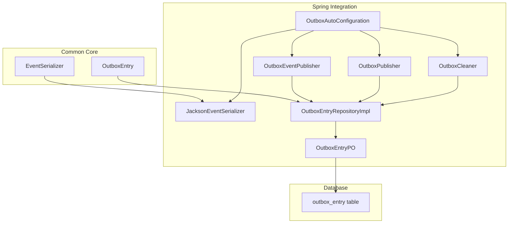
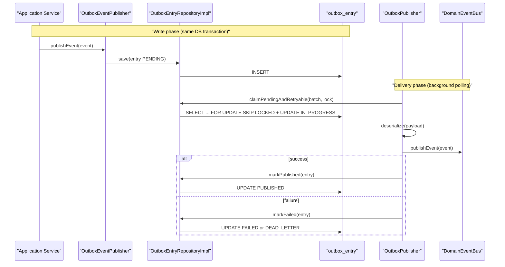
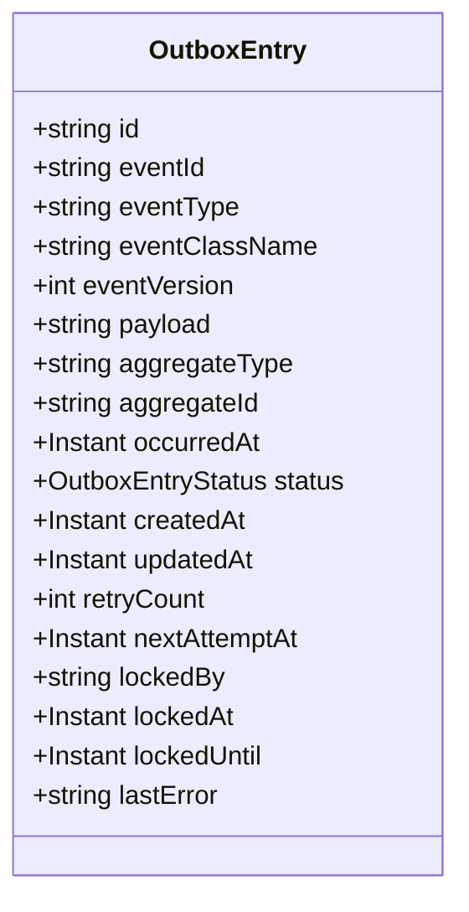
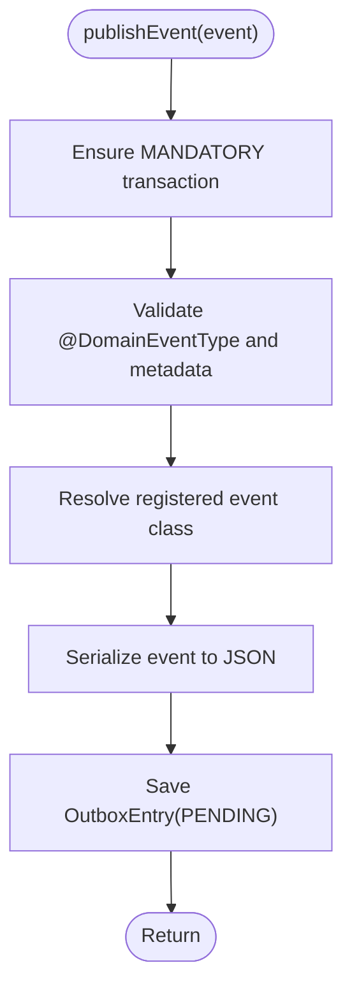
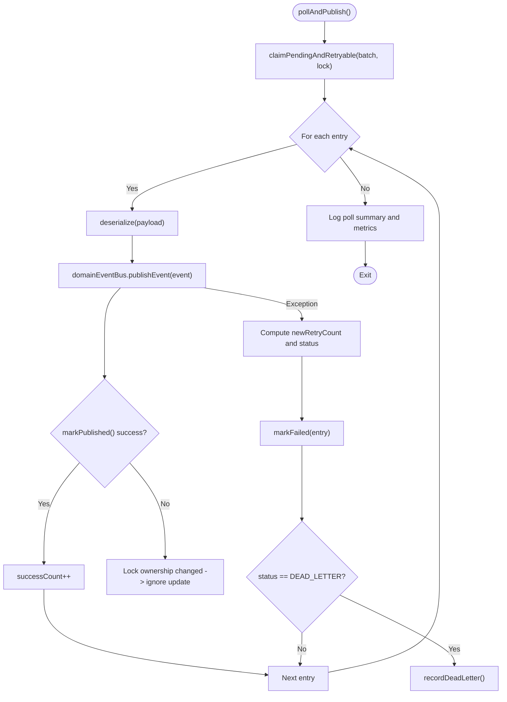
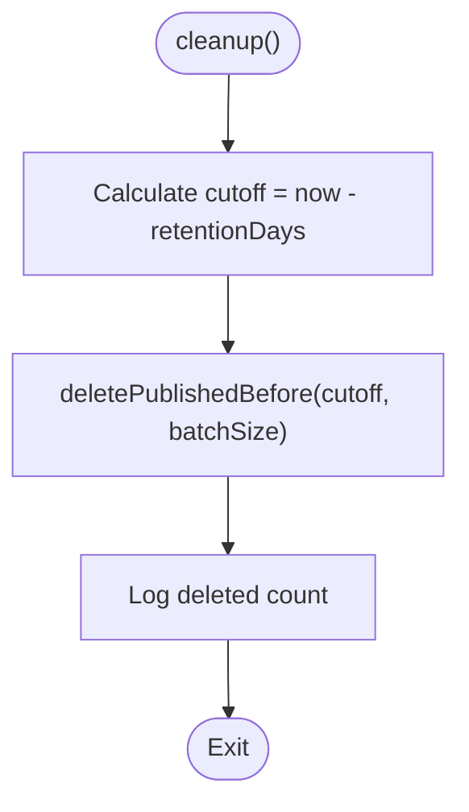
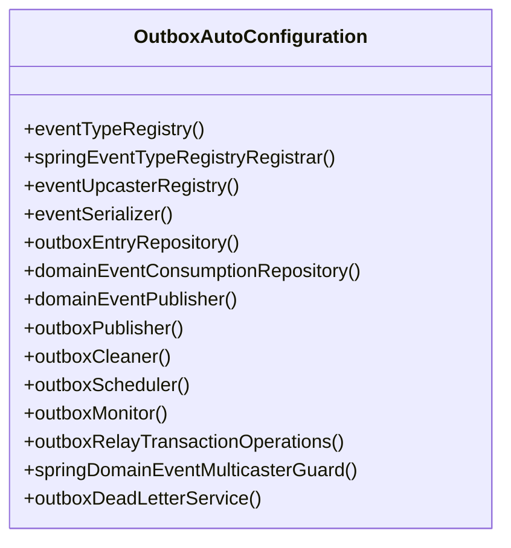
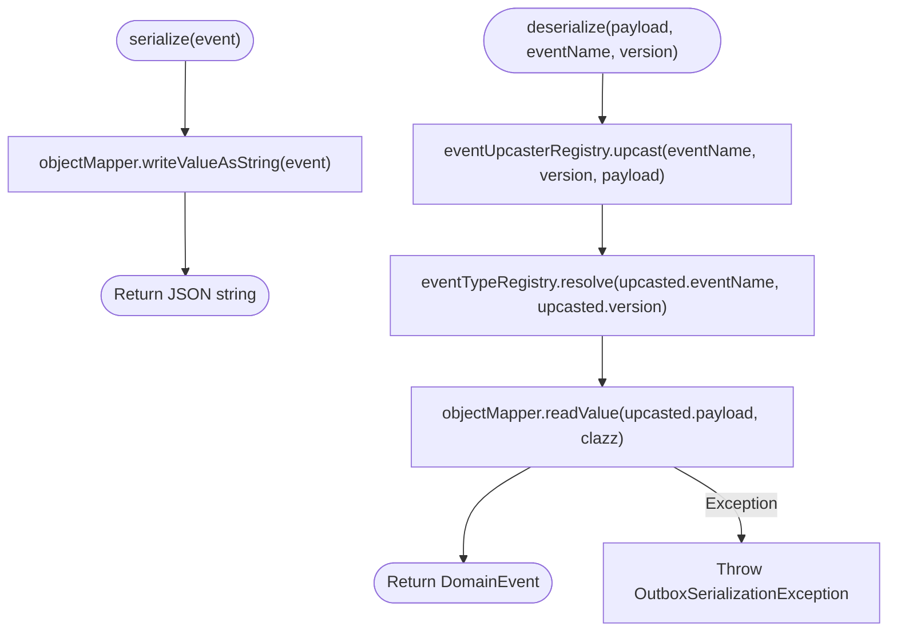
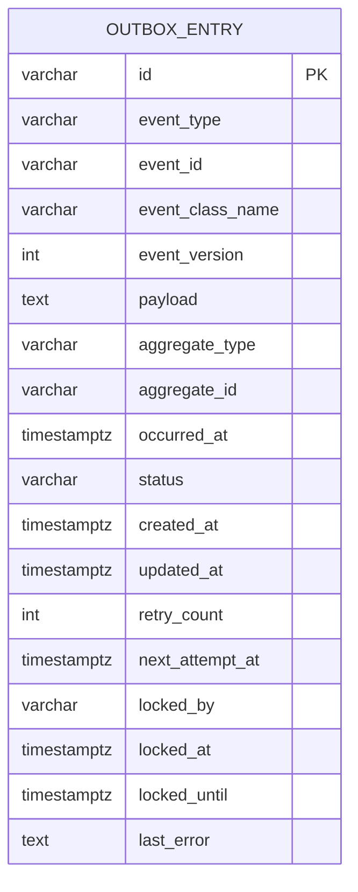
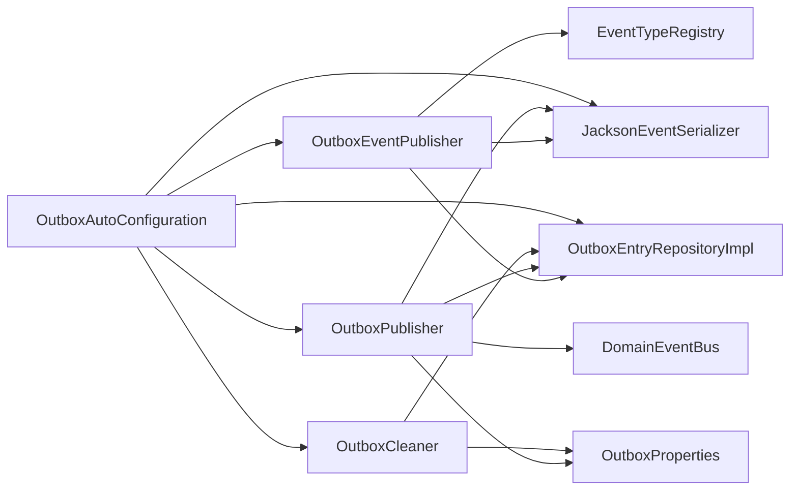

# Outbox Pattern Implementation

<cite>
**Referenced Files in This Document**
- [OutboxEntry.kt](file://j-store-common-core/src/main/kotlin/com/jstore/common/framework/event/outbox/OutboxEntry.kt)
- [OutboxEventPublisher.kt](file://j-store-common-spring/src/main/kotlin/com/jstore/common/framework/event/outbox/OutboxEventPublisher.kt)
- [OutboxPublisher.kt](file://j-store-common-spring/src/main/kotlin/com/jstore/common/framework/event/outbox/OutboxPublisher.kt)
- [OutboxCleaner.kt](file://j-store-common-spring/src/main/kotlin/com/jstore/common/framework/event/outbox/OutboxCleaner.kt)
- [OutboxProperties.kt](file://j-store-common-spring/src/main/kotlin/com/jstore/common/framework/event/outbox/OutboxProperties.kt)
- [OutboxAutoConfiguration.kt](file://j-store-common-spring/src/main/kotlin/com/jstore/common/framework/event/outbox/OutboxAutoConfiguration.kt)
- [JacksonEventSerializer.kt](file://j-store-common-spring/src/main/kotlin/com/jstore/common/framework/event/outbox/JacksonEventSerializer.kt)
- [EventSerializer.kt](file://j-store-common-core/src/main/kotlin/com/jstore/common/framework/event/outbox/EventSerializer.kt)
- [OutboxEntryPO.kt](file://j-store-common-spring/src/main/kotlin/com/jstore/common/framework/event/outbox/persistence/OutboxEntryPO.kt)
- [OutboxEntryRepositoryImpl.kt](file://j-store-common-spring/src/main/kotlin/com/jstore/common/framework/event/outbox/persistence/OutboxEntryRepositoryImpl.kt)
- [06-outbox-entry.sql](file://docker/postgres/init/06-outbox-entry.sql)
- [init_j_store_boot_schema.sql](file://j-store-boot/src/main/resources/db/init/init_j_store_boot_schema.sql)
- [V20260507__baseline_j_store_boot_schema.sql](file://j-store-boot/src/main/resources/db/migration/V20260507__baseline_j_store_boot_schema.sql)
</cite>

## Table of Contents
1. [Introduction](#introduction)
2. [Project Structure](#project-structure)
3. [Core Components](#core-components)
4. [Architecture Overview](#architecture-overview)
5. [Detailed Component Analysis](#detailed-component-analysis)
6. [Dependency Analysis](#dependency-analysis)
7. [Performance Considerations](#performance-considerations)
8. [Troubleshooting Guide](#troubleshooting-guide)
9. [Conclusion](#conclusion)
10. [Appendices](#appendices)

## Introduction
This document explains J-Store’s outbox pattern implementation for reliable, transactional event delivery. It covers the OutboxEntry entity, transactional publishing, eventual consistency guarantees, configuration and serialization with Jackson, database persistence, background processing via OutboxCleaner, error handling and dead letter management, performance considerations, monitoring, troubleshooting, and migration guidance for existing services.

## Project Structure
The outbox implementation spans core domain models and Spring-based infrastructure:
- Core model and interfaces live in j-store-common-core (OutboxEntry, EventSerializer).
- Spring integration, configuration, scheduler, and persistence are in j-store-common-spring (OutboxAutoConfiguration, OutboxEventPublisher, OutboxPublisher, OutboxCleaner, JacksonEventSerializer, repository implementation, PO mapping).
- Database schema is defined in Docker init scripts and application migrations.

**Diagram sources**
- [OutboxEntry.kt](file://j-store-common-core/src/main/kotlin/com/jstore/common/framework/event/outbox/OutboxEntry.kt)
- [EventSerializer.kt](file://j-store-common-core/src/main/kotlin/com/jstore/common/framework/event/outbox/EventSerializer.kt)
- [OutboxEventPublisher.kt](file://j-store-common-spring/src/main/kotlin/com/jstore/common/framework/event/outbox/OutboxEventPublisher.kt)
- [OutboxPublisher.kt](file://j-store-common-spring/src/main/kotlin/com/jstore/common/framework/event/outbox/OutboxPublisher.kt)
- [OutboxCleaner.kt](file://j-store-common-spring/src/main/kotlin/com/jstore/common/framework/event/outbox/OutboxCleaner.kt)
- [OutboxAutoConfiguration.kt](file://j-store-common-spring/src/main/kotlin/com/jstore/common/framework/event/outbox/OutboxAutoConfiguration.kt)
- [JacksonEventSerializer.kt](file://j-store-common-spring/src/main/kotlin/com/jstore/common/framework/event/outbox/JacksonEventSerializer.kt)
- [OutboxEntryRepositoryImpl.kt](file://j-store-common-spring/src/main/kotlin/com/jstore/common/framework/event/outbox/persistence/OutboxEntryRepositoryImpl.kt)
- [OutboxEntryPO.kt](file://j-store-common-spring/src/main/kotlin/com/jstore/common/framework/event/outbox/persistence/OutboxEntryPO.kt)

**Section sources**
- [OutboxEntry.kt](file://j-store-common-core/src/main/kotlin/com/jstore/common/framework/event/outbox/OutboxEntry.kt)
- [OutboxAutoConfiguration.kt](file://j-store-common-spring/src/main/kotlin/com/jstore/common/framework/event/outbox/OutboxAutoConfiguration.kt)
- [OutboxEntryRepositoryImpl.kt](file://j-store-common-spring/src/main/kotlin/com/jstore/common/framework/event/outbox/persistence/OutboxEntryRepositoryImpl.kt)
- [OutboxEntryPO.kt](file://j-store-common-spring/src/main/kotlin/com/jstore/common/framework/event/outbox/persistence/OutboxEntryPO.kt)

## Core Components
- OutboxEntry: Domain model representing a pending or processed event record with metadata, status, retry counters, locking fields, and timestamps.
- OutboxEventPublisher: Transactional publisher that persists events as PENDING entries within the same business transaction.
- OutboxPublisher: Background worker that claims, deserializes, publishes to DomainEventBus, and updates statuses with retry and dead-letter logic.
- OutboxCleaner: Scheduled job that purges old PUBLISHED entries while preserving DEAD_LETTER records.
- JacksonEventSerializer: JSON serialization/deserialization with type registry and upcasting support.
- Persistence layer: JPA entity and repository implementation using native SQL for safe claiming and atomic state transitions.

**Section sources**
- [OutboxEntry.kt](file://j-store-common-core/src/main/kotlin/com/jstore/common/framework/event/outbox/OutboxEntry.kt)
- [OutboxEventPublisher.kt](file://j-store-common-spring/src/main/kotlin/com/jstore/common/framework/event/outbox/OutboxEventPublisher.kt)
- [OutboxPublisher.kt](file://j-store-common-spring/src/main/kotlin/com/jstore/common/framework/event/outbox/OutboxPublisher.kt)
- [OutboxCleaner.kt](file://j-store-common-spring/src/main/kotlin/com/jstore/common/framework/event/outbox/OutboxCleaner.kt)
- [JacksonEventSerializer.kt](file://j-store-common-spring/src/main/kotlin/com/jstore/common/framework/event/outbox/JacksonEventSerializer.kt)
- [OutboxEntryRepositoryImpl.kt](file://j-store-common-spring/src/main/kotlin/com/jstore/common/framework/event/outbox/persistence/OutboxEntryRepositoryImpl.kt)

## Architecture Overview
The outbox pattern ensures that domain events are persisted atomically with business data. A background process later delivers them reliably with retries and dead-letter handling.

**Diagram sources**
- [OutboxEventPublisher.kt](file://j-store-common-spring/src/main/kotlin/com/jstore/common/framework/event/outbox/OutboxEventPublisher.kt)
- [OutboxPublisher.kt](file://j-store-common-spring/src/main/kotlin/com/jstore/common/framework/event/outbox/OutboxPublisher.kt)
- [OutboxEntryRepositoryImpl.kt](file://j-store-common-spring/src/main/kotlin/com/jstore/common/framework/event/outbox/persistence/OutboxEntryRepositoryImpl.kt)

## Detailed Component Analysis

### OutboxEntry Entity Model
OutboxEntry captures all necessary metadata for reliable delivery and observability:
- Identity and typing: id, eventId, eventType, eventClassName, eventVersion
- Payload: payload (JSON)
- Aggregate context: aggregateType, aggregateId
- Lifecycle: status, createdAt, updatedAt, occurredAt
- Retry and scheduling: retryCount, nextAttemptAt
- Concurrency control: lockedBy, lockedAt, lockedUntil
- Diagnostics: lastError

**Diagram sources**
- [OutboxEntry.kt](file://j-store-common-core/src/main/kotlin/com/jstore/common/framework/event/outbox/OutboxEntry.kt)

**Section sources**
- [OutboxEntry.kt](file://j-store-common-core/src/main/kotlin/com/jstore/common/framework/event/outbox/OutboxEntry.kt)

### Transactional Event Publishing (OutboxEventPublisher)
- Enforces mandatory transaction context to ensure events are written alongside business data.
- Validates @DomainEventType annotations and metadata against registered types and versions.
- Serializes events via EventSerializer and persists as PENDING.

**Diagram sources**
- [OutboxEventPublisher.kt](file://j-store-common-spring/src/main/kotlin/com/jstore/common/framework/event/outbox/OutboxEventPublisher.kt)

**Section sources**
- [OutboxEventPublisher.kt](file://j-store-common-spring/src/main/kotlin/com/jstore/common/framework/event/outbox/OutboxEventPublisher.kt)

### Background Delivery (OutboxPublisher)
- Claims eligible entries (PENDING, retryable FAILED, or expired IN_PROGRESS) with row-level locking and skip-locked semantics.
- Deserializes events, publishes through DomainEventBus, and atomically marks as PUBLISHED on success.
- On failure, increments retry count; if max reached, moves to DEAD_LETTER; otherwise sets FAILED with exponential backoff.
- Records metrics and logs diagnostics.

**Diagram sources**
- [OutboxPublisher.kt](file://j-store-common-spring/src/main/kotlin/com/jstore/common/framework/event/outbox/OutboxPublisher.kt)

**Section sources**
- [OutboxPublisher.kt](file://j-store-common-spring/src/main/kotlin/com/jstore/common/framework/event/outbox/OutboxPublisher.kt)

### Cleanup Job (OutboxCleaner)
- Deletes PUBLISHED entries older than retentionDays in batches to avoid long transactions.
- Never deletes DEAD_LETTER entries; they require manual intervention.

**Diagram sources**
- [OutboxCleaner.kt](file://j-store-common-spring/src/main/kotlin/com/jstore/common/framework/event/outbox/OutboxCleaner.kt)

**Section sources**
- [OutboxCleaner.kt](file://j-store-common-spring/src/main/kotlin/com/jstore/common/framework/event/outbox/OutboxCleaner.kt)

### Configuration and Auto-configuration (OutboxProperties, OutboxAutoConfiguration)
- OutboxProperties defines toggles and tuning parameters such as enabled, pollingInterval, batchSize, maxRetryCount, retry delays, lock timeout, workerId, retentionDays, cleanup batch size, event type scan packages, and async multicaster behavior.
- OutboxAutoConfiguration wires beans when enabled:
  - EventTypeRegistry and SpringEventTypeRegistryRegistrar
  - EventUpcasterRegistry and JacksonEventSerializer
  - OutboxEntryRepository and DomainEventConsumptionRepository
  - OutboxEventPublisher replacing default DomainEventPublisher
  - OutboxPublisher and OutboxCleaner
  - OutboxScheduler to drive polling and cleanup
  - OutboxMonitor (Micrometer-backed if available)
  - OutboxRelayTransactionOperations and SpringDomainEventMulticasterGuard
  - OutboxDeadLetterService

**Diagram sources**
- [OutboxAutoConfiguration.kt](file://j-store-common-spring/src/main/kotlin/com/jstore/common/framework/event/outbox/OutboxAutoConfiguration.kt)

**Section sources**
- [OutboxProperties.kt](file://j-store-common-spring/src/main/kotlin/com/jstore/common/framework/event/outbox/OutboxProperties.kt)
- [OutboxAutoConfiguration.kt](file://j-store-common-spring/src/main/kotlin/com/jstore/common/framework/event/outbox/OutboxAutoConfiguration.kt)

### Serialization Strategy (JacksonEventSerializer)
- Uses ObjectMapper to serialize events to JSON.
- During deserialization, applies event upcasting then resolves the concrete class from EventTypeRegistry.
- Throws OutboxSerializationException with contextual details on failures.

**Diagram sources**
- [JacksonEventSerializer.kt](file://j-store-common-spring/src/main/kotlin/com/jstore/common/framework/event/outbox/JacksonEventSerializer.kt)

**Section sources**
- [JacksonEventSerializer.kt](file://j-store-common-spring/src/main/kotlin/com/jstore/common/framework/event/outbox/JacksonEventSerializer.kt)
- [EventSerializer.kt](file://j-store-common-core/src/main/kotlin/com/jstore/common/framework/event/outbox/EventSerializer.kt)

### Database Persistence and Schema
- OutboxEntryPO maps to outbox_entry table with comprehensive columns for identity, typing, payload, aggregate context, lifecycle, retry/backoff, locking, and diagnostics.
- Repository uses native SQL for safe claiming with SKIP LOCKED and atomic state transitions.
- Indexes optimize polling and cleanup queries.

**Diagram sources**
- [OutboxEntryPO.kt](file://j-store-common-spring/src/main/kotlin/com/jstore/common/framework/event/outbox/persistence/OutboxEntryPO.kt)
- [06-outbox-entry.sql](file://docker/postgres/init/06-outbox-entry.sql)
- [init_j_store_boot_schema.sql](file://j-store-boot/src/main/resources/db/init/init_j_store_boot_schema.sql)
- [V20260507__baseline_j_store_boot_schema.sql](file://j-store-boot/src/main/resources/db/migration/V20260507__baseline_j_store_boot_schema.sql)

**Section sources**
- [OutboxEntryPO.kt](file://j-store-common-spring/src/main/kotlin/com/jstore/common/framework/event/outbox/persistence/OutboxEntryPO.kt)
- [OutboxEntryRepositoryImpl.kt](file://j-store-common-spring/src/main/kotlin/com/jstore/common/framework/event/outbox/persistence/OutboxEntryRepositoryImpl.kt)
- [06-outbox-entry.sql](file://docker/postgres/init/06-outbox-entry.sql)
- [init_j_store_boot_schema.sql](file://j-store-boot/src/main/resources/db/init/init_j_store_boot_schema.sql)
- [V20260507__baseline_j_store_boot_schema.sql](file://j-store-boot/src/main/resources/db/migration/V20260507__baseline_j_store_boot_schema.sql)

## Dependency Analysis
Key runtime dependencies and relationships:
- OutboxEventPublisher depends on OutboxEntryRepository, EventSerializer, SnowFlakSequence, and EventTypeRegistry.
- OutboxPublisher depends on OutboxEntryRepository, EventSerializer, DomainEventBus, OutboxProperties, OutboxMonitor, and OutboxRelayTransactionOperations.
- OutboxCleaner depends on OutboxEntryRepository and OutboxProperties.
- OutboxAutoConfiguration wires all components and replaces the default DomainEventPublisher when enabled.

**Diagram sources**
- [OutboxEventPublisher.kt](file://j-store-common-spring/src/main/kotlin/com/jstore/common/framework/event/outbox/OutboxEventPublisher.kt)
- [OutboxPublisher.kt](file://j-store-common-spring/src/main/kotlin/com/jstore/common/framework/event/outbox/OutboxPublisher.kt)
- [OutboxCleaner.kt](file://j-store-common-spring/src/main/kotlin/com/jstore/common/framework/event/outbox/OutboxCleaner.kt)
- [OutboxAutoConfiguration.kt](file://j-store-common-spring/src/main/kotlin/com/jstore/common/framework/event/outbox/OutboxAutoConfiguration.kt)

**Section sources**
- [OutboxAutoConfiguration.kt](file://j-store-common-spring/src/main/kotlin/com/jstore/common/framework/event/outbox/OutboxAutoConfiguration.kt)

## Performance Considerations
- Batching: Configure batchSize and cleanupBatchSize to balance throughput and lock contention.
- Polling interval: Tune pollingInterval to match expected event volume and latency requirements.
- Retry strategy: Adjust initialRetryDelayMillis and maxRetryDelayMillis for exponential backoff; set maxRetryCount appropriately to avoid premature dead-lettering.
- Locking: lockTimeoutMillis should exceed worst-case processing time to prevent spurious reclaims.
- Indexes: Ensure indexes on status and timestamps exist for efficient claiming and cleanup.
- Monitoring: Use OutboxMonitor (Micrometer) to track delivered/failed counts and dead letters.

[No sources needed since this section provides general guidance]

## Troubleshooting Guide
Common issues and remedies:
- Stuck events (IN_PROGRESS): Occurs when processing exceeds lockTimeoutMillis; the system will eventually mark them DEAD_LETTER after max retries. Investigate lastError and retryCount.
- High failed rate: Inspect OutboxPublisher logs and lastError fields; verify event deserialization and downstream consumers.
- Dead letters: Use OutboxDeadLetterService to inspect and optionally requeue with adjusted nextAttemptAt.
- Cleanup not running: Verify OutboxCleaner cron and retentionDays settings; ensure no exceptions in cleanup logs.
- Serialization errors: Confirm Jackson modules and event type registration; check Upcaster configurations for backward compatibility.

**Section sources**
- [OutboxPublisher.kt](file://j-store-common-spring/src/main/kotlin/com/jstore/common/framework/event/outbox/OutboxPublisher.kt)
- [OutboxCleaner.kt](file://j-store-common-spring/src/main/kotlin/com/jstore/common/framework/event/outbox/OutboxCleaner.kt)
- [OutboxEntryRepositoryImpl.kt](file://j-store-common-spring/src/main/kotlin/com/jstore/common/framework/event/outbox/persistence/OutboxEntryRepositoryImpl.kt)

## Conclusion
J-Store’s outbox implementation provides strong durability and eventual consistency by persisting events within business transactions and delivering them reliably via a robust background process. With configurable retries, dead-letter handling, and observability, it supports resilient event-driven architectures across services.

[No sources needed since this section summarizes without analyzing specific files]

## Appendices

### Practical Example: Order Processing with Outbox
- When an order service completes a state change, it calls the DomainEventPublisher (OutboxEventPublisher) within the same transaction that persists order state. The event is saved as PENDING.
- If the application crashes before completion, the transaction rolls back and no event is persisted—ensuring consistency.
- If the crash occurs after saving, OutboxPublisher will later deliver the event, ensuring at-least-once delivery.
- Consumers handle idempotency to tolerate duplicates.

[No sources needed since this section provides conceptual guidance]

### Migration Guide for Existing Services
Steps to adopt the outbox pattern:
1. Enable outbox: Set jstore.outbox.enabled=true and configure properties.
2. Replace event publishing: Ensure your code uses DomainEventPublisher; OutboxAutoConfiguration will supply OutboxEventPublisher automatically.
3. Annotate events: Add @DomainEventType with stable name and version; register event classes via scan packages.
4. Persist events: Keep existing publishEvent calls unchanged; they will now write to outbox_entry.
5. Monitor: Observe metrics and logs; adjust batchSize, pollingInterval, and retry settings based on load.
6. Clean up: Configure retentionDays and cleanupBatchSize; verify scheduled cleanup runs.
7. Handle failures: Review DEAD_LETTER entries and use OutboxDeadLetterService to requeue when appropriate.

**Section sources**
- [OutboxAutoConfiguration.kt](file://j-store-common-spring/src/main/kotlin/com/jstore/common/framework/event/outbox/OutboxAutoConfiguration.kt)
- [OutboxProperties.kt](file://j-store-common-spring/src/main/kotlin/com/jstore/common/framework/event/outbox/OutboxProperties.kt)