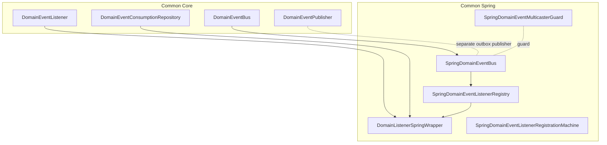
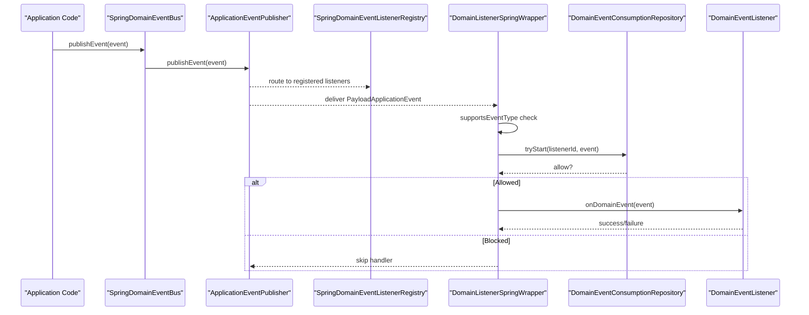
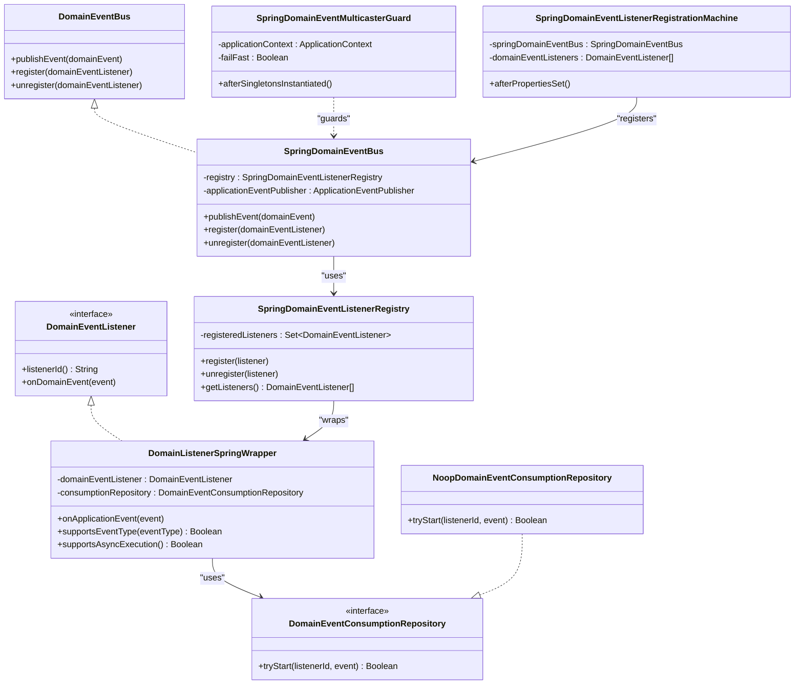
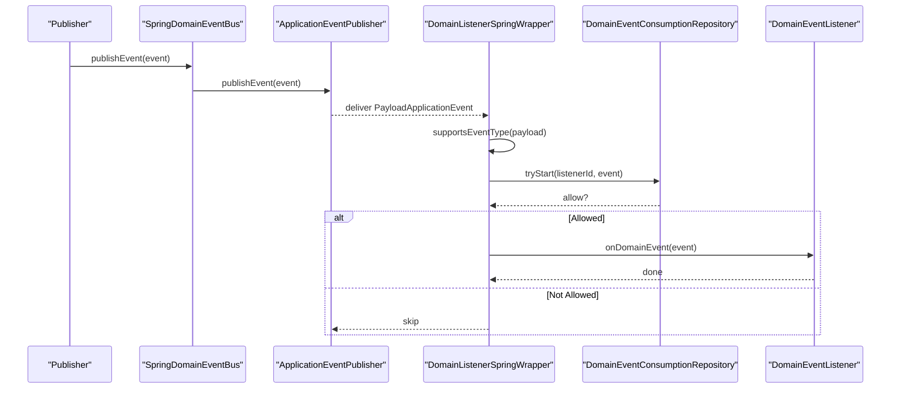
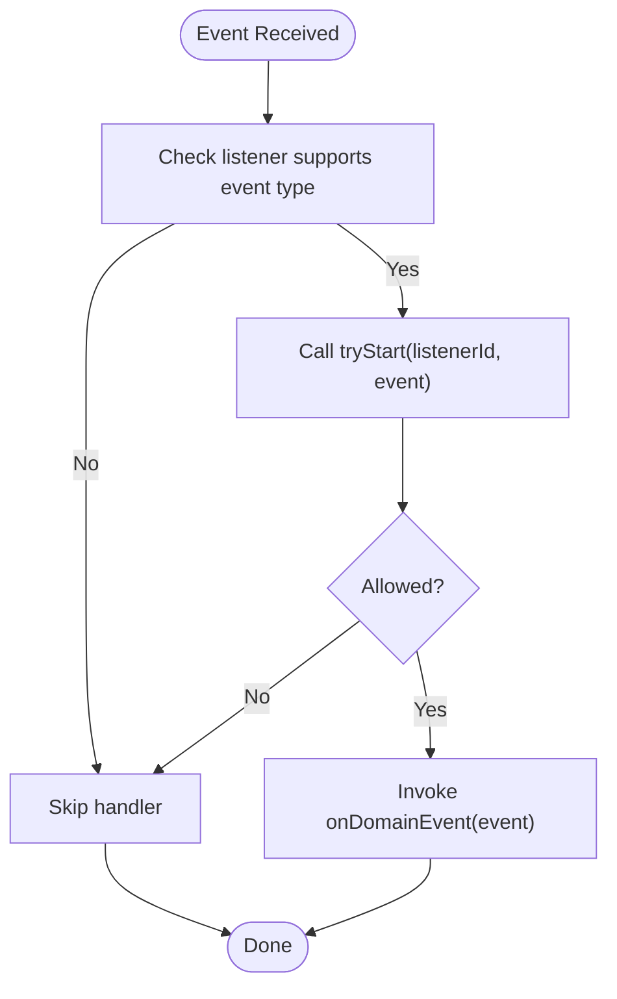
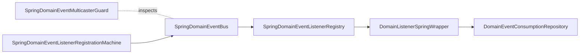

# Spring Event Bus

<cite>
**Referenced Files in This Document**
- [SpringDomainEventBus.kt](file://j-store-common-spring/src/main/kotlin/com/jstore/common/framework/event/SpringDomainEventBus.kt)
- [DomainListenerSpringWrapper.kt](file://j-store-common-spring/src/main/kotlin/com/jstore/common/framework/event/DomainListenerSpringWrapper.kt)
- [SpringDomainEventListenerRegistry.kt](file://j-store-common-spring/src/main/kotlin/com/jstore/common/framework/event/SpringDomainEventListenerRegistry.kt)
- [SpringDomainEventMulticasterGuard.kt](file://j-store-common-spring/src/main/kotlin/com/jstore/common/framework/event/SpringDomainEventMulticasterGuard.kt)
- [SpringDomainEventListenerRegistrationMachine.kt](file://j-store-common-spring/src/main/kotlin/com/jstore/common/framework/event/SpringDomainEventListenerRegistrationMachine.kt)
- [DomainEventBus.kt](file://j-store-common-core/src/main/kotlin/com/jstore/common/framework/event/DomainEventBus.kt)
- [DomainEventListener.kt](file://j-store-common-core/src/main/kotlin/com/jstore/common/framework/event/DomainEventListener.kt)
- [DomainEventConsumptionRepository.kt](file://j-store-common-core/src/main/kotlin/com/jstore/common/framework/event/DomainEventConsumptionRepository.kt)
- [DomainEventPublisher.kt](file://j-store-common-core/src/main/kotlin/com/jstore/common/framework/event/DomainEventPublisher.kt)
- [AccountingEventHandler.kt](file://j-store-accounting/src/main/kotlin/com/jstore/accounting/service/AccountingEventHandler.kt)
</cite>

## Table of Contents
1. [Introduction](#introduction)
2. [Project Structure](#project-structure)
3. [Core Components](#core-components)
4. [Architecture Overview](#architecture-overview)
5. [Detailed Component Analysis](#detailed-component-analysis)
6. [Dependency Analysis](#dependency-analysis)
7. [Performance Considerations](#performance-considerations)
8. [Troubleshooting Guide](#troubleshooting-guide)
9. [Conclusion](#conclusion)
10. [Appendices](#appendices)

## Introduction
This document explains J-Store’s Spring-based domain event bus implementation. It focuses on the SpringDomainEventBus architecture, how listeners are registered and invoked through Spring’s ApplicationEvent infrastructure, and how asynchronous processing is guarded to preserve transactional reliability. It also covers the DomainListenerSpringWrapper that adapts domain listeners to Spring events, the multicaster guard for thread safety, and practical guidance for implementing efficient event handlers across order completion, inventory updates, and accounting entries. Configuration options, error handling strategies, retry mechanisms, performance tuning, monitoring, and debugging techniques are included.

## Project Structure
The event bus spans two modules:
- j-store-common-core defines the core interfaces and abstractions for domain events and listeners.
- j-store-common-spring provides Spring-specific implementations that integrate with Spring’s application context and event multicasting.

**Diagram sources**
- [DomainEventBus.kt](file://j-store-common-core/src/main/kotlin/com/jstore/common/framework/event/DomainEventBus.kt)
- [DomainEventListener.kt](file://j-store-common-core/src/main/kotlin/com/jstore/common/framework/event/DomainEventListener.kt)
- [DomainEventConsumptionRepository.kt](file://j-store-common-core/src/main/kotlin/com/jstore/common/framework/event/DomainEventConsumptionRepository.kt)
- [DomainEventPublisher.kt](file://j-store-common-core/src/main/kotlin/com/jstore/common/framework/event/DomainEventPublisher.kt)
- [SpringDomainEventBus.kt](file://j-store-common-spring/src/main/kotlin/com/jstore/common/framework/event/SpringDomainEventBus.kt)
- [SpringDomainEventListenerRegistry.kt](file://j-store-common-spring/src/main/kotlin/com/jstore/common/framework/event/SpringDomainEventListenerRegistry.kt)
- [DomainListenerSpringWrapper.kt](file://j-store-common-spring/src/main/kotlin/com/jstore/common/framework/event/DomainListenerSpringWrapper.kt)
- [SpringDomainEventMulticasterGuard.kt](file://j-store-common-spring/src/main/kotlin/com/jstore/common/framework/event/SpringDomainEventMulticasterGuard.kt)
- [SpringDomainEventListenerRegistrationMachine.kt](file://j-store-common-spring/src/main/kotlin/com/jstore/common/framework/event/SpringDomainEventListenerRegistrationMachine.kt)

**Section sources**
- [SpringDomainEventBus.kt](file://j-store-common-spring/src/main/kotlin/com/jstore/common/framework/event/SpringDomainEventBus.kt)
- [SpringDomainEventListenerRegistry.kt](file://j-store-common-spring/src/main/kotlin/com/jstore/common/framework/event/SpringDomainEventListenerRegistry.kt)
- [DomainListenerSpringWrapper.kt](file://j-store-common-spring/src/main/kotlin/com/jstore/common/framework/event/DomainListenerSpringWrapper.kt)
- [SpringDomainEventMulticasterGuard.kt](file://j-store-common-spring/src/main/kotlin/com/jstore/common/framework/event/SpringDomainEventMulticasterGuard.kt)
- [SpringDomainEventListenerRegistrationMachine.kt](file://j-store-common-spring/src/main/kotlin/com/jstore/common/framework/event/SpringDomainEventListenerRegistrationMachine.kt)
- [DomainEventBus.kt](file://j-store-common-core/src/main/kotlin/com/jstore/common/framework/event/DomainEventBus.kt)
- [DomainEventListener.kt](file://j-store-common-core/src/main/kotlin/com/jstore/common/framework/event/DomainEventListener.kt)
- [DomainEventConsumptionRepository.kt](file://j-store-common-core/src/main/kotlin/com/jstore/common/framework/event/DomainEventConsumptionRepository.kt)
- [DomainEventPublisher.kt](file://j-store-common-core/src/main/kotlin/com/jstore/common/framework/event/DomainEventPublisher.kt)

## Core Components
- DomainEventBus: The in-process event bus interface for publishing and listener management. It does not provide transactional guarantees; use DomainEventPublisher for transactional outbox scenarios.
- DomainEventListener<T>: A pure domain interface for handling specific event types with a stable listenerId used for idempotency.
- SpringDomainEventBus: Delegates publish to Spring’s ApplicationEventPublisher and delegates registration/unregistration to SpringDomainEventListenerRegistry.
- SpringDomainEventListenerRegistry: Registers each DomainEventListener as a Spring GenericApplicationListener via DomainListenerSpringWrapper.
- DomainListenerSpringWrapper: Adapts a DomainEventListener to Spring’s ApplicationEvent flow, validates event type compatibility, and enforces idempotent consumption using DomainEventConsumptionRepository.
- SpringDomainEventMulticasterGuard: Warns or fails fast if the default ApplicationEventMulticaster is configured with an async task executor, preserving reliable outbox semantics.
- SpringDomainEventListenerRegistrationMachine: Auto-registers all injected DomainEventListener beans at startup.

Key behaviors:
- Publishing uses Spring’s ApplicationEventPublisher directly (in-process).
- Listener invocation is synchronous by default because wrappers opt out of async execution.
- Consumption guard ensures a listener processes a given event only once per listenerId+event combination when a proper DomainEventConsumptionRepository is provided.

**Section sources**
- [DomainEventBus.kt](file://j-store-common-core/src/main/kotlin/com/jstore/common/framework/event/DomainEventBus.kt)
- [DomainEventListener.kt](file://j-store-common-core/src/main/kotlin/com/jstore/common/framework/event/DomainEventListener.kt)
- [SpringDomainEventBus.kt](file://j-store-common-spring/src/main/kotlin/com/jstore/common/framework/event/SpringDomainEventBus.kt)
- [SpringDomainEventListenerRegistry.kt](file://j-store-common-spring/src/main/kotlin/com/jstore/common/framework/event/SpringDomainEventListenerRegistry.kt)
- [DomainListenerSpringWrapper.kt](file://j-store-common-spring/src/main/kotlin/com/jstore/common/framework/event/DomainListenerSpringWrapper.kt)
- [SpringDomainEventMulticasterGuard.kt](file://j-store-common-spring/src/main/kotlin/com/jstore/common/framework/event/SpringDomainEventMulticasterGuard.kt)
- [SpringDomainEventListenerRegistrationMachine.kt](file://j-store-common-spring/src/main/kotlin/com/jstore/common/framework/event/SpringDomainEventListenerRegistrationMachine.kt)
- [DomainEventConsumptionRepository.kt](file://j-store-common-core/src/main/kotlin/com/jstore/common/framework/event/DomainEventConsumptionRepository.kt)
- [DomainEventPublisher.kt](file://j-store-common-core/src/main/kotlin/com/jstore/common/framework/event/DomainEventPublisher.kt)

## Architecture Overview
The event bus integrates with Spring’s application context:
- Publishers call SpringDomainEventBus.publishEvent, which forwards to ApplicationEventPublisher.
- Listeners are wrapped and registered as Spring listeners via SpringDomainEventListenerRegistry.
- When an event is published, Spring routes it to matching DomainListenerSpringWrapper instances based on payload type.
- Each wrapper checks support, then invokes tryStart on DomainEventConsumptionRepository before calling the actual DomainEventListener.onDomainEvent.
- SpringDomainEventMulticasterGuard ensures the default multicaster is not configured for async execution unless explicitly allowed.

**Diagram sources**
- [SpringDomainEventBus.kt](file://j-store-common-spring/src/main/kotlin/com/jstore/common/framework/event/SpringDomainEventBus.kt)
- [SpringDomainEventListenerRegistry.kt](file://j-store-common-spring/src/main/kotlin/com/jstore/common/framework/event/SpringDomainEventListenerRegistry.kt)
- [DomainListenerSpringWrapper.kt](file://j-store-common-spring/src/main/kotlin/com/jstore/common/framework/event/DomainListenerSpringWrapper.kt)
- [DomainEventConsumptionRepository.kt](file://j-store-common-core/src/main/kotlin/com/jstore/common/framework/event/DomainEventConsumptionRepository.kt)

## Detailed Component Analysis

### SpringDomainEventBus
Responsibilities:
- Publishes domain events to Spring’s ApplicationEventPublisher.
- Delegates listener lifecycle to SpringDomainEventListenerRegistry.

Design notes:
- Keeps the in-process bus thin and framework-integrated.
- Does not implement transactional delivery; rely on DomainEventPublisher for outbox.

**Section sources**
- [SpringDomainEventBus.kt](file://j-store-common-spring/src/main/kotlin/com/jstore/common/framework/event/SpringDomainEventBus.kt)
- [DomainEventBus.kt](file://j-store-common-core/src/main/kotlin/com/jstore/common/framework/event/DomainEventBus.kt)

### SpringDomainEventListenerRegistry
Responsibilities:
- Maintains a set of registered DomainEventListener instances.
- Wraps each listener into DomainListenerSpringWrapper and registers it with Spring’s ConfigurableApplicationContext.
- Supports unregistering listeners dynamically.

Behavior:
- Validates listener generic type during registration.
- Ensures consistent removal by constructing equivalent wrapper instances.

**Section sources**
- [SpringDomainEventListenerRegistry.kt](file://j-store-common-spring/src/main/kotlin/com/jstore/common/framework/event/SpringDomainEventListenerRegistry.kt)

### DomainListenerSpringWrapper
Responsibilities:
- Bridges Spring ApplicationEvent to DomainEventListener.
- Filters events by payload type using ResolvableType inspection.
- Enforces idempotent consumption via DomainEventConsumptionRepository.tryStart.
- Disables async execution to keep delivery synchronous and predictable.

Flow:
- Extracts payload from PayloadApplicationEvent.
- Checks if the listener supports the event type.
- Calls tryStart; if allowed, invokes onDomainEvent.

Error handling:
- If tryStart returns false, the handler is skipped.
- Exceptions thrown inside onDomainEvent propagate back to Spring’s event handling path.

**Section sources**
- [DomainListenerSpringWrapper.kt](file://j-store-common-spring/src/main/kotlin/com/jstore/common/framework/event/DomainListenerSpringWrapper.kt)
- [DomainEventConsumptionRepository.kt](file://j-store-common-core/src/main/kotlin/com/jstore/common/framework/event/DomainEventConsumptionRepository.kt)

### SpringDomainEventMulticasterGuard
Purpose:
- Detects if the default ApplicationEventMulticaster has an async TaskExecutor configured.
- Logs a warning or throws an exception (failFast mode) to prevent unintended async behavior that could break outbox reliability.

Mechanism:
- Inspects SimpleApplicationEventMulticaster internals after singletons are instantiated.
- Uses reflection to detect presence of a task executor.

Configuration:
- failFast flag controls whether to throw or warn.

**Section sources**
- [SpringDomainEventMulticasterGuard.kt](file://j-store-common-spring/src/main/kotlin/com/jstore/common/framework/event/SpringDomainEventMulticasterGuard.kt)

### SpringDomainEventListenerRegistrationMachine
Purpose:
- Bootstraps listener registration by iterating over injected DomainEventListener beans and registering them via SpringDomainEventBus.

Lifecycle:
- Implements InitializingBean to register listeners after properties are set.

**Section sources**
- [SpringDomainEventListenerRegistrationMachine.kt](file://j-store-common-spring/src/main/kotlin/com/jstore/common/framework/event/SpringDomainEventListenerRegistrationMachine.kt)

### Class Diagram

**Diagram sources**
- [DomainEventBus.kt](file://j-store-common-core/src/main/kotlin/com/jstore/common/framework/event/DomainEventBus.kt)
- [DomainEventListener.kt](file://j-store-common-core/src/main/kotlin/com/jstore/common/framework/event/DomainEventListener.kt)
- [SpringDomainEventBus.kt](file://j-store-common-spring/src/main/kotlin/com/jstore/common/framework/event/SpringDomainEventBus.kt)
- [SpringDomainEventListenerRegistry.kt](file://j-store-common-spring/src/main/kotlin/com/jstore/common/framework/event/SpringDomainEventListenerRegistry.kt)
- [DomainListenerSpringWrapper.kt](file://j-store-common-spring/src/main/kotlin/com/jstore/common/framework/event/DomainListenerSpringWrapper.kt)
- [SpringDomainEventMulticasterGuard.kt](file://j-store-common-spring/src/main/kotlin/com/jstore/common/framework/event/SpringDomainEventMulticasterGuard.kt)
- [SpringDomainEventListenerRegistrationMachine.kt](file://j-store-common-spring/src/main/kotlin/com/jstore/common/framework/event/SpringDomainEventListenerRegistrationMachine.kt)
- [DomainEventConsumptionRepository.kt](file://j-store-common-core/src/main/kotlin/com/jstore/common/framework/event/DomainEventConsumptionRepository.kt)

### Sequence Diagram: Event Delivery Flow

**Diagram sources**
- [SpringDomainEventBus.kt](file://j-store-common-spring/src/main/kotlin/com/jstore/common/framework/event/SpringDomainEventBus.kt)
- [DomainListenerSpringWrapper.kt](file://j-store-common-spring/src/main/kotlin/com/jstore/common/framework/event/DomainListenerSpringWrapper.kt)
- [DomainEventConsumptionRepository.kt](file://j-store-common-core/src/main/kotlin/com/jstore/common/framework/event/DomainEventConsumptionRepository.kt)

### Flowchart: Idempotent Consumption Guard

**Diagram sources**
- [DomainListenerSpringWrapper.kt](file://j-store-common-spring/src/main/kotlin/com/jstore/common/framework/event/DomainListenerSpringWrapper.kt)
- [DomainEventConsumptionRepository.kt](file://j-store-common-core/src/main/kotlin/com/jstore/common/framework/event/DomainEventConsumptionRepository.kt)

## Dependency Analysis
- SpringDomainEventBus depends on SpringDomainEventListenerRegistry and Spring’s ApplicationEventPublisher.
- SpringDomainEventListenerRegistry depends on Spring’s ConfigurableApplicationContext and wraps listeners with DomainListenerSpringWrapper.
- DomainListenerSpringWrapper depends on DomainEventConsumptionRepository for idempotency and on utility methods to resolve listener event types.
- SpringDomainEventMulticasterGuard inspects the default ApplicationEventMulticaster bean to ensure synchronous delivery.
- SpringDomainEventListenerRegistrationMachine depends on SpringDomainEventBus to register listeners at startup.

**Diagram sources**
- [SpringDomainEventBus.kt](file://j-store-common-spring/src/main/kotlin/com/jstore/common/framework/event/SpringDomainEventBus.kt)
- [SpringDomainEventListenerRegistry.kt](file://j-store-common-spring/src/main/kotlin/com/jstore/common/framework/event/SpringDomainEventListenerRegistry.kt)
- [DomainListenerSpringWrapper.kt](file://j-store-common-spring/src/main/kotlin/com/jstore/common/framework/event/DomainListenerSpringWrapper.kt)
- [DomainEventConsumptionRepository.kt](file://j-store-common-core/src/main/kotlin/com/jstore/common/framework/event/DomainEventConsumptionRepository.kt)
- [SpringDomainEventMulticasterGuard.kt](file://j-store-common-spring/src/main/kotlin/com/jstore/common/framework/event/SpringDomainEventMulticasterGuard.kt)
- [SpringDomainEventListenerRegistrationMachine.kt](file://j-store-common-spring/src/main/kotlin/com/jstore/common/framework/event/SpringDomainEventListenerRegistrationMachine.kt)

**Section sources**
- [SpringDomainEventBus.kt](file://j-store-common-spring/src/main/kotlin/com/jstore/common/framework/event/SpringDomainEventBus.kt)
- [SpringDomainEventListenerRegistry.kt](file://j-store-common-spring/src/main/kotlin/com/jstore/common/framework/event/SpringDomainEventListenerRegistry.kt)
- [DomainListenerSpringWrapper.kt](file://j-store-common-spring/src/main/kotlin/com/jstore/common/framework/event/DomainListenerSpringWrapper.kt)
- [SpringDomainEventMulticasterGuard.kt](file://j-store-common-spring/src/main/kotlin/com/jstore/common/framework/event/SpringDomainEventMulticasterGuard.kt)
- [SpringDomainEventListenerRegistrationMachine.kt](file://j-store-common-spring/src/main/kotlin/com/jstore/common/framework/event/SpringDomainEventListenerRegistrationMachine.kt)
- [DomainEventConsumptionRepository.kt](file://j-store-common-core/src/main/kotlin/com/jstore/common/framework/event/DomainEventConsumptionRepository.kt)

## Performance Considerations
- Synchronous delivery: DomainListenerSpringWrapper disables async execution to maintain predictable ordering and avoid race conditions with outbox transactions.
- Filtering overhead: Type checking occurs per listener; keep event hierarchies narrow and avoid overly broad listeners.
- Consumption repository: Implement efficient tryStart checks (e.g., Redis SETNX or DB unique constraints) to minimize contention.
- Avoid heavy work in handlers: Offload long-running tasks to background jobs while keeping handlers lightweight.
- Monitor event throughput: Use logging and metrics around tryStart and onDomainEvent to identify bottlenecks.

[No sources needed since this section provides general guidance]

## Troubleshooting Guide
Common issues and resolutions:
- Async multicaster misconfiguration:
  - Symptom: Warnings about async task executor or failures in failFast mode.
  - Resolution: Ensure the default ApplicationEventMulticaster is not configured with an async executor unless you fully understand the implications.
- Duplicate processing:
  - Symptom: Handlers run multiple times for the same event.
  - Resolution: Provide a robust DomainEventConsumptionRepository that persists listenerId+eventId state atomically.
- Listener not invoked:
  - Symptom: Events published but no handler runs.
  - Resolution: Verify listener registration via SpringDomainEventListenerRegistrationMachine and ensure supportsEventType matches the event payload.
- Deadlocks or timeouts:
  - Symptom: Long-running handlers block other events.
  - Resolution: Keep handlers short; move I/O-bound work to asynchronous workers outside the event loop.

**Section sources**
- [SpringDomainEventMulticasterGuard.kt](file://j-store-common-spring/src/main/kotlin/com/jstore/common/framework/event/SpringDomainEventMulticasterGuard.kt)
- [DomainListenerSpringWrapper.kt](file://j-store-common-spring/src/main/kotlin/com/jstore/common/framework/event/DomainListenerSpringWrapper.kt)
- [SpringDomainEventListenerRegistrationMachine.kt](file://j-store-common-spring/src/main/kotlin/com/jstore/common/framework/event/SpringDomainEventListenerRegistrationMachine.kt)

## Conclusion
J-Store’s Spring-based domain event bus leverages Spring’s ApplicationEvent system to deliver in-process events synchronously and safely. The design emphasizes reliability through idempotent consumption guards and strict control over async behavior. By following the guidelines here—keeping handlers small, ensuring robust consumption repositories, and configuring the multicaster correctly—you can build scalable, observable, and maintainable event-driven flows across domains such as orders, inventory, and accounting.

[No sources needed since this section summarizes without analyzing specific files]

## Appendices

### Example Event Handlers
- Order completion accounting:
  - See AccountingEventHandler for examples of handling order-related events and creating accounting entries.
- Inventory updates:
  - Implement DomainEventListener<InventoryEvent> with a stable listenerId and offload heavy operations.
- Order stock confirmation:
  - Implement DomainEventListener<OrderStockConfirmedEvent> to update downstream systems.

Concrete references:
- [AccountingEventHandler.kt](file://j-store-accounting/src/main/kotlin/com/jstore/accounting/service/AccountingEventHandler.kt)

**Section sources**
- [AccountingEventHandler.kt](file://j-store-accounting/src/main/kotlin/com/jstore/accounting/service/AccountingEventHandler.kt)

### Configuration Options
- Fail-fast multicaster guard:
  - Configure SpringDomainEventMulticasterGuard.failFast to enforce synchronous delivery during development.
- Consumption repository:
  - Replace NoopDomainEventConsumptionRepository with a persistent implementation for production idempotency.
- Listener registration:
  - Ensure all DomainEventListener beans are present so SpringDomainEventListenerRegistrationMachine can register them automatically.

**Section sources**
- [SpringDomainEventMulticasterGuard.kt](file://j-store-common-spring/src/main/kotlin/com/jstore/common/framework/event/SpringDomainEventMulticasterGuard.kt)
- [DomainEventConsumptionRepository.kt](file://j-store-common-core/src/main/kotlin/com/jstore/common/framework/event/DomainEventConsumptionRepository.kt)
- [SpringDomainEventListenerRegistrationMachine.kt](file://j-store-common-spring/src/main/kotlin/com/jstore/common/framework/event/SpringDomainEventListenerRegistrationMachine.kt)

### Error Handling Strategies and Retry Mechanisms
- In-handler errors:
  - Wrap business logic with Result types and log failures; avoid throwing unchecked exceptions that terminate event delivery.
- Retry strategy:
  - For transient failures, implement retry within the handler or delegate to a job queue with exponential backoff.
- Outbox consistency:
  - Use DomainEventPublisher for transactional outbox; do not mix in-process publishing with outbox writes in the same transaction.

[No sources needed since this section provides general guidance]

### Monitoring and Debugging Techniques
- Logging:
  - Log entry/exit of onDomainEvent with correlation IDs and listenerId.
- Metrics:
  - Count events processed per listenerId and track failure rates.
- Tracing:
  - Propagate trace context through events to correlate end-to-end flows.
- Diagnostics:
  - Inspect registered listeners via SpringDomainEventListenerRegistry.getListeners() during runtime diagnostics.

[No sources needed since this section provides general guidance]

### Design Guidelines and Pitfalls
- Keep handlers idempotent and side-effect free where possible.
- Avoid infinite loops: Do not publish new events that trigger the same handler indirectly.
- Prevent memory leaks: Avoid retaining large objects in static caches; prefer bounded caches or external stores.
- Prefer small, focused listeners: One responsibility per listener improves testability and reduces coupling.

[No sources needed since this section provides general guidance]