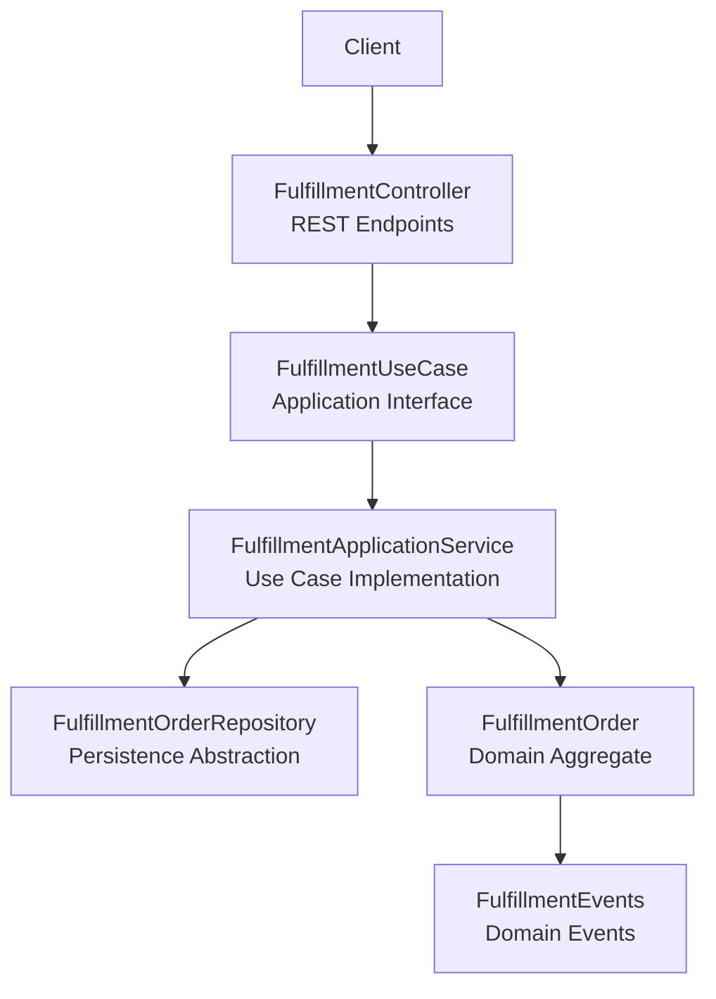
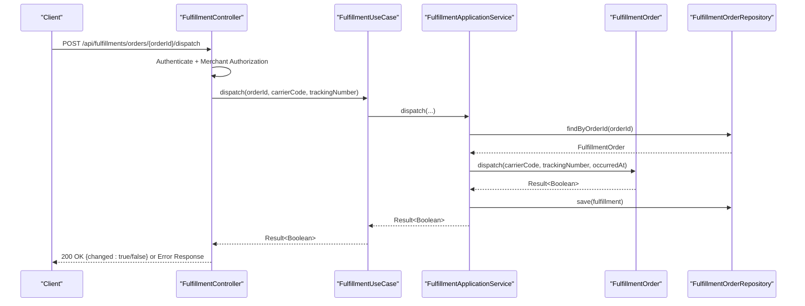
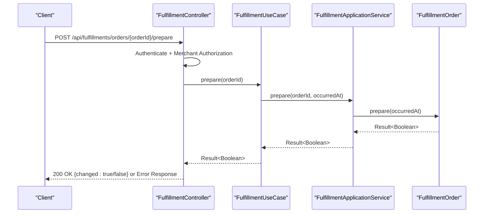
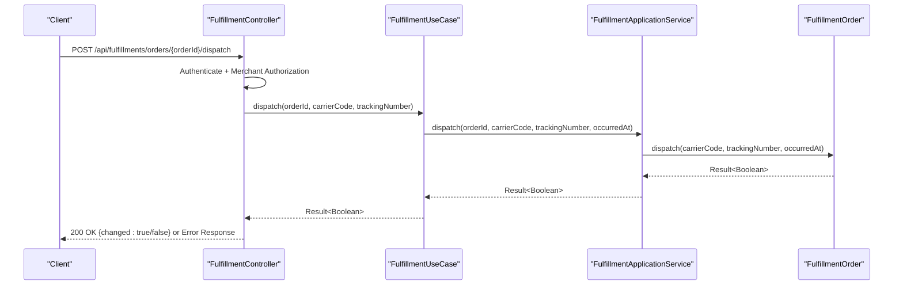
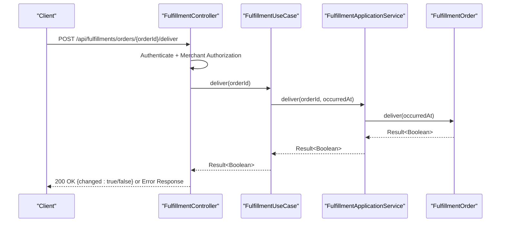
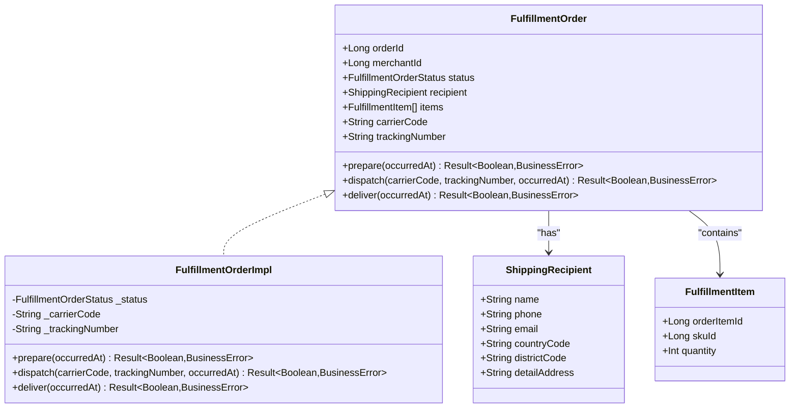
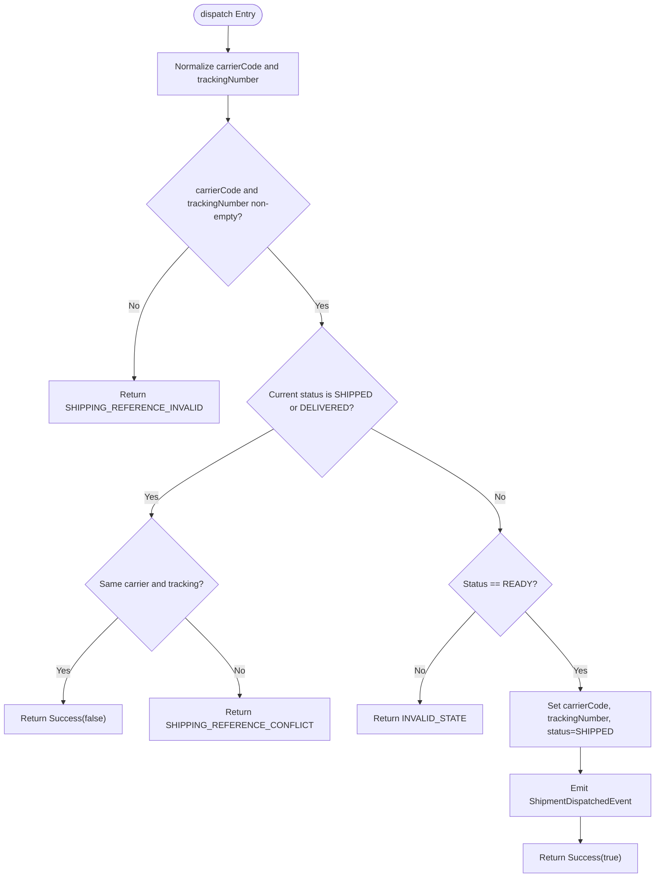
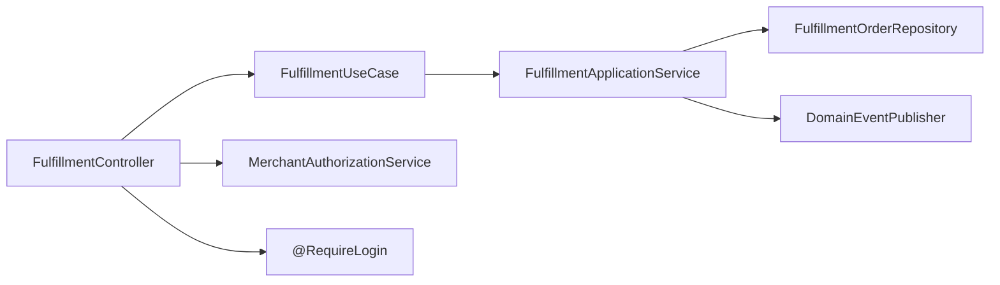

# Fulfillment API Endpoints

<cite>
**Referenced Files in This Document**
- [FulfillmentController.kt](file://j-store-fulfillment-boot/src/main/kotlin/com/jstore/fulfillment/controller/FulfillmentController.kt)
- [FulfillmentUseCase.kt](file://j-store-fulfillment-application/src/main/kotlin/com/jstore/fulfillment/service/FulfillmentUseCase.kt)
- [FulfillmentApplicationService.kt](file://j-store-fulfillment-application/src/main/kotlin/com/jstore/fulfillment/service/FulfillmentApplicationService.kt)
- [FulfillmentOrder.kt](file://j-store-fulfillment-domain/src/main/kotlin/com/jstore/fulfillment/domain/FulfillmentOrder.kt)
- [FulfillmentOrderImpl.kt](file://j-store-fulfillment-domain/src/main/kotlin/com/jstore/fulfillment/domain/FulfillmentOrderImpl.kt)
- [FulfillmentErrors.kt](file://j-store-fulfillment-domain/src/main/kotlin/com/jstore/fulfillment/domain/FulfillmentErrors.kt)
- [FulfillmentEvents.kt](file://j-store-fulfillment-domain/src/main/kotlin/com/jstore/fulfillment/domain/event/FulfillmentEvents.kt)
- [RequireLogin.kt](file://j-store-authentication-spring-sdk/src/main/kotlin/com/jstore/authentication/annotation/RequireLogin.kt)
</cite>

## Table of Contents
1. Introduction
2. Project Structure
3. Core Components
4. Architecture Overview
5. Detailed Component Analysis
6. Dependency Analysis
7. Performance Considerations
8. Troubleshooting Guide
9. Conclusion

## Introduction
This document provides API documentation for the Fulfillment REST endpoints exposed by the j-store platform. It covers HTTP methods, URL patterns, request/response schemas, authentication and authorization requirements, error handling, and operational guidance for fulfillment lifecycle operations such as preparing a fulfillment order, dispatching with shipping details, marking delivery, and querying fulfillment information.

## Project Structure
The Fulfillment feature is implemented across multiple modules:
- Boot layer exposes REST endpoints via a Spring controller.
- Application layer implements use cases and orchestrates domain operations.
- Domain layer defines aggregates, state transitions, and events.
- Authentication is enforced via an annotation-based mechanism.

**Diagram sources**
- [FulfillmentController.kt](file://j-store-fulfillment-boot/src/main/kotlin/com/jstore/fulfillment/controller/FulfillmentController.kt)
- [FulfillmentUseCase.kt](file://j-store-fulfillment-application/src/main/kotlin/com/jstore/fulfillment/service/FulfillmentUseCase.kt)
- [FulfillmentApplicationService.kt](file://j-store-fulfillment-application/src/main/kotlin/com/jstore/fulfillment/service/FulfillmentApplicationService.kt)
- [FulfillmentOrder.kt](file://j-store-fulfillment-domain/src/main/kotlin/com/jstore/fulfillment/domain/FulfillmentOrder.kt)
- [FulfillmentEvents.kt](file://j-store-fulfillment-domain/src/main/kotlin/com/jstore/fulfillment/domain/event/FulfillmentEvents.kt)

**Section sources**
- [FulfillmentController.kt](file://j-store-fulfillment-boot/src/main/kotlin/com/jstore/fulfillment/controller/FulfillmentController.kt)
- [FulfillmentUseCase.kt](file://j-store-fulfillment-application/src/main/kotlin/com/jstore/fulfillment/service/FulfillmentUseCase.kt)
- [FulfillmentApplicationService.kt](file://j-store-fulfillment-application/src/main/kotlin/com/jstore/fulfillment/service/FulfillmentApplicationService.kt)
- [FulfillmentOrder.kt](file://j-store-fulfillment-domain/src/main/kotlin/com/jstore/fulfillment/domain/FulfillmentOrder.kt)
- [FulfillmentEvents.kt](file://j-store-fulfillment-domain/src/main/kotlin/com/jstore/fulfillment/domain/event/FulfillmentEvents.kt)

## Core Components
- FulfillmentController: Exposes REST endpoints under /api/fulfillments with login requirement and merchant authorization checks.
- FulfillmentUseCase: Defines application-level operations for fulfillment lifecycle (create, get, prepare, dispatch, deliver).
- FulfillmentApplicationService: Implements use cases, persists changes, and publishes domain events.
- FulfillmentOrder (domain): Represents the aggregate with status transitions and validation rules.
- FulfillmentErrors: Centralized business error definitions with HTTP codes.
- RequireLogin: Annotation to enforce authentication on controllers or methods.

Key responsibilities:
- Controller handles HTTP mapping, request/response transformation, and authorization.
- Use case abstracts orchestration logic for callers.
- Application service coordinates persistence and event publishing.
- Domain enforces state machine and business rules.

**Section sources**
- [FulfillmentController.kt](file://j-store-fulfillment-boot/src/main/kotlin/com/jstore/fulfillment/controller/FulfillmentController.kt)
- [FulfillmentUseCase.kt](file://j-store-fulfillment-application/src/main/kotlin/com/jstore/fulfillment/service/FulfillmentUseCase.kt)
- [FulfillmentApplicationService.kt](file://j-store-fulfillment-application/src/main/kotlin/com/jstore/fulfillment/service/FulfillmentApplicationService.kt)
- [FulfillmentOrder.kt](file://j-store-fulfillment-domain/src/main/kotlin/com/jstore/fulfillment/domain/FulfillmentOrder.kt)
- [FulfillmentErrors.kt](file://j-store-fulfillment-domain/src/main/kotlin/com/jstore/fulfillment/domain/FulfillmentErrors.kt)
- [RequireLogin.kt](file://j-store-authentication-spring-sdk/src/main/kotlin/com/jstore/authentication/annotation/RequireLogin.kt)

## Architecture Overview
The Fulfillment API follows a layered architecture:
- REST controller maps HTTP requests to use case calls.
- Use case interface decouples controller from implementation.
- Application service performs mutations and publishes events.
- Domain aggregate encapsulates business logic and state transitions.

**Diagram sources**
- [FulfillmentController.kt](file://j-store-fulfillment-boot/src/main/kotlin/com/jstore/fulfillment/controller/FulfillmentController.kt)
- [FulfillmentUseCase.kt](file://j-store-fulfillment-application/src/main/kotlin/com/jstore/fulfillment/service/FulfillmentUseCase.kt)
- [FulfillmentApplicationService.kt](file://j-store-fulfillment-application/src/main/kotlin/com/jstore/fulfillment/service/FulfillmentApplicationService.kt)
- [FulfillmentOrder.kt](file://j-store-fulfillment-domain/src/main/kotlin/com/jstore/fulfillment/domain/FulfillmentOrder.kt)

## Detailed Component Analysis

### REST Endpoints
Base path: /api/fulfillments
Authentication: Requires login via @RequireLogin.
Authorization: Merchant permission checks are performed per endpoint.

- GET /api/fulfillments/orders/{orderId}
  - Purpose: Retrieve fulfillment information for an order.
  - AuthN: Required (@RequireLogin).
  - AuthZ: MerchantPermission.FULFILLMENT_READ on the order’s merchant.
  - Path params: orderId (Long).
  - Success response: JSON object with fields id, orderId, merchantId, status, carrierCode, trackingNumber.
  - Failure responses: Business errors mapped to HTTP status codes defined in FulfillmentErrors.

- POST /api/fulfillments/orders/{orderId}/prepare
  - Purpose: Prepare a fulfillment order (transition to READY).
  - AuthN: Required (@RequireLogin).
  - AuthZ: MerchantPermission.FULFILLMENT_MANAGE on the order’s merchant.
  - Path params: orderId (Long).
  - Request body: None.
  - Success response: JSON object with field changed (Boolean).
  - Failure responses: Business errors mapped to HTTP status codes.

- POST /api/fulfillments/orders/{orderId}/dispatch
  - Purpose: Dispatch shipment with carrier and tracking number (transition to SHIPPED).
  - AuthN: Required (@RequireLogin).
  - AuthZ: MerchantPermission.FULFILLMENT_MANAGE on the order’s merchant.
  - Path params: orderId (Long).
  - Request body:
    - carrierCode: String (non-empty, normalized uppercase).
    - trackingNumber: String (non-empty, trimmed).
  - Success response: JSON object with field changed (Boolean).
  - Failure responses: Business errors including invalid shipping reference or conflict.

- POST /api/fulfillments/orders/{orderId}/deliver
  - Purpose: Mark fulfillment as delivered (transition to DELIVERED).
  - AuthN: Required (@RequireLogin).
  - AuthZ: MerchantPermission.FULFILLMENT_MANAGE on the order’s merchant.
  - Path params: orderId (Long).
  - Request body: None.
  - Success response: JSON object with field changed (Boolean).
  - Failure responses: Business errors mapped to HTTP status codes.

Notes:
- The create operation is available at the application level via FulfillmentUseCase.createForOrder; it is not exposed as a REST endpoint in the controller.
- All mutating endpoints return a JSON payload with a changed flag indicating whether a state transition occurred.

**Section sources**
- [FulfillmentController.kt](file://j-store-fulfillment-boot/src/main/kotlin/com/jstore/fulfillment/controller/FulfillmentController.kt)
- [FulfillmentUseCase.kt](file://j-store-fulfillment-application/src/main/kotlin/com/jstore/fulfillment/service/FulfillmentUseCase.kt)
- [FulfillmentApplicationService.kt](file://j-store-fulfillment-application/src/main/kotlin/com/jstore/fulfillment/service/FulfillmentApplicationService.kt)

### Request and Response Schemas
- DispatchRequest
  - Fields:
    - carrierCode: String
    - trackingNumber: String
- ErrorResponse
  - Fields:
    - message: String
    - errorCode: String
- Response (GET fulfillment)
  - Fields:
    - id: Long
    - orderId: Long
    - merchantId: Long
    - status: String (enum name)
    - carrierCode: String?
    - trackingNumber: String?

These schemas are used by the controller to map HTTP payloads to domain objects and back.

**Section sources**
- [FulfillmentController.kt](file://j-store-fulfillment-boot/src/main/kotlin/com/jstore/fulfillment/controller/FulfillmentController.kt)

### Authentication and Authorization
- Authentication: Enforced by @RequireLogin on the controller class.
- Authorization: Per-endpoint checks ensure the authenticated user has the required MerchantPermission (FULFILLMENT_READ or FULFILLMENT_MANAGE) for the order’s merchant.

**Section sources**
- [FulfillmentController.kt](file://j-store-fulfillment-boot/src/main/kotlin/com/jstore/fulfillment/controller/FulfillmentController.kt)
- [RequireLogin.kt](file://j-store-authentication-spring-sdk/src/main/kotlin/com/jstore/authentication/annotation/RequireLogin.kt)

### Domain State Machine and Validation
Status values: PENDING, READY, SHIPPED, DELIVERED.
Transitions:
- PENDING -> READY via prepare()
- READY -> SHIPPED via dispatch(carrierCode, trackingNumber)
- SHIPPED -> DELIVERED via deliver()

Validation rules:
- prepare(): Idempotent if already READY; otherwise requires PENDING.
- dispatch(): Normalizes carrier code (uppercase) and trims tracking number; validates non-empty; allows idempotency when already SHIPPED with same carrier/tracking; rejects conflicting references; requires READY state.
- deliver(): Idempotent if already DELIVERED; requires SHIPPED state.

Business errors:
- NOT_FOUND: 404
- ORDER_CONFLICT: 409
- INVALID_STATE: 409
- SHIPPING_REFERENCE_INVALID: 400
- SHIPPING_REFERENCE_CONFLICT: 409

**Section sources**
- [FulfillmentOrder.kt](file://j-store-fulfillment-domain/src/main/kotlin/com/jstore/fulfillment/domain/FulfillmentOrder.kt)
- [FulfillmentOrderImpl.kt](file://j-store-fulfillment-domain/src/main/kotlin/com/jstore/fulfillment/domain/FulfillmentOrderImpl.kt)
- [FulfillmentErrors.kt](file://j-store-fulfillment-domain/src/main/kotlin/com/jstore/fulfillment/domain/FulfillmentErrors.kt)

### Event Emission
Domain events emitted during state transitions:
- fulfillment.prepared
- fulfillment.dispatched (includes carrierCode and trackingNumber)
- fulfillment.delivered

These events are published through the domain event publisher after successful mutations.

**Section sources**
- [FulfillmentEvents.kt](file://j-store-fulfillment-domain/src/main/kotlin/com/jstore/fulfillment/domain/event/FulfillmentEvents.kt)
- [FulfillmentApplicationService.kt](file://j-store-fulfillment-application/src/main/kotlin/com/jstore/fulfillment/service/FulfillmentApplicationService.kt)

### Sequence Diagrams for Key Operations

#### Prepare Flow

**Diagram sources**
- [FulfillmentController.kt](file://j-store-fulfillment-boot/src/main/kotlin/com/jstore/fulfillment/controller/FulfillmentController.kt)
- [FulfillmentUseCase.kt](file://j-store-fulfillment-application/src/main/kotlin/com/jstore/fulfillment/service/FulfillmentUseCase.kt)
- [FulfillmentApplicationService.kt](file://j-store-fulfillment-application/src/main/kotlin/com/jstore/fulfillment/service/FulfillmentApplicationService.kt)
- [FulfillmentOrder.kt](file://j-store-fulfillment-domain/src/main/kotlin/com/jstore/fulfillment/domain/FulfillmentOrder.kt)

#### Dispatch Flow

**Diagram sources**
- [FulfillmentController.kt](file://j-store-fulfillment-boot/src/main/kotlin/com/jstore/fulfillment/controller/FulfillmentController.kt)
- [FulfillmentUseCase.kt](file://j-store-fulfillment-application/src/main/kotlin/com/jstore/fulfillment/service/FulfillmentUseCase.kt)
- [FulfillmentApplicationService.kt](file://j-store-fulfillment-application/src/main/kotlin/com/jstore/fulfillment/service/FulfillmentApplicationService.kt)
- [FulfillmentOrder.kt](file://j-store-fulfillment-domain/src/main/kotlin/com/jstore/fulfillment/domain/FulfillmentOrder.kt)

#### Deliver Flow

**Diagram sources**
- [FulfillmentController.kt](file://j-store-fulfillment-boot/src/main/kotlin/com/jstore/fulfillment/controller/FulfillmentController.kt)
- [FulfillmentUseCase.kt](file://j-store-fulfillment-application/src/main/kotlin/com/jstore/fulfillment/service/FulfillmentUseCase.kt)
- [FulfillmentApplicationService.kt](file://j-store-fulfillment-application/src/main/kotlin/com/jstore/fulfillment/service/FulfillmentApplicationService.kt)
- [FulfillmentOrder.kt](file://j-store-fulfillment-domain/src/main/kotlin/com/jstore/fulfillment/domain/FulfillmentOrder.kt)

### Class Diagram of Domain Model

**Diagram sources**
- [FulfillmentOrder.kt](file://j-store-fulfillment-domain/src/main/kotlin/com/jstore/fulfillment/domain/FulfillmentOrder.kt)
- [FulfillmentOrderImpl.kt](file://j-store-fulfillment-domain/src/main/kotlin/com/jstore/fulfillment/domain/FulfillmentOrderImpl.kt)

### Flowchart of Dispatch Logic

**Diagram sources**
- [FulfillmentOrderImpl.kt](file://j-store-fulfillment-domain/src/main/kotlin/com/jstore/fulfillment/domain/FulfillmentOrderImpl.kt)

## Dependency Analysis
The Fulfillment module depends on:
- Authentication SDK for login enforcement.
- Shop module for merchant permissions.
- Common framework for Result types, domain events, and utilities.
- Infrastructure repository abstraction for persistence.

**Diagram sources**
- [FulfillmentController.kt](file://j-store-fulfillment-boot/src/main/kotlin/com/jstore/fulfillment/controller/FulfillmentController.kt)
- [FulfillmentUseCase.kt](file://j-store-fulfillment-application/src/main/kotlin/com/jstore/fulfillment/service/FulfillmentUseCase.kt)
- [FulfillmentApplicationService.kt](file://j-store-fulfillment-application/src/main/kotlin/com/jstore/fulfillment/service/FulfillmentApplicationService.kt)
- [RequireLogin.kt](file://j-store-authentication-spring-sdk/src/main/kotlin/com/jstore/authentication/annotation/RequireLogin.kt)

**Section sources**
- [FulfillmentController.kt](file://j-store-fulfillment-boot/src/main/kotlin/com/jstore/fulfillment/controller/FulfillmentController.kt)
- [FulfillmentUseCase.kt](file://j-store-fulfillment-application/src/main/kotlin/com/jstore/fulfillment/service/FulfillmentUseCase.kt)
- [FulfillmentApplicationService.kt](file://j-store-fulfillment-application/src/main/kotlin/com/jstore/fulfillment/service/FulfillmentApplicationService.kt)
- [RequireLogin.kt](file://j-store-authentication-spring-sdk/src/main/kotlin/com/jstore/authentication/annotation/RequireLogin.kt)

## Performance Considerations
- Idempotency: prepare(), dispatch(), and deliver() support idempotent behavior where applicable, reducing retries and duplicate work.
- Minimal payload: Mutating endpoints return lightweight JSON with a changed flag.
- Event-driven side effects: Domain events are published only when state changes occur, minimizing unnecessary processing.
- No pagination or filtering endpoints are exposed for fulfillment queries beyond single-order retrieval.

[No sources needed since this section provides general guidance]

## Troubleshooting Guide
Common error scenarios and their meanings:
- NOT_FOUND (404): Fulfillment order does not exist for the given orderId.
- ORDER_CONFLICT (409): Existing fulfillment snapshot conflicts with new creation data.
- INVALID_STATE (409): Operation attempted in an invalid state transition.
- SHIPPING_REFERENCE_INVALID (400): Carrier code or tracking number is empty or invalid.
- SHIPPING_REFERENCE_CONFLICT (409): Attempted to set different shipping reference when already associated with another.

Response format for errors:
- HTTP status code corresponds to the BusinessError.httpCode.
- Body contains message and errorCode fields.

Operational tips:
- Ensure correct merchant permissions before calling mutating endpoints.
- Validate carrierCode and trackingNumber prior to dispatch requests.
- Handle idempotency by checking changed flag and existing status.

**Section sources**
- [FulfillmentErrors.kt](file://j-store-fulfillment-domain/src/main/kotlin/com/jstore/fulfillment/domain/FulfillmentErrors.kt)
- [FulfillmentController.kt](file://j-store-fulfillment-boot/src/main/kotlin/com/jstore/fulfillment/controller/FulfillmentController.kt)

## Conclusion
The Fulfillment API provides a clear, secure, and robust set of endpoints to manage fulfillment lifecycle operations. It leverages domain-driven design principles with explicit state transitions, comprehensive error handling, and event emission for downstream integrations. Authentication and merchant authorization ensure that only authorized users can perform operations on orders they manage. For future enhancements, consider exposing additional query capabilities and versioning strategies aligned with the platform’s API evolution practices.

[No sources needed since this section summarizes without analyzing specific files]