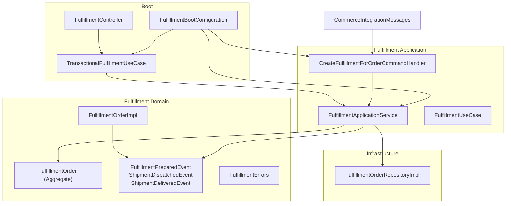
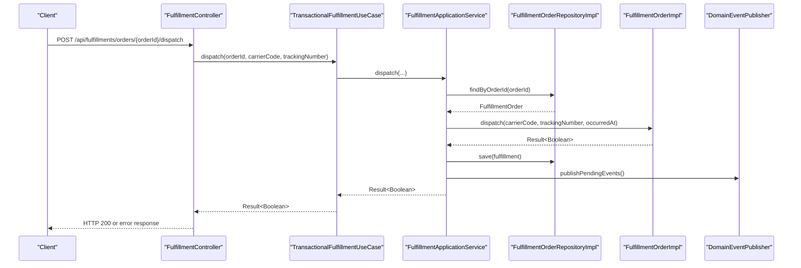
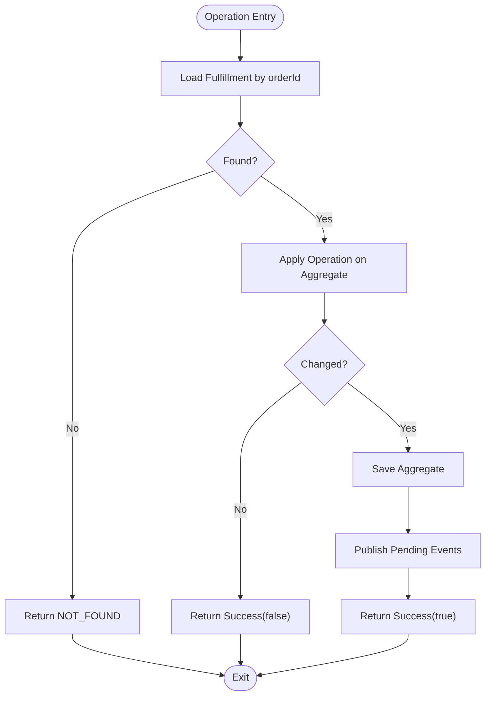
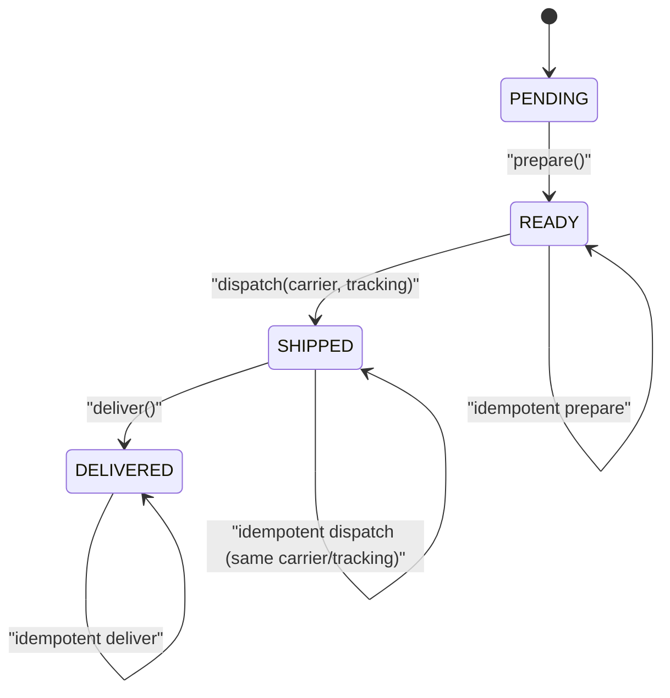
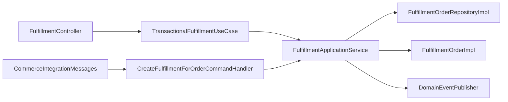

# Fulfillment Application Service

<cite>
**Referenced Files in This Document**
- [FulfillmentApplicationService.kt](file://j-store-fulfillment-application/src/main/kotlin/com/jstore/fulfillment/service/FulfillmentApplicationService.kt)
- [FulfillmentIntegrationMessageHandler.kt](file://j-store-fulfillment-application/src/main/kotlin/com/jstore/fulfillment/service/FulfillmentIntegrationMessageHandler.kt)
- [FulfillmentUseCase.kt](file://j-store-fulfillment-application/src/main/kotlin/com/jstore/fulfillment/service/FulfillmentUseCase.kt)
- [FulfillmentOrder.kt](file://j-store-fulfillment-domain/src/main/kotlin/com/jstore/fulfillment/domain/FulfillmentOrder.kt)
- [FulfillmentOrderImpl.kt](file://j-store-fulfillment-domain/src/main/kotlin/com/jstore/fulfillment/domain/FulfillmentOrderImpl.kt)
- [FulfillmentEvents.kt](file://j-store-fulfillment-domain/src/main/kotlin/com/jstore/fulfillment/domain/event/FulfillmentEvents.kt)
- [FulfillmentErrors.kt](file://j-store-fulfillment-domain/src/main/kotlin/com/jstore/fulfillment/domain/FulfillmentErrors.kt)
- [FulfillmentOrderRepositoryImpl.kt](file://j-store-fulfillment-infrastructure/src/main/kotlin/com/jstore/fulfillment/domain/FulfillmentOrderRepositoryImpl.kt)
- [FulfillmentBootConfiguration.kt](file://j-store-fulfillment-boot/src/main/kotlin/com/jstore/fulfillment/config/FulfillmentBootConfiguration.kt)
- [TransactionalFulfillmentUseCase.kt](file://j-store-fulfillment-boot/src/main/kotlin/com/jstore/fulfillment/config/TransactionalFulfillmentUseCase.kt)
- [FulfillmentController.kt](file://j-store-fulfillment-boot/src/main/kotlin/com/jstore/fulfillment/controller/FulfillmentController.kt)
- [CommerceIntegrationMessages.kt](file://j-store-integration-contracts/src/main/kotlin/com/jstore/contracts/commerce/CommerceIntegrationMessages.kt)
</cite>

## Table of Contents
1. [Introduction](#introduction)
2. [Project Structure](#project-structure)
3. [Core Components](#core-components)
4. [Architecture Overview](#architecture-overview)
5. [Detailed Component Analysis](#detailed-component-analysis)
6. [Dependency Analysis](#dependency-analysis)
7. [Performance Considerations](#performance-considerations)
8. [Troubleshooting Guide](#troubleshooting-guide)
9. [Conclusion](#conclusion)

## Introduction
This document explains the Fulfillment Application Service layer that orchestrates fulfillment workflows across order preparation, shipping coordination, and delivery confirmation. It details how integration message handlers receive fulfillment events from other modules (orders, inventory), how use cases implement operations like creating fulfillment orders, updating shipping status, and handling delivery confirmations, and how event-driven communication patterns coordinate with external logistics providers. Transaction boundaries and error handling strategies are also covered to ensure robustness and consistency.

## Project Structure
The Fulfillment module is organized into application, domain, infrastructure, and boot layers:
- Application layer: orchestration, command handling, and use case implementation
- Domain layer: aggregate, state transitions, and domain events
- Infrastructure layer: persistence repository implementation
- Boot layer: Spring configuration, transactional wrapper, and REST controller

**Diagram sources**
- [FulfillmentApplicationService.kt:28-96](file://j-store-fulfillment-application/src/main/kotlin/com/jstore/fulfillment/service/FulfillmentApplicationService.kt#L28-L96)
- [FulfillmentUseCase.kt:8-23](file://j-store-fulfillment-application/src/main/kotlin/com/jstore/fulfillment/service/FulfillmentUseCase.kt#L8-L23)
- [FulfillmentIntegrationMessageHandler.kt:9-40](file://j-store-fulfillment-application/src/main/kotlin/com/jstore/fulfillment/service/FulfillmentIntegrationMessageHandler.kt#L9-L40)
- [FulfillmentOrder.kt:38-56](file://j-store-fulfillment-domain/src/main/kotlin/com/jstore/fulfillment/domain/FulfillmentOrder.kt#L38-L56)
- [FulfillmentOrderImpl.kt:13-85](file://j-store-fulfillment-domain/src/main/kotlin/com/jstore/fulfillment/domain/FulfillmentOrderImpl.kt#L13-L85)
- [FulfillmentEvents.kt:23-47](file://j-store-fulfillment-domain/src/main/kotlin/com/jstore/fulfillment/domain/event/FulfillmentEvents.kt#L23-L47)
- [FulfillmentErrors.kt:5-13](file://j-store-fulfillment-domain/src/main/kotlin/com/jstore/fulfillment/domain/FulfillmentErrors.kt#L5-L13)
- [FulfillmentOrderRepositoryImpl.kt:10-70](file://j-store-fulfillment-infrastructure/src/main/kotlin/com/jstore/fulfillment/domain/FulfillmentOrderRepositoryImpl.kt#L10-L70)
- [FulfillmentBootConfiguration.kt:14-34](file://j-store-fulfillment-boot/src/main/kotlin/com/jstore/fulfillment/config/FulfillmentBootConfiguration.kt#L14-L34)
- [TransactionalFulfillmentUseCase.kt:9-40](file://j-store-fulfillment-boot/src/main/kotlin/com/jstore/fulfillment/config/TransactionalFulfillmentUseCase.kt#L9-L40)
- [FulfillmentController.kt:24-117](file://j-store-fulfillment-boot/src/main/kotlin/com/jstore/fulfillment/controller/FulfillmentController.kt#L24-L117)
- [CommerceIntegrationMessages.kt:284-360](file://j-store-integration-contracts/src/main/kotlin/com/jstore/contracts/commerce/CommerceIntegrationMessages.kt#L284-L360)

**Section sources**
- [FulfillmentApplicationService.kt:28-96](file://j-store-fulfillment-application/src/main/kotlin/com/jstore/fulfillment/service/FulfillmentApplicationService.kt#L28-L96)
- [FulfillmentUseCase.kt:8-23](file://j-store-fulfillment-application/src/main/kotlin/com/jstore/fulfillment/service/FulfillmentUseCase.kt#L8-L23)
- [FulfillmentIntegrationMessageHandler.kt:9-40](file://j-store-fulfillment-application/src/main/kotlin/com/jstore/fulfillment/service/FulfillmentIntegrationMessageHandler.kt#L9-L40)
- [FulfillmentOrder.kt:38-56](file://j-store-fulfillment-domain/src/main/kotlin/com/jstore/fulfillment/domain/FulfillmentOrder.kt#L38-L56)
- [FulfillmentOrderImpl.kt:13-85](file://j-store-fulfillment-domain/src/main/kotlin/com/jstore/fulfillment/domain/FulfillmentOrderImpl.kt#L13-L85)
- [FulfillmentEvents.kt:23-47](file://j-store-fulfillment-domain/src/main/kotlin/com/jstore/fulfillment/domain/event/FulfillmentEvents.kt#L23-L47)
- [FulfillmentErrors.kt:5-13](file://j-store-fulfillment-domain/src/main/kotlin/com/jstore/fulfillment/domain/FulfillmentErrors.kt#L5-L13)
- [FulfillmentOrderRepositoryImpl.kt:10-70](file://j-store-fulfillment-infrastructure/src/main/kotlin/com/jstore/fulfillment/domain/FulfillmentOrderRepositoryImpl.kt#L10-L70)
- [FulfillmentBootConfiguration.kt:14-34](file://j-store-fulfillment-boot/src/main/kotlin/com/jstore/fulfillment/config/FulfillmentBootConfiguration.kt#L14-L34)
- [TransactionalFulfillmentUseCase.kt:9-40](file://j-store-fulfillment-boot/src/main/kotlin/com/jstore/fulfillment/config/TransactionalFulfillmentUseCase.kt#L9-L40)
- [FulfillmentController.kt:24-117](file://j-store-fulfillment-boot/src/main/kotlin/com/jstore/fulfillment/controller/FulfillmentController.kt#L24-L117)
- [CommerceIntegrationMessages.kt:284-360](file://j-store-integration-contracts/src/main/kotlin/com/jstore/contracts/commerce/CommerceIntegrationMessages.kt#L284-L360)

## Core Components
- FulfillmentUseCase: Defines the application-level operations for fulfillment lifecycle: create, prepare, dispatch, deliver, and read by orderId.
- FulfillmentApplicationService: Implements the use case, orchestrating repository access, id generation, domain object mutation, and event publishing.
- CreateFulfillmentForOrderCommandHandler: Translates incoming integration commands into use case calls.
- FulfillmentOrder (aggregate): Encapsulates state transitions PENDING → READY → SHIPPED → DELIVERED and raises domain events on changes.
- FulfillmentOrderRepositoryImpl: Persists aggregates and maps between domain and persistence models.
- TransactionalFulfillmentUseCase: Wraps use case methods with explicit read/write transactions.
- FulfillmentController: Exposes REST endpoints with merchant authorization checks and returns standardized responses.

Key responsibilities:
- Orchestrate creation of fulfillment orders from order data
- Enforce state transitions and business rules
- Publish domain events for downstream integration
- Provide transactional boundaries for writes and reads

**Section sources**
- [FulfillmentUseCase.kt:8-23](file://j-store-fulfillment-application/src/main/kotlin/com/jstore/fulfillment/service/FulfillmentUseCase.kt#L8-L23)
- [FulfillmentApplicationService.kt:28-96](file://j-store-fulfillment-application/src/main/kotlin/com/jstore/fulfillment/service/FulfillmentApplicationService.kt#L28-L96)
- [FulfillmentIntegrationMessageHandler.kt:9-40](file://j-store-fulfillment-application/src/main/kotlin/com/jstore/fulfillment/service/FulfillmentIntegrationMessageHandler.kt#L9-L40)
- [FulfillmentOrder.kt:38-56](file://j-store-fulfillment-domain/src/main/kotlin/com/jstore/fulfillment/domain/FulfillmentOrder.kt#L38-L56)
- [FulfillmentOrderRepositoryImpl.kt:10-70](file://j-store-fulfillment-infrastructure/src/main/kotlin/com/jstore/fulfillment/domain/FulfillmentOrderRepositoryImpl.kt#L10-L70)
- [TransactionalFulfillmentUseCase.kt:9-40](file://j-store-fulfillment-boot/src/main/kotlin/com/jstore/fulfillment/config/TransactionalFulfillmentUseCase.kt#L9-L40)
- [FulfillmentController.kt:24-117](file://j-store-fulfillment-boot/src/main/kotlin/com/jstore/fulfillment/controller/FulfillmentController.kt#L24-L117)

## Architecture Overview
The Fulfillment Application Service coordinates order-to-delivery workflows through a layered architecture:
- Controllers expose APIs and enforce merchant permissions
- Transactional wrapper ensures consistent transaction boundaries
- Application service orchestrates domain mutations and event publishing
- Domain aggregate enforces state machine and emits domain events
- Repository persists changes and translates models
- Integration messages bridge with other modules via contracts

**Diagram sources**
- [FulfillmentController.kt:54-66](file://j-store-fulfillment-boot/src/main/kotlin/com/jstore/fulfillment/controller/FulfillmentController.kt#L54-L66)
- [TransactionalFulfillmentUseCase.kt:26-31](file://j-store-fulfillment-boot/src/main/kotlin/com/jstore/fulfillment/config/TransactionalFulfillmentUseCase.kt#L26-L31)
- [FulfillmentApplicationService.kt:66-74](file://j-store-fulfillment-application/src/main/kotlin/com/jstore/fulfillment/service/FulfillmentApplicationService.kt#L66-L74)
- [FulfillmentOrderRepositoryImpl.kt:20-21](file://j-store-fulfillment-infrastructure/src/main/kotlin/com/jstore/fulfillment/domain/FulfillmentOrderRepositoryImpl.kt#L20-L21)
- [FulfillmentOrderImpl.kt:50-75](file://j-store-fulfillment-domain/src/main/kotlin/com/jstore/fulfillment/domain/FulfillmentOrderImpl.kt#L50-L75)

## Detailed Component Analysis

### FulfillmentUseCase Interface
Defines the application-level API for fulfillment operations:
- createForOrder: Creates a fulfillment order from an order snapshot
- getByOrderId: Reads fulfillment by orderId
- prepare: Marks fulfillment ready for packing
- dispatch: Records carrier and tracking number, moves to shipped
- deliver: Confirms delivery completion

**Section sources**
- [FulfillmentUseCase.kt:8-23](file://j-store-fulfillment-application/src/main/kotlin/com/jstore/fulfillment/service/FulfillmentUseCase.kt#L8-L23)

### FulfillmentApplicationService Implementation
Orchestrates fulfillment operations:
- Idempotent creation: Checks existing fulfillment for same order, merchant, recipient, items; returns conflict if mismatch
- State mutation: Uses a helper mutate method to load, apply operation, persist if changed, and publish pending events
- Event publishing: Ensures domain events are published after successful mutations

**Diagram sources**
- [FulfillmentApplicationService.kt:81-96](file://j-store-fulfillment-application/src/main/kotlin/com/jstore/fulfillment/service/FulfillmentApplicationService.kt#L81-L96)

**Section sources**
- [FulfillmentApplicationService.kt:28-96](file://j-store-fulfillment-application/src/main/kotlin/com/jstore/fulfillment/service/FulfillmentApplicationService.kt#L28-L96)

### Integration Message Handler
Receives integration commands and translates them into use case calls:
- CreateFulfillmentForOrderCommandHandler maps contract recipients and items to domain types
- Calls createForOrder and throws on failure to prevent message acknowledgment until success

**Section sources**
- [FulfillmentIntegrationMessageHandler.kt:9-40](file://j-store-fulfillment-application/src/main/kotlin/com/jstore/fulfillment/service/FulfillmentIntegrationMessageHandler.kt#L9-L40)
- [CommerceIntegrationMessages.kt:284-303](file://j-store-integration-contracts/src/main/kotlin/com/jstore/contracts/commerce/CommerceIntegrationMessages.kt#L284-L303)

### Domain Aggregate and State Machine
The FulfillmentOrder aggregate enforces a strict state machine:
- PENDING → READY via prepare
- READY → SHIPPED via dispatch with carrier and tracking validation
- SHIPPED → DELIVERED via deliver

**Diagram sources**
- [FulfillmentOrderImpl.kt:41-84](file://j-store-fulfillment-domain/src/main/kotlin/com/jstore/fulfillment/domain/FulfillmentOrderImpl.kt#L41-L84)

**Section sources**
- [FulfillmentOrder.kt:38-56](file://j-store-fulfillment-domain/src/main/kotlin/com/jstore/fulfillment/domain/FulfillmentOrder.kt#L38-L56)
- [FulfillmentOrderImpl.kt:13-85](file://j-store-fulfillment-domain/src/main/kotlin/com/jstore/fulfillment/domain/FulfillmentOrderImpl.kt#L13-L85)

### Domain Events
Fulfillment domain events capture key lifecycle moments:
- FulfillmentPreparedEvent: When prepare succeeds
- ShipmentDispatchedEvent: When dispatch records carrier and tracking
- ShipmentDeliveredEvent: When deliver confirms completion

These events are published via the domain event publisher and can be translated to integration events for cross-module communication.

**Section sources**
- [FulfillmentEvents.kt:23-47](file://j-store-fulfillment-domain/src/main/kotlin/com/jstore/fulfillment/domain/event/FulfillmentEvents.kt#L23-L47)

### Persistence Layer
FulfillmentOrderRepositoryImpl handles persistence:
- save wraps domain entity to PO and persists via JPA
- findById and findByOrderId map POs back to domain entities
- Transactions are mandatory for save operations

**Section sources**
- [FulfillmentOrderRepositoryImpl.kt:10-70](file://j-store-fulfillment-infrastructure/src/main/kotlin/com/jstore/fulfillment/domain/FulfillmentOrderRepositoryImpl.kt#L10-L70)

### Boot Configuration and Transactional Wrapper
FulfillmentBootConfiguration wires beans:
- FulfillmentApplicationService with repository, sequence, and publisher
- TransactionalFulfillmentUseCase wrapping write/read transactions
- CreateFulfillmentForOrderCommandHandler bound to use case

TransactionalFulfillmentUseCase provides explicit transaction boundaries:
- Write operations wrapped in write transaction template
- Read operations wrapped in read-only transaction template

**Section sources**
- [FulfillmentBootConfiguration.kt:14-34](file://j-store-fulfillment-boot/src/main/kotlin/com/jstore/fulfillment/config/FulfillmentBootConfiguration.kt#L14-L34)
- [TransactionalFulfillmentUseCase.kt:9-40](file://j-store-fulfillment-boot/src/main/kotlin/com/jstore/fulfillment/config/TransactionalFulfillmentUseCase.kt#L9-L40)

### REST Controller and Authorization
FulfillmentController exposes endpoints:
- GET /api/fulfillments/orders/{orderId}: Read fulfillment with FULFILLMENT_READ permission
- POST /api/fulfillments/orders/{orderId}/prepare: Transition to READY with FULFILLMENT_MANAGE permission
- POST /api/fulfillments/orders/{orderId}/dispatch: Record carrier/tracking with FULFILLMENT_MANAGE permission
- POST /api/fulfillments/orders/{orderId}/deliver: Confirm delivery with FULFILLMENT_MANAGE permission

Authorization checks ensure merchants can only operate on their own fulfillments.

**Section sources**
- [FulfillmentController.kt:24-117](file://j-store-fulfillment-boot/src/main/kotlin/com/jstore/fulfillment/controller/FulfillmentController.kt#L24-L117)

## Dependency Analysis
The Fulfillment Application Service depends on:
- Domain aggregate for state management and event emission
- Repository for persistence
- Event publisher for domain events
- Integration contracts for message handling
- Transaction manager for consistent boundaries

**Diagram sources**
- [FulfillmentController.kt:24-117](file://j-store-fulfillment-boot/src/main/kotlin/com/jstore/fulfillment/controller/FulfillmentController.kt#L24-L117)
- [TransactionalFulfillmentUseCase.kt:9-40](file://j-store-fulfillment-boot/src/main/kotlin/com/jstore/fulfillment/config/TransactionalFulfillmentUseCase.kt#L9-L40)
- [FulfillmentApplicationService.kt:28-96](file://j-store-fulfillment-application/src/main/kotlin/com/jstore/fulfillment/service/FulfillmentApplicationService.kt#L28-L96)
- [FulfillmentOrderRepositoryImpl.kt:10-70](file://j-store-fulfillment-infrastructure/src/main/kotlin/com/jstore/fulfillment/domain/FulfillmentOrderRepositoryImpl.kt#L10-L70)
- [FulfillmentOrderImpl.kt:13-85](file://j-store-fulfillment-domain/src/main/kotlin/com/jstore/fulfillment/domain/FulfillmentOrderImpl.kt#L13-L85)
- [FulfillmentIntegrationMessageHandler.kt:9-40](file://j-store-fulfillment-application/src/main/kotlin/com/jstore/fulfillment/service/FulfillmentIntegrationMessageHandler.kt#L9-L40)
- [CommerceIntegrationMessages.kt:284-360](file://j-store-integration-contracts/src/main/kotlin/com/jstore/contracts/commerce/CommerceIntegrationMessages.kt#L284-L360)

**Section sources**
- [FulfillmentApplicationService.kt:28-96](file://j-store-fulfillment-application/src/main/kotlin/com/jstore/fulfillment/service/FulfillmentApplicationService.kt#L28-L96)
- [FulfillmentOrderRepositoryImpl.kt:10-70](file://j-store-fulfillment-infrastructure/src/main/kotlin/com/jstore/fulfillment/domain/FulfillmentOrderRepositoryImpl.kt#L10-L70)
- [FulfillmentOrderImpl.kt:13-85](file://j-store-fulfillment-domain/src/main/kotlin/com/jstore/fulfillment/domain/FulfillmentOrderImpl.kt#L13-L85)
- [FulfillmentIntegrationMessageHandler.kt:9-40](file://j-store-fulfillment-application/src/main/kotlin/com/jstore/fulfillment/service/FulfillmentIntegrationMessageHandler.kt#L9-L40)
- [CommerceIntegrationMessages.kt:284-360](file://j-store-integration-contracts/src/main/kotlin/com/jstore/contracts/commerce/CommerceIntegrationMessages.kt#L284-L360)

## Performance Considerations
- Idempotency: Creation checks existing fulfillments to avoid duplicates and conflicts
- Minimal persistence: Changes are saved only when state actually changes
- Read-only queries: Separate read transactions optimize read paths
- Event batching: Pending events are published together to reduce overhead

[No sources needed since this section provides general guidance]

## Troubleshooting Guide
Common errors and resolutions:
- NOT_FOUND: Fulfillment not found for given orderId; verify order exists and fulfillment was created
- ORDER_CONFLICT: Existing fulfillment differs in merchant, recipient, or items; reconcile request data
- INVALID_STATE: Operation attempted in wrong state; check current status and allowed transitions
- SHIPPING_REFERENCE_INVALID: Carrier code or tracking number empty/invalid; validate inputs
- SHIPPING_REFERENCE_CONFLICT: Attempting to change shipping info on already shipped/delivered order; ensure idempotency

Error definitions and HTTP codes are centralized in FulfillmentErrors.

**Section sources**
- [FulfillmentErrors.kt:5-13](file://j-store-fulfillment-domain/src/main/kotlin/com/jstore/fulfillment/domain/FulfillmentErrors.kt#L5-L13)

## Conclusion
The Fulfillment Application Service provides a robust, event-driven orchestration layer for fulfillment workflows. It enforces strict state transitions, ensures transactional consistency, and integrates seamlessly with other modules through well-defined contracts. The design supports idempotency, clear error handling, and extensibility for future logistics provider integrations.

[No sources needed since this section summarizes without analyzing specific files]