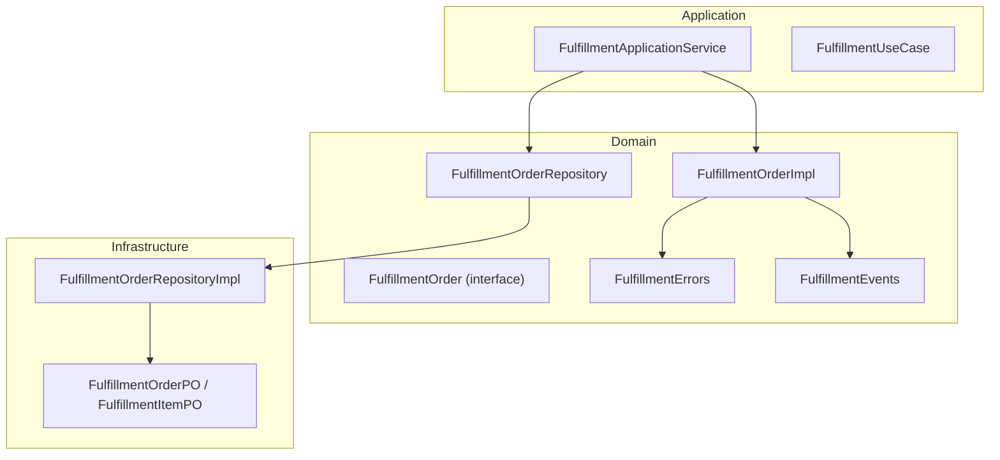
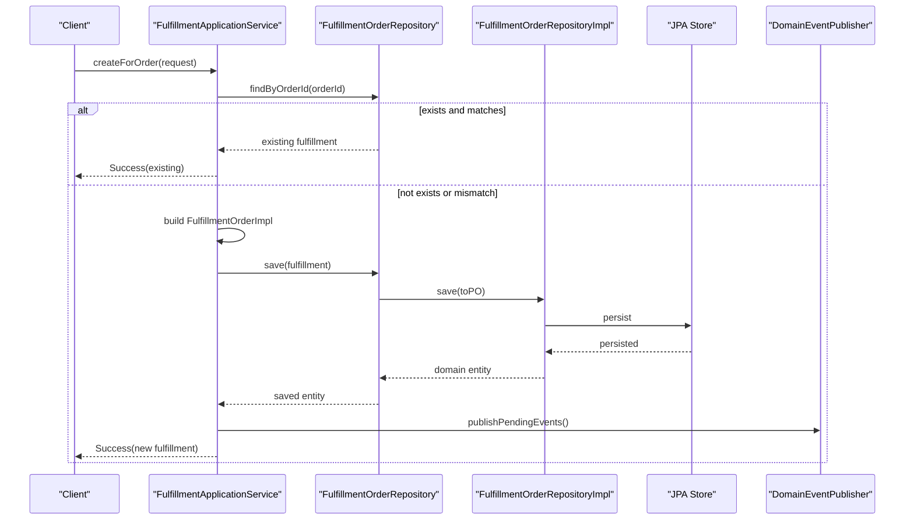
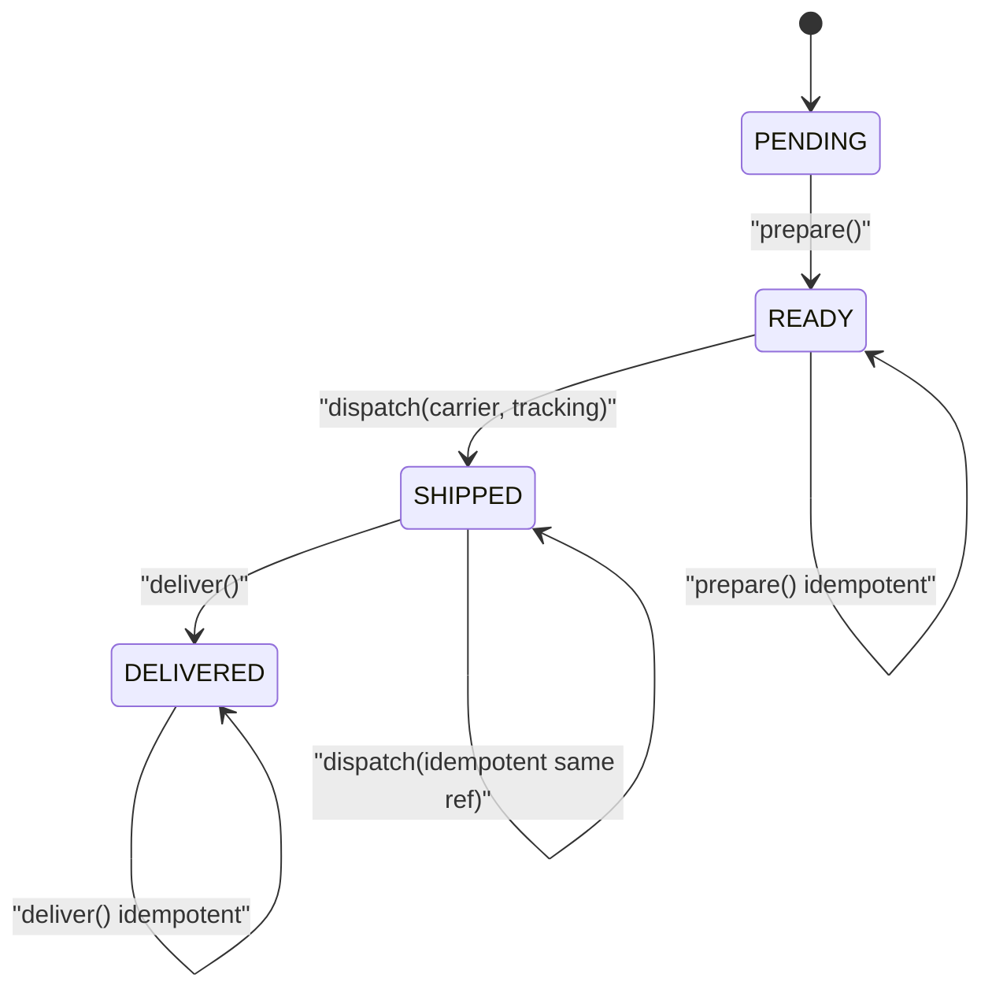
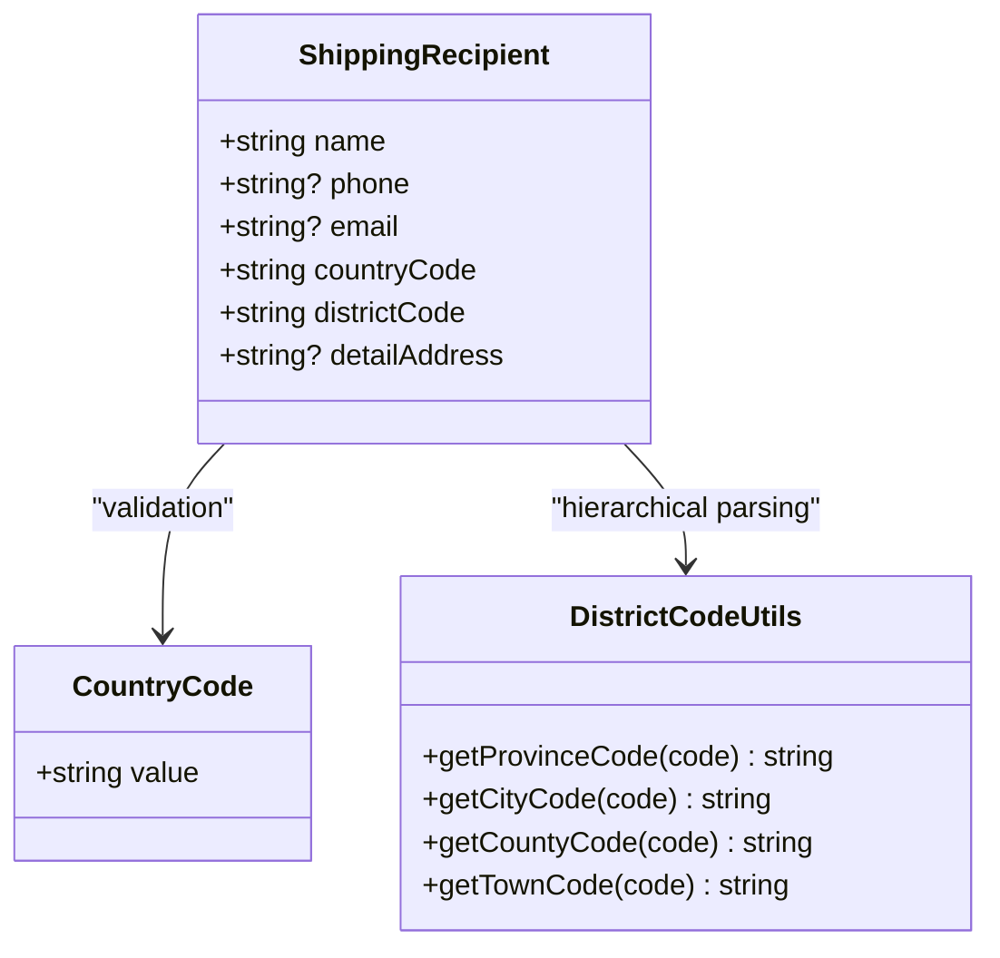
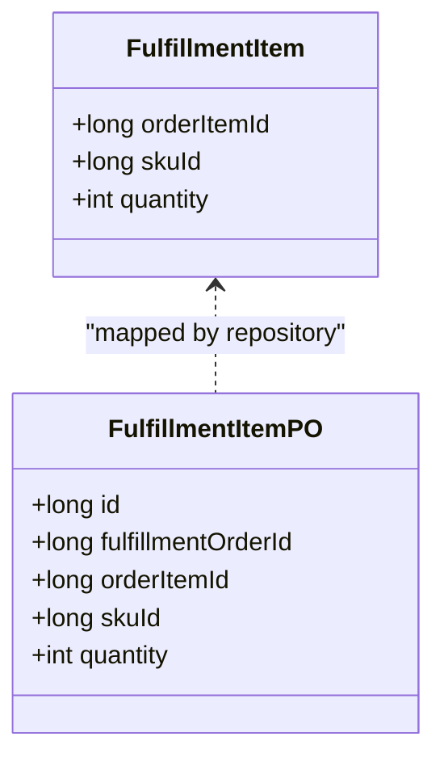
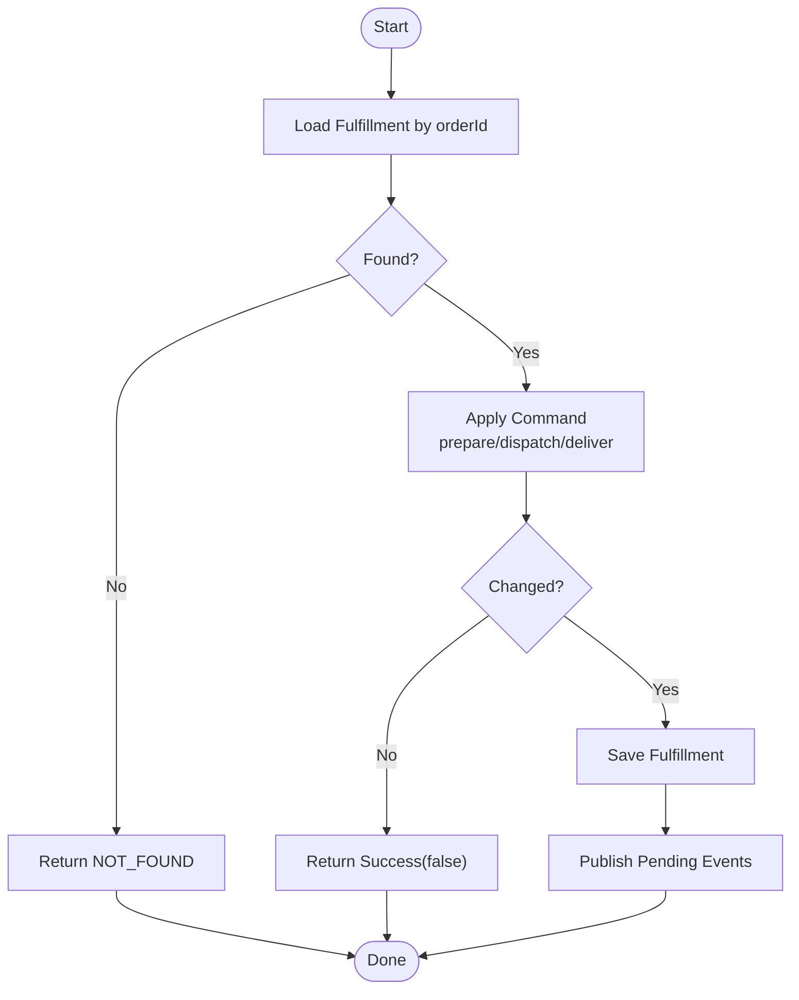
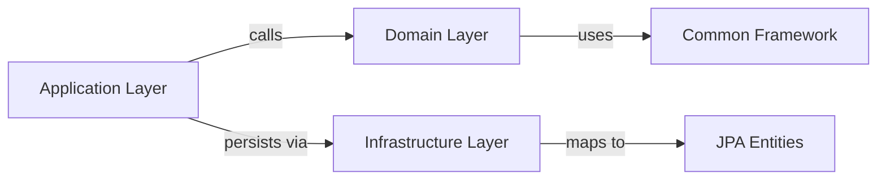

# Fulfillment Domain Model

<cite>
**Referenced Files in This Document**
- [FulfillmentOrder.kt](file://j-store-fulfillment-domain/src/main/kotlin/com/jstore/fulfillment/domain/FulfillmentOrder.kt)
- [FulfillmentOrderImpl.kt](file://j-store-fulfillment-domain/src/main/kotlin/com/jstore/fulfillment/domain/FulfillmentOrderImpl.kt)
- [FulfillmentErrors.kt](file://j-store-fulfillment-domain/src/main/kotlin/com/jstore/fulfillment/domain/FulfillmentErrors.kt)
- [FulfillmentEvents.kt](file://j-store-fulfillment-domain/src/main/kotlin/com/jstore/fulfillment/domain/event/FulfillmentEvents.kt)
- [FulfillmentOrderRepository.kt](file://j-store-fulfillment-domain/src/main/kotlin/com/jstore/fulfillment/domain/FulfillmentOrderRepository.kt)
- [FulfillmentOrderPO.kt](file://j-store-fulfillment-infrastructure/src/main/kotlin/com/jstore/fulfillment/domain/persistence/FulfillmentOrderPO.kt)
- [FulfillmentOrderRepositoryImpl.kt](file://j-store-fulfillment-infrastructure/src/main/kotlin/com/jstore/fulfillment/domain/FulfillmentOrderRepositoryImpl.kt)
- [FulfillmentApplicationService.kt](file://j-store-fulfillment-application/src/main/kotlin/com/jstore/fulfillment/service/FulfillmentApplicationService.kt)
- [FulfillmentUseCase.kt](file://j-store-fulfillment-application/src/main/kotlin/com/jstore/fulfillment/service/FulfillmentUseCase.kt)
- [FulfillmentOrderTest.kt](file://j-store-fulfillment-domain/src/test/kotlin/com/jstore/fulfillment/domain/FulfillmentOrderTest.kt)
- [CountryCode.kt](file://j-store-common-core/src/main/kotlin/com/jstore/common/geo/CountryCode.kt)
- [DistrictCodeUtils.kt](file://j-store-common-core/src/main/kotlin/com/jstore/common/geo/chinese/DistrictCodeUtils.kt)
</cite>

## Table of Contents
1. Introduction
2. Project Structure
3. Core Components
4. Architecture Overview
5. Detailed Component Analysis
6. Dependency Analysis
7. Performance Considerations
8. Troubleshooting Guide
9. Conclusion

## Introduction
This document describes the Fulfillment Domain Model, focusing on the FulfillmentOrder aggregate, its lifecycle states (PENDING, READY, SHIPPED, DELIVERED), and business invariants. It also documents the ShippingRecipient value object with address validation considerations, the FulfillmentItem structure for order item mapping and quantity management, state transition rules, and end-to-end workflows including creation, preparation, dispatch, and delivery. Error handling patterns and validation rules specific to fulfillment operations are covered, along with examples grounded in the codebase.

## Project Structure
The Fulfillment feature is implemented across three layers:
- Domain layer: defines the aggregate, value objects, events, errors, and repository interface.
- Application layer: orchestrates use cases, enforces idempotency, persists changes, and publishes domain events.
- Infrastructure layer: provides persistence via JPA entities and a repository implementation that maps between domain and persistence models.

**Diagram sources**
- [FulfillmentOrder.kt](file://j-store-fulfillment-domain/src/main/kotlin/com/jstore/fulfillment/domain/FulfillmentOrder.kt)
- [FulfillmentOrderImpl.kt](file://j-store-fulfillment-domain/src/main/kotlin/com/jstore/fulfillment/domain/FulfillmentOrderImpl.kt)
- [FulfillmentErrors.kt](file://j-store-fulfillment-domain/src/main/kotlin/com/jstore/fulfillment/domain/FulfillmentErrors.kt)
- [FulfillmentEvents.kt](file://j-store-fulfillment-domain/src/main/kotlin/com/jstore/fulfillment/domain/event/FulfillmentEvents.kt)
- [FulfillmentOrderRepository.kt](file://j-store-fulfillment-domain/src/main/kotlin/com/jstore/fulfillment/domain/FulfillmentOrderRepository.kt)
- [FulfillmentOrderPO.kt](file://j-store-fulfillment-infrastructure/src/main/kotlin/com/jstore/fulfillment/domain/persistence/FulfillmentOrderPO.kt)
- [FulfillmentOrderRepositoryImpl.kt](file://j-store-fulfillment-infrastructure/src/main/kotlin/com/jstore/fulfillment/domain/FulfillmentOrderRepositoryImpl.kt)
- [FulfillmentApplicationService.kt](file://j-store-fulfillment-application/src/main/kotlin/com/jstore/fulfillment/service/FulfillmentApplicationService.kt)
- [FulfillmentUseCase.kt](file://j-store-fulfillment-application/src/main/kotlin/com/jstore/fulfillment/service/FulfillmentUseCase.kt)

**Section sources**
- [FulfillmentOrder.kt](file://j-store-fulfillment-domain/src/main/kotlin/com/jstore/fulfillment/domain/FulfillmentOrder.kt)
- [FulfillmentOrderImpl.kt](file://j-store-fulfillment-domain/src/main/kotlin/com/jstore/fulfillment/domain/FulfillmentOrderImpl.kt)
- [FulfillmentOrderRepository.kt](file://j-store-fulfillment-domain/src/main/kotlin/com/jstore/fulfillment/domain/FulfillmentOrderRepository.kt)
- [FulfillmentOrderPO.kt](file://j-store-fulfillment-infrastructure/src/main/kotlin/com/jstore/fulfillment/domain/persistence/FulfillmentOrderPO.kt)
- [FulfillmentOrderRepositoryImpl.kt](file://j-store-fulfillment-infrastructure/src/main/kotlin/com/jstore/fulfillment/domain/FulfillmentOrderRepositoryImpl.kt)
- [FulfillmentApplicationService.kt](file://j-store-fulfillment-application/src/main/kotlin/com/jstore/fulfillment/service/FulfillmentApplicationService.kt)
- [FulfillmentUseCase.kt](file://j-store-fulfillment-application/src/main/kotlin/com/jstore/fulfillment/service/FulfillmentUseCase.kt)

## Core Components
- FulfillmentOrder aggregate: encapsulates fulfillment lifecycle, recipient, items, carrier/tracking info, and exposes commands prepare, dispatch, deliver.
- FulfillmentOrderStatus enum: PENDING → READY → SHIPPED → DELIVERED transitions enforced by the aggregate.
- ShippingRecipient value object: captures name, phone, email, countryCode, districtCode, detailAddress.
- FulfillmentItem: maps an order item to a SKU with a positive quantity; ensures uniqueness of orderItemId within the fulfillment.
- Events: FulfillmentPreparedEvent, ShipmentDispatchedEvent, ShipmentDeliveredEvent emitted on state changes.
- Errors: centralized BusinessError definitions for not found, conflicts, invalid state, and shipping reference issues.
- Repository: AggregateRepository with findByOrderId query and save operation.

Key invariants:
- Order must have at least one item; all items must have distinct orderItemId.
- Carrier code and tracking number must be non-blank when dispatching.
- State transitions are strictly enforced; invalid transitions return failures.
- Idempotent dispatch: re-dispatching with identical carrier/tracking returns success without change.

**Section sources**
- [FulfillmentOrder.kt](file://j-store-fulfillment-domain/src/main/kotlin/com/jstore/fulfillment/domain/FulfillmentOrder.kt)
- [FulfillmentOrderImpl.kt](file://j-store-fulfillment-domain/src/main/kotlin/com/jstore/fulfillment/domain/FulfillmentOrderImpl.kt)
- [FulfillmentErrors.kt](file://j-store-fulfillment-domain/src/main/kotlin/com/jstore/fulfillment/domain/FulfillmentErrors.kt)
- [FulfillmentEvents.kt](file://j-store-fulfillment-domain/src/main/kotlin/com/jstore/fulfillment/domain/event/FulfillmentEvents.kt)
- [FulfillmentOrderRepository.kt](file://j-store-fulfillment-domain/src/main/kotlin/com/jstore/fulfillment/domain/FulfillmentOrderRepository.kt)

## Architecture Overview
The application service coordinates fulfillment operations:
- Creation checks for existing fulfillment per order and merchant, validates consistency, creates the aggregate, persists it, and publishes pending events.
- Mutations (prepare, dispatch, deliver) load the aggregate by orderId, apply the command, persist if changed, and publish events.

**Diagram sources**
- [FulfillmentApplicationService.kt](file://j-store-fulfillment-application/src/main/kotlin/com/jstore/fulfillment/service/FulfillmentApplicationService.kt)
- [FulfillmentOrderRepository.kt](file://j-store-fulfillment-domain/src/main/kotlin/com/jstore/fulfillment/domain/FulfillmentOrderRepository.kt)
- [FulfillmentOrderRepositoryImpl.kt](file://j-store-fulfillment-infrastructure/src/main/kotlin/com/jstore/fulfillment/domain/FulfillmentOrderRepositoryImpl.kt)
- [FulfillmentOrderPO.kt](file://j-store-fulfillment-infrastructure/src/main/kotlin/com/jstore/fulfillment/domain/persistence/FulfillmentOrderPO.kt)

**Section sources**
- [FulfillmentApplicationService.kt](file://j-store-fulfillment-application/src/main/kotlin/com/jstore/fulfillment/service/FulfillmentApplicationService.kt)
- [FulfillmentOrderRepositoryImpl.kt](file://j-store-fulfillment-infrastructure/src/main/kotlin/com/jstore/fulfillment/domain/FulfillmentOrderRepositoryImpl.kt)

## Detailed Component Analysis

### FulfillmentOrder Aggregate and Lifecycle
- States: PENDING, READY, SHIPPED, DELIVERED.
- Transitions:
  - prepare: PENDING → READY (idempotent if already READY).
  - dispatch: READY → SHIPPED; requires non-blank carrierCode and trackingNumber; idempotent if same carrier/tracking already set; rejects conflicting references.
  - deliver: SHIPPED → DELIVERED (idempotent if already DELIVERED).
- Invariants:
  - orderId > 0, merchantId > 0, items not empty, unique orderItemId per fulfillment.
  - Carrier/tracking normalization: carrier uppercase trimmed; tracking trimmed.
- Events raised:
  - FulfillmentPreparedEvent on prepare.
  - ShipmentDispatchedEvent on dispatch.
  - ShipmentDeliveredEvent on deliver.

**Diagram sources**
- [FulfillmentOrderImpl.kt](file://j-store-fulfillment-domain/src/main/kotlin/com/jstore/fulfillment/domain/FulfillmentOrderImpl.kt)
- [FulfillmentOrder.kt](file://j-store-fulfillment-domain/src/main/kotlin/com/jstore/fulfillment/domain/FulfillmentOrder.kt)

**Section sources**
- [FulfillmentOrderImpl.kt](file://j-store-fulfillment-domain/src/main/kotlin/com/jstore/fulfillment/domain/FulfillmentOrderImpl.kt)
- [FulfillmentOrder.kt](file://j-store-fulfillment-domain/src/main/kotlin/com/jstore/fulfillment/domain/FulfillmentOrder.kt)
- [FulfillmentEvents.kt](file://j-store-fulfillment-domain/src/main/kotlin/com/jstore/fulfillment/domain/event/FulfillmentEvents.kt)

### ShippingRecipient Value Object
- Fields: name, phone (optional), email (optional), countryCode, districtCode, detailAddress (optional).
- Validation considerations:
  - countryCode should follow ISO 3166-1 alpha-2 format; consider using CountryCode for strict validation.
  - districtCode supports hierarchical codes; DistrictCodeUtils provides utilities for Chinese administrative codes.
- Persistence mapping: fields map directly to columns in FulfillmentOrderPO.

**Diagram sources**
- [FulfillmentOrder.kt](file://j-store-fulfillment-domain/src/main/kotlin/com/jstore/fulfillment/domain/FulfillmentOrder.kt)
- [CountryCode.kt](file://j-store-common-core/src/main/kotlin/com/jstore/common/geo/CountryCode.kt)
- [DistrictCodeUtils.kt](file://j-store-common-core/src/main/kotlin/com/jstore/common/geo/chinese/DistrictCodeUtils.kt)

**Section sources**
- [FulfillmentOrder.kt](file://j-store-fulfillment-domain/src/main/kotlin/com/jstore/fulfillment/domain/FulfillmentOrder.kt)
- [CountryCode.kt](file://j-store-common-core/src/main/kotlin/com/jstore/common/geo/CountryCode.kt)
- [DistrictCodeUtils.kt](file://j-store-common-core/src/main/kotlin/com/jstore/common/geo/chinese/DistrictCodeUtils.kt)

### FulfillmentItem Structure
- Purpose: maps an order item to a SKU with quantity for fulfillment.
- Constraints: orderItemId > 0, skuId > 0, quantity > 0; uniqueness of orderItemId within the fulfillment is enforced at aggregate construction.
- Persistence: mapped to FulfillmentItemPO with foreign key linkage to fulfillment order.

**Diagram sources**
- [FulfillmentOrder.kt](file://j-store-fulfillment-domain/src/main/kotlin/com/jstore/fulfillment/domain/FulfillmentOrder.kt)
- [FulfillmentOrderPO.kt](file://j-store-fulfillment-infrastructure/src/main/kotlin/com/jstore/fulfillment/domain/persistence/FulfillmentOrderPO.kt)
- [FulfillmentOrderRepositoryImpl.kt](file://j-store-fulfillment-infrastructure/src/main/kotlin/com/jstore/fulfillment/domain/FulfillmentOrderRepositoryImpl.kt)

**Section sources**
- [FulfillmentOrder.kt](file://j-store-fulfillment-domain/src/main/kotlin/com/jstore/fulfillment/domain/FulfillmentOrder.kt)
- [FulfillmentOrderPO.kt](file://j-store-fulfillment-infrastructure/src/main/kotlin/com/jstore/fulfillment/domain/persistence/FulfillmentOrderPO.kt)
- [FulfillmentOrderRepositoryImpl.kt](file://j-store-fulfillment-infrastructure/src/main/kotlin/com/jstore/fulfillment/domain/FulfillmentOrderRepositoryImpl.kt)

### Application Service and Use Cases
- createForOrder: prevents duplicate fulfillments per order; validates merchant and recipient/items match existing; otherwise creates new fulfillment and publishes events.
- getByOrderId: returns fulfillment or NOT_FOUND error.
- prepare/dispatch/deliver: mutate flow loads by orderId, applies command, saves only if changed, and publishes events.

**Diagram sources**
- [FulfillmentApplicationService.kt](file://j-store-fulfillment-application/src/main/kotlin/com/jstore/fulfillment/service/FulfillmentApplicationService.kt)
- [FulfillmentUseCase.kt](file://j-store-fulfillment-application/src/main/kotlin/com/jstore/fulfillment/service/FulfillmentUseCase.kt)

**Section sources**
- [FulfillmentApplicationService.kt](file://j-store-fulfillment-application/src/main/kotlin/com/jstore/fulfillment/service/FulfillmentApplicationService.kt)
- [FulfillmentUseCase.kt](file://j-store-fulfillment-application/src/main/kotlin/com/jstore/fulfillment/service/FulfillmentUseCase.kt)

### Example Workflows

#### Fulfillment Creation
- Input: orderId, merchantId, ShippingRecipient, list of FulfillmentItem.
- Behavior: check existence and equality; create new aggregate; persist; publish events.

**Section sources**
- [FulfillmentApplicationService.kt](file://j-store-fulfillment-application/src/main/kotlin/com/jstore/fulfillment/service/FulfillmentApplicationService.kt)

#### Preparation Workflow
- Trigger: prepare(occurredAt).
- Rules: only from PENDING; idempotent if already READY; emits FulfillmentPreparedEvent.

**Section sources**
- [FulfillmentOrderImpl.kt](file://j-store-fulfillment-domain/src/main/kotlin/com/jstore/fulfillment/domain/FulfillmentOrderImpl.kt)
- [FulfillmentEvents.kt](file://j-store-fulfillment-domain/src/main/kotlin/com/jstore/fulfillment/domain/event/FulfillmentEvents.kt)

#### Dispatch Process
- Trigger: dispatch(carrierCode, trackingNumber, occurredAt).
- Rules: normalize inputs; require non-blank values; only from READY; idempotent if same carrier/tracking; emits ShipmentDispatchedEvent.

**Section sources**
- [FulfillmentOrderImpl.kt](file://j-store-fulfillment-domain/src/main/kotlin/com/jstore/fulfillment/domain/FulfillmentOrderImpl.kt)
- [FulfillmentEvents.kt](file://j-store-fulfillment-domain/src/main/kotlin/com/jstore/fulfillment/domain/event/FulfillmentEvents.kt)

#### Delivery Confirmation
- Trigger: deliver(occurredAt).
- Rules: only from SHIPPED; idempotent if already DELIVERED; emits ShipmentDeliveredEvent.

**Section sources**
- [FulfillmentOrderImpl.kt](file://j-store-fulfillment-domain/src/main/kotlin/com/jstore/fulfillment/domain/FulfillmentOrderImpl.kt)
- [FulfillmentEvents.kt](file://j-store-fulfillment-domain/src/main/kotlin/com/jstore/fulfillment/domain/event/FulfillmentEvents.kt)

## Dependency Analysis
- Domain depends on common framework types (AggregateRoot, Result, BusinessError) and defines events and errors.
- Application depends on domain interfaces and infrastructure abstractions (repository, event publisher, sequence generator).
- Infrastructure depends on JPA entities and Spring annotations; implements repository contract and performs mapping.

**Diagram sources**
- [FulfillmentOrder.kt](file://j-store-fulfillment-domain/src/main/kotlin/com/jstore/fulfillment/domain/FulfillmentOrder.kt)
- [FulfillmentApplicationService.kt](file://j-store-fulfillment-application/src/main/kotlin/com/jstore/fulfillment/service/FulfillmentApplicationService.kt)
- [FulfillmentOrderRepositoryImpl.kt](file://j-store-fulfillment-infrastructure/src/main/kotlin/com/jstore/fulfillment/domain/FulfillmentOrderRepositoryImpl.kt)
- [FulfillmentOrderPO.kt](file://j-store-fulfillment-infrastructure/src/main/kotlin/com/jstore/fulfillment/domain/persistence/FulfillmentOrderPO.kt)

**Section sources**
- [FulfillmentOrder.kt](file://j-store-fulfillment-domain/src/main/kotlin/com/jstore/fulfillment/domain/FulfillmentOrder.kt)
- [FulfillmentApplicationService.kt](file://j-store-fulfillment-application/src/main/kotlin/com/jstore/fulfillment/service/FulfillmentApplicationService.kt)
- [FulfillmentOrderRepositoryImpl.kt](file://j-store-fulfillment-infrastructure/src/main/kotlin/com/jstore/fulfillment/domain/FulfillmentOrderRepositoryImpl.kt)
- [FulfillmentOrderPO.kt](file://j-store-fulfillment-infrastructure/src/main/kotlin/com/jstore/fulfillment/domain/persistence/FulfillmentOrderPO.kt)

## Performance Considerations
- Eager loading of items in JPA may increase memory usage for large orders; consider lazy loading or projection queries for read-heavy scenarios.
- Event publishing occurs after save; ensure transaction boundaries allow consistent persistence before event emission.
- Idempotency in dispatch reduces redundant writes and downstream processing.

[No sources needed since this section provides general guidance]

## Troubleshooting Guide
Common errors and their causes:
- NOT_FOUND: attempting mutations on a non-existent fulfillment by orderId.
- ORDER_CONFLICT: creating a fulfillment with mismatched merchant/recipient/items against an existing one.
- INVALID_STATE: calling prepare/dispatch/deliver in wrong state.
- SHIPPING_REFERENCE_INVALID: blank carrier code or tracking number during dispatch.
- SHIPPING_REFERENCE_CONFLICT: dispatching with different carrier/tracking than already recorded.

Validation tips:
- Ensure orderId and merchantId are positive; items list is non-empty and has unique orderItemId.
- Normalize carrier code to uppercase and trim whitespace; ensure tracking number is non-blank.
- Validate country code format and district code hierarchy where applicable.

**Section sources**
- [FulfillmentErrors.kt](file://j-store-fulfillment-domain/src/main/kotlin/com/jstore/fulfillment/domain/FulfillmentErrors.kt)
- [FulfillmentOrderImpl.kt](file://j-store-fulfillment-domain/src/main/kotlin/com/jstore/fulfillment/domain/FulfillmentOrderImpl.kt)
- [FulfillmentApplicationService.kt](file://j-store-fulfillment-application/src/main/kotlin/com/jstore/fulfillment/service/FulfillmentApplicationService.kt)

## Conclusion
The Fulfillment Domain Model cleanly separates concerns across domain, application, and infrastructure layers. The FulfillmentOrder aggregate enforces robust state transitions and business invariants, while the application service ensures idempotency, persistence, and event publication. Address handling leverages reusable geo utilities for validation and formatting. Together, these components provide a reliable foundation for order fulfillment workflows.

[No sources needed since this section summarizes without analyzing specific files]