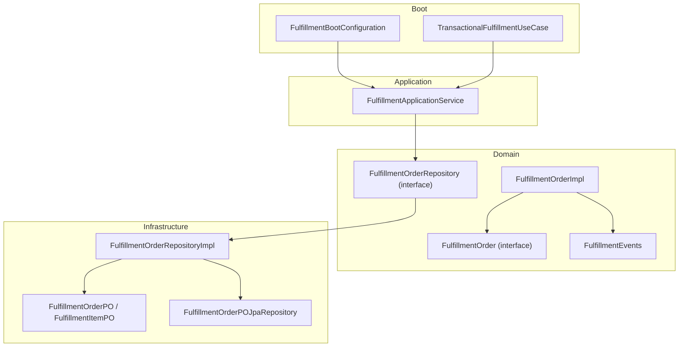
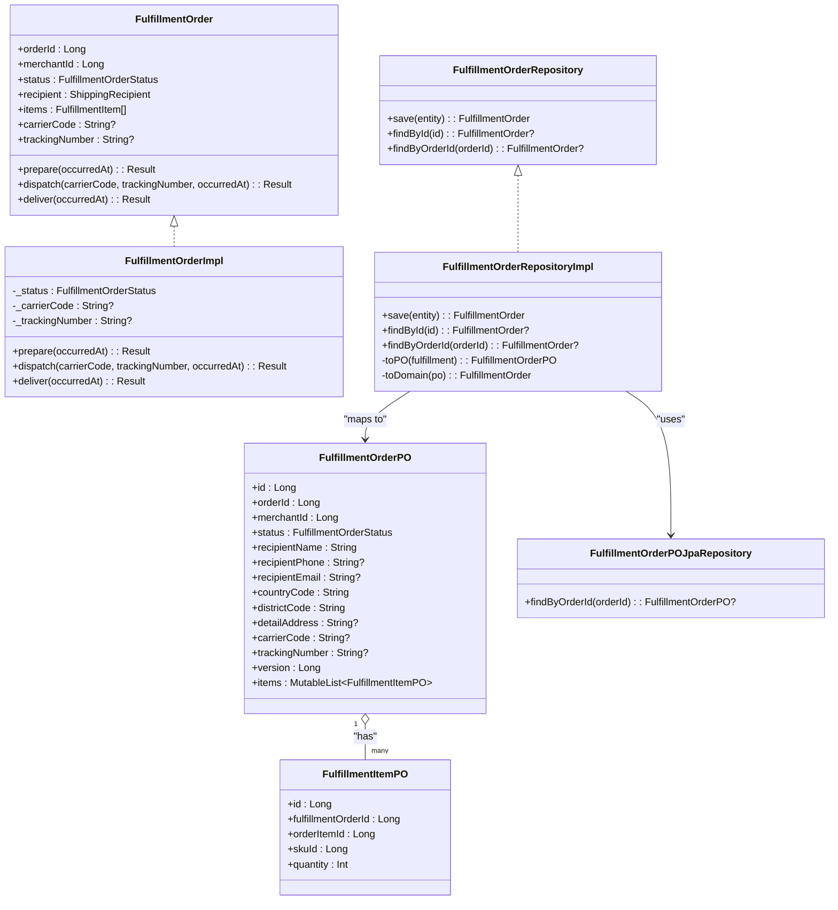
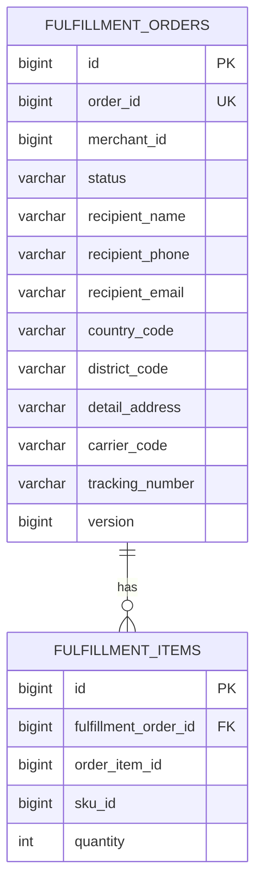
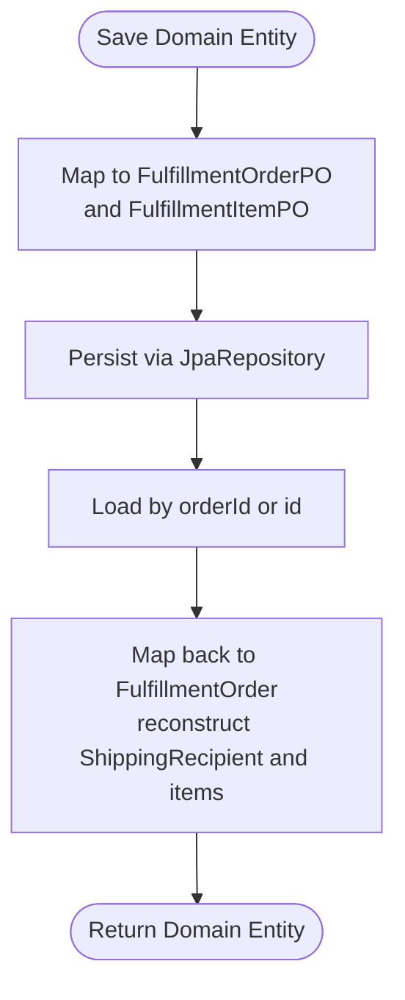
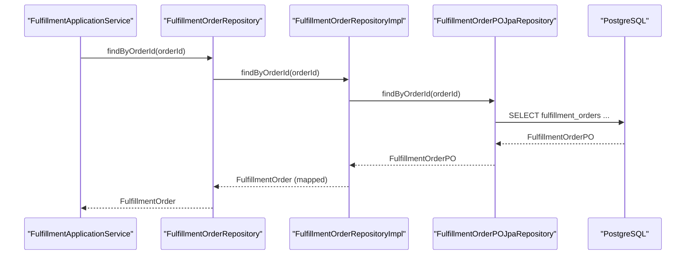
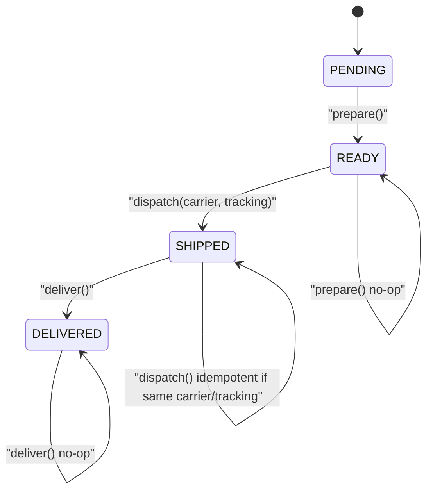
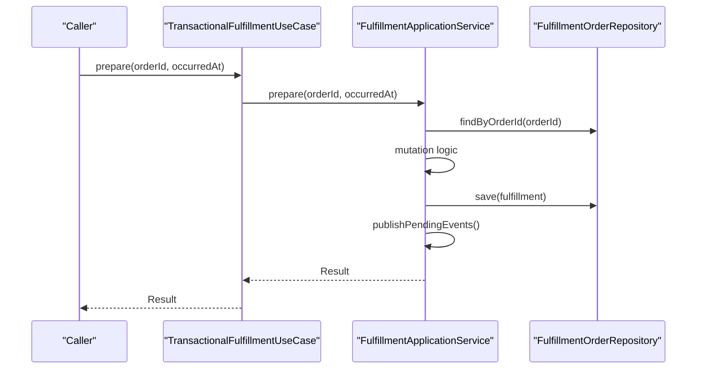
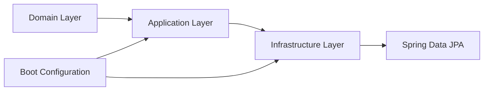

# Fulfillment Infrastructure

<cite>
**Referenced Files in This Document**
- [FulfillmentOrder.kt](file://j-store-fulfillment-domain/src/main/kotlin/com/jstore/fulfillment/domain/FulfillmentOrder.kt)
- [FulfillmentOrderImpl.kt](file://j-store-fulfillment-domain/src/main/kotlin/com/jstore/fulfillment/domain/FulfillmentOrderImpl.kt)
- [FulfillmentOrderRepository.kt](file://j-store-fulfillment-domain/src/main/kotlin/com/jstore/fulfillment/domain/FulfillmentOrderRepository.kt)
- [FulfillmentEvents.kt](file://j-store-fulfillment-domain/src/main/kotlin/com/jstore/fulfillment/domain/event/FulfillmentEvents.kt)
- [FulfillmentOrderPO.kt](file://j-store-fulfillment-infrastructure/src/main/kotlin/com/jstore/fulfillment/domain/persistence/FulfillmentOrderPO.kt)
- [FulfillmentOrderPOJpaRepository.kt](file://j-store-fulfillment-infrastructure/src/main/kotlin/com/jstore/fulfillment/domain/persistence/FulfillmentOrderPOJpaRepository.kt)
- [FulfillmentOrderRepositoryImpl.kt](file://j-store-fulfillment-infrastructure/src/main/kotlin/com/jstore/fulfillment/domain/FulfillmentOrderRepositoryImpl.kt)
- [FulfillmentApplicationService.kt](file://j-store-fulfillment-application/src/main/kotlin/com/jstore/fulfillment/service/FulfillmentApplicationService.kt)
- [FulfillmentBootConfiguration.kt](file://j-store-fulfillment-boot/src/main/kotlin/com/jstore/fulfillment/config/FulfillmentBootConfiguration.kt)
- [TransactionalFulfillmentUseCase.kt](file://j-store-fulfillment-boot/src/main/kotlin/com/jstore/fulfillment/config/TransactionalFulfillmentUseCase.kt)
- [V20260805__order_payment_fulfillment_boundaries.sql](file://j-store-boot/src/main/resources/db/migration/V20260805__order_payment_fulfillment_boundaries.sql)
</cite>

## Table of Contents
1. [Introduction](#introduction)
2. [Project Structure](#project-structure)
3. [Core Components](#core-components)
4. [Architecture Overview](#architecture-overview)
5. [Detailed Component Analysis](#detailed-component-analysis)
6. [Dependency Analysis](#dependency-analysis)
7. [Performance Considerations](#performance-considerations)
8. [Troubleshooting Guide](#troubleshooting-guide)
9. [Conclusion](#conclusion)

## Introduction
This document explains the Fulfillment Infrastructure layer, focusing on persistence for fulfillment orders using JPA entities and repositories. It details how domain models map to database entities, including status conversions and address serialization. It also documents the repository pattern implementation for CRUD operations and query methods, provides a database schema overview for fulfillment tables and their relationships with other modules, and outlines performance considerations and indexing strategies for high-volume fulfillment operations.

## Project Structure
The fulfillment feature is split across modular layers:
- Domain: aggregates, events, and repository interface
- Application: use cases and orchestration
- Infrastructure: JPA entities, Spring Data repository, and repository implementation
- Boot: configuration and transactional wrapping

**Diagram sources**
- [FulfillmentOrder.kt](file://j-store-fulfillment-domain/src/main/kotlin/com/jstore/fulfillment/domain/FulfillmentOrder.kt)
- [FulfillmentOrderImpl.kt](file://j-store-fulfillment-domain/src/main/kotlin/com/jstore/fulfillment/domain/FulfillmentOrderImpl.kt)
- [FulfillmentOrderRepository.kt](file://j-store-fulfillment-domain/src/main/kotlin/com/jstore/fulfillment/domain/FulfillmentOrderRepository.kt)
- [FulfillmentEvents.kt](file://j-store-fulfillment-domain/src/main/kotlin/com/jstore/fulfillment/domain/event/FulfillmentEvents.kt)
- [FulfillmentOrderPO.kt](file://j-store-fulfillment-infrastructure/src/main/kotlin/com/jstore/fulfillment/domain/persistence/FulfillmentOrderPO.kt)
- [FulfillmentOrderPOJpaRepository.kt](file://j-store-fulfillment-infrastructure/src/main/kotlin/com/jstore/fulfillment/domain/persistence/FulfillmentOrderPOJpaRepository.kt)
- [FulfillmentOrderRepositoryImpl.kt](file://j-store-fulfillment-infrastructure/src/main/kotlin/com/jstore/fulfillment/domain/FulfillmentOrderRepositoryImpl.kt)
- [FulfillmentApplicationService.kt](file://j-store-fulfillment-application/src/main/kotlin/com/jstore/fulfillment/service/FulfillmentApplicationService.kt)
- [FulfillmentBootConfiguration.kt](file://j-store-fulfillment-boot/src/main/kotlin/com/jstore/fulfillment/config/FulfillmentBootConfiguration.kt)
- [TransactionalFulfillmentUseCase.kt](file://j-store-fulfillment-boot/src/main/kotlin/com/jstore/fulfillment/config/TransactionalFulfillmentUseCase.kt)

**Section sources**
- [FulfillmentOrder.kt](file://j-store-fulfillment-domain/src/main/kotlin/com/jstore/fulfillment/domain/FulfillmentOrder.kt)
- [FulfillmentOrderImpl.kt](file://j-store-fulfillment-domain/src/main/kotlin/com/jstore/fulfillment/domain/FulfillmentOrderImpl.kt)
- [FulfillmentOrderRepository.kt](file://j-store-fulfillment-domain/src/main/kotlin/com/jstore/fulfillment/domain/FulfillmentOrderRepository.kt)
- [FulfillmentEvents.kt](file://j-store-fulfillment-domain/src/main/kotlin/com/jstore/fulfillment/domain/event/FulfillmentEvents.kt)
- [FulfillmentOrderPO.kt](file://j-store-fulfillment-infrastructure/src/main/kotlin/com/jstore/fulfillment/domain/persistence/FulfillmentOrderPO.kt)
- [FulfillmentOrderPOJpaRepository.kt](file://j-store-fulfillment-infrastructure/src/main/kotlin/com/jstore/fulfillment/domain/persistence/FulfillmentOrderPOJpaRepository.kt)
- [FulfillmentOrderRepositoryImpl.kt](file://j-store-fulfillment-infrastructure/src/main/kotlin/com/jstore/fulfillment/domain/FulfillmentOrderRepositoryImpl.kt)
- [FulfillmentApplicationService.kt](file://j-store-fulfillment-application/src/main/kotlin/com/jstore/fulfillment/service/FulfillmentApplicationService.kt)
- [FulfillmentBootConfiguration.kt](file://j-store-fulfillment-boot/src/main/kotlin/com/jstore/fulfillment/config/FulfillmentBootConfiguration.kt)
- [TransactionalFulfillmentUseCase.kt](file://j-store-fulfillment-boot/src/main/kotlin/com/jstore/fulfillment/config/TransactionalFulfillmentUseCase.kt)

## Core Components
- Domain aggregate: FulfillmentOrder defines state transitions (PENDING → READY → SHIPPED → DELIVERED), shipping recipient data, and items. Implementation enforces business rules and emits domain events.
- Repository interface: AggregateRepository-based contract with an additional findByOrderId query.
- Infrastructure mapping: JPA entities represent fulfillment_orders and fulfillment_items; repository implementation converts between domain and persistence models.
- Application service: Orchestrates creation and mutations, persists changes, and publishes pending domain events.
- Boot configuration: Wires beans and applies read/write transaction boundaries.

Key responsibilities:
- Status conversion: Enum values map directly to VARCHAR columns via @Enumerated(STRING).
- Address serialization: ShippingRecipient fields are persisted as individual columns (name, phone, email, country_code, district_code, detail_address).
- Items mapping: One-to-many relationship from fulfillment order to items with eager loading and cascade persistence.

**Section sources**
- [FulfillmentOrder.kt](file://j-store-fulfillment-domain/src/main/kotlin/com/jstore/fulfillment/domain/FulfillmentOrder.kt)
- [FulfillmentOrderImpl.kt](file://j-store-fulfillment-domain/src/main/kotlin/com/jstore/fulfillment/domain/FulfillmentOrderImpl.kt)
- [FulfillmentOrderRepository.kt](file://j-store-fulfillment-domain/src/main/kotlin/com/jstore/fulfillment/domain/FulfillmentOrderRepository.kt)
- [FulfillmentOrderPO.kt](file://j-store-fulfillment-infrastructure/src/main/kotlin/com/jstore/fulfillment/domain/persistence/FulfillmentOrderPO.kt)
- [FulfillmentOrderRepositoryImpl.kt](file://j-store-fulfillment-infrastructure/src/main/kotlin/com/jstore/fulfillment/domain/FulfillmentOrderRepositoryImpl.kt)
- [FulfillmentApplicationService.kt](file://j-store-fulfillment-application/src/main/kotlin/com/jstore/fulfillment/service/FulfillmentApplicationService.kt)
- [FulfillmentBootConfiguration.kt](file://j-store-fulfillment-boot/src/main/kotlin/com/jstore/fulfillment/config/FulfillmentBootConfiguration.kt)
- [TransactionalFulfillmentUseCase.kt](file://j-store-fulfillment-boot/src/main/kotlin/com/jstore/fulfillment/config/TransactionalFulfillmentUseCase.kt)

## Architecture Overview
The fulfillment infrastructure follows DDD with clear separation:
- Domain layer owns business logic and events.
- Application layer coordinates use cases and event publishing.
- Infrastructure layer implements persistence via JPA and Spring Data.
- Boot layer configures transactions and wiring.

**Diagram sources**
- [FulfillmentOrder.kt](file://j-store-fulfillment-domain/src/main/kotlin/com/jstore/fulfillment/domain/FulfillmentOrder.kt)
- [FulfillmentOrderImpl.kt](file://j-store-fulfillment-domain/src/main/kotlin/com/jstore/fulfillment/domain/FulfillmentOrderImpl.kt)
- [FulfillmentOrderRepository.kt](file://j-store-fulfillment-domain/src/main/kotlin/com/jstore/fulfillment/domain/FulfillmentOrderRepository.kt)
- [FulfillmentOrderRepositoryImpl.kt](file://j-store-fulfillment-infrastructure/src/main/kotlin/com/jstore/fulfillment/domain/FulfillmentOrderRepositoryImpl.kt)
- [FulfillmentOrderPO.kt](file://j-store-fulfillment-infrastructure/src/main/kotlin/com/jstore/fulfillment/domain/persistence/FulfillmentOrderPO.kt)
- [FulfillmentOrderPOJpaRepository.kt](file://j-store-fulfillment-infrastructure/src/main/kotlin/com/jstore/fulfillment/domain/persistence/FulfillmentOrderPOJpaRepository.kt)

## Detailed Component Analysis

### Persistence Entities and Schema
- fulfillment_orders stores core fulfillment state, recipient details, carrier/tracking info, and version for optimistic locking.
- fulfillment_items stores line-level details linked to the parent order.
- The schema includes constraints ensuring consistency between status and shipping fields.

**Diagram sources**
- [V20260805__order_payment_fulfillment_boundaries.sql](file://j-store-boot/src/main/resources/db/migration/V20260805__order_payment_fulfillment_boundaries.sql)

**Section sources**
- [FulfillmentOrderPO.kt](file://j-store-fulfillment-infrastructure/src/main/kotlin/com/jstore/fulfillment/domain/persistence/FulfillmentOrderPO.kt)
- [V20260805__order_payment_fulfillment_boundaries.sql](file://j-store-boot/src/main/resources/db/migration/V20260805__order_payment_fulfillment_boundaries.sql)

### Data Mapping and Conversions
- Status mapping: EnumType.STRING maps domain statuses to VARCHAR columns.
- Address serialization: ShippingRecipient fields are flattened into separate columns for efficient querying and storage.
- Items mapping: One-to-many with EAGER fetch and cascading saves; item list is reconstructed from child entities.

**Diagram sources**
- [FulfillmentOrderRepositoryImpl.kt](file://j-store-fulfillment-infrastructure/src/main/kotlin/com/jstore/fulfillment/domain/FulfillmentOrderRepositoryImpl.kt)
- [FulfillmentOrderPO.kt](file://j-store-fulfillment-infrastructure/src/main/kotlin/com/jstore/fulfillment/domain/persistence/FulfillmentOrderPO.kt)

**Section sources**
- [FulfillmentOrderRepositoryImpl.kt](file://j-store-fulfillment-infrastructure/src/main/kotlin/com/jstore/fulfillment/domain/FulfillmentOrderRepositoryImpl.kt)
- [FulfillmentOrderPO.kt](file://j-store-fulfillment-infrastructure/src/main/kotlin/com/jstore/fulfillment/domain/persistence/FulfillmentOrderPO.kt)

### Repository Pattern Implementation
- Interface: AggregateRepository-based with findByOrderId.
- Implementation: Uses Spring Data JPA repository; wraps save/find operations with domain↔PO mapping.
- Transaction boundary: MANDATORY propagation ensures calls occur within an existing transaction.

**Diagram sources**
- [FulfillmentOrderRepository.kt](file://j-store-fulfillment-domain/src/main/kotlin/com/jstore/fulfillment/domain/FulfillmentOrderRepository.kt)
- [FulfillmentOrderRepositoryImpl.kt](file://j-store-fulfillment-infrastructure/src/main/kotlin/com/jstore/fulfillment/domain/FulfillmentOrderRepositoryImpl.kt)
- [FulfillmentOrderPOJpaRepository.kt](file://j-store-fulfillment-infrastructure/src/main/kotlin/com/jstore/fulfillment/domain/persistence/FulfillmentOrderPOJpaRepository.kt)

**Section sources**
- [FulfillmentOrderRepository.kt](file://j-store-fulfillment-domain/src/main/kotlin/com/jstore/fulfillment/domain/FulfillmentOrderRepository.kt)
- [FulfillmentOrderRepositoryImpl.kt](file://j-store-fulfillment-infrastructure/src/main/kotlin/com/jstore/fulfillment/domain/FulfillmentOrderRepositoryImpl.kt)
- [FulfillmentOrderPOJpaRepository.kt](file://j-store-fulfillment-infrastructure/src/main/kotlin/com/jstore/fulfillment/domain/persistence/FulfillmentOrderPOJpaRepository.kt)

### State Transitions and Event Publishing
- prepare: PENDING → READY, emits prepared event.
- dispatch: READY → SHIPPED, validates carrier/tracking, emits dispatched event.
- deliver: SHIPPED → DELIVERED, emits delivered event.
- Idempotency: Repeated calls return success without side effects when state is already set.

**Diagram sources**
- [FulfillmentOrderImpl.kt](file://j-store-fulfillment-domain/src/main/kotlin/com/jstore/fulfillment/domain/FulfillmentOrderImpl.kt)
- [FulfillmentEvents.kt](file://j-store-fulfillment-domain/src/main/kotlin/com/jstore/fulfillment/domain/event/FulfillmentEvents.kt)

**Section sources**
- [FulfillmentOrderImpl.kt](file://j-store-fulfillment-domain/src/main/kotlin/com/jstore/fulfillment/domain/FulfillmentOrderImpl.kt)
- [FulfillmentEvents.kt](file://j-store-fulfillment-domain/src/main/kotlin/com/jstore/fulfillment/domain/event/FulfillmentEvents.kt)

### Application Orchestration and Transactions
- createForOrder: Checks for existing fulfillment per order, creates new aggregate, persists, and publishes pending events.
- Mutations (prepare/dispatch/deliver): Load by orderId, apply operation, persist if changed, publish pending events.
- Transactional wrapper: Read-only queries vs write transactions enforced via TransactionTemplate.

**Diagram sources**
- [FulfillmentApplicationService.kt](file://j-store-fulfillment-application/src/main/kotlin/com/jstore/fulfillment/service/FulfillmentApplicationService.kt)
- [TransactionalFulfillmentUseCase.kt](file://j-store-fulfillment-boot/src/main/kotlin/com/jstore/fulfillment/config/TransactionalFulfillmentUseCase.kt)

**Section sources**
- [FulfillmentApplicationService.kt](file://j-store-fulfillment-application/src/main/kotlin/com/jstore/fulfillment/service/FulfillmentApplicationService.kt)
- [TransactionalFulfillmentUseCase.kt](file://j-store-fulfillment-boot/src/main/kotlin/com/jstore/fulfillment/config/TransactionalFulfillmentUseCase.kt)
- [FulfillmentBootConfiguration.kt](file://j-store-fulfillment-boot/src/main/kotlin/com/jstore/fulfillment/config/FulfillmentBootConfiguration.kt)

## Dependency Analysis
- Domain depends only on common framework abstractions and its own events.
- Infrastructure depends on domain interfaces and Spring Data JPA.
- Application depends on domain interfaces and common utilities (event publisher, sequence generator).
- Boot wires application and infrastructure components and applies transaction boundaries.

**Diagram sources**
- [FulfillmentOrderRepository.kt](file://j-store-fulfillment-domain/src/main/kotlin/com/jstore/fulfillment/domain/FulfillmentOrderRepository.kt)
- [FulfillmentOrderRepositoryImpl.kt](file://j-store-fulfillment-infrastructure/src/main/kotlin/com/jstore/fulfillment/domain/FulfillmentOrderRepositoryImpl.kt)
- [FulfillmentApplicationService.kt](file://j-store-fulfillment-application/src/main/kotlin/com/jstore/fulfillment/service/FulfillmentApplicationService.kt)
- [FulfillmentBootConfiguration.kt](file://j-store-fulfillment-boot/src/main/kotlin/com/jstore/fulfillment/config/FulfillmentBootConfiguration.kt)

**Section sources**
- [FulfillmentOrderRepository.kt](file://j-store-fulfillment-domain/src/main/kotlin/com/jstore/fulfillment/domain/FulfillmentOrderRepository.kt)
- [FulfillmentOrderRepositoryImpl.kt](file://j-store-fulfillment-infrastructure/src/main/kotlin/com/jstore/fulfillment/domain/FulfillmentOrderRepositoryImpl.kt)
- [FulfillmentApplicationService.kt](file://j-store-fulfillment-application/src/main/kotlin/com/jstore/fulfillment/service/FulfillmentApplicationService.kt)
- [FulfillmentBootConfiguration.kt](file://j-store-fulfillment-boot/src/main/kotlin/com/jstore/fulfillment/config/FulfillmentBootConfiguration.kt)

## Performance Considerations
- Indexing strategy:
  - fulfillment_orders.merchant_id, status composite index supports merchant-scoped queries and status filtering.
  - fulfillment_items.fulfillment_order_id index accelerates item retrieval by order.
  - Unique constraints on order_id and fulfillment_reference ensure fast lookups and prevent duplicates.
- Optimistic concurrency:
  - Version column prevents lost updates under concurrent writes.
- Fetch strategy:
  - Eager loading of items simplifies persistence but may increase payload size; consider lazy loading for large datasets if needed.
- Transaction design:
  - Write operations use explicit transactions; read operations are marked read-only to leverage connection pool optimizations.
- High-volume recommendations:
  - Batch inserts for initial seeding or bulk imports.
  - Partitioning by merchant_id or time-based partitions if growth demands.
  - Connection pool tuning and query monitoring for hot paths.

[No sources needed since this section provides general guidance]

## Troubleshooting Guide
- NOT_FOUND errors: Occur when no fulfillment exists for the given orderId; verify creation flow and unique order_id constraint.
- INVALID_STATE errors: State transitions not allowed; check current status before calling prepare/dispatch/deliver.
- SHIPPING_REFERENCE_INVALID/CONFLICT: Dispatch requires non-empty carrier and tracking; conflicts arise when attempting to change references after shipment.
- ORDER_CONFLICT: Duplicate fulfillment creation attempts with mismatched merchant/recipient/items; ensure idempotent creation checks.
- Concurrency issues: Conflicts due to version mismatches; retry logic or user-friendly error handling recommended.

**Section sources**
- [FulfillmentApplicationService.kt](file://j-store-fulfillment-application/src/main/kotlin/com/jstore/fulfillment/service/FulfillmentApplicationService.kt)
- [FulfillmentOrderImpl.kt](file://j-store-fulfillment-domain/src/main/kotlin/com/jstore/fulfillment/domain/FulfillmentOrderImpl.kt)

## Conclusion
The Fulfillment Infrastructure layer cleanly separates domain logic, application orchestration, and persistence concerns. JPA entities and repositories provide robust CRUD capabilities with well-defined mappings and constraints. The schema and indexes support efficient queries for merchant-scoped operations and item lookups. With optimistic concurrency and explicit transaction boundaries, the system is positioned for high-volume scenarios while maintaining data integrity and clear auditability through domain events.