# Fulfillment Management Module

<cite>
**Referenced Files in This Document**
- [FulfillmentApplicationService.kt](file://j-store-fulfillment-application/src/main/kotlin/com/jstore/fulfillment/service/FulfillmentApplicationService.kt)
- [FulfillmentUseCase.kt](file://j-store-fulfillment-application/src/main/kotlin/com/jstore/fulfillment/service/FulfillmentUseCase.kt)
- [FulfillmentIntegrationMessageHandler.kt](file://j-store-fulfillment-application/src/main/kotlin/com/jstore/fulfillment/service/FulfillmentIntegrationMessageHandler.kt)
- [FulfillmentController.kt](file://j-store-fulfillment-boot/src/main/kotlin/com/jstore/fulfillment/controller/FulfillmentController.kt)
- [FulfillmentBootConfiguration.kt](file://j-store-fulfillment-boot/src/main/kotlin/com/jstore/fulfillment/config/FulfillmentBootConfiguration.kt)
- [FulfillmentOrder.kt](file://j-store-fulfillment-domain/src/main/kotlin/com/jstore/fulfillment/domain/FulfillmentOrder.kt)
- [FulfillmentOrderImpl.kt](file://j-store-fulfillment-domain/src/main/kotlin/com/jstore/fulfillment/domain/FulfillmentOrderImpl.kt)
- [FulfillmentEvents.kt](file://j-store-fulfillment-domain/src/main/kotlin/com/jstore/fulfillment/domain/event/FulfillmentEvents.kt)
- [FulfillmentErrors.kt](file://j-store-fulfillment-domain/src/main/kotlin/com/jstore/fulfillment/domain/FulfillmentErrors.kt)
- [FulfillmentOrderRepository.kt](file://j-store-fulfillment-domain/src/main/kotlin/com/jstore/fulfillment/domain/FulfillmentOrderRepository.kt)
- [FulfillmentOrderRepositoryImpl.kt](file://j-store-fulfillment-infrastructure/src/main/kotlin/com/jstore/fulfillment/domain/FulfillmentOrderRepositoryImpl.kt)
- [FulfillmentOrderTest.kt](file://j-store-fulfillment-domain/src/test/kotlin/com/jstore/fulfillment/domain/FulfillmentOrderTest.kt)
</cite>

## Table of Contents
1. Introduction
2. Project Structure
3. Core Components
4. Architecture Overview
5. Detailed Component Analysis
6. Dependency Analysis
7. Performance Considerations
8. Troubleshooting Guide
9. Conclusion

## Introduction
This document explains the Fulfillment Management module, focusing on the fulfillment order lifecycle, shipping preparation, dispatch coordination, delivery tracking, integration with logistics providers, and return processing workflows. It also covers status management and coordination with order and inventory systems, event-driven communication, and performance considerations for high-volume operations. The content is designed to be accessible to beginners while providing sufficient technical depth for experienced developers.

## Project Structure
The Fulfillment Management module follows a layered DDD architecture:
- Domain layer defines aggregates, entities, events, and repository interfaces.
- Application layer implements use cases and orchestrates domain operations.
- Infrastructure layer provides persistence implementations.
- Boot layer exposes HTTP endpoints and wires configuration.

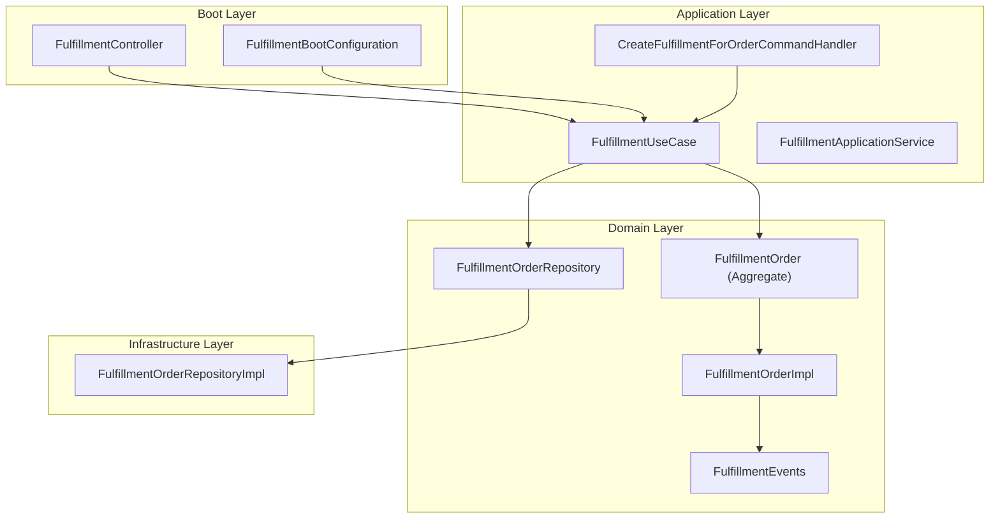

**Diagram sources**
- [FulfillmentController.kt](file://j-store-fulfillment-boot/src/main/kotlin/com/jstore/fulfillment/controller/FulfillmentController.kt)
- [FulfillmentBootConfiguration.kt](file://j-store-fulfillment-boot/src/main/kotlin/com/jstore/fulfillment/config/FulfillmentBootConfiguration.kt)
- [FulfillmentUseCase.kt](file://j-store-fulfillment-application/src/main/kotlin/com/jstore/fulfillment/service/FulfillmentUseCase.kt)
- [FulfillmentApplicationService.kt](file://j-store-fulfillment-application/src/main/kotlin/com/jstore/fulfillment/service/FulfillmentApplicationService.kt)
- [FulfillmentIntegrationMessageHandler.kt](file://j-store-fulfillment-application/src/main/kotlin/com/jstore/fulfillment/service/FulfillmentIntegrationMessageHandler.kt)
- [FulfillmentOrder.kt](file://j-store-fulfillment-domain/src/main/kotlin/com/jstore/fulfillment/domain/FulfillmentOrder.kt)
- [FulfillmentOrderImpl.kt](file://j-store-fulfillment-domain/src/main/kotlin/com/jstore/fulfillment/domain/FulfillmentOrderImpl.kt)
- [FulfillmentEvents.kt](file://j-store-fulfillment-domain/src/main/kotlin/com/jstore/fulfillment/domain/event/FulfillmentEvents.kt)
- [FulfillmentOrderRepository.kt](file://j-store-fulfillment-domain/src/main/kotlin/com/jstore/fulfillment/domain/FulfillmentOrderRepository.kt)
- [FulfillmentOrderRepositoryImpl.kt](file://j-store-fulfillment-infrastructure/src/main/kotlin/com/jstore/fulfillment/domain/FulfillmentOrderRepositoryImpl.kt)

**Section sources**
- [FulfillmentController.kt](file://j-store-fulfillment-boot/src/main/kotlin/com/jstore/fulfillment/controller/FulfillmentController.kt)
- [FulfillmentBootConfiguration.kt](file://j-store-fulfillment-boot/src/main/kotlin/com/jstore/fulfillment/config/FulfillmentBootConfiguration.kt)
- [FulfillmentUseCase.kt](file://j-store-fulfillment-application/src/main/kotlin/com/jstore/fulfillment/service/FulfillmentUseCase.kt)
- [FulfillmentApplicationService.kt](file://j-store-fulfillment-application/src/main/kotlin/com/jstore/fulfillment/service/FulfillmentApplicationService.kt)
- [FulfillmentIntegrationMessageHandler.kt](file://j-store-fulfillment-application/src/main/kotlin/com/jstore/fulfillment/service/FulfillmentIntegrationMessageHandler.kt)
- [FulfillmentOrder.kt](file://j-store-fulfillment-domain/src/main/kotlin/com/jstore/fulfillment/domain/FulfillmentOrder.kt)
- [FulfillmentOrderImpl.kt](file://j-store-fulfillment-domain/src/main/kotlin/com/jstore/fulfillment/domain/FulfillmentOrderImpl.kt)
- [FulfillmentEvents.kt](file://j-store-fulfillment-domain/src/main/kotlin/com/jstore/fulfillment/domain/event/FulfillmentEvents.kt)
- [FulfillmentOrderRepository.kt](file://j-store-fulfillment-domain/src/main/kotlin/com/jstore/fulfillment/domain/FulfillmentOrderRepository.kt)
- [FulfillmentOrderRepositoryImpl.kt](file://j-store-fulfillment-infrastructure/src/main/kotlin/com/jstore/fulfillment/domain/FulfillmentOrderRepositoryImpl.kt)

## Core Components
- FulfillmentOrder (aggregate): encapsulates lifecycle states PENDING → READY → SHIPPED → DELIVERED, shipping details, and items.
- FulfillmentOrderImpl: enforces state transitions, validates inputs, and raises domain events.
- FulfillmentApplicationService: orchestrates create, prepare, dispatch, deliver; persists changes and publishes pending events.
- FulfillmentController: exposes REST endpoints with merchant authorization checks.
- Repository interface and implementation: abstracts persistence and maps between domain and persistence models.
- Integration message handler: consumes external commands to create fulfillments for orders.

Key responsibilities:
- State machine enforcement and idempotency for shipping updates.
- Event emission for downstream consumers (e.g., order, inventory, notifications).
- Transactional persistence with mandatory transaction propagation.

**Section sources**
- [FulfillmentOrder.kt](file://j-store-fulfillment-domain/src/main/kotlin/com/jstore/fulfillment/domain/FulfillmentOrder.kt)
- [FulfillmentOrderImpl.kt](file://j-store-fulfillment-domain/src/main/kotlin/com/jstore/fulfillment/domain/FulfillmentOrderImpl.kt)
- [FulfillmentApplicationService.kt](file://j-store-fulfillment-application/src/main/kotlin/com/jstore/fulfillment/service/FulfillmentApplicationService.kt)
- [FulfillmentController.kt](file://j-store-fulfillment-boot/src/main/kotlin/com/jstore/fulfillment/controller/FulfillmentController.kt)
- [FulfillmentOrderRepository.kt](file://j-store-fulfillment-domain/src/main/kotlin/com/jstore/fulfillment/domain/FulfillmentOrderRepository.kt)
- [FulfillmentOrderRepositoryImpl.kt](file://j-store-fulfillment-infrastructure/src/main/kotlin/com/jstore/fulfillment/domain/FulfillmentOrderRepositoryImpl.kt)
- [FulfillmentIntegrationMessageHandler.kt](file://j-store-fulfillment-application/src/main/kotlin/com/jstore/fulfillment/service/FulfillmentIntegrationMessageHandler.kt)

## Architecture Overview
The module uses an event-driven approach. Domain actions raise events that are persisted and published via a publisher. Downstream modules subscribe to these events to update their own state (e.g., order fulfillment status, inventory reservations, notifications).

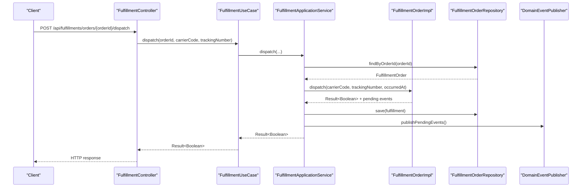

**Diagram sources**
- [FulfillmentController.kt](file://j-store-fulfillment-boot/src/main/kotlin/com/jstore/fulfillment/controller/FulfillmentController.kt)
- [FulfillmentUseCase.kt](file://j-store-fulfillment-application/src/main/kotlin/com/jstore/fulfillment/service/FulfillmentUseCase.kt)
- [FulfillmentApplicationService.kt](file://j-store-fulfillment-application/src/main/kotlin/com/jstore/fulfillment/service/FulfillmentApplicationService.kt)
- [FulfillmentOrderImpl.kt](file://j-store-fulfillment-domain/src/main/kotlin/com/jstore/fulfillment/domain/FulfillmentOrderImpl.kt)
- [FulfillmentOrderRepository.kt](file://j-store-fulfillment-domain/src/main/kotlin/com/jstore/fulfillment/domain/FulfillmentOrderRepository.kt)
- [FulfillmentOrderRepositoryImpl.kt](file://j-store-fulfillment-infrastructure/src/main/kotlin/com/jstore/fulfillment/domain/FulfillmentOrderRepositoryImpl.kt)

## Detailed Component Analysis

### Fulfillment Order Lifecycle and Status Management
- States: PENDING, READY, SHIPPED, DELIVERED.
- Transitions:
  - Prepare: PENDING → READY
  - Dispatch: READY → SHIPPED (with carrier code and tracking number)
  - Deliver: SHIPPED → DELIVERED
- Idempotency:
  - Re-dispatching with the same carrier and tracking number returns no change.
  - Conflicting shipping references are rejected.

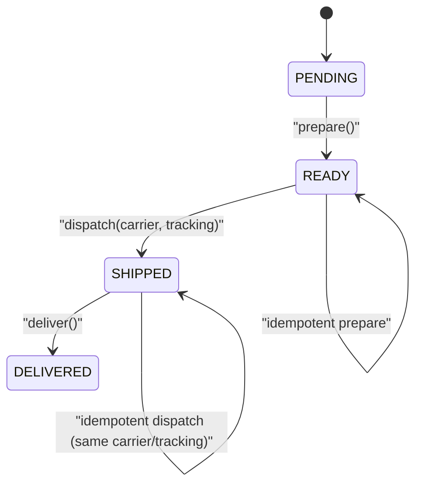

**Diagram sources**
- [FulfillmentOrder.kt](file://j-store-fulfillment-domain/src/main/kotlin/com/jstore/fulfillment/domain/FulfillmentOrder.kt)
- [FulfillmentOrderImpl.kt](file://j-store-fulfillment-domain/src/main/kotlin/com/jstore/fulfillment/domain/FulfillmentOrderImpl.kt)

**Section sources**
- [FulfillmentOrder.kt](file://j-store-fulfillment-domain/src/main/kotlin/com/jstore/fulfillment/domain/FulfillmentOrder.kt)
- [FulfillmentOrderImpl.kt](file://j-store-fulfillment-domain/src/main/kotlin/com/jstore/fulfillment/domain/FulfillmentOrderImpl.kt)
- [FulfillmentOrderTest.kt](file://j-store-fulfillment-domain/src/test/kotlin/com/jstore/fulfillment/domain/FulfillmentOrderTest.kt)

### Shipping Preparation and Dispatch Coordination
- Preparation marks the fulfillment ready for shipping and emits a prepared event.
- Dispatch records carrier code and tracking number, normalizes inputs, and emits a dispatched event.
- Validation ensures required fields and prevents invalid state transitions or conflicting shipping references.

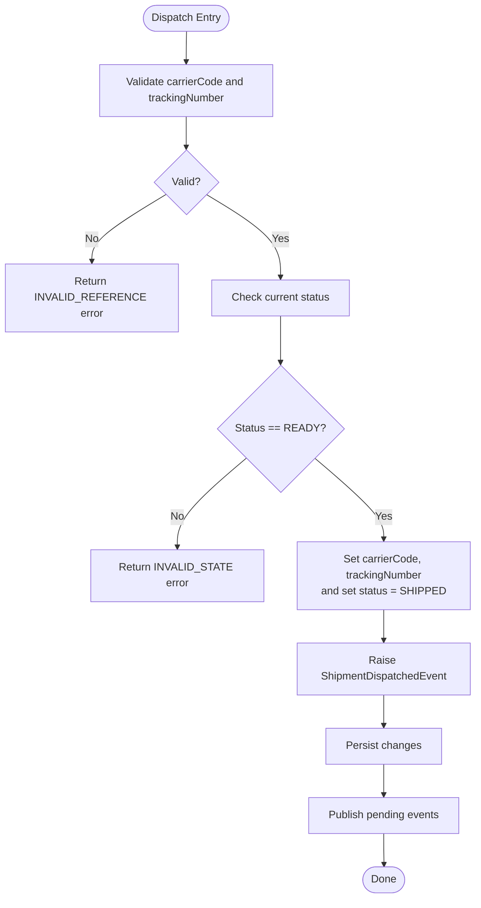

**Diagram sources**
- [FulfillmentOrderImpl.kt](file://j-store-fulfillment-domain/src/main/kotlin/com/jstore/fulfillment/domain/FulfillmentOrderImpl.kt)
- [FulfillmentApplicationService.kt](file://j-store-fulfillment-application/src/main/kotlin/com/jstore/fulfillment/service/FulfillmentApplicationService.kt)

**Section sources**
- [FulfillmentOrderImpl.kt](file://j-store-fulfillment-domain/src/main/kotlin/com/jstore/fulfillment/domain/FulfillmentOrderImpl.kt)
- [FulfillmentApplicationService.kt](file://j-store-fulfillment-application/src/main/kotlin/com/jstore/fulfillment/service/FulfillmentApplicationService.kt)

### Delivery Tracking and Confirmation
- Deliver transitions from SHIPPED to DELIVERED and emits a delivered event.
- Idempotency allows repeated delivery confirmations without side effects.

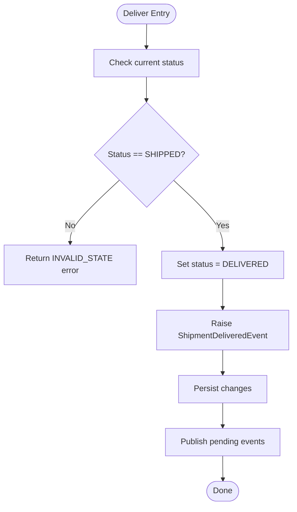

**Diagram sources**
- [FulfillmentOrderImpl.kt](file://j-store-fulfillment-domain/src/main/kotlin/com/jstore/fulfillment/domain/FulfillmentOrderImpl.kt)
- [FulfillmentApplicationService.kt](file://j-store-fulfillment-application/src/main/kotlin/com/jstore/fulfillment/service/FulfillmentApplicationService.kt)

**Section sources**
- [FulfillmentOrderImpl.kt](file://j-store-fulfillment-domain/src/main/kotlin/com/jstore/fulfillment/domain/FulfillmentOrderImpl.kt)
- [FulfillmentApplicationService.kt](file://j-store-fulfillment-application/src/main/kotlin/com/jstore/fulfillment/service/FulfillmentApplicationService.kt)

### Integration with Logistics Providers
- Carrier codes and tracking numbers are captured during dispatch.
- Normalization ensures consistent values across providers.
- Consumers can subscribe to dispatched events to integrate with external logistics APIs (e.g., label generation, shipment creation).

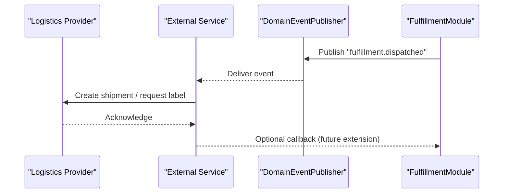

**Diagram sources**
- [FulfillmentEvents.kt](file://j-store-fulfillment-domain/src/main/kotlin/com/jstore/fulfillment/domain/event/FulfillmentEvents.kt)
- [FulfillmentApplicationService.kt](file://j-store-fulfillment-application/src/main/kotlin/com/jstore/fulfillment/service/FulfillmentApplicationService.kt)

**Section sources**
- [FulfillmentEvents.kt](file://j-store-fulfillment-domain/src/main/kotlin/com/jstore/fulfillment/domain/event/FulfillmentEvents.kt)
- [FulfillmentApplicationService.kt](file://j-store-fulfillment-application/src/main/kotlin/com/jstore/fulfillment/service/FulfillmentApplicationService.kt)

### Return Processing Workflows
- Returns are modeled in the after-sale aggregate and interact with fulfillment through shared order identifiers.
- When a return is approved and requires item return, downstream processes may trigger reverse logistics using fulfillment data (carrier/tracking) if applicable.
- The fulfillment module itself does not manage after-sale logic but participates via events and shared order context.

[No sources needed since this section describes conceptual interaction patterns rather than specific file analysis]

### Event-Driven Communication with Other Modules
- Prepared event: signals readiness for shipping; order module can update fulfillment_status accordingly.
- Dispatched event: carries carrier and tracking info; order and notification services can consume it.
- Delivered event: finalizes delivery; order completion and customer notifications can be triggered.

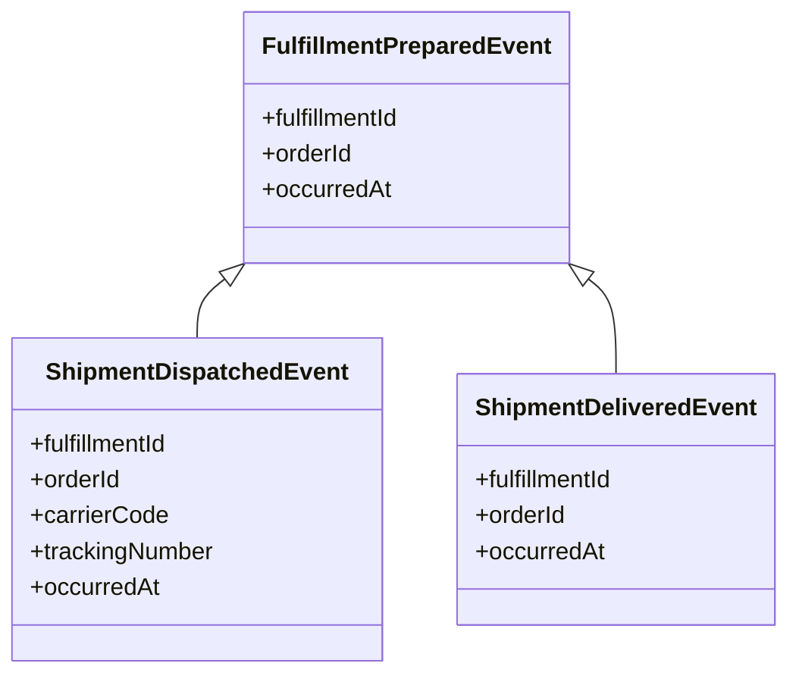

**Diagram sources**
- [FulfillmentEvents.kt](file://j-store-fulfillment-domain/src/main/kotlin/com/jstore/fulfillment/domain/event/FulfillmentEvents.kt)

**Section sources**
- [FulfillmentEvents.kt](file://j-store-fulfillment-domain/src/main/kotlin/com/jstore/fulfillment/domain/event/FulfillmentEvents.kt)

### Concrete Examples

#### Fulfillment Creation
- External command triggers creation for an order with recipient and items.
- Application service checks for existing fulfillment and either returns it or creates a new one, then publishes pending events.

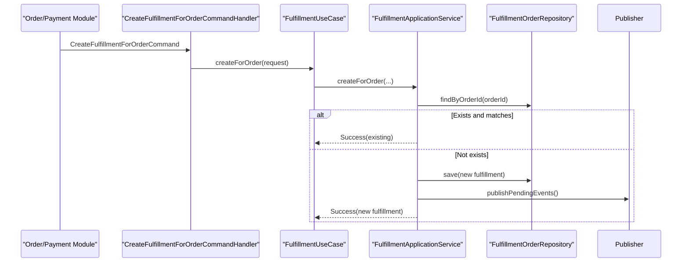

**Diagram sources**
- [FulfillmentIntegrationMessageHandler.kt](file://j-store-fulfillment-application/src/main/kotlin/com/jstore/fulfillment/service/FulfillmentIntegrationMessageHandler.kt)
- [FulfillmentApplicationService.kt](file://j-store-fulfillment-application/src/main/kotlin/com/jstore/fulfillment/service/FulfillmentApplicationService.kt)
- [FulfillmentOrderRepository.kt](file://j-store-fulfillment-domain/src/main/kotlin/com/jstore/fulfillment/domain/FulfillmentOrderRepository.kt)

**Section sources**
- [FulfillmentIntegrationMessageHandler.kt](file://j-store-fulfillment-application/src/main/kotlin/com/jstore/fulfillment/service/FulfillmentIntegrationMessageHandler.kt)
- [FulfillmentApplicationService.kt](file://j-store-fulfillment-application/src/main/kotlin/com/jstore/fulfillment/service/FulfillmentApplicationService.kt)

#### Shipping Updates
- Merchant calls dispatch endpoint with carrier code and tracking number.
- Domain validates and transitions to SHIPPED; events are published.

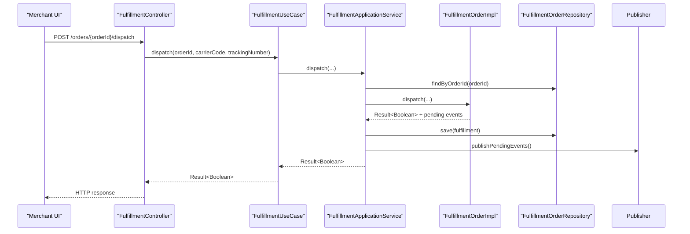

**Diagram sources**
- [FulfillmentController.kt](file://j-store-fulfillment-boot/src/main/kotlin/com/jstore/fulfillment/controller/FulfillmentController.kt)
- [FulfillmentUseCase.kt](file://j-store-fulfillment-application/src/main/kotlin/com/jstore/fulfillment/service/FulfillmentUseCase.kt)
- [FulfillmentApplicationService.kt](file://j-store-fulfillment-application/src/main/kotlin/com/jstore/fulfillment/service/FulfillmentApplicationService.kt)
- [FulfillmentOrderImpl.kt](file://j-store-fulfillment-domain/src/main/kotlin/com/jstore/fulfillment/domain/FulfillmentOrderImpl.kt)
- [FulfillmentOrderRepository.kt](file://j-store-fulfillment-domain/src/main/kotlin/com/jstore/fulfillment/domain/FulfillmentOrderRepository.kt)

**Section sources**
- [FulfillmentController.kt](file://j-store-fulfillment-boot/src/main/kotlin/com/jstore/fulfillment/controller/FulfillmentController.kt)
- [FulfillmentApplicationService.kt](file://j-store-fulfillment-application/src/main/kotlin/com/jstore/fulfillment/service/FulfillmentApplicationService.kt)
- [FulfillmentOrderImpl.kt](file://j-store-fulfillment-domain/src/main/kotlin/com/jstore/fulfillment/domain/FulfillmentOrderImpl.kt)

#### Delivery Confirmation
- Deliver endpoint transitions to DELIVERED and publishes delivered event.

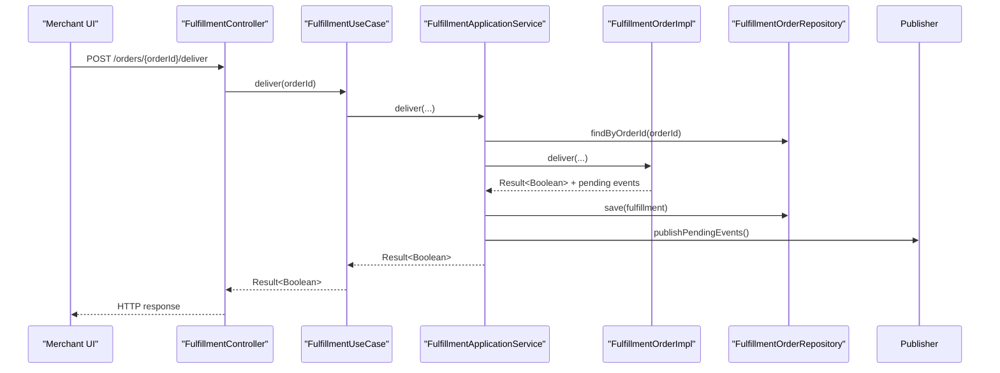

**Diagram sources**
- [FulfillmentController.kt](file://j-store-fulfillment-boot/src/main/kotlin/com/jstore/fulfillment/controller/FulfillmentController.kt)
- [FulfillmentUseCase.kt](file://j-store-fulfillment-application/src/main/kotlin/com/jstore/fulfillment/service/FulfillmentUseCase.kt)
- [FulfillmentApplicationService.kt](file://j-store-fulfillment-application/src/main/kotlin/com/jstore/fulfillment/service/FulfillmentApplicationService.kt)
- [FulfillmentOrderImpl.kt](file://j-store-fulfillment-domain/src/main/kotlin/com/jstore/fulfillment/domain/FulfillmentOrderImpl.kt)
- [FulfillmentOrderRepository.kt](file://j-store-fulfillment-domain/src/main/kotlin/com/jstore/fulfillment/domain/FulfillmentOrderRepository.kt)

**Section sources**
- [FulfillmentController.kt](file://j-store-fulfillment-boot/src/main/kotlin/com/jstore/fulfillment/controller/FulfillmentController.kt)
- [FulfillmentApplicationService.kt](file://j-store-fulfillment-application/src/main/kotlin/com/jstore/fulfillment/service/FulfillmentApplicationService.kt)
- [FulfillmentOrderImpl.kt](file://j-store-fulfillment-domain/src/main/kotlin/com/jstore/fulfillment/domain/FulfillmentOrderImpl.kt)

## Dependency Analysis
The module maintains clear boundaries:
- Controller depends on UseCase interface.
- Application service depends on repository interface and event publisher.
- Domain aggregate raises events and is persisted via repository.
- Infrastructure implements repository and maps persistence objects.

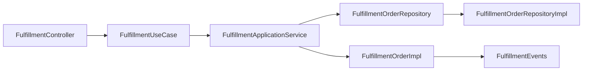

**Diagram sources**
- [FulfillmentController.kt](file://j-store-fulfillment-boot/src/main/kotlin/com/jstore/fulfillment/controller/FulfillmentController.kt)
- [FulfillmentUseCase.kt](file://j-store-fulfillment-application/src/main/kotlin/com/jstore/fulfillment/service/FulfillmentUseCase.kt)
- [FulfillmentApplicationService.kt](file://j-store-fulfillment-application/src/main/kotlin/com/jstore/fulfillment/service/FulfillmentApplicationService.kt)
- [FulfillmentOrderRepository.kt](file://j-store-fulfillment-domain/src/main/kotlin/com/jstore/fulfillment/domain/FulfillmentOrderRepository.kt)
- [FulfillmentOrderRepositoryImpl.kt](file://j-store-fulfillment-infrastructure/src/main/kotlin/com/jstore/fulfillment/domain/FulfillmentOrderRepositoryImpl.kt)
- [FulfillmentOrderImpl.kt](file://j-store-fulfillment-domain/src/main/kotlin/com/jstore/fulfillment/domain/FulfillmentOrderImpl.kt)
- [FulfillmentEvents.kt](file://j-store-fulfillment-domain/src/main/kotlin/com/jstore/fulfillment/domain/event/FulfillmentEvents.kt)

**Section sources**
- [FulfillmentController.kt](file://j-store-fulfillment-boot/src/main/kotlin/com/jstore/fulfillment/controller/FulfillmentController.kt)
- [FulfillmentUseCase.kt](file://j-store-fulfillment-application/src/main/kotlin/com/jstore/fulfillment/service/FulfillmentUseCase.kt)
- [FulfillmentApplicationService.kt](file://j-store-fulfillment-application/src/main/kotlin/com/jstore/fulfillment/service/FulfillmentApplicationService.kt)
- [FulfillmentOrderRepository.kt](file://j-store-fulfillment-domain/src/main/kotlin/com/jstore/fulfillment/domain/FulfillmentOrderRepository.kt)
- [FulfillmentOrderRepositoryImpl.kt](file://j-store-fulfillment-infrastructure/src/main/kotlin/com/jstore/fulfillment/domain/FulfillmentOrderRepositoryImpl.kt)
- [FulfillmentOrderImpl.kt](file://j-store-fulfillment-domain/src/main/kotlin/com/jstore/fulfillment/domain/FulfillmentOrderImpl.kt)
- [FulfillmentEvents.kt](file://j-store-fulfillment-domain/src/main/kotlin/com/jstore/fulfillment/domain/event/FulfillmentEvents.kt)

## Performance Considerations
- Idempotency: Repeated dispatch calls with identical carrier/tracking avoid redundant work and ensure consistency.
- Minimal writes: Changes are persisted only when state actually changes.
- Event publishing: Pending events are published once per mutation to reduce overhead.
- Mandatory transactions: Repository save enforces transactional boundaries to prevent partial updates.
- High-volume scaling:
  - Consider asynchronous event publishing and outbox patterns for decoupling.
  - Batch operations where appropriate (e.g., bulk dispatch confirmations).
  - Indexing on orderId and status fields for fast lookups.
  - Horizontal scaling of consumers for event processing.

[No sources needed since this section provides general guidance]

## Troubleshooting Guide
Common errors and resolutions:
- NOT_FOUND: Fulfillment does not exist for the given order. Verify order ID and existence.
- ORDER_CONFLICT: Existing fulfillment differs from request. Ensure idempotent creation by checking existing fulfillment before creating.
- INVALID_STATE: Operation attempted in wrong state. Follow lifecycle: prepare → dispatch → deliver.
- SHIPPING_REFERENCE_INVALID: Missing or empty carrier/tracking. Provide valid values.
- SHIPPING_REFERENCE_CONFLICT: Attempted to change shipping reference on already shipped/delivered fulfillment. Use same carrier/tracking for idempotency.

**Section sources**
- [FulfillmentErrors.kt](file://j-store-fulfillment-domain/src/main/kotlin/com/jstore/fulfillment/domain/FulfillmentErrors.kt)
- [FulfillmentOrderImpl.kt](file://j-store-fulfillment-domain/src/main/kotlin/com/jstore/fulfillment/domain/FulfillmentOrderImpl.kt)
- [FulfillmentApplicationService.kt](file://j-store-fulfillment-application/src/main/kotlin/com/jstore/fulfillment/service/FulfillmentApplicationService.kt)

## Conclusion
The Fulfillment Management module provides a robust, event-driven foundation for managing fulfillment orders through a clear lifecycle and strong state validation. It integrates seamlessly with other modules via domain events, supports idempotent operations, and offers extensibility for logistics provider integrations and return processing. Proper adherence to the lifecycle and error handling ensures reliable fulfillment operations at scale.