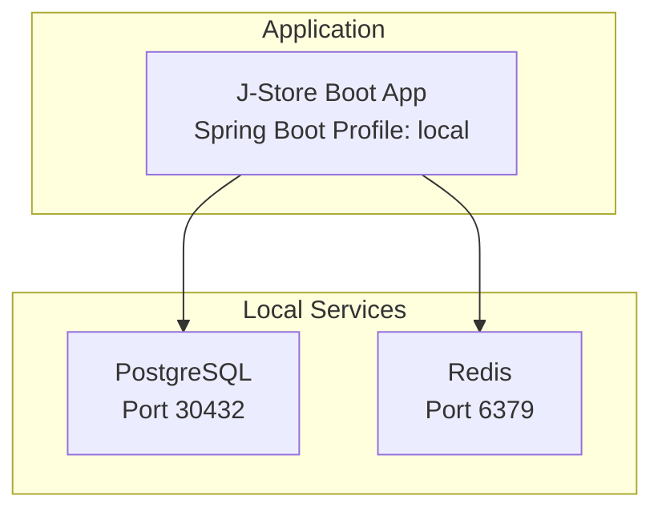
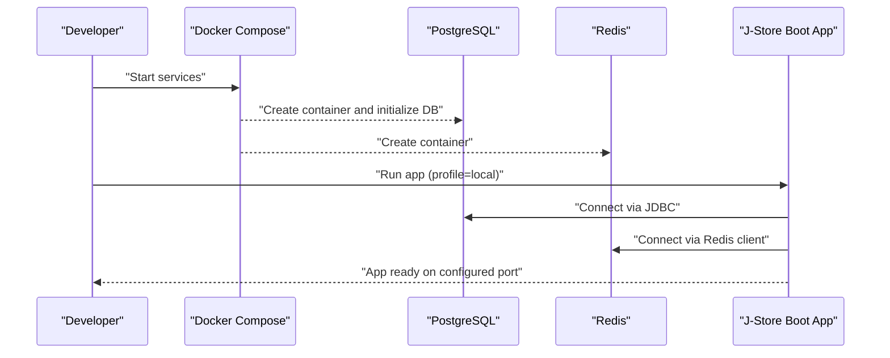
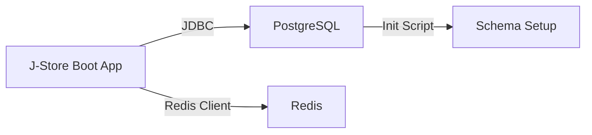

# Getting Started

<cite>
**Referenced Files in This Document**
- [README.md](file://README.md)
- [docker-compose.postgres.yml](file://docker-compose.postgres.yml)
- [application.properties](file://j-store-boot/src/main/resources/application.properties)
- [application-local.properties](file://j-store-boot/src/main/resources/application-local.properties)
- [Dockerfile (Postgres)](file://docker/postgres/Dockerfile)
- [01-init.sql](file://docker/postgres/init/01-init.sql)
- [Dockerfile (App)](file://j-store-boot/Dockerfile)
</cite>

## Table of Contents
1. Introduction
2. Prerequisites
3. Project Structure
4. Core Components
5. Architecture Overview
6. Detailed Component Analysis
7. Dependency Analysis
8. Performance Considerations
9. Troubleshooting Guide
10. Conclusion

## Introduction
This guide helps you set up and run J-Store locally using Docker Compose with PostgreSQL and Redis. It covers prerequisites, starting and stopping services, database connection details, quick testing with psql, environment configuration, and common troubleshooting steps for development initialization.

## Prerequisites
- Docker Desktop or Docker Engine with the Compose plugin installed and working on your machine.
- A terminal that supports docker-compose or docker compose commands.

## Project Structure
At a high level:
- docker-compose.postgres.yml defines local PostgreSQL and Redis services.
- The application uses Spring Boot profiles to load local configuration for database and Redis connectivity.
- PostgreSQL is initialized with a schema via an init script.
- The app can be containerized with its own Dockerfile.

**Diagram sources**
- [docker-compose.postgres.yml:1-40](file://docker-compose.postgres.yml#L1-L40)
- [application.properties:1-11](file://j-store-boot/src/main/resources/application.properties#L1-L11)
- [application-local.properties:1-43](file://j-store-boot/src/main/resources/application-local.properties#L1-L43)

**Section sources**
- [README.md:1-53](file://README.md#L1-L53)
- [docker-compose.postgres.yml:1-40](file://docker-compose.postgres.yml#L1-L40)
- [application.properties:1-11](file://j-store-boot/src/main/resources/application.properties#L1-L11)
- [application-local.properties:1-43](file://j-store-boot/src/main/resources/application-local.properties#L1-L43)

## Core Components
- Local services orchestration: PostgreSQL and Redis are defined in the Compose file with health checks and persistent volumes.
- Application configuration: Spring Boot profile “local” loads database and Redis settings.
- Database initialization: A Postgres init script creates the default schema and grants permissions.
- Containerization: The app has a Dockerfile for running as a Java application.

Key responsibilities:
- docker-compose.postgres.yml: Start/stop PostgreSQL and Redis, expose ports, define health checks, and persist data.
- application.properties: Set active profile to “local”.
- application-local.properties: Provide JDBC URL, credentials, Hikari pool tuning, Flyway schema config, Redis host/port/password/database, and other runtime flags.
- docker/postgres/Dockerfile: Base image and copy of init scripts.
- docker/postgres/init/01-init.sql: Create and configure the “develop” schema.
- j-store-boot/Dockerfile: Build/run the Spring Boot application.

**Section sources**
- [docker-compose.postgres.yml:1-40](file://docker-compose.postgres.yml#L1-L40)
- [application.properties:1-11](file://j-store-boot/src/main/resources/application.properties#L1-L11)
- [application-local.properties:1-43](file://j-store-boot/src/main/resources/application-local.properties#L1-L43)
- [Dockerfile (Postgres):1-4](file://docker/postgres/Dockerfile#L1-L4)
- [01-init.sql:1-5](file://docker/postgres/init/01-init.sql#L1-L5)
- [Dockerfile (App):1-5](file://j-store-boot/Dockerfile#L1-L5)

## Architecture Overview
The local development architecture consists of:
- A Spring Boot application that connects to PostgreSQL for persistence and Redis for caching/token storage.
- PostgreSQL initialized with a dedicated schema for development.
- Redis exposed on the standard port for local access.

**Diagram sources**
- [docker-compose.postgres.yml:1-40](file://docker-compose.postgres.yml#L1-L40)
- [application.properties:1-11](file://j-store-boot/src/main/resources/application.properties#L1-L11)
- [application-local.properties:1-43](file://j-store-boot/src/main/resources/application-local.properties#L1-L43)

## Detailed Component Analysis

### Docker Compose Services
- PostgreSQL service:
  - Image built from a local Dockerfile based on postgres:16-alpine.
  - Exposes port 30432 mapped to container port 5432.
  - Health check runs pg_isready against the development user and database.
  - Persistent volume ensures data survives restarts.
- Redis service:
  - Uses redis:7-alpine.
  - Exposes port 6379.
  - Health check runs redis-cli ping.

Operational commands:
- Start services in detached mode.
- Check status of running containers.
- Stop services.
- Remove volumes to reset the database state.

Connection details:
- PostgreSQL host, port, database, username, password, and default schema are provided for local use.
- Redis host, port, password, and database index are provided for local use.

Quick test:
- Use psql to connect to PostgreSQL if available locally.

**Section sources**
- [docker-compose.postgres.yml:1-40](file://docker-compose.postgres.yml#L1-L40)
- [README.md:1-53](file://README.md#L1-L53)

### Application Configuration (Spring Boot)
- Active profile:
  - The application sets the active profile to “local”, which loads application-local.properties.
- Database configuration:
  - JDBC URL points to the local PostgreSQL instance with the correct schema.
  - Username and password match the Compose environment variables.
  - Hikari connection pool settings are tuned for local development.
  - Flyway is enabled with baseline and validation options; schemas are created automatically.
- Redis configuration:
  - Host, port, password, and database index align with the Compose setup.
  - Timeout is set for local responsiveness.
- Other runtime flags:
  - JWT secret is configured for local development.
  - Outbox feature flag and merchant ID are set for local usage.

Environment variables vs properties:
- Compose environment variables configure the PostgreSQL container (database name, user, password).
- Spring Boot properties configure how the application connects to these services.

**Section sources**
- [application.properties:1-11](file://j-store-boot/src/main/resources/application.properties#L1-L11)
- [application-local.properties:1-43](file://j-store-boot/src/main/resources/application-local.properties#L1-L43)

### PostgreSQL Initialization
- The Postgres Dockerfile copies an init SQL script into the entrypoint directory so it runs on first start.
- The init script creates the “develop” schema, grants privileges, and sets the search path for the development role.

Impact:
- Ensures consistent schema presence across environments.
- Aligns with Flyway’s default schema configuration.

**Section sources**
- [Dockerfile (Postgres):1-4](file://docker/postgres/Dockerfile#L1-L4)
- [01-init.sql:1-5](file://docker/postgres/init/01-init.sql#L1-L5)

### Application Containerization
- The app Dockerfile uses an Amazon Corretto base image, exposes /tmp, copies the built jar, and runs it as the entrypoint.
- Useful for packaging and running the application consistently across environments.

**Section sources**
- [Dockerfile (App):1-5](file://j-store-boot/Dockerfile#L1-L5)

## Dependency Analysis
- Compose dependencies:
  - PostgreSQL and Redis are independent services with health checks ensuring readiness.
- Application dependencies:
  - Connects to PostgreSQL via JDBC and to Redis via Spring Data Redis.
  - Uses Flyway to manage schema migrations at startup.

**Diagram sources**
- [application-local.properties:1-43](file://j-store-boot/src/main/resources/application-local.properties#L1-L43)
- [docker-compose.postgres.yml:1-40](file://docker-compose.postgres.yml#L1-L40)
- [01-init.sql:1-5](file://docker/postgres/init/01-init.sql#L1-L5)

**Section sources**
- [application-local.properties:1-43](file://j-store-boot/src/main/resources/application-local.properties#L1-L43)
- [docker-compose.postgres.yml:1-40](file://docker-compose.postgres.yml#L1-L40)

## Performance Considerations
- Connection pooling:
  - Hikari maximum-pool-size is configured for local development; adjust based on workload.
- Database schema management:
  - Flyway baseline and validate-on-migrate ensure safe migrations; keep baseline versions aligned with existing data.
- Redis timeout:
  - Short timeouts suit local dev; increase for slower networks if needed.
- Health checks:
  - Compose health checks prevent app startup before services are ready.

[No sources needed since this section provides general guidance]

## Troubleshooting Guide
Common issues and resolutions:
- Cannot connect to PostgreSQL:
  - Verify the host and port match the Compose mapping and application-local.properties.
  - Ensure the database, username, and password match the Compose environment variables.
  - Confirm the “develop” schema exists; re-run services to trigger init script if necessary.
- Redis connection failures:
  - Confirm Redis host and port match the Compose setup.
  - Ensure no firewall blocks port 6379 locally.
- Service not healthy:
  - Check Compose logs for PostgreSQL and Redis health checks.
  - Restart services if needed.
- Resetting the database:
  - Remove the volume to wipe local data; re-run services to recreate schema.
- Running the app locally:
  - Ensure the active profile is “local” and application-local.properties is loaded.
  - Validate that all required properties (JDBC URL, Redis host/port) are correct.

Commands reference:
- Start services in detached mode.
- Check status of running containers.
- Stop services.
- Remove volumes to reset the database state.

**Section sources**
- [docker-compose.postgres.yml:1-40](file://docker-compose.postgres.yml#L1-L40)
- [application-local.properties:1-43](file://j-store-boot/src/main/resources/application-local.properties#L1-L43)
- [README.md:1-53](file://README.md#L1-L53)

## Conclusion
You now have a complete local development environment for J-Store with PostgreSQL and Redis orchestrated by Docker Compose. Use the provided connection details and commands to start, verify, and stop services. Adjust application properties as needed for your local workflow, and refer to the troubleshooting section for common setup issues.

[No sources needed since this section summarizes without analyzing specific files]