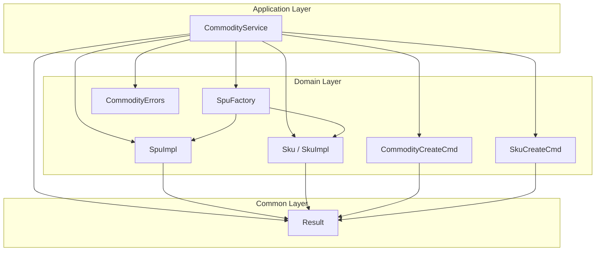
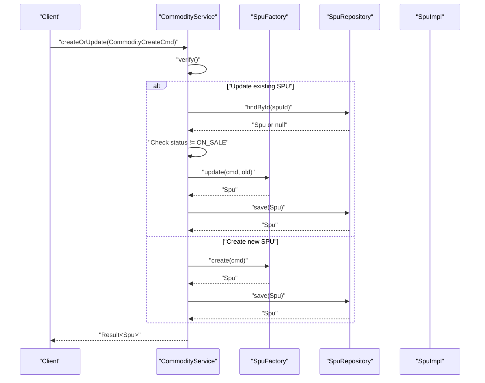
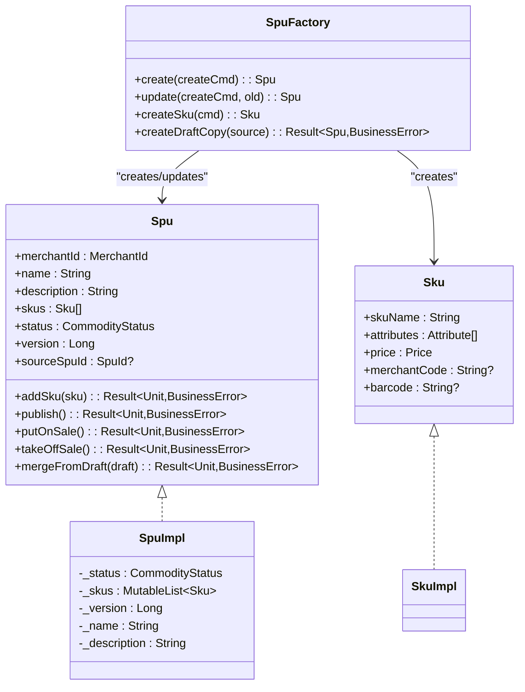
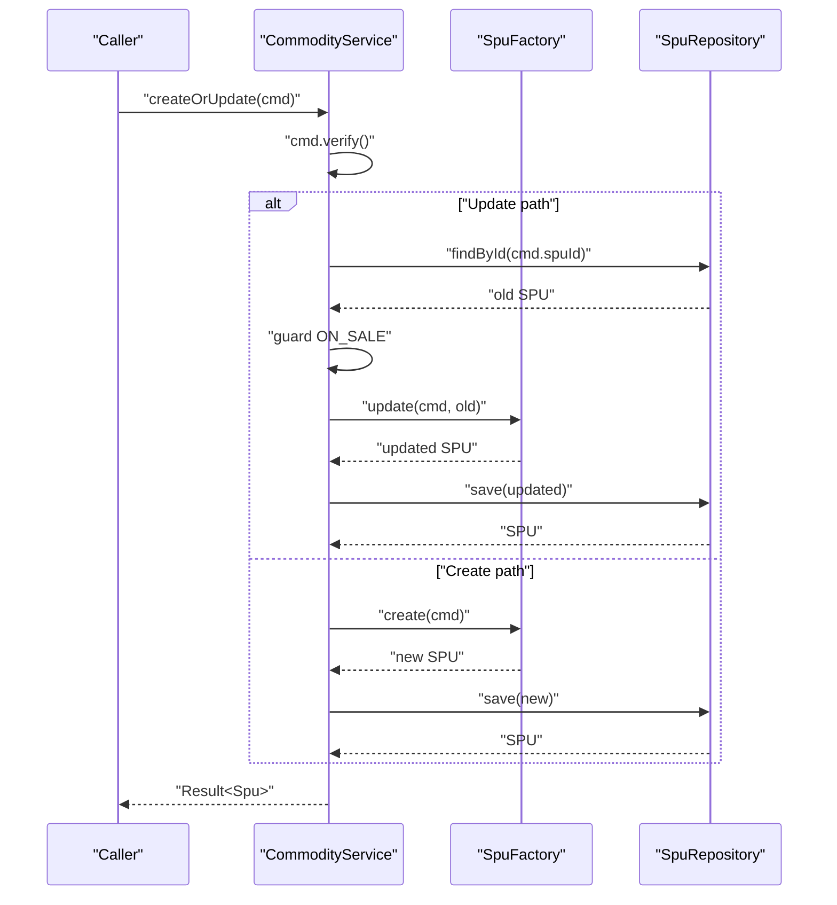
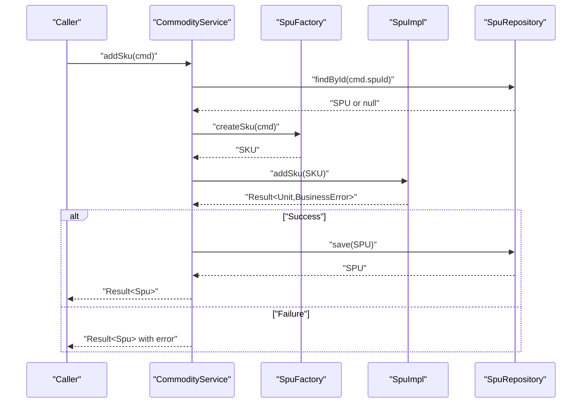
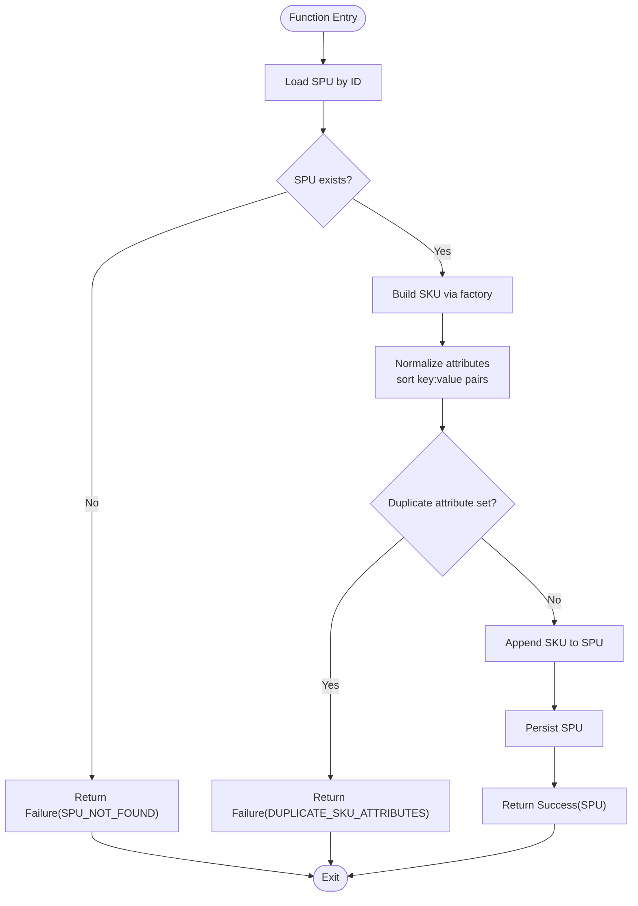
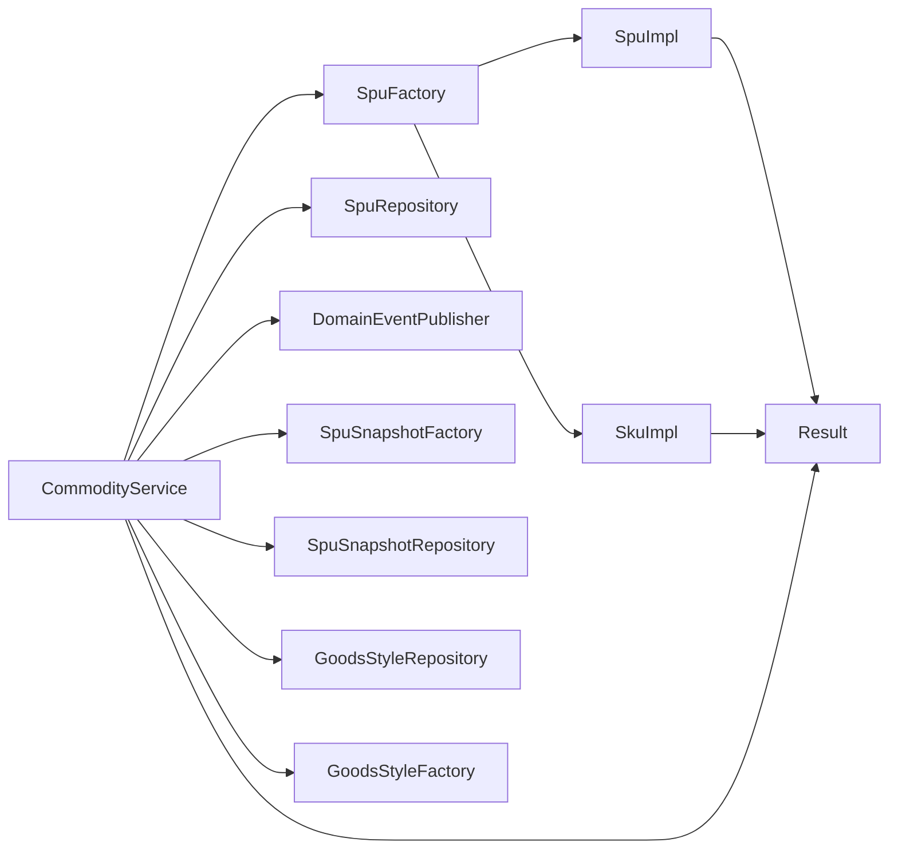

# CRUD Operations

<cite>
**Referenced Files in This Document**
- [CommodityService.kt](file://j-store-goods-application/src/main/kotlin/com/jstore/goods/service/CommodityService.kt)
- [Spu.kt](file://j-store-goods-domain/src/main/kotlin/com/jstore/goods/domain/commodity/Spu.kt)
- [SpuImpl.kt](file://j-store-goods-domain/src/main/kotlin/com/jstore/goods/domain/commodity/SpuImpl.kt)
- [SpuFactory.kt](file://j-store-goods-domain/src/main/kotlin/com/jstore/goods/domain/commodity/SpuFactory.kt)
- [Sku.kt](file://j-store-goods-domain/src/main/kotlin/com/jstore/goods/domain/commodity/Sku.kt)
- [CommodityCreateCmd.kt](file://j-store-goods-domain/src/main/kotlin/com/jstore/goods/domain/commodity/comand/CommodityCreateCmd.kt)
- [SkuCreateCmd.kt](file://j-store-goods-domain/src/main/kotlin/com/jstore/goods/domain/commodity/comand/SkuCreateCmd.kt)
- [CommodityErrors.kt](file://j-store-goods-domain/src/main/kotlin/com/jstore/goods/domain/commodity/CommodityErrors.kt)
- [Result.kt](file://j-store-common-core/src/main/kotlin/com/jstore/common/utils/Result.kt)
</cite>

## Table of Contents
1. [Introduction](#introduction)
2. [Project Structure](#project-structure)
3. [Core Components](#core-components)
4. [Architecture Overview](#architecture-overview)
5. [Detailed Component Analysis](#detailed-component-analysis)
6. [Dependency Analysis](#dependency-analysis)
7. [Performance Considerations](#performance-considerations)
8. [Troubleshooting Guide](#troubleshooting-guide)
9. [Conclusion](#conclusion)

## Introduction
This document explains commodity CRUD operations focused on product creation, updates, and SKU management. It details the createOrUpdate method that handles both new product creation and existing product updates with protection against direct editing of ON_SALE products. It also documents the addSku workflow for adding SKUs to a product, including validation rules, error handling strategies, and business constraints. Examples are provided for creating new SPU products, updating existing products, and adding SKUs. The Result pattern usage and error types returned by these operations are explained.

## Project Structure
The commodity domain is implemented across application, domain, and common layers:
- Application layer orchestrates use cases via CommodityService.
- Domain layer defines aggregates (Spu), entities (Sku), factories (SpuFactory), commands (CommodityCreateCmd, SkuCreateCmd), and errors (CommodityErrors).
- Common layer provides the Result type used consistently across operations.

[No sources needed since this diagram shows conceptual structure]

## Core Components
- CommodityService: Implements commodity use cases including createOrUpdate, addSku, publish, putOnSale, takeOffSale, draft workflows, and snapshot queries.
- SpuFactory: Creates and updates SPU instances and constructs SKU instances; supports draft copy creation.
- SpuImpl: Implements SPU aggregate behavior, including status transitions, SKU addition, and draft merge logic.
- Commands: CommodityCreateCmd and SkuCreateCmd carry input data and perform basic validation.
- Errors: Centralized error definitions for commodity domain.
- Result: A sealed class representing success or failure outcomes, enabling consistent error handling.

Key responsibilities:
- createOrUpdate(cmd): Validates command, guards ON_SALE direct edits, creates or updates SPU, persists, and returns Result<Spu>.
- addSku(cmd): Loads SPU, builds SKU via factory, validates uniqueness of attributes, adds SKU, persists, and returns Result<Spu>.

**Section sources**
- [CommodityService.kt:18-26](file://j-store-goods-application/src/main/kotlin/com/jstore/goods/service/CommodityService.kt#L18-L26)
- [SpuFactory.kt:11-19](file://j-store-goods-domain/src/main/kotlin/com/jstore/goods/domain/commodity/SpuFactory.kt#L11-L19)
- [SpuImpl.kt:12-21](file://j-store-goods-domain/src/main/kotlin/com/jstore/goods/domain/commodity/SpuImpl.kt#L12-L21)
- [CommodityCreateCmd.kt:10-25](file://j-store-goods-domain/src/main/kotlin/com/jstore/goods/domain/commodity/comand/CommodityCreateCmd.kt#L10-L25)
- [SkuCreateCmd.kt:7-14](file://j-store-goods-domain/src/main/kotlin/com/jstore/goods/domain/commodity/comand/SkuCreateCmd.kt#L7-L14)
- [CommodityErrors.kt:5-27](file://j-store-goods-domain/src/main/kotlin/com/jstore/goods/domain/commodity/CommodityErrors.kt#L5-L27)
- [Result.kt:8-26](file://j-store-common-core/src/main/kotlin/com/jstore/common/utils/Result.kt#L8-L26)

## Architecture Overview
The commodity CRUD flows through CommodityService, which delegates object construction to SpuFactory and persistence to repositories (not shown here). Domain methods enforce state transitions and business rules. All operations return Result to propagate success or failure uniformly.

**Diagram sources**
- [CommodityService.kt:33-48](file://j-store-goods-application/src/main/kotlin/com/jstore/goods/service/CommodityService.kt#L33-L48)
- [SpuFactory.kt:23-46](file://j-store-goods-domain/src/main/kotlin/com/jstore/goods/domain/commodity/SpuFactory.kt#L23-L46)

**Section sources**
- [CommodityService.kt:33-48](file://j-store-goods-application/src/main/kotlin/com/jstore/goods/service/CommodityService.kt#L33-L48)

## Detailed Component Analysis

### createOrUpdate Method
Purpose:
- Create a new SPU when spuId is absent.
- Update an existing SPU when spuId is present.
- Enforce business constraint: prevent direct editing of ON_SALE products.

Workflow:
- Validate command fields (merchantId positive, spuName non-blank).
- If updating:
  - Load existing SPU by id.
  - Reject if status is ON_SALE.
  - Build updated SPU via factory preserving merchant, name, description, status, skus, version, sourceSpuId.
  - Persist and return Result<Spu>.
- If creating:
  - Build new SPU via factory with DRAFT status.
  - Persist and return Result<Spu>.

Validation rules:
- merchantId must be positive.
- spuName must not be blank.

Error handling:
- Returns Failure with CommodityErrors.SPU_NOT_FOUND when update target missing.
- Returns Failure with CommodityErrors.ON_SALE_DIRECT_EDIT_REJECTED when attempting to edit ON_SALE directly.
- Returns Failure with CommonBusinessError.INVALID_PARAM for invalid command inputs.

Examples:
- Creating a new SPU: Provide merchantId, spuName, optional description; no spuId.
- Updating an existing SPU: Provide spuId and updated fields; ensure status is not ON_SALE.

**Section sources**
- [CommodityService.kt:33-48](file://j-store-goods-application/src/main/kotlin/com/jstore/goods/service/CommodityService.kt#L33-L48)
- [CommodityCreateCmd.kt:16-24](file://j-store-goods-domain/src/main/kotlin/com/jstore/goods/domain/commodity/comand/CommodityCreateCmd.kt#L16-L24)
- [SpuFactory.kt:23-46](file://j-store-goods-domain/src/main/kotlin/com/jstore/goods/domain/commodity/SpuFactory.kt#L23-L46)
- [CommodityErrors.kt:6-21](file://j-store-goods-domain/src/main/kotlin/com/jstore/goods/domain/commodity/CommodityErrors.kt#L6-L21)
- [Result.kt:8-26](file://j-store-common-core/src/main/kotlin/com/jstore/common/utils/Result.kt#L8-L26)

### addSku Method
Purpose:
- Add a new SKU to an existing SPU.

Workflow:
- Load SPU by spuId; fail if not found.
- Construct SKU via factory from SkuCreateCmd.
- Call Spu.addSku to validate attribute uniqueness and append SKU.
- Persist SPU and return Result<Spu>.

Validation rules:
- SKU attribute combination must be unique within the SPU.
- Command fields include skuName, attributes list, price, optional merchantCode and barcode.

Error handling:
- Returns Failure with CommodityErrors.SPU_NOT_FOUND when SPU missing.
- Returns Failure with CommodityErrors.DUPLICATE_SKU_ATTRIBUTES when duplicate attribute set detected.

Examples:
- Adding a SKU: Provide spuId, skuName, attributes (e.g., color: red, size: XL), price, optional codes.

**Section sources**
- [CommodityService.kt:55-62](file://j-store-goods-application/src/main/kotlin/com/jstore/goods/service/CommodityService.kt#L55-L62)
- [SpuFactory.kt:48-57](file://j-store-goods-domain/src/main/kotlin/com/jstore/goods/domain/commodity/SpuFactory.kt#L48-L57)
- [SpuImpl.kt:41-52](file://j-store-goods-domain/src/main/kotlin/com/jstore/goods/domain/commodity/SpuImpl.kt#L41-L52)
- [SkuCreateCmd.kt:7-14](file://j-store-goods-domain/src/main/kotlin/com/jstore/goods/domain/commodity/comand/SkuCreateCmd.kt#L7-L14)
- [CommodityErrors.kt:6-13](file://j-store-goods-domain/src/main/kotlin/com/jstore/goods/domain/commodity/CommodityErrors.kt#L6-L13)

### Status Transitions and Business Constraints
- Publish: DRAFT → OFF_SALE; requires at least one SKU.
- Put on sale: OFF_SALE → ON_SALE; increments version and emits event.
- Take off sale: ON_SALE → OFF_SALE; emits event.
- Draft flow: Only ON_SALE products can have drafts created; merging draft into source requires source to be ON_SALE and draft to have SKUs.

These constraints are enforced in SpuImpl and CommodityService.

**Section sources**
- [SpuImpl.kt:54-88](file://j-store-goods-domain/src/main/kotlin/com/jstore/goods/domain/commodity/SpuImpl.kt#L54-L88)
- [CommodityService.kt:69-105](file://j-store-goods-application/src/main/kotlin/com/jstore/goods/service/CommodityService.kt#L69-L105)
- [CommodityErrors.kt:8-15](file://j-store-goods-domain/src/main/kotlin/com/jstore/goods/domain/commodity/CommodityErrors.kt#L8-L15)

### Data Models and Relationships

**Diagram sources**
- [Spu.kt:16-52](file://j-store-goods-domain/src/main/kotlin/com/jstore/goods/domain/commodity/Spu.kt#L16-L52)
- [SpuImpl.kt:12-111](file://j-store-goods-domain/src/main/kotlin/com/jstore/goods/domain/commodity/SpuImpl.kt#L12-L111)
- [Sku.kt:9-34](file://j-store-goods-domain/src/main/kotlin/com/jstore/goods/domain/commodity/Sku.kt#L9-L34)
- [SpuFactory.kt:11-78](file://j-store-goods-domain/src/main/kotlin/com/jstore/goods/domain/commodity/SpuFactory.kt#L11-L78)

### Sequence Diagrams for Key Workflows

#### createOrUpdate Flow

**Diagram sources**
- [CommodityService.kt:33-48](file://j-store-goods-application/src/main/kotlin/com/jstore/goods/service/CommodityService.kt#L33-L48)
- [SpuFactory.kt:23-46](file://j-store-goods-domain/src/main/kotlin/com/jstore/goods/domain/commodity/SpuFactory.kt#L23-L46)

#### addSku Flow

**Diagram sources**
- [CommodityService.kt:55-62](file://j-store-goods-application/src/main/kotlin/com/jstore/goods/service/CommodityService.kt#L55-L62)
- [SpuFactory.kt:48-57](file://j-store-goods-domain/src/main/kotlin/com/jstore/goods/domain/commodity/SpuFactory.kt#L48-L57)
- [SpuImpl.kt:41-52](file://j-store-goods-domain/src/main/kotlin/com/jstore/goods/domain/commodity/SpuImpl.kt#L41-L52)

### Flowchart for SKU Attribute Uniqueness Check

**Diagram sources**
- [SpuImpl.kt:41-52](file://j-store-goods-domain/src/main/kotlin/com/jstore/goods/domain/commodity/SpuImpl.kt#L41-L52)

## Dependency Analysis
- CommodityService depends on:
  - SpuFactory for object creation/update.
  - SpuRepository for persistence (external to this snippet).
  - DomainEventPublisher for publishing events after state changes.
  - Snapshot-related services for snapshot creation and queries.
- SpuImpl enforces domain rules and raises domain events.
- Commands encapsulate input and validation.
- Result unifies success/failure propagation across layers.

**Diagram sources**
- [CommodityService.kt:18-26](file://j-store-goods-application/src/main/kotlin/com/jstore/goods/service/CommodityService.kt#L18-L26)
- [SpuFactory.kt:21-78](file://j-store-goods-domain/src/main/kotlin/com/jstore/goods/domain/commodity/SpuFactory.kt#L21-L78)
- [Result.kt:8-26](file://j-store-common-core/src/main/kotlin/com/jstore/common/utils/Result.kt#L8-L26)

**Section sources**
- [CommodityService.kt:18-26](file://j-store-goods-application/src/main/kotlin/com/jstore/goods/service/CommodityService.kt#L18-L26)
- [SpuFactory.kt:21-78](file://j-store-goods-domain/src/main/kotlin/com/jstore/goods/domain/commodity/SpuFactory.kt#L21-L78)

## Performance Considerations
- Minimize repository calls by batching where possible; current flows call findById once per operation.
- Avoid unnecessary deep copies; SpuFactory.update preserves existing lists efficiently.
- Use Result combinators (map, onFailure) to avoid nested conditionals and reduce overhead.
- Snapshot creation should be deferred until necessary (e.g., putOnSale) to reduce write amplification.

[No sources needed since this section provides general guidance]

## Troubleshooting Guide
Common errors and resolutions:
- SPU_NOT_FOUND: Ensure the provided spuId exists before update/addSku operations.
- ON_SALE_DIRECT_EDIT_REJECTED: For ON_SALE products, use getDraft, modify via draft, then publishDraft to apply changes.
- DUPLICATE_SKU_ATTRIBUTES: Ensure attribute combinations are unique within the SPU.
- INVALID_STATUS_TRANSITION: Verify current status allows the requested transition (e.g., only DRAFT can publish).
- NO_SKU_FOR_PUBLISH / DRAFT_NO_SKU_FOR_PUBLISH: Ensure at least one SKU exists before publishing or merging draft.

Operational tips:
- Always validate commands early using verify() to catch invalid parameters promptly.
- Handle Result failures explicitly to provide meaningful responses to callers.
- When editing ON_SALE products, follow the draft workflow to maintain consistency and auditability.

**Section sources**
- [CommodityErrors.kt:6-27](file://j-store-goods-domain/src/main/kotlin/com/jstore/goods/domain/commodity/CommodityErrors.kt#L6-L27)
- [CommodityService.kt:33-48](file://j-store-goods-application/src/main/kotlin/com/jstore/goods/service/CommodityService.kt#L33-L48)
- [SpuImpl.kt:41-52](file://j-store-goods-domain/src/main/kotlin/com/jstore/goods/domain/commodity/SpuImpl.kt#L41-L52)

## Conclusion
The commodity CRUD operations are implemented with clear separation of concerns: CommodityService orchestrates workflows, SpuFactory constructs domain objects, and SpuImpl enforces business rules and state transitions. The Result pattern ensures consistent error handling across all operations. Key constraints such as preventing direct edits to ON_SALE products and ensuring SKU attribute uniqueness are enforced at the domain level. Following the draft workflow enables safe modifications to live products while maintaining data integrity and traceability.

[No sources needed since this section summarizes without analyzing specific files]