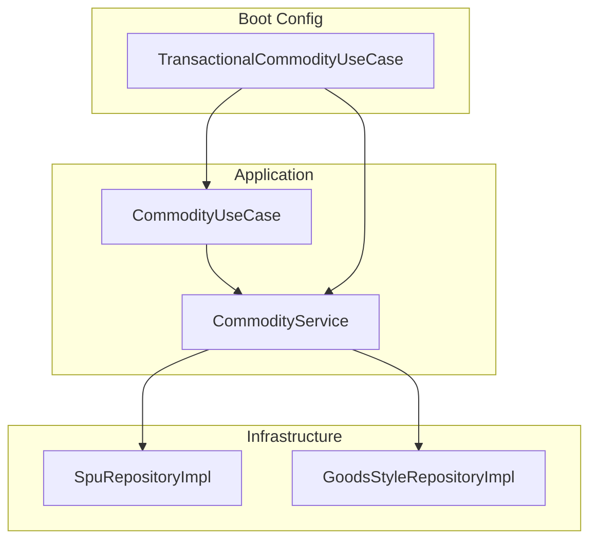
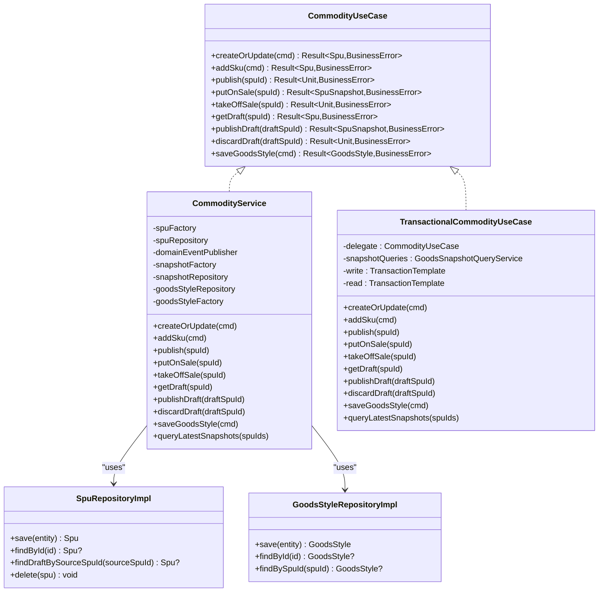
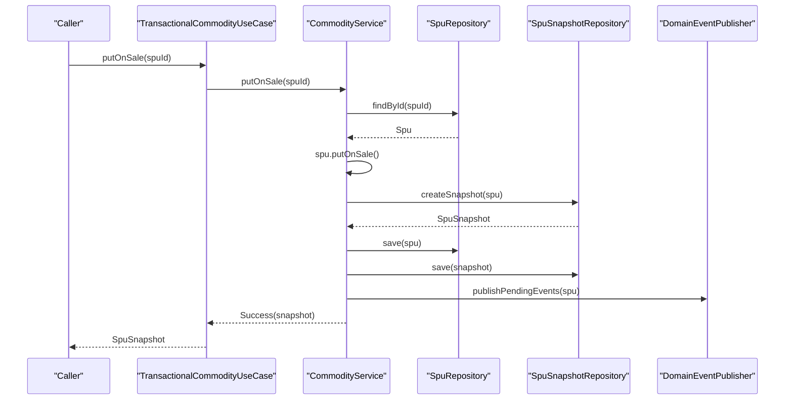
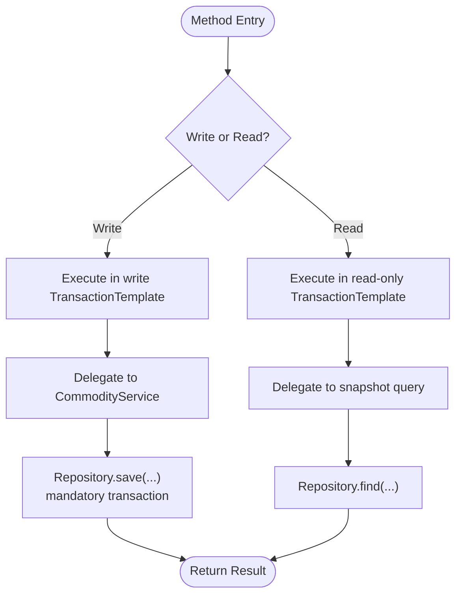
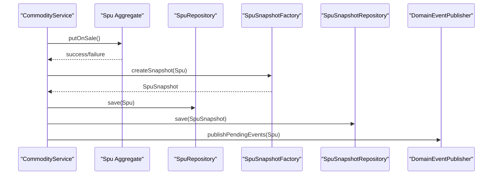
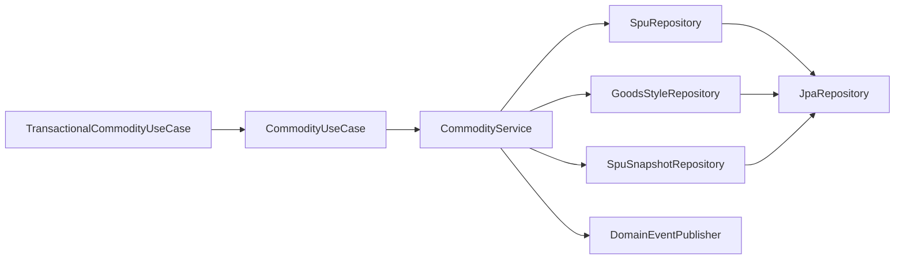

# Commodity Service Layer

<cite>
**Referenced Files in This Document**
- [CommodityService.kt](file://j-store-goods-application/src/main/kotlin/com/jstore/goods/service/CommodityService.kt)
- [CommodityUseCase.kt](file://j-store-goods-application/src/main/kotlin/com/jstore/goods/service/CommodityUseCase.kt)
- [TransactionalCommodityUseCase.kt](file://j-store-goods-boot/src/main/kotlin/com/jstore/goods/config/TransactionalCommodityUseCase.kt)
- [SpuRepositoryImpl.kt](file://j-store-goods-infrastructure/src/main/kotlin/com/jstore/goods/domain/commodity/SpuRepositoryImpl.kt)
- [GoodsStyleRepositoryImpl.kt](file://j-store-goods-infrastructure/src/main/kotlin/com/jstore/goods/domain/commodity/GoodsStyleRepositoryImpl.kt)
</cite>

## Table of Contents
1. [Introduction](#introduction)
2. [Project Structure](#project-structure)
3. [Core Components](#core-components)
4. [Architecture Overview](#architecture-overview)
5. [Detailed Component Analysis](#detailed-component-analysis)
6. [Dependency Analysis](#dependency-analysis)
7. [Performance Considerations](#performance-considerations)
8. [Troubleshooting Guide](#troubleshooting-guide)
9. [Conclusion](#conclusion)

## Introduction
This document explains the commodity service layer implementation that orchestrates product lifecycle operations: creating/updating products (SPU), managing styles, handling SKU operations, and executing publishing workflows with snapshots and domain events. It details how application services interact with domain aggregates through use case interfaces, how transactions are configured, and how errors and business rules are enforced.

## Project Structure
The commodity service layer spans three layers:
- Application service and use case interface define orchestration and contracts.
- Infrastructure repositories implement persistence for SPU and GoodsStyle with mandatory transaction boundaries.
- Boot configuration wraps use cases with explicit read/write transactions and delegates snapshot queries to a read-only path.

**Diagram sources**
- [CommodityUseCase.kt:1-33](file://j-store-goods-application/src/main/kotlin/com/jstore/goods/service/CommodityUseCase.kt#L1-L33)
- [CommodityService.kt:1-221](file://j-store-goods-application/src/main/kotlin/com/jstore/goods/service/CommodityService.kt#L1-L221)
- [SpuRepositoryImpl.kt:1-95](file://j-store-goods-infrastructure/src/main/kotlin/com/jstore/goods/domain/commodity/SpuRepositoryImpl.kt#L1-L95)
- [GoodsStyleRepositoryImpl.kt:1-71](file://j-store-goods-infrastructure/src/main/kotlin/com/jstore/goods/domain/commodity/GoodsStyleRepositoryImpl.kt#L1-L71)
- [TransactionalCommodityUseCase.kt:1-46](file://j-store-goods-boot/src/main/kotlin/com/jstore/goods/config/TransactionalCommodityUseCase.kt#L1-L46)

**Section sources**
- [CommodityUseCase.kt:1-33](file://j-store-goods-application/src/main/kotlin/com/jstore/goods/service/CommodityUseCase.kt#L1-L33)
- [CommodityService.kt:1-221](file://j-store-goods-application/src/main/kotlin/com/jstore/goods/service/CommodityService.kt#L1-L221)
- [TransactionalCommodityUseCase.kt:1-46](file://j-store-goods-boot/src/main/kotlin/com/jstore/goods/config/TransactionalCommodityUseCase.kt#L1-L46)
- [SpuRepositoryImpl.kt:1-95](file://j-store-goods-infrastructure/src/main/kotlin/com/jstore/goods/domain/commodity/SpuRepositoryImpl.kt#L1-L95)
- [GoodsStyleRepositoryImpl.kt:1-71](file://j-store-goods-infrastructure/src/main/kotlin/com/jstore/goods/domain/commodity/GoodsStyleRepositoryImpl.kt#L1-L71)

## Core Components
- CommodityUseCase: Declares all commodity operations as application-level use cases, returning typed results for success or business errors.
- CommodityService: Implements orchestration across SPU creation/update, SKU addition, status transitions, draft workflows, style management, and snapshot queries.
- TransactionalCommodityUseCase: Wraps each operation in an explicit Spring transaction template; read operations are marked read-only.
- SpuRepositoryImpl and GoodsStyleRepositoryImpl: Persist domain entities with mandatory transaction propagation, ensuring writes occur within an existing transaction.

Key responsibilities:
- Enforce business rules (e.g., preventing direct edits on ON_SALE items).
- Manage state transitions (publish, putOnSale, takeOffSale).
- Handle drafts (getDraft, publishDraft, discardDraft).
- Maintain presentation styles (main images, detail HTML, per-SKU images).
- Publish domain events after successful mutations.

**Section sources**
- [CommodityUseCase.kt:1-33](file://j-store-goods-application/src/main/kotlin/com/jstore/goods/service/CommodityUseCase.kt#L1-L33)
- [CommodityService.kt:1-221](file://j-store-goods-application/src/main/kotlin/com/jstore/goods/service/CommodityService.kt#L1-L221)
- [TransactionalCommodityUseCase.kt:1-46](file://j-store-goods-boot/src/main/kotlin/com/jstore/goods/config/TransactionalCommodityUseCase.kt#L1-L46)
- [SpuRepositoryImpl.kt:1-95](file://j-store-goods-infrastructure/src/main/kotlin/com/jstore/goods/domain/commodity/SpuRepositoryImpl.kt#L1-L95)
- [GoodsStyleRepositoryImpl.kt:1-71](file://j-store-goods-infrastructure/src/main/kotlin/com/jstore/goods/domain/commodity/GoodsStyleRepositoryImpl.kt#L1-L71)

## Architecture Overview
The commodity service layer follows a clear separation:
- Use case interface defines stable contracts.
- Application service composes domain factories, repositories, and event publishing.
- Infrastructure repositories enforce mandatory transactions and convert between domain and persistence models.
- Boot configuration centralizes transactional behavior and read-only query semantics.

**Diagram sources**
- [CommodityUseCase.kt:1-33](file://j-store-goods-application/src/main/kotlin/com/jstore/goods/service/CommodityUseCase.kt#L1-L33)
- [CommodityService.kt:1-221](file://j-store-goods-application/src/main/kotlin/com/jstore/goods/service/CommodityService.kt#L1-L221)
- [TransactionalCommodityUseCase.kt:1-46](file://j-store-goods-boot/src/main/kotlin/com/jstore/goods/config/TransactionalCommodityUseCase.kt#L1-L46)
- [SpuRepositoryImpl.kt:1-95](file://j-store-goods-infrastructure/src/main/kotlin/com/jstore/goods/domain/commodity/SpuRepositoryImpl.kt#L1-L95)
- [GoodsStyleRepositoryImpl.kt:1-71](file://j-store-goods-infrastructure/src/main/kotlin/com/jstore/goods/domain/commodity/GoodsStyleRepositoryImpl.kt#L1-L71)

## Detailed Component Analysis

### CommodityService Orchestration
- Product creation/update: Validates command, guards ON_SALE direct edits, creates or updates SPU via factory, persists, and returns result.
- SKU operations: Loads SPU, creates SKU via factory, adds to aggregate, persists, and returns result.
- Publishing workflow: Transitions SPU state, persists, publishes pending domain events.
- On-sale workflow: Transitions to ON_SALE, creates snapshot from current SPU, persists both, publishes events, returns snapshot.
- Off-sale workflow: Transitions to OFF_SALE, persists, publishes events.
- Draft workflow:
  - getDraft: Ensures only ON_SALE items can have drafts; returns existing draft or creates a new one idempotently.
  - publishDraft: Merges draft into source, increments version, creates snapshot, deletes draft, publishes events.
  - discardDraft: Deletes draft copy without affecting source.
- Style management: Validates command, loads or creates GoodsStyle, updates main images, detail HTML, and per-SKU images, persists.
- Snapshot query: Returns latest snapshots for given SPU IDs with mapped DTOs.

**Diagram sources**
- [TransactionalCommodityUseCase.kt:1-46](file://j-store-goods-boot/src/main/kotlin/com/jstore/goods/config/TransactionalCommodityUseCase.kt#L1-L46)
- [CommodityService.kt:84-94](file://j-store-goods-application/src/main/kotlin/com/jstore/goods/service/CommodityService.kt#L84-L94)

**Section sources**
- [CommodityService.kt:33-219](file://j-store-goods-application/src/main/kotlin/com/jstore/goods/service/CommodityService.kt#L33-L219)

### Transactional Boundaries
- Write operations: All write methods delegate to a write TransactionTemplate, ensuring atomicity and consistent rollback on failures.
- Read operations: Snapshot queries use a read-only TransactionTemplate to optimize read paths.
- Repository mandates: Persistence methods require an existing transaction (MANDATORY), preventing accidental writes outside a transaction boundary.

**Diagram sources**
- [TransactionalCommodityUseCase.kt:12-45](file://j-store-goods-boot/src/main/kotlin/com/jstore/goods/config/TransactionalCommodityUseCase.kt#L12-L45)
- [SpuRepositoryImpl.kt:16-22](file://j-store-goods-infrastructure/src/main/kotlin/com/jstore/goods/domain/commodity/SpuRepositoryImpl.kt#L16-L22)
- [GoodsStyleRepositoryImpl.kt:15-21](file://j-store-goods-infrastructure/src/main/kotlin/com/jstore/goods/domain/commodity/GoodsStyleRepositoryImpl.kt#L15-L21)

**Section sources**
- [TransactionalCommodityUseCase.kt:1-46](file://j-store-goods-boot/src/main/kotlin/com/jstore/goods/config/TransactionalCommodityUseCase.kt#L1-L46)
- [SpuRepositoryImpl.kt:1-95](file://j-store-goods-infrastructure/src/main/kotlin/com/jstore/goods/domain/commodity/SpuRepositoryImpl.kt#L1-L95)
- [GoodsStyleRepositoryImpl.kt:1-71](file://j-store-goods-infrastructure/src/main/kotlin/com/jstore/goods/domain/commodity/GoodsStyleRepositoryImpl.kt#L1-L71)

### Domain Integration and Aggregates
- SPU aggregate: State transitions and validations are delegated to domain methods (e.g., publish, putOnSale, takeOffSale, mergeFromDraft).
- Snapshot creation: A dedicated factory builds immutable snapshots from current SPU state for consistent reads.
- Event publishing: Pending domain events are published after successful mutations to ensure consistency.

**Diagram sources**
- [CommodityService.kt:84-94](file://j-store-goods-application/src/main/kotlin/com/jstore/goods/service/CommodityService.kt#L84-L94)

**Section sources**
- [CommodityService.kt:69-94](file://j-store-goods-application/src/main/kotlin/com/jstore/goods/service/CommodityService.kt#L69-L94)

### Common Operations Examples
- Create new product (SPU): Validate command, create via factory, persist, return result.
- Update styles: Validate command, load or create GoodsStyle, update main/detail images and per-SKU images, persist.
- Add SKU: Load SPU, create SKU via factory, add to aggregate, persist.
- Publish workflow: Transition states, create snapshot, persist, publish events.

These flows are implemented by the corresponding methods in the service and validated by business rules enforced in the service and domain.

**Section sources**
- [CommodityService.kt:33-219](file://j-store-goods-application/src/main/kotlin/com/jstore/goods/service/CommodityService.kt#L33-L219)

## Dependency Analysis
- CommodityService depends on:
  - SpuFactory and SpuRepository for SPU lifecycle.
  - GoodsStyleFactory and GoodsStyleRepository for style management.
  - SpuSnapshotFactory and SpuSnapshotRepository for snapshot creation and persistence.
  - DomainEventPublisher for event emission.
- TransactionalCommodityUseCase depends on:
  - CommodityUseCase implementation (delegation).
  - GoodsSnapshotQueryService for read-only snapshot queries.
  - PlatformTransactionManager for explicit transaction control.
- Repositories depend on JPA repositories and converters for domain-persistence mapping.

**Diagram sources**
- [TransactionalCommodityUseCase.kt:1-46](file://j-store-goods-boot/src/main/kotlin/com/jstore/goods/config/TransactionalCommodityUseCase.kt#L1-L46)
- [CommodityService.kt:1-221](file://j-store-goods-application/src/main/kotlin/com/jstore/goods/service/CommodityService.kt#L1-L221)
- [SpuRepositoryImpl.kt:1-95](file://j-store-goods-infrastructure/src/main/kotlin/com/jstore/goods/domain/commodity/SpuRepositoryImpl.kt#L1-L95)
- [GoodsStyleRepositoryImpl.kt:1-71](file://j-store-goods-infrastructure/src/main/kotlin/com/jstore/goods/domain/commodity/GoodsStyleRepositoryImpl.kt#L1-L71)

**Section sources**
- [CommodityService.kt:1-221](file://j-store-goods-application/src/main/kotlin/com/jstore/goods/service/CommodityService.kt#L1-L221)
- [TransactionalCommodityUseCase.kt:1-46](file://j-store-goods-boot/src/main/kotlin/com/jstore/goods/config/TransactionalCommodityUseCase.kt#L1-L46)
- [SpuRepositoryImpl.kt:1-95](file://j-store-goods-infrastructure/src/main/kotlin/com/jstore/goods/domain/commodity/SpuRepositoryImpl.kt#L1-L95)
- [GoodsStyleRepositoryImpl.kt:1-71](file://j-store-goods-infrastructure/src/main/kotlin/com/jstore/goods/domain/commodity/GoodsStyleRepositoryImpl.kt#L1-L71)

## Performance Considerations
- Read-only snapshot queries are executed in read-only transactions to leverage database optimizations.
- Mandatory transaction propagation at repository level prevents accidental non-transactional writes.
- Snapshot creation occurs once per on-sale transition to minimize repeated heavy computations.
- Draft workflows avoid unnecessary merges by reusing existing drafts idempotently.

[No sources needed since this section provides general guidance]

## Troubleshooting Guide
Common issues and strategies:
- Business rule violations: Methods return typed failure results indicating specific business errors (e.g., SPU not found, ON_SALE direct edit rejected, draft-related constraints).
- Transaction rollbacks: Any exception thrown during write operations will cause the entire transaction to roll back due to explicit TransactionTemplate usage.
- Event publishing failures: If event publishing fails, it occurs within the same transaction; failures will trigger rollback to maintain consistency.
- Validation errors: Command verification steps fail fast with descriptive errors before invoking domain logic.

Operational tips:
- Inspect returned Result types to handle success vs. failure branches explicitly.
- Ensure callers invoke methods through TransactionalCommodityUseCase to guarantee transactional boundaries.
- For draft operations, verify source relationships and status constraints before merging or discarding.

**Section sources**
- [CommodityService.kt:33-219](file://j-store-goods-application/src/main/kotlin/com/jstore/goods/service/CommodityService.kt#L33-L219)
- [TransactionalCommodityUseCase.kt:1-46](file://j-store-goods-boot/src/main/kotlin/com/jstore/goods/config/TransactionalCommodityUseCase.kt#L1-L46)

## Conclusion
The commodity service layer provides a robust orchestration of product lifecycle operations with clear transactional boundaries, strong validation, and consistent integration with domain aggregates. The design ensures data integrity through mandatory transactions, enforces business rules at the application and domain levels, and supports scalable snapshot-based reads. Error handling is explicit and predictable, enabling reliable operations across product creation, style management, SKU operations, and publishing workflows.

[No sources needed since this section summarizes without analyzing specific files]