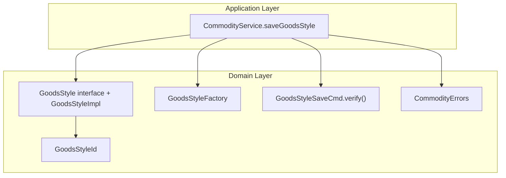
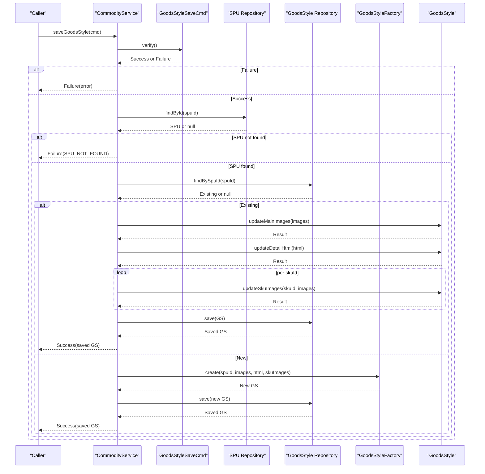
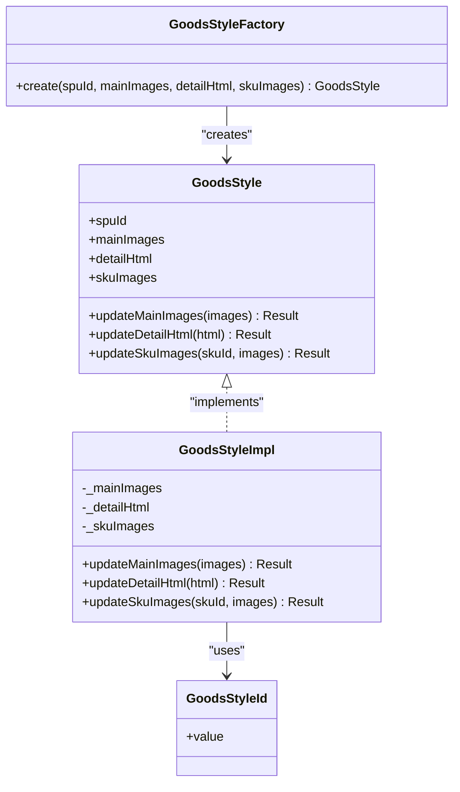
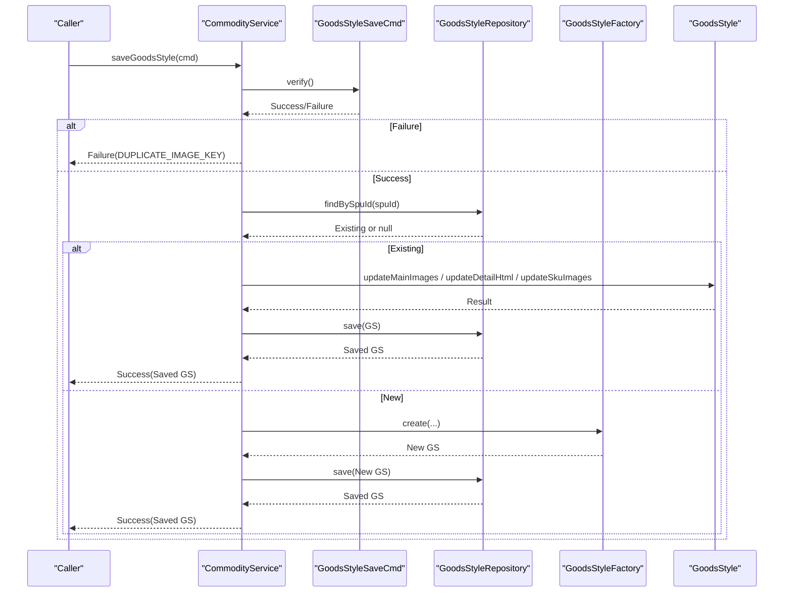
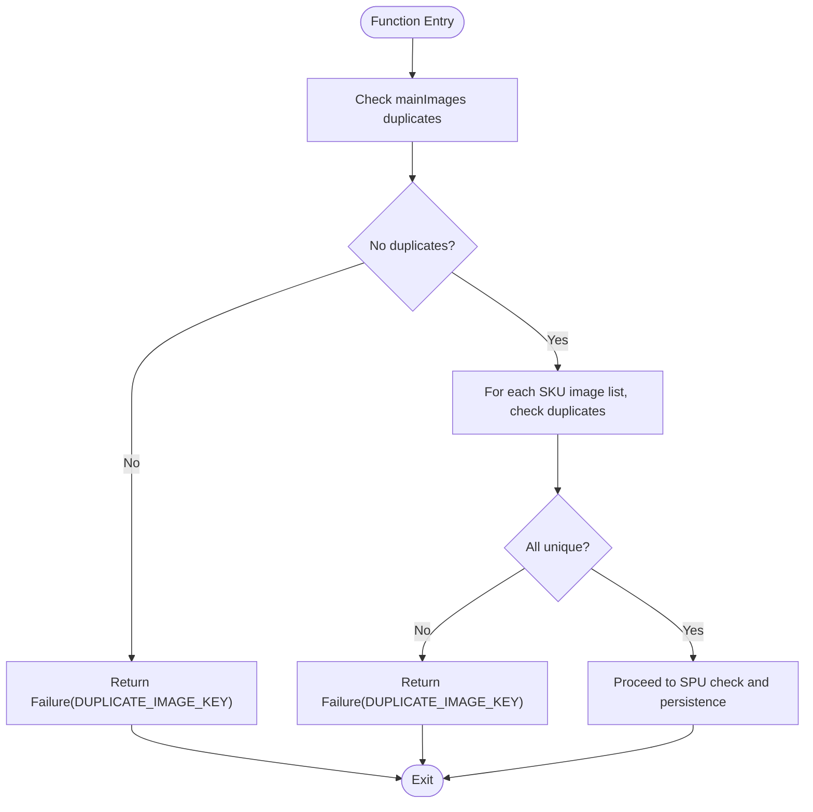

# Goods Style Management

<cite>
**Referenced Files in This Document**
- [CommodityService.kt](file://j-store-goods-application/src/main/kotlin/com/jstore/goods/service/CommodityService.kt)
- [GoodsStyle.kt](file://j-store-goods-domain/src/main/kotlin/com/jstore/goods/domain/commodity/GoodsStyle.kt)
- [GoodsStyleFactory.kt](file://j-store-goods-domain/src/main/kotlin/com/jstore/goods/domain/commodity/GoodsStyleFactory.kt)
- [GoodsStyleId.kt](file://j-store-goods-domain/src/main/kotlin/com/jstore/goods/domain/commodity/GoodsStyleId.kt)
- [GoodsStyleSaveCmd.kt](file://j-store-goods-domain/src/main/kotlin/com/jstore/goods/domain/commodity/comand/GoodsStyleSaveCmd.kt)
- [CommodityErrors.kt](file://j-store-goods-domain/src/main/kotlin/com/jstore/goods/domain/commodity/CommodityErrors.kt)
- [CommodityServiceSaveGoodsStyleTest.kt](file://j-store-goods-application/src/test/kotlin/com/jstore/goods/service/CommodityServiceSaveGoodsStyleTest.kt)
- [GoodsStyleMainImagesOrderPropertyTest.kt](file://j-store-goods-domain/src/test/kotlin/com/jstore/goods/domain/commodity/GoodsStyleMainImagesOrderPropertyTest.kt)
- [GoodsStyleDuplicateImageRejectionPropertyTest.kt](file://j-store-goods-domain/src/test/kotlin/com/jstore/goods/domain/commodity/GoodsStyleDuplicateImageRejectionPropertyTest.kt)
- [GoodsStyleSkuImagesOrderPropertyTest.kt](file://j-store-goods-domain/src/test/kotlin/com/jstore/goods/domain/commodity/GoodsStyleSkuImagesOrderPropertyTest.kt)
- [GoodsStyleDetailHtmlStoragePropertyTest.kt](file://j-store-goods-domain/src/test/kotlin/com/jstore/goods/domain/commodity/GoodsStyleDetailHtmlStoragePropertyTest.kt)
</cite>

## Table of Contents
1. [Introduction](#introduction)
2. [Project Structure](#project-structure)
3. [Core Components](#core-components)
4. [Architecture Overview](#architecture-overview)
5. [Detailed Component Analysis](#detailed-component-analysis)
6. [Dependency Analysis](#dependency-analysis)
7. [Performance Considerations](#performance-considerations)
8. [Troubleshooting Guide](#troubleshooting-guide)
9. [Conclusion](#conclusion)

## Introduction
This document explains the goods style management functionality responsible for creating and updating product display styles. It focuses on the saveGoodsStyle method that handles both creation and updates of a GoodsStyle aggregate, including main images, detail HTML content, and SKU-specific images. The documentation covers validation rules (image ordering, duplicate detection, data integrity), the update methods exposed by the GoodsStyle aggregate, and practical examples for setting up product presentation styles and managing image galleries. Error scenarios and validation failures are also documented with references to tests and domain error definitions.

## Project Structure
The goods style feature spans the application layer (orchestration and command handling) and the domain layer (aggregate definition, factory, and validation). Tests validate behavior such as order preservation, duplicate rejection, and HTML storage fidelity.

**Diagram sources**
- [CommodityService.kt:192-219](file://j-store-goods-application/src/main/kotlin/com/jstore/goods/service/CommodityService.kt#L192-L219)
- [GoodsStyle.kt:9-58](file://j-store-goods-domain/src/main/kotlin/com/jstore/goods/domain/commodity/GoodsStyle.kt#L9-L58)
- [GoodsStyleFactory.kt:5-29](file://j-store-goods-domain/src/main/kotlin/com/jstore/goods/domain/commodity/GoodsStyleFactory.kt#L5-L29)
- [GoodsStyleId.kt:1-6](file://j-store-goods-domain/src/main/kotlin/com/jstore/goods/domain/commodity/GoodsStyleId.kt#L1-L6)
- [GoodsStyleSaveCmd.kt:11-28](file://j-store-goods-domain/src/main/kotlin/com/jstore/goods/domain/commodity/comand/GoodsStyleSaveCmd.kt#L11-L28)
- [CommodityErrors.kt:5-27](file://j-store-goods-domain/src/main/kotlin/com/jstore/goods/domain/commodity/CommodityErrors.kt#L5-L27)

**Section sources**
- [CommodityService.kt:192-219](file://j-store-goods-application/src/main/kotlin/com/jstore/goods/service/CommodityService.kt#L192-L219)
- [GoodsStyle.kt:9-58](file://j-store-goods-domain/src/main/kotlin/com/jstore/goods/domain/commodity/GoodsStyle.kt#L9-L58)
- [GoodsStyleFactory.kt:5-29](file://j-store-goods-domain/src/main/kotlin/com/jstore/goods/domain/commodity/GoodsStyleFactory.kt#L5-L29)
- [GoodsStyleId.kt:1-6](file://j-store-goods-domain/src/main/kotlin/com/jstore/goods/domain/commodity/GoodsStyleId.kt#L1-L6)
- [GoodsStyleSaveCmd.kt:11-28](file://j-store-goods-domain/src/main/kotlin/com/jstore/goods/domain/commodity/comand/GoodsStyleSaveCmd.kt#L11-L28)
- [CommodityErrors.kt:5-27](file://j-store-goods-domain/src/main/kotlin/com/jstore/goods/domain/commodity/CommodityErrors.kt#L5-L27)

## Core Components
- CommodityService.saveGoodsStyle: Orchestrates saving or updating a GoodsStyle for a given SPU. Validates the command, ensures the SPU exists, then either creates a new GoodsStyle via the factory or updates an existing one.
- GoodsStyle aggregate: Encapsulates main images, detail HTML, and SKU images. Provides update methods that enforce business rules (duplicate detection) and preserve order.
- GoodsStyleFactory: Creates new GoodsStyle instances with generated IDs and provided data.
- GoodsStyleSaveCmd: Carries input data and performs pre-validation to reject duplicate image keys before reaching the aggregate.
- CommodityErrors: Centralized error definitions used across validation and domain logic.

Key responsibilities:
- Command verification and early duplicate detection
- SPU existence check
- Creation vs. update branching
- Aggregate-level validation and state mutation
- Persistence through repository (outside this snippet scope)

**Section sources**
- [CommodityService.kt:192-219](file://j-store-goods-application/src/main/kotlin/com/jstore/goods/service/CommodityService.kt#L192-L219)
- [GoodsStyle.kt:9-58](file://j-store-goods-domain/src/main/kotlin/com/jstore/goods/domain/commodity/GoodsStyle.kt#L9-L58)
- [GoodsStyleFactory.kt:5-29](file://j-store-goods-domain/src/main/kotlin/com/jstore/goods/domain/commodity/GoodsStyleFactory.kt#L5-L29)
- [GoodsStyleSaveCmd.kt:11-28](file://j-store-goods-domain/src/main/kotlin/com/jstore/goods/domain/commodity/comand/GoodsStyleSaveCmd.kt#L11-L28)
- [CommodityErrors.kt:5-27](file://j-store-goods-domain/src/main/kotlin/com/jstore/goods/domain/commodity/CommodityErrors.kt#L5-L27)

## Architecture Overview
The saveGoodsStyle flow validates inputs, ensures referential integrity with the SPU, and delegates state changes to the GoodsStyle aggregate. Creation uses the factory; updates mutate the existing aggregate.

**Diagram sources**
- [CommodityService.kt:192-219](file://j-store-goods-application/src/main/kotlin/com/jstore/goods/service/CommodityService.kt#L192-L219)
- [GoodsStyle.kt:9-58](file://j-store-goods-domain/src/main/kotlin/com/jstore/goods/domain/commodity/GoodsStyle.kt#L9-L58)
- [GoodsStyleFactory.kt:5-29](file://j-store-goods-domain/src/main/kotlin/com/jstore/goods/domain/commodity/GoodsStyleFactory.kt#L5-L29)
- [GoodsStyleSaveCmd.kt:11-28](file://j-store-goods-domain/src/main/kotlin/com/jstore/goods/domain/commodity/comand/GoodsStyleSaveCmd.kt#L11-L28)

## Detailed Component Analysis

### saveGoodsStyle Method
- Validates command via GoodsStyleSaveCmd.verify(). Rejects duplicates in mainImages and any SKU image lists.
- Ensures the referenced SPU exists; otherwise returns SPU_NOT_FOUND.
- If a GoodsStyle already exists for the SPU, applies updates in sequence:
  - updateMainImages
  - updateDetailHtml
  - updateSkuImages for each entry
- If no existing GoodsStyle, creates a new instance using GoodsStyleFactory and persists it.

Validation and integrity:
- Duplicate image key detection at command level and aggregate level.
- Order preservation is enforced by direct assignment without reordering.
- Data integrity is maintained by returning Result types and short-circuiting on failure.

Error scenarios:
- Command verification fails due to duplicates → DUPLICATE_IMAGE_KEY
- SPU not found → SPU_NOT_FOUND
- Any aggregate update returns Failure → propagated immediately

**Section sources**
- [CommodityService.kt:192-219](file://j-store-goods-application/src/main/kotlin/com/jstore/goods/service/CommodityService.kt#L192-L219)
- [GoodsStyleSaveCmd.kt:11-28](file://j-store-goods-domain/src/main/kotlin/com/jstore/goods/domain/commodity/comand/GoodsStyleSaveCmd.kt#L11-L28)
- [CommodityErrors.kt:5-27](file://j-store-goods-domain/src/main/kotlin/com/jstore/goods/domain/commodity/CommodityErrors.kt#L5-L27)

### GoodsStyle Aggregate Update Methods
- updateMainImages(images):
  - Validates uniqueness of image keys; rejects duplicates.
  - Stores images preserving order.
- updateDetailHtml(html):
  - Stores HTML string exactly as provided.
- updateSkuImages(skuId, images):
  - Validates uniqueness of image keys per SKU; rejects duplicates.
  - Stores list preserving order under the specified SkuId.

Complexity considerations:
- Uniqueness checks use distinct comparison proportional to list length.
- Assignment operations are O(1) after validation.

**Section sources**
- [GoodsStyle.kt:9-58](file://j-store-goods-domain/src/main/kotlin/com/jstore/goods/domain/commodity/GoodsStyle.kt#L9-L58)

### GoodsStyleFactory
- Creates a new GoodsStyle with a generated ID and provided data.
- Initializes internal collections from input lists/maps.

**Section sources**
- [GoodsStyleFactory.kt:5-29](file://j-store-goods-domain/src/main/kotlin/com/jstore/goods/domain/commodity/GoodsStyleFactory.kt#L5-L29)
- [GoodsStyleId.kt:1-6](file://j-store-goods-domain/src/main/kotlin/com/jstore/goods/domain/commodity/GoodsStyleId.kt#L1-L6)

### Command Validation (GoodsStyleSaveCmd)
- Verifies that mainImages has no duplicates.
- Iterates over skuImages map entries and verifies each list has no duplicates.
- Returns Success when valid; otherwise returns Failure with DUPLICATE_IMAGE_KEY.

**Section sources**
- [GoodsStyleSaveCmd.kt:11-28](file://j-store-goods-domain/src/main/kotlin/com/jstore/goods/domain/commodity/comand/GoodsStyleSaveCmd.kt#L11-L28)
- [CommodityErrors.kt:5-27](file://j-store-goods-domain/src/main/kotlin/com/jstore/goods/domain/commodity/CommodityErrors.kt#L5-L27)

### Class Diagram

**Diagram sources**
- [GoodsStyle.kt:9-58](file://j-store-goods-domain/src/main/kotlin/com/jstore/goods/domain/commodity/GoodsStyle.kt#L9-L58)
- [GoodsStyleFactory.kt:5-29](file://j-store-goods-domain/src/main/kotlin/com/jstore/goods/domain/commodity/GoodsStyleFactory.kt#L5-L29)
- [GoodsStyleId.kt:1-6](file://j-store-goods-domain/src/main/kotlin/com/jstore/goods/domain/commodity/GoodsStyleId.kt#L1-L6)

### Sequence Diagram: saveGoodsStyle Flow

**Diagram sources**
- [CommodityService.kt:192-219](file://j-store-goods-application/src/main/kotlin/com/jstore/goods/service/CommodityService.kt#L192-L219)
- [GoodsStyle.kt:9-58](file://j-store-goods-domain/src/main/kotlin/com/jstore/goods/domain/commodity/GoodsStyle.kt#L9-L58)
- [GoodsStyleFactory.kt:5-29](file://j-store-goods-domain/src/main/kotlin/com/jstore/goods/domain/commodity/GoodsStyleFactory.kt#L5-L29)
- [GoodsStyleSaveCmd.kt:11-28](file://j-store-goods-domain/src/main/kotlin/com/jstore/goods/domain/commodity/comand/GoodsStyleSaveCmd.kt#L11-L28)

### Flowchart: Duplicate Detection Logic

**Diagram sources**
- [GoodsStyleSaveCmd.kt:11-28](file://j-store-goods-domain/src/main/kotlin/com/jstore/goods/domain/commodity/comand/GoodsStyleSaveCmd.kt#L11-L28)
- [GoodsStyle.kt:38-57](file://j-store-goods-domain/src/main/kotlin/com/jstore/goods/domain/commodity/GoodsStyle.kt#L38-L57)

## Dependency Analysis
- CommodityService depends on:
  - GoodsStyleRepository (for find/save)
  - GoodsStyleFactory (for creation)
  - SpuRepository (to ensure SPU existence)
  - DomainEventPublisher (not used in saveGoodsStyle path)
- GoodsStyleImpl depends on:
  - CommodityErrors for error signaling
  - GoodsStyleId for identity
- GoodsStyleSaveCmd depends on:
  - CommodityErrors for error signaling

Coupling and cohesion:
- Application layer orchestrates flows while domain encapsulates business rules.
- Clear separation between command validation and aggregate mutation improves testability and maintainability.

Potential circular dependencies:
- None observed within these components; repositories and factories are injected into service.

External dependencies:
- SnowFlakSequence used by GoodsStyleFactoryImpl for ID generation (not shown here but implied by factory usage).

**Section sources**
- [CommodityService.kt:192-219](file://j-store-goods-application/src/main/kotlin/com/jstore/goods/service/CommodityService.kt#L192-L219)
- [GoodsStyle.kt:9-58](file://j-store-goods-domain/src/main/kotlin/com/jstore/goods/domain/commodity/GoodsStyle.kt#L9-L58)
- [GoodsStyleFactory.kt:5-29](file://j-store-goods-domain/src/main/kotlin/com/jstore/goods/domain/commodity/GoodsStyleFactory.kt#L5-L29)

## Performance Considerations
- Duplicate checks are linear in the size of image lists; keep lists reasonably sized to avoid overhead.
- Avoid unnecessary large HTML payloads; consider chunked updates if needed.
- Batch SKU image updates only when necessary to reduce repeated validations.

[No sources needed since this section provides general guidance]

## Troubleshooting Guide
Common errors and their causes:
- DUPLICATE_IMAGE_KEY: Occurs when mainImages or any SKU image list contains duplicate keys. Validate input before calling saveGoodsStyle.
- SPU_NOT_FOUND: Occurs when the referenced SPU does not exist. Ensure the SPU is created and persisted before saving styles.

Verification and testing references:
- Command-level duplicate detection is validated in tests.
- Aggregate-level duplicate rejection and order preservation are verified by property tests.
- HTML storage fidelity is validated by property tests.

**Section sources**
- [CommodityErrors.kt:5-27](file://j-store-goods-domain/src/main/kotlin/com/jstore/goods/domain/commodity/CommodityErrors.kt#L5-L27)
- [CommodityServiceSaveGoodsStyleTest.kt:51-140](file://j-store-goods-application/src/test/kotlin/com/jstore/goods/service/CommodityServiceSaveGoodsStyleTest.kt#L51-L140)
- [GoodsStyleMainImagesOrderPropertyTest.kt:21-50](file://j-store-goods-domain/src/test/kotlin/com/jstore/goods/domain/commodity/GoodsStyleMainImagesOrderPropertyTest.kt#L21-L50)
- [GoodsStyleDuplicateImageRejectionPropertyTest.kt:21-81](file://j-store-goods-domain/src/test/kotlin/com/jstore/goods/domain/commodity/GoodsStyleDuplicateImageRejectionPropertyTest.kt#L21-L81)
- [GoodsStyleSkuImagesOrderPropertyTest.kt:21-51](file://j-store-goods-domain/src/test/kotlin/com/jstore/goods/domain/commodity/GoodsStyleSkuImagesOrderPropertyTest.kt#L21-L51)
- [GoodsStyleDetailHtmlStoragePropertyTest.kt:21-48](file://j-store-goods-domain/src/test/kotlin/com/jstore/goods/domain/commodity/GoodsStyleDetailHtmlStoragePropertyTest.kt#L21-L48)

## Conclusion
The goods style management functionality provides robust creation and update capabilities for product display styles. Validation ensures data integrity by rejecting duplicate image keys and preserving order. The GoodsStyle aggregate encapsulates business rules for main images, detail HTML, and SKU images, while CommodityService coordinates the workflow. Tests comprehensively cover edge cases and invariants, ensuring reliable behavior across scenarios.

[No sources needed since this section summarizes without analyzing specific files]