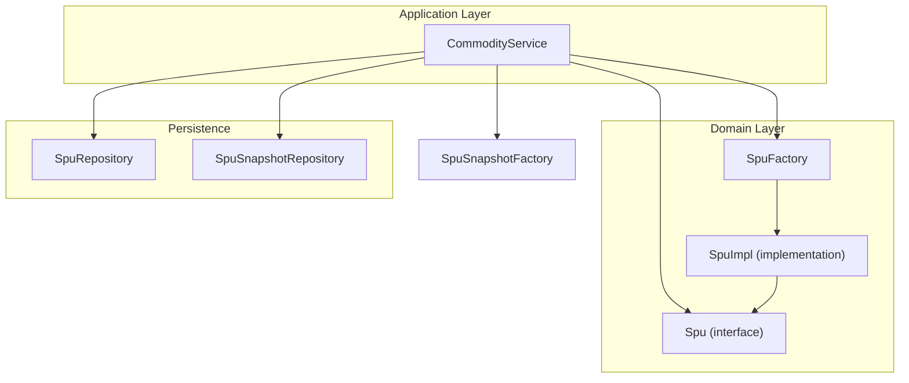
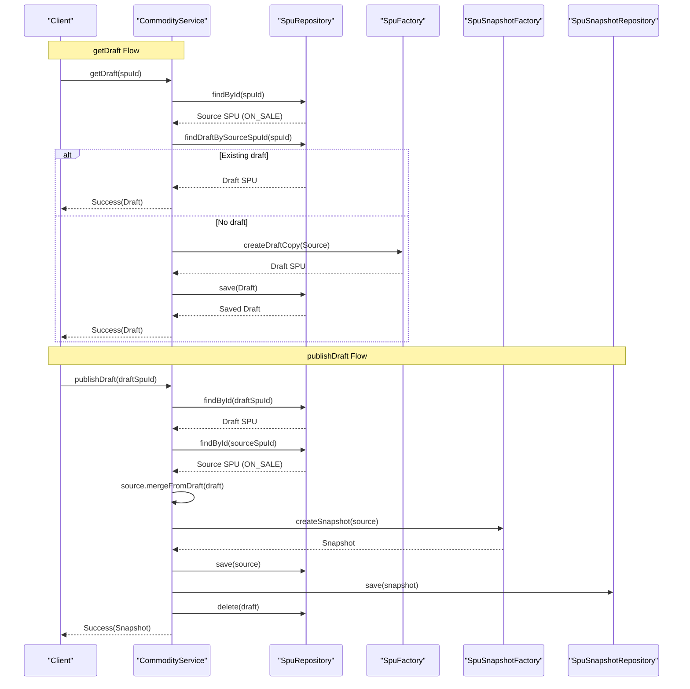
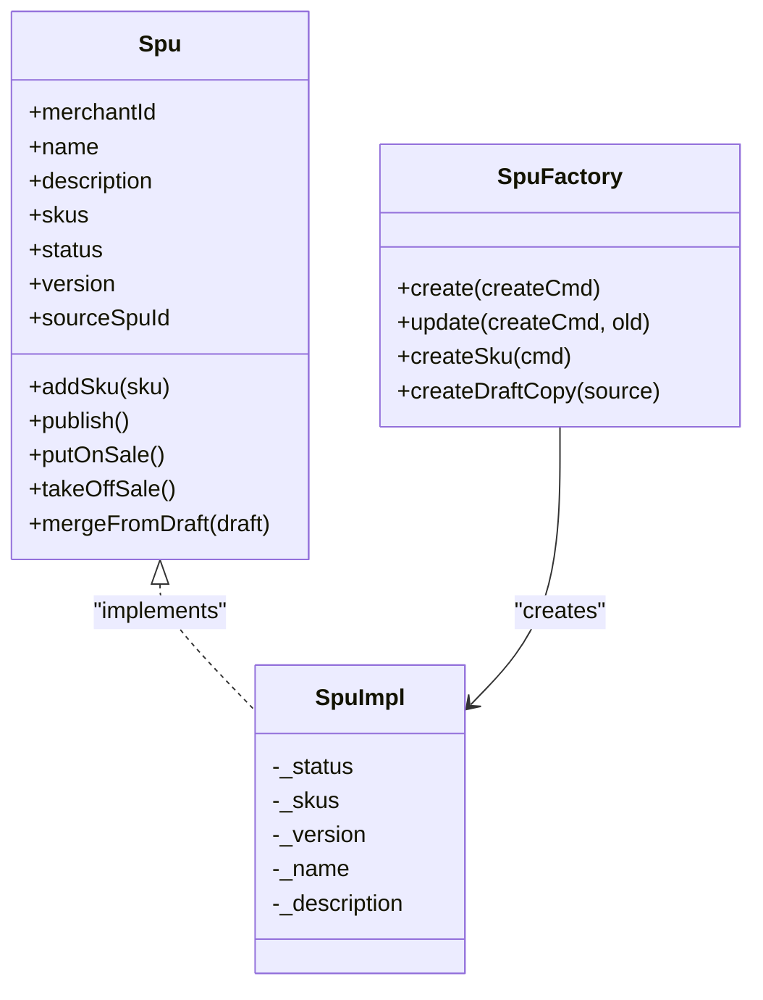
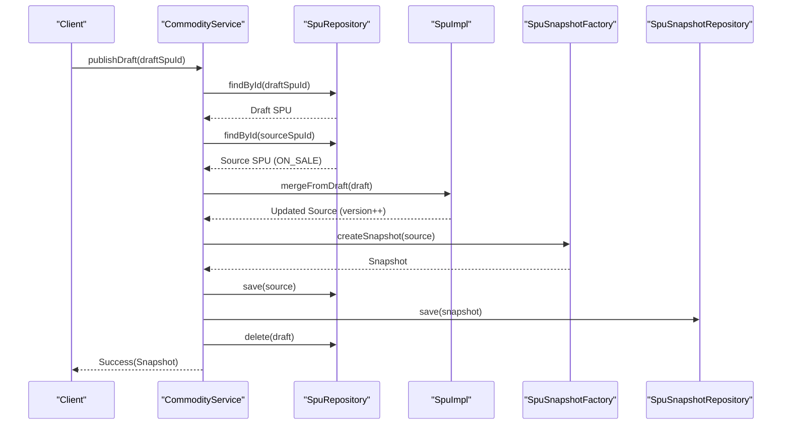
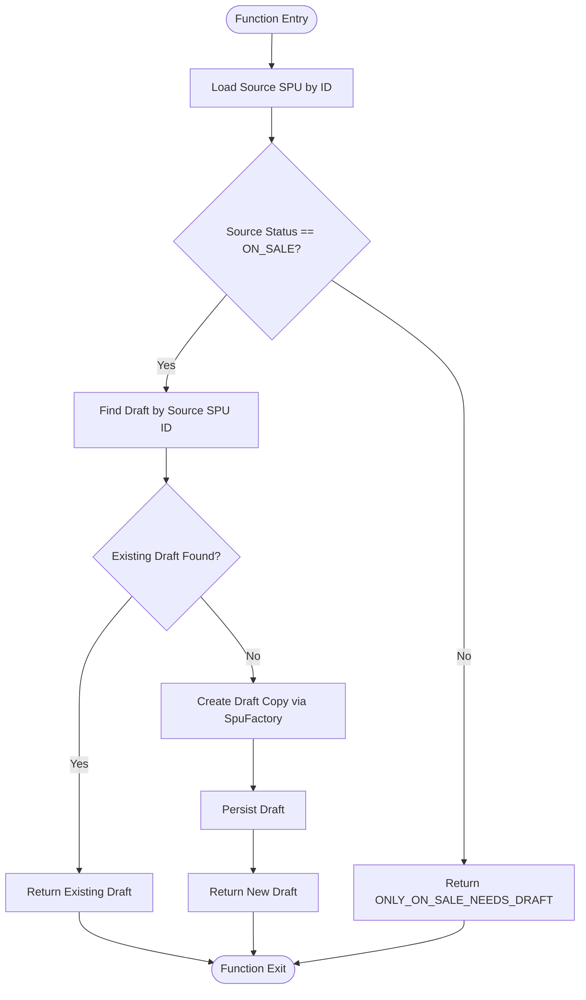

# Draft Workflow

<cite>
**Referenced Files in This Document**
- [CommodityService.kt](file://j-store-goods-application/src/main/kotlin/com/jstore/goods/service/CommodityService.kt)
- [SpuFactory.kt](file://j-store-goods-domain/src/main/kotlin/com/jstore/goods/domain/commodity/SpuFactory.kt)
- [Spu.kt](file://j-store-goods-domain/src/main/kotlin/com/jstore/goods/domain/commodity/Spu.kt)
- [SpuImpl.kt](file://j-store-goods-domain/src/main/kotlin/com/jstore/goods/domain/commodity/SpuImpl.kt)
- [CommodityErrors.kt](file://j-store-goods-domain/src/main/kotlin/com/jstore/goods/domain/commodity/CommodityErrors.kt)
- [CommodityServiceDraftFlowTest.kt](file://j-store-goods-application/src/test/kotlin/com/jstore/goods/service/CommodityServiceDraftFlowTest.kt)
</cite>

## Table of Contents
1. [Introduction](#introduction)
2. [Project Structure](#project-structure)
3. [Core Components](#core-components)
4. [Architecture Overview](#architecture-overview)
5. [Detailed Component Analysis](#detailed-component-analysis)
6. [Dependency Analysis](#dependency-analysis)
7. [Performance Considerations](#performance-considerations)
8. [Troubleshooting Guide](#troubleshooting-guide)
9. [Conclusion](#conclusion)
10. [Appendices](#appendices)

## Introduction
This document explains the complete draft workflow for product updates, focusing on getDraft, publishDraft, and discardDraft operations. It details how editable copies are created for ON_SALE products with idempotency guarantees, how drafts maintain relationships to source SPUs, and how publishing merges changes back to the live product while incrementing versions and creating snapshots. It also covers validation rules, business constraints, error scenarios, and practical examples demonstrating safe concurrent editing of live products via drafts.

## Project Structure
The draft workflow spans the goods application layer (orchestration) and the goods domain layer (business logic). Key responsibilities:
- Application layer (CommodityService): orchestrates repository calls, factory usage, snapshot creation, event publishing, and draft lifecycle operations.
- Domain layer (Spu, SpuImpl, SpuFactory): encapsulates state transitions, draft copy creation, merging logic, and versioning semantics.

**Diagram sources**
- [CommodityService.kt:18-26](file://j-store-goods-application/src/main/kotlin/com/jstore/goods/service/CommodityService.kt#L18-L26)
- [SpuFactory.kt:11-19](file://j-store-goods-domain/src/main/kotlin/com/jstore/goods/domain/commodity/SpuFactory.kt#L11-L19)
- [Spu.kt:16-52](file://j-store-goods-domain/src/main/kotlin/com/jstore/goods/domain/commodity/Spu.kt#L16-L52)
- [SpuImpl.kt:12-21](file://j-store-goods-domain/src/main/kotlin/com/jstore/goods/domain/commodity/SpuImpl.kt#L12-L21)

**Section sources**
- [CommodityService.kt:18-26](file://j-store-goods-application/src/main/kotlin/com/jstore/goods/service/CommodityService.kt#L18-L26)
- [SpuFactory.kt:11-19](file://j-store-goods-domain/src/main/kotlin/com/jstore/goods/domain/commodity/SpuFactory.kt#L11-L19)
- [Spu.kt:16-52](file://j-store-goods-domain/src/main/kotlin/com/jstore/goods/domain/commodity/Spu.kt#L16-L52)
- [SpuImpl.kt:12-21](file://j-store-goods-domain/src/main/kotlin/com/jstore/goods/domain/commodity/SpuImpl.kt#L12-L21)

## Core Components
- CommodityService: Implements draft lifecycle methods (getDraft, publishDraft, discardDraft), enforces business constraints, and coordinates persistence and events.
- SpuFactory: Creates draft copies from ON_SALE SPUs, ensuring correct initial state and relationship tracking.
- Spu and SpuImpl: Define draft merge behavior, status guards, and version increments during merge.
- Error definitions: Centralized error codes for draft flow validations and constraints.

Key behaviors:
- getDraft ensures idempotency by returning an existing draft if present; otherwise creates a new draft copy.
- publishDraft validates that the target is a draft copy, merges content into the source ON_SALE SPU, increments version, creates a snapshot, deletes the draft, and publishes pending events.
- discardDraft removes a draft copy without affecting the source SPU.

**Section sources**
- [CommodityService.kt:134-189](file://j-store-goods-application/src/main/kotlin/com/jstore/goods/service/CommodityService.kt#L134-L189)
- [SpuFactory.kt:59-77](file://j-store-goods-domain/src/main/kotlin/com/jstore/goods/domain/commodity/SpuFactory.kt#L59-L77)
- [Spu.kt:50-52](file://j-store-goods-domain/src/main/kotlin/com/jstore/goods/domain/commodity/Spu.kt#L50-L52)
- [SpuImpl.kt:90-109](file://j-store-goods-domain/src/main/kotlin/com/jstore/goods/domain/commodity/SpuImpl.kt#L90-L109)
- [CommodityErrors.kt:18-27](file://j-store-goods-domain/src/main/kotlin/com/jstore/goods/domain/commodity/CommodityErrors.kt#L18-L27)

## Architecture Overview
The draft workflow follows a clear sequence:
- getDraft: Validate source is ON_SALE, check for existing draft, create draft copy if needed, persist and return.
- publishDraft: Validate draft copy, load source, merge draft into source, create snapshot, persist both, delete draft, publish events.
- discardDraft: Validate draft copy, delete draft, leave source unchanged.

**Diagram sources**
- [CommodityService.kt:134-189](file://j-store-goods-application/src/main/kotlin/com/jstore/goods/service/CommodityService.kt#L134-L189)
- [SpuFactory.kt:59-77](file://j-store-goods-domain/src/main/kotlin/com/jstore/goods/domain/commodity/SpuFactory.kt#L59-L77)
- [SpuImpl.kt:90-109](file://j-store-goods-domain/src/main/kotlin/com/jstore/goods/domain/commodity/SpuImpl.kt#L90-L109)

## Detailed Component Analysis

### getDraft Operation
Purpose: Create or retrieve an editable draft copy for an ON_SALE product with idempotency guarantees.

Behavior:
- Validates the source SPU exists and is ON_SALE.
- Checks for an existing draft linked to the source SPU; returns it immediately if found.
- If no draft exists, uses SpuFactory.createDraftCopy to generate a new draft with DRAFT status, copying name, description, SKU list, and setting sourceSpuId to the original SPU’s ID.
- Persists the new draft and returns it.

Validation and constraints:
- Only ON_SALE products can use the draft workflow; non-ON_SALE returns ONLY_ON_SALE_NEEDS_DRAFT.
- Idempotent: repeated calls with the same source SPU return the same draft without re-creating.

Error scenarios:
- SPU_NOT_FOUND when source does not exist.
- ONLY_ON_SALE_NEEDS_DRAFT when source is not ON_SALE.

Practical example:
- A merchant edits an ON_SALE product by calling getDraft, receives a draft SPU, modifies SKUs and attributes, then later publishes to apply changes safely.

**Section sources**
- [CommodityService.kt:134-150](file://j-store-goods-application/src/main/kotlin/com/jstore/goods/service/CommodityService.kt#L134-L150)
- [SpuFactory.kt:59-77](file://j-store-goods-domain/src/main/kotlin/com/jstore/goods/domain/commodity/SpuFactory.kt#L59-L77)
- [CommodityErrors.kt:18-24](file://j-store-goods-domain/src/main/kotlin/com/jstore/goods/domain/commodity/CommodityErrors.kt#L18-L24)
- [CommodityServiceDraftFlowTest.kt:119-147](file://j-store-goods-application/src/test/kotlin/com/jstore/goods/service/CommodityServiceDraftFlowTest.kt#L119-L147)

### publishDraft Operation
Purpose: Merge draft changes back to the source ON_SALE product, increment version, create a snapshot, and clean up the draft.

Behavior:
- Validates the target SPU is a draft copy (sourceSpuId must be set); otherwise returns NOT_A_DRAFT_COPY.
- Loads the source SPU using sourceSpuId; expects it to be ON_SALE.
- Calls source.mergeFromDraft(draft) to update name, description, replace SKU list, and increment version.
- Creates a new snapshot via SpuSnapshotFactory.createSnapshot(source).
- Persists updated source and snapshot, deletes the draft, and publishes pending events.

Validation and constraints:
- Draft must have at least one SKU; otherwise DRAFT_NO_SKU_FOR_PUBLISH.
- Source must be ON_SALE; otherwise INVALID_STATUS_TRANSITION.
- Merchant IDs must match; otherwise INVALID_STATUS_TRANSITION.

Error scenarios:
- SPU_NOT_FOUND for missing draft or source.
- NOT_A_DRAFT_COPY if draft lacks sourceSpuId.
- DRAFT_NO_SKU_FOR_PUBLISH if draft has no SKUs.
- INVALID_STATUS_TRANSITION if source is not ON_SALE or merchant mismatch.

Practical example:
- After editing the draft SPU (e.g., updating prices and attributes), the merchant calls publishDraft to apply changes to the live product, generating a snapshot for auditability and rollback reference.

**Section sources**
- [CommodityService.kt:153-178](file://j-store-goods-application/src/main/kotlin/com/jstore/goods/service/CommodityService.kt#L153-L178)
- [SpuImpl.kt:90-109](file://j-store-goods-domain/src/main/kotlin/com/jstore/goods/domain/commodity/SpuImpl.kt#L90-L109)
- [CommodityErrors.kt:18-27](file://j-store-goods-domain/src/main/kotlin/com/jstore/goods/domain/commodity/CommodityErrors.kt#L18-L27)
- [CommodityServiceDraftFlowTest.kt:178-213](file://j-store-goods-application/src/test/kotlin/com/jstore/goods/service/CommodityServiceDraftFlowTest.kt#L178-L213)

### discardDraft Operation
Purpose: Cancel draft operations by deleting the draft copy without affecting the source product.

Behavior:
- Validates the target SPU is a draft copy; otherwise returns NOT_A_DRAFT_COPY.
- Deletes the draft from storage; source remains unchanged.

Validation and constraints:
- Must be a draft copy (sourceSpuId set).

Error scenarios:
- SPU_NOT_FOUND if draft does not exist.
- NOT_A_DRAFT_COPY if draft lacks sourceSpuId.

Practical example:
- A merchant decides not to proceed with draft changes and discards the draft, leaving the live product unaffected.

**Section sources**
- [CommodityService.kt:181-189](file://j-store-goods-application/src/main/kotlin/com/jstore/goods/service/CommodityService.kt#L181-L189)
- [CommodityErrors.kt:18-24](file://j-store-goods-domain/src/main/kotlin/com/jstore/goods/domain/commodity/CommodityErrors.kt#L18-L24)
- [CommodityServiceDraftFlowTest.kt:226-268](file://j-store-goods-application/src/test/kotlin/com/jstore/goods/service/CommodityServiceDraftFlowTest.kt#L226-L268)

### Draft Copy Mechanism and Relationships
- SpuFactory.createDraftCopy constructs a new SpuImpl with DRAFT status, copies name, description, and SKU list, sets version equal to source, and records sourceSpuId to link back to the original ON_SALE product.
- The relationship is maintained via sourceSpuId on the draft; this enables publishDraft to locate and merge into the correct source.

Data integrity:
- MerchantId must match between source and draft.
- Draft must contain at least one SKU before publishing.

**Section sources**
- [SpuFactory.kt:59-77](file://j-store-goods-domain/src/main/kotlin/com/jstore/goods/domain/commodity/SpuFactory.kt#L59-L77)
- [Spu.kt:35-36](file://j-store-goods-domain/src/main/kotlin/com/jstore/goods/domain/commodity/Spu.kt#L35-L36)

### Class Diagram: Draft Entities and Factory

**Diagram sources**
- [Spu.kt:16-52](file://j-store-goods-domain/src/main/kotlin/com/jstore/goods/domain/commodity/Spu.kt#L16-L52)
- [SpuImpl.kt:12-21](file://j-store-goods-domain/src/main/kotlin/com/jstore/goods/domain/commodity/SpuImpl.kt#L12-L21)
- [SpuFactory.kt:11-19](file://j-store-goods-domain/src/main/kotlin/com/jstore/goods/domain/commodity/SpuFactory.kt#L11-L19)

### Sequence Diagram: publishDraft Call Chain

**Diagram sources**
- [CommodityService.kt:153-178](file://j-store-goods-application/src/main/kotlin/com/jstore/goods/service/CommodityService.kt#L153-L178)
- [SpuImpl.kt:90-109](file://j-store-goods-domain/src/main/kotlin/com/jstore/goods/domain/commodity/SpuImpl.kt#L90-L109)

### Flowchart: getDraft Idempotency Logic

**Diagram sources**
- [CommodityService.kt:134-150](file://j-store-goods-application/src/main/kotlin/com/jstore/goods/service/CommodityService.kt#L134-L150)
- [SpuFactory.kt:59-77](file://j-store-goods-domain/src/main/kotlin/com/jstore/goods/domain/commodity/SpuFactory.kt#L59-L77)

## Dependency Analysis
- CommodityService depends on:
  - SpuRepository for loading, saving, and deleting SPUs and drafts.
  - SpuFactory for creating draft copies.
  - SpuSnapshotFactory for creating snapshots.
  - SpuSnapshotRepository for persisting snapshots.
  - DomainEventPublisher for publishing pending events after state changes.
- SpuFactory depends on SnowFlakSequence for ID generation.
- SpuImpl implements domain logic for status transitions and draft merging.

Potential coupling:
- Tight coupling between CommodityService and repositories/factories is intentional for orchestration.
- Domain logic is encapsulated within SpuImpl, minimizing cross-layer leakage.

Circular dependencies:
- None observed; application layer orchestrates domain and infrastructure layers.

External integrations:
- Persistence via JPA repositories (infrastructure layer).
- Event publishing via DomainEventPublisher.

**Section sources**
- [CommodityService.kt:18-26](file://j-store-goods-application/src/main/kotlin/com/jstore/goods/service/CommodityService.kt#L18-L26)
- [SpuFactory.kt:21-32](file://j-store-goods-domain/src/main/kotlin/com/jstore/goods/domain/commodity/SpuFactory.kt#L21-L32)
- [SpuImpl.kt:12-21](file://j-store-goods-domain/src/main/kotlin/com/jstore/goods/domain/commodity/SpuImpl.kt#L12-L21)

## Performance Considerations
- Idempotent getDraft avoids redundant draft creation and saves database writes.
- Merging replaces SKU lists rather than incremental updates, which simplifies consistency but may increase write volume; acceptable given typical edit sizes.
- Snapshot creation occurs only on publishDraft, reducing overhead during draft editing.
- Event publishing is deferred until transaction completion via publishPendingEvents, improving performance and consistency.

[No sources needed since this section provides general guidance]

## Troubleshooting Guide
Common errors and resolutions:
- SPU_NOT_FOUND: Ensure the provided SPU ID exists in storage.
- ONLY_ON_SALE_NEEDS_DRAFT: Only ON_SALE products require draft workflow; verify source status.
- NOT_A_DRAFT_COPY: Confirm draft has sourceSpuId set; ensure draft was created via SpuFactory.createDraftCopy.
- DRAFT_NO_SKU_FOR_PUBLISH: Add at least one SKU to the draft before publishing.
- INVALID_STATUS_TRANSITION: Verify source is ON_SALE and merchant IDs match between source and draft.

Debugging tips:
- Inspect draft existence via repository queries.
- Validate draft properties (SKU count, merchantId) before publishDraft.
- Review domain events published after successful operations.

**Section sources**
- [CommodityErrors.kt:18-27](file://j-store-goods-domain/src/main/kotlin/com/jstore/goods/domain/commodity/CommodityErrors.kt#L18-L27)
- [CommodityServiceDraftFlowTest.kt:93-117](file://j-store-goods-application/src/test/kotlin/com/jstore/goods/service/CommodityServiceDraftFlowTest.kt#L93-L117)
- [CommodityServiceDraftFlowTest.kt:151-176](file://j-store-goods-application/src/test/kotlin/com/jstore/goods/service/CommodityServiceDraftFlowTest.kt#L151-L176)

## Conclusion
The draft workflow enables safe, concurrent editing of live products by isolating changes in draft copies and applying them atomically through publishDraft. Idempotency in getDraft prevents duplicate drafts, while strict validation ensures data integrity and consistent state transitions. Snapshots provide auditability and rollback references, and event publishing maintains system coherence.

[No sources needed since this section summarizes without analyzing specific files]

## Appendices
- Practical workflow example:
  - Merchant calls getDraft for an ON_SALE product, receives a draft SPU.
  - Merchant edits draft (updates names, descriptions, SKUs).
  - Merchant calls publishDraft to merge changes, increment version, create snapshot, and delete draft.
  - If changes are unwanted, merchant calls discardDraft to remove draft without affecting source.

- Concurrent editing safety:
  - Multiple merchants can edit different drafts concurrently without interfering with each other or the live product.
  - publishDraft applies changes atomically, preventing partial updates.

[No sources needed since this section provides general guidance]