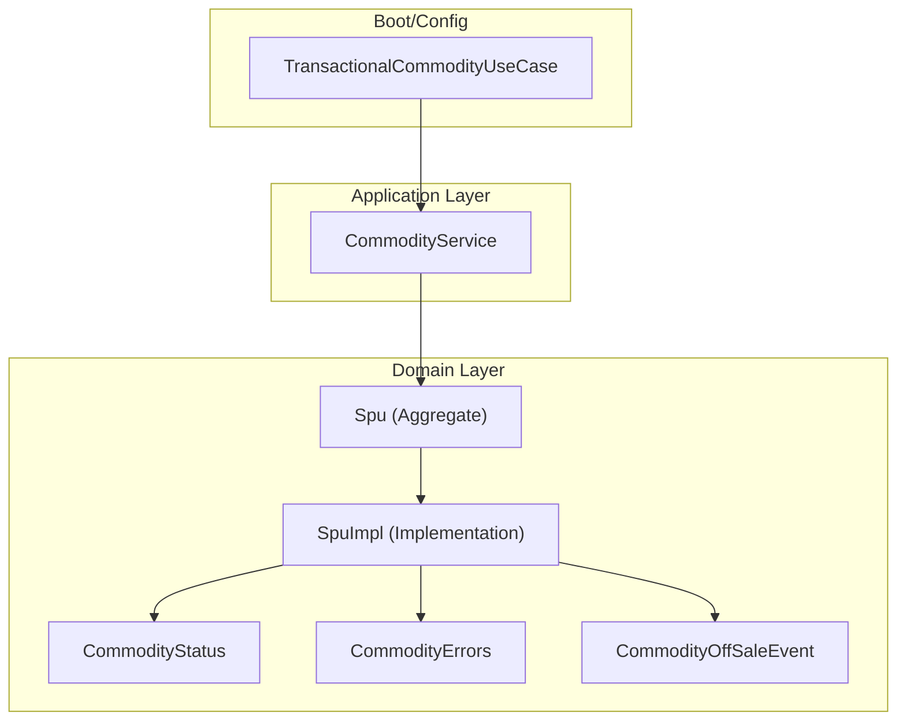
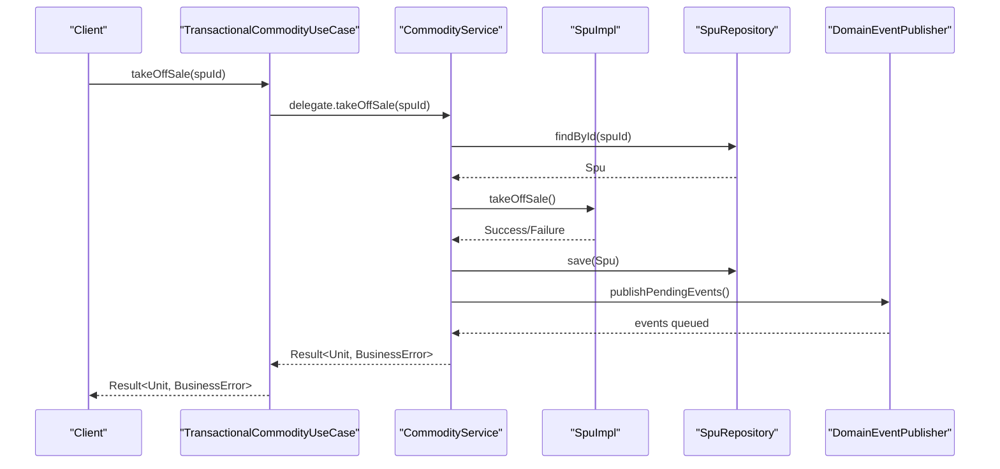
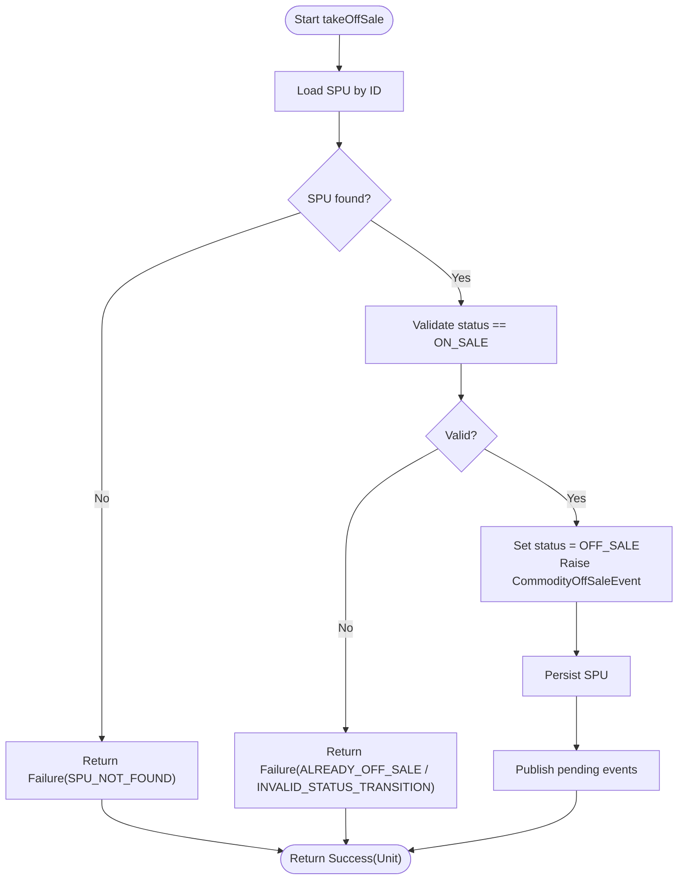
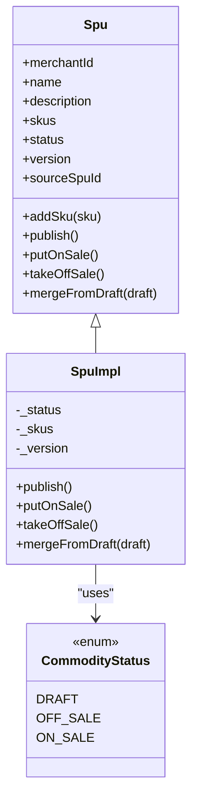
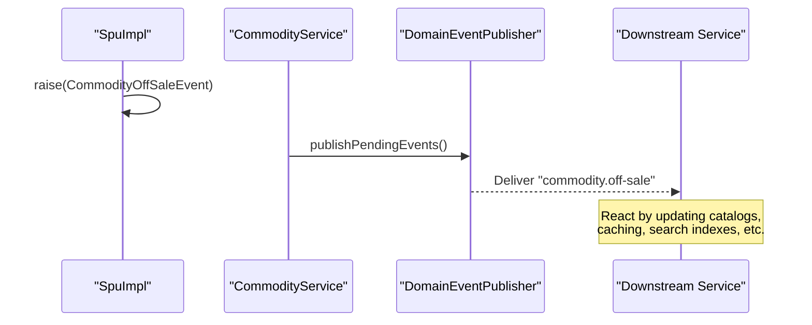
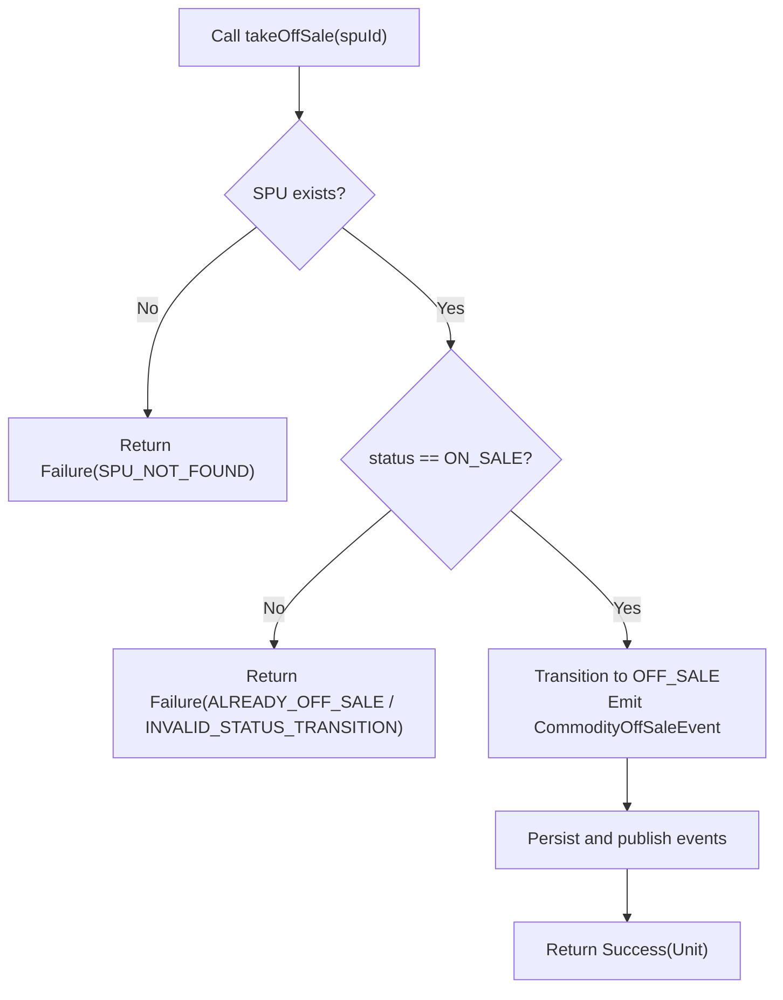
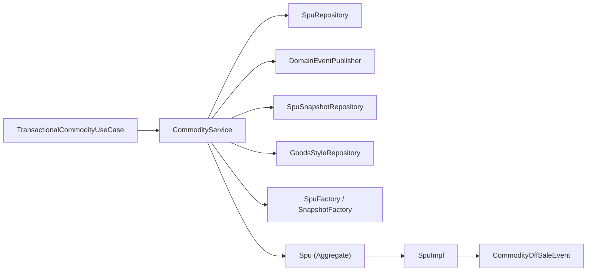

# Off-Sale Workflow

<cite>
**Referenced Files in This Document**
- [CommodityService.kt](file://j-store-goods-application/src/main/kotlin/com/jstore/goods/service/CommodityService.kt)
- [TransactionalCommodityUseCase.kt](file://j-store-goods-boot/src/main/kotlin/com/jstore/goods/config/TransactionalCommodityUseCase.kt)
- [Spu.kt](file://j-store-goods-domain/src/main/kotlin/com/jstore/goods/domain/commodity/Spu.kt)
- [SpuImpl.kt](file://j-store-goods-domain/src/main/kotlin/com/jstore/goods/domain/commodity/SpuImpl.kt)
- [CommodityStatus.kt](file://j-store-goods-domain/src/main/kotlin/com/jstore/goods/domain/commodity/CommodityStatus.kt)
- [CommodityErrors.kt](file://j-store-goods-domain/src/main/kotlin/com/jstore/goods/domain/commodity/CommodityErrors.kt)
- [CommodityOffSaleEvent.kt](file://j-store-goods-domain/src/main/kotlin/com/jstore/goods/domain/commodity/event/CommodityOffSaleEvent.kt)
- [CommodityOnSaleEvent.kt](file://j-store-goods-domain/src/main/kotlin/com/jstore/goods/domain/commodity/event/CommodityOnSaleEvent.kt)
- [BusinessError.kt](file://j-store-common-core/src/main/kotlin/com/jstore/common/errors/BusinessError.kt)
- [Result.kt](file://j-store-common-core/src/main/kotlin/com/jstore/common/utils/Result.kt)
</cite>

## Table of Contents
1. [Introduction](#introduction)
2. [Project Structure](#project-structure)
3. [Core Components](#core-components)
4. [Architecture Overview](#architecture-overview)
5. [Detailed Component Analysis](#detailed-component-analysis)
6. [Dependency Analysis](#dependency-analysis)
7. [Performance Considerations](#performance-considerations)
8. [Troubleshooting Guide](#troubleshooting-guide)
9. [Conclusion](#conclusion)
10. [Appendices](#appendices)

## Introduction
This document explains the off-sale workflow that transitions a product from ON_SALE to OFF_SALE. It focuses on the takeOffSale method, including validation rules, domain state transitions, event publishing, and how downstream services react. It also covers inventory implications, order handling considerations, error scenarios (e.g., already off-sale or concurrent modifications), and best practices for managing product availability.

## Project Structure
The off-sale capability spans three layers:
- Application layer: CommodityService orchestrates use cases and persists changes.
- Domain layer: Spu aggregate enforces business rules and emits domain events.
- Infrastructure/boot layer: TransactionalCommodityUseCase wraps operations in transactions.

**Diagram sources**
- [CommodityService.kt](file://j-store-goods-application/src/main/kotlin/com/jstore/goods/service/CommodityService.kt)
- [Spu.kt](file://j-store-goods-domain/src/main/kotlin/com/jstore/goods/domain/commodity/Spu.kt)
- [SpuImpl.kt](file://j-store-goods-domain/src/main/kotlin/com/jstore/goods/domain/commodity/SpuImpl.kt)
- [CommodityStatus.kt](file://j-store-goods-domain/src/main/kotlin/com/jstore/goods/domain/commodity/CommodityStatus.kt)
- [CommodityErrors.kt](file://j-store-goods-domain/src/main/kotlin/com/jstore/goods/domain/commodity/CommodityErrors.kt)
- [CommodityOffSaleEvent.kt](file://j-store-goods-domain/src/main/kotlin/com/jstore/goods/domain/commodity/event/CommodityOffSaleEvent.kt)
- [TransactionalCommodityUseCase.kt](file://j-store-goods-boot/src/main/kotlin/com/jstore/goods/config/TransactionalCommodityUseCase.kt)

**Section sources**
- [CommodityService.kt](file://j-store-goods-application/src/main/kotlin/com/jstore/goods/service/CommodityService.kt)
- [Spu.kt](file://j-store-goods-domain/src/main/kotlin/com/jstore/goods/domain/commodity/Spu.kt)
- [SpuImpl.kt](file://j-store-goods-domain/src/main/kotlin/com/jstore/goods/domain/commodity/SpuImpl.kt)
- [CommodityStatus.kt](file://j-store-goods-domain/src/main/kotlin/com/jstore/goods/domain/commodity/CommodityStatus.kt)
- [CommodityErrors.kt](file://j-store-goods-domain/src/main/kotlin/com/jstore/goods/domain/commodity/CommodityErrors.kt)
- [CommodityOffSaleEvent.kt](file://j-store-goods-domain/src/main/kotlin/com/jstore/goods/domain/commodity/event/CommodityOffSaleEvent.kt)
- [TransactionalCommodityUseCase.kt](file://j-store-goods-boot/src/main/kotlin/com/jstore/goods/config/TransactionalCommodityUseCase.kt)

## Core Components
- CommodityUseCase: Declares the takeOffSale(spuId) operation alongside other commodity commands.
- CommodityService: Implements takeOffSale by loading the SPU, invoking domain logic, persisting changes, and publishing pending events.
- Spu interface and SpuImpl: Enforce status transition rules and emit CommodityOffSaleEvent when transitioning from ON_SALE to OFF_SALE.
- CommodityStatus: Enumerates DRAFT, OFF_SALE, ON_SALE.
- CommodityErrors: Defines error codes such as ALREADY_OFF_SALE and INVALID_STATUS_TRANSITION.
- BusinessError and Result: Standardized error and success wrappers used across the application.

Key responsibilities:
- Validation: Ensure the SPU exists and is currently ON_SALE before allowing off-sale.
- State change: Transition to OFF_SALE and increment version if applicable.
- Event emission: Raise CommodityOffSaleEvent for downstream consumers.
- Persistence: Save the updated SPU within a transactional boundary.

**Section sources**
- [CommodityUseCase.kt](file://j-store-goods-application/src/main/kotlin/com/jstore/goods/service/CommodityUseCase.kt)
- [CommodityService.kt](file://j-store-goods-application/src/main/kotlin/com/jstore/goods/service/CommodityService.kt)
- [Spu.kt](file://j-store-goods-domain/src/main/kotlin/com/jstore/goods/domain/commodity/Spu.kt)
- [SpuImpl.kt](file://j-store-goods-domain/src/main/kotlin/com/jstore/goods/domain/commodity/SpuImpl.kt)
- [CommodityStatus.kt](file://j-store-goods-domain/src/main/kotlin/com/jstore/goods/domain/commodity/CommodityStatus.kt)
- [CommodityErrors.kt](file://j-store-goods-domain/src/main/kotlin/com/jstore/goods/domain/commodity/CommodityErrors.kt)
- [BusinessError.kt](file://j-store-common-core/src/main/kotlin/com/jstore/common/errors/BusinessError.kt)
- [Result.kt](file://j-store-common-core/src/main/kotlin/com/jstore/common/utils/Result.kt)

## Architecture Overview
The off-sale flow is a typical DDD command flow with event-driven side effects.

**Diagram sources**
- [TransactionalCommodityUseCase.kt](file://j-store-goods-boot/src/main/kotlin/com/jstore/goods/config/TransactionalCommodityUseCase.kt)
- [CommodityService.kt](file://j-store-goods-application/src/main/kotlin/com/jstore/goods/service/CommodityService.kt)
- [SpuImpl.kt](file://j-store-goods-domain/src/main/kotlin/com/jstore/goods/domain/commodity/SpuImpl.kt)

## Detailed Component Analysis

### Off-Sale Command Flow (takeOffSale)
- Entry point: CommodityUseCase declares takeOffSale(spuId).
- Orchestration: CommodityService takesOffSale loads the SPU, calls domain method, persists, and publishes events.
- Domain enforcement: SpuImpl.takeOffSale validates current status equals ON_SALE; otherwise returns an error. On success, it sets status to OFF_SALE and raises CommodityOffSaleEvent.

**Diagram sources**
- [CommodityService.kt](file://j-store-goods-application/src/main/kotlin/com/jstore/goods/service/CommodityService.kt)
- [SpuImpl.kt](file://j-store-goods-domain/src/main/kotlin/com/jstore/goods/domain/commodity/SpuImpl.kt)
- [CommodityErrors.kt](file://j-store-goods-domain/src/main/kotlin/com/jstore/goods/domain/commodity/CommodityErrors.kt)

**Section sources**
- [CommodityService.kt](file://j-store-goods-application/src/main/kotlin/com/jstore/goods/service/CommodityService.kt)
- [SpuImpl.kt](file://j-store-goods-domain/src/main/kotlin/com/jstore/goods/domain/commodity/SpuImpl.kt)
- [CommodityErrors.kt](file://j-store-goods-domain/src/main/kotlin/com/jstore/goods/domain/commodity/CommodityErrors.kt)

### Domain Model and Status Transitions
- CommodityStatus defines allowed states: DRAFT, OFF_SALE, ON_SALE.
- Spu interface exposes takeOffSale(), putOnSale(), and publish().
- SpuImpl implements transitions with strict guards:
  - putOnSale: rejects DRAFT and already ON_SALE.
  - takeOffSale: requires ON_SALE; otherwise fails with ALREADY_OFF_SALE or INVALID_STATUS_TRANSITION.

**Diagram sources**
- [Spu.kt](file://j-store-goods-domain/src/main/kotlin/com/jstore/goods/domain/commodity/Spu.kt)
- [SpuImpl.kt](file://j-store-goods-domain/src/main/kotlin/com/jstore/goods/domain/commodity/SpuImpl.kt)
- [CommodityStatus.kt](file://j-store-goods-domain/src/main/kotlin/com/jstore/goods/domain/commodity/CommodityStatus.kt)

**Section sources**
- [Spu.kt](file://j-store-goods-domain/src/main/kotlin/com/jstore/goods/domain/commodity/Spu.kt)
- [SpuImpl.kt](file://j-store-goods-domain/src/main/kotlin/com/jstore/goods/domain/commodity/SpuImpl.kt)
- [CommodityStatus.kt](file://j-store-goods-domain/src/main/kotlin/com/jstore/goods/domain/commodity/CommodityStatus.kt)

### Event Publishing Mechanism
- SpuImpl.raise(CommodityOffSaleEvent) records the event in the aggregate’s event buffer.
- CommodityService.publishPendingEvents(domainEventPublisher) flushes recorded events to the publisher after persistence.
- Downstream services can subscribe to "commodity.off-sale" to react to products being taken off sale.

**Diagram sources**
- [SpuImpl.kt](file://j-store-goods-domain/src/main/kotlin/com/jstore/goods/domain/commodity/SpuImpl.kt)
- [CommodityService.kt](file://j-store-goods-application/src/main/kotlin/com/jstore/goods/service/CommodityService.kt)
- [CommodityOffSaleEvent.kt](file://j-store-goods-domain/src/main/kotlin/com/jstore/goods/domain/commodity/event/CommodityOffSaleEvent.kt)

**Section sources**
- [SpuImpl.kt](file://j-store-goods-domain/src/main/kotlin/com/jstore/goods/domain/commodity/SpuImpl.kt)
- [CommodityService.kt](file://j-store-goods-application/src/main/kotlin/com/jstore/goods/service/CommodityService.kt)
- [CommodityOffSaleEvent.kt](file://j-store-goods-domain/src/main/kotlin/com/jstore/goods/domain/commodity/event/CommodityOffSaleEvent.kt)

### Inventory Implications and Order Handling Considerations
- Inventory: The off-sale transition itself does not modify inventory quantities in this module. However, downstream consumers (e.g., inventory or catalog services) may react to the off-sale event to stop reserving new stock or to mark items unavailable for purchase.
- Orders: Pending orders should be handled consistently:
  - If an order is already placed and paid, it should proceed regardless of off-sale.
  - For unpaid or pending orders, downstream processes should cancel or hold them based on policy.
  - Ensure idempotency so repeated off-sale events do not cause double cancellations.

[No sources needed since this section provides general guidance]

### Error Handling Scenarios
- Attempting to off-sale an already off-sale product:
  - SpuImpl.validate checks status != ON_SALE and returns ALREADY_OFF_SALE or INVALID_STATUS_TRANSITION.
- Concurrent modification attempts:
  - Transactions are managed by TransactionalCommodityUseCase around the write path.
  - If optimistic concurrency control is used at the repository level, conflicts will surface as failures; callers should retry or inform users appropriately.
- Not found:
  - If SPU is not found, the service returns SPU_NOT_FOUND.

**Diagram sources**
- [CommodityService.kt](file://j-store-goods-application/src/main/kotlin/com/jstore/goods/service/CommodityService.kt)
- [SpuImpl.kt](file://j-store-goods-domain/src/main/kotlin/com/jstore/goods/domain/commodity/SpuImpl.kt)
- [CommodityErrors.kt](file://j-store-goods-domain/src/main/kotlin/com/jstore/goods/domain/commodity/CommodityErrors.kt)

**Section sources**
- [CommodityService.kt](file://j-store-goods-application/src/main/kotlin/com/jstore/goods/service/CommodityService.kt)
- [SpuImpl.kt](file://j-store-goods-domain/src/main/kotlin/com/jstore/goods/domain/commodity/SpuImpl.kt)
- [CommodityErrors.kt](file://j-store-goods-domain/src/main/kotlin/com/jstore/goods/domain/commodity/CommodityErrors.kt)

### Best Practices and Usage Patterns
- Always call through CommodityUseCase to ensure transactional boundaries.
- Handle Result properly: check isSuccess/isFailure and map BusinessError to appropriate HTTP responses.
- Avoid direct edits to ON_SALE products; use draft workflows where required.
- Idempotent operations: ensure downstream consumers handle duplicate off-sale events safely.
- Monitor event delivery: track outbox/delivery to guarantee eventual consistency.

[No sources needed since this section provides general guidance]

## Dependency Analysis
The off-sale feature depends on clear separation between application orchestration, domain rules, and infrastructure concerns.

**Diagram sources**
- [TransactionalCommodityUseCase.kt](file://j-store-goods-boot/src/main/kotlin/com/jstore/goods/config/TransactionalCommodityUseCase.kt)
- [CommodityService.kt](file://j-store-goods-application/src/main/kotlin/com/jstore/goods/service/CommodityService.kt)
- [Spu.kt](file://j-store-goods-domain/src/main/kotlin/com/jstore/goods/domain/commodity/Spu.kt)
- [SpuImpl.kt](file://j-store-goods-domain/src/main/kotlin/com/jstore/goods/domain/commodity/SpuImpl.kt)
- [CommodityOffSaleEvent.kt](file://j-store-goods-domain/src/main/kotlin/com/jstore/goods/domain/commodity/event/CommodityOffSaleEvent.kt)

**Section sources**
- [TransactionalCommodityUseCase.kt](file://j-store-goods-boot/src/main/kotlin/com/jstore/goods/config/TransactionalCommodityUseCase.kt)
- [CommodityService.kt](file://j-store-goods-application/src/main/kotlin/com/jstore/goods/service/CommodityService.kt)
- [Spu.kt](file://j-store-goods-domain/src/main/kotlin/com/jstore/goods/domain/commodity/Spu.kt)
- [SpuImpl.kt](file://j-store-goods-domain/src/main/kotlin/com/jstore/goods/domain/commodity/SpuImpl.kt)
- [CommodityOffSaleEvent.kt](file://j-store-goods-domain/src/main/kotlin/com/jstore/goods/domain/commodity/event/CommodityOffSaleEvent.kt)

## Performance Considerations
- Keep transactions short: only load, mutate, persist, and publish within the transaction boundary.
- Avoid heavy work (e.g., large snapshot creation) inside critical paths unless necessary.
- Use read-only transactions for queries where possible.
- Ensure event publishing is efficient and decoupled via outbox mechanisms to avoid blocking writes.

[No sources needed since this section provides general guidance]

## Troubleshooting Guide
Common issues and resolutions:
- Already off-sale:
  - Symptom: Failure with ALREADY_OFF_SALE or INVALID_STATUS_TRANSITION.
  - Resolution: Verify current status; skip operation if already OFF_SALE.
- Concurrency conflicts:
  - Symptom: Transaction rollback or conflict errors during save.
  - Resolution: Implement retry logic with backoff; consider optimistic locking at repository level.
- Missing SPU:
  - Symptom: SPU_NOT_FOUND.
  - Resolution: Validate input IDs and ensure data integrity upstream.
- Event delivery delays:
  - Symptom: Downstream systems not reacting immediately.
  - Resolution: Check outbox processing and message broker health; monitor consumer lag.

**Section sources**
- [CommodityErrors.kt](file://j-store-goods-domain/src/main/kotlin/com/jstore/goods/domain/commodity/CommodityErrors.kt)
- [TransactionalCommodityUseCase.kt](file://j-store-goods-boot/src/main/kotlin/com/jstore/goods/config/TransactionalCommodityUseCase.kt)

## Conclusion
The off-sale workflow is implemented cleanly using DDD principles: application orchestration delegates to a domain aggregate that enforces business rules and emits events. The takeOffSale method ensures only ON_SALE products can be taken off sale, persists the state change, and publishes CommodityOffSaleEvent for downstream reactions. Robust error handling and transactional boundaries protect against invalid states and concurrency issues. Following best practices ensures reliable, consistent behavior across services.

[No sources needed since this section summarizes without analyzing specific files]

## Appendices

### API Contract Summary
- Operation: takeOffSale(spuId)
- Input: spuId (identifier of the product)
- Output: Result<Unit, BusinessError>
- Side effects:
  - SPU status transitions from ON_SALE to OFF_SALE
  - Emits CommodityOffSaleEvent
  - Persists updated SPU

[No sources needed since this section provides general guidance]