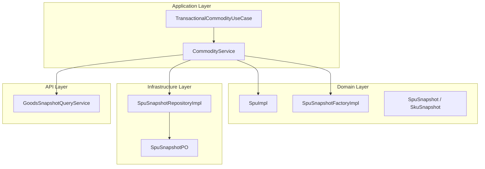
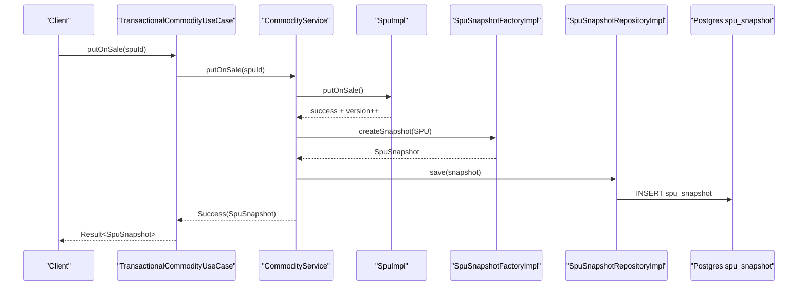
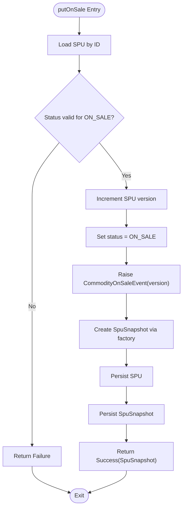
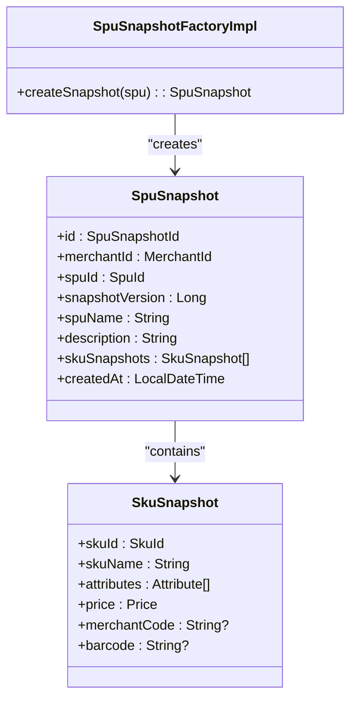
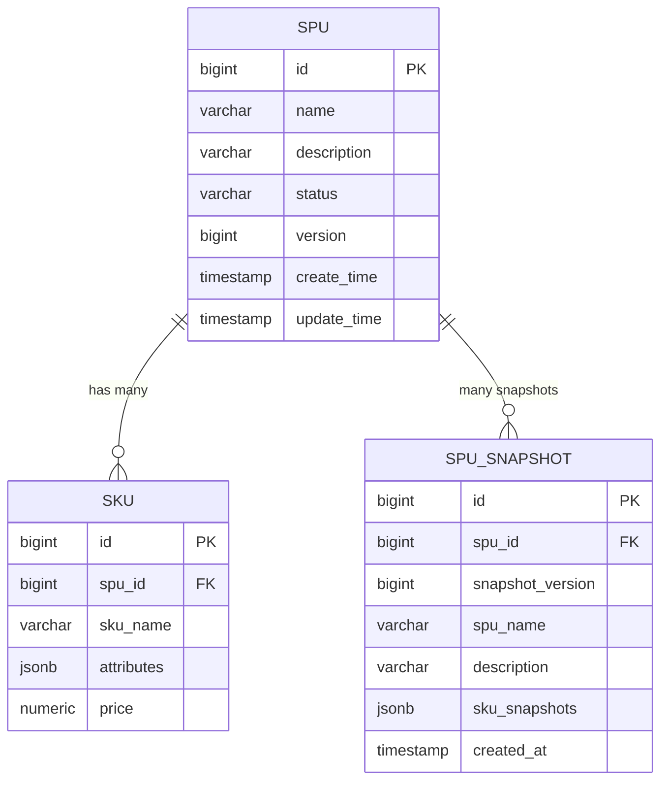
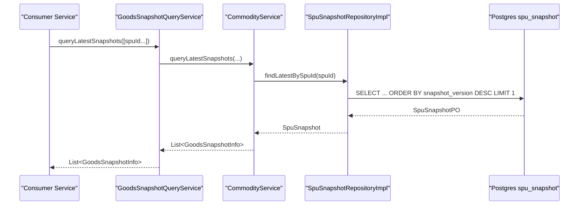
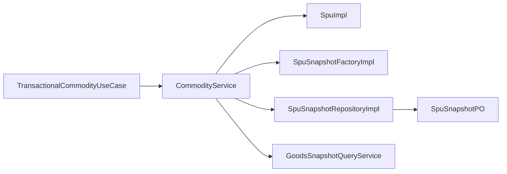

# On-Sale Workflow

<cite>
**Referenced Files in This Document**
- [CommodityService.kt](file://j-store-goods-application/src/main/kotlin/com/jstore/goods/service/CommodityService.kt)
- [SpuImpl.kt](file://j-store-goods-domain/src/main/kotlin/com/jstore/goods/domain/commodity/SpuImpl.kt)
- [SpuSnapshotFactory.kt](file://j-store-goods-domain/src/main/kotlin/com/jstore/goods/domain/commodity/snapshot/SpuSnapshotFactory.kt)
- [SpuSnapshot.kt](file://j-store-goods-domain/src/main/kotlin/com/jstore/goods/domain/commodity/snapshot/SpuSnapshot.kt)
- [SpuSnapshotRepositoryImpl.kt](file://j-store-goods-infrastructure/src/main/kotlin/com/jstore/goods/domain/commodity/SpuSnapshotRepositoryImpl.kt)
- [SpuSnapshotPO.kt](file://j-store-goods-infrastructure/src/main/kotlin/com/jstore/goods/domain/commodity/persistence/SpuSnapshotPO.kt)
- [GoodsSnapshotQueryService.kt](file://j-store-goods-api/src/main/kotlin/com/jstore/goods/api/GoodsSnapshotQueryService.kt)
- [TransactionalCommodityUseCase.kt](file://j-store-goods-boot/src/main/kotlin/com/jstore/goods/config/TransactionalCommodityUseCase.kt)
- [04-goods-spu-sku-snapshot.sql](file://docker/postgres/init/04-goods-spu-sku-snapshot.sql)
</cite>

## Table of Contents
1. [Introduction](#introduction)
2. [Project Structure](#project-structure)
3. [Core Components](#core-components)
4. [Architecture Overview](#architecture-overview)
5. [Detailed Component Analysis](#detailed-component-analysis)
6. [Dependency Analysis](#dependency-analysis)
7. [Performance Considerations](#performance-considerations)
8. [Troubleshooting Guide](#troubleshooting-guide)
9. [Conclusion](#conclusion)

## Introduction
This document explains the on-sale workflow that transitions a product (SPU) from OFF_SALE to ON_SALE and creates immutable snapshots for read-heavy operations and historical tracking. It focuses on:
- The putOnSale method implementation, including state transition, version increment, and snapshot creation
- How SpuSnapshotFactory builds immutable snapshots of SPU and SKU data
- Snapshot versioning tied to source SPU versions
- When snapshots are created and how other services consume them
- Practical examples of querying snapshots and benefits of snapshot-based architecture

## Project Structure
The on-sale workflow spans application, domain, infrastructure, and API layers:
- Application layer orchestrates use cases and transactions
- Domain layer enforces state transitions and emits events
- Infrastructure persists snapshots and maps between domain and persistence models
- API exposes snapshot queries for consumers

**Diagram sources**
- [CommodityService.kt](file://j-store-goods-application/src/main/kotlin/com/jstore/goods/service/CommodityService.kt)
- [SpuImpl.kt](file://j-store-goods-domain/src/main/kotlin/com/jstore/goods/domain/commodity/SpuImpl.kt)
- [SpuSnapshotFactory.kt](file://j-store-goods-domain/src/main/kotlin/com/jstore/goods/domain/commodity/snapshot/SpuSnapshotFactory.kt)
- [SpuSnapshot.kt](file://j-store-goods-domain/src/main/kotlin/com/jstore/goods/domain/commodity/snapshot/SpuSnapshot.kt)
- [SpuSnapshotRepositoryImpl.kt](file://j-store-goods-infrastructure/src/main/kotlin/com/jstore/goods/domain/commodity/SpuSnapshotRepositoryImpl.kt)
- [SpuSnapshotPO.kt](file://j-store-goods-infrastructure/src/main/kotlin/com/jstore/goods/domain/commodity/persistence/SpuSnapshotPO.kt)
- [GoodsSnapshotQueryService.kt](file://j-store-goods-api/src/main/kotlin/com/jstore/goods/api/GoodsSnapshotQueryService.kt)
- [TransactionalCommodityUseCase.kt](file://j-store-goods-boot/src/main/kotlin/com/jstore/goods/config/TransactionalCommodityUseCase.kt)

**Section sources**
- [CommodityService.kt](file://j-store-goods-application/src/main/kotlin/com/jstore/goods/service/CommodityService.kt)
- [TransactionalCommodityUseCase.kt](file://j-store-goods-boot/src/main/kotlin/com/jstore/goods/config/TransactionalCommodityUseCase.kt)

## Core Components
- CommodityService: Orchestrates putOnSale, creating a snapshot and persisting both SPU and snapshot within a transaction.
- SpuImpl: Implements state transitions (OFF_SALE → ON_SALE), increments version, and raises an on-sale event with the new snapshot version.
- SpuSnapshotFactoryImpl: Produces immutable SpuSnapshot and nested SkuSnapshot structures capturing current SPU and SKU state.
- SpuSnapshotRepositoryImpl: Persists snapshots and provides latest-by-SPU queries; maps JSONB payloads to domain objects.
- GoodsSnapshotQueryService: Exposes queryLatestSnapshots used by clients to fetch read-optimized snapshot data.

Key behaviors:
- putOnSale validates state, increments version, transitions status, emits event, creates snapshot, persists SPU and snapshot.
- Snapshots are immutable and versioned per SPU, enabling consistent reads and historical traceability.

**Section sources**
- [CommodityService.kt](file://j-store-goods-application/src/main/kotlin/com/jstore/goods/service/CommodityService.kt)
- [SpuImpl.kt](file://j-store-goods-domain/src/main/kotlin/com/jstore/goods/domain/commodity/SpuImpl.kt)
- [SpuSnapshotFactory.kt](file://j-store-goods-domain/src/main/kotlin/com/jstore/goods/domain/commodity/snapshot/SpuSnapshotFactory.kt)
- [SpuSnapshot.kt](file://j-store-goods-domain/src/main/kotlin/com/jstore/goods/domain/commodity/snapshot/SpuSnapshot.kt)
- [SpuSnapshotRepositoryImpl.kt](file://j-store-goods-infrastructure/src/main/kotlin/com/jstore/goods/domain/commodity/SpuSnapshotRepositoryImpl.kt)
- [GoodsSnapshotQueryService.kt](file://j-store-goods-api/src/main/kotlin/com/jstore/goods/api/GoodsSnapshotQueryService.kt)

## Architecture Overview
The on-sale flow is transactional and event-driven. State changes occur in the domain, while snapshots are created and persisted as part of the same unit of work. Consumers query snapshots via the API service for fast reads.

**Diagram sources**
- [TransactionalCommodityUseCase.kt](file://j-store-goods-boot/src/main/kotlin/com/jstore/goods/config/TransactionalCommodityUseCase.kt)
- [CommodityService.kt](file://j-store-goods-application/src/main/kotlin/com/jstore/goods/service/CommodityService.kt)
- [SpuImpl.kt](file://j-store-goods-domain/src/main/kotlin/com/jstore/goods/domain/commodity/SpuImpl.kt)
- [SpuSnapshotFactory.kt](file://j-store-goods-domain/src/main/kotlin/com/jstore/goods/domain/commodity/snapshot/SpuSnapshotFactory.kt)
- [SpuSnapshotRepositoryImpl.kt](file://j-store-goods-infrastructure/src/main/kotlin/com/jstore/goods/domain/commodity/SpuSnapshotRepositoryImpl.kt)
- [04-goods-spu-sku-snapshot.sql](file://docker/postgres/init/04-goods-spu-sku-snapshot.sql)

## Detailed Component Analysis

### putOnSale Implementation
- Validates SPU exists and is not already ON_SALE or DRAFT
- Increments SPU version and transitions status to ON_SALE
- Emits an on-sale event carrying the new snapshot version
- Creates an immutable snapshot using SpuSnapshotFactory
- Persists SPU and snapshot atomically within a transaction
- Returns the created snapshot to the caller

**Diagram sources**
- [CommodityService.kt](file://j-store-goods-application/src/main/kotlin/com/jstore/goods/service/CommodityService.kt)
- [SpuImpl.kt](file://j-store-goods-domain/src/main/kotlin/com/jstore/goods/domain/commodity/SpuImpl.kt)

**Section sources**
- [CommodityService.kt](file://j-store-goods-application/src/main/kotlin/com/jstore/goods/service/CommodityService.kt)
- [SpuImpl.kt](file://j-store-goods-domain/src/main/kotlin/com/jstore/goods/domain/commodity/SpuImpl.kt)

### Snapshot Creation and Immutability
- SpuSnapshotFactoryImpl constructs SpuSnapshot with:
  - Merchant and SPU identifiers
  - Snapshot version equal to SPU.version at creation time
  - Immutable copies of SPU name, description, and all SKUs
- Each SkuSnapshot captures skuId, skuName, attributes, price, merchantCode, barcode
- Snapshots are value objects (immutable) ensuring stable reads and auditability

**Diagram sources**
- [SpuSnapshotFactory.kt](file://j-store-goods-domain/src/main/kotlin/com/jstore/goods/domain/commodity/snapshot/SpuSnapshotFactory.kt)
- [SpuSnapshot.kt](file://j-store-goods-domain/src/main/kotlin/com/jstore/goods/domain/commodity/snapshot/SpuSnapshot.kt)

**Section sources**
- [SpuSnapshotFactory.kt](file://j-store-goods-domain/src/main/kotlin/com/jstore/goods/domain/commodity/snapshot/SpuSnapshotFactory.kt)
- [SpuSnapshot.kt](file://j-store-goods-domain/src/main/kotlin/com/jstore/goods/domain/commodity/snapshot/SpuSnapshot.kt)

### Version Management and Data Consistency
- SPU.version increments during putOnSale and mergeFromDraft
- Snapshot.snapshotVersion mirrors SPU.version at creation time
- Database enforces uniqueness on (spu_id, snapshot_version) to prevent duplicate versions
- Repository save is mandatory within a transaction to ensure atomicity of SPU and snapshot writes

**Diagram sources**
- [04-goods-spu-sku-snapshot.sql](file://docker/postgres/init/04-goods-spu-sku-snapshot.sql)
- [SpuSnapshotRepositoryImpl.kt](file://j-store-goods-infrastructure/src/main/kotlin/com/jstore/goods/domain/commodity/SpuSnapshotRepositoryImpl.kt)

**Section sources**
- [SpuImpl.kt](file://j-store-goods-domain/src/main/kotlin/com/jstore/goods/domain/commodity/SpuImpl.kt)
- [SpuSnapshotRepositoryImpl.kt](file://j-store-goods-infrastructure/src/main/kotlin/com/jstore/goods/domain/commodity/SpuSnapshotRepositoryImpl.kt)
- [04-goods-spu-sku-snapshot.sql](file://docker/postgres/init/04-goods-spu-sku-snapshot.sql)

### Snapshot Querying and Usage
- GoodsSnapshotQueryService exposes queryLatestSnapshots(spuIds) returning list of GoodsSnapshotInfo
- CommodityService implements this by mapping SpuSnapshot to DTOs for efficient reads
- Consumers can fetch latest snapshot per SPU to render product details without joining live SPU/SKU tables

**Diagram sources**
- [GoodsSnapshotQueryService.kt](file://j-store-goods-api/src/main/kotlin/com/jstore/goods/api/GoodsSnapshotQueryService.kt)
- [CommodityService.kt](file://j-store-goods-application/src/main/kotlin/com/jstore/goods/service/CommodityService.kt)
- [SpuSnapshotRepositoryImpl.kt](file://j-store-goods-infrastructure/src/main/kotlin/com/jstore/goods/domain/commodity/SpuSnapshotRepositoryImpl.kt)

**Section sources**
- [GoodsSnapshotQueryService.kt](file://j-store-goods-api/src/main/kotlin/com/jstore/goods/api/GoodsSnapshotQueryService.kt)
- [CommodityService.kt](file://j-store-goods-application/src/main/kotlin/com/jstore/goods/service/CommodityService.kt)
- [SpuSnapshotRepositoryImpl.kt](file://j-store-goods-infrastructure/src/main/kotlin/com/jstore/goods/domain/commodity/SpuSnapshotRepositoryImpl.kt)

### Relationship Between Source SPU and Snapshot Versions
- Each SPU has a monotonically increasing version
- A snapshot is created when:
  - An OFF_SALE SPU is put on sale (ON_SALE)
  - A draft copy is published back to an ON_SALE source (mergeFromDraft)
- Snapshot.snapshotVersion equals the SPU.version at the moment of creation
- Other services reference snapshotVersion to ensure consistency with order items and pricing history

**Section sources**
- [SpuImpl.kt](file://j-store-goods-domain/src/main/kotlin/com/jstore/goods/domain/commodity/SpuImpl.kt)
- [CommodityService.kt](file://j-store-goods-application/src/main/kotlin/com/jstore/goods/service/CommodityService.kt)
- [04-goods-spu-sku-snapshot.sql](file://docker/postgres/init/04-goods-spu-sku-snapshot.sql)

### Practical Examples of Snapshot Querying
- Fetch latest snapshot for a single SPU:
  - Use GoodsSnapshotQueryService.queryLatestSnapshots(listOf(spuId))
  - Returns GoodsSnapshotInfo with spuName and skuSnapshots for rendering
- Historical lookup by version:
  - Use repository findBySpuIdAndVersion(spuId, version) to retrieve exact snapshot at a given version
- Benefits:
  - Read performance: no joins to live SPU/SKU tables
  - Historical accuracy: prices and attributes remain unchanged after snapshot creation

**Section sources**
- [GoodsSnapshotQueryService.kt](file://j-store-goods-api/src/main/kotlin/com/jstore/goods/api/GoodsSnapshotQueryService.kt)
- [SpuSnapshotRepositoryImpl.kt](file://j-store-goods-infrastructure/src/main/kotlin/com/jstore/goods/domain/commodity/SpuSnapshotRepositoryImpl.kt)

## Dependency Analysis
- CommodityService depends on:
  - SpuRepository (for loading/updating SPU)
  - SpuSnapshotFactory (for snapshot creation)
  - SpuSnapshotRepository (for persistence)
  - DomainEventPublisher (for emitting events)
- TransactionalCommodityUseCase wraps write and read operations with appropriate transaction modes
- SpuSnapshotRepositoryImpl depends on JPA repository and JSON serialization utilities

**Diagram sources**
- [TransactionalCommodityUseCase.kt](file://j-store-goods-boot/src/main/kotlin/com/jstore/goods/config/TransactionalCommodityUseCase.kt)
- [CommodityService.kt](file://j-store-goods-application/src/main/kotlin/com/jstore/goods/service/CommodityService.kt)
- [SpuSnapshotRepositoryImpl.kt](file://j-store-goods-infrastructure/src/main/kotlin/com/jstore/goods/domain/commodity/SpuSnapshotRepositoryImpl.kt)
- [SpuSnapshotPO.kt](file://j-store-goods-infrastructure/src/main/kotlin/com/jstore/goods/domain/commodity/persistence/SpuSnapshotPO.kt)

**Section sources**
- [TransactionalCommodityUseCase.kt](file://j-store-goods-boot/src/main/kotlin/com/jstore/goods/config/TransactionalCommodityUseCase.kt)
- [CommodityService.kt](file://j-store-goods-application/src/main/kotlin/com/jstore/goods/service/CommodityService.kt)
- [SpuSnapshotRepositoryImpl.kt](file://j-store-goods-infrastructure/src/main/kotlin/com/jstore/goods/domain/commodity/SpuSnapshotRepositoryImpl.kt)

## Performance Considerations
- Snapshot-based reads avoid expensive joins across SPU/SKU tables
- Latest snapshot retrieval uses indexed ordering by snapshot_version descending
- JSONB storage for sku_snapshots reduces schema complexity and supports flexible attribute sets
- Transactions ensure atomic updates, preventing inconsistent states between SPU and snapshots

[No sources needed since this section provides general guidance]

## Troubleshooting Guide
Common issues and resolutions:
- Attempting to edit an ON_SALE SPU directly is rejected; use draft workflow instead
- Duplicate snapshot versions are prevented by unique constraint on (spu_id, snapshot_version)
- Missing snapshots indicate failed persistence; verify transaction boundaries and mandatory propagation
- Snapshot mismatch errors occur if consumers do not align with snapshotVersion; always validate version before processing

**Section sources**
- [CommodityService.kt](file://j-store-goods-application/src/main/kotlin/com/jstore/goods/service/CommodityService.kt)
- [04-goods-spu-sku-snapshot.sql](file://docker/postgres/init/04-goods-spu-sku-snapshot.sql)
- [SpuSnapshotRepositoryImpl.kt](file://j-store-goods-infrastructure/src/main/kotlin/com/jstore/goods/domain/commodity/SpuSnapshotRepositoryImpl.kt)

## Conclusion
The on-sale workflow ensures reliable state transitions and immutable snapshots for high-performance reads and historical accuracy. By tying snapshot versions to SPU versions and enforcing database constraints, the system maintains data consistency across services. Consumers benefit from fast, predictable queries against snapshots while preserving the ability to reconstruct historical product states.