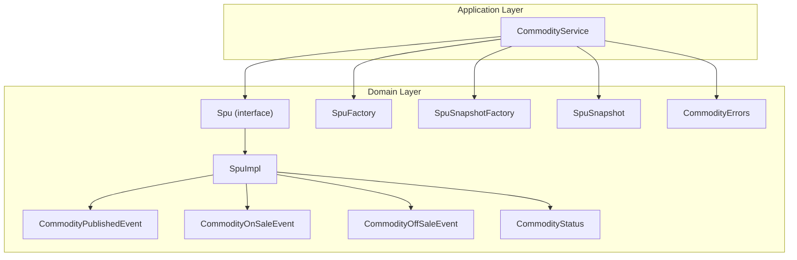
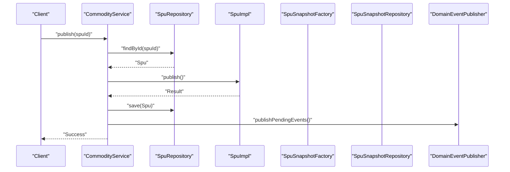
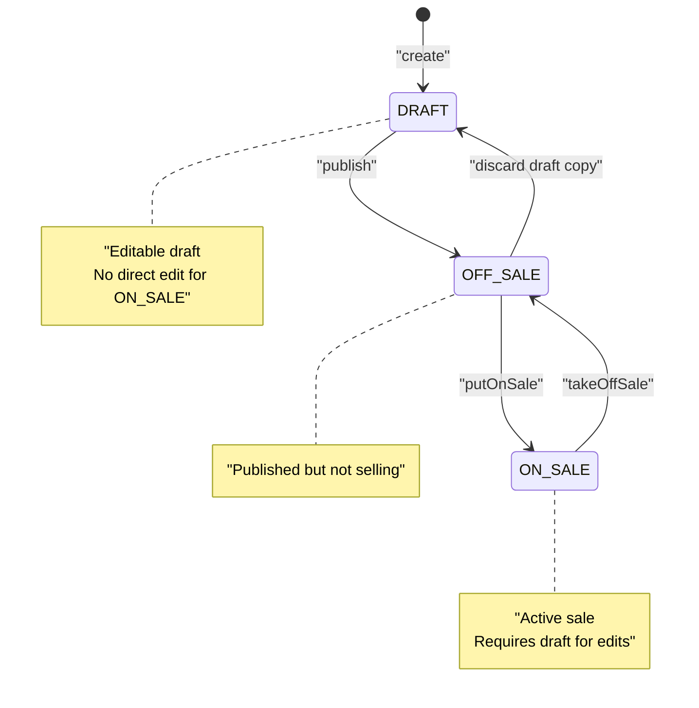
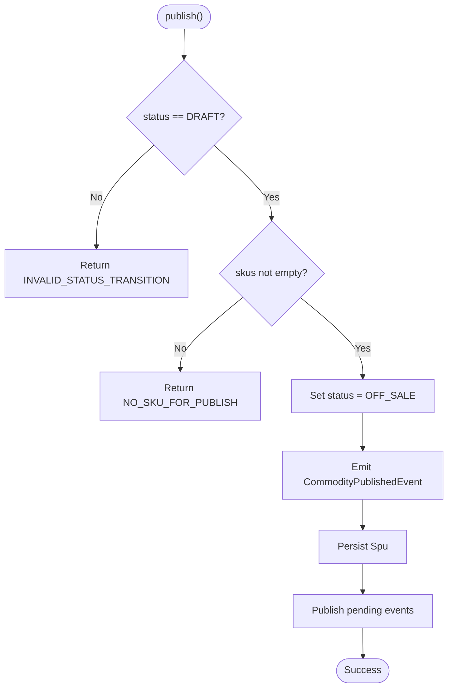
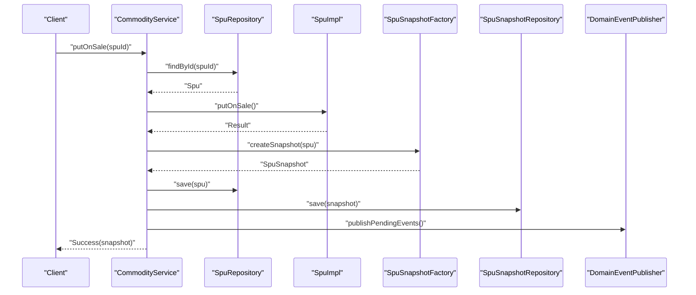
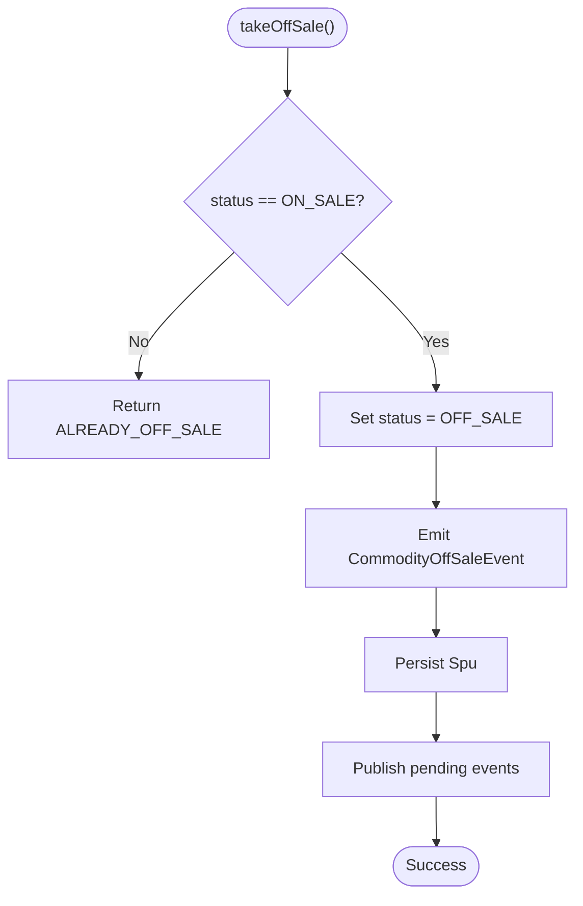
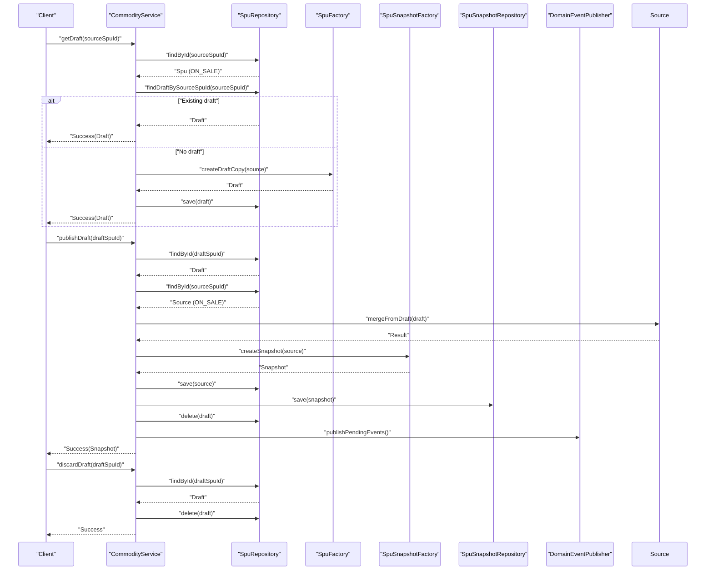
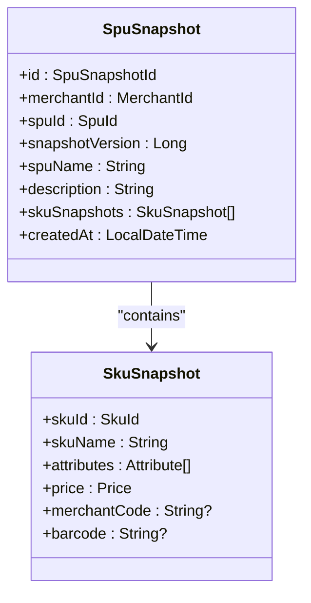
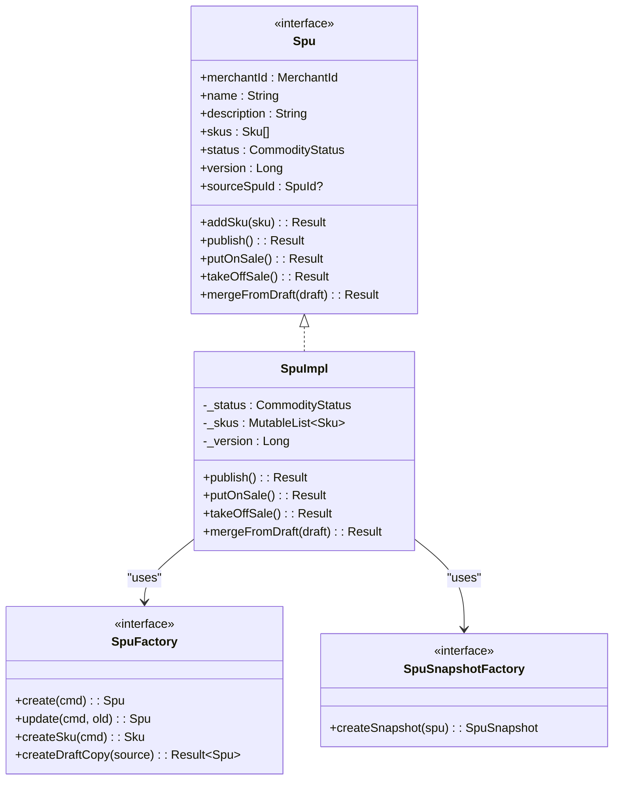
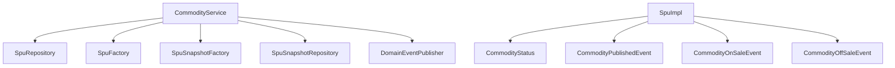

# Product Lifecycle Management

<cite>
**Referenced Files in This Document**
- [CommodityService.kt](file://j-store-goods-application/src/main/kotlin/com/jstore/goods/service/CommodityService.kt)
- [Spu.kt](file://j-store-goods-domain/src/main/kotlin/com/jstore/goods/domain/commodity/Spu.kt)
- [SpuImpl.kt](file://j-store-goods-domain/src/main/kotlin/com/jstore/goods/domain/commodity/SpuImpl.kt)
- [CommodityStatus.kt](file://j-store-goods-domain/src/main/kotlin/com/jstore/goods/domain/commodity/CommodityStatus.kt)
- [SpuFactory.kt](file://j-store-goods-domain/src/main/kotlin/com/jstore/goods/domain/commodity/SpuFactory.kt)
- [SpuSnapshot.kt](file://j-store-goods-domain/src/main/kotlin/com/jstore/goods/domain/commodity/snapshot/SpuSnapshot.kt)
- [SpuSnapshotFactory.kt](file://j-store-goods-domain/src/main/kotlin/com/jstore/goods/domain/commodity/snapshot/SpuSnapshotFactory.kt)
- [CommodityErrors.kt](file://j-store-goods-domain/src/main/kotlin/com/jstore/goods/domain/commodity/CommodityErrors.kt)
- [CommodityPublishedEvent.kt](file://j-store-goods-domain/src/main/kotlin/com/jstore/goods/domain/commodity/event/CommodityPublishedEvent.kt)
- [CommodityOnSaleEvent.kt](file://j-store-goods-domain/src/main/kotlin/com/jstore/goods/domain/commodity/event/CommodityOnSaleEvent.kt)
- [CommodityOffSaleEvent.kt](file://j-store-goods-domain/src/main/kotlin/com/jstore/goods/domain/commodity/event/CommodityOffSaleEvent.kt)
- [CommodityServiceDraftFlowTest.kt](file://j-store-goods-application/src/test/kotlin/com/jstore/goods/service/CommodityServiceDraftFlowTest.kt)
</cite>

## Table of Contents
1. [Introduction](#introduction)
2. [Project Structure](#project-structure)
3. [Core Components](#core-components)
4. [Architecture Overview](#architecture-overview)
5. [Detailed Component Analysis](#detailed-component-analysis)
6. [Dependency Analysis](#dependency-analysis)
7. [Performance Considerations](#performance-considerations)
8. [Troubleshooting Guide](#troubleshooting-guide)
9. [Conclusion](#conclusion)

## Introduction
This document explains the product lifecycle management for SPU (Standard Product Unit) entities, focusing on publishing workflows and status transitions. It covers:
- Publishing a draft product to OFF_SALE via publish
- Putting an OFF_SALE product ON_SALE via putOnSale with snapshot creation
- Removing a product from sale via takeOffSale
- The draft workflow: getDraft, publishDraft, discardDraft
- Status transition rules, business constraints, and snapshot versioning

The implementation uses a domain-driven design with clear state transitions enforced by the aggregate and application service orchestration.

## Project Structure
The product lifecycle spans the goods domain and application layers:
- Domain layer defines the Spu aggregate, status enum, factories, snapshots, and events
- Application layer composes use cases through CommodityService
- Infrastructure provides persistence abstractions used by repositories (not detailed here)

**Diagram sources**
- [CommodityService.kt](file://j-store-goods-application/src/main/kotlin/com/jstore/goods/service/CommodityService.kt)
- [Spu.kt](file://j-store-goods-domain/src/main/kotlin/com/jstore/goods/domain/commodity/Spu.kt)
- [SpuImpl.kt](file://j-store-goods-domain/src/main/kotlin/com/jstore/goods/domain/commodity/SpuImpl.kt)
- [SpuFactory.kt](file://j-store-goods-domain/src/main/kotlin/com/jstore/goods/domain/commodity/SpuFactory.kt)
- [SpuSnapshotFactory.kt](file://j-store-goods-domain/src/main/kotlin/com/jstore/goods/domain/commodity/snapshot/SpuSnapshotFactory.kt)
- [SpuSnapshot.kt](file://j-store-goods-domain/src/main/kotlin/com/jstore/goods/domain/commodity/snapshot/SpuSnapshot.kt)
- [CommodityStatus.kt](file://j-store-goods-domain/src/main/kotlin/com/jstore/goods/domain/commodity/CommodityStatus.kt)
- [CommodityErrors.kt](file://j-store-goods-domain/src/main/kotlin/com/jstore/goods/domain/commodity/CommodityErrors.kt)
- [CommodityPublishedEvent.kt](file://j-store-goods-domain/src/main/kotlin/com/jstore/goods/domain/commodity/event/CommodityPublishedEvent.kt)
- [CommodityOnSaleEvent.kt](file://j-store-goods-domain/src/main/kotlin/com/jstore/goods/domain/commodity/event/CommodityOnSaleEvent.kt)
- [CommodityOffSaleEvent.kt](file://j-store-goods-domain/src/main/kotlin/com/jstore/goods/domain/commodity/event/CommodityOffSaleEvent.kt)

**Section sources**
- [CommodityService.kt](file://j-store-goods-application/src/main/kotlin/com/jstore/goods/service/CommodityService.kt)
- [Spu.kt](file://j-store-goods-domain/src/main/kotlin/com/jstore/goods/domain/commodity/Spu.kt)
- [SpuImpl.kt](file://j-store-goods-domain/src/main/kotlin/com/jstore/goods/domain/commodity/SpuImpl.kt)
- [SpuFactory.kt](file://j-store-goods-domain/src/main/kotlin/com/jstore/goods/domain/commodity/SpuFactory.kt)
- [SpuSnapshotFactory.kt](file://j-store-goods-domain/src/main/kotlin/com/jstore/goods/domain/commodity/snapshot/SpuSnapshotFactory.kt)
- [SpuSnapshot.kt](file://j-store-goods-domain/src/main/kotlin/com/jstore/goods/domain/commodity/snapshot/SpuSnapshot.kt)
- [CommodityStatus.kt](file://j-store-goods-domain/src/main/kotlin/com/jstore/goods/domain/commodity/CommodityStatus.kt)
- [CommodityErrors.kt](file://j-store-goods-domain/src/main/kotlin/com/jstore/goods/domain/commodity/CommodityErrors.kt)
- [CommodityPublishedEvent.kt](file://j-store-goods-domain/src/main/kotlin/com/jstore/goods/domain/commodity/event/CommodityPublishedEvent.kt)
- [CommodityOnSaleEvent.kt](file://j-store-goods-domain/src/main/kotlin/com/jstore/goods/domain/commodity/event/CommodityOnSaleEvent.kt)
- [CommodityOffSaleEvent.kt](file://j-store-goods-domain/src/main/kotlin/com/jstore/goods/domain/commodity/event/CommodityOffSaleEvent.kt)

## Core Components
- Spu interface and SpuImpl aggregate define lifecycle methods and enforce state transitions
- CommodityService orchestrates repository access, domain operations, snapshot creation, and event publishing
- SpuFactory creates new SPU instances, updates existing ones, and produces draft copies
- SpuSnapshotFactory creates immutable snapshots capturing current product state and SKU details
- Events model lifecycle changes: published, on-sale, off-sale
- Errors encapsulate business rule violations

Key responsibilities:
- Enforce valid transitions between DRAFT, OFF_SALE, and ON_SALE
- Prevent direct edits of ON_SALE products; require draft workflow
- Create snapshots when moving to ON_SALE or merging drafts
- Publish domain events after successful transitions

**Section sources**
- [Spu.kt](file://j-store-goods-domain/src/main/kotlin/com/jstore/goods/domain/commodity/Spu.kt)
- [SpuImpl.kt](file://j-store-goods-domain/src/main/kotlin/com/jstore/goods/domain/commodity/SpuImpl.kt)
- [CommodityService.kt](file://j-store-goods-application/src/main/kotlin/com/jstore/goods/service/CommodityService.kt)
- [SpuFactory.kt](file://j-store-goods-domain/src/main/kotlin/com/jstore/goods/domain/commodity/SpuFactory.kt)
- [SpuSnapshotFactory.kt](file://j-store-goods-domain/src/main/kotlin/com/jstore/goods/domain/commodity/snapshot/SpuSnapshotFactory.kt)
- [SpuSnapshot.kt](file://j-store-goods-domain/src/main/kotlin/com/jstore/goods/domain/commodity/snapshot/SpuSnapshot.kt)
- [CommodityErrors.kt](file://j-store-goods-domain/src/main/kotlin/com/jstore/goods/domain/commodity/CommodityErrors.kt)

## Architecture Overview
The lifecycle is implemented as a layered architecture:
- Application service coordinates commands and domain logic
- Domain aggregate enforces business rules and emits events
- Factories create consistent objects and snapshots
- Repositories persist aggregates and snapshots

**Diagram sources**
- [CommodityService.kt](file://j-store-goods-application/src/main/kotlin/com/jstore/goods/service/CommodityService.kt)
- [SpuImpl.kt](file://j-store-goods-domain/src/main/kotlin/com/jstore/goods/domain/commodity/SpuImpl.kt)

## Detailed Component Analysis

### Status Transitions and Business Rules
Valid transitions:
- DRAFT → OFF_SALE via publish
- OFF_SALE → ON_SALE via putOnSale
- ON_SALE → OFF_SALE via takeOffSale

Business rules:
- Only DRAFT can be published; must have at least one SKU
- Draft cannot go directly to ON_SALE; must publish first
- Already ON_SALE cannot be put on sale again
- Only ON_SALE can be taken off sale
- Direct editing of ON_SALE is rejected; use draft workflow

**Diagram sources**
- [CommodityStatus.kt](file://j-store-goods-domain/src/main/kotlin/com/jstore/goods/domain/commodity/CommodityStatus.kt)
- [SpuImpl.kt](file://j-store-goods-domain/src/main/kotlin/com/jstore/goods/domain/commodity/SpuImpl.kt)
- [CommodityErrors.kt](file://j-store-goods-domain/src/main/kotlin/com/jstore/goods/domain/commodity/CommodityErrors.kt)

**Section sources**
- [CommodityStatus.kt](file://j-store-goods-domain/src/main/kotlin/com/jstore/goods/domain/commodity/CommodityStatus.kt)
- [SpuImpl.kt](file://j-store-goods-domain/src/main/kotlin/com/jstore/goods/domain/commodity/SpuImpl.kt)
- [CommodityErrors.kt](file://j-store-goods-domain/src/main/kotlin/com/jstore/goods/domain/commodity/CommodityErrors.kt)

### Publish Workflow: DRAFT → OFF_SALE
- Validates current status is DRAFT
- Ensures at least one SKU exists
- Updates status to OFF_SALE
- Emits CommodityPublishedEvent
- Persists changes and publishes pending events

**Diagram sources**
- [SpuImpl.kt](file://j-store-goods-domain/src/main/kotlin/com/jstore/goods/domain/commodity/SpuImpl.kt)
- [CommodityService.kt](file://j-store-goods-application/src/main/kotlin/com/jstore/goods/service/CommodityService.kt)
- [CommodityErrors.kt](file://j-store-goods-domain/src/main/kotlin/com/jstore/goods/domain/commodity/CommodityErrors.kt)

**Section sources**
- [SpuImpl.kt](file://j-store-goods-domain/src/main/kotlin/com/jstore/goods/domain/commodity/SpuImpl.kt)
- [CommodityService.kt](file://j-store-goods-application/src/main/kotlin/com/jstore/goods/service/CommodityService.kt)
- [CommodityErrors.kt](file://j-store-goods-domain/src/main/kotlin/com/jstore/goods/domain/commodity/CommodityErrors.kt)
- [CommodityPublishedEvent.kt](file://j-store-goods-domain/src/main/kotlin/com/jstore/goods/domain/commodity/event/CommodityPublishedEvent.kt)

### Put On Sale: OFF_SALE → ON_SALE with Snapshot Creation
- Validates current status is OFF_SALE
- Increments version
- Updates status to ON_SALE
- Creates immutable snapshot via SpuSnapshotFactory
- Persists both Spu and snapshot
- Emits CommodityOnSaleEvent

**Diagram sources**
- [CommodityService.kt](file://j-store-goods-application/src/main/kotlin/com/jstore/goods/service/CommodityService.kt)
- [SpuImpl.kt](file://j-store-goods-domain/src/main/kotlin/com/jstore/goods/domain/commodity/SpuImpl.kt)
- [SpuSnapshotFactory.kt](file://j-store-goods-domain/src/main/kotlin/com/jstore/goods/domain/commodity/snapshot/SpuSnapshotFactory.kt)
- [SpuSnapshot.kt](file://j-store-goods-domain/src/main/kotlin/com/jstore/goods/domain/commodity/snapshot/SpuSnapshot.kt)

**Section sources**
- [CommodityService.kt](file://j-store-goods-application/src/main/kotlin/com/jstore/goods/service/CommodityService.kt)
- [SpuImpl.kt](file://j-store-goods-domain/src/main/kotlin/com/jstore/goods/domain/commodity/SpuImpl.kt)
- [SpuSnapshotFactory.kt](file://j-store-goods-domain/src/main/kotlin/com/jstore/goods/domain/commodity/snapshot/SpuSnapshotFactory.kt)
- [SpuSnapshot.kt](file://j-store-goods-domain/src/main/kotlin/com/jstore/goods/domain/commodity/snapshot/SpuSnapshot.kt)
- [CommodityOnSaleEvent.kt](file://j-store-goods-domain/src/main/kotlin/com/jstore/goods/domain/commodity/event/CommodityOnSaleEvent.kt)

### Take Off Sale: ON_SALE → OFF_SALE
- Validates current status is ON_SALE
- Updates status to OFF_SALE
- Emits CommodityOffSaleEvent
- Persists changes and publishes pending events

**Diagram sources**
- [SpuImpl.kt](file://j-store-goods-domain/src/main/kotlin/com/jstore/goods/domain/commodity/SpuImpl.kt)
- [CommodityService.kt](file://j-store-goods-application/src/main/kotlin/com/jstore/goods/service/CommodityService.kt)
- [CommodityErrors.kt](file://j-store-goods-domain/src/main/kotlin/com/jstore/goods/domain/commodity/CommodityErrors.kt)

**Section sources**
- [SpuImpl.kt](file://j-store-goods-domain/src/main/kotlin/com/jstore/goods/domain/commodity/SpuImpl.kt)
- [CommodityService.kt](file://j-store-goods-application/src/main/kotlin/com/jstore/goods/service/CommodityService.kt)
- [CommodityErrors.kt](file://j-store-goods-domain/src/main/kotlin/com/jstore/goods/domain/commodity/CommodityErrors.kt)
- [CommodityOffSaleEvent.kt](file://j-store-goods-domain/src/main/kotlin/com/jstore/goods/domain/commodity/event/CommodityOffSaleEvent.kt)

### Draft Workflow: Editable Copies and Merge
- getDraft: For ON_SALE products, returns existing draft if present; otherwise creates a draft copy with sourceSpuId set
- publishDraft: Merges draft content into source, increments version, creates snapshot, deletes draft, emits events
- discardDraft: Deletes draft without affecting source

**Diagram sources**
- [CommodityService.kt](file://j-store-goods-application/src/main/kotlin/com/jstore/goods/service/CommodityService.kt)
- [SpuFactory.kt](file://j-store-goods-domain/src/main/kotlin/com/jstore/goods/domain/commodity/SpuFactory.kt)
- [SpuImpl.kt](file://j-store-goods-domain/src/main/kotlin/com/jstore/goods/domain/commodity/SpuImpl.kt)
- [SpuSnapshotFactory.kt](file://j-store-goods-domain/src/main/kotlin/com/jstore/goods/domain/commodity/snapshot/SpuSnapshotFactory.kt)

**Section sources**
- [CommodityService.kt](file://j-store-goods-application/src/main/kotlin/com/jstore/goods/service/CommodityService.kt)
- [SpuFactory.kt](file://j-store-goods-domain/src/main/kotlin/com/jstore/goods/domain/commodity/SpuFactory.kt)
- [SpuImpl.kt](file://j-store-goods-domain/src/main/kotlin/com/jstore/goods/domain/commodity/SpuImpl.kt)
- [SpuSnapshotFactory.kt](file://j-store-goods-domain/src/main/kotlin/com/jstore/goods/domain/commodity/snapshot/SpuSnapshotFactory.kt)
- [CommodityErrors.kt](file://j-store-goods-domain/src/main/kotlin/com/jstore/goods/domain/commodity/CommodityErrors.kt)

### Snapshot Model and Versioning
- SpuSnapshot captures merchant, spuId, snapshotVersion, name, description, and SKU snapshots
- SkuSnapshot includes skuId, skuName, attributes, price, and optional identifiers
- Snapshot creation occurs when moving to ON_SALE or merging drafts
- Version increments ensure traceability across changes

**Diagram sources**
- [SpuSnapshot.kt](file://j-store-goods-domain/src/main/kotlin/com/jstore/goods/domain/commodity/snapshot/SpuSnapshot.kt)

**Section sources**
- [SpuSnapshot.kt](file://j-store-goods-domain/src/main/kotlin/com/jstore/goods/domain/commodity/snapshot/SpuSnapshot.kt)
- [SpuSnapshotFactory.kt](file://j-store-goods-domain/src/main/kotlin/com/jstore/goods/domain/commodity/snapshot/SpuSnapshotFactory.kt)

### Class Relationships

**Diagram sources**
- [Spu.kt](file://j-store-goods-domain/src/main/kotlin/com/jstore/goods/domain/commodity/Spu.kt)
- [SpuImpl.kt](file://j-store-goods-domain/src/main/kotlin/com/jstore/goods/domain/commodity/SpuImpl.kt)
- [SpuFactory.kt](file://j-store-goods-domain/src/main/kotlin/com/jstore/goods/domain/commodity/SpuFactory.kt)
- [SpuSnapshotFactory.kt](file://j-store-goods-domain/src/main/kotlin/com/jstore/goods/domain/commodity/snapshot/SpuSnapshotFactory.kt)

**Section sources**
- [Spu.kt](file://j-store-goods-domain/src/main/kotlin/com/jstore/goods/domain/commodity/Spu.kt)
- [SpuImpl.kt](file://j-store-goods-domain/src/main/kotlin/com/jstore/goods/domain/commodity/SpuImpl.kt)
- [SpuFactory.kt](file://j-store-goods-domain/src/main/kotlin/com/jstore/goods/domain/commodity/SpuFactory.kt)
- [SpuSnapshotFactory.kt](file://j-store-goods-domain/src/main/kotlin/com/jstore/goods/domain/commodity/snapshot/SpuSnapshotFactory.kt)

## Dependency Analysis
- CommodityService depends on SpuRepository, SpuFactory, SpuSnapshotFactory, SpuSnapshotRepository, GoodsStyleRepository, and DomainEventPublisher
- SpuImpl depends on CommodityStatus and emits domain events
- SpuFactory and SpuSnapshotFactory provide object construction and snapshot creation
- Tests validate behavior including draft flow and error conditions

**Diagram sources**
- [CommodityService.kt](file://j-store-goods-application/src/main/kotlin/com/jstore/goods/service/CommodityService.kt)
- [SpuImpl.kt](file://j-store-goods-domain/src/main/kotlin/com/jstore/goods/domain/commodity/SpuImpl.kt)
- [SpuFactory.kt](file://j-store-goods-domain/src/main/kotlin/com/jstore/goods/domain/commodity/SpuFactory.kt)
- [SpuSnapshotFactory.kt](file://j-store-goods-domain/src/main/kotlin/com/jstore/goods/domain/commodity/snapshot/SpuSnapshotFactory.kt)

**Section sources**
- [CommodityService.kt](file://j-store-goods-application/src/main/kotlin/com/jstore/goods/service/CommodityService.kt)
- [SpuImpl.kt](file://j-store-goods-domain/src/main/kotlin/com/jstore/goods/domain/commodity/SpuImpl.kt)
- [SpuFactory.kt](file://j-store-goods-domain/src/main/kotlin/com/jstore/goods/domain/commodity/SpuFactory.kt)
- [SpuSnapshotFactory.kt](file://j-store-goods-domain/src/main/kotlin/com/jstore/goods/domain/commodity/snapshot/SpuSnapshotFactory.kt)

## Performance Considerations
- Snapshot creation is O(n) over SKUs; keep SKU lists reasonable
- Version increment ensures consistency; avoid excessive merges
- Event publishing should be asynchronous in production to reduce latency
- Repository queries are minimal per operation; consider caching for read-heavy scenarios

[No sources needed since this section provides general guidance]

## Troubleshooting Guide
Common errors and resolutions:
- INVALID_STATUS_TRANSITION: Ensure correct state before calling lifecycle methods
- NO_SKU_FOR_PUBLISH / DRAFT_NO_SKU_FOR_PUBLISH: Add at least one SKU before publishing
- ALREADY_ON_SALE / ALREADY_OFF_SALE: Verify current status before transitions
- ON_SALE_DIRECT_EDIT_REJECTED: Use draft workflow to modify ON_SALE products
- NOT_A_DRAFT_COPY: Confirm the SPU has sourceSpuId set for draft operations
- ONLY_ON_SALE_NEEDS_DRAFT: Only ON_SALE products require draft workflow

Validation references:
- Status checks and transitions in SpuImpl
- Error definitions in CommodityErrors
- Test coverage in CommodityServiceDraftFlowTest

**Section sources**
- [SpuImpl.kt](file://j-store-goods-domain/src/main/kotlin/com/jstore/goods/domain/commodity/SpuImpl.kt)
- [CommodityErrors.kt](file://j-store-goods-domain/src/main/kotlin/com/jstore/goods/domain/commodity/CommodityErrors.kt)
- [CommodityServiceDraftFlowTest.kt](file://j-store-goods-application/src/test/kotlin/com/jstore/goods/service/CommodityServiceDraftFlowTest.kt)

## Conclusion
The product lifecycle management enforces robust state transitions, prevents unsafe edits to active products, and maintains historical integrity through snapshots. The draft workflow enables safe iteration on ON_SALE products while preserving auditability. Clear error handling and comprehensive tests ensure reliability and maintainability.

[No sources needed since this section summarizes without analyzing specific files]