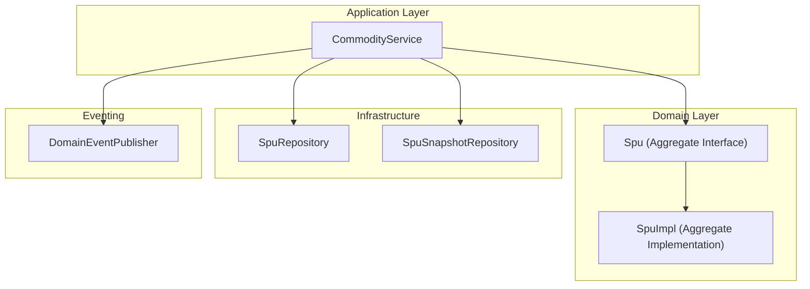
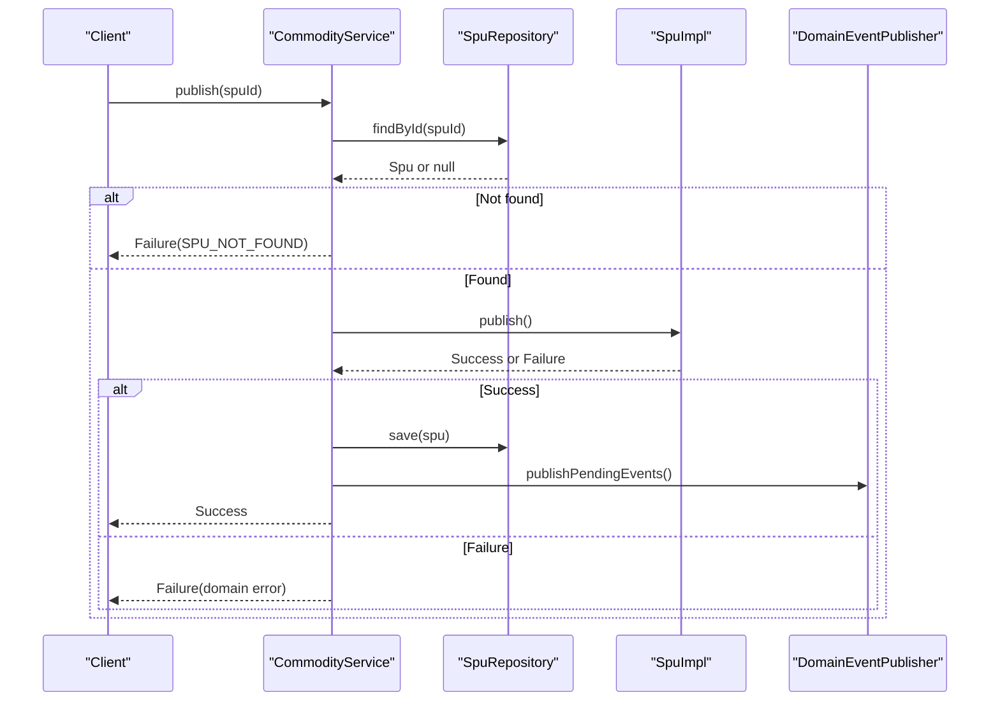
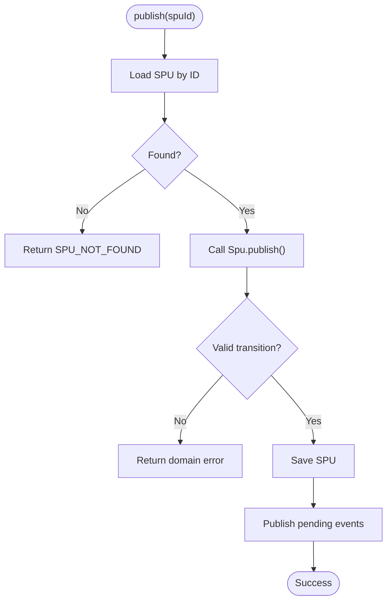
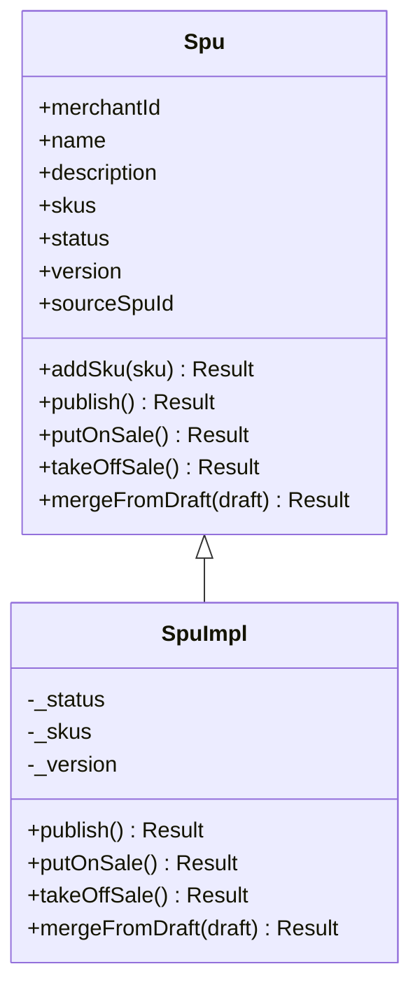
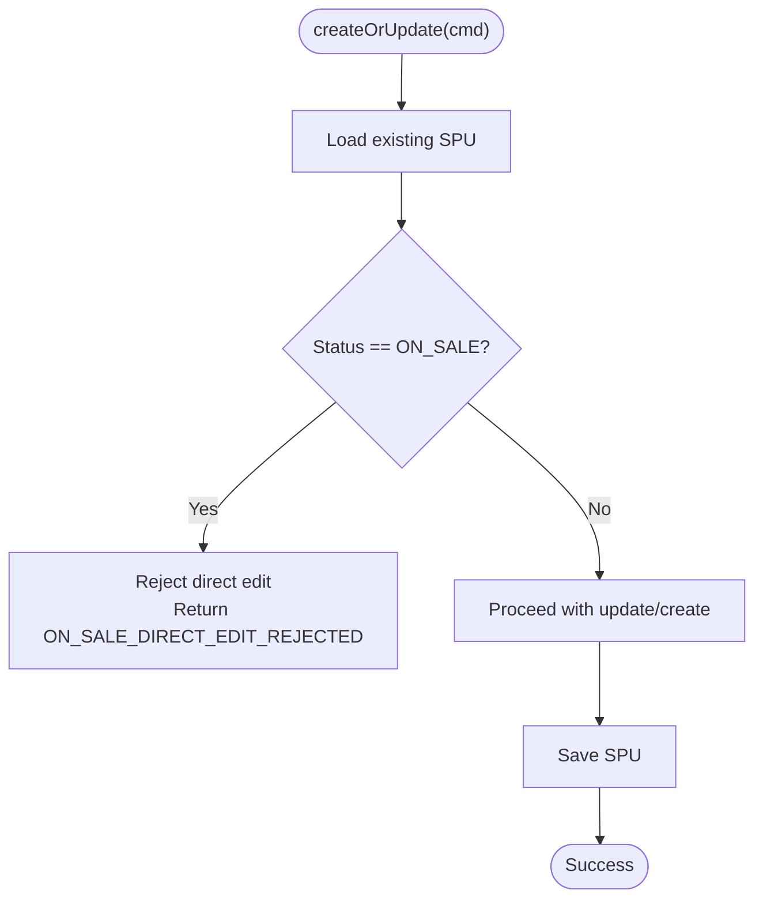
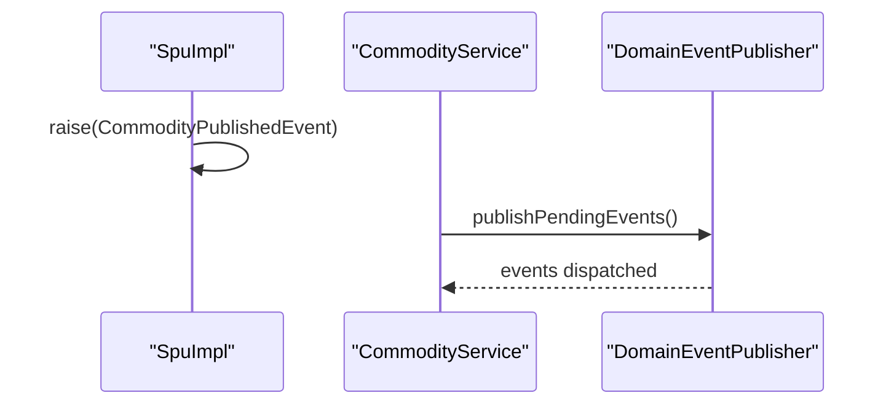
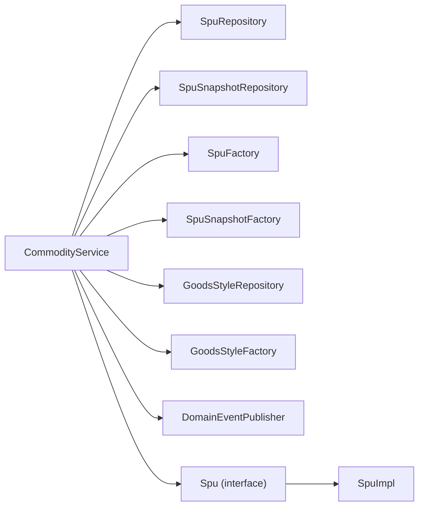

# Publish Workflow

<cite>
**Referenced Files in This Document**
- [CommodityService.kt](file://j-store-goods-application/src/main/kotlin/com/jstore/goods/service/CommodityService.kt)
- [Spu.kt](file://j-store-goods-domain/src/main/kotlin/com/jstore/goods/domain/commodity/Spu.kt)
- [SpuImpl.kt](file://j-store-goods-domain/src/main/kotlin/com/jstore/goods/domain/commodity/SpuImpl.kt)
- [CommodityErrors.kt](file://j-store-goods-domain/src/main/kotlin/com/jstore/goods/domain/commodity/CommodityErrors.kt)
- [CommodityStatus.kt](file://j-store-goods-domain/src/main/kotlin/com/jstore/goods/domain/commodity/CommodityStatus.kt)
</cite>

## Table of Contents
1. [Introduction](#introduction)
2. [Project Structure](#project-structure)
3. [Core Components](#core-components)
4. [Architecture Overview](#architecture-overview)
5. [Detailed Component Analysis](#detailed-component-analysis)
6. [Dependency Analysis](#dependency-analysis)
7. [Performance Considerations](#performance-considerations)
8. [Troubleshooting Guide](#troubleshooting-guide)
9. [Conclusion](#conclusion)

## Introduction
This document explains the product publish workflow that transitions a product (SPU) from DRAFT to OFF_SALE, and how the system enforces draft-only modifications for ON_SALE products. It covers:
- The publish method implementation in the application service
- Validation rules and status transition enforcement in the domain
- Event publishing during publish operations
- Business rules preventing direct editing of ON_SALE products
- Error handling patterns such as SPU_NOT_FOUND
- State machine transitions and downstream event impact

## Project Structure
The publish workflow spans the goods application layer and the goods domain layer:
- Application service orchestrates repository access, domain methods, snapshot creation (for on-sale), and event publishing
- Domain aggregate encapsulates state transitions, validation, and raises domain events

**Diagram sources**
- [CommodityService.kt:18-26](file://j-store-goods-application/src/main/kotlin/com/jstore/goods/service/CommodityService.kt#L18-L26)
- [Spu.kt:16-52](file://j-store-goods-domain/src/main/kotlin/com/jstore/goods/domain/commodity/Spu.kt#L16-L52)
- [SpuImpl.kt:12-21](file://j-store-goods-domain/src/main/kotlin/com/jstore/goods/domain/commodity/SpuImpl.kt#L12-L21)

**Section sources**
- [CommodityService.kt:18-26](file://j-store-goods-application/src/main/kotlin/com/jstore/goods/service/CommodityService.kt#L18-L26)
- [Spu.kt:16-52](file://j-store-goods-domain/src/main/kotlin/com/jstore/goods/domain/commodity/Spu.kt#L16-L52)

## Core Components
- CommodityService: Application use case that coordinates SPU lifecycle operations including publish, putOnSale, takeOffSale, draft management, and style updates. It validates inputs, delegates to domain methods, persists changes, and publishes pending domain events.
- Spu interface: Defines the aggregate contract including status, version, SKU list, and lifecycle methods like publish, putOnSale, takeOffSale, mergeFromDraft.
- SpuImpl: Implements the aggregate with strict state transition checks, business validations, and raising domain events upon successful transitions.

Key responsibilities:
- Enforce draft-only edits for ON_SALE products via createOrUpdate guard
- Transition DRAFT → OFF_SALE via publish
- Transition OFF_SALE → ON_SALE via putOnSale with snapshot creation
- Transition ON_SALE → OFF_SALE via takeOffSale
- Merge draft content into source SPU when applicable

**Section sources**
- [CommodityService.kt:33-48](file://j-store-goods-application/src/main/kotlin/com/jstore/goods/service/CommodityService.kt#L33-L48)
- [Spu.kt:16-52](file://j-store-goods-domain/src/main/kotlin/com/jstore/goods/domain/commodity/Spu.kt#L16-L52)
- [SpuImpl.kt:54-66](file://j-store-goods-domain/src/main/kotlin/com/jstore/goods/domain/commodity/SpuImpl.kt#L54-L66)

## Architecture Overview
The publish flow is an application-driven orchestration over a domain aggregate with event emission.

**Diagram sources**
- [CommodityService.kt:69-77](file://j-store-goods-application/src/main/kotlin/com/jstore/goods/service/CommodityService.kt#L69-L77)
- [SpuImpl.kt:54-66](file://j-store-goods-domain/src/main/kotlin/com/jstore/goods/domain/commodity/SpuImpl.kt#L54-L66)

## Detailed Component Analysis

### Publish Method Implementation
- Input validation: The service resolves the SPU by ID; if not found, returns SPU_NOT_FOUND.
- Domain validation: SpuImpl.publish enforces:
  - Current status must be DRAFT
  - At least one SKU must exist
- Status transition: On success, status becomes OFF_SALE and a domain event is raised.
- Persistence and events: The service saves the updated SPU and publishes pending events through the domain event publisher.

**Diagram sources**
- [CommodityService.kt:69-77](file://j-store-goods-application/src/main/kotlin/com/jstore/goods/service/CommodityService.kt#L69-L77)
- [SpuImpl.kt:54-66](file://j-store-goods-domain/src/main/kotlin/com/jstore/goods/domain/commodity/SpuImpl.kt#L54-L66)

**Section sources**
- [CommodityService.kt:69-77](file://j-store-goods-application/src/main/kotlin/com/jstore/goods/service/CommodityService.kt#L69-L77)
- [SpuImpl.kt:54-66](file://j-store-goods-domain/src/main/kotlin/com/jstore/goods/domain/commodity/SpuImpl.kt#L54-L66)

### Validation Rules and Status Enforcement
- Draft-only publish: Only DRAFT can be published; any other status results in an invalid transition error.
- SKU requirement: Publishing requires at least one SKU; otherwise, a specific error is returned.
- Direct edit protection for ON_SALE: createOrUpdate rejects direct edits when the current status is ON_SALE, forcing users to work with drafts.

**Diagram sources**
- [Spu.kt:16-52](file://j-store-goods-domain/src/main/kotlin/com/jstore/goods/domain/commodity/Spu.kt#L16-L52)
- [SpuImpl.kt:12-21](file://j-store-goods-domain/src/main/kotlin/com/jstore/goods/domain/commodity/SpuImpl.kt#L12-L21)

**Section sources**
- [SpuImpl.kt:54-66](file://j-store-goods-domain/src/main/kotlin/com/jstore/goods/domain/commodity/SpuImpl.kt#L54-L66)
- [CommodityService.kt:33-48](file://j-store-goods-application/src/main/kotlin/com/jstore/goods/service/CommodityService.kt#L33-L48)

### Business Rules Preventing Direct Editing of ON_SALE Products
- createOrUpdate checks the existing SPU’s status; if it is ON_SALE, direct edits are rejected with a specific error.
- To modify an ON_SALE product, users must:
  - Create a draft copy using getDraft
  - Edit the draft
  - Publish the draft back to the source SPU via publishDraft, which merges changes and increments version

**Diagram sources**
- [CommodityService.kt:33-48](file://j-store-goods-application/src/main/kotlin/com/jstore/goods/service/CommodityService.kt#L33-L48)

**Section sources**
- [CommodityService.kt:33-48](file://j-store-goods-application/src/main/kotlin/com/jstore/goods/service/CommodityService.kt#L33-L48)

### Event Publishing During Publish Operations
- On successful publish, SpuImpl raises a domain event indicating the product was published.
- CommodityService publishes pending events via the domain event publisher after saving the SPU.
- Similar patterns apply to putOnSale and takeOffSale, where respective events are raised and then published.

**Diagram sources**
- [SpuImpl.kt:54-66](file://j-store-goods-domain/src/main/kotlin/com/jstore/goods/domain/commodity/SpuImpl.kt#L54-L66)
- [CommodityService.kt:69-77](file://j-store-goods-application/src/main/kotlin/com/jstore/goods/service/CommodityService.kt#L69-L77)

**Section sources**
- [SpuImpl.kt:54-66](file://j-store-goods-domain/src/main/kotlin/com/jstore/goods/domain/commodity/SpuImpl.kt#L54-L66)
- [CommodityService.kt:69-77](file://j-store-goods-application/src/main/kotlin/com/jstore/goods/service/CommodityService.kt#L69-L77)

### State Machine Transitions
- DRAFT → OFF_SALE via publish
- OFF_SALE → ON_SALE via putOnSale (increments version and creates snapshot)
- ON_SALE → OFF_SALE via takeOffSale
- Draft merging: mergeFromDraft updates name, description, and SKUs, increments version, and requires ON_SALE source and non-empty draft SKUs

```mermaid
stateDiagram-v2
[*] --> DRAFT
DRAFT --> OFF_SALE : "publish()"
OFF_SALE --> ON_SALE : "putOnSale()"
ON_SALE --> OFF_SALE : "takeOffSale()"
note right of DRAFT : "Requires at least one SKU to publish"
note right of ON_SALE : "Direct edits blocked; use draft copy"
```

**Diagram sources**
- [SpuImpl.kt:54-88](file://j-store-goods-domain/src/main/kotlin/com/jstore/goods/domain/commodity/SpuImpl.kt#L54-L88)
- [SpuImpl.kt:90-109](file://j-store-goods-domain/src/main/kotlin/com/jstore/goods/domain/commodity/SpuImpl.kt#L90-L109)

**Section sources**
- [SpuImpl.kt:54-88](file://j-store-goods-domain/src/main/kotlin/com/jstore/goods/domain/commodity/SpuImpl.kt#L54-L88)
- [SpuImpl.kt:90-109](file://j-store-goods-domain/src/main/kotlin/com/jstore/goods/domain/commodity/SpuImpl.kt#L90-L109)

### Domain Events Published During Publish Operations
- CommodityPublishedEvent: Raised when a DRAFT is successfully published to OFF_SALE
- CommodityOnSaleEvent: Raised when OFF_SALE transitions to ON_SALE (includes snapshot version)
- CommodityOffSaleEvent: Raised when ON_SALE transitions to OFF_SALE

These events enable downstream systems to react to product availability changes and maintain consistent views.

**Section sources**
- [SpuImpl.kt:54-88](file://j-store-goods-domain/src/main/kotlin/com/jstore/goods/domain/commodity/SpuImpl.kt#L54-L88)

## Dependency Analysis
- CommodityService depends on:
  - SpuFactory and SpuRepository for SPU lifecycle
  - SpuSnapshotFactory and SpuSnapshotRepository for snapshots (on sale)
  - GoodsStyleRepository and GoodsStyleFactory for presentation styles
  - DomainEventPublisher for event dispatch
- SpuImpl implements state transitions and raises domain events
- Errors and statuses are defined in dedicated domain files

**Diagram sources**
- [CommodityService.kt:18-26](file://j-store-goods-application/src/main/kotlin/com/jstore/goods/service/CommodityService.kt#L18-L26)
- [Spu.kt:16-52](file://j-store-goods-domain/src/main/kotlin/com/jstore/goods/domain/commodity/Spu.kt#L16-L52)
- [SpuImpl.kt:12-21](file://j-store-goods-domain/src/main/kotlin/com/jstore/goods/domain/commodity/SpuImpl.kt#L12-L21)

**Section sources**
- [CommodityService.kt:18-26](file://j-store-goods-application/src/main/kotlin/com/jstore/goods/service/CommodityService.kt#L18-L26)

## Performance Considerations
- Repository lookups are single-entity reads; ensure indexes on SPU IDs and draft source mappings
- Snapshot creation occurs only on putOnSale; avoid unnecessary snapshot writes
- Event publishing is deferred until transaction commit boundary; keep event payloads minimal
- Batch operations (e.g., queryLatestSnapshots) deduplicate input IDs to reduce redundant queries

[No sources needed since this section provides general guidance]

## Troubleshooting Guide
Common errors and their causes:
- SPU_NOT_FOUND: The requested SPU does not exist; verify the ID and persistence
- INVALID_STATUS_TRANSITION: Attempted publish from non-DRAFT status; ensure the SPU is in DRAFT before publishing
- NO_SKU_FOR_PUBLISH: Publishing without any SKU; add at least one SKU before publish
- ON_SALE_DIRECT_EDIT_REJECTED: Direct edits to ON_SALE products are blocked; use getDraft to create a draft copy, edit, then publishDraft
- DRAFT_CANNOT_ON_SALE: Attempted to put a DRAFT directly on sale; publish first to OFF_SALE, then putOnSale
- ALREADY_ON_SALE / ALREADY_OFF_SALE: Invalid re-transition attempts; check current status before calling methods

Error definitions and status enums are centralized in the domain layer.

**Section sources**
- [CommodityService.kt:33-48](file://j-store-goods-application/src/main/kotlin/com/jstore/goods/service/CommodityService.kt#L33-L48)
- [CommodityService.kt:69-77](file://j-store-goods-application/src/main/kotlin/com/jstore/goods/service/CommodityService.kt#L69-L77)
- [SpuImpl.kt:54-88](file://j-store-goods-domain/src/main/kotlin/com/jstore/goods/domain/commodity/SpuImpl.kt#L54-L88)
- [CommodityErrors.kt](file://j-store-goods-domain/src/main/kotlin/com/jstore/goods/domain/commodity/CommodityErrors.kt)
- [CommodityStatus.kt](file://j-store-goods-domain/src/main/kotlin/com/jstore/goods/domain/commodity/CommodityStatus.kt)

## Conclusion
The publish workflow enforces robust state transitions and business rules:
- Draft-only edits protect ON_SALE products
- Strict validation ensures data integrity (DRAFT status, SKU presence)
- Domain events provide reliable signals for downstream systems
- Clear error semantics simplify troubleshooting and client-side handling

Adhering to these patterns ensures consistency across product lifecycle operations and maintains a clear separation between application orchestration and domain logic.

[No sources needed since this section summarizes without analyzing specific files]