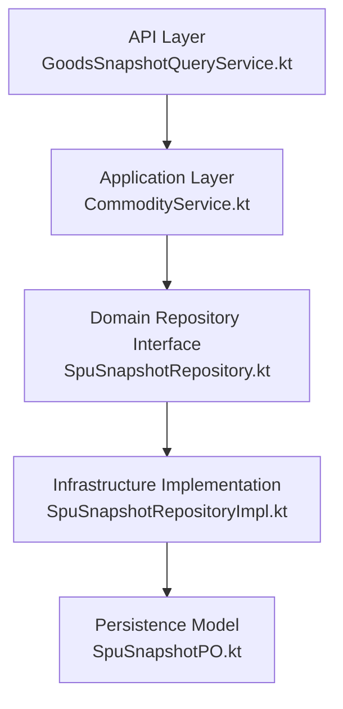
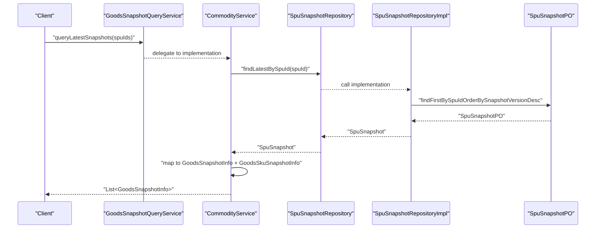
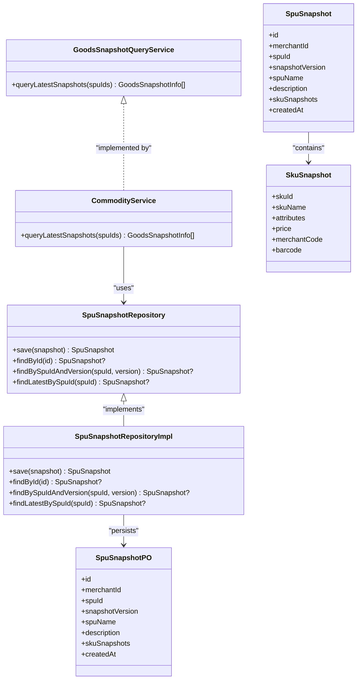

# Snapshot Query Service

<cite>
**Referenced Files in This Document**
- [GoodsSnapshotQueryService.kt](file://j-store-goods-api/src/main/kotlin/com/jstore/goods/api/GoodsSnapshotQueryService.kt)
- [CommodityService.kt](file://j-store-goods-application/src/main/kotlin/com/jstore/goods/service/CommodityService.kt)
- [SpuSnapshotRepository.kt](file://j-store-goods-domain/src/main/kotlin/com/jstore/goods/domain/commodity/snapshot/SpuSnapshotRepository.kt)
- [SpuSnapshotRepositoryImpl.kt](file://j-store-goods-infrastructure/src/main/kotlin/com/jstore/goods/domain/commodity/SpuSnapshotRepositoryImpl.kt)
- [SpuSnapshot.kt](file://j-store-goods-domain/src/main/kotlin/com/jstore/goods/domain/commodity/snapshot/SpuSnapshot.kt)
- [SpuSnapshotPO.kt](file://j-store-goods-infrastructure/src/main/kotlin/com/jstore/goods/domain/commodity/persistence/SpuSnapshotPO.kt)
- [CommodityServiceGoodsSnapshotQueryTest.kt](file://j-store-goods-application/src/test/kotlin/com/jstore/goods/service/CommodityServiceGoodsSnapshotQueryTest.kt)
</cite>

## Table of Contents
1. [Introduction](#introduction)
2. [Project Structure](#project-structure)
3. [Core Components](#core-components)
4. [Architecture Overview](#architecture-overview)
5. [Detailed Component Analysis](#detailed-component-analysis)
6. [Dependency Analysis](#dependency-analysis)
7. [Performance Considerations](#performance-considerations)
8. [Troubleshooting Guide](#troubleshooting-guide)
9. [Conclusion](#conclusion)

## Introduction
This document explains the snapshot query service implementation that provides efficient read access to current product snapshots. The key method is queryLatestSnapshots, which returns immutable, versioned views of product data (SPU and SKU) at a point in time. These snapshots ensure consistent reads even while product data is being modified, making them ideal for product catalogs, search results, and order line item rendering.

## Project Structure
The snapshot query feature spans three layers:
- API layer defines the public interface and response DTOs.
- Application layer implements the query orchestration and mapping from domain snapshots to API DTOs.
- Domain and Infrastructure layers provide the snapshot model, repository abstraction, and persistence with JSON storage for SKU details.

**Diagram sources**
- [GoodsSnapshotQueryService.kt](file://j-store-goods-api/src/main/kotlin/com/jstore/goods/api/GoodsSnapshotQueryService.kt)
- [CommodityService.kt](file://j-store-goods-application/src/main/kotlin/com/jstore/goods/service/CommodityService.kt)
- [SpuSnapshotRepository.kt](file://j-store-goods-domain/src/main/kotlin/com/jstore/goods/domain/commodity/snapshot/SpuSnapshotRepository.kt)
- [SpuSnapshotRepositoryImpl.kt](file://j-store-goods-infrastructure/src/main/kotlin/com/jstore/goods/domain/commodity/SpuSnapshotRepositoryImpl.kt)
- [SpuSnapshotPO.kt](file://j-store-goods-infrastructure/src/main/kotlin/com/jstore/goods/domain/commodity/persistence/SpuSnapshotPO.kt)

**Section sources**
- [GoodsSnapshotQueryService.kt](file://j-store-goods-api/src/main/kotlin/com/jstore/goods/api/GoodsSnapshotQueryService.kt)
- [CommodityService.kt](file://j-store-goods-application/src/main/kotlin/com/jstore/goods/service/CommodityService.kt)
- [SpuSnapshotRepository.kt](file://j-store-goods-domain/src/main/kotlin/com/jstore/goods/domain/commodity/snapshot/SpuSnapshotRepository.kt)
- [SpuSnapshotRepositoryImpl.kt](file://j-store-goods-infrastructure/src/main/kotlin/com/jstore/goods/domain/commodity/SpuSnapshotRepositoryImpl.kt)
- [SpuSnapshotPO.kt](file://j-store-goods-infrastructure/src/main/kotlin/com/jstore/goods/domain/commodity/persistence/SpuSnapshotPO.kt)

## Core Components
- GoodsSnapshotQueryService: Public API contract exposing queryLatestSnapshots(spuIds).
- CommodityService: Implements the queryLatestSnapshots method by reading latest snapshots via SpuSnapshotRepository and mapping to API DTOs.
- SpuSnapshotRepository: Domain interface for immutable historical snapshot store with findLatestBySpuId and findBySpuIdAndVersion.
- SpuSnapshotRepositoryImpl: JPA-backed implementation converting between domain snapshots and persistent POs; stores SKU snapshots as JSONB.
- SpuSnapshot and SkuSnapshot: Immutable domain models representing a point-in-time view of SPU and its SKUs.
- SpuSnapshotPO: Persistent entity storing snapshot metadata and SKU snapshots as JSONB.

Key responsibilities:
- Provide consistent, versioned product views independent of ongoing writes.
- Efficiently return only the latest snapshot per SPU for read-heavy workloads.
- Map rich SKU attributes and price into lightweight DTOs for API consumers.

**Section sources**
- [GoodsSnapshotQueryService.kt](file://j-store-goods-api/src/main/kotlin/com/jstore/goods/api/GoodsSnapshotQueryService.kt)
- [CommodityService.kt](file://j-store-goods-application/src/main/kotlin/com/jstore/goods/service/CommodityService.kt)
- [SpuSnapshotRepository.kt](file://j-store-goods-domain/src/main/kotlin/com/jstore/goods/domain/commodity/snapshot/SpuSnapshotRepository.kt)
- [SpuSnapshotRepositoryImpl.kt](file://j-store-goods-infrastructure/src/main/kotlin/com/jstore/goods/domain/commodity/SpuSnapshotRepositoryImpl.kt)
- [SpuSnapshot.kt](file://j-store-goods-domain/src/main/kotlin/com/jstore/goods/domain/commodity/snapshot/SpuSnapshot.kt)
- [SpuSnapshotPO.kt](file://j-store-goods-infrastructure/src/main/kotlin/com/jstore/goods/domain/commodity/persistence/SpuSnapshotPO.kt)

## Architecture Overview
The snapshot query flow reads the latest snapshot per requested SPU and transforms it into API-friendly structures.

**Diagram sources**
- [CommodityService.kt](file://j-store-goods-application/src/main/kotlin/com/jstore/goods/service/CommodityService.kt)
- [SpuSnapshotRepository.kt](file://j-store-goods-domain/src/main/kotlin/com/jstore/goods/domain/commodity/snapshot/SpuSnapshotRepository.kt)
- [SpuSnapshotRepositoryImpl.kt](file://j-store-goods-infrastructure/src/main/kotlin/com/jstore/goods/domain/commodity/SpuSnapshotRepositoryImpl.kt)
- [SpuSnapshotPO.kt](file://j-store-goods-infrastructure/src/main/kotlin/com/jstore/goods/domain/commodity/persistence/SpuSnapshotPO.kt)

## Detailed Component Analysis

### API Contract and Response Models
- GoodsSnapshotQueryService exposes queryLatestSnapshots(spuIds: List<Long>): List<GoodsSnapshotInfo>.
- GoodsSnapshotInfo includes spuId, merchantId, snapshotVersion, spuName, and skuSnapshots.
- GoodsSkuSnapshotInfo includes skuId, skuName, attributes (list of key-value pairs), and price.

These DTOs are optimized for read operations and avoid exposing internal domain types.

**Section sources**
- [GoodsSnapshotQueryService.kt](file://j-store-goods-api/src/main/kotlin/com/jstore/goods/api/GoodsSnapshotQueryService.kt)

### Application Orchestration: queryLatestSnapshots
- Deduplicates input spuIds to minimize redundant queries.
- For each spuId, retrieves the latest snapshot using SpuSnapshotRepository.findLatestBySpuId.
- Maps domain SpuSnapshot and SkuSnapshot into GoodsSnapshotInfo and GoodsSkuSnapshotInfo respectively.
- Returns only present snapshots; missing ones are omitted from the result list.

Behavior highlights:
- Idempotent and safe against duplicate spuIds.
- No write operations; purely read path.
- Preserves snapshotVersion for consistency checks downstream.

**Section sources**
- [CommodityService.kt](file://j-store-goods-application/src/main/kotlin/com/jstore/goods/service/CommodityService.kt)

### Domain Snapshot Model
- SpuSnapshot captures immutable product state at a point in time, including merchantId, spuId, snapshotVersion, spuName, description, skuSnapshots, and createdAt.
- SkuSnapshot captures immutable SKU state: skuId, skuName, attributes (key-value pairs), price, and optional merchantCode/barcode.

These value objects ensure referential integrity across orders and catalog views.

**Section sources**
- [SpuSnapshot.kt](file://j-store-goods-domain/src/main/kotlin/com/jstore/goods/domain/commodity/snapshot/SpuSnapshot.kt)

### Persistence and Versioning
- SpuSnapshotRepository abstracts snapshot storage with methods to save, findById, findBySpuIdAndVersion, and findLatestBySpuId.
- SpuSnapshotRepositoryImpl uses JPA to persist SpuSnapshotPO, which stores SKU snapshots as JSONB for flexible attribute storage.
- Unique constraint on (spu_id, snapshot_version) ensures one snapshot per version per SPU.
- Latest snapshot retrieval uses ordering by snapshot_version descending to guarantee consistent reads.

Data flow:
- Save: Domain SpuSnapshot -> Converter.toPO -> SpuSnapshotPO -> JPA save.
- Read: JPA SpuSnapshotPO -> Converter.toDomain -> SpuSnapshot.

**Section sources**
- [SpuSnapshotRepository.kt](file://j-store-goods-domain/src/main/kotlin/com/jstore/goods/domain/commodity/snapshot/SpuSnapshotRepository.kt)
- [SpuSnapshotRepositoryImpl.kt](file://j-store-goods-infrastructure/src/main/kotlin/com/jstore/goods/domain/commodity/SpuSnapshotRepositoryImpl.kt)
- [SpuSnapshotPO.kt](file://j-store-goods-infrastructure/src/main/kotlin/com/jstore/goods/domain/commodity/persistence/SpuSnapshotPO.kt)

### Class Relationships

**Diagram sources**
- [GoodsSnapshotQueryService.kt](file://j-store-goods-api/src/main/kotlin/com/jstore/goods/api/GoodsSnapshotQueryService.kt)
- [CommodityService.kt](file://j-store-goods-application/src/main/kotlin/com/jstore/goods/service/CommodityService.kt)
- [SpuSnapshotRepository.kt](file://j-store-goods-domain/src/main/kotlin/com/jstore/goods/domain/commodity/snapshot/SpuSnapshotRepository.kt)
- [SpuSnapshotRepositoryImpl.kt](file://j-store-goods-infrastructure/src/main/kotlin/com/jstore/goods/domain/commodity/SpuSnapshotRepositoryImpl.kt)
- [SpuSnapshot.kt](file://j-store-goods-domain/src/main/kotlin/com/jstore/goods/domain/commodity/snapshot/SpuSnapshot.kt)
- [SpuSnapshotPO.kt](file://j-store-goods-infrastructure/src/main/kotlin/com/jstore/goods/domain/commodity/persistence/SpuSnapshotPO.kt)

### Example Usage Scenarios
- Query multiple product snapshots:
  - Call queryLatestSnapshots([spuId1, spuId2, ...]) to retrieve current snapshots for a batch of products.
  - Missing entries will be omitted; callers should handle absent items gracefully.
- Understand snapshot versioning:
  - Each snapshot has a snapshotVersion corresponding to the SPU’s version at publish time.
  - Use snapshotVersion to validate consistency when comparing cached vs. fresh data.
- Use snapshot data for catalogs and search:
  - Render product listings using spuName, skuSnapshots (skuName, attributes, price).
  - Avoid live reads during high traffic by relying on snapshots for stable pricing and attributes.

Validation reference:
- Unit test demonstrates mapping behavior and handling of missing snapshots.

**Section sources**
- [CommodityService.kt](file://j-store-goods-application/src/main/kotlin/com/jstore/goods/service/CommodityService.kt)
- [CommodityServiceGoodsSnapshotQueryTest.kt](file://j-store-goods-application/src/test/kotlin/com/jstore/goods/service/CommodityServiceGoodsSnapshotQueryTest.kt)

## Dependency Analysis
- CommodityService depends on SpuSnapshotRepository for snapshot reads.
- SpuSnapshotRepositoryImpl depends on JPA repository and JSON utilities for serialization/deserialization.
- SpuSnapshotPO persists snapshot metadata and SKU snapshots as JSONB.

**Diagram sources**
- [CommodityService.kt](file://j-store-goods-application/src/main/kotlin/com/jstore/goods/service/CommodityService.kt)
- [SpuSnapshotRepository.kt](file://j-store-goods-domain/src/main/kotlin/com/jstore/goods/domain/commodity/snapshot/SpuSnapshotRepository.kt)
- [SpuSnapshotRepositoryImpl.kt](file://j-store-goods-infrastructure/src/main/kotlin/com/jstore/goods/domain/commodity/SpuSnapshotRepositoryImpl.kt)
- [SpuSnapshotPO.kt](file://j-store-goods-infrastructure/src/main/kotlin/com/jstore/goods/domain/commodity/persistence/SpuSnapshotPO.kt)

**Section sources**
- [CommodityService.kt](file://j-store-goods-application/src/main/kotlin/com/jstore/goods/service/CommodityService.kt)
- [SpuSnapshotRepository.kt](file://j-store-goods-domain/src/main/kotlin/com/jstore/goods/domain/commodity/snapshot/SpuSnapshotRepository.kt)
- [SpuSnapshotRepositoryImpl.kt](file://j-store-goods-infrastructure/src/main/kotlin/com/jstore/goods/domain/commodity/SpuSnapshotRepositoryImpl.kt)
- [SpuSnapshotPO.kt](file://j-store-goods-infrastructure/src/main/kotlin/com/jstore/goods/domain/commodity/persistence/SpuSnapshotPO.kt)

## Performance Considerations
- Batch reads:
  - queryLatestSnapshots deduplicates spuIds to reduce redundant database calls.
- Indexing:
  - Ensure indexes on (spu_id, snapshot_version) for fast latest-snapshot retrieval.
- JSONB payload:
  - SKU snapshots stored as JSONB allow flexible attributes without schema changes; keep payloads compact.
- Caching strategies:
  - Cache snapshot responses keyed by spuId or composite keys (e.g., region/locale) to reduce DB load.
  - Use cache invalidation triggered by SPU publish events or version increments.
  - Consider TTL-based caching with short lifetimes for frequently changing catalogs.
- Concurrency:
  - Snapshots are immutable; concurrent reads are safe.
  - Writers create new snapshots on publish; readers always get consistent versions.

[No sources needed since this section provides general guidance]

## Troubleshooting Guide
Common issues and resolutions:
- Empty results for expected spuIds:
  - Verify that snapshots exist for those SPU IDs; missing snapshots are intentionally omitted.
- Stale data in caches:
  - Invalidate cache entries when SPU version increases or snapshots are updated.
- JSON parsing errors:
  - Validate SKU snapshot JSON structure; ensure required fields (skuId, skuName, attributes, price) are present.
- Performance regressions:
  - Check database indexes on (spu_id, snapshot_version); monitor query plans for full table scans.

**Section sources**
- [CommodityService.kt](file://j-store-goods-application/src/main/kotlin/com/jstore/goods/service/CommodityService.kt)
- [SpuSnapshotRepositoryImpl.kt](file://j-store-goods-infrastructure/src/main/kotlin/com/jstore/goods/domain/commodity/SpuSnapshotRepositoryImpl.kt)
- [SpuSnapshotPO.kt](file://j-store-goods-infrastructure/src/main/kotlin/com/jstore/goods/domain/commodity/persistence/SpuSnapshotPO.kt)

## Conclusion
The snapshot query service delivers efficient, consistent reads of product data through immutable, versioned snapshots. By leveraging domain-driven design and robust persistence patterns, it supports high-throughput catalog and search scenarios while maintaining data integrity across concurrent modifications. Proper indexing, caching, and validation ensure optimal performance and reliability.

[No sources needed since this section summarizes without analyzing specific files]