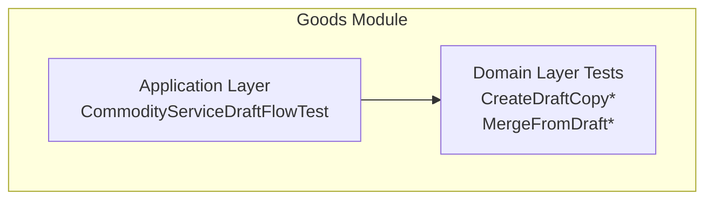
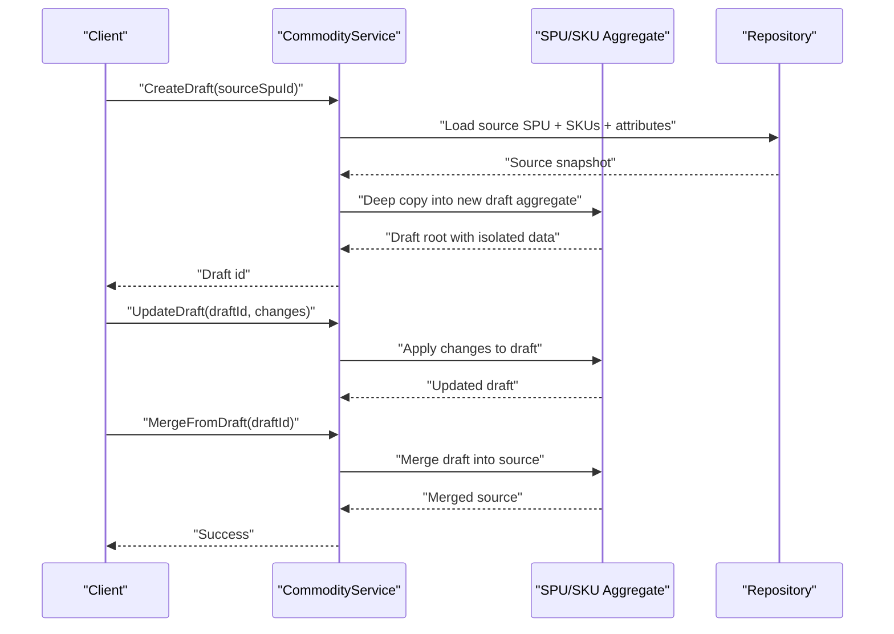
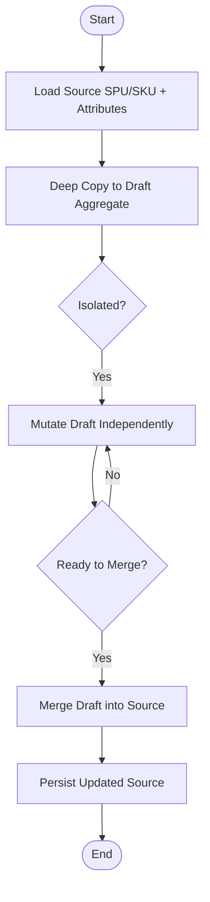
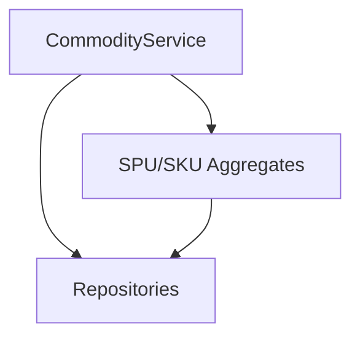

# Copy-on-Write Implementation

<cite>
**Referenced Files in This Document**
- [CommodityServiceDraftFlowTest.kt](file://j-store-goods-application/src/test/kotlin/com/jstore/goods/service/CommodityServiceDraftFlowTest.kt)
- [CreateDraftCopyDataIntegrityPropertyTest.kt](file://j-store-goods-domain/src/test/kotlin/com/jstore/goods/domain/commodity/CreateDraftCopyDataIntegrityPropertyTest.kt)
- [CreateDraftCopyStatusGuardPropertyTest.kt](file://j-store-goods-domain/src/test/kotlin/com/jstore/goods/domain/commodity/CreateDraftCopyStatusGuardPropertyTest.kt)
- [MergeFromDraftPropertyTest.kt](file://j-store-goods-domain/src/test/kotlin/com/jstore/goods/domain/commodity/MergeFromDraftPropertyTest.kt)
- [MergeFromDraftStatusGuardPropertyTest.kt](file://j-store-goods-domain/src/test/kotlin/com/jstore/goods/domain/commodity/MergeFromDraftStatusGuardPropertyTest.kt)
</cite>

## Table of Contents
1. [Introduction](#introduction)
2. [Project Structure](#project-structure)
3. [Core Components](#core-components)
4. [Architecture Overview](#architecture-overview)
5. [Detailed Component Analysis](#detailed-component-analysis)
6. [Dependency Analysis](#dependency-analysis)
7. [Performance Considerations](#performance-considerations)
8. [Troubleshooting Guide](#troubleshooting-guide)
9. [Conclusion](#conclusion)

## Introduction
This document explains the Copy-on-Write (CoW) pattern used to create draft copies of existing products in the goods domain. It focuses on how draft copies are created from live SPU/SKU hierarchies, attributes, and associated data; how isolation between original and draft versions is maintained; and what memory optimization strategies are applied. It also provides concrete examples of draft creation workflows, field-level copying logic, and performance considerations for large product catalogs.

## Project Structure
The CoW draft workflow is implemented within the goods module, with application-layer orchestration and domain-layer invariants validated through tests. The key artifacts involved in this documentation are:
- Application test demonstrating end-to-end draft flow
- Domain property tests validating data integrity and status guards during copy and merge operations

**Section sources**
- [CommodityServiceDraftFlowTest.kt](file://j-store-goods-application/src/test/kotlin/com/jstore/goods/service/CommodityServiceDraftFlowTest.kt)
- [CreateDraftCopyDataIntegrityPropertyTest.kt](file://j-store-goods-domain/src/test/kotlin/com/jstore/goods/domain/commodity/CreateDraftCopyDataIntegrityPropertyTest.kt)
- [CreateDraftCopyStatusGuardPropertyTest.kt](file://j-store-goods-domain/src/test/kotlin/com/jstore/goods/domain/commodity/CreateDraftCopyStatusGuardPropertyTest.kt)
- [MergeFromDraftPropertyTest.kt](file://j-store-goods-domain/src/test/kotlin/com/jstore/goods/domain/commodity/MergeFromDraftPropertyTest.kt)
- [MergeFromDraftStatusGuardPropertyTest.kt](file://j-store-goods-domain/src/test/kotlin/com/jstore/goods/domain/commodity/MergeFromDraftStatusGuardPropertyTest.kt)

## Core Components
- Draft copy creation: Produces a new draft aggregate rooted at an SPU with deep-copied SKUs, attributes, images, and related metadata.
- Data isolation: Ensures mutations on the draft do not affect the source product until explicitly merged.
- Merge operation: Applies draft changes back to the source product while preserving versioning and consistency.
- Status guards: Enforce valid state transitions for creating drafts and merging them.

These behaviors are verified by:
- End-to-end draft flow test
- Property tests ensuring data integrity and status guard correctness

**Section sources**
- [CommodityServiceDraftFlowTest.kt](file://j-store-goods-application/src/test/kotlin/com/jstore/goods/service/CommodityServiceDraftFlowTest.kt)
- [CreateDraftCopyDataIntegrityPropertyTest.kt](file://j-store-goods-domain/src/test/kotlin/com/jstore/goods/domain/commodity/CreateDraftCopyDataIntegrityPropertyTest.kt)
- [CreateDraftCopyStatusGuardPropertyTest.kt](file://j-store-goods-domain/src/test/kotlin/com/jstore/goods/domain/commodity/CreateDraftCopyStatusGuardPropertyTest.kt)
- [MergeFromDraftPropertyTest.kt](file://j-store-goods-domain/src/test/kotlin/com/jstore/goods/domain/commodity/MergeFromDraftPropertyTest.kt)
- [MergeFromDraftStatusGuardPropertyTest.kt](file://j-store-goods-domain/src/test/kotlin/com/jstore/goods/domain/commodity/MergeFromDraftStatusGuardPropertyTest.kt)

## Architecture Overview
The CoW draft workflow follows a clear sequence:
1. Load the source SPU/SKU hierarchy and associated data.
2. Deep-copy into a new draft aggregate.
3. Mutate the draft independently.
4. Merge draft changes back to the source when ready.

[No diagram sources needed since this diagram shows conceptual workflow, not actual code structure]

## Detailed Component Analysis

### Draft Creation Workflow
- Input: Source SPU identifier and optional context (e.g., merchant scope).
- Process:
  - Retrieve the source SPU and its SKU tree along with attributes and media references.
  - Perform a deep copy into a new draft aggregate, ensuring all nested structures are duplicated.
  - Assign a new draft identifier and mark it as a draft.
- Output: A new draft aggregate that is fully isolated from the source.

Key validations:
- Source must be in a publishable or editable state suitable for drafting.
- All required fields are present in the source to produce a valid draft.

**Section sources**
- [CommodityServiceDraftFlowTest.kt](file://j-store-goods-application/src/test/kotlin/com/jstore/goods/service/CommodityServiceDraftFlowTest.kt)
- [CreateDraftCopyDataIntegrityPropertyTest.kt](file://j-store-goods-domain/src/test/kotlin/com/jstore/goods/domain/commodity/CreateDraftCopyDataIntegrityPropertyTest.kt)
- [CreateDraftCopyStatusGuardPropertyTest.kt](file://j-store-goods-domain/src/test/kotlin/com/jstore/goods/domain/commodity/CreateDraftCopyStatusGuardPropertyTest.kt)

### Deep Copy Semantics (SPU/SKU Hierarchy and Attributes)
- SPU level:
  - Title, description, category, tags, pricing, shipping, and other metadata are copied.
- SKU level:
  - Each SKU is deep-copied including price, weight, dimensions, images, codes, and variant attributes.
- Attributes:
  - Key-value pairs and structured attribute sets are duplicated to avoid shared references.
- Images and media:
  - References are copied; actual binary assets remain external to minimize duplication.

Isolation guarantees:
- No shared mutable references between source and draft after copy.
- Changes to draft do not propagate to source unless explicitly merged.

**Section sources**
- [CreateDraftCopyDataIntegrityPropertyTest.kt](file://j-store-goods-domain/src/test/kotlin/com/jstore/goods/domain/commodity/CreateDraftCopyDataIntegrityPropertyTest.kt)

### Field-Level Copying Logic
- Primitive fields: Copied by value.
- Collections: New instances created with copied elements.
- Nested objects: Recursively deep-copied.
- References to external resources: Copied as identifiers/URLs without duplicating payloads.

Validation rules enforced during copy:
- Required fields presence
- Consistency across SKU variants and parent SPU attributes
- Image ordering and uniqueness constraints preserved

**Section sources**
- [CreateDraftCopyDataIntegrityPropertyTest.kt](file://j-store-goods-domain/src/test/kotlin/com/jstore/goods/domain/commodity/CreateDraftCopyDataIntegrityPropertyTest.kt)

### Merge From Draft
- Purpose: Apply draft changes back to the source product atomically.
- Process:
  - Validate draft state and source eligibility for merge.
  - Compute deltas between draft and source.
  - Apply updates to source aggregates (SPU/SKU/attributes).
  - Persist changes and update versioning.
- Guards:
  - Prevent merges if source has been modified concurrently beyond expected version.
  - Ensure no invalid state transitions occur during merge.

**Section sources**
- [MergeFromDraftPropertyTest.kt](file://j-store-goods-domain/src/test/kotlin/com/jstore/goods/domain/commodity/MergeFromDraftPropertyTest.kt)
- [MergeFromDraftStatusGuardPropertyTest.kt](file://j-store-goods-domain/src/test/kotlin/com/jstore/goods/domain/commodity/MergeFromDraftStatusGuardPropertyTest.kt)

### Status Guard Enforcement
- Draft creation requires source in allowed states (e.g., published or draft-editable).
- Merge requires both draft and source in compatible states.
- Invalid transitions raise explicit errors to prevent inconsistent states.

**Section sources**
- [CreateDraftCopyStatusGuardPropertyTest.kt](file://j-store-goods-domain/src/test/kotlin/com/jstore/goods/domain/commodity/CreateDraftCopyStatusGuardPropertyTest.kt)
- [MergeFromDraftStatusGuardPropertyTest.kt](file://j-store-goods-domain/src/test/kotlin/com/jstore/goods/domain/commodity/MergeFromDraftStatusGuardPropertyTest.kt)

### Conceptual Overview

[No sources needed since this diagram shows conceptual workflow, not actual code structure]

## Dependency Analysis
The draft workflow depends on:
- Application service orchestrating load, copy, mutate, and merge steps.
- Domain aggregates enforcing invariants and state transitions.
- Repositories providing persistence for source and draft entities.

[No diagram sources needed since this diagram shows conceptual dependencies, not actual code structure]

## Performance Considerations
- Memory usage:
  - Deep copying large catalogs can be memory-intensive. Use streaming or chunked loading where possible.
- I/O patterns:
  - Batch loads for SKUs and attributes to reduce round-trips.
  - Avoid loading heavy media payloads; copy only references.
- Concurrency:
  - Lock source aggregates during merge to prevent concurrent modifications.
  - Use optimistic concurrency control via version fields to detect conflicts early.
- Caching:
  - Cache frequently accessed reference data (categories, attributes definitions) to speed up copy operations.
- Indexing:
  - Ensure indexes support efficient lookups by SPU/SKU IDs and merchant scopes.

[No sources needed since this section provides general guidance]

## Troubleshooting Guide
Common issues and resolutions:
- Invalid source state for draft creation:
  - Verify source status allows drafting; adjust business rules or user prompts accordingly.
- Data integrity failures during copy:
  - Check required fields and cross-field constraints; ensure all nested collections are non-null and consistent.
- Merge conflicts:
  - Detect version mismatches; prompt users to refresh and re-apply changes.
- Memory pressure:
  - Reduce payload size, avoid loading binaries, and process in batches.

**Section sources**
- [CreateDraftCopyStatusGuardPropertyTest.kt](file://j-store-goods-domain/src/test/kotlin/com/jstore/goods/domain/commodity/CreateDraftCopyStatusGuardPropertyTest.kt)
- [MergeFromDraftStatusGuardPropertyTest.kt](file://j-store-goods-domain/src/test/kotlin/com/jstore/goods/domain/commodity/MergeFromDraftStatusGuardPropertyTest.kt)

## Conclusion
The Copy-on-Write draft workflow enables safe, isolated editing of product catalogs by deep-copying SPU/SKU hierarchies and attributes into a draft aggregate. Strict status guards and data integrity checks ensure correctness, while merge operations apply changes back to the source atomically. For large catalogs, careful attention to memory, I/O batching, and concurrency controls is essential to maintain performance and reliability.