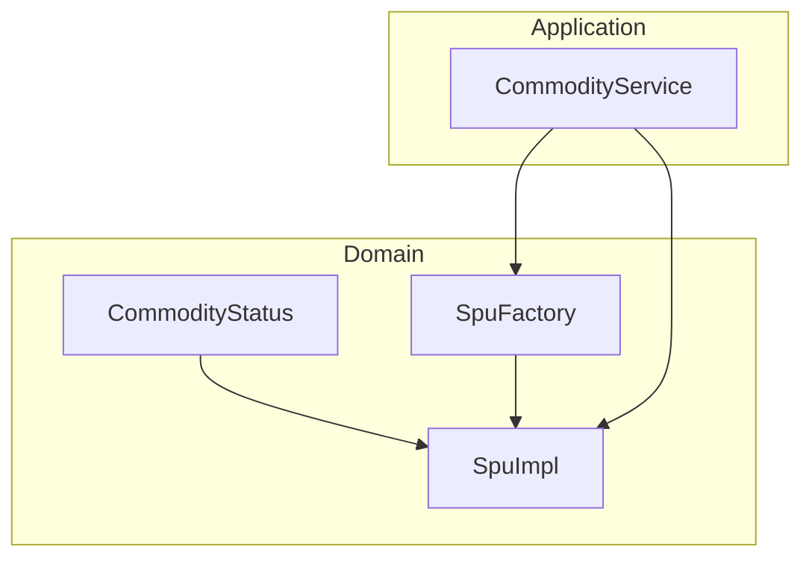
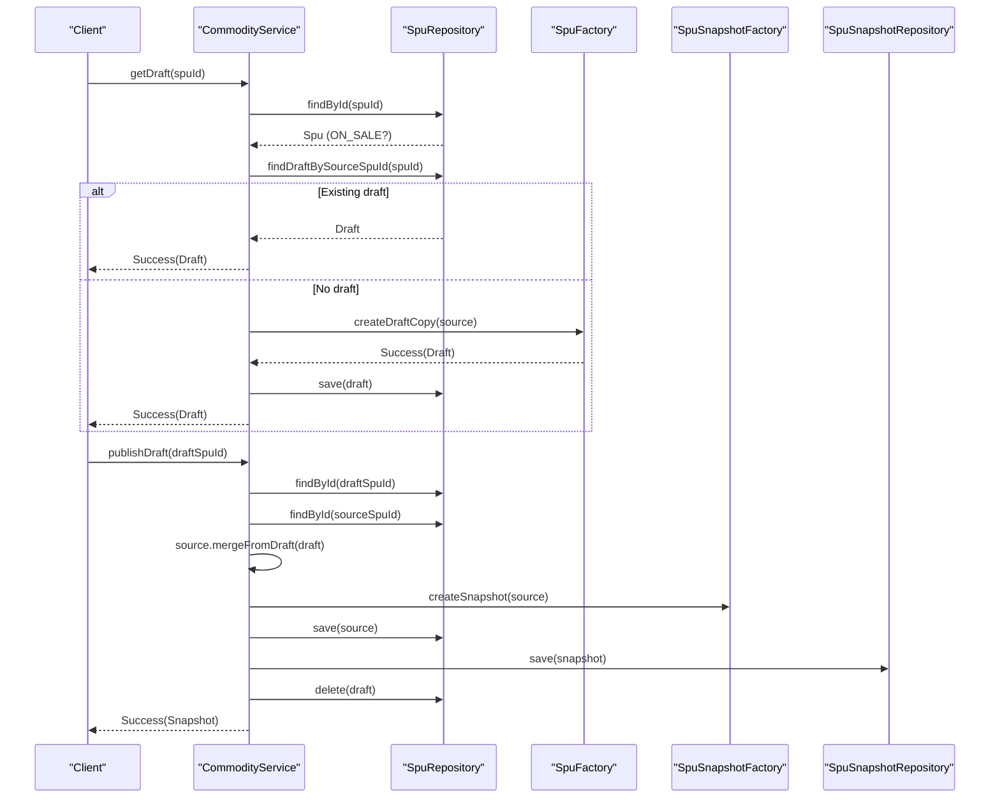
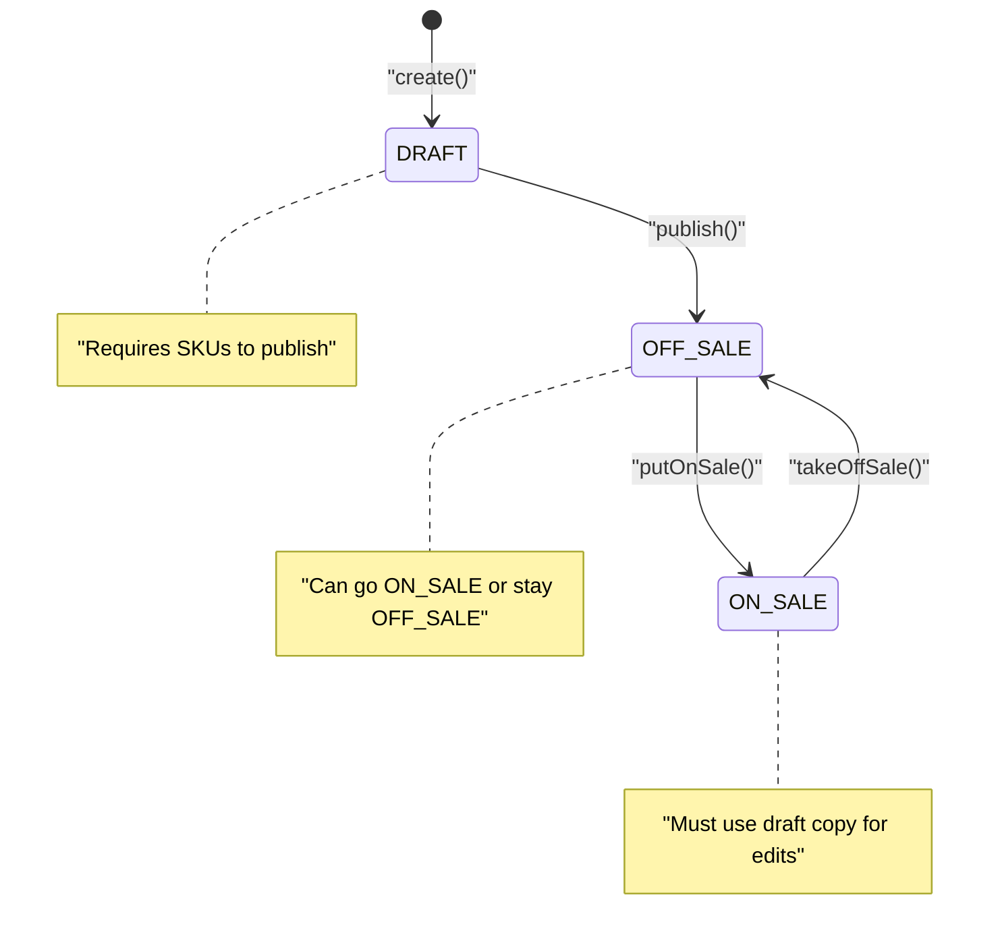
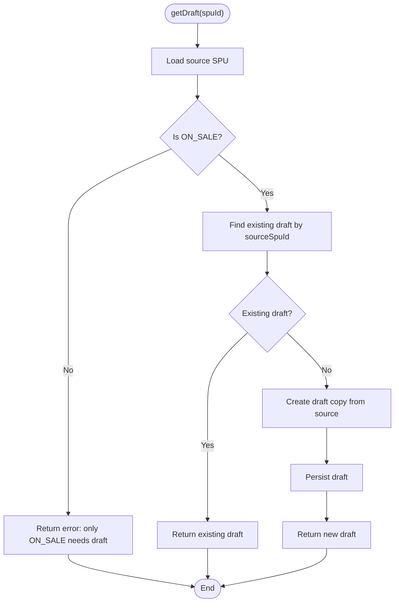
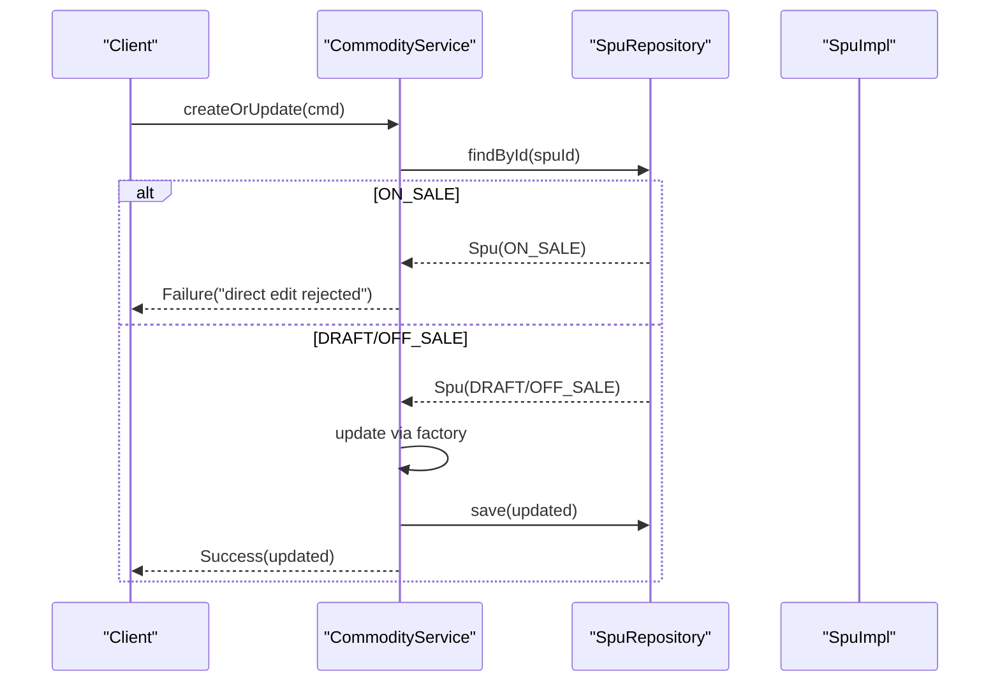
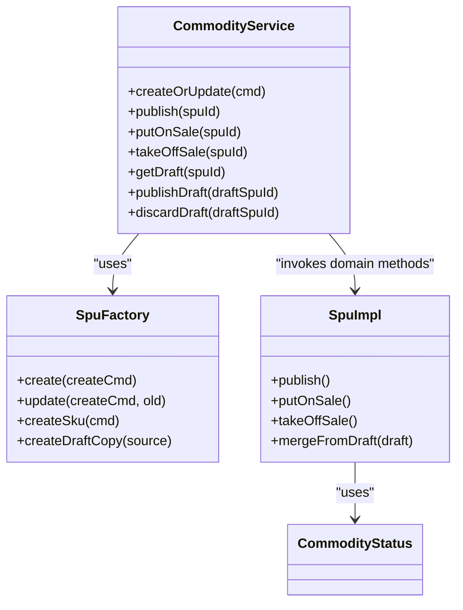

# Draft State Management

<cite>
**Referenced Files in This Document**
- [CommodityStatus.kt](file://j-store-goods-domain/src/main/kotlin/com/jstore/goods/domain/commodity/CommodityStatus.kt)
- [SpuImpl.kt](file://j-store-goods-domain/src/main/kotlin/com/jstore/goods/domain/commodity/SpuImpl.kt)
- [SpuFactory.kt](file://j-store-goods-domain/src/main/kotlin/com/jstore/goods/domain/commodity/SpuFactory.kt)
- [CommodityService.kt](file://j-store-goods-application/src/main/kotlin/com/jstore/goods/service/CommodityService.kt)
- [CreateDraftCopyDataIntegrityPropertyTest.kt](file://j-store-goods-domain/src/test/kotlin/com/jstore/goods/domain/commodity/CreateDraftCopyDataIntegrityPropertyTest.kt)
- [CreateDraftCopyStatusGuardPropertyTest.kt](file://j-store-goods-domain/src/test/kotlin/com/jstore/goods/domain/commodity/CreateDraftCopyStatusGuardPropertyTest.kt)
- [MergeFromDraftStatusGuardPropertyTest.kt](file://j-store-goods-domain/src/test/kotlin/com/jstore/goods/domain/commodity/MergeFromDraftStatusGuardPropertyTest.kt)
- [CommodityServiceDraftFlowTest.kt](file://j-store-goods-application/src/test/kotlin/com/jstore/goods/service/CommodityServiceDraftFlowTest.kt)
</cite>

## Table of Contents
1. [Introduction](#introduction)
2. [Project Structure](#project-structure)
3. [Core Components](#core-components)
4. [Architecture Overview](#architecture-overview)
5. [Detailed Component Analysis](#detailed-component-analysis)
6. [Dependency Analysis](#dependency-analysis)
7. [Performance Considerations](#performance-considerations)
8. [Troubleshooting Guide](#troubleshooting-guide)
9. [Conclusion](#conclusion)

## Introduction
This document explains the draft state management system for commodities (SPU). It defines the complete state machine with states DRAFT, OFF_SALE, and ON_SALE, their transitions, and business rules enforced by status transition guards. It also details how the draft workflow integrates with the main commodity lifecycle to maintain data integrity and consistency across state changes, including on-write editing via draft copies for ON_SALE items.

## Project Structure
The draft state management spans domain and application layers:
- Domain layer defines the SPU aggregate, its status enum, and factory utilities for creating/updating and drafting.
- Application layer orchestrates commands like publish, putOnSale, takeOffSale, getDraft, publishDraft, and discardDraft, enforcing higher-level rules and coordinating persistence and events.

**Diagram sources**
- [CommodityStatus.kt](file://j-store-goods-domain/src/main/kotlin/com/jstore/goods/domain/commodity/CommodityStatus.kt)
- [SpuImpl.kt](file://j-store-goods-domain/src/main/kotlin/com/jstore/goods/domain/commodity/SpuImpl.kt)
- [SpuFactory.kt](file://j-store-goods-domain/src/main/kotlin/com/jstore/goods/domain/commodity/SpuFactory.kt)
- [CommodityService.kt](file://j-store-goods-application/src/main/kotlin/com/jstore/goods/service/CommodityService.kt)

**Section sources**
- [CommodityStatus.kt](file://j-store-goods-domain/src/main/kotlin/com/jstore/goods/domain/commodity/CommodityStatus.kt)
- [SpuImpl.kt](file://j-store-goods-domain/src/main/kotlin/com/jstore/goods/domain/commodity/SpuImpl.kt)
- [SpuFactory.kt](file://j-store-goods-domain/src/main/kotlin/com/jstore/goods/domain/commodity/SpuFactory.kt)
- [CommodityService.kt](file://j-store-goods-application/src/main/kotlin/com/jstore/goods/service/CommodityService.kt)

## Core Components
- CommodityStatus: Enumerates DRAFT, OFF_SALE, ON_SALE.
- SpuImpl: Implements state transitions (publish, putOnSale, takeOffSale) and mergeFromDraft, enforcing guards and raising domain events.
- SpuFactory: Creates new SPU instances, updates existing ones, and creates draft copies from ON_SALE source SPUs.
- CommodityService: Orchestrates user-facing operations, enforces cross-cutting rules (e.g., blocking direct edits to ON_SALE), coordinates snapshots, and publishes pending events.

Key responsibilities:
- Enforce valid state transitions and preconditions.
- Maintain version increments on state-changing operations.
- Ensure draft copy semantics (idempotent retrieval, isolation from source until merge).
- Emit domain events upon state changes.

**Section sources**
- [CommodityStatus.kt](file://j-store-goods-domain/src/main/kotlin/com/jstore/goods/domain/commodity/CommodityStatus.kt)
- [SpuImpl.kt](file://j-store-goods-domain/src/main/kotlin/com/jstore/goods/domain/commodity/SpuImpl.kt)
- [SpuFactory.kt](file://j-store-goods-domain/src/main/kotlin/com/jstore/goods/domain/commodity/SpuFactory.kt)
- [CommodityService.kt](file://j-store-goods-application/src/main/kotlin/com/jstore/goods/service/CommodityService.kt)

## Architecture Overview
The draft workflow integrates tightly with the commodity lifecycle:
- Direct edits are blocked for ON_SALE; instead, a draft copy is created and edited independently.
- Publishing a draft merges content into the source SPU, increments version, creates a snapshot, and deletes the draft.
- Lifecycle transitions (publish, putOnSale, takeOffSale) are guarded by strict state checks.

**Diagram sources**
- [CommodityService.kt](file://j-store-goods-application/src/main/kotlin/com/jstore/goods/service/CommodityService.kt)
- [SpuFactory.kt](file://j-store-goods-domain/src/main/kotlin/com/jstore/goods/domain/commodity/SpuFactory.kt)
- [SpuImpl.kt](file://j-store-goods-domain/src/main/kotlin/com/jstore/goods/domain/commodity/SpuImpl.kt)

## Detailed Component Analysis

### State Machine and Transitions
States: DRAFT, OFF_SALE, ON_SALE.

Valid transitions:
- DRAFT → OFF_SALE via publish()
- OFF_SALE → ON_SALE via putOnSale()
- ON_SALE → OFF_SALE via takeOffSale()

Invalid transitions and guards:
- publish() requires current state DRAFT; otherwise fails.
- putOnSale() rejects DRAFT and already ON_SALE states.
- takeOffSale() requires current state ON_SALE; otherwise fails.

Additional constraints:
- publish() requires at least one SKU.
- mergeFromDraft() requires target SPU to be ON_SALE and draft to have non-empty SKUs; merchant IDs must match.

**Diagram sources**
- [SpuImpl.kt](file://j-store-goods-domain/src/main/kotlin/com/jstore/goods/domain/commodity/SpuImpl.kt)
- [CommodityStatus.kt](file://j-store-goods-domain/src/main/kotlin/com/jstore/goods/domain/commodity/CommodityStatus.kt)

**Section sources**
- [SpuImpl.kt](file://j-store-goods-domain/src/main/kotlin/com/jstore/goods/domain/commodity/SpuImpl.kt)
- [CommodityStatus.kt](file://j-store-goods-domain/src/main/kotlin/com/jstore/goods/domain/commodity/CommodityStatus.kt)

### Draft Copy Workflow
Rules:
- Only ON_SALE SPUs can generate a draft copy.
- Draft copy preserves name, description, SKUs, and version; sets status DRAFT and links sourceSpuId.
- getDraft() is idempotent: returns existing draft if present.
- publishDraft() merges draft into source, increments version, creates snapshot, deletes draft.
- discardDraft() removes draft without affecting source.

**Diagram sources**
- [CommodityService.kt](file://j-store-goods-application/src/main/kotlin/com/jstore/goods/service/CommodityService.kt)
- [SpuFactory.kt](file://j-store-goods-domain/src/main/kotlin/com/jstore/goods/domain/commodity/SpuFactory.kt)

**Section sources**
- [CommodityService.kt](file://j-store-goods-application/src/main/kotlin/com/jstore/goods/service/CommodityService.kt)
- [SpuFactory.kt](file://j-store-goods-domain/src/main/kotlin/com/jstore/goods/domain/commodity/SpuFactory.kt)

### Status Transition Guards and Data Integrity
Guards implemented in SpuImpl:
- publish(): validates DRAFT and non-empty SKUs; raises published event.
- putOnSale(): rejects DRAFT and already ON_SALE; increments version; raises on-sale event.
- takeOffSale(): validates ON_SALE; raises off-sale event.
- mergeFromDraft(): validates merchant match, target ON_SALE, and non-empty draft SKUs; replaces name/description/SKUs and increments version.

Data integrity guarantees verified by property tests:
- createDraftCopy preserves source fields and version, sets DRAFT and sourceSpuId, ensures distinct id.
- createDraftCopy rejects non-ON_SALE sources.
- mergeFromDraft rejects non-ON_SALE targets and leaves all fields unchanged on failure.

**Section sources**
- [SpuImpl.kt](file://j-store-goods-domain/src/main/kotlin/com/jstore/goods/domain/commodity/SpuImpl.kt)
- [CreateDraftCopyDataIntegrityPropertyTest.kt](file://j-store-goods-domain/src/test/kotlin/com/jstore/goods/domain/commodity/CreateDraftCopyDataIntegrityPropertyTest.kt)
- [CreateDraftCopyStatusGuardPropertyTest.kt](file://j-store-goods-domain/src/test/kotlin/com/jstore/goods/domain/commodity/CreateDraftCopyStatusGuardPropertyTest.kt)
- [MergeFromDraftStatusGuardPropertyTest.kt](file://j-store-goods-domain/src/test/kotlin/com/jstore/goods/domain/commodity/MergeFromDraftStatusGuardPropertyTest.kt)

### Integration with Main Commodity Lifecycle
- Direct edits to ON_SALE are blocked at the service layer; users must obtain a draft copy first.
- Publishing a draft merges changes into the live product, ensuring consistent snapshots and versioning.
- Lifecycle transitions emit domain events that downstream consumers can react to (e.g., inventory, pricing).

**Diagram sources**
- [CommodityService.kt](file://j-store-goods-application/src/main/kotlin/com/jstore/goods/service/CommodityService.kt)

**Section sources**
- [CommodityService.kt](file://j-store-goods-application/src/main/kotlin/com/jstore/goods/service/CommodityService.kt)

## Dependency Analysis
- CommodityService depends on SpuRepository, SpuFactory, SpuSnapshotFactory, and SpuSnapshotRepository to orchestrate workflows.
- SpuImpl depends on CommodityStatus and emits domain events upon state changes.
- SpuFactory provides creation/update logic and draft copy generation with guard checks.

**Diagram sources**
- [CommodityService.kt](file://j-store-goods-application/src/main/kotlin/com/jstore/goods/service/CommodityService.kt)
- [SpuFactory.kt](file://j-store-goods-domain/src/main/kotlin/com/jstore/goods/domain/commodity/SpuFactory.kt)
- [SpuImpl.kt](file://j-store-goods-domain/src/main/kotlin/com/jstore/goods/domain/commodity/SpuImpl.kt)
- [CommodityStatus.kt](file://j-store-goods-domain/src/main/kotlin/com/jstore/goods/domain/commodity/CommodityStatus.kt)

**Section sources**
- [CommodityService.kt](file://j-store-goods-application/src/main/kotlin/com/jstore/goods/service/CommodityService.kt)
- [SpuFactory.kt](file://j-store-goods-domain/src/main/kotlin/com/jstore/goods/domain/commodity/SpuFactory.kt)
- [SpuImpl.kt](file://j-store-goods-domain/src/main/kotlin/com/jstore/goods/domain/commodity/SpuImpl.kt)
- [CommodityStatus.kt](file://j-store-goods-domain/src/main/kotlin/com/jstore/goods/domain/commodity/CommodityStatus.kt)

## Performance Considerations
- Draft copy creation is lightweight and avoids mutating live data; it duplicates necessary fields and SKUs once per edit session.
- Version increments occur only on meaningful state changes or merges, minimizing unnecessary metadata churn.
- Snapshot creation happens after successful merges or on-sale transitions to ensure consistent read models.

[No sources needed since this section provides general guidance]

## Troubleshooting Guide
Common invalid transitions and errors:
- Attempting to publish a non-DRAFT SPU: Guard prevents publish; returns an invalid status transition error.
- Attempting to put-on-sale a DRAFT or already ON_SALE SPU: Guard rejects; returns appropriate error.
- Attempting to take-off-sale a non-ON_SALE SPU: Guard prevents; returns error indicating only ON_SALE can be taken off.
- Editing an ON_SALE SPU directly: Service blocks direct edits; must use draft copy flow.
- Merging a draft into a non-ON_SALE target: Guard rejects; no fields are mutated.
- Creating a draft copy from a non-ON_SALE source: Factory rejects; returns error.

Error handling patterns:
- Domain methods return Result types with Failure carrying BusinessError codes.
- Application services translate failures to user-facing responses and avoid partial mutations.
- Property tests assert both error outcomes and immutability on failed operations.

**Section sources**
- [SpuImpl.kt](file://j-store-goods-domain/src/main/kotlin/com/jstore/goods/domain/commodity/SpuImpl.kt)
- [CommodityService.kt](file://j-store-goods-application/src/main/kotlin/com/jstore/goods/service/CommodityService.kt)
- [CommodityServiceDraftFlowTest.kt](file://j-store-goods-application/src/test/kotlin/com/jstore/goods/service/CommodityServiceDraftFlowTest.kt)

## Conclusion
The draft state management system enforces a robust three-state lifecycle (DRAFT, OFF_SALE, ON_SALE) with strict guards to prevent invalid transitions and preserve data integrity. The draft copy mechanism enables safe editing of live products by isolating changes until a controlled merge process updates the source, increments versions, and generates consistent snapshots. This design ensures reliability, auditability, and clear separation between editing and publishing phases in the commodity lifecycle.

[No sources needed since this section summarizes without analyzing specific files]