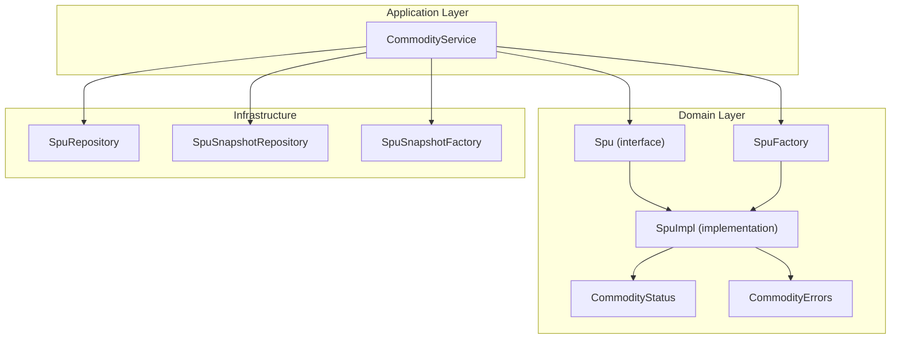
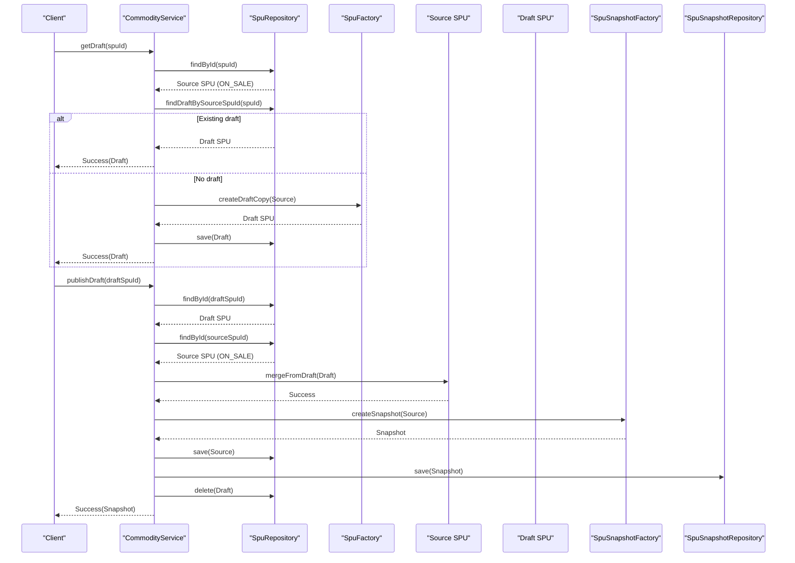
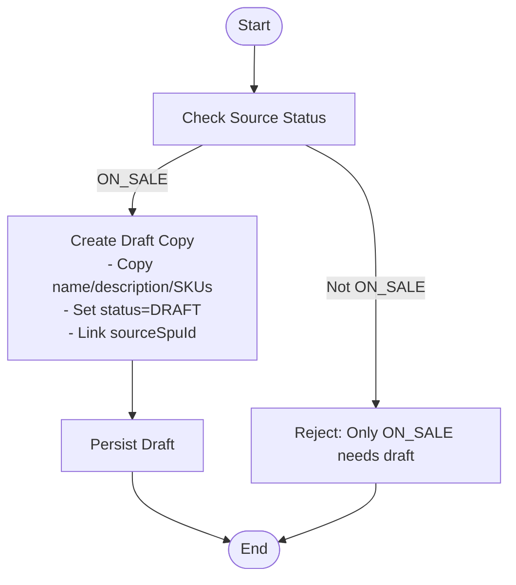
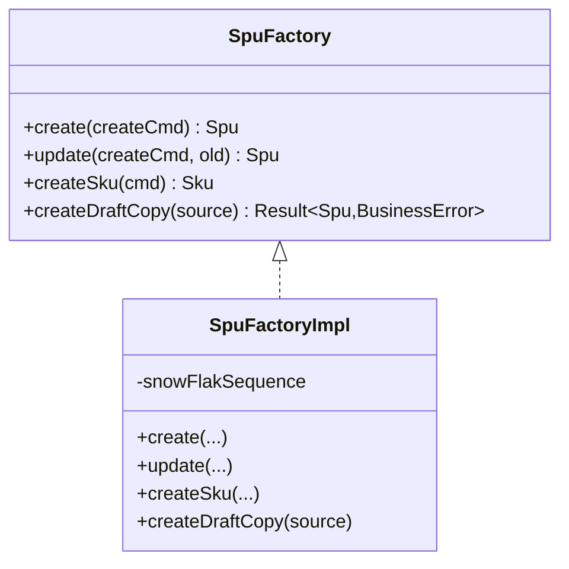
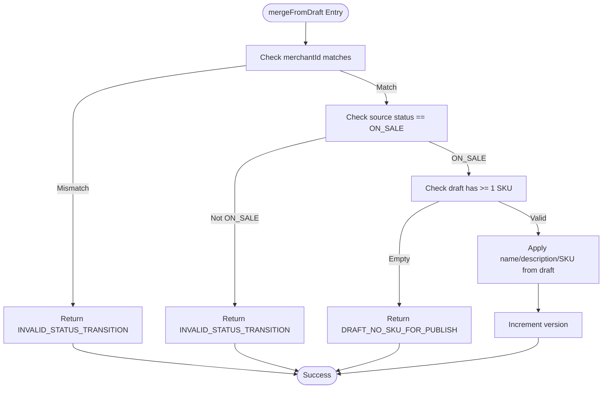
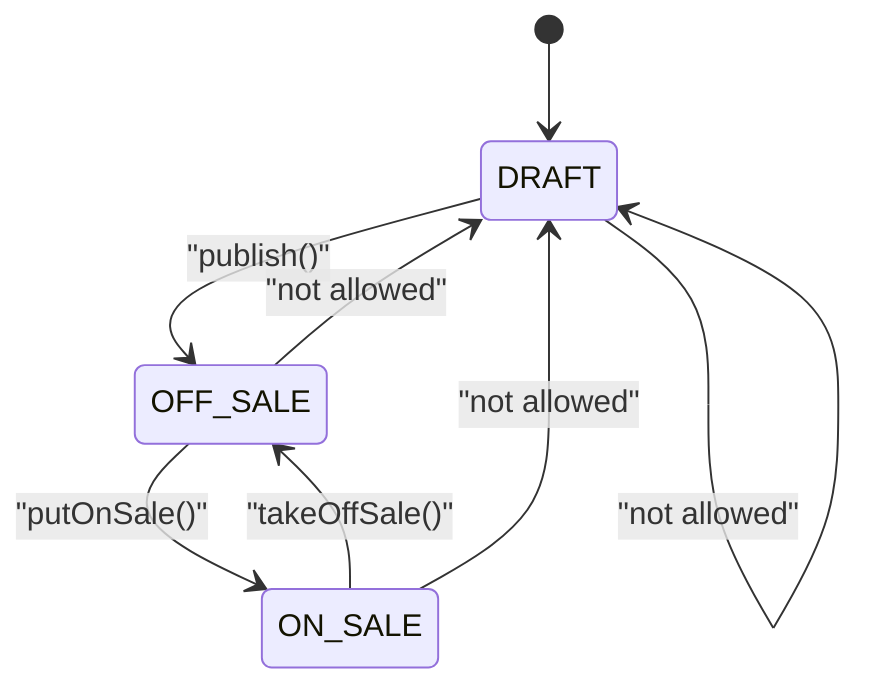
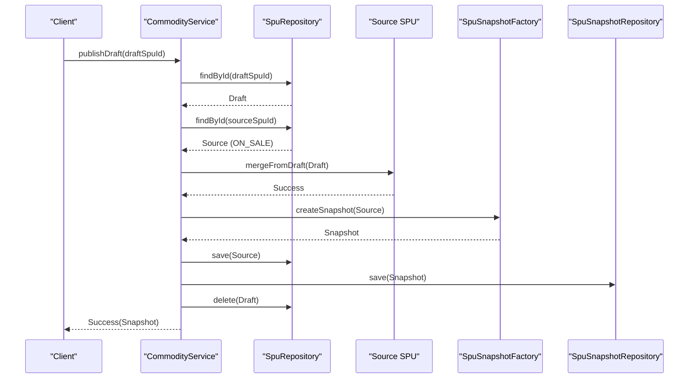
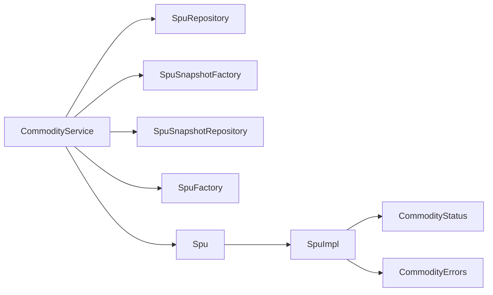

# Draft Workflow System

<cite>
**Referenced Files in This Document**
- [CommodityService.kt](file://j-store-goods-application/src/main/kotlin/com/jstore/goods/service/CommodityService.kt)
- [Spu.kt](file://j-store-goods-domain/src/main/kotlin/com/jstore/goods/domain/commodity/Spu.kt)
- [SpuImpl.kt](file://j-store-goods-domain/src/main/kotlin/com/jstore/goods/domain/commodity/SpuImpl.kt)
- [SpuFactory.kt](file://j-store-goods-domain/src/main/kotlin/com/jstore/goods/domain/commodity/SpuFactory.kt)
- [CommodityStatus.kt](file://j-store-goods-domain/src/main/kotlin/com/jstore/goods/domain/commodity/CommodityStatus.kt)
- [CommodityErrors.kt](file://j-store-goods-domain/src/main/kotlin/com/jstore/goods/domain/commodity/CommodityErrors.kt)
- [CommodityServiceDraftFlowTest.kt](file://j-store-goods-application/src/test/kotlin/com/jstore/goods/service/CommodityServiceDraftFlowTest.kt)
- [MergeFromDraftPropertyTest.kt](file://j-store-goods-domain/src/test/kotlin/com/jstore/goods/domain/commodity/MergeFromDraftPropertyTest.kt)
- [CreateDraftCopyDataIntegrityPropertyTest.kt](file://j-store-goods-domain/src/test/kotlin/com/jstore/goods/domain/commodity/CreateDraftCopyDataIntegrityPropertyTest.kt)
</cite>

## Table of Contents
1. [Introduction](#introduction)
2. [Project Structure](#project-structure)
3. [Core Components](#core-components)
4. [Architecture Overview](#architecture-overview)
5. [Detailed Component Analysis](#detailed-component-analysis)
6. [Dependency Analysis](#dependency-analysis)
7. [Performance Considerations](#performance-considerations)
8. [Troubleshooting Guide](#troubleshooting-guide)
9. [Conclusion](#conclusion)

## Introduction
This document explains the draft workflow system for product (SPU) modifications, focusing on the Copy-on-Write pattern, draft creation from existing products, and merge operations. It covers the complete lifecycle from DRAFT to OFF_SALE to ON_SALE, details the mergeFromDraft method implementation, conflict resolution strategies, data integrity preservation, status transition guards, and concurrent modification handling via optimistic locking. Concrete examples illustrate draft creation, modification workflows, and publishing processes.

## Project Structure
The draft workflow spans application services and domain logic:
- Application service orchestrates draft operations, persistence, snapshots, and events.
- Domain layer defines the SPU aggregate, state transitions, and merge semantics.
- Factory creates drafts preserving source data integrity.
- Tests validate business rules, data integrity, and merge behavior.

**Diagram sources**
- [CommodityService.kt](file://j-store-goods-application/src/main/kotlin/com/jstore/goods/service/CommodityService.kt)
- [Spu.kt](file://j-store-goods-domain/src/main/kotlin/com/jstore/goods/domain/commodity/Spu.kt)
- [SpuImpl.kt](file://j-store-goods-domain/src/main/kotlin/com/jstore/goods/domain/commodity/SpuImpl.kt)
- [SpuFactory.kt](file://j-store-goods-domain/src/main/kotlin/com/jstore/goods/domain/commodity/SpuFactory.kt)
- [CommodityStatus.kt](file://j-store-goods-domain/src/main/kotlin/com/jstore/goods/domain/commodity/CommodityStatus.kt)
- [CommodityErrors.kt](file://j-store-goods-domain/src/main/kotlin/com/jstore/goods/domain/commodity/CommodityErrors.kt)

**Section sources**
- [CommodityService.kt](file://j-store-goods-application/src/main/kotlin/com/jstore/goods/service/CommodityService.kt)
- [Spu.kt](file://j-store-goods-domain/src/main/kotlin/com/jstore/goods/domain/commodity/Spu.kt)
- [SpuImpl.kt](file://j-store-goods-domain/src/main/kotlin/com/jstore/goods/domain/commodity/SpuImpl.kt)
- [SpuFactory.kt](file://j-store-goods-domain/src/main/kotlin/com/jstore/goods/domain/commodity/SpuFactory.kt)
- [CommodityStatus.kt](file://j-store-goods-domain/src/main/kotlin/com/jstore/goods/domain/commodity/CommodityStatus.kt)
- [CommodityErrors.kt](file://j-store-goods-domain/src/main/kotlin/com/jstore/goods/domain/commodity/CommodityErrors.kt)

## Core Components
- CommodityService: Orchestrates draft lifecycle, enforces business rules at the application boundary, persists changes, creates snapshots, and publishes domain events.
- Spu interface and SpuImpl: Encapsulates SPU state, transitions, and merge logic; maintains versioning and emits domain events.
- SpuFactory: Creates new SPU instances and draft copies with strict data integrity guarantees.
- CommodityStatus: Enumerates allowed states (DRAFT, OFF_SALE, ON_SALE).
- CommodityErrors: Centralized error definitions for invalid transitions and draft-related constraints.

Key responsibilities:
- Enforce that ON_SALE products cannot be edited directly; edits must go through a draft copy.
- Provide idempotent draft retrieval for ON_SALE products.
- Merge draft content back into the source product, increment version, create snapshot, and delete draft.
- Publish domain events after state transitions.

**Section sources**
- [CommodityService.kt](file://j-store-goods-application/src/main/kotlin/com/jstore/goods/service/CommodityService.kt)
- [Spu.kt](file://j-store-goods-domain/src/main/kotlin/com/jstore/goods/domain/commodity/Spu.kt)
- [SpuImpl.kt](file://j-store-goods-domain/src/main/kotlin/com/jstore/goods/domain/commodity/SpuImpl.kt)
- [SpuFactory.kt](file://j-store-goods-domain/src/main/kotlin/com/jstore/goods/domain/commodity/SpuFactory.kt)
- [CommodityStatus.kt](file://j-store-goods-domain/src/main/kotlin/com/jstore/goods/domain/commodity/CommodityStatus.kt)
- [CommodityErrors.kt](file://j-store-goods-domain/src/main/kotlin/com/jstore/goods/domain/commodity/CommodityErrors.kt)

## Architecture Overview
The draft workflow follows a Copy-on-Write pattern:
- For ON_SALE products, direct edits are blocked; a draft copy is created instead.
- The draft is an independent mutable instance with a reference to the source SPU.
- Publishing merges draft changes into the source, increments version, creates a snapshot, and removes the draft.

**Diagram sources**
- [CommodityService.kt](file://j-store-goods-application/src/main/kotlin/com/jstore/goods/service/CommodityService.kt)
- [SpuFactory.kt](file://j-store-goods-domain/src/main/kotlin/com/jstore/goods/domain/commodity/SpuFactory.kt)
- [SpuImpl.kt](file://j-store-goods-domain/src/main/kotlin/com/jstore/goods/domain/commodity/SpuImpl.kt)

## Detailed Component Analysis

### Copy-on-Write Pattern for Product Modifications
- Direct editing of ON_SALE SPU is rejected at the application layer; users must obtain or create a draft copy.
- Draft creation preserves all source attributes (name, description, SKU list, version) and sets status to DRAFT while linking to the source via sourceSpuId.
- Drafts are independent and can be modified freely without affecting the live product until merged.

**Diagram sources**
- [CommodityService.kt](file://j-store-goods-application/src/main/kotlin/com/jstore/goods/service/CommodityService.kt)
- [SpuFactory.kt](file://j-store-goods-domain/src/main/kotlin/com/jstore/goods/domain/commodity/SpuFactory.kt)

**Section sources**
- [CommodityService.kt](file://j-store-goods-application/src/main/kotlin/com/jstore/goods/service/CommodityService.kt)
- [SpuFactory.kt](file://j-store-goods-domain/src/main/kotlin/com/jstore/goods/domain/commodity/SpuFactory.kt)
- [CreateDraftCopyDataIntegrityPropertyTest.kt](file://j-store-goods-domain/src/test/kotlin/com/jstore/goods/domain/commodity/CreateDraftCopyDataIntegrityPropertyTest.kt)

### Draft Creation from Existing Products
- Idempotent retrieval: If a draft already exists for the source SPU, return it without creating a new one.
- Creation path: Validate source is ON_SALE, create a draft copy using factory, persist, and return.
- Data integrity: Draft mirrors source attributes and version; ensures distinct identity.

**Diagram sources**
- [SpuFactory.kt](file://j-store-goods-domain/src/main/kotlin/com/jstore/goods/domain/commodity/SpuFactory.kt)

**Section sources**
- [CommodityService.kt](file://j-store-goods-application/src/main/kotlin/com/jstore/goods/service/CommodityService.kt)
- [SpuFactory.kt](file://j-store-goods-domain/src/main/kotlin/com/jstore/goods/domain/commodity/SpuFactory.kt)
- [CreateDraftCopyDataIntegrityPropertyTest.kt](file://j-store-goods-domain/src/test/kotlin/com/jstore/goods/domain/commodity/CreateDraftCopyDataIntegrityPropertyTest.kt)

### Merge Operations and mergeFromDraft Implementation
- Precondition checks:
  - Merchant ID must match between source and draft.
  - Source must be ON_SALE.
  - Draft must have at least one SKU.
- Merge behavior:
  - Overwrites name and description from draft.
  - Replaces SKU list with draft’s SKU list.
  - Increments version by one.
  - Keeps status ON_SALE.
- Conflict resolution:
  - Strict validation prevents merging incompatible or invalid drafts.
  - Version increment provides optimistic concurrency control at the aggregate level.

**Diagram sources**
- [SpuImpl.kt](file://j-store-goods-domain/src/main/kotlin/com/jstore/goods/domain/commodity/SpuImpl.kt)

**Section sources**
- [SpuImpl.kt](file://j-store-goods-domain/src/main/kotlin/com/jstore/goods/domain/commodity/SpuImpl.kt)
- [MergeFromDraftPropertyTest.kt](file://j-store-goods-domain/src/test/kotlin/com/jstore/goods/domain/commodity/MergeFromDraftPropertyTest.kt)

### Complete Lifecycle: DRAFT → OFF_SALE → ON_SALE
- DRAFT → OFF_SALE:
  - Allowed only when status is DRAFT.
  - Requires at least one SKU.
  - Emits published event.
- OFF_SALE → ON_SALE:
  - Allowed when status is OFF_SALE.
  - Increments version and emits on-sale event.
- ON_SALE → OFF_SALE:
  - Allowed when status is ON_SALE.
  - Emits off-sale event.
- Guards prevent illegal transitions and enforce business rules.

**Diagram sources**
- [SpuImpl.kt](file://j-store-goods-domain/src/main/kotlin/com/jstore/goods/domain/commodity/SpuImpl.kt)
- [CommodityStatus.kt](file://j-store-goods-domain/src/main/kotlin/com/jstore/goods/domain/commodity/CommodityStatus.kt)

**Section sources**
- [SpuImpl.kt](file://j-store-goods-domain/src/main/kotlin/com/jstore/goods/domain/commodity/SpuImpl.kt)
- [CommodityStatus.kt](file://j-store-goods-domain/src/main/kotlin/com/jstore/goods/domain/commodity/CommodityStatus.kt)

### Publishing Process: Draft Merge, Snapshot, Cleanup
- Validates draft is a draft copy (sourceSpuId present).
- Loads source SPU and calls mergeFromDraft.
- Creates snapshot from updated source.
- Persists source and snapshot, deletes draft, and publishes pending events.

**Diagram sources**
- [CommodityService.kt](file://j-store-goods-application/src/main/kotlin/com/jstore/goods/service/CommodityService.kt)
- [SpuImpl.kt](file://j-store-goods-domain/src/main/kotlin/com/jstore/goods/domain/commodity/SpuImpl.kt)

**Section sources**
- [CommodityService.kt](file://j-store-goods-application/src/main/kotlin/com/jstore/goods/service/CommodityService.kt)
- [CommodityServiceDraftFlowTest.kt](file://j-store-goods-application/src/test/kotlin/com/jstore/goods/service/CommodityServiceDraftFlowTest.kt)

### Status Transition Guards and Business Rules
- Direct edit of ON_SALE is rejected; use draft flow.
- Draft cannot be put on sale directly; must publish first to OFF_SALE.
- Only ON_SALE products need draft editing.
- Non-draft copies cannot be published or discarded as drafts.
- SKU requirements enforced for publish and merge.

**Section sources**
- [CommodityService.kt](file://j-store-goods-application/src/main/kotlin/com/jstore/goods/service/CommodityService.kt)
- [SpuImpl.kt](file://j-store-goods-domain/src/main/kotlin/com/jstore/goods/domain/commodity/SpuImpl.kt)
- [CommodityErrors.kt](file://j-store-goods-domain/src/main/kotlin/com/jstore/goods/domain/commodity/CommodityErrors.kt)
- [CommodityServiceDraftFlowTest.kt](file://j-store-goods-application/src/test/kotlin/com/jstore/goods/service/CommodityServiceDraftFlowTest.kt)

### Concurrent Modification Handling and Optimistic Locking
- Version field increments on state changes and merges, enabling optimistic concurrency control at the aggregate level.
- Repository implementations should enforce version checks during save/delete to detect conflicts.
- Domain methods ensure consistent state transitions and version updates, reducing race conditions within the aggregate.

[No sources needed since this section provides general guidance based on version usage in domain code]

## Dependency Analysis
The draft workflow depends on clear boundaries between application orchestration and domain invariants:
- CommodityService depends on repositories, factories, and event publisher.
- SpuImpl encapsulates state transitions and merge logic, relying on CommodityStatus and CommodityErrors.
- SpuFactory constructs immutable snapshots of source data for drafts.

**Diagram sources**
- [CommodityService.kt](file://j-store-goods-application/src/main/kotlin/com/jstore/goods/service/CommodityService.kt)
- [Spu.kt](file://j-store-goods-domain/src/main/kotlin/com/jstore/goods/domain/commodity/Spu.kt)
- [SpuImpl.kt](file://j-store-goods-domain/src/main/kotlin/com/jstore/goods/domain/commodity/SpuImpl.kt)
- [SpuFactory.kt](file://j-store-goods-domain/src/main/kotlin/com/jstore/goods/domain/commodity/SpuFactory.kt)
- [CommodityStatus.kt](file://j-store-goods-domain/src/main/kotlin/com/jstore/goods/domain/commodity/CommodityStatus.kt)
- [CommodityErrors.kt](file://j-store-goods-domain/src/main/kotlin/com/jstore/goods/domain/commodity/CommodityErrors.kt)

**Section sources**
- [CommodityService.kt](file://j-store-goods-application/src/main/kotlin/com/jstore/goods/service/CommodityService.kt)
- [Spu.kt](file://j-store-goods-domain/src/main/kotlin/com/jstore/goods/domain/commodity/Spu.kt)
- [SpuImpl.kt](file://j-store-goods-domain/src/main/kotlin/com/jstore/goods/domain/commodity/SpuImpl.kt)
- [SpuFactory.kt](file://j-store-goods-domain/src/main/kotlin/com/jstore/goods/domain/commodity/SpuFactory.kt)
- [CommodityStatus.kt](file://j-store-goods-domain/src/main/kotlin/com/jstore/goods/domain/commodity/CommodityStatus.kt)
- [CommodityErrors.kt](file://j-store-goods-domain/src/main/kotlin/com/jstore/goods/domain/commodity/CommodityErrors.kt)

## Performance Considerations
- Draft retrieval is idempotent; avoid redundant creation by checking existing drafts.
- Snapshot creation occurs only on critical state transitions (OFF_SALE → ON_SALE and draft publish), minimizing overhead.
- Version increments provide lightweight concurrency control without heavy locking.
- Avoid unnecessary deep copies beyond what is required for draft isolation.

[No sources needed since this section provides general guidance]

## Troubleshooting Guide
Common errors and their causes:
- SPU_NOT_FOUND: Attempted operation on non-existent SPU.
- ONLY_ON_SALE_NEEDS_DRAFT: Tried to get draft for non-ON_SALE product.
- NOT_A_DRAFT_COPY: Attempted publish/discard on a non-draft SPU.
- DRAFT_ALREADY_EXISTS: Duplicate draft creation attempt.
- ON_SALE_DIRECT_EDIT_REJECTED: Direct edit attempted on ON_SALE product.
- INVALID_STATUS_TRANSITION: Illegal state change or merge precondition failure.
- NO_SKU_FOR_PUBLISH / DRAFT_NO_SKU_FOR_PUBLISH: Missing SKUs required for publish/merge.
- ALREADY_ON_SALE / ALREADY_OFF_SALE: Redundant state transitions.

Resolution steps:
- Ensure correct status before operations.
- Use draft flow for ON_SALE edits.
- Verify SKU presence before publish/merge.
- Handle repository-level optimistic locking failures by retrying with fresh aggregates.

**Section sources**
- [CommodityErrors.kt](file://j-store-goods-domain/src/main/kotlin/com/jstore/goods/domain/commodity/CommodityErrors.kt)
- [CommodityService.kt](file://j-store-goods-application/src/main/kotlin/com/jstore/goods/service/CommodityService.kt)
- [SpuImpl.kt](file://j-store-goods-domain/src/main/kotlin/com/jstore/goods/domain/commodity/SpuImpl.kt)
- [CommodityServiceDraftFlowTest.kt](file://j-store-goods-application/src/test/kotlin/com/jstore/goods/service/CommodityServiceDraftFlowTest.kt)

## Conclusion
The draft workflow implements a robust Copy-on-Write mechanism for product modifications, ensuring data integrity and safe evolution of live products. Through strict state transitions, comprehensive validation, and optimistic concurrency via versioning, the system supports reliable draft creation, modification, and publishing. The design separates orchestration from domain invariants, making it maintainable and testable, with property-based tests validating critical behaviors.

[No sources needed since this section summarizes without analyzing specific files]