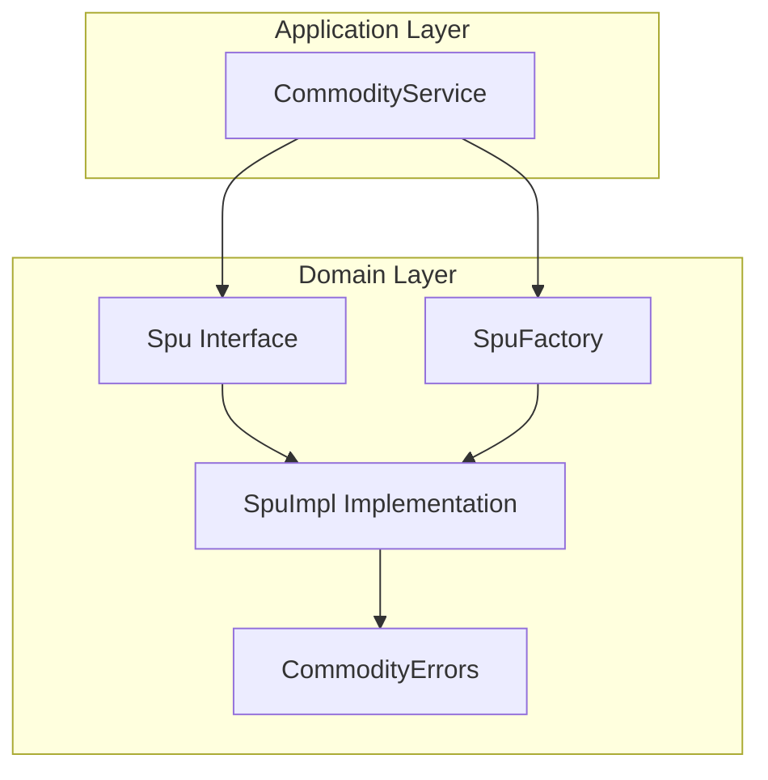
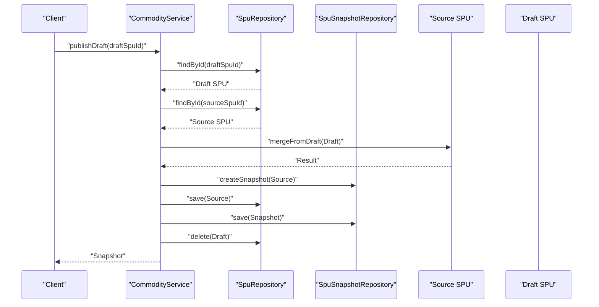
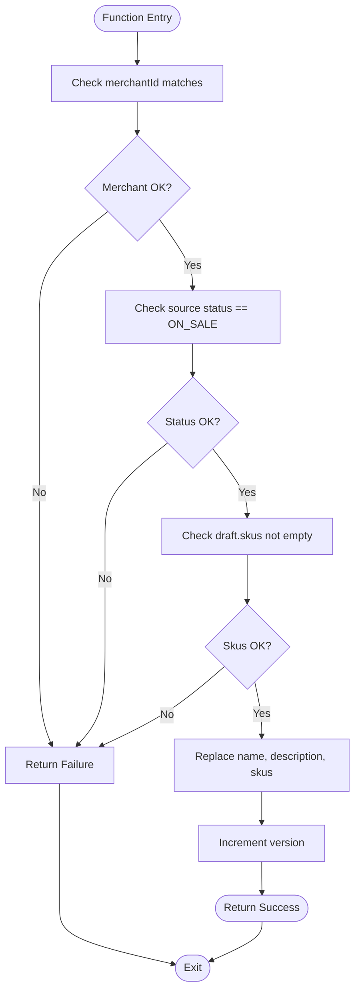
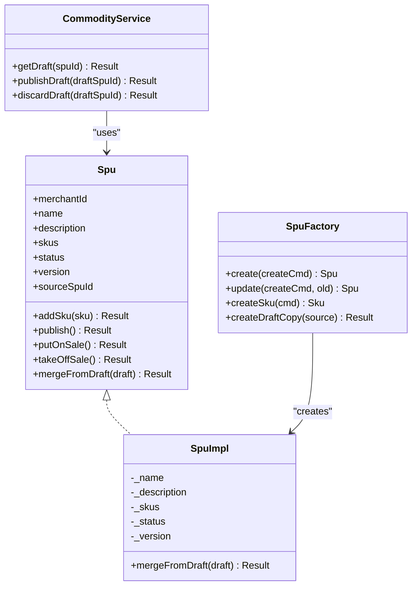
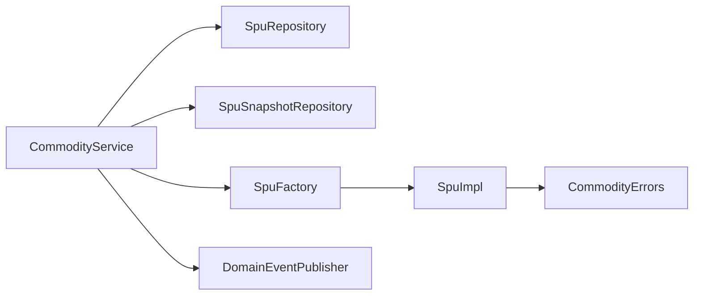

# Merge Operations

<cite>
**Referenced Files in This Document**
- [Spu.kt](file://j-store-goods-domain/src/main/kotlin/com/jstore/goods/domain/commodity/Spu.kt)
- [SpuImpl.kt](file://j-store-goods-domain/src/main/kotlin/com/jstore/goods/domain/commodity/SpuImpl.kt)
- [CommodityService.kt](file://j-store-goods-application/src/main/kotlin/com/jstore/goods/service/CommodityService.kt)
- [SpuFactory.kt](file://j-store-goods-domain/src/main/kotlin/com/jstore/goods/domain/commodity/SpuFactory.kt)
- [CommodityErrors.kt](file://j-store-goods-domain/src/main/kotlin/com/jstore/goods/domain/commodity/CommodityErrors.kt)
- [MergeFromDraftPropertyTest.kt](file://j-store-goods-domain/src/test/kotlin/com/jstore/goods/domain/commodity/MergeFromDraftPropertyTest.kt)
- [MergeFromDraftStatusGuardPropertyTest.kt](file://j-store-goods-domain/src/test/kotlin/com/jstore/goods/domain/commodity/MergeFromDraftStatusGuardPropertyTest.kt)
</cite>

## Table of Contents
1. [Introduction](#introduction)
2. [Project Structure](#project-structure)
3. [Core Components](#core-components)
4. [Architecture Overview](#architecture-overview)
5. [Detailed Component Analysis](#detailed-component-analysis)
6. [Dependency Analysis](#dependency-analysis)
7. [Performance Considerations](#performance-considerations)
8. [Troubleshooting Guide](#troubleshooting-guide)
9. [Conclusion](#conclusion)

## Introduction
This document explains the merge operations in the draft workflow for commodity (SPU) management. It focuses on how draft changes are merged back into the original product, conflict detection and resolution strategies, data integrity preservation, version control behavior, and rollback semantics. The implementation is centered around a domain method that performs an atomic replacement of core fields and SKU list, guarded by strict preconditions to ensure safe merges only against live products.

## Project Structure
The merge functionality spans the goods domain and application layers:
- Domain layer defines the SPU aggregate interface and its implementation, including the merge operation and state/version handling.
- Application layer orchestrates the draft lifecycle: retrieving or creating a draft copy, merging it back to the source, persisting snapshots, and deleting the draft.

**Diagram sources**
- [Spu.kt](file://j-store-goods-domain/src/main/kotlin/com/jstore/goods/domain/commodity/Spu.kt)
- [SpuImpl.kt](file://j-store-goods-domain/src/main/kotlin/com/jstore/goods/domain/commodity/SpuImpl.kt)
- [SpuFactory.kt](file://j-store-goods-domain/src/main/kotlin/com/jstore/goods/domain/commodity/SpuFactory.kt)
- [CommodityErrors.kt](file://j-store-goods-domain/src/main/kotlin/com/jstore/goods/domain/commodity/CommodityErrors.kt)
- [CommodityService.kt](file://j-store-goods-application/src/main/kotlin/com/jstore/goods/service/CommodityService.kt)

**Section sources**
- [Spu.kt](file://j-store-goods-domain/src/main/kotlin/com/jstore/goods/domain/commodity/Spu.kt)
- [SpuImpl.kt](file://j-store-goods-domain/src/main/kotlin/com/jstore/goods/domain/commodity/SpuImpl.kt)
- [SpuFactory.kt](file://j-store-goods-domain/src/main/kotlin/com/jstore/goods/domain/commodity/SpuFactory.kt)
- [CommodityService.kt](file://j-store-goods-application/src/main/kotlin/com/jstore/goods/service/CommodityService.kt)
- [CommodityErrors.kt](file://j-store-goods-domain/src/main/kotlin/com/jstore/goods/domain/commodity/CommodityErrors.kt)

## Core Components
- Spu interface declares the merge operation alongside other domain behaviors like publish, putOnSale, takeOffSale, and SKU management.
- SpuImpl implements mergeFromDraft with strict guards: merchant identity check, ON_SALE status guard, non-empty SKU requirement, field replacement, and version increment.
- CommodityService orchestrates the draft lifecycle: getDraft (idempotent), publishDraft (merge + snapshot + delete), discardDraft (delete).
- SpuFactory creates draft copies from ON_SALE sources, preserving merchant identity, initial fields, and linking via sourceSpuId.
- CommodityErrors centralizes error codes used across validation and merge flows.

**Section sources**
- [Spu.kt](file://j-store-goods-domain/src/main/kotlin/com/jstore/goods/domain/commodity/Spu.kt)
- [SpuImpl.kt](file://j-store-goods-domain/src/main/kotlin/com/jstore/goods/domain/commodity/SpuImpl.kt)
- [CommodityService.kt](file://j-store-goods-application/src/main/kotlin/com/jstore/goods/service/CommodityService.kt)
- [SpuFactory.kt](file://j-store-goods-domain/src/main/kotlin/com/jstore/goods/domain/commodity/SpuFactory.kt)
- [CommodityErrors.kt](file://j-store-goods-domain/src/main/kotlin/com/jstore/goods/domain/commodity/CommodityErrors.kt)

## Architecture Overview
The merge workflow follows a clear sequence:
- Retrieve or create a draft copy linked to the source SPU.
- Validate and execute the domain-level merge on the source SPU.
- Create a new snapshot reflecting the merged state.
- Persist both source and snapshot, then delete the draft.
- Publish pending domain events.

**Diagram sources**
- [CommodityService.kt](file://j-store-goods-application/src/main/kotlin/com/jstore/goods/service/CommodityService.kt)
- [SpuImpl.kt](file://j-store-goods-domain/src/main/kotlin/com/jstore/goods/domain/commodity/SpuImpl.kt)

## Detailed Component Analysis

### mergeFromDraft Implementation
The merge operation replaces name, description, and SKU list on the source SPU, increments version, and preserves status. Precondition checks enforce:
- Merchant identity must match between source and draft.
- Source must be ON_SALE.
- Draft must contain at least one SKU.

If any precondition fails, the operation returns a failure without mutating state. On success, the source’s version is incremented atomically within the same transaction boundary managed by the repository save call.

**Diagram sources**
- [SpuImpl.kt](file://j-store-goods-domain/src/main/kotlin/com/jstore/goods/domain/commodity/SpuImpl.kt)

**Section sources**
- [SpuImpl.kt](file://j-store-goods-domain/src/main/kotlin/com/jstore/goods/domain/commodity/SpuImpl.kt)
- [CommodityErrors.kt](file://j-store-goods-domain/src/main/kotlin/com/jstore/goods/domain/commodity/CommodityErrors.kt)

### Conflict Detection and Resolution
Conflict detection is enforced through explicit preconditions:
- Merchant mismatch prevents cross-merchant merges.
- Non-ON_SALE target prevents unsafe merges.
- Empty draft SKU list prevents publishing incomplete drafts.

Resolution strategy:
- Fail-fast with descriptive BusinessError codes.
- No partial mutation occurs; all fields remain unchanged on failure.
- Successful merge performs an atomic replacement of fields and increments version.

There is no automatic conflict resolution beyond these guards; conflicts result in immediate rejection.

**Section sources**
- [SpuImpl.kt](file://j-store-goods-domain/src/main/kotlin/com/jstore/goods/domain/commodity/SpuImpl.kt)
- [CommodityErrors.kt](file://j-store-goods-domain/src/main/kotlin/com/jstore/goods/domain/commodity/CommodityErrors.kt)

### Data Integrity Preservation Mechanisms
- State guards ensure merges only occur when the source is ON_SALE, preventing unintended modifications to inactive items.
- Merchant identity enforcement ensures cross-tenant safety.
- Version increment guarantees observable change and supports optimistic concurrency at higher layers if needed.
- Snapshot creation after merge captures the post-merge state for read paths and auditability.
- Draft deletion after successful merge eliminates stale working copies.

**Section sources**
- [SpuImpl.kt](file://j-store-goods-domain/src/main/kotlin/com/jstore/goods/domain/commodity/SpuImpl.kt)
- [CommodityService.kt](file://j-store-goods-application/src/main/kotlin/com/jstore/goods/service/CommodityService.kt)

### Version Control Aspects
- Each successful merge increments the source SPU’s version.
- Snapshot creation uses the current state to produce a consistent view.
- The draft copy retains the source’s version at creation time, enabling later comparison if required.

**Section sources**
- [SpuImpl.kt](file://j-store-goods-domain/src/main/kotlin/com/jstore/goods/domain/commodity/SpuImpl.kt)
- [SpuFactory.kt](file://j-store-goods-domain/src/main/kotlin/com/jstore/goods/domain/commodity/SpuFactory.kt)

### Rollback Capabilities
- In-memory mutations are guarded by early failures; no partial state changes occur on invalid inputs.
- Persistence is performed within a single transactional boundary orchestrated by the service and repositories. If persistence fails, the entire operation rolls back.
- There is no explicit “undo” operation; rollback relies on transactional semantics.

**Section sources**
- [CommodityService.kt](file://j-store-goods-application/src/main/kotlin/com/jstore/goods/service/CommodityService.kt)
- [SpuImpl.kt](file://j-store-goods-domain/src/main/kotlin/com/jstore/goods/domain/commodity/SpuImpl.kt)

### Concrete Merge Scenarios and Examples
- Valid merge: Source ON_SALE, matching merchant, draft has SKUs → fields replaced, version incremented, snapshot created, draft deleted.
- Invalid target status: Source OFF_SALE or DRAFT → merge rejected, state unchanged.
- Cross-merchant draft: Merchant IDs differ → merge rejected, state unchanged.
- Empty draft SKUs: Draft contains no SKUs → merge rejected, state unchanged.

These scenarios are validated by property tests asserting correct behavior and immutability on failure.

**Section sources**
- [MergeFromDraftPropertyTest.kt](file://j-store-goods-domain/src/test/kotlin/com/jstore/goods/domain/commodity/MergeFromDraftPropertyTest.kt)
- [MergeFromDraftStatusGuardPropertyTest.kt](file://j-store-goods-domain/src/test/kotlin/com/jstore/goods/domain/commodity/MergeFromDraftStatusGuardPropertyTest.kt)

### Class Relationships

**Diagram sources**
- [Spu.kt](file://j-store-goods-domain/src/main/kotlin/com/jstore/goods/domain/commodity/Spu.kt)
- [SpuImpl.kt](file://j-store-goods-domain/src/main/kotlin/com/jstore/goods/domain/commodity/SpuImpl.kt)
- [SpuFactory.kt](file://j-store-goods-domain/src/main/kotlin/com/jstore/goods/domain/commodity/SpuFactory.kt)
- [CommodityService.kt](file://j-store-goods-application/src/main/kotlin/com/jstore/goods/service/CommodityService.kt)

## Dependency Analysis
- CommodityService depends on SpuRepository, SpuSnapshotRepository, SpuFactory, and DomainEventPublisher to orchestrate the draft lifecycle.
- SpuImpl depends on CommodityErrors for validation outcomes.
- SpuFactory provides creation utilities, including draft copy generation with proper linkage to the source.

**Diagram sources**
- [CommodityService.kt](file://j-store-goods-application/src/main/kotlin/com/jstore/goods/service/CommodityService.kt)
- [SpuImpl.kt](file://j-store-goods-domain/src/main/kotlin/com/jstore/goods/domain/commodity/SpuImpl.kt)
- [SpuFactory.kt](file://j-store-goods-domain/src/main/kotlin/com/jstore/goods/domain/commodity/SpuFactory.kt)
- [CommodityErrors.kt](file://j-store-goods-domain/src/main/kotlin/com/jstore/goods/domain/commodity/CommodityErrors.kt)

**Section sources**
- [CommodityService.kt](file://j-store-goods-application/src/main/kotlin/com/jstore/goods/service/CommodityService.kt)
- [SpuImpl.kt](file://j-store-goods-domain/src/main/kotlin/com/jstore/goods/domain/commodity/SpuImpl.kt)
- [SpuFactory.kt](file://j-store-goods-domain/src/main/kotlin/com/jstore/goods/domain/commodity/SpuFactory.kt)
- [CommodityErrors.kt](file://j-store-goods-domain/src/main/kotlin/com/jstore/goods/domain/commodity/CommodityErrors.kt)

## Performance Considerations
- Field replacement and SKU list clearing/rebuilding are O(n) with respect to SKU count; acceptable for typical catalog sizes.
- Version increment is constant-time.
- Snapshot creation may involve serialization and storage; ensure efficient snapshot factories and repositories.
- Avoid unnecessary draft retrievals; the getDraft operation is idempotent and caches existing drafts.

[No sources needed since this section provides general guidance]

## Troubleshooting Guide
Common issues and resolutions:
- Merge rejected due to non-ON_SALE target: Ensure the source SPU is ON_SALE before attempting merge.
- Cross-merchant draft detected: Verify draft belongs to the same merchant as the source.
- Draft has no SKUs: Add at least one SKU to the draft before publishing.
- Direct edits to ON_SALE items are blocked: Use the draft workflow instead.

Relevant error codes:
- INVALID_STATUS_TRANSITION
- DRAFT_NO_SKU_FOR_PUBLISH
- ON_SALE_DIRECT_EDIT_REJECTED
- NOT_A_DRAFT_COPY
- ONLY_ON_SALE_NEEDS_DRAFT

**Section sources**
- [CommodityErrors.kt](file://j-store-goods-domain/src/main/kotlin/com/jstore/goods/domain/commodity/CommodityErrors.kt)
- [CommodityService.kt](file://j-store-goods-application/src/main/kotlin/com/jstore/goods/service/CommodityService.kt)

## Conclusion
The merge operation in the draft workflow enforces strict preconditions to protect data integrity and prevent unsafe modifications. It performs an atomic replacement of core fields and SKU lists, increments version, and produces a snapshot while removing the draft. Conflicts are detected early and resolved by failing fast with clear error codes. Rollbacks rely on transactional boundaries, ensuring consistency. Property tests validate correctness and immutability on failure, providing confidence in the implementation.