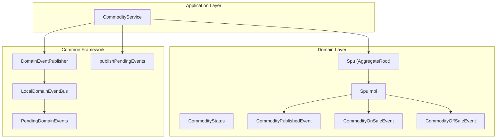
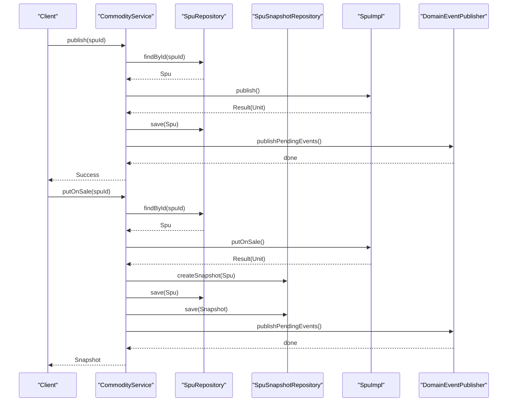
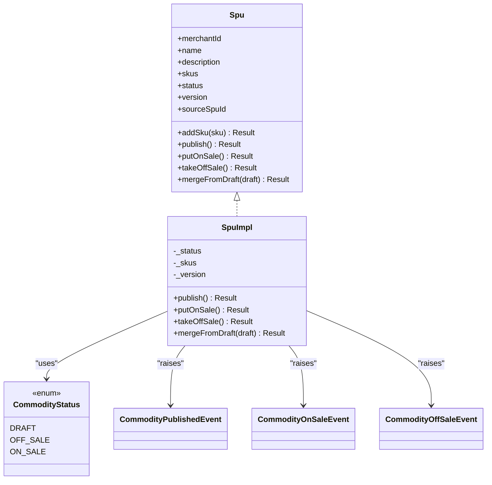
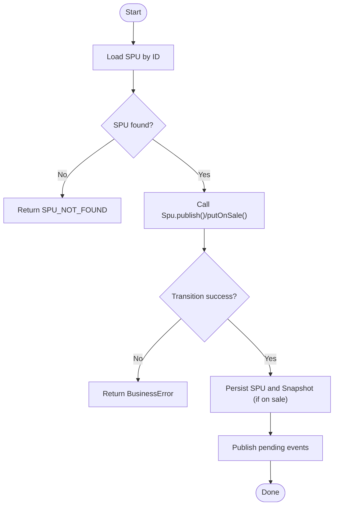
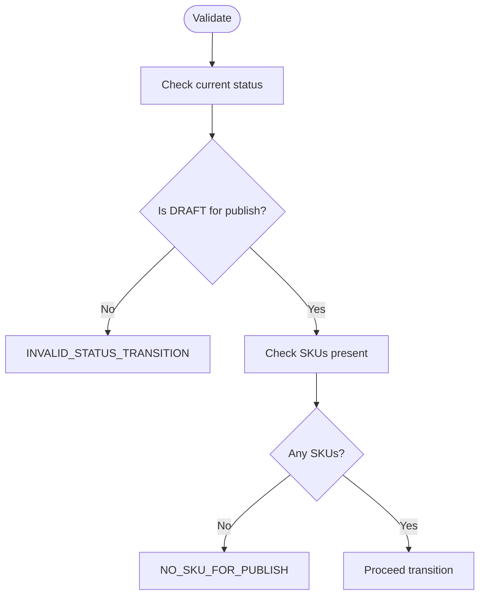
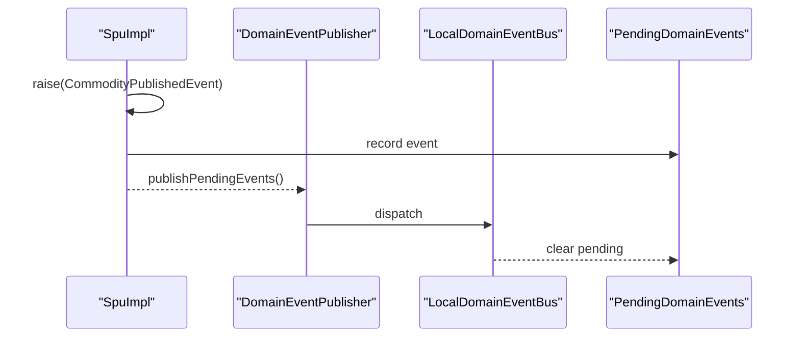
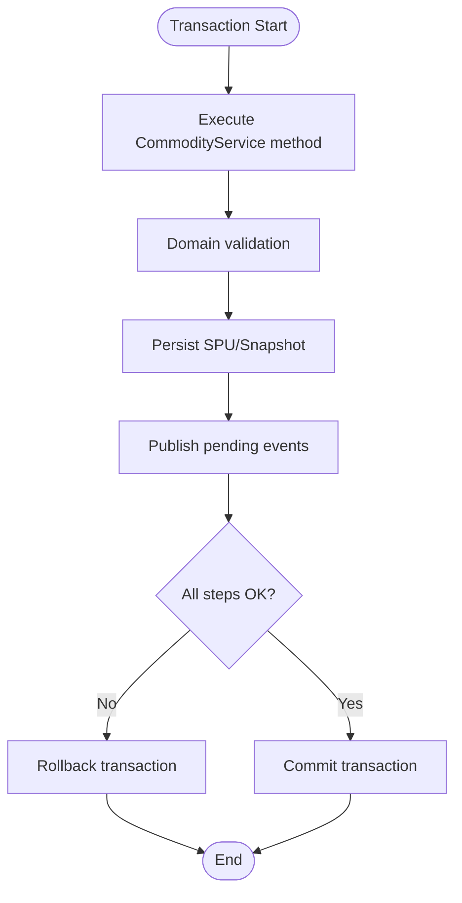
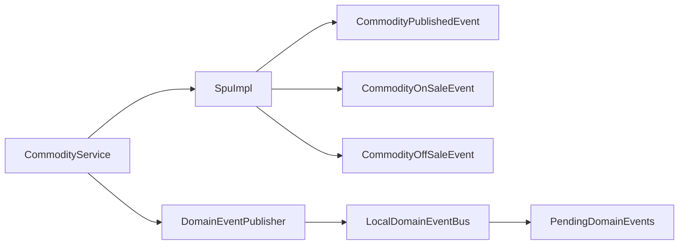

# Publishing Workflow

<cite>
**Referenced Files in This Document**
- [CommodityService.kt](file://j-store-goods-application/src/main/kotlin/com/jstore/goods/service/CommodityService.kt)
- [Spu.kt](file://j-store-goods-domain/src/main/kotlin/com/jstore/goods/domain/commodity/Spu.kt)
- [SpuImpl.kt](file://j-store-goods-domain/src/main/kotlin/com/jstore/goods/domain/commodity/SpuImpl.kt)
- [CommodityStatus.kt](file://j-store-goods-domain/src/main/kotlin/com/jstore/goods/domain/commodity/CommodityStatus.kt)
- [CommodityErrors.kt](file://j-store-goods-domain/src/main/kotlin/com/jstore/goods/domain/commodity/CommodityErrors.kt)
- [CommodityPublishedEvent.kt](file://j-store-goods-domain/src/main/kotlin/com/jstore/goods/domain/commodity/event/CommodityPublishedEvent.kt)
- [CommodityOnSaleEvent.kt](file://j-store-goods-domain/src/main/kotlin/com/jstore/goods/domain/commodity/event/CommodityOnSaleEvent.kt)
- [CommodityOffSaleEvent.kt](file://j-store-goods-domain/src/main/kotlin/com/jstore/goods/domain/commodity/event/CommodityOffSaleEvent.kt)
- [TransactionalCommodityUseCase.kt](file://j-store-goods-boot/src/main/kotlin/com/jstore/goods/config/TransactionalCommodityUseCase.kt)
- [DomainEventPublisher.kt](file://j-store-common-core/src/main/kotlin/com/jstore/common/framework/event/DomainEventPublisher.kt)
- [LocalDomainEventBus.kt](file://j-store-common-core/src/main/kotlin/com/jstore/common/framework/event/LocalDomainEventBus.kt)
- [PendingDomainEvents.kt](file://j-store-common-core/src/main/kotlin/com/jstore/common/framework/event/PendingDomainEvents.kt)
- [publishPendingEvents.kt](file://j-store-common-core/src/main/kotlin/com/jstore/common/framework/event/outbox/publishPendingEvents.kt)
</cite>

## Table of Contents
1. [Introduction](#introduction)
2. [Project Structure](#project-structure)
3. [Core Components](#core-components)
4. [Architecture Overview](#architecture-overview)
5. [Detailed Component Analysis](#detailed-component-analysis)
6. [Dependency Analysis](#dependency-analysis)
7. [Performance Considerations](#performance-considerations)
8. [Troubleshooting Guide](#troubleshooting-guide)
9. [Conclusion](#conclusion)

## Introduction
This document explains the publishing workflow that transforms product drafts into live products. It covers validation rules, event emission, transactional boundaries, and integration points with inventory systems via domain events. The focus is on the publish flow from draft to off-sale and then to on-sale, including snapshot creation and event publication.

## Project Structure
The publishing workflow spans three layers:
- Application layer orchestrates use cases (load aggregate, mutate state, persist, emit events).
- Domain layer enforces business rules and emits domain events.
- Common framework provides event publishing utilities and outbox helpers.

**Diagram sources**
- [CommodityService.kt:69-94](file://j-store-goods-application/src/main/kotlin/com/jstore/goods/service/CommodityService.kt#L69-L94)
- [Spu.kt:16-52](file://j-store-goods-domain/src/main/kotlin/com/jstore/goods/domain/commodity/Spu.kt#L16-L52)
- [SpuImpl.kt:54-88](file://j-store-goods-domain/src/main/kotlin/com/jstore/goods/domain/commodity/SpuImpl.kt#L54-L88)
- [CommodityStatus.kt:3-10](file://j-store-goods-domain/src/main/kotlin/com/jstore/goods/domain/commodity/CommodityStatus.kt#L3-L10)
- [CommodityPublishedEvent.kt:9-19](file://j-store-goods-domain/src/main/kotlin/com/jstore/goods/domain/commodity/event/CommodityPublishedEvent.kt#L9-L19)
- [CommodityOnSaleEvent.kt:9-20](file://j-store-goods-domain/src/main/kotlin/com/jstore/goods/domain/commodity/event/CommodityOnSaleEvent.kt#L9-L20)
- [CommodityOffSaleEvent.kt:9-19](file://j-store-goods-domain/src/main/kotlin/com/jstore/goods/domain/commodity/event/CommodityOffSaleEvent.kt#L9-L19)
- [DomainEventPublisher.kt](file://j-store-common-core/src/main/kotlin/com/jstore/common/framework/event/DomainEventPublisher.kt)
- [LocalDomainEventBus.kt](file://j-store-common-core/src/main/kotlin/com/jstore/common/framework/event/LocalDomainEventBus.kt)
- [PendingDomainEvents.kt](file://j-store-common-core/src/main/kotlin/com/jstore/common/framework/event/PendingDomainEvents.kt)
- [publishPendingEvents.kt](file://j-store-common-core/src/main/kotlin/com/jstore/common/framework/event/outbox/publishPendingEvents.kt)

**Section sources**
- [CommodityService.kt:69-94](file://j-store-goods-application/src/main/kotlin/com/jstore/goods/service/CommodityService.kt#L69-L94)
- [Spu.kt:16-52](file://j-store-goods-domain/src/main/kotlin/com/jstore/goods/domain/commodity/Spu.kt#L16-L52)
- [SpuImpl.kt:54-88](file://j-store-goods-domain/src/main/kotlin/com/jstore/goods/domain/commodity/SpuImpl.kt#L54-L88)

## Core Components
- CommodityService: Application use case that loads SPU, applies state transitions, persists changes, creates snapshots when going on sale, and publishes pending domain events.
- Spu interface and SpuImpl: Aggregate root defining state transitions (publish, putOnSale, takeOffSale) and validation rules; raises domain events upon successful transitions.
- Events: CommodityPublishedEvent, CommodityOnSaleEvent, CommodityOffSaleEvent carry lifecycle changes for downstream consumers (e.g., inventory).
- Transactional boundary: TransactionalCommodityUseCase wraps use cases in transactions to ensure persistence and event publication are consistent.

Key responsibilities:
- Validation: Status checks, SKU presence, draft/source constraints.
- Persistence: Save SPU and snapshot where applicable.
- Event emission: Raise domain events and publish them via the common framework.

**Section sources**
- [CommodityService.kt:69-94](file://j-store-goods-application/src/main/kotlin/com/jstore/goods/service/CommodityService.kt#L69-L94)
- [SpuImpl.kt:54-88](file://j-store-goods-domain/src/main/kotlin/com/jstore/goods/domain/commodity/SpuImpl.kt#L54-L88)
- [CommodityErrors.kt:5-27](file://j-store-goods-domain/src/main/kotlin/com/jstore/goods/domain/commodity/CommodityErrors.kt#L5-L27)

## Architecture Overview
The publishing workflow consists of two main phases:
- Publish draft to off-sale: Validates draft status and SKU presence, transitions to OFF_SALE, and emits a published event.
- Put on sale: Validates current status, increments version, transitions to ON_SALE, creates a snapshot, persists both, and emits an on-sale event.

**Diagram sources**
- [CommodityService.kt:69-94](file://j-store-goods-application/src/main/kotlin/com/jstore/goods/service/CommodityService.kt#L69-L94)
- [SpuImpl.kt:54-88](file://j-store-goods-domain/src/main/kotlin/com/jstore/goods/domain/commodity/SpuImpl.kt#L54-L88)
- [DomainEventPublisher.kt](file://j-store-common-core/src/main/kotlin/com/jstore/common/framework/event/DomainEventPublisher.kt)

## Detailed Component Analysis

### Spu Domain Model and State Transitions
The Spu aggregate defines the core lifecycle:
- publish(): DRAFT → OFF_SALE with validation and event emission.
- putOnSale(): OFF_SALE → ON_SALE with version increment and event emission.
- takeOffSale(): ON_SALE → OFF_SALE with event emission.

**Diagram sources**
- [Spu.kt:16-52](file://j-store-goods-domain/src/main/kotlin/com/jstore/goods/domain/commodity/Spu.kt#L16-L52)
- [SpuImpl.kt:54-88](file://j-store-goods-domain/src/main/kotlin/com/jstore/goods/domain/commodity/SpuImpl.kt#L54-L88)
- [CommodityStatus.kt:3-10](file://j-store-goods-domain/src/main/kotlin/com/jstore/goods/domain/commodity/CommodityStatus.kt#L3-L10)
- [CommodityPublishedEvent.kt:9-19](file://j-store-goods-domain/src/main/kotlin/com/jstore/goods/domain/commodity/event/CommodityPublishedEvent.kt#L9-L19)
- [CommodityOnSaleEvent.kt:9-20](file://j-store-goods-domain/src/main/kotlin/com/jstore/goods/domain/commodity/event/CommodityOnSaleEvent.kt#L9-L20)
- [CommodityOffSaleEvent.kt:9-19](file://j-store-goods-domain/src/main/kotlin/com/jstore/goods/domain/commodity/event/CommodityOffSaleEvent.kt#L9-L19)

**Section sources**
- [Spu.kt:16-52](file://j-store-goods-domain/src/main/kotlin/com/jstore/goods/domain/commodity/Spu.kt#L16-L52)
- [SpuImpl.kt:54-88](file://j-store-goods-domain/src/main/kotlin/com/jstore/goods/domain/commodity/SpuImpl.kt#L54-L88)

### CommodityService Orchestration
CommodityService coordinates:
- Loading the SPU by ID.
- Invoking domain methods for state transitions.
- Persisting changes and snapshots.
- Publishing pending domain events.

**Diagram sources**
- [CommodityService.kt:69-94](file://j-store-goods-application/src/main/kotlin/com/jstore/goods/service/CommodityService.kt#L69-L94)

**Section sources**
- [CommodityService.kt:69-94](file://j-store-goods-application/src/main/kotlin/com/jstore/goods/service/CommodityService.kt#L69-L94)

### Validation Rules and Error Handling
Validation occurs at multiple levels:
- Domain-level guards enforce allowed transitions and preconditions (e.g., draft-only publish, SKU presence).
- Application-level checks handle not-found scenarios and return typed errors.

Key validations:
- publish(): Requires DRAFT status and non-empty SKUs.
- putOnSale(): Rejects DRAFT and already ON_SALE states; increments version.
- takeOffSale(): Requires ON_SALE state.
- Errors include invalid transitions, missing SKUs, and draft-specific constraints.

**Diagram sources**
- [SpuImpl.kt:54-66](file://j-store-goods-domain/src/main/kotlin/com/jstore/goods/domain/commodity/SpuImpl.kt#L54-L66)
- [CommodityErrors.kt:5-27](file://j-store-goods-domain/src/main/kotlin/com/jstore/goods/domain/commodity/CommodityErrors.kt#L5-L27)

**Section sources**
- [SpuImpl.kt:54-88](file://j-store-goods-domain/src/main/kotlin/com/jstore/goods/domain/commodity/SpuImpl.kt#L54-L88)
- [CommodityErrors.kt:5-27](file://j-store-goods-domain/src/main/kotlin/com/jstore/goods/domain/commodity/CommodityErrors.kt#L5-L27)

### Event Emission and Outbox Integration
Domain events are raised within the aggregate and published through the common framework:
- CommodityPublishedEvent emitted on publish().
- CommodityOnSaleEvent emitted on putOnSale(), includes snapshotVersion.
- CommodityOffSaleEvent emitted on takeOffSale().

Outbox pattern ensures reliable delivery:
- PendingDomainEvents collects events during the transaction.
- publishPendingEvents flushes events after persistence succeeds.

**Diagram sources**
- [SpuImpl.kt:54-88](file://j-store-goods-domain/src/main/kotlin/com/jstore/goods/domain/commodity/SpuImpl.kt#L54-L88)
- [DomainEventPublisher.kt](file://j-store-common-core/src/main/kotlin/com/jstore/common/framework/event/DomainEventPublisher.kt)
- [LocalDomainEventBus.kt](file://j-store-common-core/src/main/kotlin/com/jstore/common/framework/event/LocalDomainEventBus.kt)
- [PendingDomainEvents.kt](file://j-store-common-core/src/main/kotlin/com/jstore/common/framework/event/PendingDomainEvents.kt)
- [publishPendingEvents.kt](file://j-store-common-core/src/main/kotlin/com/jstore/common/framework/event/outbox/publishPendingEvents.kt)

**Section sources**
- [CommodityPublishedEvent.kt:9-19](file://j-store-goods-domain/src/main/kotlin/com/jstore/goods/domain/commodity/event/CommodityPublishedEvent.kt#L9-L19)
- [CommodityOnSaleEvent.kt:9-20](file://j-store-goods-domain/src/main/kotlin/com/jstore/goods/domain/commodity/event/CommodityOnSaleEvent.kt#L9-L20)
- [CommodityOffSaleEvent.kt:9-19](file://j-store-goods-domain/src/main/kotlin/com/jstore/goods/domain/commodity/event/CommodityOffSaleEvent.kt#L9-L19)

### Transactional Boundaries and Failure Recovery
- TransactionalCommodityUseCase wraps use cases to ensure atomicity across repository saves and event publication.
- If any step fails (validation, persistence, or event publishing), the transaction rolls back, preventing partial state.
- On success, pending events are flushed to the bus, ensuring downstream consumers receive consistent updates.

**Diagram sources**
- [TransactionalCommodityUseCase.kt](file://j-store-goods-boot/src/main/kotlin/com/jstore/goods/config/TransactionalCommodityUseCase.kt)
- [CommodityService.kt:69-94](file://j-store-goods-application/src/main/kotlin/com/jstore/goods/service/CommodityService.kt#L69-L94)

**Section sources**
- [TransactionalCommodityUseCase.kt](file://j-store-goods-boot/src/main/kotlin/com/jstore/goods/config/TransactionalCommodityUseCase.kt)
- [CommodityService.kt:69-94](file://j-store-goods-application/src/main/kotlin/com/jstore/goods/service/CommodityService.kt#L69-L94)

### Inventory System Integration
Inventory systems integrate via domain events:
- CommodityOnSaleEvent carries spuId and snapshotVersion, enabling inventory to prepare stock reservations or allocations based on the latest snapshot.
- CommodityOffSaleEvent signals removal from active sales, allowing inventory to release reserved stock.
- CommodityPublishedEvent indicates a new off-sale product, useful for catalog synchronization.

Consumers should be idempotent and handle retries safely using event identifiers.

**Section sources**
- [CommodityOnSaleEvent.kt:9-20](file://j-store-goods-domain/src/main/kotlin/com/jstore/goods/domain/commodity/event/CommodityOnSaleEvent.kt#L9-L20)
- [CommodityOffSaleEvent.kt:9-19](file://j-store-goods-domain/src/main/kotlin/com/jstore/goods/domain/commodity/event/CommodityOffSaleEvent.kt#L9-L19)
- [CommodityPublishedEvent.kt:9-19](file://j-store-goods-domain/src/main/kotlin/com/jstore/goods/domain/commodity/event/CommodityPublishedEvent.kt#L9-L19)

## Dependency Analysis

**Diagram sources**
- [CommodityService.kt:69-94](file://j-store-goods-application/src/main/kotlin/com/jstore/goods/service/CommodityService.kt#L69-L94)
- [SpuImpl.kt:54-88](file://j-store-goods-domain/src/main/kotlin/com/jstore/goods/domain/commodity/SpuImpl.kt#L54-L88)
- [DomainEventPublisher.kt](file://j-store-common-core/src/main/kotlin/com/jstore/common/framework/event/DomainEventPublisher.kt)
- [LocalDomainEventBus.kt](file://j-store-common-core/src/main/kotlin/com/jstore/common/framework/event/LocalDomainEventBus.kt)
- [PendingDomainEvents.kt](file://j-store-common-core/src/main/kotlin/com/jstore/common/framework/event/PendingDomainEvents.kt)

**Section sources**
- [CommodityService.kt:69-94](file://j-store-goods-application/src/main/kotlin/com/jstore/goods/service/CommodityService.kt#L69-L94)
- [SpuImpl.kt:54-88](file://j-store-goods-domain/src/main/kotlin/com/jstore/goods/domain/commodity/SpuImpl.kt#L54-L88)

## Performance Considerations
- Minimize object churn by reusing aggregates within a single transaction.
- Batch snapshot creation only when necessary (on sale transitions).
- Ensure event publishing is lightweight; avoid heavy I/O in event handlers.
- Use indexes on frequently queried fields (e.g., spuId) for fast lookups.

[No sources needed since this section provides general guidance]

## Troubleshooting Guide
Common issues and resolutions:
- Invalid status transition: Verify current state before calling publish/putOnSale/takeOffSale.
- Missing SKUs: Ensure at least one SKU exists before publishing.
- Not a draft copy: For draft merge flows, confirm sourceSpuId is set.
- Already on/off sale: Guard against redundant operations.

Error references:
- INVALID_STATUS_TRANSITION, NO_SKU_FOR_PUBLISH, DRAFT_CANNOT_ON_SALE, ALREADY_ON_SALE, ALREADY_OFF_SALE, NOT_A_DRAFT_COPY, ONLY_ON_SALE_NEEDS_DRAFT, DRAFT_NO_SKU_FOR_PUBLISH.

**Section sources**
- [CommodityErrors.kt:5-27](file://j-store-goods-domain/src/main/kotlin/com/jstore/goods/domain/commodity/CommodityErrors.kt#L5-L27)
- [SpuImpl.kt:54-88](file://j-store-goods-domain/src/main/kotlin/com/jstore/goods/domain/commodity/SpuImpl.kt#L54-L88)

## Conclusion
The publishing workflow enforces strict state transitions and validation within the Spu aggregate, persists changes atomically under transactional boundaries, and reliably emits domain events for downstream integrations like inventory systems. By following the documented flows and error handling strategies, teams can confidently manage draft-to-live transformations while maintaining data consistency and system reliability.