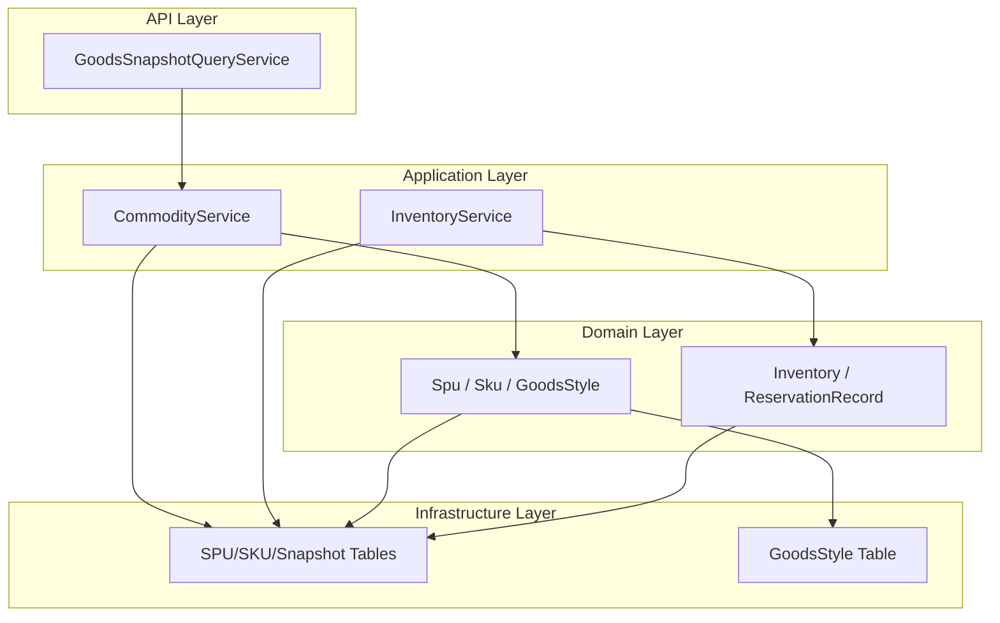
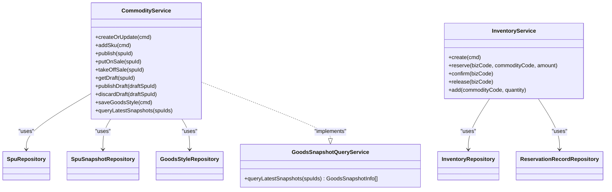
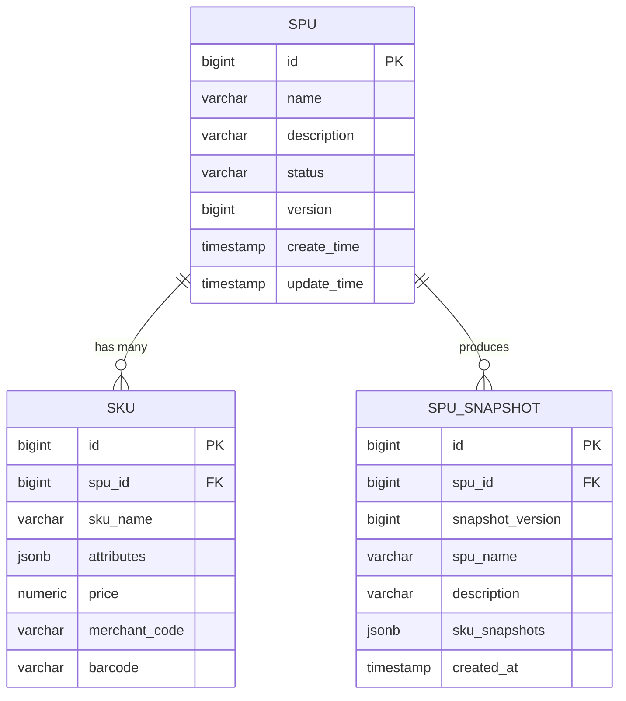
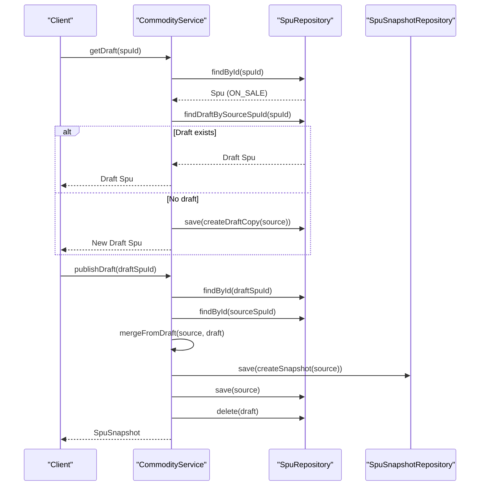
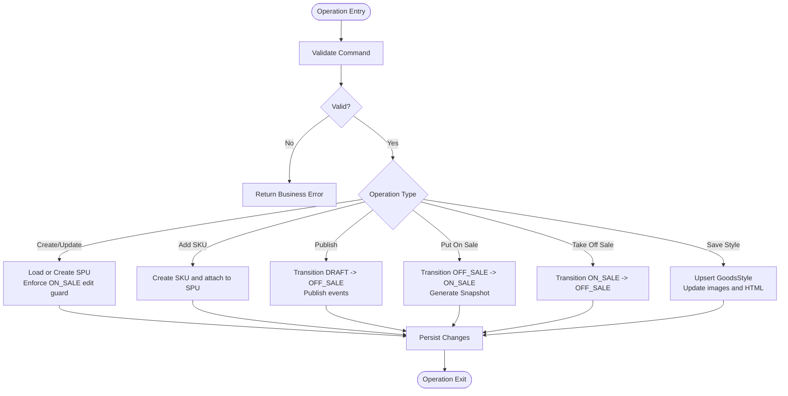
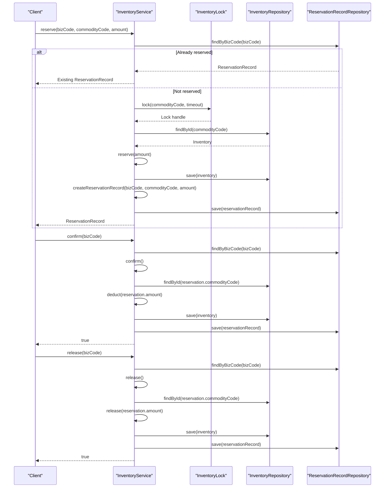
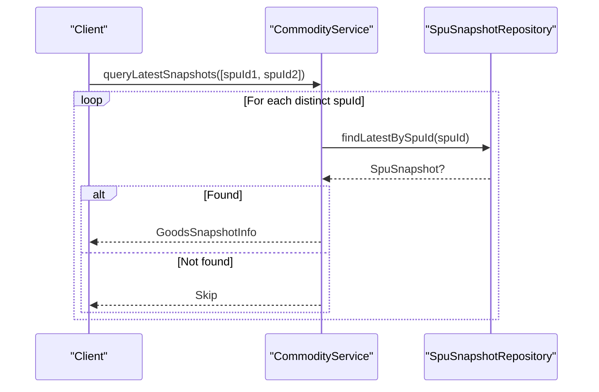
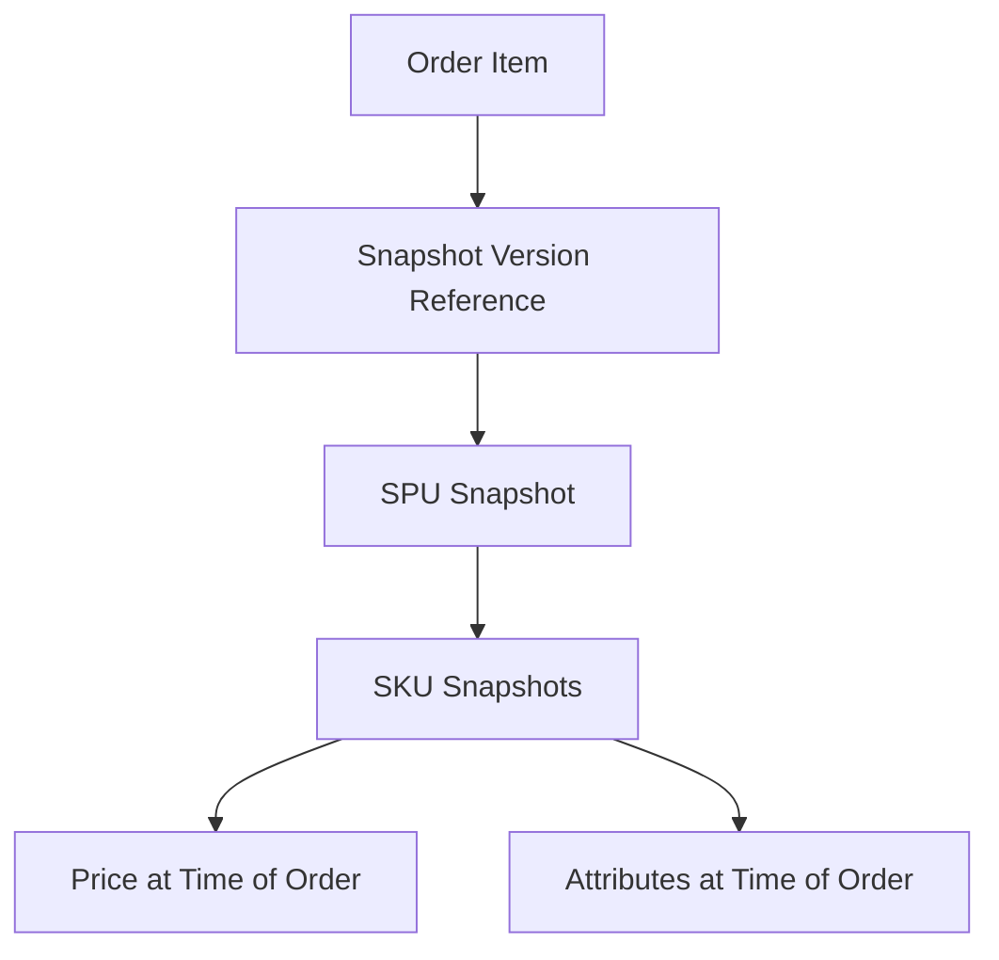

# Goods Catalog Module

<cite>
**Referenced Files in This Document**
- [CommodityService.kt](file://j-store-goods-application/src/main/kotlin/com/jstore/goods/service/CommodityService.kt)
- [CommodityUseCase.kt](file://j-store-goods-application/src/main/kotlin/com/jstore/goods/service/CommodityUseCase.kt)
- [InventoryService.kt](file://j-store-goods-application/src/main/kotlin/com/jstore/goods/service/InventoryService.kt)
- [InventoryUseCase.kt](file://j-store-goods-application/src/main/kotlin/com/jstore/goods/service/InventoryUseCase.kt)
- [GoodsSnapshotQueryService.kt](file://j-store-goods-api/src/main/kotlin/com/jstore/goods/api/GoodsSnapshotQueryService.kt)
- [04-goods-spu-sku-snapshot.sql](file://docker/postgres/init/04-goods-spu-sku-snapshot.sql)
- [07-goods-style-sku-code.sql](file://docker/postgres/init/07-goods-style-sku-code.sql)
</cite>

## Table of Contents
1. [Introduction](#introduction)
2. [Project Structure](#project-structure)
3. [Core Components](#core-components)
4. [Architecture Overview](#architecture-overview)
5. [Detailed Component Analysis](#detailed-component-analysis)
6. [Dependency Analysis](#dependency-analysis)
7. [Performance Considerations](#performance-considerations)
8. [Troubleshooting Guide](#troubleshooting-guide)
9. [Conclusion](#conclusion)

## Introduction
This document explains the Goods Catalog module, focusing on:
- SPU/SKU hierarchy design and persistence model
- Draft workflow for editing live goods
- Snapshot generation to decouple product presentation from order history
- Inventory pre-reservation, confirmation, and release mechanisms
- Product publishing workflows and snapshot queries
- Relationship between goods and orders via snapshots
- Performance considerations for large catalogs and inventory synchronization

The content is designed to be accessible to beginners while providing sufficient technical depth for experienced developers.

## Project Structure
The Goods Catalog module spans three layers:
- API layer: defines query interfaces and data structures for snapshots
- Application layer: orchestrates use cases (commodity and inventory)
- Domain and infrastructure layers: encapsulate business logic and persistence



**Diagram sources**
- [CommodityService.kt](file://j-store-goods-application/src/main/kotlin/com/jstore/goods/service/CommodityService.kt)
- [InventoryService.kt](file://j-store-goods-application/src/main/kotlin/com/jstore/goods/service/InventoryService.kt)
- [GoodsSnapshotQueryService.kt](file://j-store-goods-api/src/main/kotlin/com/jstore/goods/api/GoodsSnapshotQueryService.kt)
- [04-goods-spu-sku-snapshot.sql](file://docker/postgres/init/04-goods-spu-sku-snapshot.sql)
- [07-goods-style-sku-code.sql](file://docker/postgres/init/07-goods-style-sku-code.sql)

**Section sources**
- [CommodityService.kt](file://j-store-goods-application/src/main/kotlin/com/jstore/goods/service/CommodityService.kt)
- [InventoryService.kt](file://j-store-goods-application/src/main/kotlin/com/jstore/goods/service/InventoryService.kt)
- [GoodsSnapshotQueryService.kt](file://j-store-goods-api/src/main/kotlin/com/jstore/goods/api/GoodsSnapshotQueryService.kt)
- [04-goods-spu-sku-snapshot.sql](file://docker/postgres/init/04-goods-spu-sku-snapshot.sql)
- [07-goods-style-sku-code.sql](file://docker/postgres/init/07-goods-style-sku-code.sql)

## Core Components
- CommodityService: Implements commodity operations including create/update, SKU management, draft workflow, publish/publish-draft, put-on-sale with snapshot creation, and style management. It also exposes snapshot querying.
- InventoryService: Implements inventory operations including create, reserve, confirm, release, and add stock. Uses a lock abstraction to ensure concurrency safety.
- GoodsSnapshotQueryService: Defines the contract for querying latest snapshots by SPU IDs.

Key responsibilities:
- CommodityService coordinates domain objects and repositories, enforces state transitions, and generates immutable snapshots for order history.
- InventoryService manages stock availability through reservation records and atomic updates under locks.

**Section sources**
- [CommodityService.kt](file://j-store-goods-application/src/main/kotlin/com/jstore/goods/service/CommodityService.kt)
- [CommodityUseCase.kt](file://j-store-goods-application/src/main/kotlin/com/jstore/goods/service/CommodityUseCase.kt)
- [InventoryService.kt](file://j-store-goods-application/src/main/kotlin/com/jstore/goods/service/InventoryService.kt)
- [InventoryUseCase.kt](file://j-store-goods-application/src/main/kotlin/com/jstore/goods/service/InventoryUseCase.kt)
- [GoodsSnapshotQueryService.kt](file://j-store-goods-api/src/main/kotlin/com/jstore/goods/api/GoodsSnapshotQueryService.kt)

## Architecture Overview
The Goods Catalog module follows a layered architecture with clear separation between application orchestration, domain logic, and persistence. Snapshots are generated at key lifecycle points (publish and publish-draft) to ensure order history remains consistent even if product details change later.



**Diagram sources**
- [CommodityService.kt](file://j-store-goods-application/src/main/kotlin/com/jstore/goods/service/CommodityService.kt)
- [InventoryService.kt](file://j-store-goods-application/src/main/kotlin/com/jstore/goods/service/InventoryService.kt)
- [GoodsSnapshotQueryService.kt](file://j-store-goods-api/src/main/kotlin/com/jstore/goods/api/GoodsSnapshotQueryService.kt)

## Detailed Component Analysis

### SPU/SKU Hierarchy Design
- SPU (Standard Product Unit): Represents a product concept with attributes like name, description, status, and version. Status transitions include DRAFT, OFF_SALE, ON_SALE.
- SKU (Stock Keeping Unit): Represents a specific variant of an SPU with attributes such as skuName, attributes (JSON), price, merchant_code, and barcode.
- Snapshot: Immutable record of SPU and SKUs at publish time, used for order history and consistency.

Persistence schema highlights:
- spu table stores core product info and status/version
- sku table stores variant-level details and indexes by spu_id
- spu_snapshot table stores immutable snapshots keyed by spu_id and snapshot_version



**Diagram sources**
- [04-goods-spu-sku-snapshot.sql](file://docker/postgres/init/04-goods-spu-sku-snapshot.sql)
- [07-goods-style-sku-code.sql](file://docker/postgres/init/07-goods-style-sku-code.sql)

**Section sources**
- [04-goods-spu-sku-snapshot.sql](file://docker/postgres/init/04-goods-spu-sku-snapshot.sql)
- [07-goods-style-sku-code.sql](file://docker/postgres/init/07-goods-style-sku-code.sql)

### Draft Workflow Implementation
The draft workflow enables safe editing of live products without disrupting existing orders:
- getDraft: For ON_SALE SPU, returns or creates a draft copy (idempotent).
- publishDraft: Merges draft into source SPU, increments version, generates new snapshot, deletes draft, publishes events.
- discardDraft: Deletes draft without affecting source.



**Diagram sources**
- [CommodityService.kt](file://j-store-goods-application/src/main/kotlin/com/jstore/goods/service/CommodityService.kt)

**Section sources**
- [CommodityService.kt](file://j-store-goods-application/src/main/kotlin/com/jstore/goods/service/CommodityService.kt)

### Commodity Service Operations
Operations include:
- Create/Update SPU: Validates input, prevents direct edits for ON_SALE items, supports both create and update flows.
- Add SKU: Creates SKU within SPU context and persists changes.
- Publish: Transitions SPU from DRAFT to OFF_SALE and publishes pending events.
- Put On Sale: Transitions SPU from OFF_SALE to ON_SALE and generates a snapshot.
- Take Off Sale: Transitions SPU from ON_SALE to OFF_SALE.
- Save Goods Style: Updates main images, detail HTML, and SKU images mapping.



**Diagram sources**
- [CommodityService.kt](file://j-store-goods-application/src/main/kotlin/com/jstore/goods/service/CommodityService.kt)

**Section sources**
- [CommodityService.kt](file://j-store-goods-application/src/main/kotlin/com/jstore/goods/service/CommodityService.kt)
- [CommodityUseCase.kt](file://j-store-goods-application/src/main/kotlin/com/jstore/goods/service/CommodityUseCase.kt)

### Inventory Management System
Inventory operations ensure accurate stock levels with concurrency control:
- Reserve: Idempotency check via bizCode; acquires lock per commodity; deducts tentative stock; creates reservation record with expiry.
- Confirm: Loads reservation record; deducts actual stock; marks reservation confirmed.
- Release: Releases reserved stock; marks reservation released.
- Add: Adds stock with lock protection.



**Diagram sources**
- [InventoryService.kt](file://j-store-goods-application/src/main/kotlin/com/jstore/goods/service/InventoryService.kt)

**Section sources**
- [InventoryService.kt](file://j-store-goods-application/src/main/kotlin/com/jstore/goods/service/InventoryService.kt)
- [InventoryUseCase.kt](file://j-store-goods-application/src/main/kotlin/com/jstore/goods/service/InventoryUseCase.kt)

### Snapshot Generation and Querying
- Snapshot creation occurs during putOnSale and publishDraft to capture current SPU and SKU state.
- Latest snapshot query returns structured data including SPU and SKU snapshots for display and order history.



**Diagram sources**
- [CommodityService.kt](file://j-store-goods-application/src/main/kotlin/com/jstore/goods/service/CommodityService.kt)
- [GoodsSnapshotQueryService.kt](file://j-store-goods-api/src/main/kotlin/com/jstore/goods/api/GoodsSnapshotQueryService.kt)

**Section sources**
- [CommodityService.kt](file://j-store-goods-application/src/main/kotlin/com/jstore/goods/service/CommodityService.kt)
- [GoodsSnapshotQueryService.kt](file://j-store-goods-api/src/main/kotlin/com/jstore/goods/api/GoodsSnapshotQueryService.kt)

### Goods and Orders Through Snapshots
- Orders reference snapshot versions to maintain historical accuracy of product details and pricing.
- Snapshot tables store immutable data that can be queried independently of live product changes.



[No sources needed since this diagram shows conceptual workflow, not actual code structure]

## Dependency Analysis
The Goods Catalog module has clear dependencies:
- CommodityService depends on SpuRepository, SpuSnapshotRepository, GoodsStyleRepository, and domain factories.
- InventoryService depends on InventoryRepository, ReservationRecordRepository, and InventoryLock.
- GoodsSnapshotQueryService is implemented by CommodityService to expose snapshot queries.

```mermaid
graph TB
CommodityService --> SpuRepository
CommodityService --> SpuSnapshotRepository
CommodityService --> GoodsStyleRepository
InventoryService --> InventoryRepository
InventoryService --> ReservationRecordRepository
InventoryService --> InventoryLock
CommodityService ..|> GoodsSnapshotQueryService
```

**Diagram sources**
- [CommodityService.kt](file://j-store-goods-application/src/main/kotlin/com/jstore/goods/service/CommodityService.kt)
- [InventoryService.kt](file://j-store-goods-application/src/main/kotlin/com/jstore/goods/service/InventoryService.kt)
- [GoodsSnapshotQueryService.kt](file://j-store-goods-api/src/main/kotlin/com/jstore/goods/api/GoodsSnapshotQueryService.kt)

**Section sources**
- [CommodityService.kt](file://j-store-goods-application/src/main/kotlin/com/jstore/goods/service/CommodityService.kt)
- [InventoryService.kt](file://j-store-goods-application/src/main/kotlin/com/jstore/goods/service/InventoryService.kt)
- [GoodsSnapshotQueryService.kt](file://j-store-goods-api/src/main/kotlin/com/jstore/goods/api/GoodsSnapshotQueryService.kt)

## Performance Considerations
- Large catalog queries: Use indexed lookups on spu_id and snapshot_version for efficient snapshot retrieval.
- Snapshot generation: Batch operations where possible to reduce database writes during publish workflows.
- Inventory concurrency: Leverage InventoryLock to prevent race conditions during reserve/confirm/release operations.
- Idempotency: Use bizCode-based checks to avoid duplicate reservations and ensure safe retries.
- Data partitioning: Consider sharding strategies for high-volume SKU and snapshot tables.
- Caching: Cache frequently accessed snapshots and inventory states with appropriate invalidation policies.

[No sources needed since this section provides general guidance]

## Troubleshooting Guide
Common issues and resolutions:
- Direct editing of ON_SALE SPU: Prevented by business rules; use draft workflow instead.
- Missing snapshots: Ensure putOnSale or publishDraft is executed before order placement.
- Inventory conflicts: Check lock acquisition failures and retry with backoff; verify reservation records exist for confirm/release.
- Duplicate reservations: Verify bizCode uniqueness and idempotency handling.

**Section sources**
- [CommodityService.kt](file://j-store-goods-application/src/main/kotlin/com/jstore/goods/service/CommodityService.kt)
- [InventoryService.kt](file://j-store-goods-application/src/main/kotlin/com/jstore/goods/service/InventoryService.kt)

## Conclusion
The Goods Catalog module provides a robust foundation for managing product hierarchies, drafts, snapshots, and inventory. By separating concerns across layers and leveraging immutable snapshots, it ensures consistency between product presentation and order history. The inventory system uses locking and idempotency to handle concurrent operations safely. These patterns scale well for large catalogs and complex e-commerce scenarios.

[No sources needed since this section summarizes without analyzing specific files]