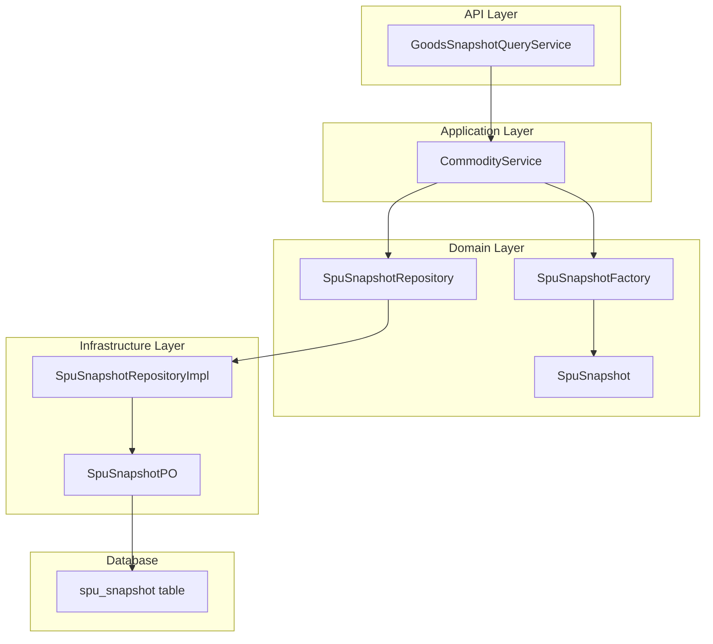
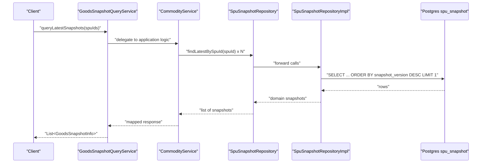
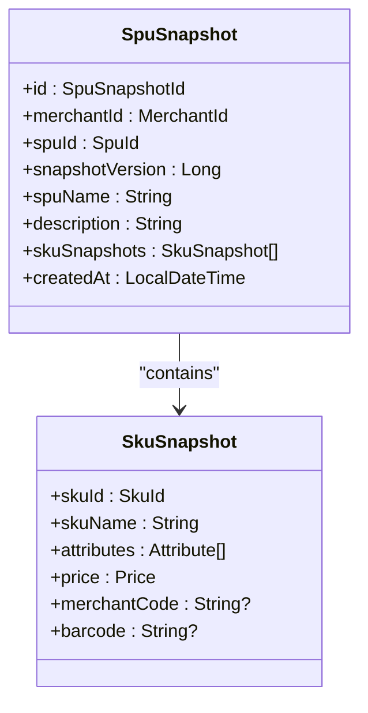
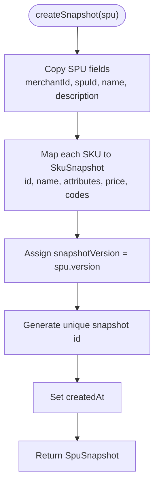
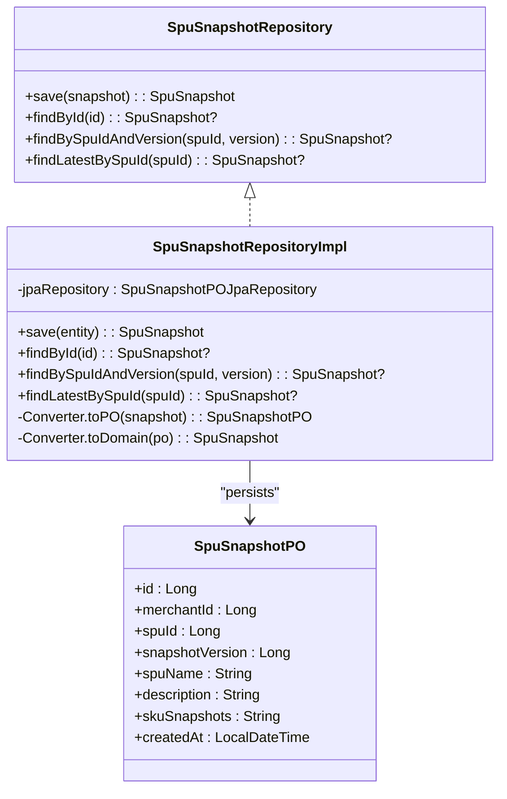
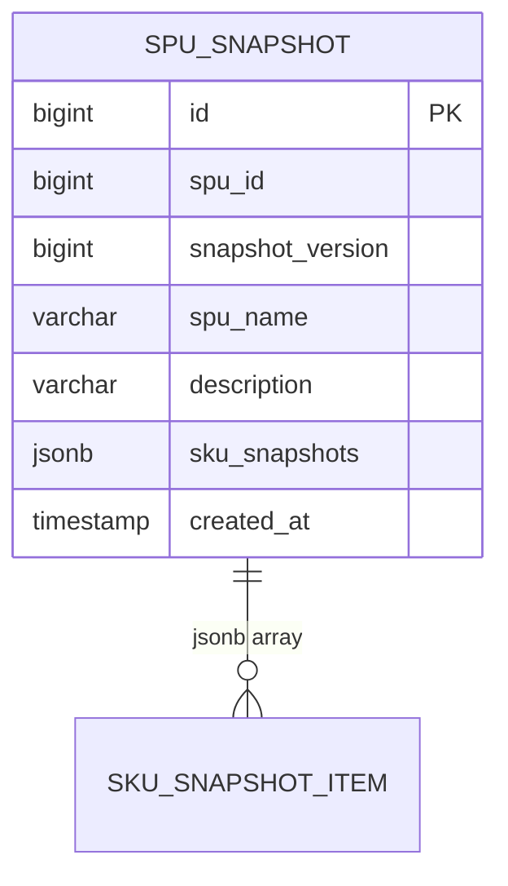
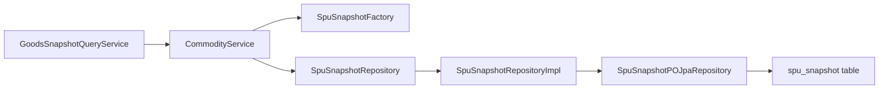

# Goods Snapshot System

<cite>
**Referenced Files in This Document**
- [GoodsSnapshotQueryService.kt](file://j-store-goods-api/src/main/kotlin/com/jstore/goods/api/GoodsSnapshotQueryService.kt)
- [SpuSnapshot.kt](file://j-store-goods-domain/src/main/kotlin/com/jstore/goods/domain/commodity/snapshot/SpuSnapshot.kt)
- [SpuSnapshotFactory.kt](file://j-store-goods-domain/src/main/kotlin/com/jstore/goods/domain/commodity/snapshot/SpuSnapshotFactory.kt)
- [SpuSnapshotRepository.kt](file://j-store-goods-domain/src/main/kotlin/com/jstore/goods/domain/commodity/snapshot/SpuSnapshotRepository.kt)
- [SpuSnapshotRepositoryImpl.kt](file://j-store-goods-infrastructure/src/main/kotlin/com/jstore/goods/domain/commodity/SpuSnapshotRepositoryImpl.kt)
- [SpuSnapshotPO.kt](file://j-store-goods-infrastructure/src/main/kotlin/com/jstore/goods/domain/commodity/persistence/SpuSnapshotPO.kt)
- [04-goods-spu-sku-snapshot.sql](file://docker/postgres/init/04-goods-spu-sku-snapshot.sql)
- [08-order-item-snapshot-version.sql](file://docker/postgres/init/08-order-item-snapshot-version.sql)
- [OrderItem.kt](file://j-store-order-domain/src/main/kotlin/com/jstore/order/domain/order/OrderItem.kt)
- [CommodityService.kt](file://j-store-goods-application/src/main/kotlin/com/jstore/goods/service/CommodityService.kt)
- [GoodsBootConfiguration.kt](file://j-store-goods-boot/src/main/kotlin/com/jstore/goods/config/GoodsBootConfiguration.kt)
</cite>

## Table of Contents
1. Introduction
2. Project Structure
3. Core Components
4. Architecture Overview
5. Detailed Component Analysis
6. Dependency Analysis
7. Performance Considerations
8. Troubleshooting Guide
9. Conclusion

## Introduction
This document explains the goods snapshot system that ensures order isolation and historical consistency for product information. It covers:
- SpuSnapshot design for immutable, versioned snapshots of SPU and SKU data
- Snapshot generation during order creation and product lifecycle events
- Query optimization strategies via a dedicated API
- Data model, persistence, and factory implementation
- Relationship between live product data and historical snapshots
- Versioning strategy and performance considerations for large catalogs

## Project Structure
The snapshot system spans domain, application, infrastructure, and API layers:
- Domain models define immutable snapshot entities and repository interfaces
- Application services orchestrate snapshot creation when products are published or updated
- Infrastructure implements persistence to Postgres with JSONB for SKU details
- API exposes efficient query operations for consumers (e.g., order service)

**Diagram sources**
- [GoodsSnapshotQueryService.kt:1-23](file://j-store-goods-api/src/main/kotlin/com/jstore/goods/api/GoodsSnapshotQueryService.kt#L1-L23)
- [CommodityService.kt:1-200](file://j-store-goods-application/src/main/kotlin/com/jstore/goods/service/CommodityService.kt#L1-L200)
- [SpuSnapshot.kt:1-40](file://j-store-goods-domain/src/main/kotlin/com/jstore/goods/domain/commodity/snapshot/SpuSnapshot.kt#L1-L40)
- [SpuSnapshotFactory.kt:1-36](file://j-store-goods-domain/src/main/kotlin/com/jstore/goods/domain/commodity/snapshot/SpuSnapshotFactory.kt#L1-L36)
- [SpuSnapshotRepository.kt:1-17](file://j-store-goods-domain/src/main/kotlin/com/jstore/goods/domain/commodity/snapshot/SpuSnapshotRepository.kt#L1-L17)
- [SpuSnapshotRepositoryImpl.kt:1-99](file://j-store-goods-infrastructure/src/main/kotlin/com/jstore/goods/domain/commodity/SpuSnapshotRepositoryImpl.kt#L1-L99)
- [SpuSnapshotPO.kt:1-25](file://j-store-goods-infrastructure/src/main/kotlin/com/jstore/goods/domain/commodity/persistence/SpuSnapshotPO.kt#L1-L25)
- [04-goods-spu-sku-snapshot.sql:1-55](file://docker/postgres/init/04-goods-spu-sku-snapshot.sql#L1-L55)

**Section sources**
- [GoodsSnapshotQueryService.kt:1-23](file://j-store-goods-api/src/main/kotlin/com/jstore/goods/api/GoodsSnapshotQueryService.kt#L1-L23)
- [SpuSnapshot.kt:1-40](file://j-store-goods-domain/src/main/kotlin/com/jstore/goods/domain/commodity/snapshot/SpuSnapshot.kt#L1-L40)
- [SpuSnapshotFactory.kt:1-36](file://j-store-goods-domain/src/main/kotlin/com/jstore/goods/domain/commodity/snapshot/SpuSnapshotFactory.kt#L1-L36)
- [SpuSnapshotRepository.kt:1-17](file://j-store-goods-domain/src/main/kotlin/com/jstore/goods/domain/commodity/snapshot/SpuSnapshotRepository.kt#L1-L17)
- [SpuSnapshotRepositoryImpl.kt:1-99](file://j-store-goods-infrastructure/src/main/kotlin/com/jstore/goods/domain/commodity/SpuSnapshotRepositoryImpl.kt#L1-L99)
- [SpuSnapshotPO.kt:1-25](file://j-store-goods-infrastructure/src/main/kotlin/com/jstore/goods/domain/commodity/persistence/SpuSnapshotPO.kt#L1-L25)
- [04-goods-spu-sku-snapshot.sql:1-55](file://docker/postgres/init/04-goods-spu-sku-snapshot.sql#L1-L55)

## Core Components
- SpuSnapshot: Immutable record of SPU and SKU state at a point in time, including name, description, and list of SkuSnapshot entries with attributes and price.
- SkuSnapshot: Immutable record of SKU state including id, name, attributes, price, and optional merchant code/barcode.
- SpuSnapshotFactory: Creates SpuSnapshot from current Spu, copying all relevant fields and generating unique IDs.
- SpuSnapshotRepository: Interface for saving and querying snapshots by ID, SPU+version, or latest by SPU.
- SpuSnapshotRepositoryImpl: JPA-backed implementation converting domain objects to POs and JSONB payloads.
- GoodsSnapshotQueryService: API interface exposing batch retrieval of latest snapshots for efficient consumption.

Key responsibilities:
- Ensure immutability and version alignment with SPU.version
- Persist full SKU detail as JSONB for fast reads without joins
- Provide targeted queries for latest snapshot per SPU and exact version lookups

**Section sources**
- [SpuSnapshot.kt:1-40](file://j-store-goods-domain/src/main/kotlin/com/jstore/goods/domain/commodity/snapshot/SpuSnapshot.kt#L1-L40)
- [SpuSnapshotFactory.kt:1-36](file://j-store-goods-domain/src/main/kotlin/com/jstore/goods/domain/commodity/snapshot/SpuSnapshotFactory.kt#L1-L36)
- [SpuSnapshotRepository.kt:1-17](file://j-store-goods-domain/src/main/kotlin/com/jstore/goods/domain/commodity/snapshot/SpuSnapshotRepository.kt#L1-L17)
- [SpuSnapshotRepositoryImpl.kt:1-99](file://j-store-goods-infrastructure/src/main/kotlin/com/jstore/goods/domain/commodity/SpuSnapshotRepositoryImpl.kt#L1-L99)
- [GoodsSnapshotQueryService.kt:1-23](file://j-store-goods-api/src/main/kotlin/com/jstore/goods/api/GoodsSnapshotQueryService.kt#L1-L23)

## Architecture Overview
The snapshot system isolates order data from live product changes by capturing a consistent view at publish/update time. Consumers retrieve snapshots via a dedicated API optimized for batch reads.

**Diagram sources**
- [GoodsSnapshotQueryService.kt:1-23](file://j-store-goods-api/src/main/kotlin/com/jstore/goods/api/GoodsSnapshotQueryService.kt#L1-L23)
- [CommodityService.kt:1-200](file://j-store-goods-application/src/main/kotlin/com/jstore/goods/service/CommodityService.kt#L1-L200)
- [SpuSnapshotRepository.kt:1-17](file://j-store-goods-domain/src/main/kotlin/com/jstore/goods/domain/commodity/snapshot/SpuSnapshotRepository.kt#L1-L17)
- [SpuSnapshotRepositoryImpl.kt:1-99](file://j-store-goods-infrastructure/src/main/kotlin/com/jstore/goods/domain/commodity/SpuSnapshotRepositoryImpl.kt#L1-L99)
- [04-goods-spu-sku-snapshot.sql:1-55](file://docker/postgres/init/04-goods-spu-sku-snapshot.sql#L1-L55)

## Detailed Component Analysis

### SpuSnapshot Data Model
- SpuSnapshot captures merchantId, spuId, snapshotVersion aligned with SPU.version, plus name, description, and an array of SkuSnapshot entries.
- SkuSnapshot includes skuId, skuName, attributes (key-value pairs), price, and optional identifiers like merchantCode/barcode.
- Immutability is enforced via data classes; snapshots are append-only records.

**Diagram sources**
- [SpuSnapshot.kt:1-40](file://j-store-goods-domain/src/main/kotlin/com/jstore/goods/domain/commodity/snapshot/SpuSnapshot.kt#L1-L40)

**Section sources**
- [SpuSnapshot.kt:1-40](file://j-store-goods-domain/src/main/kotlin/com/jstore/goods/domain/commodity/snapshot/SpuSnapshot.kt#L1-L40)

### SpuSnapshotFactory Implementation
- Generates a new SpuSnapshot from a given Spu, copying all relevant fields and mapping each SKU into SkuSnapshot.
- Uses SnowFlakSequence to generate unique snapshot IDs.
- Ensures snapshotVersion equals the source Spu.version, maintaining strict version alignment.

**Diagram sources**
- [SpuSnapshotFactory.kt:1-36](file://j-store-goods-domain/src/main/kotlin/com/jstore/goods/domain/commodity/snapshot/SpuSnapshotFactory.kt#L1-L36)

**Section sources**
- [SpuSnapshotFactory.kt:1-36](file://j-store-goods-domain/src/main/kotlin/com/jstore/goods/domain/commodity/snapshot/SpuSnapshotFactory.kt#L1-L36)

### Persistence and Repository
- SpuSnapshotRepository defines save and query methods for snapshots by ID, SPU+version, and latest by SPU.
- SpuSnapshotRepositoryImpl persists SpuSnapshot as SpuSnapshotPO with JSONB payload for SKU snapshots.
- Converter serializes/deserializes SKU snapshots to/from JSON maps, preserving attributes and prices.

**Diagram sources**
- [SpuSnapshotRepository.kt:1-17](file://j-store-goods-domain/src/main/kotlin/com/jstore/goods/domain/commodity/snapshot/SpuSnapshotRepository.kt#L1-L17)
- [SpuSnapshotRepositoryImpl.kt:1-99](file://j-store-goods-infrastructure/src/main/kotlin/com/jstore/goods/domain/commodity/SpuSnapshotRepositoryImpl.kt#L1-L99)
- [SpuSnapshotPO.kt:1-25](file://j-store-goods-infrastructure/src/main/kotlin/com/jstore/goods/domain/commodity/persistence/SpuSnapshotPO.kt#L1-L25)

**Section sources**
- [SpuSnapshotRepository.kt:1-17](file://j-store-goods-domain/src/main/kotlin/com/jstore/goods/domain/commodity/snapshot/SpuSnapshotRepository.kt#L1-L17)
- [SpuSnapshotRepositoryImpl.kt:1-99](file://j-store-goods-infrastructure/src/main/kotlin/com/jstore/goods/domain/commodity/SpuSnapshotRepositoryImpl.kt#L1-L99)
- [SpuSnapshotPO.kt:1-25](file://j-store-goods-infrastructure/src/main/kotlin/com/jstore/goods/domain/commodity/persistence/SpuSnapshotPO.kt#L1-L25)

### Database Schema and Versioning
- spu_snapshot stores immutable snapshots with unique constraint on (spu_id, snapshot_version).
- sku_snapshots is JSONB containing arrays of SKU snapshot objects with id, name, attributes, price, and optional codes.
- Indexes support efficient lookup by spu_id and ordering by snapshot_version for latest retrieval.
- Order items store snapshot_version to tie line items to specific snapshot versions.

**Diagram sources**
- [04-goods-spu-sku-snapshot.sql:1-55](file://docker/postgres/init/04-goods-spu-sku-snapshot.sql#L1-L55)
- [08-order-item-snapshot-version.sql:1-5](file://docker/postgres/init/08-order-item-snapshot-version.sql#L1-L5)

**Section sources**
- [04-goods-spu-sku-snapshot.sql:1-55](file://docker/postgres/init/04-goods-spu-sku-snapshot.sql#L1-L55)
- [08-order-item-snapshot-version.sql:1-5](file://docker/postgres/init/08-order-item-snapshot-version.sql#L1-L5)

### GoodsSnapshotQueryService API
- Exposes batch retrieval of latest snapshots for a list of SPU IDs.
- Response DTO includes merchantId, snapshotVersion, spuName, and list of SKU snapshot info with attributes and price.

Usage pattern:
- Callers pass a list of SPU IDs to fetch corresponding latest snapshots efficiently.
- The service maps domain snapshots to lightweight DTOs for transport.

**Section sources**
- [GoodsSnapshotQueryService.kt:1-23](file://j-store-goods-api/src/main/kotlin/com/jstore/goods/api/GoodsSnapshotQueryService.kt#L1-L23)

### Snapshot Creation During Product Lifecycle
- CommodityService uses SpuSnapshotFactory to create snapshots when publishing or updating products.
- Snapshots are persisted via SpuSnapshotRepository within transactional boundaries.
- This ensures that any subsequent order creation can rely on stable snapshot versions.

**Section sources**
- [CommodityService.kt:1-200](file://j-store-goods-application/src/main/kotlin/com/jstore/goods/service/CommodityService.kt#L1-L200)
- [GoodsBootConfiguration.kt:1-60](file://j-store-goods-boot/src/main/kotlin/com/jstore/goods/config/GoodsBootConfiguration.kt#L1-L60)

### Order Isolation and Consistency
- OrderItem includes snapshotVersion to reference the exact snapshot used at purchase time.
- This decouples order history from live product updates, ensuring accurate pricing and attributes for past orders.

**Section sources**
- [OrderItem.kt:1-26](file://j-store-order-domain/src/main/kotlin/com/jstore/order/domain/order/OrderItem.kt#L1-L26)

## Dependency Analysis
- GoodsSnapshotQueryService depends on application layer to resolve snapshots.
- CommodityService orchestrates snapshot creation using SpuSnapshotFactory and persists via SpuSnapshotRepository.
- SpuSnapshotRepositoryImpl depends on JPA repository and converts between domain and persistence models.
- Database schema enforces uniqueness and supports efficient queries.

**Diagram sources**
- [GoodsSnapshotQueryService.kt:1-23](file://j-store-goods-api/src/main/kotlin/com/jstore/goods/api/GoodsSnapshotQueryService.kt#L1-L23)
- [CommodityService.kt:1-200](file://j-store-goods-application/src/main/kotlin/com/jstore/goods/service/CommodityService.kt#L1-L200)
- [SpuSnapshotRepository.kt:1-17](file://j-store-goods-domain/src/main/kotlin/com/jstore/goods/domain/commodity/snapshot/SpuSnapshotRepository.kt#L1-L17)
- [SpuSnapshotRepositoryImpl.kt:1-99](file://j-store-goods-infrastructure/src/main/kotlin/com/jstore/goods/domain/commodity/SpuSnapshotRepositoryImpl.kt#L1-L99)
- [04-goods-spu-sku-snapshot.sql:1-55](file://docker/postgres/init/04-goods-spu-sku-snapshot.sql#L1-L55)

**Section sources**
- [GoodsSnapshotQueryService.kt:1-23](file://j-store-goods-api/src/main/kotlin/com/jstore/goods/api/GoodsSnapshotQueryService.kt#L1-L23)
- [CommodityService.kt:1-200](file://j-store-goods-application/src/main/kotlin/com/jstore/goods/service/CommodityService.kt#L1-L200)
- [SpuSnapshotRepository.kt:1-17](file://j-store-goods-domain/src/main/kotlin/com/jstore/goods/domain/commodity/snapshot/SpuSnapshotRepository.kt#L1-L17)
- [SpuSnapshotRepositoryImpl.kt:1-99](file://j-store-goods-infrastructure/src/main/kotlin/com/jstore/goods/domain/commodity/SpuSnapshotRepositoryImpl.kt#L1-L99)
- [04-goods-spu-sku-snapshot.sql:1-55](file://docker/postgres/init/04-goods-spu-sku-snapshot.sql#L1-L55)

## Performance Considerations
- Batch queries: Use queryLatestSnapshots to fetch multiple snapshots in one call, reducing round-trips.
- JSONB storage: sku_snapshots stored as JSONB avoids joins and enables fast read access to SKU details.
- Indexing: Index on spu_id and ordering by snapshot_version desc supports efficient latest snapshot retrieval.
- Unique constraints: (spu_id, snapshot_version) prevents duplicates and ensures deterministic version selection.
- Caching: Consider caching latest snapshots per SPU for hot paths if read traffic is high.
- Partitioning: For very large catalogs, consider partitioning spu_snapshot by spu_id or merchant_id to improve query performance.
- Read replicas: Offload read-heavy snapshot queries to replicas to reduce primary load.

[No sources needed since this section provides general guidance]

## Troubleshooting Guide
Common issues and resolutions:
- Missing snapshot for SPU: Verify that snapshot creation occurs during publish/update flows and that transactions commit successfully.
- Version mismatch: Ensure snapshotVersion matches SPU.version and that order items store the correct snapshot_version.
- JSON deserialization errors: Validate sku_snapshots structure and attribute key/value formats during conversion.
- Duplicate snapshots: Check unique constraints and ensure no concurrent writes produce duplicate versions.
- Slow queries: Confirm indexes exist on spu_id and that queries use ORDER BY snapshot_version DESC LIMIT 1 for latest retrieval.

**Section sources**
- [SpuSnapshotRepositoryImpl.kt:1-99](file://j-store-goods-infrastructure/src/main/kotlin/com/jstore/goods/domain/commodity/SpuSnapshotRepositoryImpl.kt#L1-L99)
- [04-goods-spu-sku-snapshot.sql:1-55](file://docker/postgres/init/04-goods-spu-sku-snapshot.sql#L1-L55)
- [08-order-item-snapshot-version.sql:1-5](file://docker/postgres/init/08-order-item-snapshot-version.sql#L1-L5)

## Conclusion
The goods snapshot system provides robust order isolation through immutable, versioned snapshots of product data. By capturing SPU and SKU state at publish/update time and exposing efficient batch queries, it ensures historical accuracy and high-performance reads. Proper indexing, JSONB usage, and version alignment maintain consistency across large catalogs while supporting future optimizations such as caching and partitioning.

[No sources needed since this section summarizes without analyzing specific files]