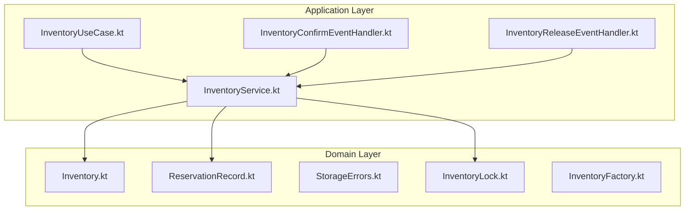
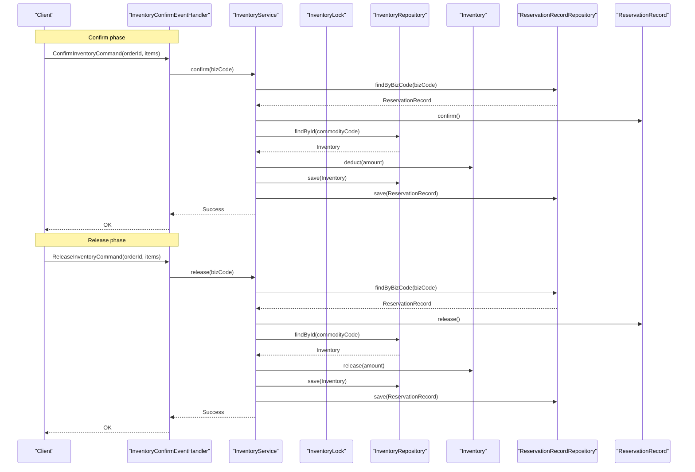
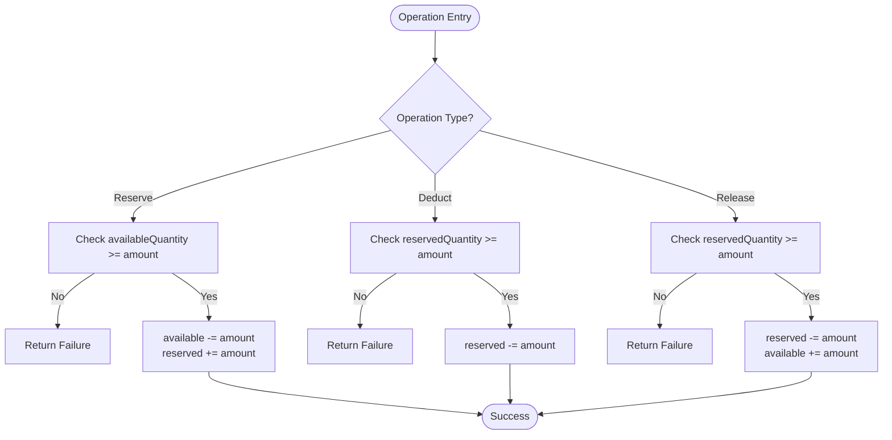
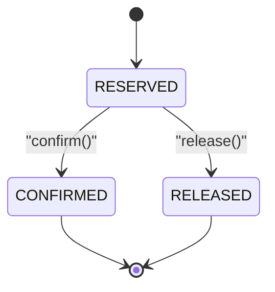
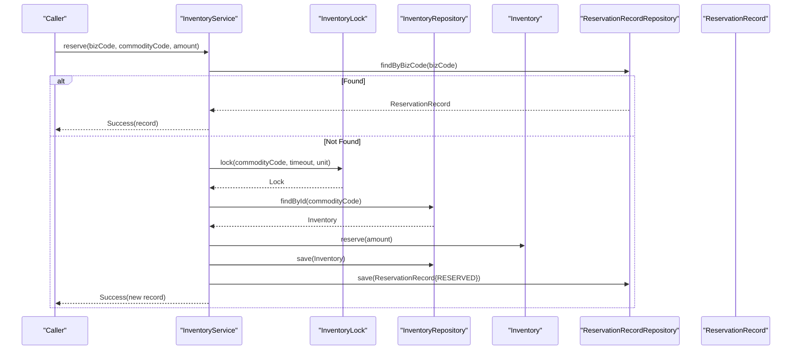
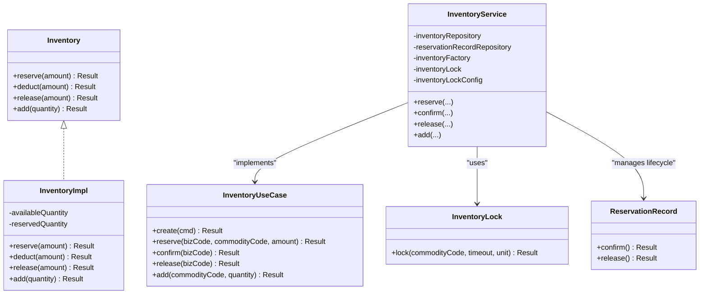

# Inventory Aggregate Design

<cite>
**Referenced Files in This Document**
- [Inventory.kt](file://j-store-goods-domain/src/main/kotlin/com/jstore/goods/domain/inventory/Inventory.kt)
- [ReservationRecord.kt](file://j-store-goods-domain/src/main/kotlin/com/jstore/goods/domain/inventory/ReservationRecord.kt)
- [StorageErrors.kt](file://j-store-goods-domain/src/main/kotlin/com/jstore/goods/domain/inventory/StorageErrors.kt)
- [InventoryLock.kt](file://j-store-goods-domain/src/main/kotlin/com/jstore/goods/domain/inventory/InventoryLock.kt)
- [InventoryFactory.kt](file://j-store-goods-domain/src/main/kotlin/com/jstore/goods/domain/inventory/InventoryFactory.kt)
- [InventoryUseCase.kt](file://j-store-goods-application/src/main/kotlin/com/jstore/goods/service/InventoryUseCase.kt)
- [InventoryService.kt](file://j-store-goods-application/src/main/kotlin/com/jstore/goods/service/InventoryService.kt)
- [InventoryConfirmEventHandler.kt](file://j-store-goods-application/src/main/kotlin/com/jstore/goods/service/InventoryConfirmEventHandler.kt)
- [InventoryReleaseEventHandler.kt](file://j-store-goods-application/src/main/kotlin/com/jstore/goods/service/InventoryReleaseEventHandler.kt)
</cite>

## Table of Contents
1. Introduction
2. Project Structure
3. Core Components
4. Architecture Overview
5. Detailed Component Analysis
6. Dependency Analysis
7. Performance Considerations
8. Troubleshooting Guide
9. Conclusion

## Introduction
This document explains the Inventory aggregate design and its TCC (Try-Confirm-Cancel) implementation for stock reservation, deduction, and release. It covers the availableQuantity and reservedQuantity fields, their state transitions, business invariants, the CommodityCode identifier design, usage examples, error handling patterns, concurrency considerations, and the relationship between Inventory and StorageLock for distributed scenarios.

## Project Structure
The inventory feature spans domain and application layers:
- Domain layer defines the Inventory aggregate, ReservationRecord, identifiers, lock abstraction, and factory.
- Application layer implements use cases and event handlers that orchestrate TCC flows with locking and persistence.

**Diagram sources**
- [Inventory.kt](file://j-store-goods-domain/src/main/kotlin/com/jstore/goods/domain/inventory/Inventory.kt)
- [ReservationRecord.kt](file://j-store-goods-domain/src/main/kotlin/com/jstore/goods/domain/inventory/ReservationRecord.kt)
- [StorageErrors.kt](file://j-store-goods-domain/src/main/kotlin/com/jstore/goods/domain/inventory/StorageErrors.kt)
- [InventoryLock.kt](file://j-store-goods-domain/src/main/kotlin/com/jstore/goods/domain/inventory/InventoryLock.kt)
- [InventoryFactory.kt](file://j-store-goods-domain/src/main/kotlin/com/jstore/goods/domain/inventory/InventoryFactory.kt)
- [InventoryUseCase.kt](file://j-store-goods-application/src/main/kotlin/com/jstore/goods/service/InventoryUseCase.kt)
- [InventoryService.kt](file://j-store-goods-application/src/main/kotlin/com/jstore/goods/service/InventoryService.kt)
- [InventoryConfirmEventHandler.kt](file://j-store-goods-application/src/main/kotlin/com/jstore/goods/service/InventoryConfirmEventHandler.kt)
- [InventoryReleaseEventHandler.kt](file://j-store-goods-application/src/main/kotlin/com/jstore/goods/service/InventoryReleaseEventHandler.kt)

**Section sources**
- [Inventory.kt](file://j-store-goods-domain/src/main/kotlin/com/jstore/goods/domain/inventory/Inventory.kt)
- [ReservationRecord.kt](file://j-store-goods-domain/src/main/kotlin/com/jstore/goods/domain/inventory/ReservationRecord.kt)
- [InventoryUseCase.kt](file://j-store-goods-application/src/main/kotlin/com/jstore/goods/service/InventoryUseCase.kt)
- [InventoryService.kt](file://j-store-goods-application/src/main/kotlin/com/jstore/goods/service/InventoryService.kt)

## Core Components
- Inventory aggregate: Encapsulates stock quantities and enforces TCC operations reserve, deduct, and release.
- ReservationRecord: Tracks per-biz-code reservation lifecycle (RESERVED → CONFIRMED or RELEASED).
- InventoryLock: Abstraction for acquiring a lock per commodity to ensure concurrency safety.
- InventoryFactory: Creates Inventory instances from commands.
- InventoryUseCase and InventoryService: Orchestrate TCC flows, handle idempotency via bizCode, and persist changes.
- Event handlers: Trigger confirm and release phases on integration messages.

Key responsibilities:
- Idempotent reserve by bizCode.
- Concurrency-safe updates using InventoryLock.
- Clear separation of Try (reserve), Confirm (deduct), Cancel (release).
- Strong invariants on availableQuantity and reservedQuantity.

**Section sources**
- [Inventory.kt](file://j-store-goods-domain/src/main/kotlin/com/jstore/goods/domain/inventory/Inventory.kt)
- [ReservationRecord.kt](file://j-store-goods-domain/src/main/kotlin/com/jstore/goods/domain/inventory/ReservationRecord.kt)
- [InventoryLock.kt](file://j-store-goods-domain/src/main/kotlin/com/jstore/goods/domain/inventory/InventoryLock.kt)
- [InventoryFactory.kt](file://j-store-goods-domain/src/main/kotlin/com/jstore/goods/domain/inventory/InventoryFactory.kt)
- [InventoryUseCase.kt](file://j-store-goods-application/src/main/kotlin/com/jstore/goods/service/InventoryUseCase.kt)
- [InventoryService.kt](file://j-store-goods-application/src/main/kotlin/com/jstore/goods/service/InventoryService.kt)

## Architecture Overview
The TCC flow is implemented across domain and application layers:
- Try: Reserve reduces availableQuantity and increases reservedQuantity; creates a ReservationRecord with status RESERVED.
- Confirm: Deduct moves reservedQuantity to sold; marks ReservationRecord as CONFIRMED.
- Cancel: Release returns reservedQuantity to availableQuantity; marks ReservationRecord as RELEASED.

**Diagram sources**
- [InventoryConfirmEventHandler.kt](file://j-store-goods-application/src/main/kotlin/com/jstore/goods/service/InventoryConfirmEventHandler.kt)
- [InventoryReleaseEventHandler.kt](file://j-store-goods-application/src/main/kotlin/com/jstore/goods/service/InventoryReleaseEventHandler.kt)
- [InventoryService.kt](file://j-store-goods-application/src/main/kotlin/com/jstore/goods/service/InventoryService.kt)
- [ReservationRecord.kt](file://j-store-goods-domain/src/main/kotlin/com/jstore/goods/domain/inventory/ReservationRecord.kt)
- [Inventory.kt](file://j-store-goods-domain/src/main/kotlin/com/jstore/goods/domain/inventory/Inventory.kt)

## Detailed Component Analysis

### Inventory Aggregate and State Transitions
- Fields:
  - availableQuantity: freely sellable stock.
  - reservedQuantity: stock tentatively held by pending reservations.
- Invariants:
  - availableQuantity ≥ 0
  - reservedQuantity ≥ 0
  - availableQuantity + reservedQuantity equals total committed stock (excluding external adjustments).
- Operations:
  - reserve(amount): requires availableQuantity ≥ amount; decreases availableQuantity and increases reservedQuantity.
  - deduct(amount): requires reservedQuantity ≥ amount; decreases reservedQuantity.
  - release(amount): requires reservedQuantity ≥ amount; decreases reservedQuantity and increases availableQuantity.
  - add(quantity): increases availableQuantity (e.g., replenishment).

**Diagram sources**
- [Inventory.kt](file://j-store-goods-domain/src/main/kotlin/com/jstore/goods/domain/inventory/Inventory.kt)

**Section sources**
- [Inventory.kt](file://j-store-goods-domain/src/main/kotlin/com/jstore/goods/domain/inventory/Inventory.kt)

### ReservationRecord Lifecycle
- States: RESERVED, CONFIRMED, RELEASED.
- Transitions:
  - confirm(): RESERVED → CONFIRMED; idempotent if already CONFIRMED; rejects if RELEASED or expired.
  - release(): RESERVED → RELEASED; idempotent if already RELEASED; rejects if CONFIRMED.
- Purpose: Enforces TCC semantics at the reservation level and provides idempotency key via bizCode.

**Diagram sources**
- [ReservationRecord.kt](file://j-store-goods-domain/src/main/kotlin/com/jstore/goods/domain/inventory/ReservationRecord.kt)

**Section sources**
- [ReservationRecord.kt](file://j-store-goods-domain/src/main/kotlin/com/jstore/goods/domain/inventory/ReservationRecord.kt)

### CommodityCode Identifier Design
- CommodityCode is a typed identifier wrapping a Long value, used to uniquely identify an inventory item.
- Relationship to goods catalog:
  - Typically corresponds to a SKU or product code in the goods catalog.
  - Ensures type safety and clear intent when referencing inventory entities.
- Usage:
  - Passed into reserve, confirm, release, and add operations.
  - Used as the lock key for InventoryLock to serialize concurrent updates per commodity.

**Section sources**
- [Inventory.kt](file://j-store-goods-domain/src/main/kotlin/com/jstore/goods/domain/inventory/Inventory.kt)

### TCC Orchestration in InventoryService
- reserve(bizCode, commodityCode, amount):
  - Idempotency: checks existing ReservationRecord by bizCode; returns previous record if found.
  - Concurrency: acquires InventoryLock for commodityCode before modifying Inventory.
  - Persistence: saves Inventory and creates ReservationRecord with status RESERVED and expiryTime.
- confirm(bizCode):
  - Loads ReservationRecord, transitions to CONFIRMED, then deducts Inventory and persists both.
- release(bizCode):
  - Loads ReservationRecord, transitions to RELEASED, then releases Inventory and persists both.
- add(commodityCode, quantity):
  - Acquires InventoryLock, loads Inventory, increases availableQuantity, and persists.

**Diagram sources**
- [InventoryService.kt](file://j-store-goods-application/src/main/kotlin/com/jstore/goods/service/InventoryService.kt)
- [InventoryLock.kt](file://j-store-goods-domain/src/main/kotlin/com/jstore/goods/domain/inventory/InventoryLock.kt)
- [ReservationRecord.kt](file://j-store-goods-domain/src/main/kotlin/com/jstore/goods/domain/inventory/ReservationRecord.kt)

**Section sources**
- [InventoryService.kt](file://j-store-goods-application/src/main/kotlin/com/jstore/goods/service/InventoryService.kt)

### Error Handling Patterns
- Business errors are modeled via BusinessError and returned through Result types.
- Key error categories:
  - Insufficient inventory for reserve/deduct/release.
  - Missing inventory or reservation records.
  - Illegal state transitions for ReservationRecord.
  - Concurrent conflicts mapped to a common error when lock acquisition fails.
- Handlers log failures and propagate meaningful error codes/messages.

**Section sources**
- [StorageErrors.kt](file://j-store-goods-domain/src/main/kotlin/com/jstore/goods/domain/inventory/StorageErrors.kt)
- [InventoryService.kt](file://j-store-goods-application/src/main/kotlin/com/jstore/goods/service/InventoryService.kt)
- [ReservationRecord.kt](file://j-store-goods-domain/src/main/kotlin/com/jstore/goods/domain/inventory/ReservationRecord.kt)

### Concurrency and Distributed Scenarios
- InventoryLock abstracts locking strategy:
  - In-process: local lock.
  - Distributed: Redis or other distributed locks keyed by commodityCode.
- Lock configuration:
  - Timeout and time unit configurable via InventoryLockConfig.
- Idempotency:
  - bizCode ensures repeated calls do not create duplicate reservations.
- Consistency:
  - All mutations occur under lock and within repository transactions (managed by infrastructure).

**Section sources**
- [InventoryLock.kt](file://j-store-goods-domain/src/main/kotlin/com/jstore/goods/domain/inventory/InventoryLock.kt)
- [InventoryService.kt](file://j-store-goods-application/src/main/kotlin/com/jstore/goods/service/InventoryService.kt)

## Dependency Analysis

**Diagram sources**
- [Inventory.kt](file://j-store-goods-domain/src/main/kotlin/com/jstore/goods/domain/inventory/Inventory.kt)
- [ReservationRecord.kt](file://j-store-goods-domain/src/main/kotlin/com/jstore/goods/domain/inventory/ReservationRecord.kt)
- [InventoryLock.kt](file://j-store-goods-domain/src/main/kotlin/com/jstore/goods/domain/inventory/InventoryLock.kt)
- [InventoryUseCase.kt](file://j-store-goods-application/src/main/kotlin/com/jstore/goods/service/InventoryUseCase.kt)
- [InventoryService.kt](file://j-store-goods-application/src/main/kotlin/com/jstore/goods/service/InventoryService.kt)

**Section sources**
- [Inventory.kt](file://j-store-goods-domain/src/main/kotlin/com/jstore/goods/domain/inventory/Inventory.kt)
- [ReservationRecord.kt](file://j-store-goods-domain/src/main/kotlin/com/jstore/goods/domain/inventory/ReservationRecord.kt)
- [InventoryLock.kt](file://j-store-goods-domain/src/main/kotlin/com/jstore/goods/domain/inventory/InventoryLock.kt)
- [InventoryUseCase.kt](file://j-store-goods-application/src/main/kotlin/com/jstore/goods/service/InventoryUseCase.kt)
- [InventoryService.kt](file://j-store-goods-application/src/main/kotlin/com/jstore/goods/service/InventoryService.kt)

## Performance Considerations
- Lock granularity:
  - Per-commodity lock minimizes contention while ensuring correctness.
- Idempotency:
  - Early check by bizCode avoids redundant work and DB writes.
- Transaction boundaries:
  - Keep repository operations within single transactions to avoid partial updates.
- Expiry handling:
  - ReservationRecord expiry prevents indefinite holds; consider background cleanup jobs.
- Batch operations:
  - For high-throughput confirm/release, batch repository saves where safe.

[No sources needed since this section provides general guidance]

## Troubleshooting Guide
Common issues and resolutions:
- Insufficient inventory:
  - Verify availableQuantity and incoming reserve amount; ensure upstream validation.
- Reservation record not found:
  - Ensure reserve was called successfully with the same bizCode before confirm/release.
- Illegal state transitions:
  - Confirm cannot be applied after release or expiration; release cannot be applied after confirm.
- Concurrent conflicts:
  - Increase lock timeout or investigate hot commodities causing contention; consider sharding keys.
- Missing inventory entity:
  - Ensure inventory is created before any reserve operation.

**Section sources**
- [StorageErrors.kt](file://j-store-goods-domain/src/main/kotlin/com/jstore/goods/domain/inventory/StorageErrors.kt)
- [InventoryService.kt](file://j-store-goods-application/src/main/kotlin/com/jstore/goods/service/InventoryService.kt)
- [ReservationRecord.kt](file://j-store-goods-domain/src/main/kotlin/com/jstore/goods/domain/inventory/ReservationRecord.kt)

## Conclusion
The Inventory aggregate implements a robust TCC pattern with clear state management, strong invariants, and concurrency control. The combination of InventoryLock, ReservationRecord, and well-defined error handling ensures reliable stock reservation, confirmation, and release across distributed systems. Proper use of CommodityCode and bizCode guarantees type safety and idempotency, making the system resilient to retries and concurrent access.

[No sources needed since this section summarizes without analyzing specific files]