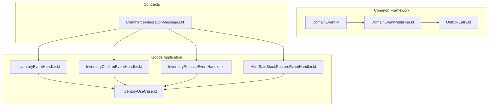
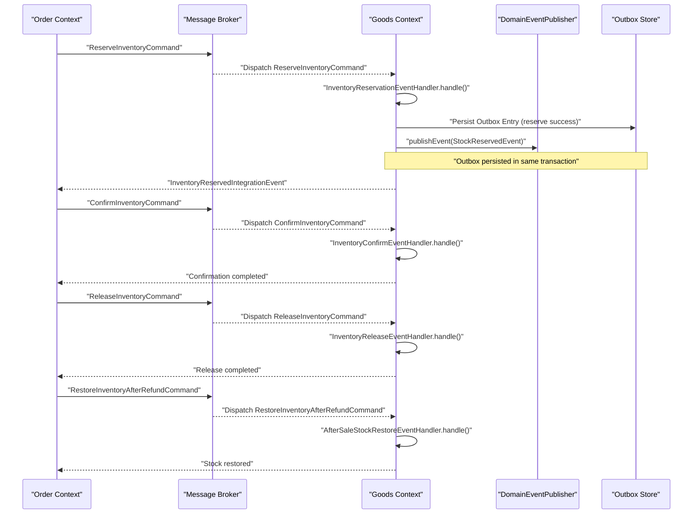
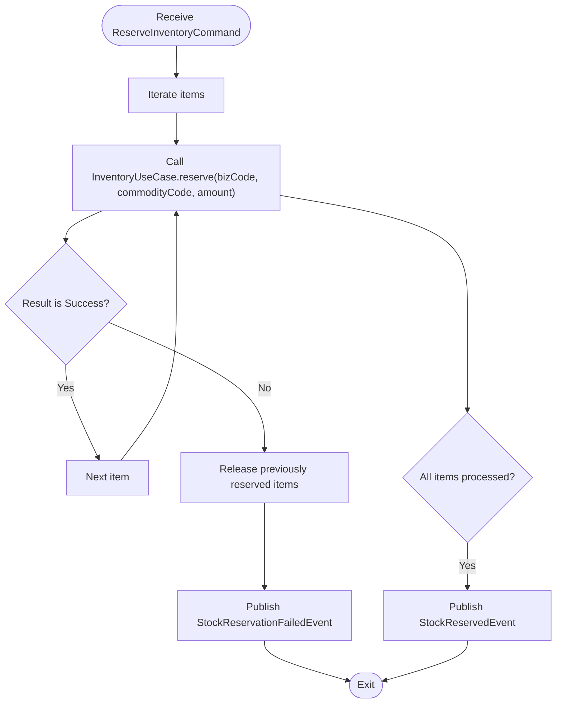
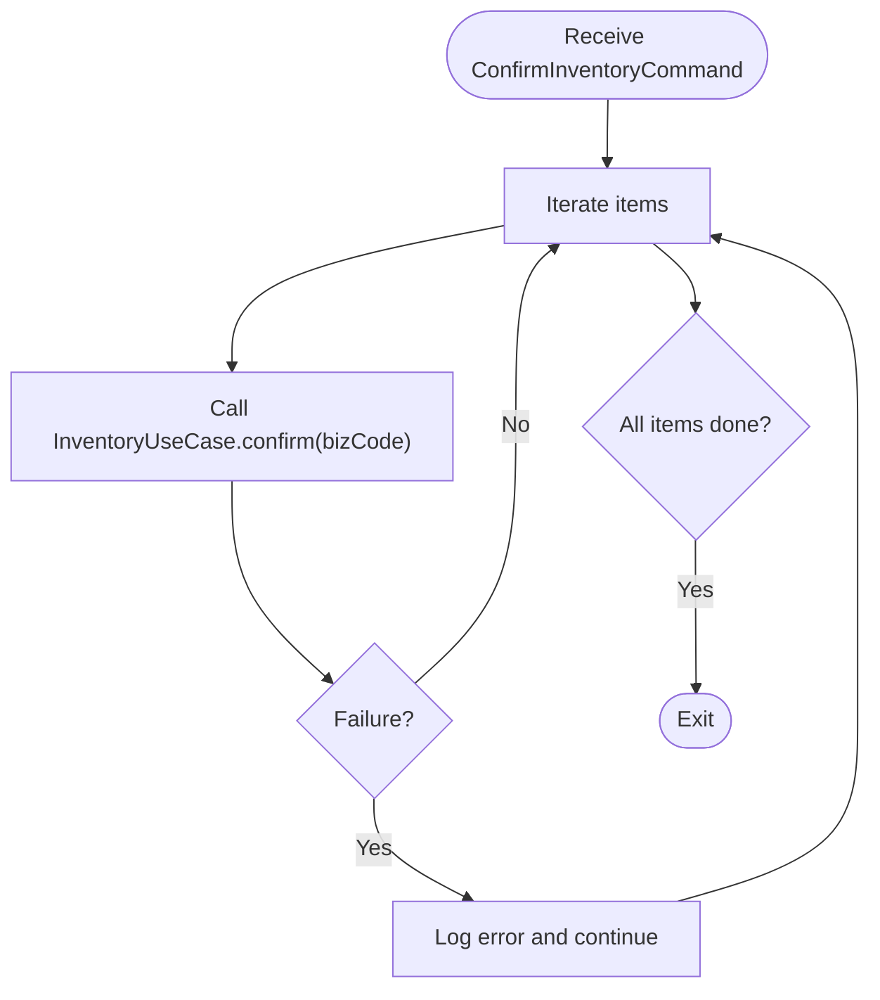
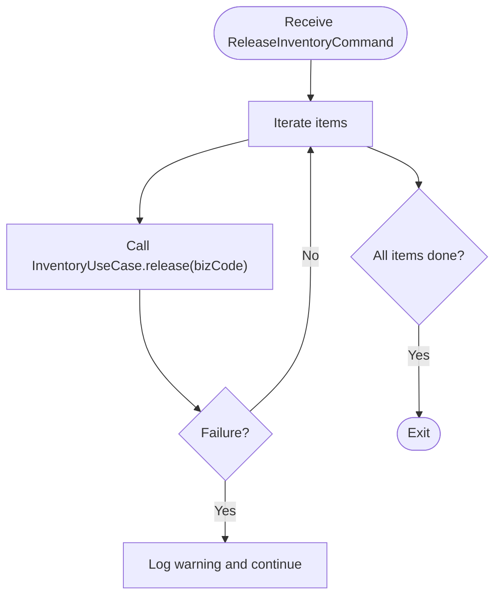
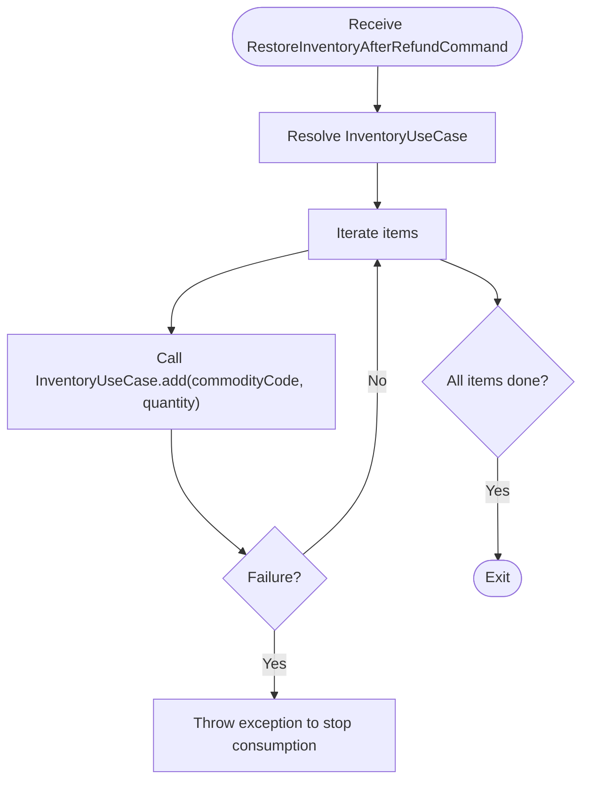
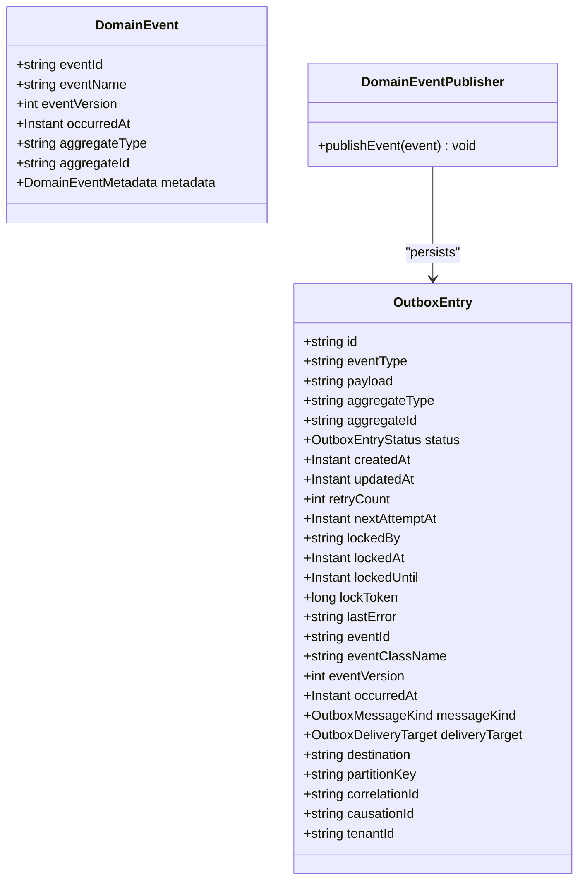
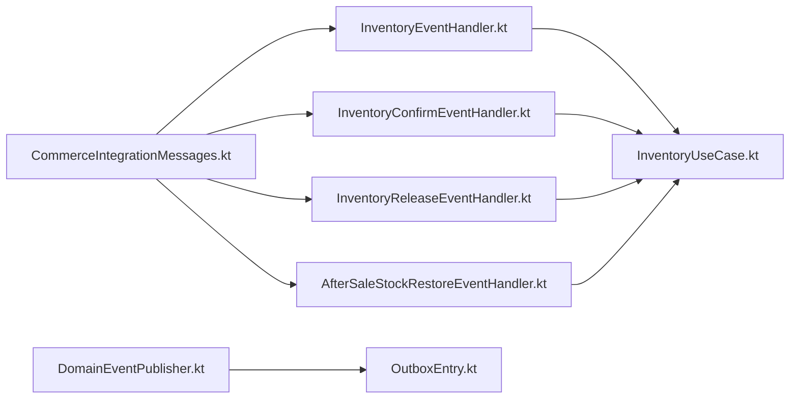

# Inventory Events & Integration

<cite>
**Referenced Files in This Document**
- [DomainEvent.kt](file://j-store-common-core/src/main/kotlin/com/jstore/common/framework/event/DomainEvent.kt)
- [DomainEventPublisher.kt](file://j-store-common-core/src/main/kotlin/com/jstore/common/framework/event/DomainEventPublisher.kt)
- [OutboxEntry.kt](file://j-store-common-core/src/main/kotlin/com/jstore/common/framework/event/outbox/OutboxEntry.kt)
- [CommerceIntegrationMessages.kt](file://j-store-integration-contracts/src/main/kotlin/com/jstore/contracts/commerce/CommerceIntegrationMessages.kt)
- [InventoryEventHandler.kt](file://j-store-goods-application/src/main/kotlin/com/jstore/goods/service/InventoryEventHandler.kt)
- [InventoryConfirmEventHandler.kt](file://j-store-goods-application/src/main/kotlin/com/jstore/goods/service/InventoryConfirmEventHandler.kt)
- [InventoryReleaseEventHandler.kt](file://j-store-goods-application/src/main/kotlin/com/jstore/goods/service/InventoryReleaseEventHandler.kt)
- [AfterSaleStockRestoreEventHandler.kt](file://j-store-goods-application/src/main/kotlin/com/jstore/goods/service/AfterSaleStockRestoreEventHandler.kt)
- [InventoryUseCase.kt](file://j-store-goods-application/src/main/kotlin/com/jstore/goods/service/InventoryUseCase.kt)
</cite>

## Table of Contents
1. Introduction
2. Project Structure
3. Core Components
4. Architecture Overview
5. Detailed Component Analysis
6. Dependency Analysis
7. Performance Considerations
8. Troubleshooting Guide
9. Conclusion

## Introduction
This document explains inventory event handling and integration patterns across the system. It covers domain events for stock reservations, confirmations, releases, and restocking; application-level handlers for order confirmation, payment processing, and after-sale returns; and cross-bounded-context integration via command and event contracts. It also outlines error handling strategies and retry mechanisms using a transactional outbox pattern.

## Project Structure
The inventory subsystem spans multiple modules:
- Common framework provides domain event abstractions and outbox infrastructure.
- Integration contracts define commands and events exchanged between bounded contexts.
- Goods application exposes inventory use cases and event handlers that implement business scenarios.
- Other contexts (Order, Payment, Fulfillment, Accounting) consume or produce related messages.

**Diagram sources**
- [DomainEvent.kt](file://j-store-common-core/src/main/kotlin/com/jstore/common/framework/event/DomainEvent.kt)
- [DomainEventPublisher.kt](file://j-store-common-core/src/main/kotlin/com/jstore/common/framework/event/DomainEventPublisher.kt)
- [OutboxEntry.kt](file://j-store-common-core/src/main/kotlin/com/jstore/common/framework/event/outbox/OutboxEntry.kt)
- [CommerceIntegrationMessages.kt](file://j-store-integration-contracts/src/main/kotlin/com/jstore/contracts/commerce/CommerceIntegrationMessages.kt)
- [InventoryEventHandler.kt](file://j-store-goods-application/src/main/kotlin/com/jstore/goods/service/InventoryEventHandler.kt)
- [InventoryConfirmEventHandler.kt](file://j-store-goods-application/src/main/kotlin/com/jstore/goods/service/InventoryConfirmEventHandler.kt)
- [InventoryReleaseEventHandler.kt](file://j-store-goods-application/src/main/kotlin/com/jstore/goods/service/InventoryReleaseEventHandler.kt)
- [AfterSaleStockRestoreEventHandler.kt](file://j-store-goods-application/src/main/kotlin/com/jstore/goods/service/AfterSaleStockRestoreEventHandler.kt)
- [InventoryUseCase.kt](file://j-store-goods-application/src/main/kotlin/com/jstore/goods/service/InventoryUseCase.kt)

**Section sources**
- [DomainEvent.kt](file://j-store-common-core/src/main/kotlin/com/jstore/common/framework/event/DomainEvent.kt)
- [DomainEventPublisher.kt](file://j-store-common-core/src/main/kotlin/com/jstore/common/framework/event/DomainEventPublisher.kt)
- [OutboxEntry.kt](file://j-store-common-core/src/main/kotlin/com/jstore/common/framework/event/outbox/OutboxEntry.kt)
- [CommerceIntegrationMessages.kt](file://j-store-integration-contracts/src/main/kotlin/com/jstore/contracts/commerce/CommerceIntegrationMessages.kt)
- [InventoryEventHandler.kt](file://j-store-goods-application/src/main/kotlin/com/jstore/goods/service/InventoryEventHandler.kt)
- [InventoryConfirmEventHandler.kt](file://j-store-goods-application/src/main/kotlin/com/jstore/goods/service/InventoryConfirmEventHandler.kt)
- [InventoryReleaseEventHandler.kt](file://j-store-goods-application/src/main/kotlin/com/jstore/goods/service/InventoryReleaseEventHandler.kt)
- [AfterSaleStockRestoreEventHandler.kt](file://j-store-goods-application/src/main/kotlin/com/jstore/goods/service/AfterSaleStockRestoreEventHandler.kt)
- [InventoryUseCase.kt](file://j-store-goods-application/src/main/kotlin/com/jstore/goods/service/InventoryUseCase.kt)

## Core Components
- Domain event model and publisher:
  - DomainEvent defines immutable facts with stable metadata for idempotent consumers.
  - DomainEventPublisher is a transactional publisher that persists events to an outbox within the same database transaction as business data.
- Outbox entry:
  - OutboxEntry models pending deliveries with status, lease, retry counters, and delivery targets.
- Integration contracts:
  - CommerceIntegrationMessages defines commands and events for inventory reserve/confirm/release/restore, payment lifecycle, fulfillment lifecycle, and order completion.
- Inventory application handlers:
  - InventoryReservationEventHandler handles ReserveInventoryCommand, performs per-item reservation, rolls back on failure, and publishes success/failure domain events.
  - InventoryConfirmEventHandler converts pre-reserved stock to actual deduction per item.
  - InventoryReleaseEventHandler releases pre-reserved stock per item.
  - AfterSaleStockRestoreEventHandler restores stock quantities upon refund approval.
- Inventory use case:
  - InventoryUseCase exposes create, reserve, confirm, release, and add operations returning Result types for consistent error handling.

**Section sources**
- [DomainEvent.kt](file://j-store-common-core/src/main/kotlin/com/jstore/common/framework/event/DomainEvent.kt)
- [DomainEventPublisher.kt](file://j-store-common-core/src/main/kotlin/com/jstore/common/framework/event/DomainEventPublisher.kt)
- [OutboxEntry.kt](file://j-store-common-core/src/main/kotlin/com/jstore/common/framework/event/outbox/OutboxEntry.kt)
- [CommerceIntegrationMessages.kt](file://j-store-integration-contracts/src/main/kotlin/com/jstore/contracts/commerce/CommerceIntegrationMessages.kt)
- [InventoryEventHandler.kt](file://j-store-goods-application/src/main/kotlin/com/jstore/goods/service/InventoryEventHandler.kt)
- [InventoryConfirmEventHandler.kt](file://j-store-goods-application/src/main/kotlin/com/jstore/goods/service/InventoryConfirmEventHandler.kt)
- [InventoryReleaseEventHandler.kt](file://j-store-goods-application/src/main/kotlin/com/jstore/goods/service/InventoryReleaseEventHandler.kt)
- [AfterSaleStockRestoreEventHandler.kt](file://j-store-goods-application/src/main/kotlin/com/jstore/goods/service/AfterSaleStockRestoreEventHandler.kt)
- [InventoryUseCase.kt](file://j-store-goods-application/src/main/kotlin/com/jstore/goods/service/InventoryUseCase.kt)

## Architecture Overview
The inventory flow uses an event-driven architecture with clear boundaries:
- Order context emits ReserveInventoryCommand when an order is created.
- Goods context consumes it via InventoryReservationEventHandler to reserve stock and publish domain events.
- Payment context emits ConfirmInventoryCommand after successful payment; Goods confirms deductions.
- If payment fails or order cancels, ReleaseInventoryCommand is emitted to release reservations.
- After sale approvals trigger RestoreInventoryAfterRefundCommand to restore stock.

**Diagram sources**
- [CommerceIntegrationMessages.kt](file://j-store-integration-contracts/src/main/kotlin/com/jstore/contracts/commerce/CommerceIntegrationMessages.kt)
- [InventoryEventHandler.kt](file://j-store-goods-application/src/main/kotlin/com/jstore/goods/service/InventoryEventHandler.kt)
- [InventoryConfirmEventHandler.kt](file://j-store-goods-application/src/main/kotlin/com/jstore/goods/service/InventoryConfirmEventHandler.kt)
- [InventoryReleaseEventHandler.kt](file://j-store-goods-application/src/main/kotlin/com/jstore/goods/service/InventoryReleaseEventHandler.kt)
- [AfterSaleStockRestoreEventHandler.kt](file://j-store-goods-application/src/main/kotlin/com/jstore/goods/service/AfterSaleStockRestoreEventHandler.kt)
- [DomainEventPublisher.kt](file://j-store-common-core/src/main/kotlin/com/jstore/common/framework/event/DomainEventPublisher.kt)
- [OutboxEntry.kt](file://j-store-common-core/src/main/kotlin/com/jstore/common/framework/event/outbox/OutboxEntry.kt)

## Detailed Component Analysis

### Inventory Reservation Flow
- Triggered by ReserveInventoryCommand from Order context.
- Handler iterates items, calls InventoryUseCase.reserve for each SKU with a unique bizCode.
- On any failure, previously reserved items are released and a StockReservationFailedEvent is published.
- On full success, a StockReservedEvent is published.

**Diagram sources**
- [InventoryEventHandler.kt](file://j-store-goods-application/src/main/kotlin/com/jstore/goods/service/InventoryEventHandler.kt)
- [InventoryUseCase.kt](file://j-store-goods-application/src/main/kotlin/com/jstore/goods/service/InventoryUseCase.kt)

**Section sources**
- [InventoryEventHandler.kt](file://j-store-goods-application/src/main/kotlin/com/jstore/goods/service/InventoryEventHandler.kt)
- [InventoryUseCase.kt](file://j-store-goods-application/src/main/kotlin/com/jstore/goods/service/InventoryUseCase.kt)

### Inventory Confirmation Flow
- Triggered by ConfirmInventoryCommand after payment success.
- Handler iterates items and calls InventoryUseCase.confirm for each bizCode.
- Errors are logged but processing continues for other items.

**Diagram sources**
- [InventoryConfirmEventHandler.kt](file://j-store-goods-application/src/main/kotlin/com/jstore/goods/service/InventoryConfirmEventHandler.kt)
- [InventoryUseCase.kt](file://j-store-goods-application/src/main/kotlin/com/jstore/goods/service/InventoryUseCase.kt)

**Section sources**
- [InventoryConfirmEventHandler.kt](file://j-store-goods-application/src/main/kotlin/com/jstore/goods/service/InventoryConfirmEventHandler.kt)
- [InventoryUseCase.kt](file://j-store-goods-application/src/main/kotlin/com/jstore/goods/service/InventoryUseCase.kt)

### Inventory Release Flow
- Triggered by ReleaseInventoryCommand on cancellation or payment failure.
- Handler iterates items and calls InventoryUseCase.release for each bizCode.
- Failures are logged without blocking other items.

**Diagram sources**
- [InventoryReleaseEventHandler.kt](file://j-store-goods-application/src/main/kotlin/com/jstore/goods/service/InventoryReleaseEventHandler.kt)
- [InventoryUseCase.kt](file://j-store-goods-application/src/main/kotlin/com/jstore/goods/service/InventoryUseCase.kt)

**Section sources**
- [InventoryReleaseEventHandler.kt](file://j-store-goods-application/src/main/kotlin/com/jstore/goods/service/InventoryReleaseEventHandler.kt)
- [InventoryUseCase.kt](file://j-store-goods-application/src/main/kotlin/com/jstore/goods/service/InventoryUseCase.kt)

### After-Sale Stock Restoration Flow
- Triggered by RestoreInventoryAfterRefundCommand upon refund approval.
- Handler resolves InventoryUseCase instance and adds stock per item.
- Failures throw exceptions to prevent message acknowledgment until resolved.

**Diagram sources**
- [AfterSaleStockRestoreEventHandler.kt](file://j-store-goods-application/src/main/kotlin/com/jstore/goods/service/AfterSaleStockRestoreEventHandler.kt)
- [InventoryUseCase.kt](file://j-store-goods-application/src/main/kotlin/com/jstore/goods/service/InventoryUseCase.kt)

**Section sources**
- [AfterSaleStockRestoreEventHandler.kt](file://j-store-goods-application/src/main/kotlin/com/jstore/goods/service/AfterSaleStockRestoreEventHandler.kt)
- [InventoryUseCase.kt](file://j-store-goods-application/src/main/kotlin/com/jstore/goods/service/InventoryUseCase.kt)

### Domain Event Model and Outbox
- DomainEvent provides immutable event structure with stable metadata for idempotency and diagnostics.
- DomainEventPublisher persists events into the outbox within the same transaction as business operations.
- OutboxEntry models pending deliveries with state, locking, and retry metadata.

**Diagram sources**
- [DomainEvent.kt](file://j-store-common-core/src/main/kotlin/com/jstore/common/framework/event/DomainEvent.kt)
- [DomainEventPublisher.kt](file://j-store-common-core/src/main/kotlin/com/jstore/common/framework/event/DomainEventPublisher.kt)
- [OutboxEntry.kt](file://j-store-common-core/src/main/kotlin/com/jstore/common/framework/event/outbox/OutboxEntry.kt)

**Section sources**
- [DomainEvent.kt](file://j-store-common-core/src/main/kotlin/com/jstore/common/framework/event/DomainEvent.kt)
- [DomainEventPublisher.kt](file://j-store-common-core/src/main/kotlin/com/jstore/common/framework/event/DomainEventPublisher.kt)
- [OutboxEntry.kt](file://j-store-common-core/src/main/kotlin/com/jstore/common/framework/event/outbox/OutboxEntry.kt)

## Dependency Analysis
- Handlers depend on InventoryUseCase for core inventory operations.
- Handlers consume IntegrationCommand types defined in CommerceIntegrationMessages.
- DomainEventPublisher integrates with OutboxEntry to ensure reliable delivery.
- Cross-context communication uses typed commands/events with stable IDs and versions.

**Diagram sources**
- [CommerceIntegrationMessages.kt](file://j-store-integration-contracts/src/main/kotlin/com/jstore/contracts/commerce/CommerceIntegrationMessages.kt)
- [InventoryEventHandler.kt](file://j-store-goods-application/src/main/kotlin/com/jstore/goods/service/InventoryEventHandler.kt)
- [InventoryConfirmEventHandler.kt](file://j-store-goods-application/src/main/kotlin/com/jstore/goods/service/InventoryConfirmEventHandler.kt)
- [InventoryReleaseEventHandler.kt](file://j-store-goods-application/src/main/kotlin/com/jstore/goods/service/InventoryReleaseEventHandler.kt)
- [AfterSaleStockRestoreEventHandler.kt](file://j-store-goods-application/src/main/kotlin/com/jstore/goods/service/AfterSaleStockRestoreEventHandler.kt)
- [InventoryUseCase.kt](file://j-store-goods-application/src/main/kotlin/com/jstore/goods/service/InventoryUseCase.kt)
- [DomainEventPublisher.kt](file://j-store-common-core/src/main/kotlin/com/jstore/common/framework/event/DomainEventPublisher.kt)
- [OutboxEntry.kt](file://j-store-common-core/src/main/kotlin/com/jstore/common/framework/event/outbox/OutboxEntry.kt)

**Section sources**
- [CommerceIntegrationMessages.kt](file://j-store-integration-contracts/src/main/kotlin/com/jstore/contracts/commerce/CommerceIntegrationMessages.kt)
- [InventoryEventHandler.kt](file://j-store-goods-application/src/main/kotlin/com/jstore/goods/service/InventoryEventHandler.kt)
- [InventoryConfirmEventHandler.kt](file://j-store-goods-application/src/main/kotlin/com/jstore/goods/service/InventoryConfirmEventHandler.kt)
- [InventoryReleaseEventHandler.kt](file://j-store-goods-application/src/main/kotlin/com/jstore/goods/service/InventoryReleaseEventHandler.kt)
- [AfterSaleStockRestoreEventHandler.kt](file://j-store-goods-application/src/main/kotlin/com/jstore/goods/service/AfterSaleStockRestoreEventHandler.kt)
- [InventoryUseCase.kt](file://j-store-goods-application/src/main/kotlin/com/jstore/goods/service/InventoryUseCase.kt)
- [DomainEventPublisher.kt](file://j-store-common-core/src/main/kotlin/com/jstore/common/framework/event/DomainEventPublisher.kt)
- [OutboxEntry.kt](file://j-store-common-core/src/main/kotlin/com/jstore/common/framework/event/outbox/OutboxEntry.kt)

## Performance Considerations
- Batch processing: Handlers iterate items and call use cases per item; consider batching where possible to reduce overhead.
- Idempotency: Stable message IDs and event metadata support safe retries and duplicate handling.
- Concurrency: Use partition keys (e.g., orderId) to serialize processing per order while allowing parallelism across orders.
- Outbox reliability: Persisting events in the same transaction ensures consistency between business state and event delivery.

[No sources needed since this section provides general guidance]

## Troubleshooting Guide
- Reservation failures:
  - The reservation handler rolls back previously reserved items and publishes a failure event. Check logs for SKU-specific errors and verify downstream availability.
- Confirmation issues:
  - Confirmation errors are logged; ensure prior reservation exists and that the bizCode matches the expected format.
- Release problems:
  - Release errors are non-blocking; verify that reservations exist before attempting release.
- After-sale restoration:
  - Failures throw exceptions to prevent acknowledgment; inspect inventory service configuration and item quantities.
- Outbox and retries:
  - Inspect OutboxEntry status, retryCount, and lastError fields. Ensure workers pick up IN_PROGRESS entries with valid leases and respect lock tokens.

**Section sources**
- [InventoryEventHandler.kt](file://j-store-goods-application/src/main/kotlin/com/jstore/goods/service/InventoryEventHandler.kt)
- [InventoryConfirmEventHandler.kt](file://j-store-goods-application/src/main/kotlin/com/jstore/goods/service/InventoryConfirmEventHandler.kt)
- [InventoryReleaseEventHandler.kt](file://j-store-goods-application/src/main/kotlin/com/jstore/goods/service/InventoryReleaseEventHandler.kt)
- [AfterSaleStockRestoreEventHandler.kt](file://j-store-goods-application/src/main/kotlin/com/jstore/goods/service/AfterSaleStockRestoreEventHandler.kt)
- [OutboxEntry.kt](file://j-store-common-core/src/main/kotlin/com/jstore/common/framework/event/outbox/OutboxEntry.kt)

## Conclusion
The inventory subsystem implements robust event-driven flows for reservation, confirmation, release, and restoration. Integration contracts provide clear boundaries between contexts, while the outbox pattern guarantees reliable delivery. Error handling strategies ensure resilience, and idempotent design supports safe retries. This architecture enables scalable and maintainable cross-context interactions aligned with DDD principles.

[No sources needed since this section summarizes without analyzing specific files]