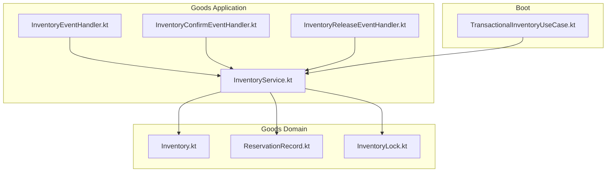
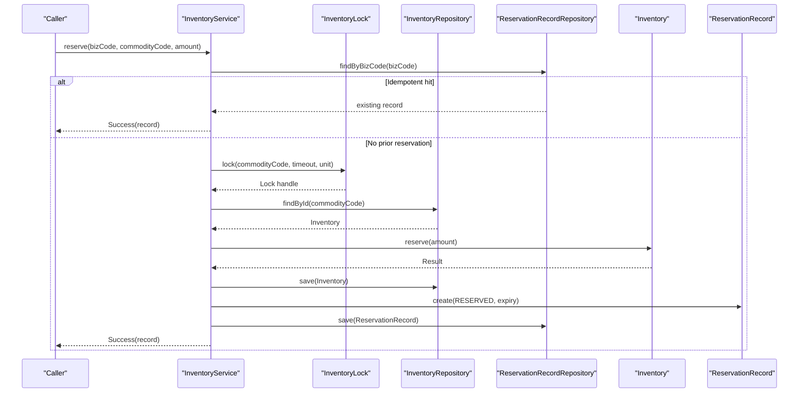
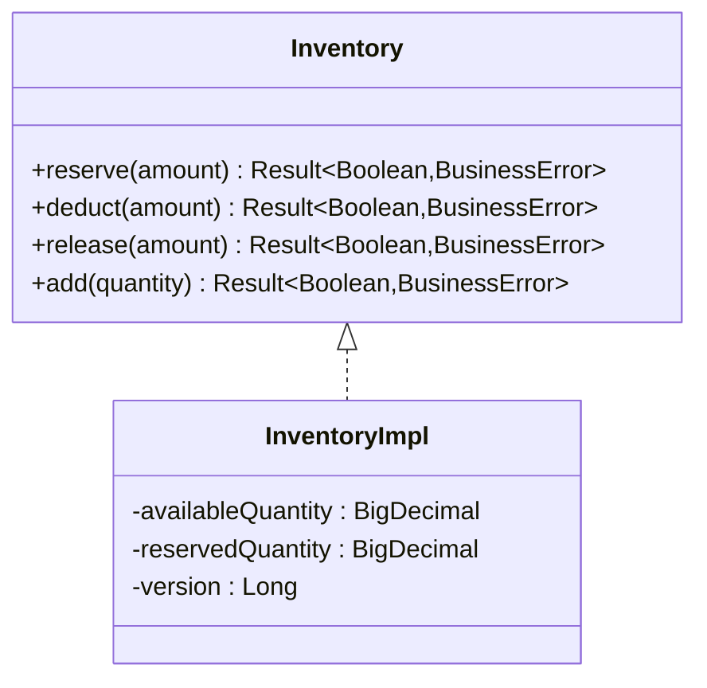
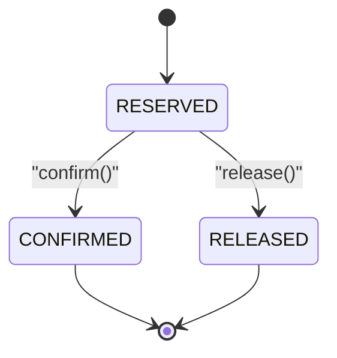
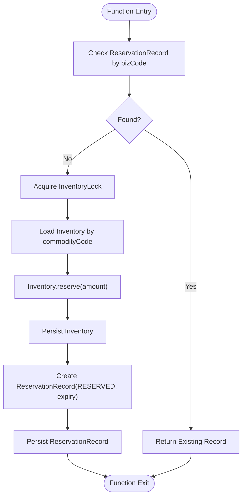
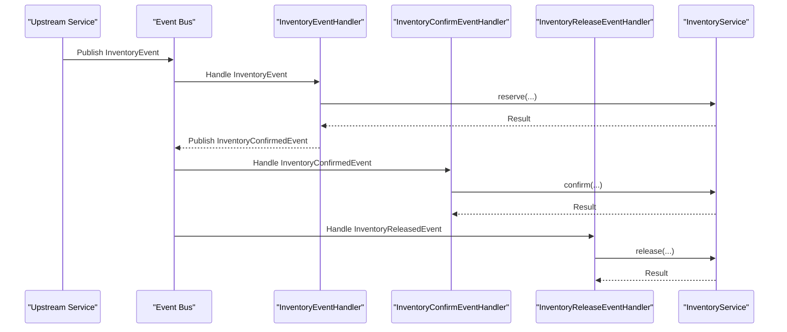
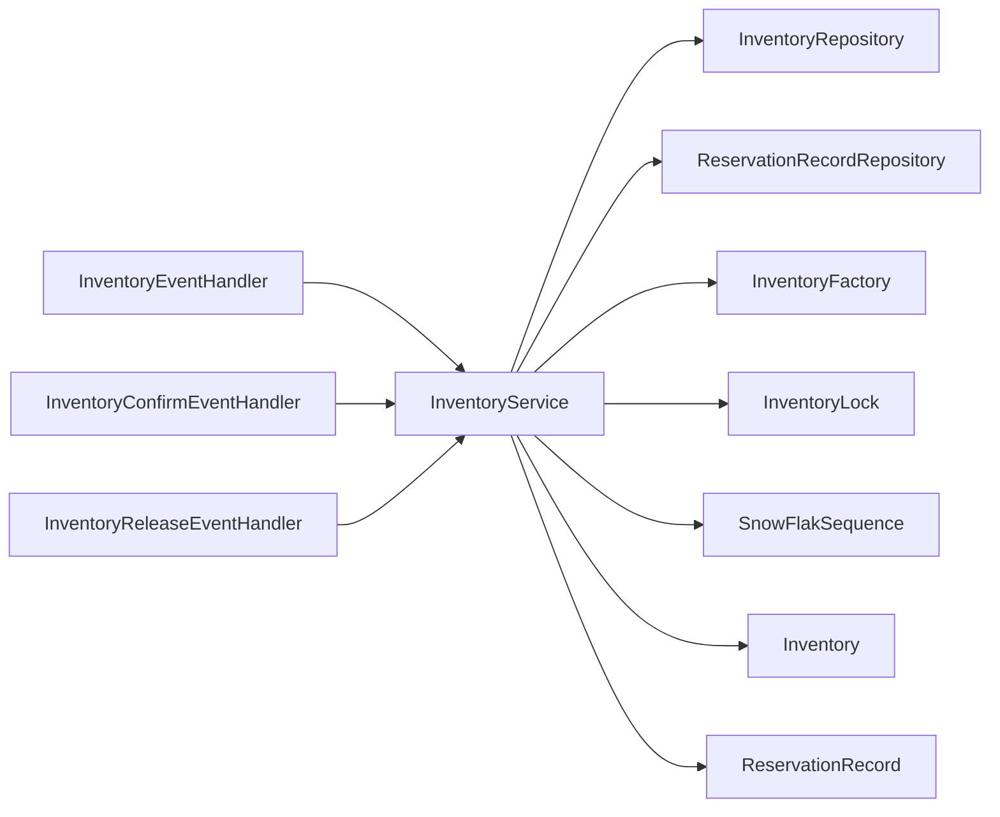

# Inventory Management System

<cite>
**Referenced Files in This Document**
- [Inventory.kt](file://j-store-goods-domain/src/main/kotlin/com/jstore/goods/domain/inventory/Inventory.kt)
- [ReservationRecord.kt](file://j-store-goods-domain/src/main/kotlin/com/jstore/goods/domain/inventory/ReservationRecord.kt)
- [InventoryLock.kt](file://j-store-goods-domain/src/main/kotlin/com/jstore/goods/domain/inventory/InventoryLock.kt)
- [InventoryService.kt](file://j-store-goods-application/src/main/kotlin/com/jstore/goods/service/InventoryService.kt)
- [InventoryEventHandler.kt](file://j-store-goods-application/src/main/kotlin/com/jstore/goods/service/InventoryEventHandler.kt)
- [InventoryConfirmEventHandler.kt](file://j-store-goods-application/src/main/kotlin/com/jstore/goods/service/InventoryConfirmEventHandler.kt)
- [InventoryReleaseEventHandler.kt](file://j-store-goods-application/src/main/kotlin/com/jstore/goods/service/InventoryReleaseEventHandler.kt)
- [TransactionalInventoryUseCase.kt](file://j-store-goods-boot/src/main/kotlin/com/jstore/goods/config/TransactionalInventoryUseCase.kt)
</cite>

## Table of Contents
1. Introduction
2. Project Structure
3. Core Components
4. Architecture Overview
5. Detailed Component Analysis
6. Dependency Analysis
7. Performance Considerations
8. Troubleshooting Guide
9. Conclusion

## Introduction
This document explains the inventory management system implemented in the Goods module. It focuses on:
- The Inventory aggregate design and its TCC-style operations (reserve, confirm/deduct, release).
- Stock reservation mechanisms via ReservationRecord with idempotency and expiry semantics.
- Inventory synchronization patterns across services using domain events and event handlers.
- Allocation strategies, stock level calculations, availability checks, and concurrency controls.
- Event-driven architecture for cross-service communication and distributed considerations.

## Project Structure
The inventory functionality is split between domain and application layers:
- Domain layer defines the Inventory aggregate, ReservationRecord, and locking abstractions.
- Application layer orchestrates workflows, enforces idempotency, and coordinates persistence and locking.
- Boot configuration provides transactional boundaries for use cases.

**Diagram sources**
- [Inventory.kt](file://j-store-goods-domain/src/main/kotlin/com/jstore/goods/domain/inventory/Inventory.kt)
- [ReservationRecord.kt](file://j-store-goods-domain/src/main/kotlin/com/jstore/goods/domain/inventory/ReservationRecord.kt)
- [InventoryLock.kt](file://j-store-goods-domain/src/main/kotlin/com/jstore/goods/domain/inventory/InventoryLock.kt)
- [InventoryService.kt](file://j-store-goods-application/src/main/kotlin/com/jstore/goods/service/InventoryService.kt)
- [InventoryEventHandler.kt](file://j-store-goods-application/src/main/kotlin/com/jstore/goods/service/InventoryEventHandler.kt)
- [InventoryConfirmEventHandler.kt](file://j-store-goods-application/src/main/kotlin/com/jstore/goods/service/InventoryConfirmEventHandler.kt)
- [InventoryReleaseEventHandler.kt](file://j-store-goods-application/src/main/kotlin/com/jstore/goods/service/InventoryReleaseEventHandler.kt)
- [TransactionalInventoryUseCase.kt](file://j-store-goods-boot/src/main/kotlin/com/jstore/goods/config/TransactionalInventoryUseCase.kt)

**Section sources**
- [Inventory.kt](file://j-store-goods-domain/src/main/kotlin/com/jstore/goods/domain/inventory/Inventory.kt)
- [ReservationRecord.kt](file://j-store-goods-domain/src/main/kotlin/com/jstore/goods/domain/inventory/ReservationRecord.kt)
- [InventoryLock.kt](file://j-store-goods-domain/src/main/kotlin/com/jstore/goods/domain/inventory/InventoryLock.kt)
- [InventoryService.kt](file://j-store-goods-application/src/main/kotlin/com/jstore/goods/service/InventoryService.kt)
- [InventoryEventHandler.kt](file://j-store-goods-application/src/main/kotlin/com/jstore/goods/service/InventoryEventHandler.kt)
- [InventoryConfirmEventHandler.kt](file://j-store-goods-application/src/main/kotlin/com/jstore/goods/service/InventoryConfirmEventHandler.kt)
- [InventoryReleaseEventHandler.kt](file://j-store-goods-application/src/main/kotlin/com/jstore/goods/service/InventoryReleaseEventHandler.kt)
- [TransactionalInventoryUseCase.kt](file://j-store-goods-boot/src/main/kotlin/com/jstore/goods/config/TransactionalInventoryUseCase.kt)

## Core Components
- Inventory aggregate: Maintains availableQuantity and reservedQuantity; exposes reserve, deduct, release, and add operations.
- ReservationRecord: Tracks a pre-reservation with bizCode idempotency key, commodityCode, amount, status transitions (RESERVED → CONFIRMED or RELEASED), and expiryTime.
- InventoryLock: Abstraction for per-commodity locking to ensure concurrency safety during updates.
- InventoryService: Orchestrates reserve/confirm/release flows, enforces idempotency via ReservationRecord, applies locking, and persists state changes.

Key behaviors:
- Pre-reservation (reserve): Checks availability, moves quantity from available to reserved, creates a ReservationRecord with an expiry window.
- Confirmation (confirm): Validates record state and expiry, transitions to CONFIRMED, deducts reserved quantity.
- Release (release): Validates record state, transitions to RELEASED, returns reserved quantity back to available.

**Section sources**
- [Inventory.kt](file://j-store-goods-domain/src/main/kotlin/com/jstore/goods/domain/inventory/Inventory.kt)
- [ReservationRecord.kt](file://j-store-goods-domain/src/main/kotlin/com/jstore/goods/domain/inventory/ReservationRecord.kt)
- [InventoryLock.kt](file://j-store-goods-domain/src/main/kotlin/com/jstore/goods/domain/inventory/InventoryLock.kt)
- [InventoryService.kt](file://j-store-goods-application/src/main/kotlin/com/jstore/goods/service/InventoryService.kt)

## Architecture Overview
The system uses a TCC-like pattern within a single service boundary, coordinated by application use cases and protected by locks. Events are published and handled by separate components to synchronize inventory state across modules.

**Diagram sources**
- [InventoryService.kt](file://j-store-goods-application/src/main/kotlin/com/jstore/goods/service/InventoryService.kt)
- [Inventory.kt](file://j-store-goods-domain/src/main/kotlin/com/jstore/goods/domain/inventory/Inventory.kt)
- [ReservationRecord.kt](file://j-store-goods-domain/src/main/kotlin/com/jstore/goods/domain/inventory/ReservationRecord.kt)
- [InventoryLock.kt](file://j-store-goods-domain/src/main/kotlin/com/jstore/goods/domain/inventory/InventoryLock.kt)

## Detailed Component Analysis

### Inventory Aggregate
- State fields: availableQuantity, reservedQuantity.
- Operations:
  - reserve(amount): Decreases availableQuantity, increases reservedQuantity if sufficient.
  - deduct(amount): Decreases reservedQuantity when confirming a reservation.
  - release(amount): Increases availableQuantity and decreases reservedQuantity when releasing.
  - add(quantity): Increases availableQuantity for stock replenishment.

Stock level calculation:
- Available = total - reserved
- Reserved = sum of active reservations not yet confirmed or released
- Deductible = reserved minus already confirmed amounts

Availability check:
- reserve() validates availableQuantity >= amount before moving stock to reserved.

Concurrency control:
- Per-commodity lock ensures only one update path executes at a time for a given commodity.

**Diagram sources**
- [Inventory.kt](file://j-store-goods-domain/src/main/kotlin/com/jstore/goods/domain/inventory/Inventory.kt)

**Section sources**
- [Inventory.kt](file://j-store-goods-domain/src/main/kotlin/com/jstore/goods/domain/inventory/Inventory.kt)

### ReservationRecord and Status Transitions
- Fields: id, bizCode, commodityCode, amount, status, expiryTime.
- Transitions:
  - confirm(): RESERVED → CONFIRMED; rejects if already CONFIRMED or RELEASED or expired.
  - release(): RESERVED → RELEASED; rejects if already CONFIRMED or RELEASED.

Idempotency:
- findByBizCode() enables returning existing records for duplicate requests.

Expiry handling:
- Expired records cannot be confirmed; they must be released or cleaned up.

**Diagram sources**
- [ReservationRecord.kt](file://j-store-goods-domain/src/main/kotlin/com/jstore/goods/domain/inventory/ReservationRecord.kt)

**Section sources**
- [ReservationRecord.kt](file://j-store-goods-domain/src/main/kotlin/com/jstore/goods/domain/inventory/ReservationRecord.kt)

### InventoryService Orchestration
Reserve workflow:
- Check idempotency via ReservationRecordRepository.findByBizCode().
- Acquire per-commodity lock.
- Load Inventory, call reserve(), persist updated Inventory.
- Create ReservationRecord with RESERVED status and expiry, persist it.

Confirm workflow:
- Load ReservationRecord by bizCode.
- Transition to CONFIRMED via confirm().
- Load Inventory, call deduct(), persist both.

Release workflow:
- Load ReservationRecord by bizCode.
- Transition to RELEASED via release().
- Load Inventory, call release(), persist both.

Add workflow:
- Acquire lock, load Inventory, add quantity, persist.

**Diagram sources**
- [InventoryService.kt](file://j-store-goods-application/src/main/kotlin/com/jstore/goods/service/InventoryService.kt)

**Section sources**
- [InventoryService.kt](file://j-store-goods-application/src/main/kotlin/com/jstore/goods/service/InventoryService.kt)

### Event Handlers and Cross-Service Synchronization
- InventoryEventHandler: Consumes domain events to trigger inventory actions such as pre-reservation or adjustments based on upstream business events.
- InventoryConfirmEventHandler: Consumes confirmation events to finalize deductions against reserved stock.
- InventoryReleaseEventHandler: Consumes release events to restore reserved stock back to available.

These handlers coordinate with InventoryService to apply state changes consistently and publish further events as needed.

**Diagram sources**
- [InventoryEventHandler.kt](file://j-store-goods-application/src/main/kotlin/com/jstore/goods/service/InventoryEventHandler.kt)
- [InventoryConfirmEventHandler.kt](file://j-store-goods-application/src/main/kotlin/com/jstore/goods/service/InventoryConfirmEventHandler.kt)
- [InventoryReleaseEventHandler.kt](file://j-store-goods-application/src/main/kotlin/com/jstore/goods/service/InventoryReleaseEventHandler.kt)
- [InventoryService.kt](file://j-store-goods-application/src/main/kotlin/com/jstore/goods/service/InventoryService.kt)

**Section sources**
- [InventoryEventHandler.kt](file://j-store-goods-application/src/main/kotlin/com/jstore/goods/service/InventoryEventHandler.kt)
- [InventoryConfirmEventHandler.kt](file://j-store-goods-application/src/main/kotlin/com/jstore/goods/service/InventoryConfirmEventHandler.kt)
- [InventoryReleaseEventHandler.kt](file://j-store-goods-application/src/main/kotlin/com/jstore/goods/service/InventoryReleaseEventHandler.kt)

### Transaction Boundaries
- TransactionalInventoryUseCase configures transactional boundaries for inventory use cases, ensuring atomicity of reserve/confirm/release operations and their side effects.

**Section sources**
- [TransactionalInventoryUseCase.kt](file://j-store-goods-boot/src/main/kotlin/com/jstore/goods/config/TransactionalInventoryUseCase.kt)

## Dependency Analysis
- InventoryService depends on:
  - InventoryRepository (persistence of Inventory)
  - ReservationRecordRepository (idempotency and lifecycle tracking)
  - InventoryFactory (creation of Inventory instances)
  - InventoryLock (concurrency control)
  - SnowFlakSequence (reservation record ID generation)
- Inventory aggregate encapsulates stock math and validation.
- ReservationRecord encapsulates reservation lifecycle and expiry logic.
- Event handlers depend on InventoryService to apply domain operations.

**Diagram sources**
- [InventoryService.kt](file://j-store-goods-application/src/main/kotlin/com/jstore/goods/service/InventoryService.kt)
- [Inventory.kt](file://j-store-goods-domain/src/main/kotlin/com/jstore/goods/domain/inventory/Inventory.kt)
- [ReservationRecord.kt](file://j-store-goods-domain/src/main/kotlin/com/jstore/goods/domain/inventory/ReservationRecord.kt)
- [InventoryLock.kt](file://j-store-goods-domain/src/main/kotlin/com/jstore/goods/domain/inventory/InventoryLock.kt)
- [InventoryEventHandler.kt](file://j-store-goods-application/src/main/kotlin/com/jstore/goods/service/InventoryEventHandler.kt)
- [InventoryConfirmEventHandler.kt](file://j-store-goods-application/src/main/kotlin/com/jstore/goods/service/InventoryConfirmEventHandler.kt)
- [InventoryReleaseEventHandler.kt](file://j-store-goods-application/src/main/kotlin/com/jstore/goods/service/InventoryReleaseEventHandler.kt)

**Section sources**
- [InventoryService.kt](file://j-store-goods-application/src/main/kotlin/com/jstore/goods/service/InventoryService.kt)

## Performance Considerations
- Concurrency control:
  - Per-commodity lock prevents hot-spot contention on high-demand SKUs.
  - Ensure lock timeouts are tuned to avoid long waits under load.
- Idempotency:
  - ReservationRecord lookup by bizCode avoids duplicate reserves and reduces contention.
- Throughput:
  - Batch operations should be considered for bulk stock adjustments.
  - Minimize round-trips by coalescing repository calls where safe.
- Scalability:
  - For distributed deployments, implement InventoryLock with a distributed lock provider.
  - Use asynchronous event processing with retry and dead-lettering for resilience.
- Observability:
  - Log lock acquisition failures and concurrent conflicts to detect bottlenecks.
  - Track reservation expiry rates to tune expiry windows.

[No sources needed since this section provides general guidance]

## Troubleshooting Guide
Common issues and resolutions:
- Insufficient inventory:
  - Occurs when availableQuantity < requested amount during reserve().
  - Action: Review demand spikes, increase stock, or adjust allocation strategy.
- Concurrent conflict:
  - Lock acquisition failure maps to a concurrent conflict error.
  - Action: Increase lock timeout, scale consumers, or reduce contention via sharding.
- Reservation not found:
  - Confirm/release requires an existing ReservationRecord by bizCode.
  - Action: Verify upstream idempotency keys and event delivery.
- Illegal state:
  - Confirm/release called on invalid states or expired records.
  - Action: Enforce correct ordering and implement cleanup for expired reservations.

**Section sources**
- [InventoryService.kt](file://j-store-goods-application/src/main/kotlin/com/jstore/goods/service/InventoryService.kt)
- [ReservationRecord.kt](file://j-store-goods-domain/src/main/kotlin/com/jstore/goods/domain/inventory/ReservationRecord.kt)

## Conclusion
The inventory management system implements a robust TCC-style model with clear separation of concerns:
- Inventory aggregate handles stock math and validations.
- ReservationRecord provides idempotent, expirable reservations.
- InventoryService orchestrates workflows with locking and persistence.
- Event handlers enable cross-service synchronization and decoupled updates.
For high-concurrency and distributed scenarios, focus on lock tuning, idempotency guarantees, and resilient event processing to maintain consistency and performance.