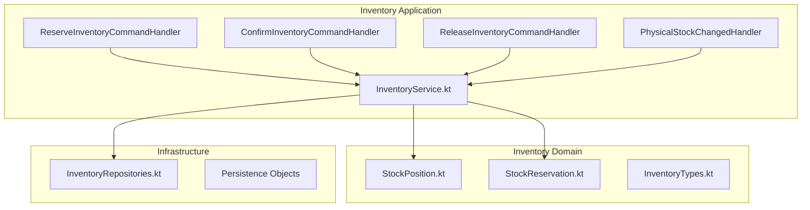
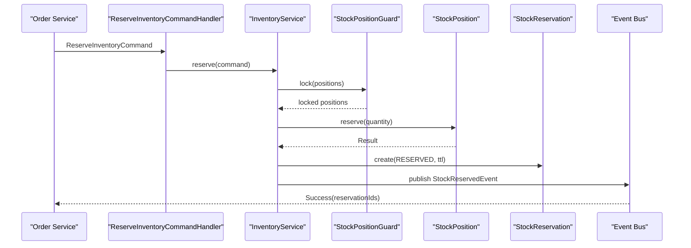
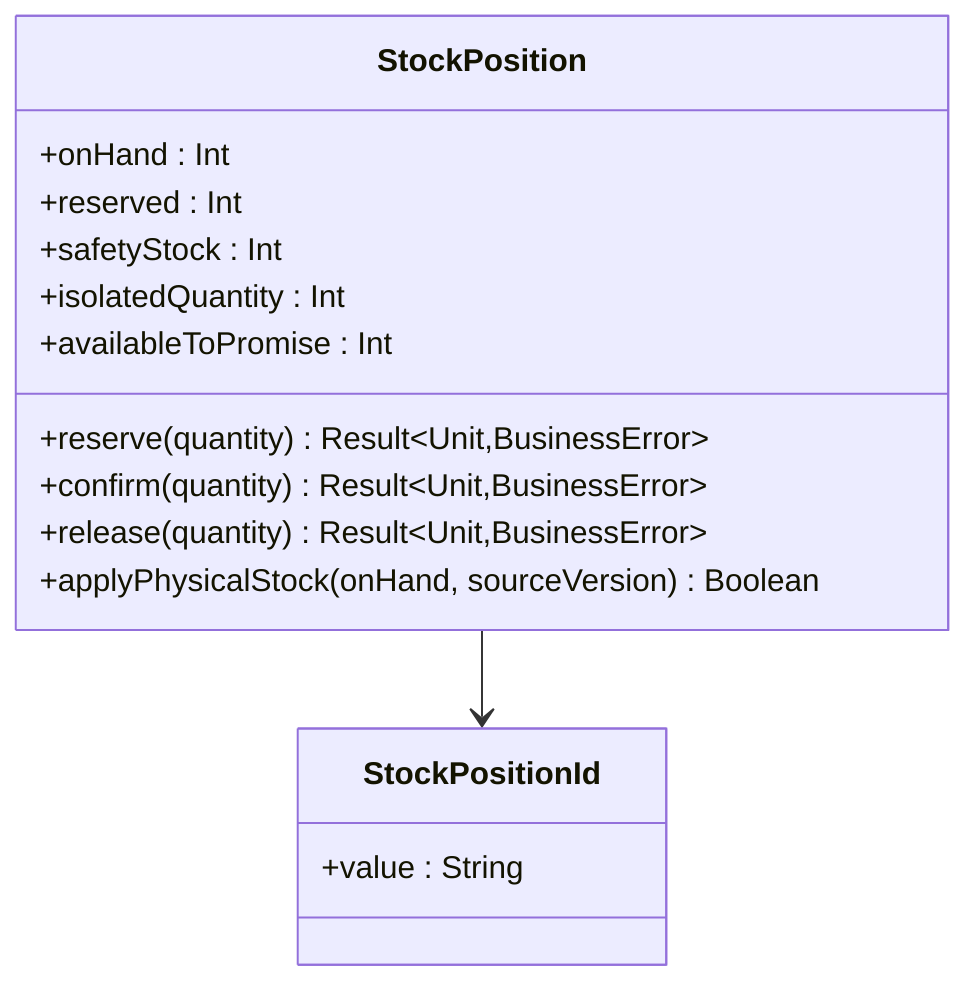
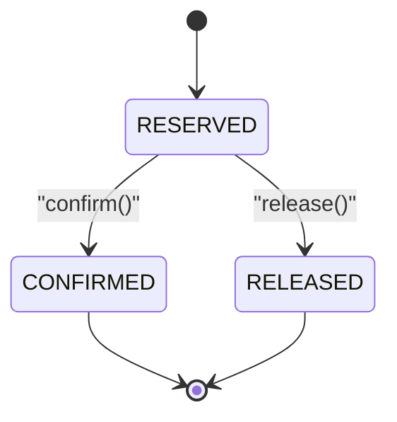
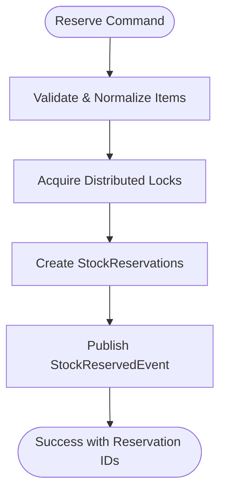
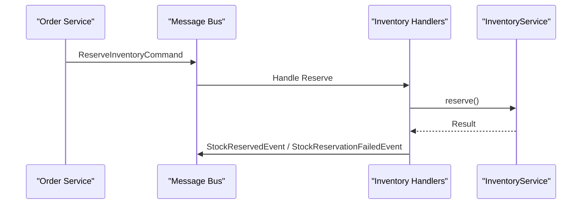
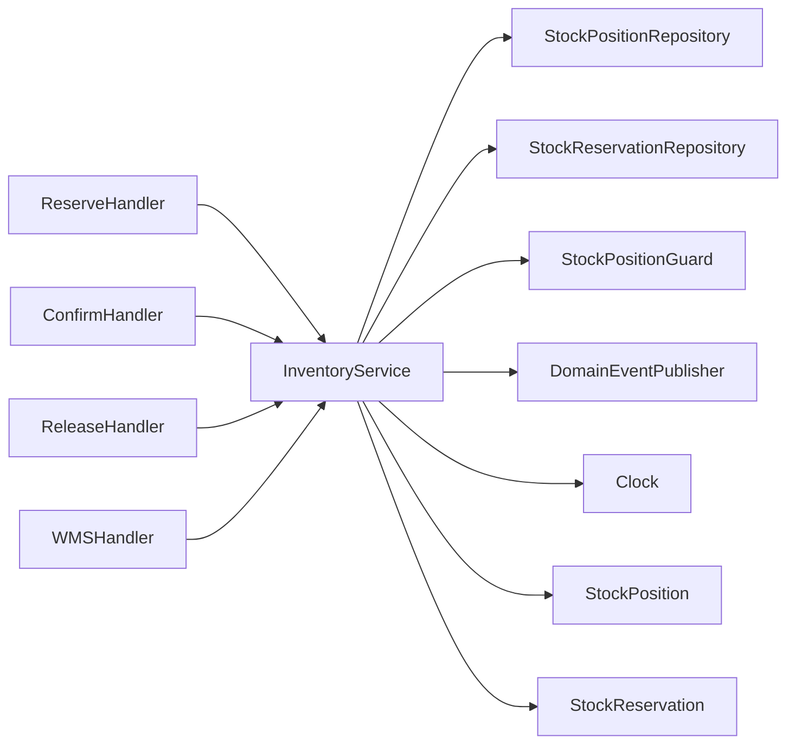

# Inventory Management System

<cite>
**Referenced Files in This Document**
- [StockPosition.kt](file://j-store-inventory-domain/src/main/kotlin/com/jstore/inventory/domain/StockPosition.kt)
- [StockReservation.kt](file://j-store-inventory-domain/src/main/kotlin/com/jstore/inventory/domain/StockReservation.kt)
- [InventoryTypes.kt](file://j-store-inventory-domain/src/main/kotlin/com/jstore/inventory/domain/InventoryTypes.kt)
- [InventoryService.kt](file://j-store-inventory-application/src/main/kotlin/com/jstore/inventory/service/InventoryService.kt)
- [InventoryEvents.kt](file://j-store-inventory-domain/src/main/kotlin/com/jstore/inventory/domain/event/InventoryEvents.kt)
- [InventoryErrors.kt](file://j-store-inventory-domain/src/main/kotlin/com/jstore/inventory/domain/InventoryErrors.kt)
- [InventoryRepositories.kt](file://j-store-inventory-domain/src/main/kotlin/com/jstore/inventory/domain/InventoryRepositories.kt)
</cite>

## Update Summary
**Changes Made**
- Completely migrated from legacy inventory management system in goods domain to dedicated inventory module
- Replaced Inventory aggregate with StockPosition aggregate for better stock management
- Introduced StockReservation aggregate for reservation lifecycle management
- Updated all workflows to use new inventory services and repositories
- Enhanced event-driven architecture with proper domain events
- Improved concurrency control with StockPositionGuard

## Table of Contents
1. Introduction
2. Project Structure
3. Core Components
4. Architecture Overview
5. Detailed Component Analysis
6. Dependency Analysis
7. Performance Considerations
8. Troubleshooting Guide
9. Conclusion

## Introduction
This document explains the inventory management system implemented in the dedicated Inventory module, which has completely replaced the legacy inventory functionality that was previously embedded in the Goods domain. The new system focuses on:
- The StockPosition aggregate design with advanced stock tracking capabilities
- Stock reservation mechanisms via StockReservation with idempotency and expiry semantics
- Inventory synchronization patterns across services using domain events and integration messages
- Allocation strategies, stock level calculations, availability checks, and enhanced concurrency controls
- Event-driven architecture for cross-service communication and distributed considerations

## Project Structure
The inventory functionality is now organized in a dedicated module with clear separation between domain, application, and infrastructure layers:
- Domain layer defines StockPosition aggregate, StockReservation, and type definitions
- Application layer orchestrates workflows through InventoryService with proper transaction boundaries
- Infrastructure layer provides persistence implementations and repository abstractions
- Boot configuration wires up the service components and message handlers

**Diagram sources**
- [StockPosition.kt](file://j-store-inventory-domain/src/main/kotlin/com/jstore/inventory/domain/StockPosition.kt)
- [StockReservation.kt](file://j-store-inventory-domain/src/main/kotlin/com/jstore/inventory/domain/StockReservation.kt)
- [InventoryTypes.kt](file://j-store-inventory-domain/src/main/kotlin/com/jstore/inventory/domain/InventoryTypes.kt)
- [InventoryService.kt](file://j-store-inventory-application/src/main/kotlin/com/jstore/inventory/service/InventoryService.kt)

**Section sources**
- [StockPosition.kt](file://j-store-inventory-domain/src/main/kotlin/com/jstore/inventory/domain/StockPosition.kt)
- [StockReservation.kt](file://j-store-inventory-domain/src/main/kotlin/com/jstore/inventory/domain/StockReservation.kt)
- [InventoryTypes.kt](file://j-store-inventory-domain/src/main/kotlin/com/jstore/inventory/domain/InventoryTypes.kt)
- [InventoryService.kt](file://j-store-inventory-application/src/main/kotlin/com/jstore/inventory/service/InventoryService.kt)

## Core Components
- **StockPosition aggregate**: Maintains onHand, reserved, safetyStock, and isolatedQuantity; exposes reserve, confirm, release, and physical stock update operations with ATP (Available to Promise) calculation
- **StockReservation aggregate**: Tracks reservation lifecycle with businessKey idempotency, order association, authorization tracking, status transitions (RESERVED → CONFIRMED or RELEASED), and expiry handling
- **Type system**: Strongly-typed identifiers (StockPositionId, StockReservationId, SkuId, FulfillmentNodeId) ensuring data integrity
- **InventoryService**: Orchestrates reserve/confirm/release flows with proper locking, idempotency, and event publishing

Key behaviors:
- **Pre-reservation (reserve)**: Validates availability using ATP calculation, creates reservations with TTL, publishes StockReservedEvent
- **Confirmation (confirm)**: Processes confirmed orders, deducts from both reserved and on-hand quantities
- **Release (release)**: Handles order cancellations, returns reserved quantities back to available pool
- **Physical stock sync**: WMS integration for absolute stock updates with version-based idempotency

**Section sources**
- [StockPosition.kt](file://j-store-inventory-domain/src/main/kotlin/com/jstore/inventory/domain/StockPosition.kt)
- [StockReservation.kt](file://j-store-inventory-domain/src/main/kotlin/com/jstore/inventory/domain/StockReservation.kt)
- [InventoryTypes.kt](file://j-store-inventory-domain/src/main/kotlin/com/jstore/inventory/domain/InventoryTypes.kt)
- [InventoryService.kt](file://j-store-inventory-application/src/main/kotlin/com/jstore/inventory/service/InventoryService.kt)

## Architecture Overview
The system uses a modern DDD approach with clear aggregate boundaries, event sourcing for reservations, and integration messaging for cross-service communication.

**Diagram sources**
- [InventoryService.kt](file://j-store-inventory-application/src/main/kotlin/com/jstore/inventory/service/InventoryService.kt)
- [StockPosition.kt](file://j-store-inventory-domain/src/main/kotlin/com/jstore/inventory/domain/StockPosition.kt)
- [StockReservation.kt](file://j-store-inventory-domain/src/main/kotlin/com/jstore/inventory/domain/StockReservation.kt)

## Detailed Component Analysis

### StockPosition Aggregate
- **State fields**: onHand (physical stock), reserved (committed but not shipped), safetyStock (buffer), isolatedQuantity (quarantined stock)
- **Operations**:
  - reserve(quantity): Decreases availableToPromise by reserving quantity
  - confirm(quantity): Deducts from both reserved and onHand when order ships
  - release(quantity): Returns reserved quantity back to available pool
  - applyPhysicalStock(onHand, sourceVersion): Absolute update from WMS with version control
  - changeSafetyStock(), changeIsolatedQuantity(): Adjust buffer and quarantine levels

**Stock level calculation**:
- Available to Promise (ATP) = onHand - reserved - safetyStock - isolatedQuantity
- Physical stock changes are versioned to handle concurrent WMS updates
- Safety stock acts as a buffer to prevent overselling during peak demand

**Concurrency control**:
- Uses StockPositionGuard for distributed locking per position key
- Version-based optimistic locking for physical stock updates

**Diagram sources**
- [StockPosition.kt](file://j-store-inventory-domain/src/main/kotlin/com/jstore/inventory/domain/StockPosition.kt)

**Section sources**
- [StockPosition.kt](file://j-store-inventory-domain/src/main/kotlin/com/jstore/inventory/domain/StockPosition.kt)

### StockReservation and Status Transitions
- **Fields**: businessKey (idempotency), orderId, saleAuthorizationId, skuId, fulfillmentNodeId, quantity, expiresAt, status
- **Transitions**:
  - confirm(): RESERVED → CONFIRMED; idempotent if already confirmed
  - release(now): RESERVED → RELEASED; raises StockReservationReleasedEvent
- **Expiry handling**: Reservations have TTL-based expiration managed by external cleanup processes

**Idempotency**:
- businessKey ensures duplicate requests are handled safely
- findByOrderId() enables batch processing of order-related operations

**Diagram sources**
- [StockReservation.kt](file://j-store-inventory-domain/src/main/kotlin/com/jstore/inventory/domain/StockReservation.kt)

**Section sources**
- [StockReservation.kt](file://j-store-inventory-domain/src/main/kotlin/com/jstore/inventory/domain/StockReservation.kt)

### InventoryService Orchestration
**Reserve workflow**:
- Validates command parameters and normalizes items by grouping identical SKU/node combinations
- Acquires distributed locks on all required positions
- Creates StockReservation records with TTL and publishes StockReservedEvent
- Returns reservation IDs for downstream processing

**Confirm workflow**:
- Loads all reservations for an order
- Applies confirm() to each active reservation
- Updates both StockPosition and StockReservation aggregates
- Idempotent - can be called multiple times safely

**Release workflow**:
- Filters only active (RESERVED) reservations
- Releases quantities back to available pool
- Raises StockReservationReleasedEvent for downstream notifications

**Physical stock sync**:
- Handles WMS integration events with absolute stock values
- Uses sourceVersion for optimistic concurrency control
- Creates positions on-demand if they don't exist

**Diagram sources**
- [InventoryService.kt](file://j-store-inventory-application/src/main/kotlin/com/jstore/inventory/service/InventoryService.kt)

**Section sources**
- [InventoryService.kt](file://j-store-inventory-application/src/main/kotlin/com/jstore/inventory/service/InventoryService.kt)

### Integration Message Handlers
- **ReserveInventoryCommandHandler**: Entry point for stock reservation requests, publishes domain events
- **ConfirmInventoryCommandHandler**: Processes payment confirmation to finalize stock deductions
- **ReleaseInventoryCommandHandler**: Handles order cancellation to restore reserved stock
- **PhysicalStockChangedHandler**: Integrates with WMS for physical stock updates

These handlers provide clean interfaces for cross-service communication and ensure proper error handling and event publication.

**Diagram sources**
- [InventoryService.kt](file://j-store-inventory-application/src/main/kotlin/com/jstore/inventory/service/InventoryService.kt)

**Section sources**
- [InventoryService.kt](file://j-store-inventory-application/src/main/kotlin/com/jstore/inventory/service/InventoryService.kt)

## Dependency Analysis
- **InventoryService depends on**:
  - StockPositionRepository (persistence of stock positions)
  - StockReservationRepository (reservation lifecycle tracking)
  - StockPositionGuard (distributed locking)
  - DomainEventPublisher (event publishing)
  - Clock (time-based operations for TTL)
- **Domain aggregates encapsulate**:
  - StockPosition: Stock math, validation, and physical stock updates
  - StockReservation: Reservation lifecycle and state transitions
- **Integration handlers depend on**:
  - InventoryService for core business logic
  - Event bus for cross-service communication

**Diagram sources**
- [InventoryService.kt](file://j-store-inventory-application/src/main/kotlin/com/jstore/inventory/service/InventoryService.kt)
- [StockPosition.kt](file://j-store-inventory-domain/src/main/kotlin/com/jstore/inventory/domain/StockPosition.kt)
- [StockReservation.kt](file://j-store-inventory-domain/src/main/kotlin/com/jstore/inventory/domain/StockReservation.kt)

**Section sources**
- [InventoryService.kt](file://j-store-inventory-application/src/main/kotlin/com/jstore/inventory/service/InventoryService.kt)

## Performance Considerations
- **Distributed locking**:
  - StockPositionGuard prevents hot-spot contention on high-demand SKUs
  - Batch locking for multi-item orders reduces lock acquisition overhead
  - Configurable timeouts to balance between consistency and performance
- **Idempotency**:
  - businessKey-based deduplication prevents duplicate reservations
  - Version-based physical stock updates handle concurrent WMS updates
- **Throughput optimization**:
  - Item normalization groups identical SKU/node combinations
  - Batch operations for confirm/release reduce database round-trips
  - Asynchronous event processing decouples inventory updates from order processing
- **Scalability**:
  - Stateless service design enables horizontal scaling
  - Event-driven architecture supports eventual consistency patterns
  - WMS integration handles large-scale physical stock updates efficiently
- **Monitoring**:
  - Track reservation TTL expiry rates to tune timeout configurations
  - Monitor lock contention metrics to identify bottlenecks
  - Log failed reservations for capacity planning

## Troubleshooting Guide
Common issues and resolutions:
- **Insufficient ATP**:
  - Occurs when availableToPromise < requested quantity during reserve()
  - Action: Review safety stock levels, increase physical stock, or adjust allocation strategy
- **Position not found**:
  - Distributed lock acquisition fails when position doesn't exist
  - Action: Ensure WMS has initialized stock positions for all SKUs/nodes
- **Illegal reservation state**:
  - Confirm/release called on invalid states or expired reservations
  - Action: Verify upstream ordering and implement cleanup for expired reservations
- **Reservation conflicts**:
  - Duplicate reservation attempts or expired TTL
  - Action: Check businessKey uniqueness and adjust reservation TTL based on order processing time
- **WMS sync issues**:
  - Physical stock updates fail due to version conflicts
  - Action: Implement retry logic with exponential backoff for WMS integration failures

**Section sources**
- [InventoryService.kt](file://j-store-inventory-application/src/main/kotlin/com/jstore/inventory/service/InventoryService.kt)
- [StockPosition.kt](file://j-store-inventory-domain/src/main/kotlin/com/jstore/inventory/domain/StockPosition.kt)
- [StockReservation.kt](file://j-store-inventory-domain/src/main/kotlin/com/jstore/inventory/domain/StockReservation.kt)

## Conclusion
The inventory management system has been successfully migrated from the legacy Goods domain implementation to a dedicated Inventory module with improved architecture and capabilities:
- **StockPosition aggregate** provides robust stock tracking with ATP calculation and WMS integration
- **StockReservation aggregate** offers reliable reservation lifecycle management with proper state transitions
- **InventoryService** orchestrates complex workflows with distributed locking and event-driven communication
- **Integration handlers** enable seamless cross-service communication with proper error handling
- **Enhanced scalability** through distributed locking, event sourcing, and asynchronous processing

For high-concurrency and distributed scenarios, the system leverages modern DDD patterns, event-driven architecture, and distributed coordination primitives to maintain consistency while maximizing throughput and availability.