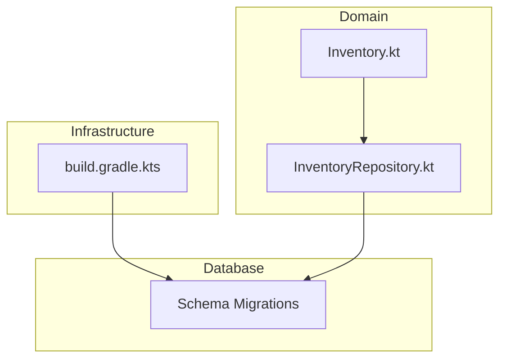
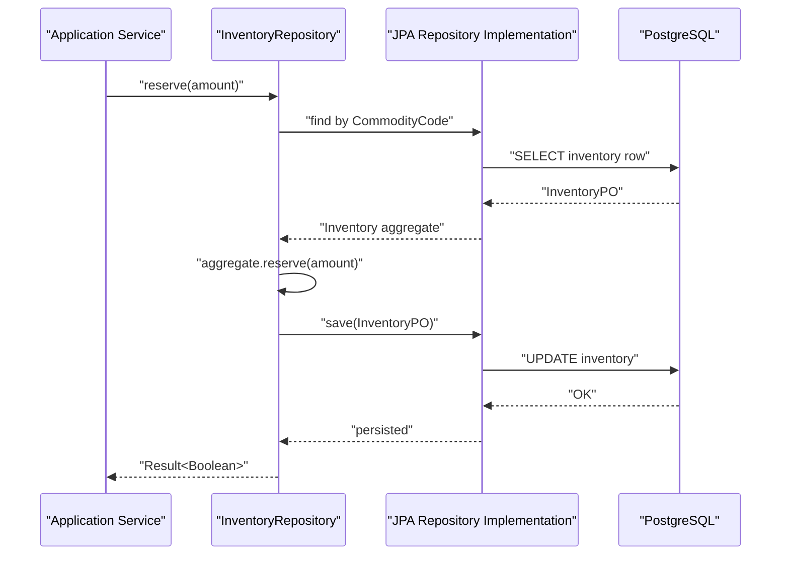
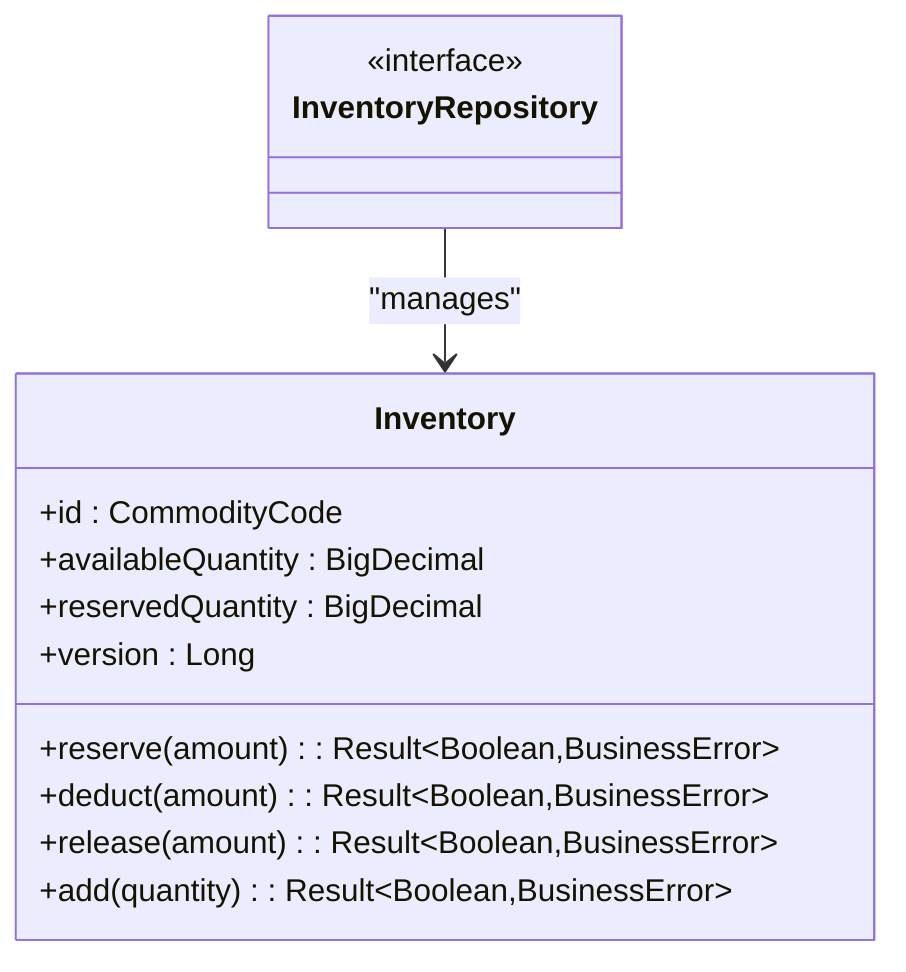
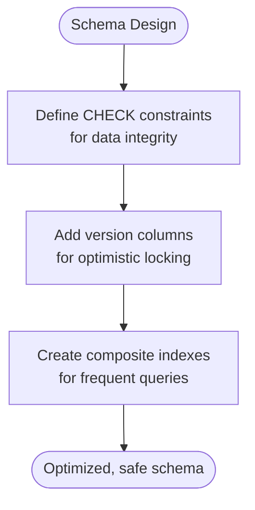
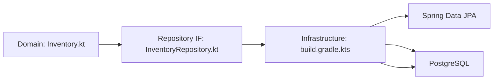

# Inventory Persistence Layer

<cite>
**Referenced Files in This Document**
- [Inventory.kt](file://j-store-goods-domain/src/main/kotlin/com/jstore/goods/domain/inventory/Inventory.kt)
- [InventoryRepository.kt](file://j-store-goods-domain/src/main/kotlin/com/jstore/goods/domain/inventory/InventoryRepository.kt)
- [build.gradle.kts](file://j-store-goods-infrastructure/build.gradle.kts)
- [V20260731__order_status_dimensions.sql](file://j-store-boot/src/main/resources/db/migration/V20260731__order_status_dimensions.sql)
- [V20260803__order_after_sale_aggregate.sql](file://j-store-boot/src/main/resources/db/migration/V20260803__order_after_sale_aggregate.sql)
</cite>

## Table of Contents
1. [Introduction](#introduction)
2. [Project Structure](#project-structure)
3. [Core Components](#core-components)
4. [Architecture Overview](#architecture-overview)
5. [Detailed Component Analysis](#detailed-component-analysis)
6. [Dependency Analysis](#dependency-analysis)
7. [Performance Considerations](#performance-considerations)
8. [Troubleshooting Guide](#troubleshooting-guide)
9. [Conclusion](#conclusion)

## Introduction
This document describes the inventory persistence layer for the J-Store project. It focuses on how the inventory domain model is designed, how it maps to a relational schema, and how repository interfaces are structured. It also outlines database schema design, indexing strategies, transaction management patterns, optimistic locking considerations, migration approaches, and performance guidance for high-concurrency inventory operations. Where applicable, it references concrete files in the repository to ground the discussion.

## Project Structure
The inventory persistence layer spans two modules:
- Domain module (j-store-goods-domain): Defines the inventory aggregate and repository interface.
- Infrastructure module (j-store-goods-infrastructure): Declares JPA/Spring Data dependencies and will host PO entities, JPA repositories, and implementations that persist inventory state.

**Diagram sources**
- [Inventory.kt:1-77](file://j-store-goods-domain/src/main/kotlin/com/jstore/goods/domain/inventory/Inventory.kt#L1-L77)
- [InventoryRepository.kt:1-6](file://j-store-goods-domain/src/main/kotlin/com/jstore/goods/domain/inventory/InventoryRepository.kt#L1-L6)
- [build.gradle.kts:1-45](file://j-store-goods-infrastructure/build.gradle.kts#L1-L45)

**Section sources**
- [Inventory.kt:1-77](file://j-store-goods-domain/src/main/kotlin/com/jstore/goods/domain/inventory/Inventory.kt#L1-L77)
- [InventoryRepository.kt:1-6](file://j-store-goods-domain/src/main/kotlin/com/jstore/goods/domain/inventory/InventoryRepository.kt#L1-L6)
- [build.gradle.kts:1-45](file://j-store-goods-infrastructure/build.gradle.kts#L1-L45)

## Core Components
- Inventory aggregate: Encapsulates available and reserved quantities with operations for reserve, deduct, release, and add. It enforces business rules such as insufficient inventory checks and reserved quantity validation.
- InventoryRepository: A domain-level repository interface extending a generic AggregateRepository abstraction, providing a consistent contract for persistence across aggregates.

Key responsibilities:
- Inventory: State transitions and invariants for stock reservation and deduction.
- InventoryRepository: Abstraction over persistence mechanisms, enabling interchangeable implementations (e.g., JPA).

**Section sources**
- [Inventory.kt:1-77](file://j-store-goods-domain/src/main/kotlin/com/jstore/goods/domain/inventory/Inventory.kt#L1-L77)
- [InventoryRepository.kt:1-6](file://j-store-goods-domain/src/main/kotlin/com/jstore/goods/domain/inventory/InventoryRepository.kt#L1-L6)

## Architecture Overview
At runtime, application services orchestrate inventory operations through the InventoryRepository. The infrastructure layer provides JPA-based persistence using Spring Data JPA. Database migrations define the schema and indexes used by the persistence layer.

[No diagram sources needed since this sequence illustrates conceptual flow without mapping to specific implementation files]

## Detailed Component Analysis

### Inventory Aggregate
The Inventory aggregate models stock availability and reservations:
- Available quantity decreases when reserving; reserved quantity increases accordingly.
- Deducting moves from reserved to consumed.
- Releasing returns reserved quantity back to available.
- Add increases available quantity (prepare pattern).

Concurrency and idempotency notes:
- The domain comments describe TCC-style semantics and storage locks for concurrency control.
- Idempotency via a business key (bizCode) is mentioned conceptually.

Optimistic locking:
- The aggregate includes a version field, which can be mapped to a database version column to implement optimistic concurrency control at the persistence layer.

**Diagram sources**
- [Inventory.kt:1-77](file://j-store-goods-domain/src/main/kotlin/com/jstore/goods/domain/inventory/Inventory.kt#L1-L77)
- [InventoryRepository.kt:1-6](file://j-store-goods-domain/src/main/kotlin/com/jstore/goods/domain/inventory/InventoryRepository.kt#L1-L6)

**Section sources**
- [Inventory.kt:1-77](file://j-store-goods-domain/src/main/kotlin/com/jstore/goods/domain/inventory/Inventory.kt#L1-L77)

### Repository Interface
The InventoryRepository extends a generic AggregateRepository, standardizing CRUD and aggregate-specific operations. This enables clean separation between domain logic and persistence details.

**Section sources**
- [InventoryRepository.kt:1-6](file://j-store-goods-domain/src/main/kotlin/com/jstore/goods/domain/inventory/InventoryRepository.kt#L1-L6)

### Infrastructure Dependencies
The infrastructure module declares Spring Data JPA and PostgreSQL runtime dependencies, indicating the intended persistence technology stack.

**Section sources**
- [build.gradle.kts:1-45](file://j-store-goods-infrastructure/build.gradle.kts#L1-L45)

### Database Schema Design and Indexing
While dedicated inventory tables are not present in the referenced migrations, the project demonstrates schema design patterns and indexing strategies that apply to inventory-related concerns:
- Use of CHECK constraints to enforce valid ranges and relationships.
- Composite indexes to optimize common query patterns (e.g., filtering by status and time).
- Version columns for optimistic concurrency control.

Relevant examples:
- Order status dimensions migration shows multi-column indexes on status fields combined with create_time for efficient queries.
- After-sale aggregate migration introduces version columns and capacity constraints, illustrating optimistic locking and ceiling enforcement patterns relevant to inventory capacity planning.

**Section sources**
- [V20260731__order_status_dimensions.sql:1-33](file://j-store-boot/src/main/resources/db/migration/V20260731__order_status_dimensions.sql#L1-L33)
- [V20260803__order_after_sale_aggregate.sql:1-21](file://j-store-boot/src/main/resources/db/migration/V20260803__order_after_sale_aggregate.sql#L1-L21)

## Dependency Analysis
The domain layer defines the Inventory aggregate and repository interface. The infrastructure layer depends on Spring Data JPA and PostgreSQL, preparing for JPA-based persistence. Migrations define schema elements that support integrity and performance.

**Diagram sources**
- [Inventory.kt:1-77](file://j-store-goods-domain/src/main/kotlin/com/jstore/goods/domain/inventory/Inventory.kt#L1-L77)
- [InventoryRepository.kt:1-6](file://j-store-goods-domain/src/main/kotlin/com/jstore/goods/domain/inventory/InventoryRepository.kt#L1-L6)
- [build.gradle.kts:1-45](file://j-store-goods-infrastructure/build.gradle.kts#L1-L45)

**Section sources**
- [Inventory.kt:1-77](file://j-store-goods-domain/src/main/kotlin/com/jstore/goods/domain/inventory/Inventory.kt#L1-L77)
- [InventoryRepository.kt:1-6](file://j-store-goods-domain/src/main/kotlin/com/jstore/goods/domain/inventory/InventoryRepository.kt#L1-L6)
- [build.gradle.kts:1-45](file://j-store-goods-infrastructure/build.gradle.kts#L1-L45)

## Performance Considerations
High-concurrency inventory operations require careful design:
- Optimistic locking: Use version columns to detect concurrent updates and avoid lost updates.
- Pessimistic locking: For critical sections where contention is high, consider SELECT ... FOR UPDATE to serialize access.
- Indexing: Create composite indexes on frequently filtered columns (e.g., commodity code, status, timestamps) to reduce full table scans.
- Batching: Batch updates and reads to minimize round trips.
- Caching: Consider read-through caches for hot SKU availability lookups; ensure cache invalidation aligns with write paths.
- Partitioning/Sharding: For very large inventories, partition by warehouse or commodity category to distribute load.

[No sources needed since this section provides general guidance]

## Troubleshooting Guide
Common issues and remedies:
- Insufficient inventory errors: Validate preconditions before reserve/deduct; log detailed context including commodity code and requested amount.
- Concurrency conflicts: Handle optimistic lock failures by retrying with updated state; ensure idempotent operations to prevent duplicate effects.
- Migration failures: Review constraint definitions and index creation steps; verify data compatibility before applying destructive migrations.

[No sources needed since this section provides general guidance]

## Conclusion
The inventory persistence layer centers on a well-defined domain aggregate and repository interface, with infrastructure prepared for JPA-based persistence. While dedicated inventory tables are not present in the referenced migrations, the project’s schema patterns—constraints, versioning, and indexing—provide a solid foundation for implementing robust, performant inventory operations. Applying optimistic/pessimistic locking, thoughtful indexing, and caching strategies will help meet high-concurrency requirements.

[No sources needed since this section summarizes without analyzing specific files]