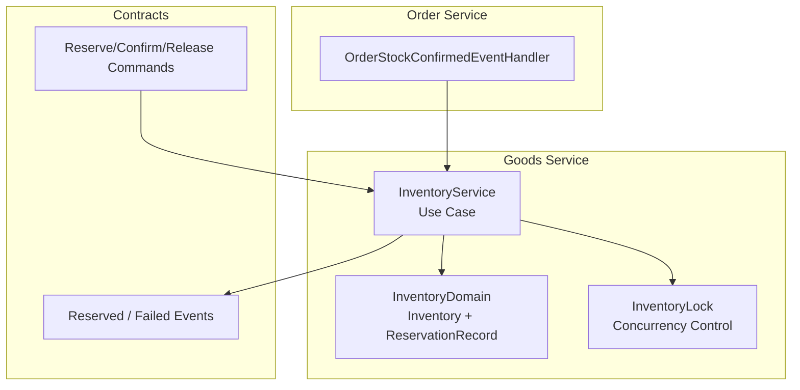
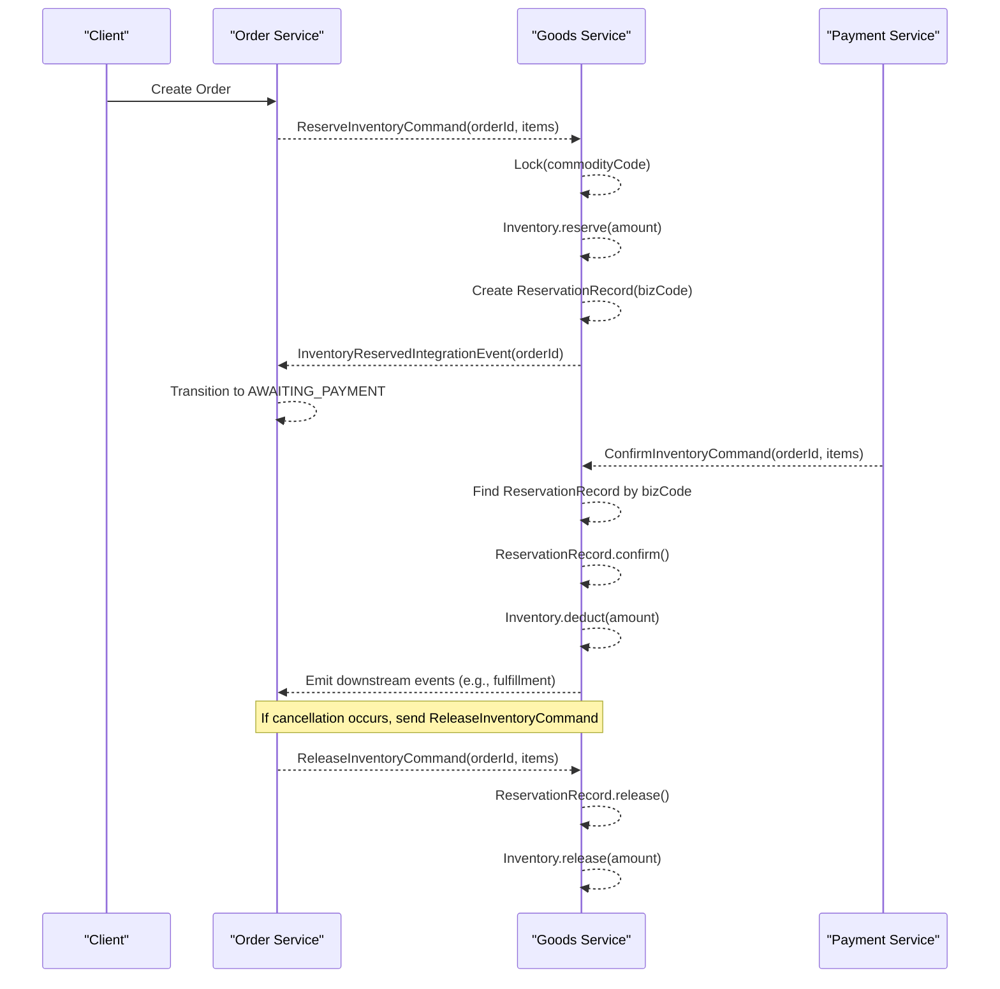
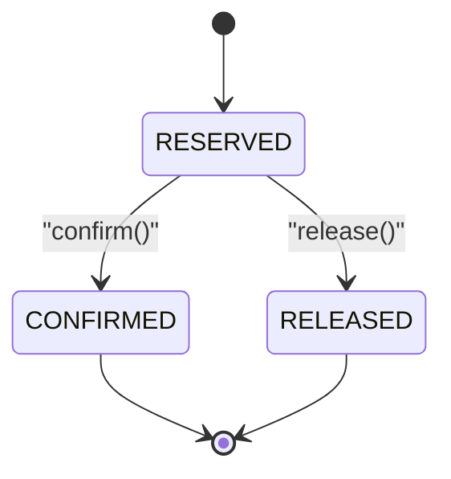
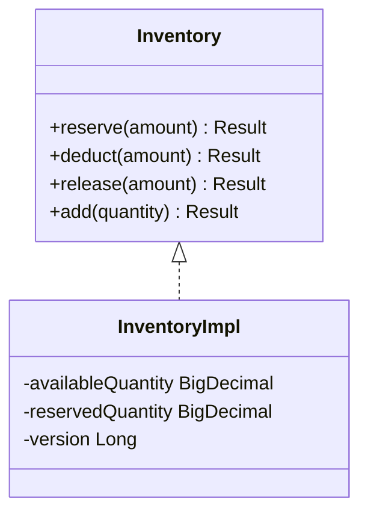
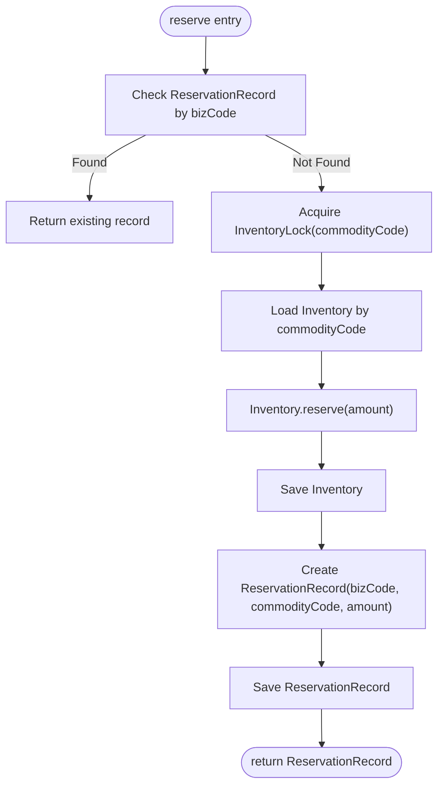
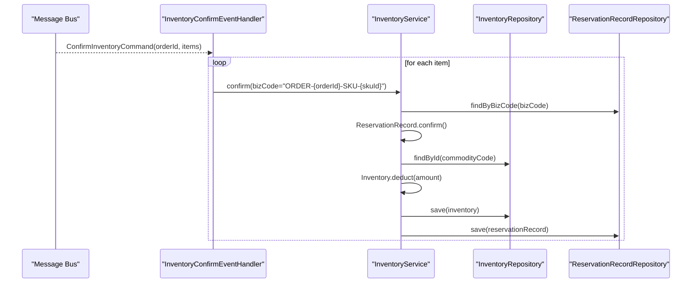
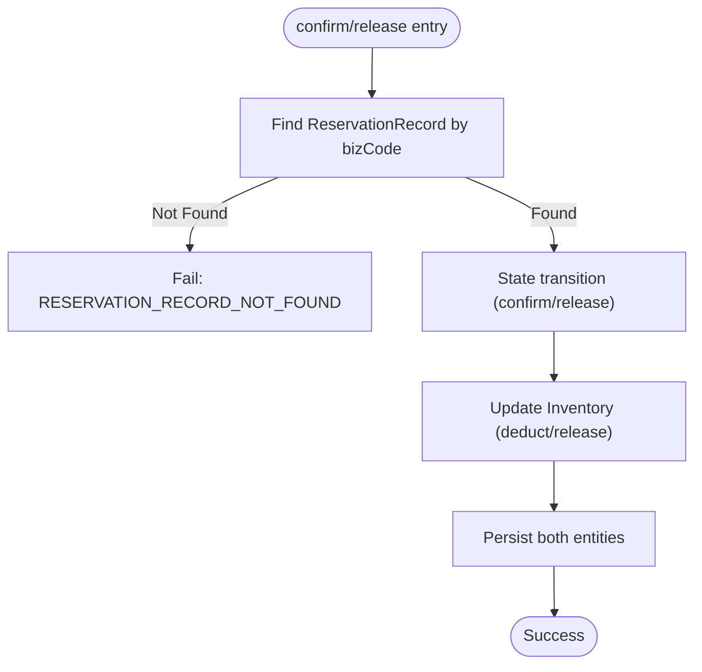
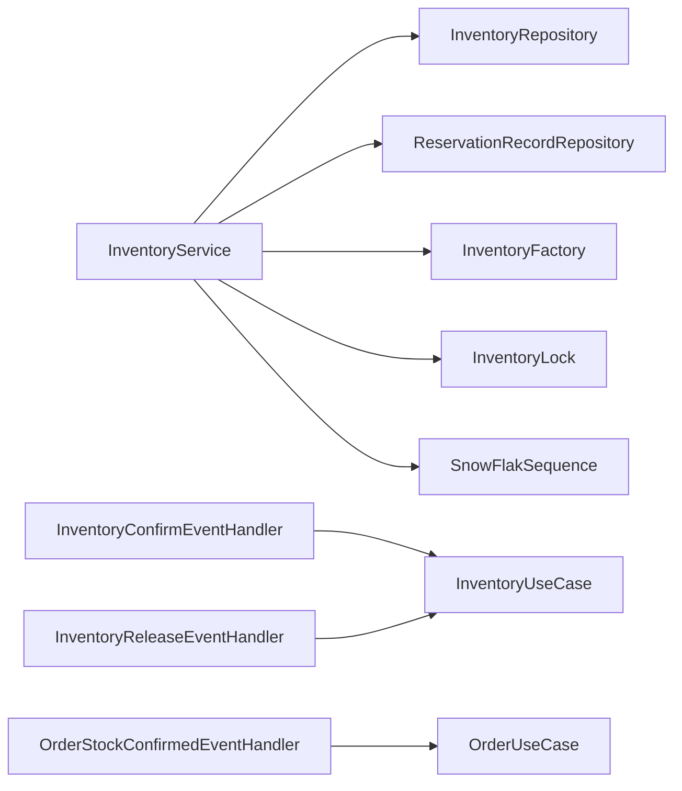

# Stock Reservation Workflow

<cite>
**Referenced Files in This Document**
- [ReservationRecord.kt](file://j-store-goods-domain/src/main/kotlin/com/jstore/goods/domain/inventory/ReservationRecord.kt)
- [Inventory.kt](file://j-store-goods-domain/src/main/kotlin/com/jstore/goods/domain/inventory/Inventory.kt)
- [InventoryLock.kt](file://j-store-goods-domain/src/main/kotlin/com/jstore/goods/domain/inventory/InventoryLock.kt)
- [InventoryService.kt](file://j-store-goods-application/src/main/kotlin/com/jstore/goods/service/InventoryService.kt)
- [InventoryConfirmEventHandler.kt](file://j-store-goods-application/src/main/kotlin/com/jstore/goods/service/InventoryConfirmEventHandler.kt)
- [InventoryReleaseEventHandler.kt](file://j-store-goods-application/src/main/kotlin/com/jstore/goods/service/InventoryReleaseEventHandler.kt)
- [CommerceIntegrationMessages.kt](file://j-store-integration-contracts/src/main/kotlin/com/jstore/contracts/commerce/CommerceIntegrationMessages.kt)
- [OrderStockEventHandler.kt](file://j-store-order-application/src/main/kotlin/com/jstore/order/service/OrderStockEventHandler.kt)
</cite>

## Table of Contents
1. [Introduction](#introduction)
2. [Project Structure](#project-structure)
3. [Core Components](#core-components)
4. [Architecture Overview](#architecture-overview)
5. [Detailed Component Analysis](#detailed-component-analysis)
6. [Dependency Analysis](#dependency-analysis)
7. [Performance Considerations](#performance-considerations)
8. [Troubleshooting Guide](#troubleshooting-guide)
9. [Conclusion](#conclusion)

## Introduction
This document explains the stock reservation workflow across the Goods and Order services. It covers the full lifecycle from pre-reservation through confirmation to release or deduction, focusing on the ReservationRecord entity, event-driven integration, idempotency via bizCode, and concurrency control with locking. Practical scenarios include order placement flow, payment confirmation, and cancellation.

## Project Structure
The stock reservation feature spans domain models, application use cases, and integration contracts:
- Domain layer defines Inventory and ReservationRecord aggregates and a lock abstraction for concurrency control.
- Application layer implements the inventory use case (reserve, confirm, release), event handlers for cross-service commands, and orchestrates persistence and locking.
- Integration contracts define commands/events exchanged between Order, Payment, Fulfillment, and Goods services.

**Diagram sources**
- [InventoryService.kt:1-156](file://j-store-goods-application/src/main/kotlin/com/jstore/goods/service/InventoryService.kt#L1-L156)
- [Inventory.kt:1-77](file://j-store-goods-domain/src/main/kotlin/com/jstore/goods/domain/inventory/Inventory.kt#L1-L77)
- [ReservationRecord.kt:1-50](file://j-store-goods-domain/src/main/kotlin/com/jstore/goods/domain/inventory/ReservationRecord.kt#L1-L50)
- [InventoryLock.kt:1-20](file://j-store-goods-domain/src/main/kotlin/com/jstore/goods/domain/inventory/InventoryLock.kt#L1-L20)
- [CommerceIntegrationMessages.kt:49-162](file://j-store-integration-contracts/src/main/kotlin/com/jstore/contracts/commerce/CommerceIntegrationMessages.kt#L49-L162)
- [OrderStockEventHandler.kt:1-27](file://j-store-order-application/src/main/kotlin/com/jstore/order/service/OrderStockEventHandler.kt#L1-L27)

**Section sources**
- [InventoryService.kt:1-156](file://j-store-goods-application/src/main/kotlin/com/jstore/goods/service/InventoryService.kt#L1-L156)
- [Inventory.kt:1-77](file://j-store-goods-domain/src/main/kotlin/com/jstore/goods/domain/inventory/Inventory.kt#L1-L77)
- [ReservationRecord.kt:1-50](file://j-store-goods-domain/src/main/kotlin/com/jstore/goods/domain/inventory/ReservationRecord.kt#L1-L50)
- [InventoryLock.kt:1-20](file://j-store-goods-domain/src/main/kotlin/com/jstore/goods/domain/inventory/InventoryLock.kt#L1-L20)
- [CommerceIntegrationMessages.kt:49-162](file://j-store-integration-contracts/src/main/kotlin/com/jstore/contracts/commerce/CommerceIntegrationMessages.kt#L49-L162)
- [OrderStockEventHandler.kt:1-27](file://j-store-order-application/src/main/kotlin/com/jstore/order/service/OrderStockEventHandler.kt#L1-L27)

## Core Components
- Inventory aggregate: maintains availableQuantity and reservedQuantity; supports reserve, deduct, release, add operations.
- ReservationRecord aggregate: tracks a single reservation unit identified by bizCode, commodityCode, amount, status transitions (RESERVED → CONFIRMED or RELEASED), and expiryTime.
- InventoryLock abstraction: provides per-commodity locking to ensure concurrent safety.
- InventoryService: orchestrates reserve/confirm/release flows, creates ReservationRecord, persists changes, and handles idempotency via bizCode lookup.
- Event handlers: InventoryConfirmEventHandler and InventoryReleaseEventHandler consume integration commands to transition reservations and update inventory.
- Contracts: ReserveInventoryCommand, ConfirmInventoryCommand, ReleaseInventoryCommand, and events like InventoryReservedIntegrationEvent.

Key responsibilities:
- Idempotency: reserve checks existing ReservationRecord by bizCode before proceeding.
- Concurrency: uses InventoryLock around critical sections that mutate Inventory and ReservationRecord.
- State machine: ReservationRecord enforces valid state transitions and expiration handling.

**Section sources**
- [Inventory.kt:1-77](file://j-store-goods-domain/src/main/kotlin/com/jstore/goods/domain/inventory/Inventory.kt#L1-L77)
- [ReservationRecord.kt:1-50](file://j-store-goods-domain/src/main/kotlin/com/jstore/goods/domain/inventory/ReservationRecord.kt#L1-L50)
- [InventoryLock.kt:1-20](file://j-store-goods-domain/src/main/kotlin/com/jstore/goods/domain/inventory/InventoryLock.kt#L1-L20)
- [InventoryService.kt:1-156](file://j-store-goods-application/src/main/kotlin/com/jstore/goods/service/InventoryService.kt#L1-L156)
- [InventoryConfirmEventHandler.kt:1-33](file://j-store-goods-application/src/main/kotlin/com/jstore/goods/service/InventoryConfirmEventHandler.kt#L1-L33)
- [InventoryReleaseEventHandler.kt:1-31](file://j-store-goods-application/src/main/kotlin/com/jstore/goods/service/InventoryReleaseEventHandler.kt#L1-L31)
- [CommerceIntegrationMessages.kt:49-162](file://j-store-integration-contracts/src/main/kotlin/com/jstore/contracts/commerce/CommerceIntegrationMessages.kt#L49-L162)

## Architecture Overview
The stock reservation workflow is event-driven and spans multiple services:
- Order service publishes ReserveInventoryCommand when an order is created.
- Goods service consumes the command, reserves inventory, creates ReservationRecord, and emits InventoryReservedIntegrationEvent.
- Order service listens to the reserved event and moves the order to “awaiting payment”.
- Payment service triggers ConfirmInventoryCommand after successful payment; Goods service converts RESERVED to CONFIRMED and deducts inventory.
- On cancellation or timeout, ReleaseInventoryCommand restores reserved quantity and marks ReservationRecord as RELEASED.

**Diagram sources**
- [CommerceIntegrationMessages.kt:49-162](file://j-store-integration-contracts/src/main/kotlin/com/jstore/contracts/commerce/CommerceIntegrationMessages.kt#L49-L162)
- [InventoryService.kt:36-114](file://j-store-goods-application/src/main/kotlin/com/jstore/goods/service/InventoryService.kt#L36-L114)
- [OrderStockEventHandler.kt:1-27](file://j-store-order-application/src/main/kotlin/com/jstore/order/service/OrderStockEventHandler.kt#L1-L27)
- [InventoryConfirmEventHandler.kt:1-33](file://j-store-goods-application/src/main/kotlin/com/jstore/goods/service/InventoryConfirmEventHandler.kt#L1-L33)
- [InventoryReleaseEventHandler.kt:1-31](file://j-store-goods-application/src/main/kotlin/com/jstore/goods/service/InventoryReleaseEventHandler.kt#L1-L31)

## Detailed Component Analysis

### ReservationRecord Entity
- Purpose: Tracks a single reservation unit with idempotency key bizCode, commodityCode, amount, status, and expiryTime.
- State transitions:
  - confirm(): RESERVED → CONFIRMED; rejects if already CONFIRMED or RELEASED or expired.
  - release(): RESERVED → RELEASED; rejects if already CONFIRMED.
- Expiration: Used to guard confirm against expired reservations.

**Diagram sources**
- [ReservationRecord.kt:22-40](file://j-store-goods-domain/src/main/kotlin/com/jstore/goods/domain/inventory/ReservationRecord.kt#L22-L40)

**Section sources**
- [ReservationRecord.kt:1-50](file://j-store-goods-domain/src/main/kotlin/com/jstore/goods/domain/inventory/ReservationRecord.kt#L1-L50)

### Inventory Aggregate
- Maintains two counters: availableQuantity and reservedQuantity.
- Operations:
  - reserve(amount): decreases availableQuantity, increases reservedQuantity.
  - deduct(amount): decreases reservedQuantity (used on confirm).
  - release(amount): decreases reservedQuantity, increases availableQuantity (used on cancel/timeout).
  - add(quantity): increases availableQuantity (stock replenishment).

**Diagram sources**
- [Inventory.kt:20-76](file://j-store-goods-domain/src/main/kotlin/com/jstore/goods/domain/inventory/Inventory.kt#L20-L76)

**Section sources**
- [Inventory.kt:1-77](file://j-store-goods-domain/src/main/kotlin/com/jstore/goods/domain/inventory/Inventory.kt#L1-L77)

### InventoryService Orchestration
- reserve(bizCode, commodityCode, amount):
  - Idempotency: returns existing ReservationRecord if found by bizCode.
  - Concurrency: acquires InventoryLock for commodityCode.
  - Persistence: loads Inventory, calls reserve(), saves Inventory, creates and saves ReservationRecord.
- confirm(bizCode):
  - Loads ReservationRecord by bizCode, calls confirm(), then deducts Inventory and persists both.
- release(bizCode):
  - Loads ReservationRecord by bizCode, calls release(), then releases Inventory and persists both.

**Diagram sources**
- [InventoryService.kt:36-76](file://j-store-goods-application/src/main/kotlin/com/jstore/goods/service/InventoryService.kt#L36-L76)

**Section sources**
- [InventoryService.kt:1-156](file://j-store-goods-application/src/main/kotlin/com/jstore/goods/service/InventoryService.kt#L1-L156)

### Event Handlers and Cross-Service Communication
- InventoryConfirmEventHandler:
  - Consumes ConfirmInventoryCommand.
  - For each item, constructs bizCode = "ORDER-{orderId}-SKU-{skuId}" and calls inventoryService.confirm(bizCode).
- InventoryReleaseEventHandler:
  - Consumes ReleaseInventoryCommand.
  - For each item, constructs same bizCode pattern and calls inventoryService.release(bizCode).
- OrderStockConfirmedEventHandler:
  - Consumes InventoryReservedIntegrationEvent and transitions order to awaiting payment.

**Diagram sources**
- [InventoryConfirmEventHandler.kt:18-31](file://j-store-goods-application/src/main/kotlin/com/jstore/goods/service/InventoryConfirmEventHandler.kt#L18-L31)
- [InventoryService.kt:78-95](file://j-store-goods-application/src/main/kotlin/com/jstore/goods/service/InventoryService.kt#L78-L95)

**Section sources**
- [InventoryConfirmEventHandler.kt:1-33](file://j-store-goods-application/src/main/kotlin/com/jstore/goods/service/InventoryConfirmEventHandler.kt#L1-L33)
- [InventoryReleaseEventHandler.kt:1-31](file://j-store-goods-application/src/main/kotlin/com/jstore/goods/service/InventoryReleaseEventHandler.kt#L1-L31)
- [OrderStockEventHandler.kt:1-27](file://j-store-order-application/src/main/kotlin/com/jstore/order/service/OrderStockEventHandler.kt#L1-L27)
- [CommerceIntegrationMessages.kt:69-105](file://j-store-integration-contracts/src/main/kotlin/com/jstore/contracts/commerce/CommerceIntegrationMessages.kt#L69-L105)

### Idempotency and Concurrency
- Idempotency:
  - reserve() first checks ReservationRecordRepository.findByBizCode(bizCode); if present, returns existing record without side effects.
  - confirm()/release() operate on the specific bizCode derived from orderId and skuId, ensuring per-item idempotency.
- Concurrency:
  - InventoryLock.lock(commodityCode, timeout, timeUnit) serializes mutations per commodity.
  - Failure to acquire lock maps to a concurrent conflict error.

**Diagram sources**
- [InventoryService.kt:78-114](file://j-store-goods-application/src/main/kotlin/com/jstore/goods/service/InventoryService.kt#L78-L114)
- [InventoryLock.kt:7-13](file://j-store-goods-domain/src/main/kotlin/com/jstore/goods/domain/inventory/InventoryLock.kt#L7-L13)

**Section sources**
- [InventoryService.kt:1-156](file://j-store-goods-application/src/main/kotlin/com/jstore/goods/service/InventoryService.kt#L1-L156)
- [InventoryLock.kt:1-20](file://j-store-goods-domain/src/main/kotlin/com/jstore/goods/domain/inventory/InventoryLock.kt#L1-L20)

## Dependency Analysis
- InventoryService depends on:
  - InventoryRepository and ReservationRecordRepository for persistence.
  - InventoryFactory for creating Inventory instances.
  - InventoryLock for concurrency control.
  - SnowFlakSequence for generating unique IDs for ReservationRecord.
- Event handlers depend on InventoryUseCase interface, decoupling message consumption from implementation.
- Contracts define stable message types and routing keys for inter-service communication.

**Diagram sources**
- [InventoryService.kt:14-21](file://j-store-goods-application/src/main/kotlin/com/jstore/goods/service/InventoryService.kt#L14-L21)
- [InventoryConfirmEventHandler.kt:10-11](file://j-store-goods-application/src/main/kotlin/com/jstore/goods/service/InventoryConfirmEventHandler.kt#L10-L11)
- [InventoryReleaseEventHandler.kt:10-11](file://j-store-goods-application/src/main/kotlin/com/jstore/goods/service/InventoryReleaseEventHandler.kt#L10-L11)
- [OrderStockEventHandler.kt:11-12](file://j-store-order-application/src/main/kotlin/com/jstore/order/service/OrderStockEventHandler.kt#L11-L12)

**Section sources**
- [InventoryService.kt:1-156](file://j-store-goods-application/src/main/kotlin/com/jstore/goods/service/InventoryService.kt#L1-L156)
- [InventoryConfirmEventHandler.kt:1-33](file://j-store-goods-application/src/main/kotlin/com/jstore/goods/service/InventoryConfirmEventHandler.kt#L1-L33)
- [InventoryReleaseEventHandler.kt:1-31](file://j-store-goods-application/src/main/kotlin/com/jstore/goods/service/InventoryReleaseEventHandler.kt#L1-L31)
- [OrderStockEventHandler.kt:1-27](file://j-store-order-application/src/main/kotlin/com/jstore/order/service/OrderStockEventHandler.kt#L1-L27)

## Performance Considerations
- Lock granularity: Commodity-level locking avoids contention across different SKUs while serializing updates to the same SKU.
- Idempotent reads: Early check for existing ReservationRecord prevents unnecessary lock acquisition and DB writes.
- Batch processing: Event handlers iterate items and call confirm/release per item; consider batching repository operations where possible.
- Timeouts: InventoryLockConfig allows tuning lock timeouts to balance throughput and safety.

[No sources needed since this section provides general guidance]

## Troubleshooting Guide
Common issues and resolutions:
- Insufficient inventory during reserve: Ensure availableQuantity >= amount; review stock replenishment flows.
- Reservation not found during confirm/release: Verify bizCode generation matches the original reserve call ("ORDER-{orderId}-SKU-{skuId}").
- Concurrent conflicts: If lock acquisition fails, retry logic should be implemented at the caller level; tune lock timeouts.
- Expired reservations: confirm() rejects expired records; implement cleanup jobs to release expired reservations.

**Section sources**
- [InventoryService.kt:36-114](file://j-store-goods-application/src/main/kotlin/com/jstore/goods/service/InventoryService.kt#L36-L114)
- [ReservationRecord.kt:22-40](file://j-store-goods-domain/src/main/kotlin/com/jstore/goods/domain/inventory/ReservationRecord.kt#L22-L40)

## Conclusion
The stock reservation workflow leverages a clear separation of concerns: domain aggregates enforce business rules, application services orchestrate persistence and concurrency, and event handlers enable robust cross-service communication. Idempotency via bizCode and commodity-level locking ensure correctness under concurrency and retries. The design supports reliable order placement, payment confirmation, and cancellation flows with predictable state transitions and auditability through ReservationRecord.

[No sources needed since this section summarizes without analyzing specific files]