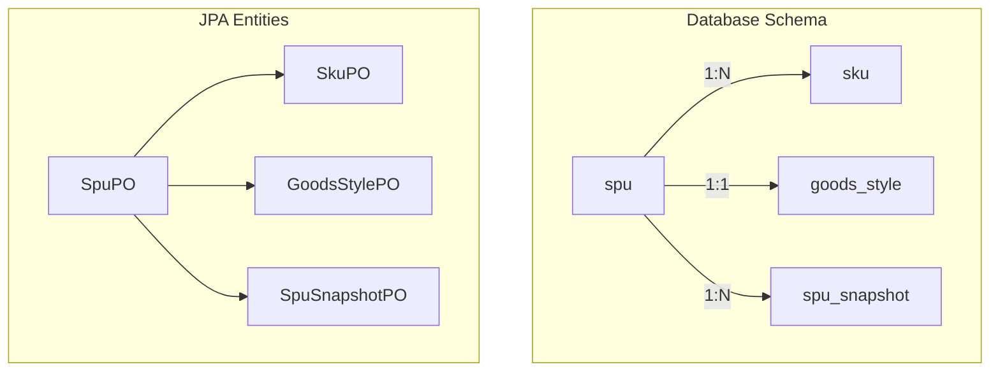
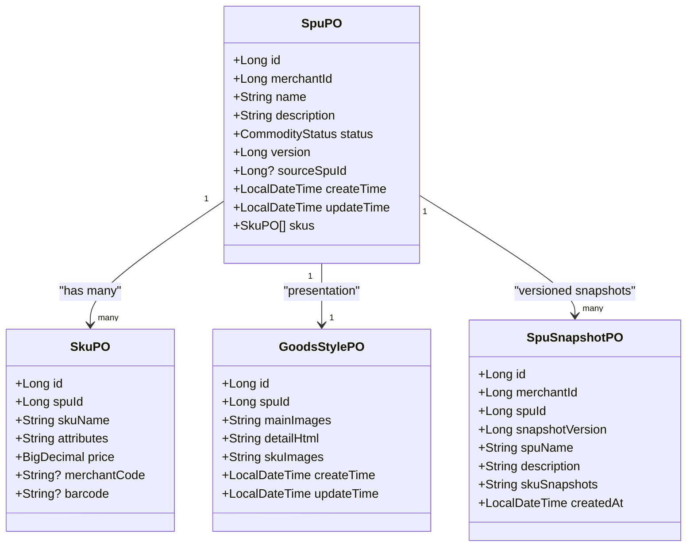
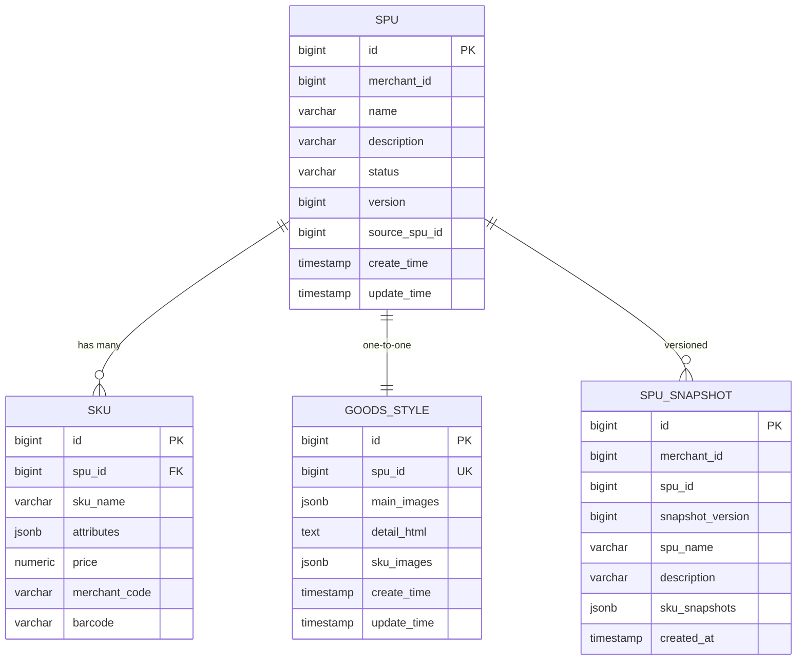
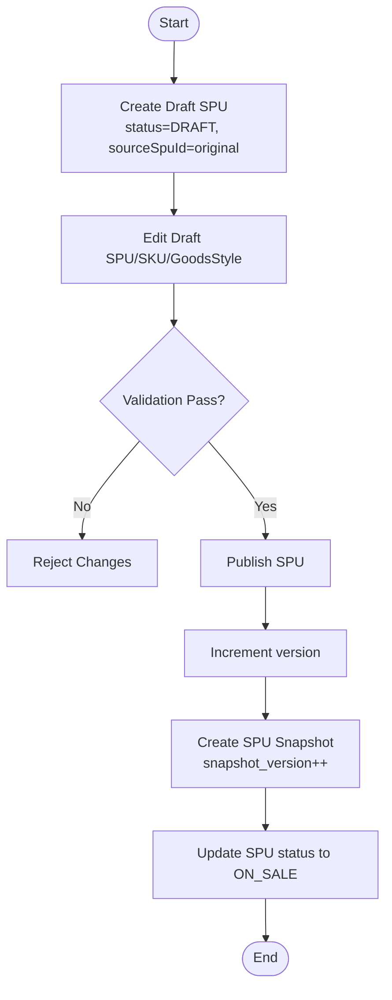
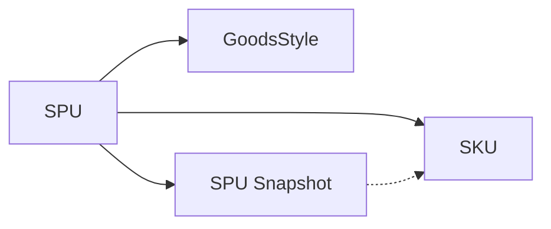

# SPU/SKU Model Design

<cite>
**Referenced Files in This Document**
- [04-goods-spu-sku-snapshot.sql](file://docker/postgres/init/04-goods-spu-sku-snapshot.sql)
- [07-goods-style-sku-code.sql](file://docker/postgres/init/07-goods-style-sku-code.sql)
- [09-goods-spu-source-spu-id.sql](file://docker/postgres/init/09-goods-spu-source-spu-id.sql)
- [SpuPO.kt](file://j-store-goods-infrastructure/src/main/kotlin/com/jstore/goods/domain/commodity/persistence/SpuPO.kt)
- [SkuPO.kt](file://j-store-goods-infrastructure/src/main/kotlin/com/jstore/goods/domain/commodity/persistence/SkuPO.kt)
- [GoodsStylePO.kt](file://j-store-goods-infrastructure/src/main/kotlin/com/jstore/goods/domain/commodity/persistence/GoodsStylePO.kt)
- [SpuSnapshotPO.kt](file://j-store-goods-infrastructure/src/main/kotlin/com/jstore/goods/domain/commodity/persistence/SpuSnapshotPO.kt)
</cite>

## Table of Contents
1. Introduction
2. Project Structure
3. Core Components
4. Architecture Overview
5. Detailed Component Analysis
6. Dependency Analysis
7. Performance Considerations
8. Troubleshooting Guide
9. Conclusion

## Introduction
This document specifies the data model for the SPU (Standard Product Unit) and SKU (Stock Keeping Unit) hierarchy, including the GoodsStyle entity and snapshot mechanism. It covers primary and foreign keys, field definitions, data types, validation rules, business invariants, state transitions, versioning, draft workflows via sourceSpuId, lifecycle considerations, soft deletes, and archival strategies. The model is implemented with PostgreSQL and persisted through JPA entities.

## Project Structure
The SPU/SKU model spans database migrations and persistence entities:
- Database schema migrations define tables, constraints, and indexes.
- JPA POs map to tables and express relationships between SPU, SKU, GoodsStyle, and SPU Snapshot.

**Diagram sources**
- [04-goods-spu-sku-snapshot.sql:1-55](file://docker/postgres/init/04-goods-spu-sku-snapshot.sql#L1-L55)
- [07-goods-style-sku-code.sql:1-32](file://docker/postgres/init/07-goods-style-sku-code.sql#L1-L32)
- [09-goods-spu-source-spu-id.sql:1-9](file://docker/postgres/init/09-goods-spu-source-spu-id.sql#L1-L9)
- [SpuPO.kt:1-27](file://j-store-goods-infrastructure/src/main/kotlin/com/jstore/goods/domain/commodity/persistence/SpuPO.kt#L1-L27)
- [SkuPO.kt:1-21](file://j-store-goods-infrastructure/src/main/kotlin/com/jstore/goods/domain/commodity/persistence/SkuPO.kt#L1-L21)
- [GoodsStylePO.kt:1-22](file://j-store-goods-infrastructure/src/main/kotlin/com/jstore/goods/domain/commodity/persistence/GoodsStylePO.kt#L1-L22)
- [SpuSnapshotPO.kt:1-25](file://j-store-goods-infrastructure/src/main/kotlin/com/jstore/goods/domain/commodity/persistence/SpuSnapshotPO.kt#L1-L25)

**Section sources**
- [04-goods-spu-sku-snapshot.sql:1-55](file://docker/postgres/init/04-goods-spu-sku-snapshot.sql#L1-L55)
- [07-goods-style-sku-code.sql:1-32](file://docker/postgres/init/07-goods-style-sku-code.sql#L1-L32)
- [09-goods-spu-source-spu-id.sql:1-9](file://docker/postgres/init/09-goods-spu-source-spu-id.sql#L1-L9)
- [SpuPO.kt:1-27](file://j-store-goods-infrastructure/src/main/kotlin/com/jstore/goods/domain/commodity/persistence/SpuPO.kt#L1-L27)
- [SkuPO.kt:1-21](file://j-store-goods-infrastructure/src/main/kotlin/com/jstore/goods/domain/commodity/persistence/SkuPO.kt#L1-L21)
- [GoodsStylePO.kt:1-22](file://j-store-goods-infrastructure/src/main/kotlin/com/jstore/goods/domain/commodity/persistence/GoodsStylePO.kt#L1-L22)
- [SpuSnapshotPO.kt:1-25](file://j-store-goods-infrastructure/src/main/kotlin/com/jstore/goods/domain/commodity/persistence/SpuSnapshotPO.kt#L1-L25)

## Core Components
- SPU aggregate root: Represents a product at the catalog level, owned by a merchant, with status/versioning and optional draft linkage.
- SKU composition: One-to-many relationship under SPU; each SKU holds attributes, pricing, and optional merchant/barcode identifiers.
- GoodsStyle entity: Stores presentation assets for an SPU (main images, detail HTML, per-SKU images).
- SPU Snapshot: Immutable record of SPU + SKUs at publish time, used for order history and price consistency.

Key identifiers and relationships:
- MerchantId: Owner of SPU and snapshots.
- SpuId: Primary key for SPU; referenced by SKU and GoodsStyle.
- GoodsStyleId: Unique per SPU via unique index on spu_id.
- SourceSpuId: Links draft copies to original SPU.

**Section sources**
- [SpuPO.kt:1-27](file://j-store-goods-infrastructure/src/main/kotlin/com/jstore/goods/domain/commodity/persistence/SpuPO.kt#L1-L27)
- [SkuPO.kt:1-21](file://j-store-goods-infrastructure/src/main/kotlin/com/jstore/goods/domain/commodity/persistence/SkuPO.kt#L1-L21)
- [GoodsStylePO.kt:1-22](file://j-store-goods-infrastructure/src/main/kotlin/com/jstore/goods/domain/commodity/persistence/GoodsStylePO.kt#L1-L22)
- [SpuSnapshotPO.kt:1-25](file://j-store-goods-infrastructure/src/main/kotlin/com/jstore/goods/domain/commodity/persistence/SpuSnapshotPO.kt#L1-L25)
- [04-goods-spu-sku-snapshot.sql:1-55](file://docker/postgres/init/04-goods-spu-sku-snapshot.sql#L1-L55)
- [07-goods-style-sku-code.sql:1-32](file://docker/postgres/init/07-goods-style-sku-code.sql#L1-L32)
- [09-goods-spu-source-spu-id.sql:1-9](file://docker/postgres/init/09-goods-spu-source-spu-id.sql#L1-L9)

## Architecture Overview
The SPU/SKU model follows a clear separation between mutable catalog data and immutable snapshots:
- SPU and SKU are mutable during drafting and editing.
- On publish, a snapshot is created to preserve the exact product state for orders.
- GoodsStyle is independent but tightly coupled to SPU for presentation.

**Diagram sources**
- [SpuPO.kt:1-27](file://j-store-goods-infrastructure/src/main/kotlin/com/jstore/goods/domain/commodity/persistence/SpuPO.kt#L1-L27)
- [SkuPO.kt:1-21](file://j-store-goods-infrastructure/src/main/kotlin/com/jstore/goods/domain/commodity/persistence/SkuPO.kt#L1-L21)
- [GoodsStylePO.kt:1-22](file://j-store-goods-infrastructure/src/main/kotlin/com/jstore/goods/domain/commodity/persistence/GoodsStylePO.kt#L1-L22)
- [SpuSnapshotPO.kt:1-25](file://j-store-goods-infrastructure/src/main/kotlin/com/jstore/goods/domain/commodity/persistence/SpuSnapshotPO.kt#L1-L25)

## Detailed Component Analysis

### SPU Aggregate Root
- Purpose: Central catalog entity representing a product line.
- Fields:
  - id: BIGINT primary key.
  - merchantId: BIGINT, not null (owner).
  - name: VARCHAR(256), not null.
  - description: VARCHAR(2000), default empty.
  - status: Enum string, not null, default DRAFT.
  - version: BIGINT, not null, default 1; increments on publish.
  - sourceSpuId: BIGINT nullable; links draft copy to original.
  - createTime/updateTime: timestamps.
  - skus: one-to-many collection of SKU entities.
- Constraints:
  - Not-null fields enforced at DB and ORM levels.
  - Status values include DRAFT/OFF_SALE/ON_SALE.
- Business invariants:
  - A published SPU must have at least one active SKU.
  - Version increments only on successful publish operations.
  - Draft copies reference a valid sourceSpuId.

**Section sources**
- [SpuPO.kt:1-27](file://j-store-goods-infrastructure/src/main/kotlin/com/jstore/goods/domain/commodity/persistence/SpuPO.kt#L1-L27)
- [04-goods-spu-sku-snapshot.sql:1-55](file://docker/postgres/init/04-goods-spu-sku-snapshot.sql#L1-L55)
- [09-goods-spu-source-spu-id.sql:1-9](file://docker/postgres/init/09-goods-spu-source-spu-id.sql#L1-L9)

### SKU Composition
- Purpose: Represents a specific variant of an SPU with sales attributes and pricing.
- Fields:
  - id: BIGINT primary key.
  - spuId: BIGINT foreign key to spu(id), read-only mapping.
  - skuName: VARCHAR(256), not null.
  - attributes: JSONB array of attribute objects.
  - price: NUMERIC(19,0), not null; stored in cents.
  - merchantCode: VARCHAR(128) nullable; internal merchant identifier.
  - barcode: VARCHAR(64) nullable; standard EAN/UPC.
- Indexes:
  - idx_sku_spu_id for efficient queries by SPU.
- Validation rules:
  - Price must be non-negative.
  - Attributes must be a well-formed JSON array.
  - merchantCode and barcode should conform to format checks at application layer.

**Section sources**
- [SkuPO.kt:1-21](file://j-store-goods-infrastructure/src/main/kotlin/com/jstore/goods/domain/commodity/persistence/SkuPO.kt#L1-L21)
- [04-goods-spu-sku-snapshot.sql:1-55](file://docker/postgres/init/04-goods-spu-sku-snapshot.sql#L1-L55)
- [07-goods-style-sku-code.sql:1-32](file://docker/postgres/init/07-goods-style-sku-code.sql#L1-L32)

### GoodsStyle Entity
- Purpose: Presentation assets for an SPU, separate from core catalog data.
- Fields:
  - id: BIGINT primary key.
  - spuId: BIGINT, unique per SPU.
  - mainImages: JSONB array of ordered image keys.
  - detailHtml: TEXT, rich HTML content.
  - skuImages: JSONB object mapping skuId to image keys.
  - createTime/updateTime: timestamps.
- Constraints:
  - Unique index on spu_id ensures one style per SPU.
- Validation rules:
  - mainImages and skuImages must be valid JSON structures.
  - detailHtml should be sanitized at input.

**Section sources**
- [GoodsStylePO.kt:1-22](file://j-store-goods-infrastructure/src/main/kotlin/com/jstore/goods/domain/commodity/persistence/GoodsStylePO.kt#L1-L22)
- [07-goods-style-sku-code.sql:1-32](file://docker/postgres/init/07-goods-style-sku-code.sql#L1-L32)

### SPU Snapshot
- Purpose: Immutable snapshot of SPU and SKUs at publish time for historical accuracy.
- Fields:
  - id: BIGINT primary key.
  - merchantId: BIGINT, owner.
  - spuId: BIGINT, not null.
  - snapshotVersion: BIGINT, not null.
  - spuName: VARCHAR(256), not null.
  - description: VARCHAR(2000).
  - skuSnapshots: JSONB array of SKU details.
  - createdAt: timestamp.
- Constraints:
  - Unique constraint on (spu_id, snapshot_version).
- Use cases:
  - Order history, price anchoring, auditability.

**Section sources**
- [SpuSnapshotPO.kt:1-25](file://j-store-goods-infrastructure/src/main/kotlin/com/jstore/goods/domain/commodity/persistence/SpuSnapshotPO.kt#L1-L25)
- [04-goods-spu-sku-snapshot.sql:1-55](file://docker/postgres/init/04-goods-spu-sku-snapshot.sql#L1-L55)

### Data Model Diagram

**Diagram sources**
- [04-goods-spu-sku-snapshot.sql:1-55](file://docker/postgres/init/04-goods-spu-sku-snapshot.sql#L1-L55)
- [07-goods-style-sku-code.sql:1-32](file://docker/postgres/init/07-goods-style-sku-code.sql#L1-L32)
- [09-goods-spu-source-spu-id.sql:1-9](file://docker/postgres/init/09-goods-spu-source-spu-id.sql#L1-L9)
- [SpuPO.kt:1-27](file://j-store-goods-infrastructure/src/main/kotlin/com/jstore/goods/domain/commodity/persistence/SpuPO.kt#L1-L27)
- [SkuPO.kt:1-21](file://j-store-goods-infrastructure/src/main/kotlin/com/jstore/goods/domain/commodity/persistence/SkuPO.kt#L1-L21)
- [GoodsStylePO.kt:1-22](file://j-store-goods-infrastructure/src/main/kotlin/com/jstore/goods/domain/commodity/persistence/GoodsStylePO.kt#L1-L22)
- [SpuSnapshotPO.kt:1-25](file://j-store-goods-infrastructure/src/main/kotlin/com/jstore/goods/domain/commodity/persistence/SpuSnapshotPO.kt#L1-L25)

### Draft Workflow and Versioning
- Draft workflow:
  - Create a new SPU with status DRAFT and sourceSpuId set to the original SPU when copying.
  - Edit draft independently without affecting the original.
  - On publish, increment version and create a snapshot with current SPU + SKUs.
- Versioning:
  - Each successful publish creates a new snapshot row with incremented snapshot_version.
  - Uniqueness enforced by (spu_id, snapshot_version).
- SourceSpuId:
  - Null for original SPU; non-null for draft copies.
  - Partial index on spu(source_spu_id) where not null optimizes draft lookups.

**Diagram sources**
- [04-goods-spu-sku-snapshot.sql:1-55](file://docker/postgres/init/04-goods-spu-sku-snapshot.sql#L1-L55)
- [09-goods-spu-source-spu-id.sql:1-9](file://docker/postgres/init/09-goods-spu-source-spu-id.sql#L1-L9)
- [SpuPO.kt:1-27](file://j-store-goods-infrastructure/src/main/kotlin/com/jstore/goods/domain/commodity/persistence/SpuPO.kt#L1-L27)
- [SpuSnapshotPO.kt:1-25](file://j-store-goods-infrastructure/src/main/kotlin/com/jstore/goods/domain/commodity/persistence/SpuSnapshotPO.kt#L1-L25)

## Dependency Analysis
- SPU depends on SKU (one-to-many) and optionally on GoodsStyle (one-to-one).
- SPU Snapshot depends on SPU and captures SKU state at publish time.
- GoodsStyle is independent but constrained to one per SPU.
- Draft workflow introduces dependency on sourceSpuId for traceability.

**Diagram sources**
- [SpuPO.kt:1-27](file://j-store-goods-infrastructure/src/main/kotlin/com/jstore/goods/domain/commodity/persistence/SpuPO.kt#L1-L27)
- [SkuPO.kt:1-21](file://j-store-goods-infrastructure/src/main/kotlin/com/jstore/goods/domain/commodity/persistence/SkuPO.kt#L1-L21)
- [GoodsStylePO.kt:1-22](file://j-store-goods-infrastructure/src/main/kotlin/com/jstore/goods/domain/commodity/persistence/GoodsStylePO.kt#L1-L22)
- [SpuSnapshotPO.kt:1-25](file://j-store-goods-infrastructure/src/main/kotlin/com/jstore/goods/domain/commodity/persistence/SpuSnapshotPO.kt#L1-L25)

**Section sources**
- [SpuPO.kt:1-27](file://j-store-goods-infrastructure/src/main/kotlin/com/jstore/goods/domain/commodity/persistence/SpuPO.kt#L1-L27)
- [SkuPO.kt:1-21](file://j-store-goods-infrastructure/src/main/kotlin/com/jstore/goods/domain/commodity/persistence/SkuPO.kt#L1-L21)
- [GoodsStylePO.kt:1-22](file://j-store-goods-infrastructure/src/main/kotlin/com/jstore/goods/domain/commodity/persistence/GoodsStylePO.kt#L1-L22)
- [SpuSnapshotPO.kt:1-25](file://j-store-goods-infrastructure/src/main/kotlin/com/jstore/goods/domain/commodity/persistence/SpuSnapshotPO.kt#L1-L25)

## Performance Considerations
- Indexes:
  - sku(spu_id) for fast SKU retrieval by SPU.
  - spu(source_spu_id) partial index for draft lookups.
  - spu_snapshot(spu_id) for snapshot queries by SPU.
- JSONB usage:
  - attributes and skuSnapshots use JSONB for flexible schemas while maintaining queryability.
- Partitioning/archival:
  - Consider partitioning spu_snapshot by created_at or snapshot_version for large catalogs.
- Caching:
  - Cache frequently accessed SPU + SKUs for read-heavy scenarios.

[No sources needed since this section provides general guidance]

## Troubleshooting Guide
Common issues and resolutions:
- Duplicate SKU codes:
  - Ensure merchant_code uniqueness per merchant if required by business rules.
- Invalid JSON in attributes/snapshots:
  - Validate JSON structure before persisting.
- Snapshot version conflicts:
  - Enforce unique constraint on (spu_id, snapshot_version) at DB level.
- Draft linkage errors:
  - Verify sourceSpuId references a valid original SPU.

**Section sources**
- [04-goods-spu-sku-snapshot.sql:1-55](file://docker/postgres/init/04-goods-spu-sku-snapshot.sql#L1-L55)
- [07-goods-style-sku-code.sql:1-32](file://docker/postgres/init/07-goods-style-sku-code.sql#L1-L32)
- [09-goods-spu-source-spu-id.sql:1-9](file://docker/postgres/init/09-goods-spu-source-spu-id.sql#L1-L9)

## Conclusion
The SPU/SKU model provides a robust foundation for product catalog management with clear separation between mutable catalog data and immutable snapshots. The inclusion of GoodsStyle supports rich presentation needs, while draft workflows enable safe iteration before publishing. Proper indexing, validation, and versioning ensure performance, integrity, and auditability across the lifecycle of products.

[No sources needed since this section summarizes without analyzing specific files]