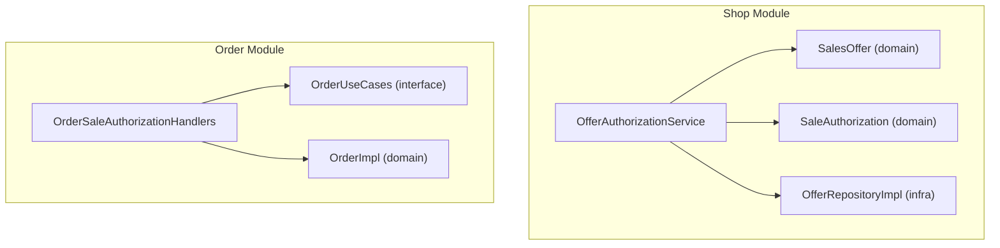
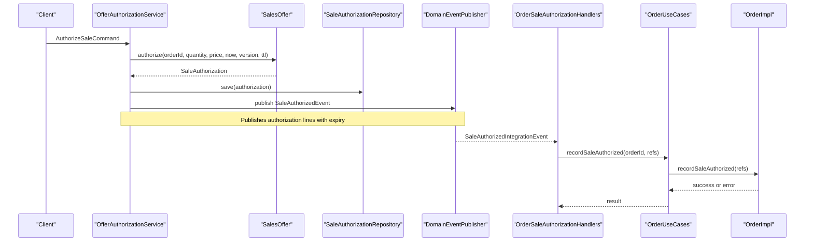
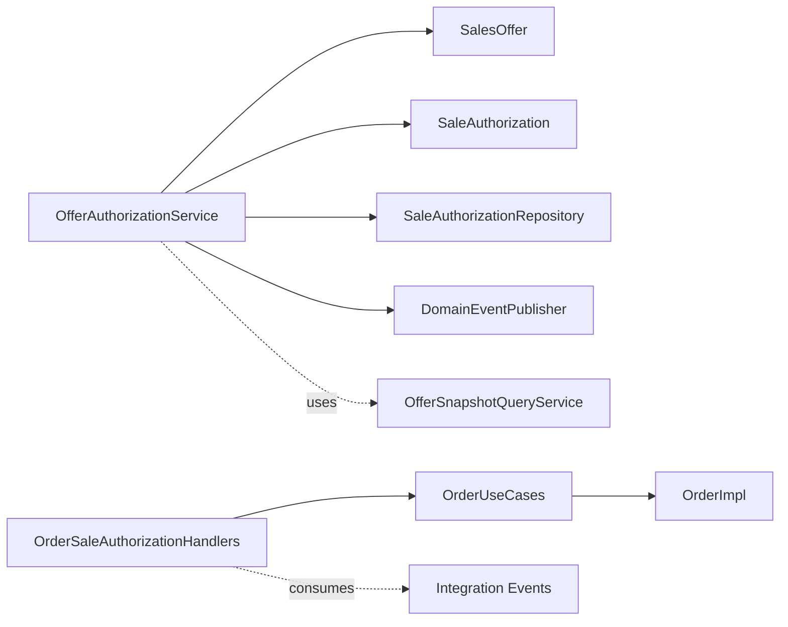

# Sales Authorization System

<cite>
**Referenced Files in This Document**
- [OfferAuthorizationService.kt](file://j-store-shop-application/src/main/kotlin/com/jstore/shop/service/OfferAuthorizationService.kt)
- [SalesOffer.kt](file://j-store-shop-domain/src/main/kotlin/com/jstore/shop/domain/offer/SalesOffer.kt)
- [SaleAuthorization.kt](file://j-store-shop-domain/src/main/kotlin/com/jstore/shop/domain/offer/SaleAuthorization.kt)
- [OfferRepositoryImpl.kt](file://j-store-shop-infrastructure/src/main/kotlin/com/jstore/shop/domain/offer/OfferRepositoryImpl.kt)
- [OrderUseCases.kt](file://j-store-order-application/src/main/kotlin/com/jstore/order/service/OrderUseCases.kt)
- [OrderSaleAuthorizationHandlers.kt](file://j-store-order-application/src/main/kotlin/com/jstore/order/service/OrderSaleAuthorizationHandlers.kt)
- [OrderImpl.kt](file://j-store-order-domain/src/main/kotlin/com/jstore/order/domain/order/OrderImpl.kt)
- [MerchantService.kt](file://j-store-shop-application/src/main/kotlin/com/jstore/shop/service/MerchantService.kt)
- [OfferServiceImpl.kt](file://j-store-order-infrastructure/src/main/kotlin/com/jstore/order/acl/OfferServiceImpl.kt)
- [OfferSnapshotQueryService.kt](file://j-store-goods-api/src/main/kotlin/com/jstore/goods/api/GoodsSnapshotQueryService.kt)
</cite>

## Table of Contents
1. [Introduction](#introduction)
2. [Project Structure](#project-structure)
3. [Core Components](#core-components)
4. [Architecture Overview](#architecture-overview)
5. [Detailed Component Analysis](#detailed-component-analysis)
6. [Dependency Analysis](#dependency-analysis)
7. [Performance Considerations](#performance-considerations)
8. [Troubleshooting Guide](#troubleshooting-guide)
9. [Conclusion](#conclusion)

## Introduction
This document explains the Sales Authorization System within J-Store, focusing on how orders obtain and manage sale authorizations for offers, how merchant context is enforced, and how authorization events integrate with the Order domain to progress order state. It covers the end-to-end flow from an authorization request through offer validation, authorization creation, persistence, event publishing, and downstream order updates.

## Project Structure
The sales authorization spans multiple modules:
- Shop Application: orchestrates authorization logic and publishes domain/integration events.
- Shop Domain: defines offer and authorization aggregates and their lifecycle rules.
- Shop Infrastructure: persists authorizations and exposes query services.
- Order Application: consumes authorization events and updates order state.
- Order Domain: enforces business invariants when recording authorized offers.
- Cross-module contracts: integration messages between shop and order services.

**Diagram sources**
- [OfferAuthorizationService.kt:42-141](file://j-store-shop-application/src/main/kotlin/com/jstore/shop/service/OfferAuthorizationService.kt#L42-L141)
- [SalesOffer.kt:77-108](file://j-store-shop-domain/src/main/kotlin/com/jstore/shop/domain/offer/SalesOffer.kt#L77-L108)
- [SaleAuthorization.kt:12-43](file://j-store-shop-domain/src/main/kotlin/com/jstore/shop/domain/offer/SaleAuthorization.kt#L12-L43)
- [OfferRepositoryImpl.kt:91-121](file://j-store-shop-infrastructure/src/main/kotlin/com/jstore/shop/domain/offer/OfferRepositoryImpl.kt#L91-L121)
- [OrderUseCases.kt:26-38](file://j-store-order-application/src/main/kotlin/com/jstore/order/service/OrderUseCases.kt#L26-L38)
- [OrderSaleAuthorizationHandlers.kt:10-23](file://j-store-order-application/src/main/kotlin/com/jstore/order/service/OrderSaleAuthorizationHandlers.kt#L10-L23)
- [OrderImpl.kt:99-121](file://j-store-order-domain/src/main/kotlin/com/jstore/order/domain/order/OrderImpl.kt#L99-L121)

**Section sources**
- [OfferAuthorizationService.kt:42-141](file://j-store-shop-application/src/main/kotlin/com/jstore/shop/service/OfferAuthorizationService.kt#L42-L141)
- [OrderUseCases.kt:26-38](file://j-store-order-application/src/main/kotlin/com/jstore/order/service/OrderUseCases.kt#L26-L38)

## Core Components
- OfferAuthorizationService: Validates store and offer context, creates SaleAuthorization per item, persists them, and publishes authorization events. Also supports releasing authorizations.
- SalesOffer: Encapsulates offer validity checks (status, effective period, version, price, purchase limit) and produces a SaleAuthorization upon successful authorization.
- SaleAuthorization: Represents a time-bound authorization for an order line; supports usage checks and release transitions with events.
- OfferRepositoryImpl: Persists SaleAuthorization entities and provides lookup by order ID.
- OrderUseCases: Stable inbound port exposing recordSaleAuthorized and related operations.
- OrderSaleAuthorizationHandlers: Integration handlers that consume authorization events and update order state via OrderUseCases.
- MerchantService and MerchantAuthorizationService: Provide role-based permission checks used across boot controllers to enforce merchant access control.

**Section sources**
- [OfferAuthorizationService.kt:42-141](file://j-store-shop-application/src/main/kotlin/com/jstore/shop/service/OfferAuthorizationService.kt#L42-L141)
- [SalesOffer.kt:77-108](file://j-store-shop-domain/src/main/kotlin/com/jstore/shop/domain/offer/SalesOffer.kt#L77-L108)
- [SaleAuthorization.kt:12-43](file://j-store-shop-domain/src/main/kotlin/com/jstore/shop/domain/offer/SaleAuthorization.kt#L12-L43)
- [OfferRepositoryImpl.kt:91-121](file://j-store-shop-infrastructure/src/main/kotlin/com/jstore/shop/domain/offer/OfferRepositoryImpl.kt#L91-L121)
- [OrderUseCases.kt:26-38](file://j-store-order-application/src/main/kotlin/com/jstore/order/service/OrderUseCases.kt#L26-L38)
- [OrderSaleAuthorizationHandlers.kt:10-23](file://j-store-order-application/src/main/kotlin/com/jstore/order/service/OrderSaleAuthorizationHandlers.kt#L10-L23)
- [MerchantService.kt:55-68](file://j-store-shop-application/src/main/kotlin/com/jstore/shop/service/MerchantService.kt#L55-L68)

## Architecture Overview
The authorization flow integrates Shop and Order domains via events:
- An incoming command triggers OfferAuthorizationService.authorize.
- The service validates stores and offers, constructs SaleAuthorization instances, persists them, and publishes authorization events.
- Order module listens to these events and records authorizations on the Order aggregate, transitioning commitment status.

**Diagram sources**
- [OfferAuthorizationService.kt:49-121](file://j-store-shop-application/src/main/kotlin/com/jstore/shop/service/OfferAuthorizationService.kt#L49-L121)
- [SalesOffer.kt:77-108](file://j-store-shop-domain/src/main/kotlin/com/jstore/shop/domain/offer/SalesOffer.kt#L77-L108)
- [OfferRepositoryImpl.kt:91-121](file://j-store-shop-infrastructure/src/main/kotlin/com/jstore/shop/domain/offer/OfferRepositoryImpl.kt#L91-L121)
- [OrderSaleAuthorizationHandlers.kt:10-23](file://j-store-order-application/src/main/kotlin/com/jstore/order/service/OrderSaleAuthorizationHandlers.kt#L10-L23)
- [OrderUseCases.kt:33-36](file://j-store-order-application/src/main/kotlin/com/jstore/order/service/OrderUseCases.kt#L33-L36)
- [OrderImpl.kt:99-121](file://j-store-order-domain/src/main/kotlin/com/jstore/order/domain/order/OrderImpl.kt#L99-L121)

## Detailed Component Analysis

### OfferAuthorizationService
Responsibilities:
- Idempotent authorization per order: returns existing authorizations if already present.
- Guarded validation: ensures stores are active and belong to the requesting merchant; locks offers and verifies identity, SKU, channel, price, and version.
- Creates one SaleAuthorization per item with TTL-based expiration.
- Persists authorizations and publishes authorization events.
- Supports releasing authorizations by ID, emitting release events.

Key behaviors:
- Rejects invalid commands (empty items, duplicate offer IDs).
- Enforces merchant ownership and store status.
- Uses domain guards to lock resources deterministically.

Error handling:
- Returns structured failures for not found, inactive offers, illegal states, and authorization not found during release.

**Section sources**
- [OfferAuthorizationService.kt:49-141](file://j-store-shop-application/src/main/kotlin/com/jstore/shop/service/OfferAuthorizationService.kt#L49-L141)

### SalesOffer
Responsibilities:
- Validate authorization prerequisites: active status, effective period, version, price match, and purchase limits.
- Produce a SaleAuthorization with deterministic ID and TTL.

Complexity and invariants:
- O(1) checks per authorization attempt.
- Versioning prevents race conditions on concurrent edits.
- PurchaseLimit bounds prevent abuse.

**Section sources**
- [SalesOffer.kt:77-108](file://j-store-shop-domain/src/main/kotlin/com/jstore/shop/domain/offer/SalesOffer.kt#L77-L108)

### SaleAuthorization
Responsibilities:
- Represent a bounded authorization for an order line with explicit authorizedAt and expiresAt.
- Support usage check and release transition with event emission.

State transitions:
- AUTHORIZED -> RELEASED (idempotent release).
- Illegal transitions return errors.

**Section sources**
- [SaleAuthorization.kt:12-43](file://j-store-shop-domain/src/main/kotlin/com/jstore/shop/domain/offer/SaleAuthorization.kt#L12-L43)

### Persistence Layer
Responsibilities:
- Persist SaleAuthorization and provide lookups by order ID.
- Map between domain objects and persistence models.

Transactionality:
- Save operations run under mandatory transaction propagation to ensure consistency with event publishing boundaries.

**Section sources**
- [OfferRepositoryImpl.kt:91-121](file://j-store-shop-infrastructure/src/main/kotlin/com/jstore/shop/domain/offer/OfferRepositoryImpl.kt#L91-L121)

### Order Integration
Responsibilities:
- Consume authorization events and update order commitment status to OFFER_AUTHORIZED.
- Validate that all order items have corresponding authorizations and unique authorization IDs.

Invariants:
- Requires at least one authorization and matching set of offer IDs.
- Emits OrderSaleAuthorizedEvent upon successful transition.

**Section sources**
- [OrderSaleAuthorizationHandlers.kt:10-23](file://j-store-order-application/src/main/kotlin/com/jstore/order/service/OrderSaleAuthorizationHandlers.kt#L10-L23)
- [OrderUseCases.kt:33-36](file://j-store-order-application/src/main/kotlin/com/jstore/order/service/OrderUseCases.kt#L33-L36)
- [OrderImpl.kt:99-121](file://j-store-order-domain/src/main/kotlin/com/jstore/order/domain/order/OrderImpl.kt#L99-L121)

### Merchant Authorization
Responsibilities:
- Provide permission checks based on merchant membership roles.
- Used by boot controllers to restrict access to merchant-scoped resources.

Usage:
- Controllers verify user permissions before invoking use cases.

**Section sources**
- [MerchantService.kt:55-68](file://j-store-shop-application/src/main/kotlin/com/jstore/shop/service/MerchantService.kt#L55-L68)

### Cross-Module Contracts and Queries
- Offer snapshot queries bridge goods and shop modules to retrieve offer details needed for authorization decisions.
- Order module uses an ACL to read offer snapshots for validation and projection purposes.

**Section sources**
- [OfferServiceImpl.kt:5-21](file://j-store-order-infrastructure/src/main/kotlin/com/jstore/order/acl/OfferServiceImpl.kt#L5-L21)
- [OfferSnapshotQueryService.kt](file://j-store-goods-api/src/main/kotlin/com/jstore/goods/api/GoodsSnapshotQueryService.kt)

## Dependency Analysis

**Diagram sources**
- [OfferAuthorizationService.kt:42-141](file://j-store-shop-application/src/main/kotlin/com/jstore/shop/service/OfferAuthorizationService.kt#L42-L141)
- [SalesOffer.kt:77-108](file://j-store-shop-domain/src/main/kotlin/com/jstore/shop/domain/offer/SalesOffer.kt#L77-L108)
- [SaleAuthorization.kt:12-43](file://j-store-shop-domain/src/main/kotlin/com/jstore/shop/domain/offer/SaleAuthorization.kt#L12-L43)
- [OfferRepositoryImpl.kt:91-121](file://j-store-shop-infrastructure/src/main/kotlin/com/jstore/shop/domain/offer/OfferRepositoryImpl.kt#L91-L121)
- [OrderSaleAuthorizationHandlers.kt:10-23](file://j-store-order-application/src/main/kotlin/com/jstore/order/service/OrderSaleAuthorizationHandlers.kt#L10-L23)
- [OrderUseCases.kt:26-38](file://j-store-order-application/src/main/kotlin/com/jstore/order/service/OrderUseCases.kt#L26-L38)
- [OrderImpl.kt:99-121](file://j-store-order-domain/src/main/kotlin/com/jstore/order/domain/order/OrderImpl.kt#L99-L121)

**Section sources**
- [OfferAuthorizationService.kt:42-141](file://j-store-shop-application/src/main/kotlin/com/jstore/shop/service/OfferAuthorizationService.kt#L42-L141)
- [OrderSaleAuthorizationHandlers.kt:10-23](file://j-store-order-application/src/main/kotlin/com/jstore/order/service/OrderSaleAuthorizationHandlers.kt#L10-L23)

## Performance Considerations
- Locking strategy: Store and offer locks minimize contention and ensure consistent reads during authorization.
- Batch operations: Authorization is performed per item but persisted in a single transactional boundary per batch to reduce overhead.
- TTL-based expirations: Short-lived authorizations reduce long-term resource retention and simplify cleanup.
- Event-driven decoupling: Publishing events avoids synchronous cross-service calls, improving throughput.

[No sources needed since this section provides general guidance]

## Troubleshooting Guide
Common issues and diagnostics:
- Duplicate or missing authorizations: Check idempotency path that returns existing authorizations for the same order.
- Inactive or non-owned stores: Ensure store status is ACTIVE and merchantId matches the requester.
- Offer not found or version mismatch: Verify offer existence, effective period, and expected version.
- Price mismatch: Confirm unit price in the command matches current offer price.
- Purchase limit exceeded: Validate quantity against offer’s purchase limit.
- Release failures: Ensure authorization exists, belongs to the order, and is currently AUTHORIZED.

Operational tips:
- Inspect published events for authorization success/failure to trace issues across modules.
- Use repository queries by orderId to inspect persisted authorizations.
- Validate order commitment status transitions after receiving authorization events.

**Section sources**
- [OfferAuthorizationService.kt:49-141](file://j-store-shop-application/src/main/kotlin/com/jstore/shop/service/OfferAuthorizationService.kt#L49-L141)
- [SalesOffer.kt:77-108](file://j-store-shop-domain/src/main/kotlin/com/jstore/shop/domain/offer/SalesOffer.kt#L77-L108)
- [SaleAuthorization.kt:34-43](file://j-store-shop-domain/src/main/kotlin/com/jstore/shop/domain/offer/SaleAuthorization.kt#L34-L43)
- [OrderImpl.kt:99-121](file://j-store-order-domain/src/main/kotlin/com/jstore/order/domain/order/OrderImpl.kt#L99-L121)

## Conclusion
The Sales Authorization System enforces robust, versioned, and time-bounded authorizations for order items, ensuring merchant and store integrity while integrating seamlessly with the Order domain via events. Its design emphasizes idempotency, clear state transitions, and strong invariants to support reliable commerce flows.

[No sources needed since this section summarizes without analyzing specific files]