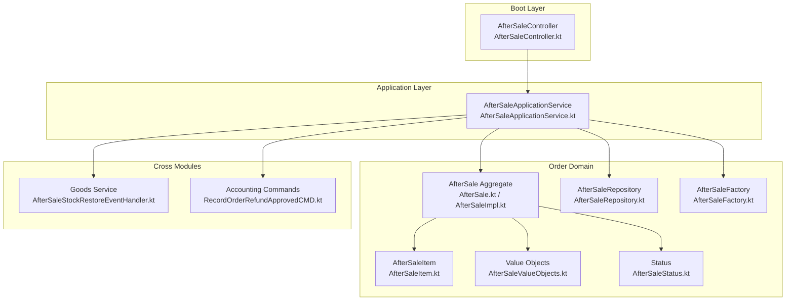
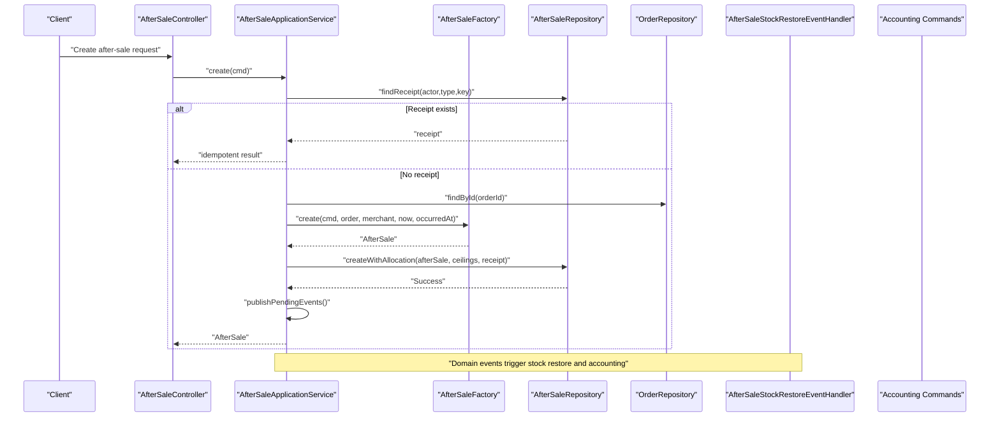
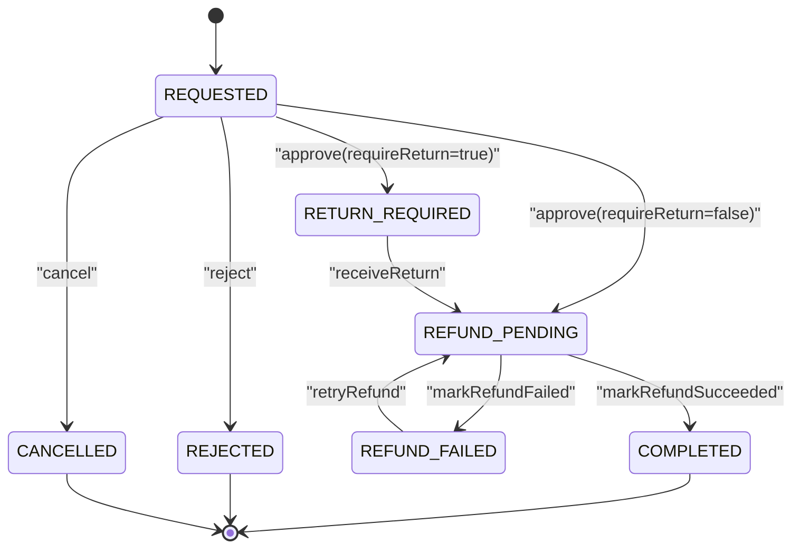
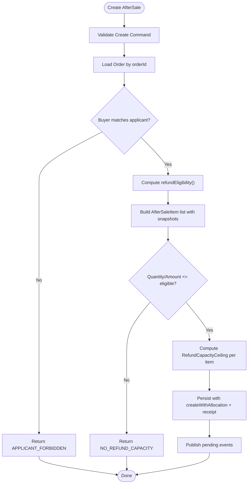
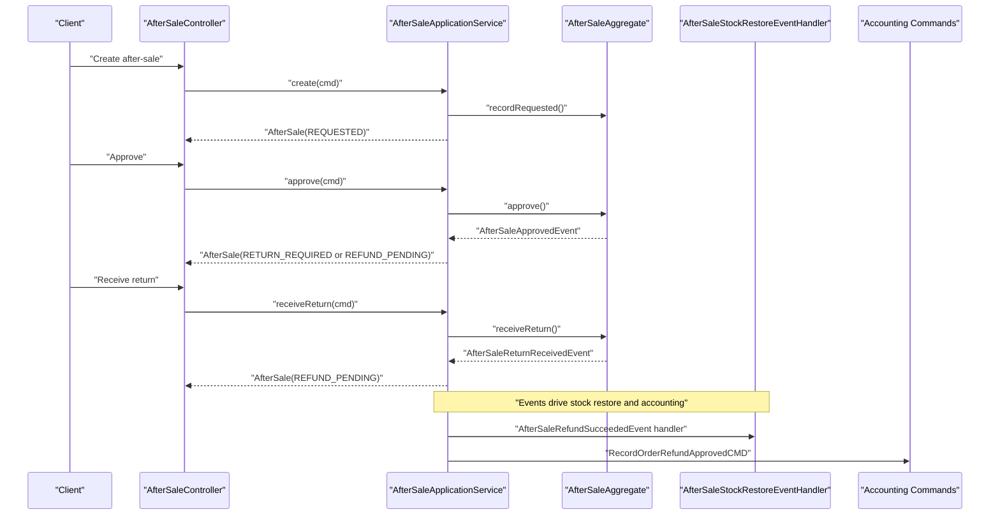
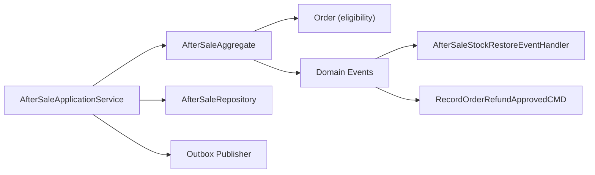

# After-Sale Processing

<cite>
**Referenced Files in This Document**
- [AfterSale.kt](file://j-store-order-domain/src/main/kotlin/com/jstore/order/domain/aftersale/AfterSale.kt)
- [AfterSaleImpl.kt](file://j-store-order-domain/src/main/kotlin/com/jstore/order/domain/aftersale/AfterSaleImpl.kt)
- [AfterSaleFactory.kt](file://j-store-order-domain/src/main/kotlin/com/jstore/order/domain/aftersale/AfterSaleFactory.kt)
- [AfterSaleItem.kt](file://j-store-order-domain/src/main/kotlin/com/jstore/order/domain/aftersale/AfterSaleItem.kt)
- [AfterSaleValueObjects.kt](file://j-store-order-domain/src/main/kotlin/com/jstore/order/domain/aftersale/AfterSaleValueObjects.kt)
- [AfterSaleStatus.kt](file://j-store-order-domain/src/main/kotlin/com/jstore/order/domain/aftersale/AfterSaleStatus.kt)
- [AfterSaleRepository.kt](file://j-store-order-domain/src/main/kotlin/com/jstore/order/domain/aftersale/AfterSaleRepository.kt)
- [AfterSaleApplicationService.kt](file://j-store-order-application/src/main/kotlin/com/jstore/order/service/AfterSaleApplicationService.kt)
- [AfterSaleController.kt](file://j-store-order-boot/src/main/kotlin/com/jstore/order/controller/AfterSaleController.kt)
- [AfterSaleStockRestoreEventHandler.kt](file://j-store-goods-application/src/main/kotlin/com/jstore/goods/service/AfterSaleStockRestoreEventHandler.kt)
- [RecordOrderRefundApprovedCMD.kt](file://j-store-accounting-application/src/main/kotlin/com/jstore/accounting/service/command/RecordOrderRefundApprovedCMD.kt)
- [AfterSaleApplicationServiceTest.kt](file://j-store-order-application/src/test/kotlin/com/jstore/order/service/AfterSaleApplicationServiceTest.kt)
</cite>

## Table of Contents
1. [Introduction](#introduction)
2. [Project Structure](#project-structure)
3. [Core Components](#core-components)
4. [Architecture Overview](#architecture-overview)
5. [Detailed Component Analysis](#detailed-component-analysis)
6. [Dependency Analysis](#dependency-analysis)
7. [Performance Considerations](#performance Considerations)
8. [Troubleshooting Guide](#troubleshooting-guide)
9. [Conclusion](#conclusion)

## Introduction
This document explains the after-sale processing capabilities centered around the AfterSale aggregate and its integration with orders, payments, inventory, and accounting. It covers refund eligibility calculation, partial vs full refunds, refund fact tracking, end-to-end workflow from request initiation to completion, return handling, payment system integration for refund execution, and audit trail/reporting considerations.

## Project Structure
The after-sale capability spans multiple layers:
- Domain layer defines the AfterSale aggregate, value objects, factory, repository interface, and status model.
- Application layer orchestrates commands, idempotency, capacity allocation, event publishing, and cross-cutting concerns.
- Boot layer exposes APIs via a controller.
- Cross-module handlers integrate with goods (stock restore) and accounting (refund approvals).

**Diagram sources**
- [AfterSale.kt](file://j-store-order-domain/src/main/kotlin/com/jstore/order/domain/aftersale/AfterSale.kt)
- [AfterSaleImpl.kt](file://j-store-order-domain/src/main/kotlin/com/jstore/order/domain/aftersale/AfterSaleImpl.kt)
- [AfterSaleItem.kt](file://j-store-order-domain/src/main/kotlin/com/jstore/order/domain/aftersale/AfterSaleItem.kt)
- [AfterSaleValueObjects.kt](file://j-store-order-domain/src/main/kotlin/com/jstore/order/domain/aftersale/AfterSaleValueObjects.kt)
- [AfterSaleStatus.kt](file://j-store-order-domain/src/main/kotlin/com/jstore/order/domain/aftersale/AfterSaleStatus.kt)
- [AfterSaleRepository.kt](file://j-store-order-domain/src/main/kotlin/com/jstore/order/domain/aftersale/AfterSaleRepository.kt)
- [AfterSaleFactory.kt](file://j-store-order-domain/src/main/kotlin/com/jstore/order/domain/aftersale/AfterSaleFactory.kt)
- [AfterSaleApplicationService.kt](file://j-store-order-application/src/main/kotlin/com/jstore/order/service/AfterSaleApplicationService.kt)
- [AfterSaleController.kt](file://j-store-order-boot/src/main/kotlin/com/jstore/order/controller/AfterSaleController.kt)
- [AfterSaleStockRestoreEventHandler.kt](file://j-store-goods-application/src/main/kotlin/com/jstore/goods/service/AfterSaleStockRestoreEventHandler.kt)
- [RecordOrderRefundApprovedCMD.kt](file://j-store-accounting-application/src/main/kotlin/com/jstore/accounting/service/command/RecordOrderRefundApprovedCMD.kt)

**Section sources**
- [AfterSale.kt](file://j-store-order-domain/src/main/kotlin/com/jstore/order/domain/aftersale/AfterSale.kt)
- [AfterSaleImpl.kt](file://j-store-order-domain/src/main/kotlin/com/jstore/order/domain/aftersale/AfterSaleImpl.kt)
- [AfterSaleFactory.kt](file://j-store-order-domain/src/main/kotlin/com/jstore/order/domain/aftersale/AfterSaleFactory.kt)
- [AfterSaleItem.kt](file://j-store-order-domain/src/main/kotlin/com/jstore/order/domain/aftersale/AfterSaleItem.kt)
- [AfterSaleValueObjects.kt](file://j-store-order-domain/src/main/kotlin/com/jstore/order/domain/aftersale/AfterSaleValueObjects.kt)
- [AfterSaleStatus.kt](file://j-store-order-domain/src/main/kotlin/com/jstore/order/domain/aftersale/AfterSaleStatus.kt)
- [AfterSaleRepository.kt](file://j-store-order-domain/src/main/kotlin/com/jstore/order/domain/aftersale/AfterSaleRepository.kt)
- [AfterSaleApplicationService.kt](file://j-store-order-application/src/main/kotlin/com/jstore/order/service/AfterSaleApplicationService.kt)
- [AfterSaleController.kt](file://j-store-order-boot/src/main/kotlin/com/jstore/order/controller/AfterSaleController.kt)
- [AfterSaleStockRestoreEventHandler.kt](file://j-store-goods-application/src/main/kotlin/com/jstore/goods/service/AfterSaleStockRestoreEventHandler.kt)
- [RecordOrderRefundApprovedCMD.kt](file://j-store-accounting-application/src/main/kotlin/com/jstore/accounting/service/command/RecordOrderRefundApprovedCMD.kt)

## Core Components
- AfterSale aggregate: Encapsulates lifecycle transitions, state validation, and domain events for refund requests, returns, and refund outcomes.
- AfterSaleFactory: Builds an AfterSale instance by validating eligibility against the order and capturing per-item snapshots.
- AfterSaleRepository: Persists aggregates, allocates refund capacity ceilings, and manages idempotency receipts.
- AfterSaleApplicationService: Orchestrates commands, enforces idempotency, performs capacity checks, publishes events, and coordinates cross-module actions.
- Value objects: RefundReason, FulfillmentSnapshot, GoodsSnapshot, RefundEligibilitySnapshot, ReviewDecision define constraints and context for after-sale operations.
- Status model: Enumerates states like REQUESTED, RETURN_REQUIRED, REFUND_PENDING, REFUND_FAILED, COMPLETED, REJECTED, CANCELLED.

Key responsibilities:
- Eligibility and capacity enforcement at creation time.
- Partial vs full refund support through per-item requested quantity and amount.
- Return-required flow when fulfillment is shipped or delivered.
- Idempotent command handling with receipts and hash-based conflict detection.
- Event-driven integration with inventory and accounting.

**Section sources**
- [AfterSale.kt](file://j-store-order-domain/src/main/kotlin/com/jstore/order/domain/aftersale/AfterSale.kt)
- [AfterSaleImpl.kt](file://j-store-order-domain/src/main/kotlin/com/jstore/order/domain/aftersale/AfterSaleImpl.kt)
- [AfterSaleFactory.kt](file://j-store-order-domain/src/main/kotlin/com/jstore/order/domain/aftersale/AfterSaleFactory.kt)
- [AfterSaleItem.kt](file://j-store-order-domain/src/main/kotlin/com/jstore/order/domain/aftersale/AfterSaleItem.kt)
- [AfterSaleValueObjects.kt](file://j-store-order-domain/src/main/kotlin/com/jstore/order/domain/aftersale/AfterSaleValueObjects.kt)
- [AfterSaleStatus.kt](file://j-store-order-domain/src/main/kotlin/com/jstore/order/domain/aftersale/AfterSaleStatus.kt)
- [AfterSaleRepository.kt](file://j-store-order-domain/src/main/kotlin/com/jstore/order/domain/aftersale/AfterSaleRepository.kt)
- [AfterSaleApplicationService.kt](file://j-store-order-application/src/main/kotlin/com/jstore/order/service/AfterSaleApplicationService.kt)

## Architecture Overview
The AfterSale aggregate is the single source of truth for after-sale state and events. The application service coordinates persistence, idempotency, capacity allocation, and event publishing. Cross-module integrations are driven by domain events:
- Inventory: Stock restoration on refund success.
- Accounting: Recording refund approvals and settlement updates.

**Diagram sources**
- [AfterSaleApplicationService.kt](file://j-store-order-application/src/main/kotlin/com/jstore/order/service/AfterSaleApplicationService.kt)
- [AfterSaleFactory.kt](file://j-store-order-domain/src/main/kotlin/com/jstore/order/domain/aftersale/AfterSaleFactory.kt)
- [AfterSaleRepository.kt](file://j-store-order-domain/src/main/kotlin/com/jstore/order/domain/aftersale/AfterSaleRepository.kt)
- [AfterSaleStockRestoreEventHandler.kt](file://j-store-goods-application/src/main/kotlin/com/jstore/goods/service/AfterSaleStockRestoreEventHandler.kt)
- [RecordOrderRefundApprovedCMD.kt](file://j-store-accounting-application/src/main/kotlin/com/jstore/accounting/service/command/RecordOrderRefundApprovedCMD.kt)

## Detailed Component Analysis

### AfterSale Aggregate Design and Lifecycle
- State machine: REQUESTED -> RETURN_REQUIRED or REFUND_PENDING -> REFUND_FAILED or COMPLETED; also REJECTED and CANCELLED terminal states.
- Methods: approve, reject, cancel, receiveReturn, retryRefund, markRefundSucceeded, markRefundFailed.
- Events raised: AfterSaleRequestedEvent, AfterSaleApprovedEvent, AfterSaleRejectedEvent, AfterSaleCancelledEvent, AfterSaleReturnReceivedEvent, AfterSaleRefundRequestedEvent, AfterSaleRefundSucceededEvent, AfterSaleRefundFailedEvent.
- Validation: Enforces actor permissions (merchant/applicant), state transitions, and consistency of timestamps and fields.

**Diagram sources**
- [AfterSaleImpl.kt](file://j-store-order-domain/src/main/kotlin/com/jstore/order/domain/aftersale/AfterSaleImpl.kt)
- [AfterSaleStatus.kt](file://j-store-order-domain/src/main/kotlin/com/jstore/order/domain/aftersale/AfterSaleStatus.kt)

**Section sources**
- [AfterSale.kt](file://j-store-order-domain/src/main/kotlin/com/jstore/order/domain/aftersale/AfterSale.kt)
- [AfterSaleImpl.kt](file://j-store-order-domain/src/main/kotlin/com/jstore/order/domain/aftersale/AfterSaleImpl.kt)
- [AfterSaleStatus.kt](file://j-store-order-domain/src/main/kotlin/com/jstore/order/domain/aftersale/AfterSaleStatus.kt)

### Refund Eligibility Calculation and Capacity Allocation
- Eligibility is derived from the order’s refundEligibility() method, returning buyer identity and per-item eligible quantities and amounts.
- Factory validates that requested items exist and that requested quantity/amount do not exceed eligible limits.
- Per-item snapshots capture SKU, SPU, names, descriptions, currency, and eligible caps to ensure immutability of decision context.
- Capacity ceilings are computed only for requested items and enforced during createWithAllocation to prevent over-refunding.

**Diagram sources**
- [AfterSaleFactory.kt](file://j-store-order-domain/src/main/kotlin/com/jstore/order/domain/aftersale/AfterSaleFactory.kt)
- [AfterSaleApplicationService.kt](file://j-store-order-application/src/main/kotlin/com/jstore/order/service/AfterSaleApplicationService.kt)
- [AfterSaleValueObjects.kt](file://j-store-order-domain/src/main/kotlin/com/jstore/order/domain/aftersale/AfterSaleValueObjects.kt)

**Section sources**
- [AfterSaleFactory.kt](file://j-store-order-domain/src/main/kotlin/com/jstore/order/domain/aftersale/AfterSaleFactory.kt)
- [AfterSaleApplicationService.kt](file://j-store-order-application/src/main/kotlin/com/jstore/order/service/AfterSaleApplicationService.kt)
- [AfterSaleValueObjects.kt](file://j-store-order-domain/src/main/kotlin/com/jstore/order/domain/aftersale/AfterSaleValueObjects.kt)

### Partial vs Full Refunds
- Partial refund: Requested quantity/amount less than eligible caps; supported per item via AfterSaleItem.
- Full refund: Requested quantity/amount equals eligible caps for all items in the after-sale.
- The aggregate computes total refund amount as sum of per-item requested amounts and tracks currency consistency.

**Section sources**
- [AfterSaleItem.kt](file://j-store-order-domain/src/main/kotlin/com/jstore/order/domain/aftersale/AfterSaleItem.kt)
- [AfterSaleImpl.kt](file://j-store-order-domain/src/main/kotlin/com/jstore/order/domain/aftersale/AfterSaleImpl.kt)

### Refund Fact Tracking and Idempotency
- Command receipts store actor, type, idempotency key, and hashed payload digest to enforce idempotency and detect conflicts.
- For decisions (approve/reject/cancel), saveDecision persists the outcome along with allocation action (APPROVE/RELEASE).
- External refund outcomes (succeeded/failed) are recorded via markRefundSucceeded/markRefundFailed with idempotency checks.

**Section sources**
- [AfterSaleApplicationService.kt](file://j-store-order-application/src/main/kotlin/com/jstore/order/service/AfterSaleApplicationService.kt)
- [AfterSaleRepository.kt](file://j-store-order-domain/src/main/kotlin/com/jstore/order/domain/aftersale/AfterSaleRepository.kt)
- [AfterSaleImpl.kt](file://j-store-order-domain/src/main/kotlin/com/jstore/order/domain/aftersale/AfterSaleImpl.kt)

### After-Sale Workflow: From Request to Completion
- Initiation: Client calls AfterSaleController which delegates to AfterSaleApplicationService.create.
- Approval: Merchant approves; if requireReturn is true, state moves to RETURN_REQUIRED; otherwise directly to REFUND_PENDING.
- Return Handling: Merchant marks return received; state transitions to REFUND_PENDING and triggers refund request event.
- Payment Integration: Refund execution is external; outcomes update state via recordRefundSucceeded/recordRefundFailed.
- Completion: On successful refund, state becomes COMPLETED; events propagate to inventory and accounting.

**Diagram sources**
- [AfterSaleController.kt](file://j-store-order-boot/src/main/kotlin/com/jstore/order/controller/AfterSaleController.kt)
- [AfterSaleApplicationService.kt](file://j-store-order-application/src/main/kotlin/com/jstore/order/service/AfterSaleApplicationService.kt)
- [AfterSaleImpl.kt](file://j-store-order-domain/src/main/kotlin/com/jstore/order/domain/aftersale/AfterSaleImpl.kt)
- [AfterSaleStockRestoreEventHandler.kt](file://j-store-goods-application/src/main/kotlin/com/jstore/goods/service/AfterSaleStockRestoreEventHandler.kt)
- [RecordOrderRefundApprovedCMD.kt](file://j-store-accounting-application/src/main/kotlin/com/jstore/accounting/service/command/RecordOrderRefundApprovedCMD.kt)

**Section sources**
- [AfterSaleController.kt](file://j-store-order-boot/src/main/kotlin/com/jstore/order/controller/AfterSaleController.kt)
- [AfterSaleApplicationService.kt](file://j-store-order-application/src/main/kotlin/com/jstore/order/service/AfterSaleApplicationService.kt)
- [AfterSaleImpl.kt](file://j-store-order-domain/src/main/kotlin/com/jstore/order/domain/aftersale/AfterSaleImpl.kt)
- [AfterSaleStockRestoreEventHandler.kt](file://j-store-goods-application/src/main/kotlin/com/jstore/goods/service/AfterSaleStockRestoreEventHandler.kt)
- [RecordOrderRefundApprovedCMD.kt](file://j-store-accounting-application/src/main/kotlin/com/jstore/accounting/service/command/RecordOrderRefundApprovedCMD.kt)

### Examples of Refund Processing and Return Handling
- Example 1: Single-line partial refund on a multi-line order. The application service constructs ceilings only for the requested item(s), ensuring precise capacity allocation.
- Example 2: Return-required flow where approval sets RETURN_REQUIRED; receiving the return transitions to REFUND_PENDING and emits refund request events.
- Example 3: Retry refund scenario where REFUND_FAILED can be retried back to REFUND_PENDING; subsequent success transitions to COMPLETED.

These behaviors are validated in tests and implemented via the application service and aggregate methods.

**Section sources**
- [AfterSaleApplicationServiceTest.kt](file://j-store-order-application/src/test/kotlin/com/jstore/order/service/AfterSaleApplicationServiceTest.kt)
- [AfterSaleApplicationService.kt](file://j-store-order-application/src/main/kotlin/com/jstore/order/service/AfterSaleApplicationService.kt)
- [AfterSaleImpl.kt](file://j-store-order-domain/src/main/kotlin/com/jstore/order/domain/aftersale/AfterSaleImpl.kt)

### Integration with Payment Systems for Refund Execution
- The aggregate does not execute payments; it records external outcomes via markRefundSucceeded/markRefundFailed.
- Outcomes are idempotent and include refund identifiers and failure reasons.
- Events emitted upon successful refund can be consumed by downstream systems (e.g., accounting) to finalize financial records.

**Section sources**
- [AfterSaleImpl.kt](file://j-store-order-domain/src/main/kotlin/com/jstore/order/domain/aftersale/AfterSaleImpl.kt)
- [AfterSaleApplicationService.kt](file://j-store-order-application/src/main/kotlin/com/jstore/order/service/AfterSaleApplicationService.kt)

### Audit Trail and Reporting Capabilities
- Audit trail: Each state transition raises explicit domain events carrying relevant context (actor IDs, timestamps, item details, amounts, currencies).
- Reporting: Consumers can build read models from these events to report statuses, refund totals, return timelines, and failure reasons.
- Idempotency receipts provide an additional audit layer for command execution and conflict resolution.

**Section sources**
- [AfterSaleImpl.kt](file://j-store-order-domain/src/main/kotlin/com/jstore/order/domain/aftersale/AfterSaleImpl.kt)
- [AfterSaleApplicationService.kt](file://j-store-order-application/src/main/kotlin/com/jstore/order/service/AfterSaleApplicationService.kt)

## Dependency Analysis
The AfterSale module depends on:
- Order domain for eligibility and access control.
- Common framework for events, outbox, and utilities.
- Goods and Accounting modules via events and commands for post-processing.

**Diagram sources**
- [AfterSaleImpl.kt](file://j-store-order-domain/src/main/kotlin/com/jstore/order/domain/aftersale/AfterSaleImpl.kt)
- [AfterSaleApplicationService.kt](file://j-store-order-application/src/main/kotlin/com/jstore/order/service/AfterSaleApplicationService.kt)
- [AfterSaleRepository.kt](file://j-store-order-domain/src/main/kotlin/com/jstore/order/domain/aftersale/AfterSaleRepository.kt)
- [AfterSaleStockRestoreEventHandler.kt](file://j-store-goods-application/src/main/kotlin/com/jstore/goods/service/AfterSaleStockRestoreEventHandler.kt)
- [RecordOrderRefundApprovedCMD.kt](file://j-store-accounting-application/src/main/kotlin/com/jstore/accounting/service/command/RecordOrderRefundApprovedCMD.kt)

**Section sources**
- [AfterSaleApplicationService.kt](file://j-store-order-application/src/main/kotlin/com/jstore/order/service/AfterSaleApplicationService.kt)
- [AfterSaleRepository.kt](file://j-store-order-domain/src/main/kotlin/com/jstore/order/domain/aftersale/AfterSaleRepository.kt)
- [AfterSaleStockRestoreEventHandler.kt](file://j-store-goods-application/src/main/kotlin/com/jstore/goods/service/AfterSaleStockRestoreEventHandler.kt)
- [RecordOrderRefundApprovedCMD.kt](file://j-store-accounting-application/src/main/kotlin/com/jstore/accounting/service/command/RecordOrderRefundApprovedCMD.kt)

## Performance Considerations
- Capacity allocation is scoped to requested items to minimize overhead.
- Idempotency checks avoid redundant processing and reduce contention.
- Event publishing uses pending events within transactions to ensure consistency and durability.
- Concurrency: Repository-level allocation and receipts should use pessimistic locking or unique constraints to prevent race conditions.

[No sources needed since this section provides general guidance]

## Troubleshooting Guide
Common issues and resolutions:
- Applicant forbidden: Ensure the applicant matches the order buyer; check authorization before creating after-sale.
- No refund capacity: Verify requested quantity/amount against eligible caps; adjust request or confirm prior refunds.
- Illegal state transitions: Confirm current status allows the operation; review state machine rules.
- Idempotency conflict: Reuse the same idempotency key and payload; resolve conflicting hashes if payload changed.
- Refund reference conflict: Avoid changing refundId after completion; ensure consistent identifiers across retries.

**Section sources**
- [AfterSaleApplicationService.kt](file://j-store-order-application/src/main/kotlin/com/jstore/order/service/AfterSaleApplicationService.kt)
- [AfterSaleImpl.kt](file://j-store-order-domain/src/main/kotlin/com/jstore/order/domain/aftersale/AfterSaleImpl.kt)

## Conclusion
The AfterSale aggregate provides a robust, event-driven foundation for after-sale processing. It enforces eligibility and capacity, supports partial and full refunds, integrates with inventory and accounting via events, and ensures idempotency and auditability. The design enables clear workflows from request initiation through completion while maintaining strong consistency and traceability.