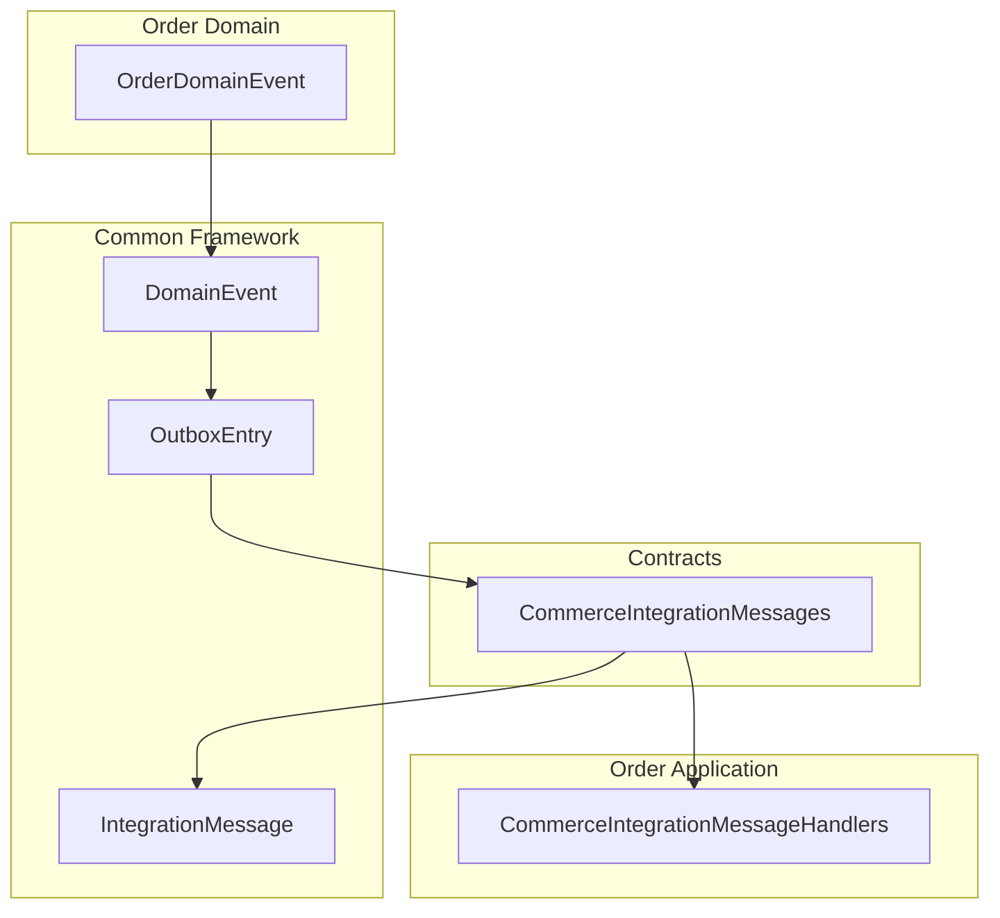
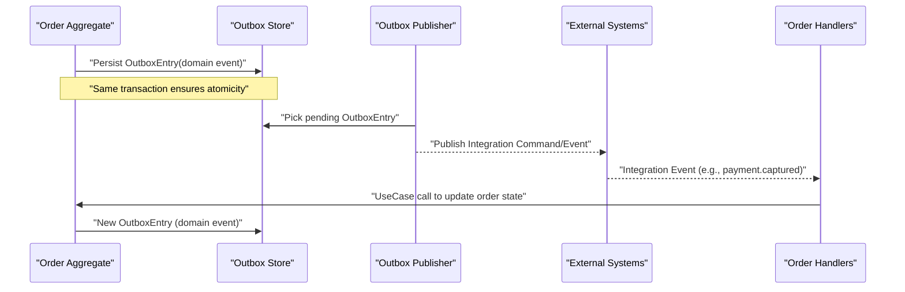
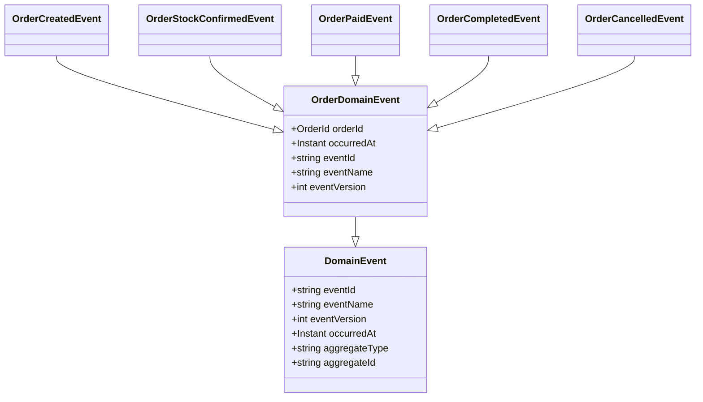
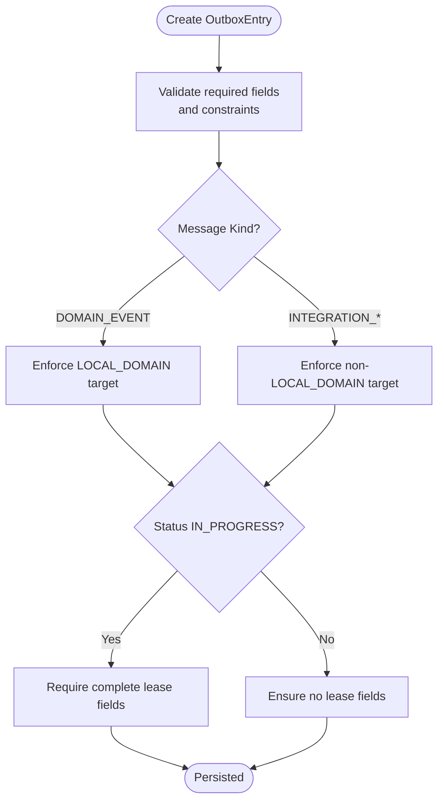
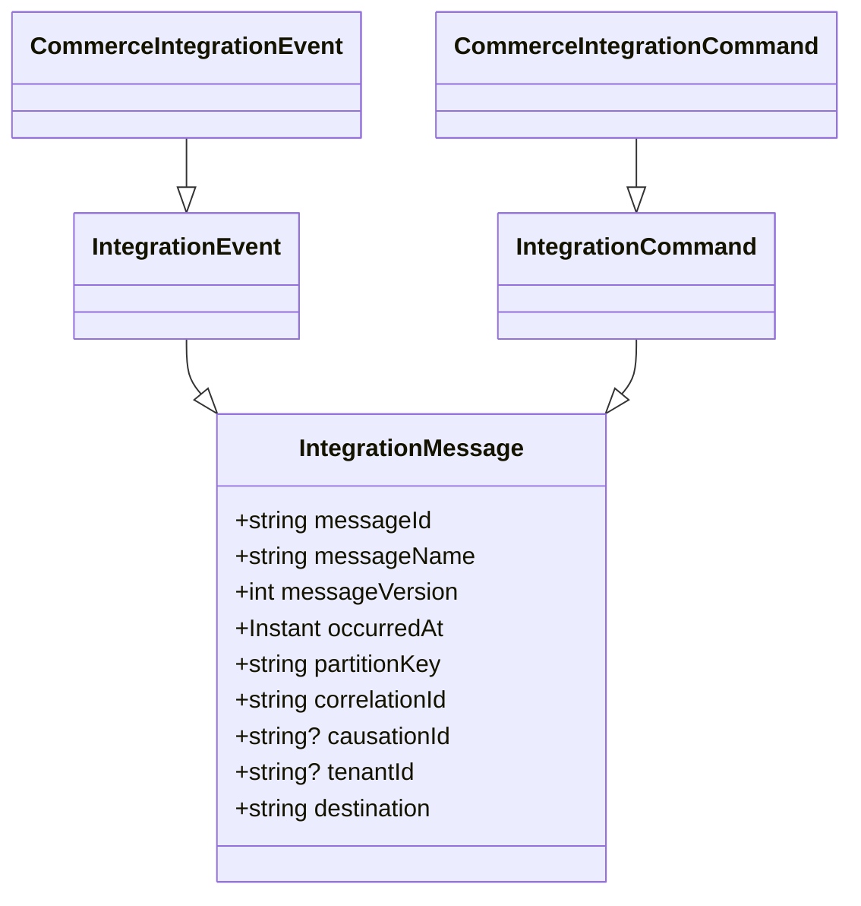
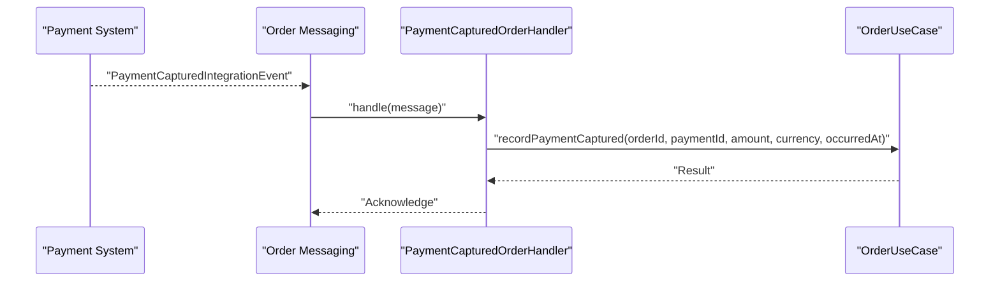
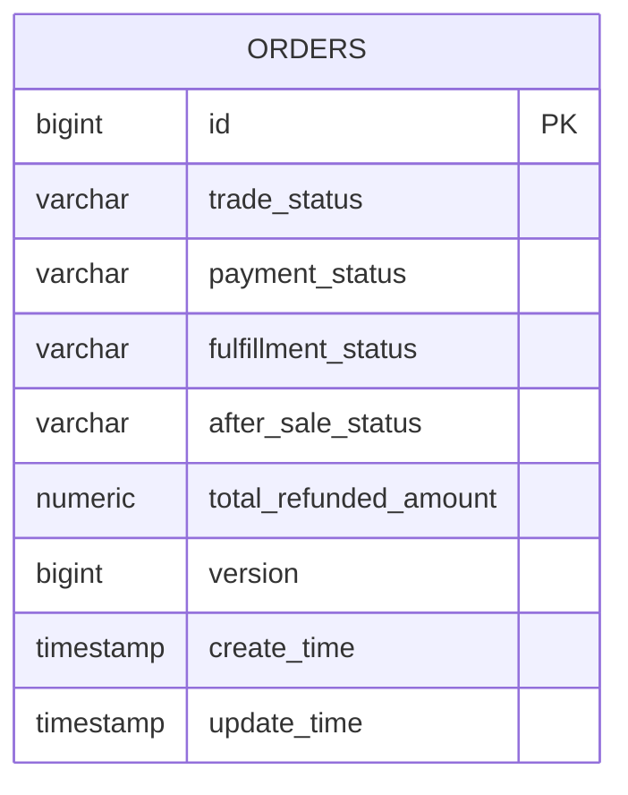
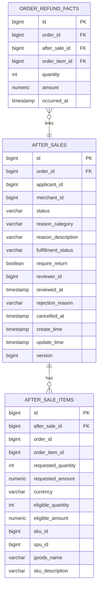
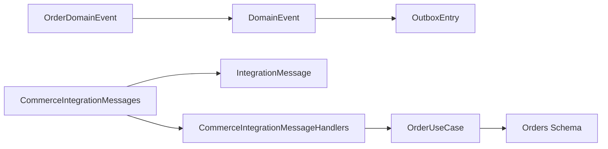

# Domain Events & Projections

<cite>
**Referenced Files in This Document**
- [CommerceIntegrationMessages.kt](file://j-store-integration-contracts/src/main/kotlin/com/jstore/contracts/commerce/CommerceIntegrationMessages.kt)
- [OrderDomainEvent.kt](file://j-store-order-domain/src/main/kotlin/com/jstore/order/domain/order/event/OrderDomainEvent.kt)
- [DomainEvent.kt](file://j-store-common-core/src/main/kotlin/com/jstore/common/framework/event/DomainEvent.kt)
- [OutboxEntry.kt](file://j-store-common-core/src/main/kotlin/com/jstore/common/framework/event/outbox/OutboxEntry.kt)
- [IntegrationMessage.kt](file://j-store-common-core/src/main/kotlin/com/jstore/common/framework/messaging/IntegrationMessage.kt)
- [CommerceIntegrationMessageHandlers.kt](file://j-store-order-application/src/main/kotlin/com/jstore/order/service/CommerceIntegrationMessageHandlers.kt)
- [V20260731__order_status_dimensions.sql](file://j-store-boot/src/main/resources/db/migration/V20260731__order_status_dimensions.sql)
- [V20260803__order_after_sale_aggregate.sql](file://j-store-boot/src/main/resources/db/migration/V20260803__order_after_sale_aggregate.sql)
</cite>

## Table of Contents
1. Introduction
2. Project Structure
3. Core Components
4. Architecture Overview
5. Detailed Component Analysis
6. Dependency Analysis
7. Performance Considerations
8. Troubleshooting Guide
9. Conclusion

## Introduction
This document explains the order domain events and projection mechanisms, focusing on:
- Event types emitted during the order lifecycle and their payload structures
- How external systems consume order events through commerce integration message handlers
- Event serialization, versioning, and backward compatibility strategies
- Examples of event-driven integrations with payment, fulfillment, and accounting systems
- Event ordering, deduplication, and error handling patterns

The approach uses a domain event model persisted via an outbox pattern and integrates across bounded contexts using stable integration messages.

## Project Structure
At a high level:
- Order domain emits domain events (e.g., order created, paid, completed).
- Outbox persists these events atomically with business transactions.
- Integration contracts define commands/events crossing process boundaries (payment, fulfillment, inventory, accounting).
- Order application consumes integration events to update order state projections.

**Diagram sources**
- [OrderDomainEvent.kt](file://j-store-order-domain/src/main/kotlin/com/jstore/order/domain/order/event/OrderDomainEvent.kt)
- [DomainEvent.kt](file://j-store-common-core/src/main/kotlin/com/jstore/common/framework/event/DomainEvent.kt)
- [OutboxEntry.kt](file://j-store-common-core/src/main/kotlin/com/jstore/common/framework/event/outbox/OutboxEntry.kt)
- [IntegrationMessage.kt](file://j-store-common-core/src/main/kotlin/com/jstore/common/framework/messaging/IntegrationMessage.kt)
- [CommerceIntegrationMessages.kt](file://j-store-integration-contracts/src/main/kotlin/com/jstore/contracts/commerce/CommerceIntegrationMessages.kt)
- [CommerceIntegrationMessageHandlers.kt](file://j-store-order-application/src/main/kotlin/com/jstore/order/service/CommerceIntegrationMessageHandlers.kt)

**Section sources**
- [OrderDomainEvent.kt](file://j-store-order-domain/src/main/kotlin/com/jstore/order/domain/order/event/OrderDomainEvent.kt)
- [CommerceIntegrationMessages.kt](file://j-store-integration-contracts/src/main/kotlin/com/jstore/contracts/commerce/CommerceIntegrationMessages.kt)
- [CommerceIntegrationMessageHandlers.kt](file://j-store-order-application/src/main/kotlin/com/jstore/order/service/CommerceIntegrationMessageHandlers.kt)

## Core Components
- Domain events: Immutable facts emitted by aggregates with stable metadata (event id, name, version, occurred at, aggregate type/id).
- Outbox entries: Persisted records for reliable delivery of domain and integration messages, including routing metadata and retry/lease fields.
- Integration messages: Stable cross-boundary contracts for commands and events with deterministic IDs and correlation/causation tracking.
- Order domain events: Specific order lifecycle events (created, stock confirmed, paid, completed, cancelled).
- Commerce integration messages: Commands and events for inventory, payment, fulfillment, and accounting interactions.
- Order integration handlers: Consumers that translate incoming integration events into order use case calls.

**Section sources**
- [DomainEvent.kt](file://j-store-common-core/src/main/kotlin/com/jstore/common/framework/event/DomainEvent.kt)
- [OutboxEntry.kt](file://j-store-common-core/src/main/kotlin/com/jstore/common/framework/event/outbox/OutboxEntry.kt)
- [IntegrationMessage.kt](file://j-store-common-core/src/main/kotlin/com/jstore/common/framework/messaging/IntegrationMessage.kt)
- [OrderDomainEvent.kt](file://j-store-order-domain/src/main/kotlin/com/jstore/order/domain/order/event/OrderDomainEvent.kt)
- [CommerceIntegrationMessages.kt](file://j-store-integration-contracts/src/main/kotlin/com/jstore/contracts/commerce/CommerceIntegrationMessages.kt)
- [CommerceIntegrationMessageHandlers.kt](file://j-store-order-application/src/main/kotlin/com/jstore/order/service/CommerceIntegrationMessageHandlers.kt)

## Architecture Overview
The order event pipeline:
1. Order aggregate emits domain events.
2. Domain events are persisted as outbox entries within the same transaction.
3. Outbox publisher delivers local domain events and/or integration messages based on configuration.
4. External systems publish integration events back to order context (e.g., payment captured, fulfillment delivered).
5. Order application handlers consume integration events and update order projections via use cases.

**Diagram sources**
- [OutboxEntry.kt](file://j-store-common-core/src/main/kotlin/com/jstore/common/framework/event/outbox/OutboxEntry.kt)
- [IntegrationMessage.kt](file://j-store-common-core/src/main/kotlin/com/jstore/common/framework/messaging/IntegrationMessage.kt)
- [CommerceIntegrationMessages.kt](file://j-store-integration-contracts/src/main/kotlin/com/jstore/contracts/commerce/CommerceIntegrationMessages.kt)
- [CommerceIntegrationMessageHandlers.kt](file://j-store-order-application/src/main/kotlin/com/jstore/order/service/CommerceIntegrationMessageHandlers.kt)

## Detailed Component Analysis

### Order Domain Events
Order domain events capture key lifecycle transitions:
- OrderCreatedEvent: includes merchant, payable amount, currency, items snapshot.
- OrderStockConfirmedEvent: confirms stock reservation with amounts and currency.
- OrderPaidEvent: records payment reference, paid amount, currency, items snapshot.
- OrderCompletedEvent: signals final completion.
- OrderCancelledEvent: indicates cancellation with optional reason.

These events implement the common DomainEvent interface, providing stable metadata and consistent aggregation identity.

**Diagram sources**
- [DomainEvent.kt](file://j-store-common-core/src/main/kotlin/com/jstore/common/framework/event/DomainEvent.kt)
- [OrderDomainEvent.kt](file://j-store-order-domain/src/main/kotlin/com/jstore/order/domain/order/event/OrderDomainEvent.kt)

**Section sources**
- [OrderDomainEvent.kt](file://j-store-order-domain/src/main/kotlin/com/jstore/order/domain/order/event/OrderDomainEvent.kt)
- [DomainEvent.kt](file://j-store-common-core/src/main/kotlin/com/jstore/common/framework/event/DomainEvent.kt)

### Outbox Model and Delivery Targets
OutboxEntry encapsulates:
- Event/message identity and version
- Payload serialization
- Routing metadata (destination, partitionKey, correlationId, causationId, tenantId)
- Delivery target and kind (domain event vs integration command/event)
- Retry and lease fields for robust delivery

Constraints ensure correct usage per message kind and enforce non-blank identifiers.

**Diagram sources**
- [OutboxEntry.kt](file://j-store-common-core/src/main/kotlin/com/jstore/common/framework/event/outbox/OutboxEntry.kt)

**Section sources**
- [OutboxEntry.kt](file://j-store-common-core/src/main/kotlin/com/jstore/common/framework/event/outbox/OutboxEntry.kt)

### Commerce Integration Messages
Integration contracts define stable commands and events used across contexts:
- Inventory commands: reserve, confirm, release, restore-after-refund; events: reserved, reservation-failed.
- Payment commands: create-for-order, request-refund; events: captured.integration, refund-succeeded.integration, refund-failed.integration.
- Fulfillment commands: create-for-order; events: prepared.integration, dispatched.integration, delivered.integration.
- Accounting trigger: order.completed.integration.

Each message carries a deterministic messageId generated from name, version, partitionKey, and occurredAt, ensuring idempotency.

**Diagram sources**
- [IntegrationMessage.kt](file://j-store-common-core/src/main/kotlin/com/jstore/common/framework/messaging/IntegrationMessage.kt)
- [CommerceIntegrationMessages.kt](file://j-store-integration-contracts/src/main/kotlin/com/jstore/contracts/commerce/CommerceIntegrationMessages.kt)

**Section sources**
- [CommerceIntegrationMessages.kt](file://j-store-integration-contracts/src/main/kotlin/com/jstore/contracts/commerce/CommerceIntegrationMessages.kt)
- [IntegrationMessage.kt](file://j-store-common-core/src/main/kotlin/com/jstore/common/framework/messaging/IntegrationMessage.kt)

### Order Integration Message Handlers
Order application consumes integration events to update order projections:
- PaymentCapturedOrderHandler: records payment capture details.
- FulfillmentPreparedOrderHandler: records preparation.
- FulfillmentDispatchedOrderHandler: records shipment dispatch.
- FulfillmentDeliveredOrderHandler: records delivery and completes the order.
- PaymentRefundSucceededOrderHandler: updates after-sale and order refund facts.
- PaymentRefundFailedOrderHandler: records refund failure in after-sale.

Each handler translates integration payloads into use case calls, preserving correlation/causation and timestamps.

**Diagram sources**
- [CommerceIntegrationMessageHandlers.kt](file://j-store-order-application/src/main/kotlin/com/jstore/order/service/CommerceIntegrationMessageHandlers.kt)
- [CommerceIntegrationMessages.kt](file://j-store-integration-contracts/src/main/kotlin/com/jstore/contracts/commerce/CommerceIntegrationMessages.kt)

**Section sources**
- [CommerceIntegrationMessageHandlers.kt](file://j-store-order-application/src/main/kotlin/com/jstore/order/service/CommerceIntegrationMessageHandlers.kt)
- [CommerceIntegrationMessages.kt](file://j-store-integration-contracts/src/main/kotlin/com/jstore/contracts/commerce/CommerceIntegrationMessages.kt)

### Projection Schema and State Dimensions
Order projections persist multi-dimensional status dimensions:
- Trade status: CREATED, ACTIVE, CLOSED, COMPLETED
- Payment status: UNPAID, PAID, PARTIALLY_REFUNDED, REFUNDED
- Fulfillment status: UNFULFILLED, PENDING_SHIPMENT, SHIPPED, DELIVERED
- After-sale status: NONE, PROCESSING, PARTIALLY_COMPLETED, COMPLETED

Indexes optimize queries by status and creation time.

**Diagram sources**
- [V20260731__order_status_dimensions.sql](file://j-store-boot/src/main/resources/db/migration/V20260731__order_status_dimensions.sql)

**Section sources**
- [V20260731__order_status_dimensions.sql](file://j-store-boot/src/main/resources/db/migration/V20260731__order_status_dimensions.sql)

### After-Sale and Refund Facts
After-sale operations introduce dedicated tables and fact records:
- after_sales: captures applicant, merchant, status, review info, timestamps.
- after_sale_items: line-level details for requested refunds.
- after_sale_capacities: ceiling constraints per order item.
- order_refund_facts: immutable facts for successful refunds per order item.

These support precise refund accounting and auditability.

**Diagram sources**
- [V20260803__order_after_sale_aggregate.sql](file://j-store-boot/src/main/resources/db/migration/V20260803__order_after_sale_aggregate.sql)

**Section sources**
- [V20260803__order_after_sale_aggregate.sql](file://j-store-boot/src/main/resources/db/migration/V20260803__order_after_sale_aggregate.sql)

## Dependency Analysis
- Order domain depends on common framework interfaces for events and outbox.
- Contracts module defines integration messages consumed by order application handlers.
- Order application depends on order use cases to mutate order projections upon receiving integration events.
- Database migrations define projection schemas and indexes.

**Diagram sources**
- [OrderDomainEvent.kt](file://j-store-order-domain/src/main/kotlin/com/jstore/order/domain/order/event/OrderDomainEvent.kt)
- [DomainEvent.kt](file://j-store-common-core/src/main/kotlin/com/jstore/common/framework/event/DomainEvent.kt)
- [OutboxEntry.kt](file://j-store-common-core/src/main/kotlin/com/jstore/common/framework/event/outbox/OutboxEntry.kt)
- [CommerceIntegrationMessages.kt](file://j-store-integration-contracts/src/main/kotlin/com/jstore/contracts/commerce/CommerceIntegrationMessages.kt)
- [IntegrationMessage.kt](file://j-store-common-core/src/main/kotlin/com/jstore/common/framework/messaging/IntegrationMessage.kt)
- [CommerceIntegrationMessageHandlers.kt](file://j-store-order-application/src/main/kotlin/com/jstore/order/service/CommerceIntegrationMessageHandlers.kt)
- [V20260731__order_status_dimensions.sql](file://j-store-boot/src/main/resources/db/migration/V20260731__order_status_dimensions.sql)

**Section sources**
- [CommerceIntegrationMessages.kt](file://j-store-integration-contracts/src/main/kotlin/com/jstore/contracts/commerce/CommerceIntegrationMessages.kt)
- [CommerceIntegrationMessageHandlers.kt](file://j-store-order-application/src/main/kotlin/com/jstore/order/service/CommerceIntegrationMessageHandlers.kt)
- [V20260731__order_status_dimensions.sql](file://j-store-boot/src/main/resources/db/migration/V20260731__order_status_dimensions.sql)

## Performance Considerations
- Use partitionKey for ordered processing and co-location of related events (e.g., orderId).
- Keep payloads minimal and versioned to reduce serialization overhead.
- Leverage database indexes on status dimensions for efficient querying.
- Employ outbox retry with exponential backoff and dead-letter handling for transient failures.
- Batch outbox publishing where possible to reduce broker load.

[No sources needed since this section provides general guidance]

## Troubleshooting Guide
- Idempotency: Ensure consumers check messageId or stableIntegrationMessageId to avoid duplicate processing.
- Ordering: PartitionKey should align with logical ordering requirements (e.g., orderId).
- Deduplication: Use unique keys in projection tables (e.g., order_refund_facts) to prevent reprocessing side effects.
- Error handling: Inspect lastError and retryCount on OutboxEntry; route persistent failures to dead-letter queues.
- Correlation/Causation: Trace requests across boundaries using correlationId and causationId.

**Section sources**
- [IntegrationMessage.kt](file://j-store-common-core/src/main/kotlin/com/jstore/common/framework/messaging/IntegrationMessage.kt)
- [OutboxEntry.kt](file://j-store-common-core/src/main/kotlin/com/jstore/common/framework/event/outbox/OutboxEntry.kt)
- [V20260803__order_after_sale_aggregate.sql](file://j-store-boot/src/main/resources/db/migration/V20260803__order_after_sale_aggregate.sql)

## Conclusion
The order domain leverages a robust event-driven architecture:
- Domain events capture lifecycle changes with stable metadata.
- Outbox guarantees reliable delivery and consistent state transitions.
- Integration contracts enable decoupled communication with payment, fulfillment, and accounting systems.
- Projections maintain clear, indexed state dimensions for operational clarity.
- Patterns for ordering, deduplication, and error handling ensure resilience and correctness.

[No sources needed since this section summarizes without analyzing specific files]