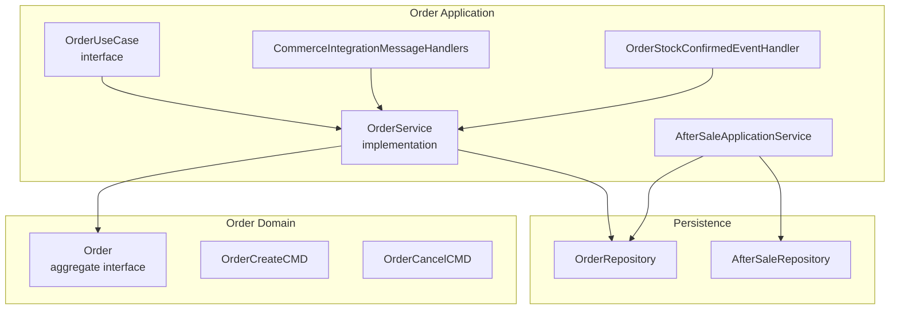
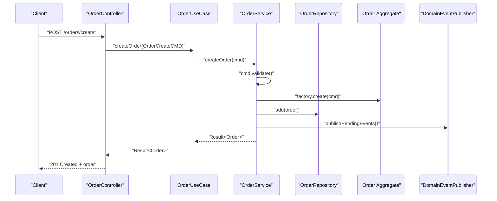
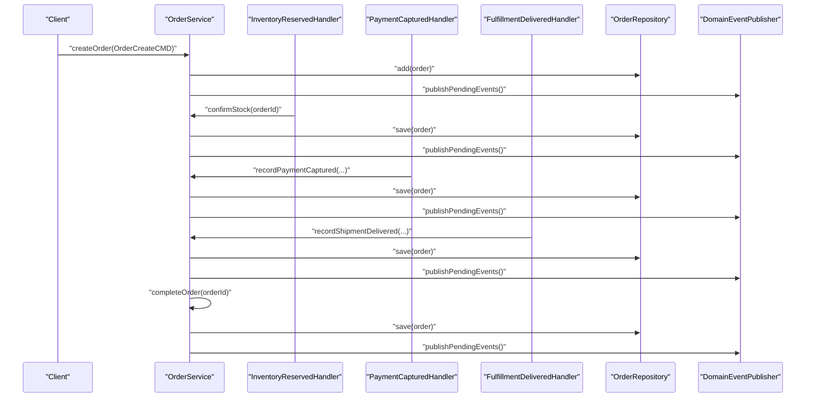
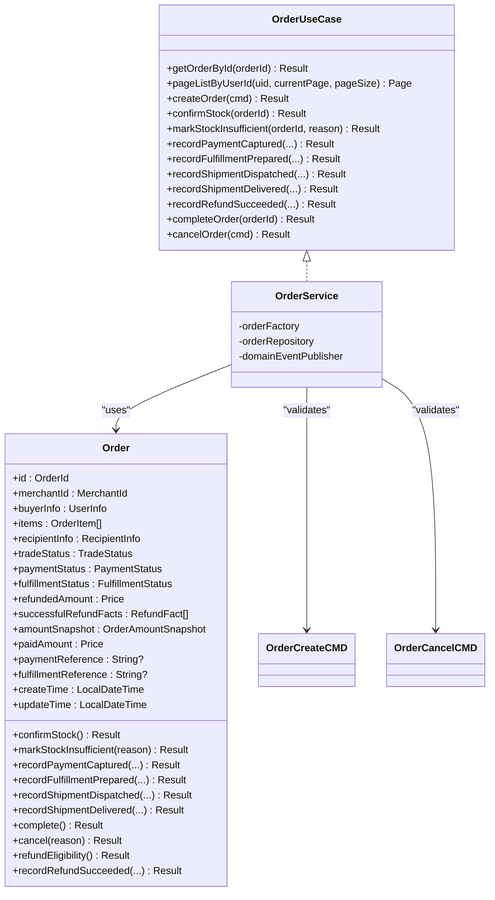
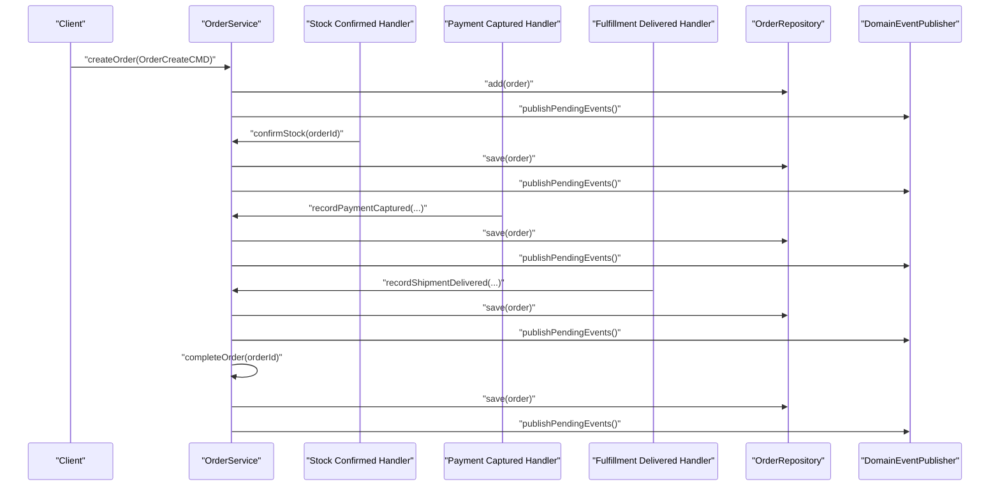
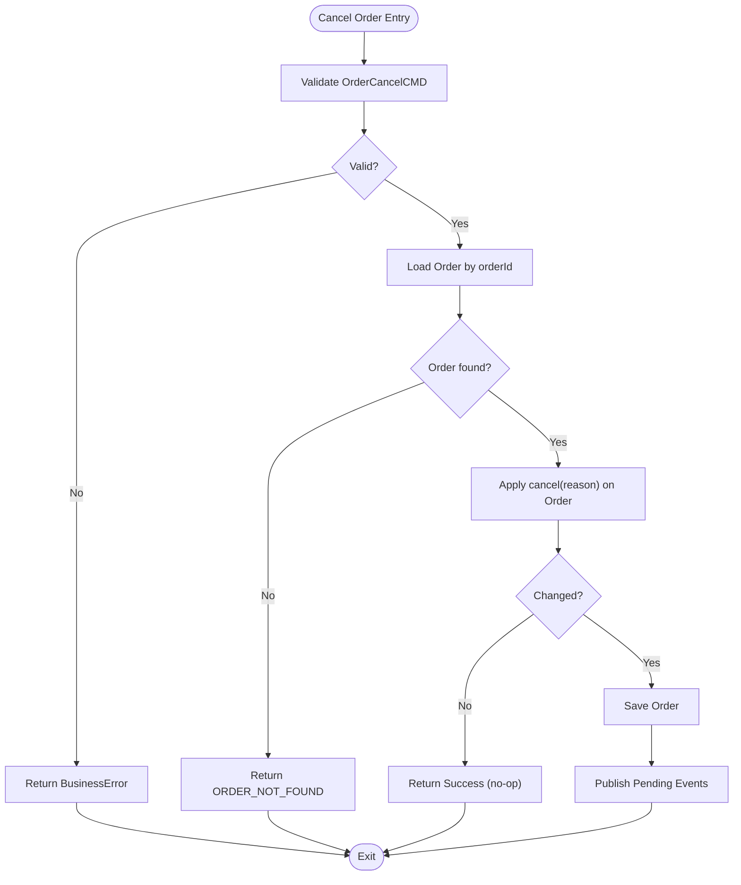
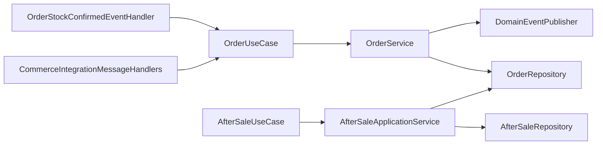

# Order Commands & Use Cases

<cite>
**Referenced Files in This Document**
- [OrderService.kt](file://j-store-order-application/src/main/kotlin/com/jstore/order/service/OrderService.kt)
- [OrderUseCases.kt](file://j-store-order-application/src/main/kotlin/com/jstore/order/service/OrderUseCases.kt)
- [CommerceIntegrationMessageHandlers.kt](file://j-store-order-application/src/main/kotlin/com/jstore/order/service/CommerceIntegrationMessageHandlers.kt)
- [OrderStockEventHandler.kt](file://j-store-order-application/src/main/kotlin/com/jstore/order/service/OrderStockEventHandler.kt)
- [AfterSaleApplicationService.kt](file://j-store-order-application/src/main/kotlin/com/jstore/order/service/AfterSaleApplicationService.kt)
- [Order.kt](file://j-store-order-domain/src/main/kotlin/com/jstore/order/domain/order/Order.kt)
- [OrderCreateCMD.kt](file://j-store-order-domain/src/main/kotlin/com/jstore/order/domain/order/command/OrderCreateCMD.kt)
- [OrderCancelCMD.kt](file://j-store-order-domain/src/main/kotlin/com/jstore/order/domain/order/command/OrderCancelCMD.kt)
- [V20260731__order_status_dimensions.sql](file://j-store-boot/src/main/resources/db/migration/V20260731__order_status_dimensions.sql)
- [V20260803__order_after_sale_aggregate.sql](file://j-store-boot/src/main/resources/db/migration/V20260803__order_after_sale_aggregate.sql)
</cite>

## Table of Contents
1. [Introduction](#introduction)
2. [Project Structure](#project-structure)
3. [Core Components](#core-components)
4. [Architecture Overview](#architecture-overview)
5. [Detailed Component Analysis](#detailed-component-analysis)
6. [Dependency Analysis](#dependency-analysis)
7. [Performance Considerations](#performance-considerations)
8. [Troubleshooting Guide](#troubleshooting-guide)
9. [Conclusion](#conclusion)
10. [Appendices](#appendices)

## Introduction
This document explains order commands and use cases across the j-store platform, focusing on how orders are created, confirmed, paid, fulfilled, completed, and cancelled. It details the OrderService implementation, command validation, business rule enforcement, error handling patterns, and integration with stock reservation, payment processing, and fulfillment coordination. Transaction boundaries and event publishing patterns are covered to help you understand end-to-end workflows such as create-confirm-pay-complete and cancel scenarios.

## Project Structure
The order functionality is implemented using a layered architecture:
- Application layer (use cases and handlers): orchestrates domain operations, persists changes, and publishes events.
- Domain layer: encapsulates business rules within the Order aggregate and related entities.
- Infrastructure and boot layers: provide persistence, messaging, and configuration.

**Diagram sources**
- [OrderUseCases.kt:25-70](file://j-store-order-application/src/main/kotlin/com/jstore/order/service/OrderUseCases.kt#L25-L70)
- [OrderService.kt:25-51](file://j-store-order-application/src/main/kotlin/com/jstore/order/service/OrderService.kt#L25-L51)
- [CommerceIntegrationMessageHandlers.kt:11-60](file://j-store-order-application/src/main/kotlin/com/jstore/order/service/CommerceIntegrationMessageHandlers.kt#L11-L60)
- [OrderStockEventHandler.kt:11-26](file://j-store-order-application/src/main/kotlin/com/jstore/order/service/OrderStockEventHandler.kt#L11-L26)
- [AfterSaleApplicationService.kt:39-113](file://j-store-order-application/src/main/kotlin/com/jstore/order/service/AfterSaleApplicationService.kt#L39-L113)
- [Order.kt:13-89](file://j-store-order-domain/src/main/kotlin/com/jstore/order/domain/order/Order.kt#L13-L89)

**Section sources**
- [OrderUseCases.kt:25-70](file://j-store-order-application/src/main/kotlin/com/jstore/order/service/OrderUseCases.kt#L25-L70)
- [OrderService.kt:25-51](file://j-store-order-application/src/main/kotlin/com/jstore/order/service/OrderService.kt#L25-L51)
- [Order.kt:13-89](file://j-store-order-domain/src/main/kotlin/com/jstore/order/domain/order/Order.kt#L13-L89)

## Core Components
- OrderUseCase: Stable inbound port defining all order-related operations including creation, stock confirmation, payment capture, fulfillment updates, refund recording, completion, and cancellation.
- OrderService: Orchestrates loading the Order aggregate, invoking domain methods, persisting changes, and publishing pending domain events.
- Command objects: OrderCreateCMD and OrderCancelCMD carry validated inputs for creating and cancelling orders.
- Integration message handlers: Translate external events into use case calls for payment, fulfillment, and refunds.
- AfterSaleApplicationService: Handles after-sale lifecycle and integrates with order refund facts.

Key responsibilities:
- Validation: Commands validate input early; domain methods enforce business rules.
- Persistence: Repositories save aggregates only when state changes occur.
- Events: Pending domain events are published at the end of each transactional boundary.

**Section sources**
- [OrderUseCases.kt:25-70](file://j-store-order-application/src/main/kotlin/com/jstore/order/service/OrderUseCases.kt#L25-L70)
- [OrderService.kt:43-51](file://j-store-order-application/src/main/kotlin/com/jstore/order/service/OrderService.kt#L43-L51)
- [OrderCreateCMD.kt:56-65](file://j-store-order-domain/src/main/kotlin/com/jstore/order/domain/order/command/OrderCreateCMD.kt#L56-L65)
- [OrderCancelCMD.kt:18-24](file://j-store-order-domain/src/main/kotlin/com/jstore/order/domain/order/command/OrderCancelCMD.kt#L18-L24)
- [CommerceIntegrationMessageHandlers.kt:11-60](file://j-store-order-application/src/main/kotlin/com/jstore/order/service/CommerceIntegrationMessageHandlers.kt#L11-L60)
- [AfterSaleApplicationService.kt:161-178](file://j-store-order-application/src/main/kotlin/com/jstore/order/service/AfterSaleApplicationService.kt#L161-L178)

## Architecture Overview
The order system follows an event-driven pattern with clear separation between application orchestration and domain logic. External integrations (stock, payment, fulfillment) communicate via messages that are handled by dedicated adapters which call use case methods. The Order aggregate exposes behavior for state transitions, while repositories handle persistence and the event publisher ensures eventual consistency.

**Diagram sources**
- [OrderService.kt:43-51](file://j-store-order-application/src/main/kotlin/com/jstore/order/service/OrderService.kt#L43-L51)
- [OrderCreateCMD.kt:56-65](file://j-store-order-domain/src/main/kotlin/com/jstore/order/domain/order/command/OrderCreateCMD.kt#L56-L65)

## Detailed Component Analysis

### OrderService: Orchestration and Event Publishing
OrderService implements OrderUseCase and coordinates:
- Creation: validates command, creates aggregate, adds to repository, publishes pending events.
- Stock confirmation: loads order, invokes confirmStock(), saves, publishes events.
- Stock insufficient: marks order with reason, saves, publishes events.
- Payment capture: records captured amount and reference, conditionally saves and publishes.
- Fulfillment updates: prepares, dispatches, delivered states update fulfillment status and publish events.
- Refund recording: records successful refund facts and updates totals if newly registered.
- Completion: finalizes trade status and publishes events.
- Cancellation: validates command, loads order, applies cancel(reason), saves, publishes events.

Error handling:
- Uses Result types to propagate BusinessError outcomes.
- Short-circuits on failures without side effects.
- Only persists and publishes when domain methods indicate change.

Transaction boundaries:
- Each method represents a single transactional unit orchestrated by boot-layer configuration.
- Events are published at the end of the transaction to ensure consistency.

**Section sources**
- [OrderService.kt:43-184](file://j-store-order-application/src/main/kotlin/com/jstore/order/service/OrderService.kt#L43-L184)
- [OrderUseCases.kt:25-70](file://j-store-order-application/src/main/kotlin/com/jstore/order/service/OrderUseCases.kt#L25-L70)

### Command Validation and Business Rules
- OrderCreateCMD validates buyer/merchant identifiers, item list non-empty, recipient info constraints, and contact information presence.
- OrderCancelCMD validates cancellation reason non-blank and converts to a structured CancellationReason.

Business rules enforced by the Order aggregate include:
- Status dimensions: trade, payment, fulfillment, and after-sale statuses are tracked independently.
- Payment capture requires valid references and amounts.
- Fulfillment transitions follow prepared → dispatched → delivered sequence.
- Refunds update refunded amounts and item-level refund quantities.

**Section sources**
- [OrderCreateCMD.kt:56-65](file://j-store-order-domain/src/main/kotlin/com/jstore/order/domain/order/command/OrderCreateCMD.kt#L56-L65)
- [OrderCancelCMD.kt:18-24](file://j-store-order-domain/src/main/kotlin/com/jstore/order/domain/order/command/OrderCancelCMD.kt#L18-L24)
- [Order.kt:28-89](file://j-store-order-domain/src/main/kotlin/com/jstore/order/domain/order/Order.kt#L28-L89)

### Integration Handlers: Stock, Payment, Fulfillment, Refunds
- Stock confirmation handler listens to inventory reserved events and transitions orders to pending payment.
- Payment captured handler records payment reference, amount, currency, and timestamp.
- Fulfillment handlers record prepared, dispatched, and delivered states; delivery triggers completion.
- Refund succeeded handler updates both after-sale and order refund facts atomically within their respective use cases.

Idempotency and robustness:
- Handlers call use case methods that return Result and guard against duplicate processing.
- Errors are logged and propagated appropriately.

**Section sources**
- [OrderStockEventHandler.kt:11-26](file://j-store-order-application/src/main/kotlin/com/jstore/order/service/OrderStockEventHandler.kt#L11-L26)
- [CommerceIntegrationMessageHandlers.kt:11-93](file://j-store-order-application/src/main/kotlin/com/jstore/order/service/CommerceIntegrationMessageHandlers.kt#L11-L93)

### AfterSale Application Service: Refund Coordination
AfterSaleApplicationService manages after-sale lifecycle:
- Create with idempotency receipts and allocation ceilings based on order items.
- Approve/reject/cancel with decision receipts and allocation actions.
- Record external refund success/failure events.
- Publish pending events upon successful mutations.

Integration with order:
- Successful refunds update order refund facts and totals through OrderUseCase.recordRefundSucceeded.

**Section sources**
- [AfterSaleApplicationService.kt:61-113](file://j-store-order-application/src/main/kotlin/com/jstore/order/service/AfterSaleApplicationService.kt#L61-L113)
- [AfterSaleApplicationService.kt:161-178](file://j-store-order-application/src/main/kotlin/com/jstore/order/service/AfterSaleApplicationService.kt#L161-L178)

### Data Model and Status Dimensions
Orders track four independent status dimensions:
- Trade status: CREATED, ACTIVE, CLOSED, COMPLETED
- Payment status: UNPAID, PAID, PARTIALLY_REFUNDED, REFUNDED
- Fulfillment status: UNFULFILLED, PENDING_SHIPMENT, SHIPPED, DELIVERED
- After-sale status: NONE, PROCESSING, PARTIALLY_COMPLETED, COMPLETED

Schema migrations define these columns and constraints, ensuring data integrity.

**Section sources**
- [V20260731__order_status_dimensions.sql:11-24](file://j-store-boot/src/main/resources/db/migration/V20260731__order_status_dimensions.sql#L11-L24)
- [V20260803__order_after_sale_aggregate.sql:4-8](file://j-store-boot/src/main/resources/db/migration/V20260803__order_after_sale_aggregate.sql#L4-L8)

## Architecture Overview
End-to-end flows illustrate how commands and events coordinate across services.

**Diagram sources**
- [OrderService.kt:43-184](file://j-store-order-application/src/main/kotlin/com/jstore/order/service/OrderService.kt#L43-L184)
- [OrderStockEventHandler.kt:19-25](file://j-store-order-application/src/main/kotlin/com/jstore/order/service/OrderStockEventHandler.kt#L19-L25)
- [CommerceIntegrationMessageHandlers.kt:11-60](file://j-store-order-application/src/main/kotlin/com/jstore/order/service/CommerceIntegrationMessageHandlers.kt#L11-L60)

## Detailed Component Analysis

### Class Relationships: Order Domain and Services

**Diagram sources**
- [Order.kt:13-89](file://j-store-order-domain/src/main/kotlin/com/jstore/order/domain/order/Order.kt#L13-L89)
- [OrderUseCases.kt:25-70](file://j-store-order-application/src/main/kotlin/com/jstore/order/service/OrderUseCases.kt#L25-L70)
- [OrderService.kt:25-51](file://j-store-order-application/src/main/kotlin/com/jstore/order/service/OrderService.kt#L25-L51)
- [OrderCreateCMD.kt:13-26](file://j-store-order-domain/src/main/kotlin/com/jstore/order/domain/order/command/OrderCreateCMD.kt#L13-L26)
- [OrderCancelCMD.kt:13-24](file://j-store-order-domain/src/main/kotlin/com/jstore/order/domain/order/command/OrderCancelCMD.kt#L13-L24)

### Sequence: Create-Confirm-Pay-Complete Workflow

**Diagram sources**
- [OrderService.kt:43-184](file://j-store-order-application/src/main/kotlin/com/jstore/order/service/OrderService.kt#L43-L184)
- [OrderStockEventHandler.kt:19-25](file://j-store-order-application/src/main/kotlin/com/jstore/order/service/OrderStockEventHandler.kt#L19-L25)
- [CommerceIntegrationMessageHandlers.kt:11-60](file://j-store-order-application/src/main/kotlin/com/jstore/order/service/CommerceIntegrationMessageHandlers.kt#L11-L60)

### Flowchart: Order Cancellation Logic

**Diagram sources**
- [OrderService.kt:172-184](file://j-store-order-application/src/main/kotlin/com/jstore/order/service/OrderService.kt#L172-L184)
- [OrderCancelCMD.kt:18-24](file://j-store-order-domain/src/main/kotlin/com/jstore/order/domain/order/command/OrderCancelCMD.kt#L18-L24)

## Dependency Analysis
- OrderService depends on OrderFactory, OrderRepository, and DomainEventPublisher.
- Integration handlers depend on OrderUseCase and AfterSaleUseCase to translate external events into domain operations.
- AfterSaleApplicationService depends on AfterSaleRepository and OrderRepository for allocation and refund fact updates.
- Domain Order aggregate encapsulates business rules and state transitions, decoupled from infrastructure concerns.

**Diagram sources**
- [OrderUseCases.kt:25-70](file://j-store-order-application/src/main/kotlin/com/jstore/order/service/OrderUseCases.kt#L25-L70)
- [OrderService.kt:25-51](file://j-store-order-application/src/main/kotlin/com/jstore/order/service/OrderService.kt#L25-L51)
- [CommerceIntegrationMessageHandlers.kt:11-60](file://j-store-order-application/src/main/kotlin/com/jstore/order/service/CommerceIntegrationMessageHandlers.kt#L11-L60)
- [AfterSaleApplicationService.kt:39-113](file://j-store-order-application/src/main/kotlin/com/jstore/order/service/AfterSaleApplicationService.kt#L39-L113)

**Section sources**
- [OrderUseCases.kt:25-70](file://j-store-order-application/src/main/kotlin/com/jstore/order/service/OrderUseCases.kt#L25-L70)
- [OrderService.kt:25-51](file://j-store-order-application/src/main/kotlin/com/jstore/order/service/OrderService.kt#L25-L51)
- [CommerceIntegrationMessageHandlers.kt:11-60](file://j-store-order-application/src/main/kotlin/com/jstore/order/service/CommerceIntegrationMessageHandlers.kt#L11-L60)
- [AfterSaleApplicationService.kt:39-113](file://j-store-order-application/src/main/kotlin/com/jstore/order/service/AfterSaleApplicationService.kt#L39-L113)

## Performance Considerations
- Minimize repository calls by loading aggregates once per operation.
- Avoid unnecessary saves; only persist when domain methods indicate state changes.
- Publish pending events at transaction boundaries to reduce overhead.
- Use pagination for listing user orders to prevent large result sets.
- Ensure indexes on status dimensions for efficient queries (as defined in migrations).

[No sources needed since this section provides general guidance]

## Troubleshooting Guide
Common issues and resolutions:
- Order not found: Occurs when repository returns null; verify orderId validity and existence before calling use cases.
- Invalid command inputs: Validate OrderCreateCMD and OrderCancelCMD early; check required fields and constraints.
- Duplicate processing: Handlers should rely on idempotent use case methods; AfterSaleApplicationService uses command receipts to prevent duplicates.
- Event ordering: Ensure downstream consumers handle out-of-order events gracefully; consider idempotency keys where applicable.
- Status transitions: Verify current order status aligns with expected transitions; domain methods will reject invalid transitions.

**Section sources**
- [OrderService.kt:54-76](file://j-store-order-application/src/main/kotlin/com/jstore/order/service/OrderService.kt#L54-L76)
- [OrderCreateCMD.kt:56-65](file://j-store-order-domain/src/main/kotlin/com/jstore/order/domain/order/command/OrderCreateCMD.kt#L56-L65)
- [OrderCancelCMD.kt:18-24](file://j-store-order-domain/src/main/kotlin/com/jstore/order/domain/order/command/OrderCancelCMD.kt#L18-L24)
- [AfterSaleApplicationService.kt:211-246](file://j-store-order-application/src/main/kotlin/com/jstore/order/service/AfterSaleApplicationService.kt#L211-L246)

## Conclusion
The order system leverages a clean separation of concerns with application orchestration, domain encapsulation, and event-driven integration. OrderService coordinates use cases, enforces business rules via the Order aggregate, and ensures consistent persistence and event publishing. Integration handlers bridge external systems for stock, payment, and fulfillment, enabling robust workflows like create-confirm-pay-complete and cancellations. Proper validation, idempotency, and transaction boundaries contribute to reliability and scalability.

[No sources needed since this section summarizes without analyzing specific files]

## Appendices
- Status dimension schema definitions and constraints are provided in migration scripts.
- After-sale aggregate schema includes refund facts and capacity tracking.

**Section sources**
- [V20260731__order_status_dimensions.sql:11-24](file://j-store-boot/src/main/resources/db/migration/V20260731__order_status_dimensions.sql#L11-L24)
- [V20260803__order_after_sale_aggregate.sql:4-8](file://j-store-boot/src/main/resources/db/migration/V20260803__order_after_sale_aggregate.sql#L4-L8)