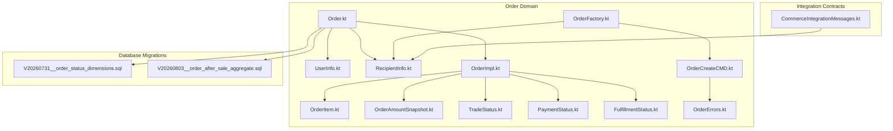
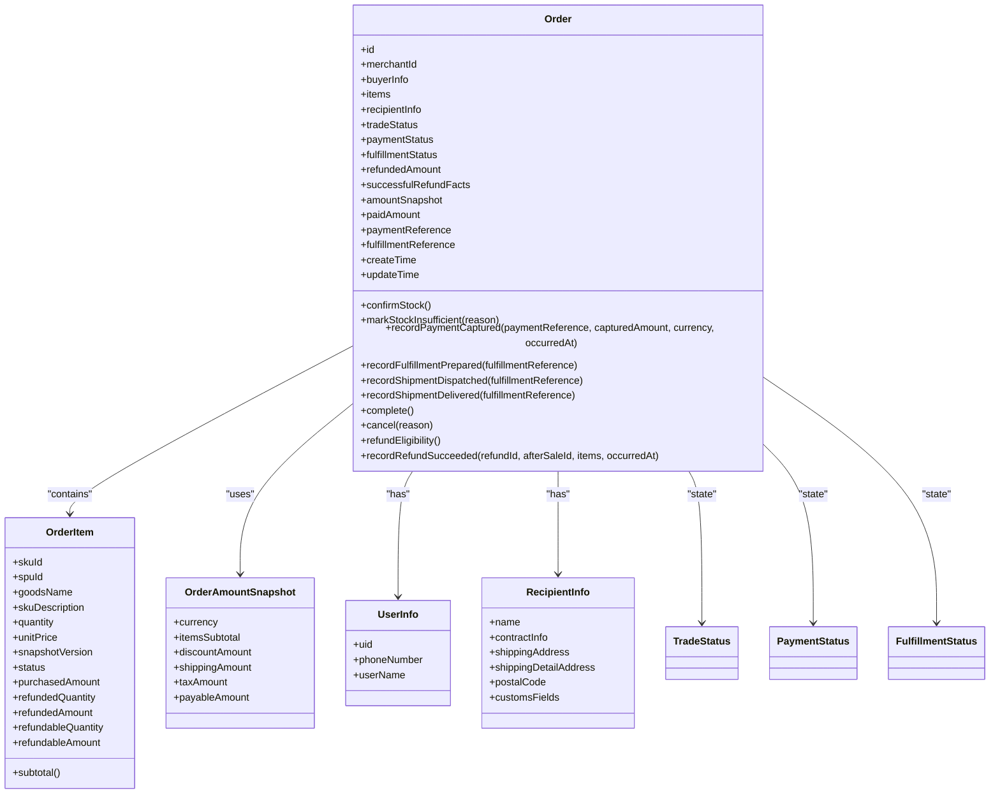
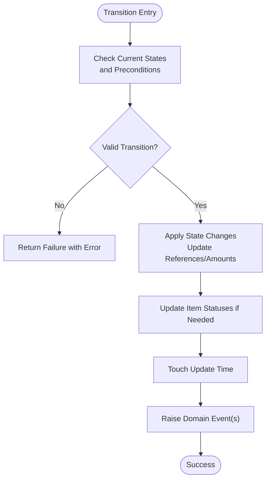
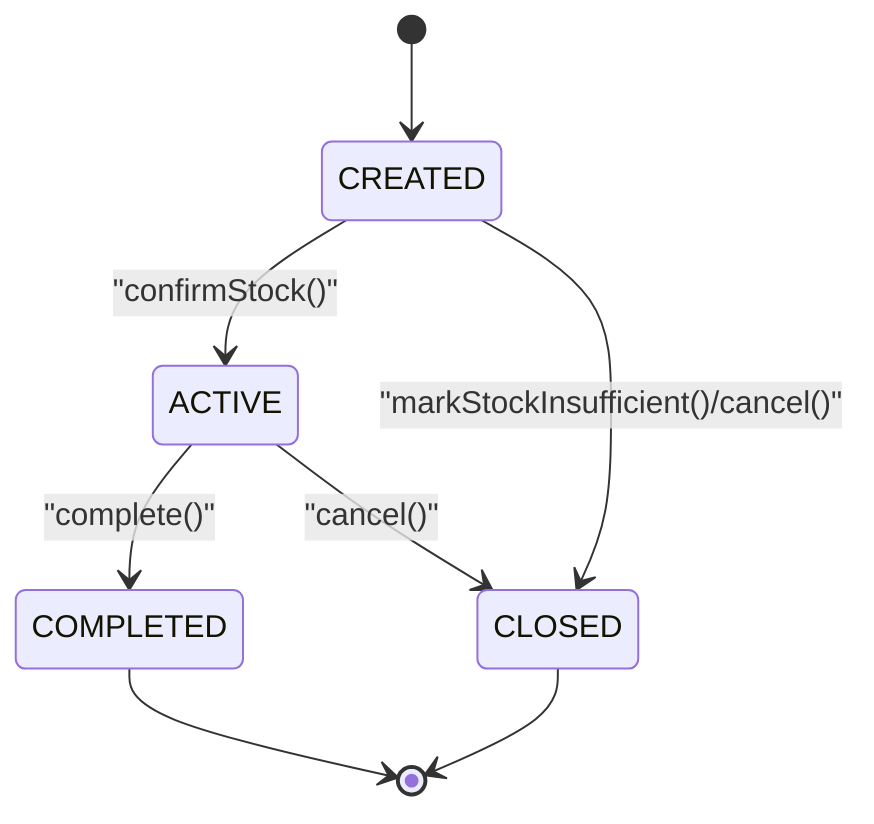
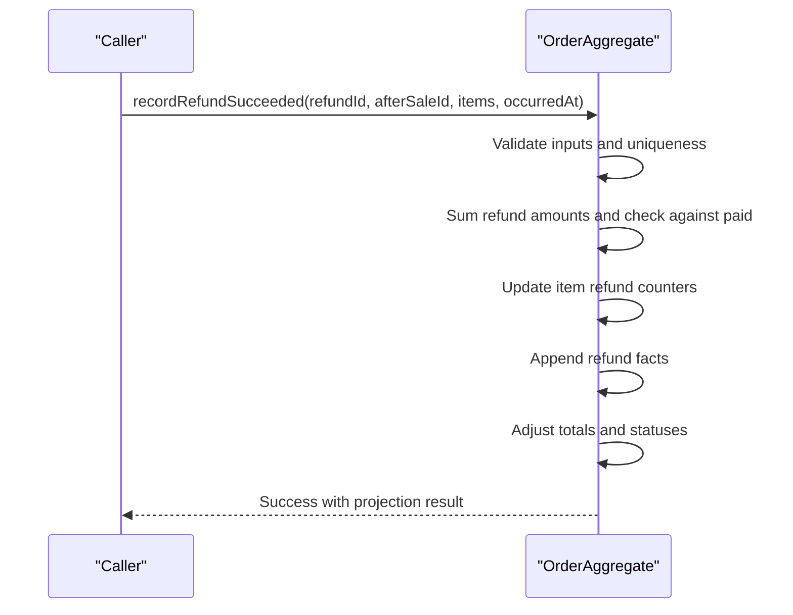
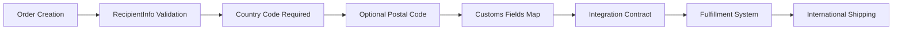
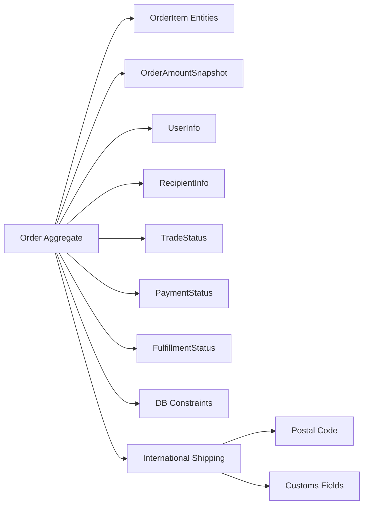

# Order Domain Model

<cite>
**Referenced Files in This Document**
- [Order.kt](file://j-store-order-domain/src/main/kotlin/com/jstore/order/domain/order/Order.kt)
- [OrderImpl.kt](file://j-store-order-domain/src/main/kotlin/com/jstore/order/domain/order/OrderImpl.kt)
- [OrderItem.kt](file://j-store-order-domain/src/main/kotlin/com/jstore/order/domain/order/OrderItem.kt)
- [OrderAmountSnapshot.kt](file://j-store-order-domain/src/main/kotlin/com/jstore/order/domain/order/OrderAmountSnapshot.kt)
- [UserInfo.kt](file://j-store-order-domain/src/main/kotlin/com/jstore/order/domain/order/UserInfo.kt)
- [RecipientInfo.kt](file://j-store-order-domain/src/main/kotlin/com/jstore/order/domain/order/RecipientInfo.kt)
- [OrderErrors.kt](file://j-store-order-domain/src/main/kotlin/com/jstore/order/domain/order/OrderErrors.kt)
- [OrderCreateCMD.kt](file://j-store-order-domain/src/main/kotlin/com/jstore/order/domain/order/command/OrderCreateCMD.kt)
- [OrderFactory.kt](file://j-store-order-domain/src/main/kotlin/com/jstore/order/domain/order/OrderFactory.kt)
- [CommerceIntegrationMessages.kt](file://j-store-integration-contracts/src/main/kotlin/com/jstore/contracts/commerce/CommerceIntegrationMessages.kt)
- [TradeStatus.kt](file://j-store-order-domain/src/main/kotlin/com/jstore/order/domain/order/TradeStatus.kt)
- [PaymentStatus.kt](file://j-store-order-domain/src/main/kotlin/com/jstore/order/domain/order/PaymentStatus.kt)
- [FulfillmentStatus.kt](file://j-store-order-domain/src/main/kotlin/com/jstore/order/domain/order/FulfillmentStatus.kt)
- [V20260731__order_status_dimensions.sql](file://j-store-boot/src/main/resources/db/migration/V20260731__order_status_dimensions.sql)
- [V20260803__order_after_sale_aggregate.sql](file://j-store-boot/src/main/resources/db/migration/V20260803__order_after_sale_aggregate.sql)
</cite>

## Update Summary
**Changes Made**
- Enhanced RecipientInfo with international shipping support including postalCode field for postal codes and customsFields Map structure for country-specific customs declaration data
- Strengthened country code validation with mandatory requirements and COUNTRY_CODE_BLANK validation error
- Updated integration contracts to support international shipping requirements (CPF for Brazil, IOSS for EU, PCCC for China)
- Added comprehensive validation for recipient information in order creation process

## Table of Contents
1. Introduction
2. Project Structure
3. Core Components
4. Architecture Overview
5. Detailed Component Analysis
6. Dependency Analysis
7. Performance Considerations
8. Troubleshooting Guide
9. Conclusion

## Introduction
This document explains the Order domain model with a focus on the Order aggregate root and its multi-dimensional status tracking: tradeStatus, paymentStatus, fulfillmentStatus, and refund tracking. It documents the OrderItem structure, amount snapshots, and value objects such as UserInfo and RecipientInfo. The guide covers business invariants enforced by the domain model, examples of order creation, item management, and amount calculations, and clarifies how the snapshot mechanism preserves historical pricing data. **Updated** Enhanced recipient information now supports international shipping requirements with postal codes and country-specific customs declaration fields.

## Project Structure
The Order domain resides in the order module's domain layer. Key files include the Order aggregate interface and implementation, OrderItem entity, amount snapshot, and value objects for user and recipient information. Status enums define the three orthogonal dimensions of order state. Database migrations enforce schema constraints aligned with these statuses and add refund-related fields. **Updated** RecipientInfo now includes international shipping capabilities with postal codes and customs fields for cross-border transactions.

**Diagram sources**
- [Order.kt](file://j-store-order-domain/src/main/kotlin/com/jstore/order/domain/order/Order.kt)
- [OrderImpl.kt](file://j-store-order-domain/src/main/kotlin/com/jstore/order/domain/order/OrderImpl.kt)
- [OrderItem.kt](file://j-store-order-domain/src/main/kotlin/com/jstore/order/domain/order/OrderItem.kt)
- [OrderAmountSnapshot.kt](file://j-store-order-domain/src/main/kotlin/com/jstore/order/domain/order/OrderAmountSnapshot.kt)
- [UserInfo.kt](file://j-store-order-domain/src/main/kotlin/com/jstore/order/domain/order/UserInfo.kt)
- [RecipientInfo.kt](file://j-store-order-domain/src/main/kotlin/com/jstore/order/domain/order/RecipientInfo.kt)
- [OrderErrors.kt](file://j-store-order-domain/src/main/kotlin/com/jstore/order/domain/order/OrderErrors.kt)
- [OrderCreateCMD.kt](file://j-store-order-domain/src/main/kotlin/com/jstore/order/domain/order/command/OrderCreateCMD.kt)
- [OrderFactory.kt](file://j-store-order-domain/src/main/kotlin/com/jstore/order/domain/order/OrderFactory.kt)
- [CommerceIntegrationMessages.kt](file://j-store-integration-contracts/src/main/kotlin/com/jstore/contracts/commerce/CommerceIntegrationMessages.kt)
- [TradeStatus.kt](file://j-store-order-domain/src/main/kotlin/com/jstore/order/domain/order/TradeStatus.kt)
- [PaymentStatus.kt](file://j-store-order-domain/src/main/kotlin/com/jstore/order/domain/order/PaymentStatus.kt)
- [FulfillmentStatus.kt](file://j-store-order-domain/src/main/kotlin/com/jstore/order/domain/order/FulfillmentStatus.kt)
- [V20260731__order_status_dimensions.sql](file://j-store-boot/src/main/resources/db/migration/V20260731__order_status_dimensions.sql)
- [V20260803__order_after_sale_aggregate.sql](file://j-store-boot/src/main/resources/db/migration/V20260803__order_after_sale_aggregate.sql)

**Section sources**
- [Order.kt](file://j-store-order-domain/src/main/kotlin/com/jstore/order/domain/order/Order.kt)
- [OrderImpl.kt](file://j-store-order-domain/src/main/kotlin/com/jstore/order/domain/order/OrderImpl.kt)
- [OrderItem.kt](file://j-store-order-domain/src/main/kotlin/com/jstore/order/domain/order/OrderItem.kt)
- [OrderAmountSnapshot.kt](file://j-store-order-domain/src/main/kotlin/com/jstore/order/domain/order/OrderAmountSnapshot.kt)
- [UserInfo.kt](file://j-store-order-domain/src/main/kotlin/com/jstore/order/domain/order/UserInfo.kt)
- [RecipientInfo.kt](file://j-store-order-domain/src/main/kotlin/com/jstore/order/domain/order/RecipientInfo.kt)
- [OrderErrors.kt](file://j-store-order-domain/src/main/kotlin/com/jstore/order/domain/order/OrderErrors.kt)
- [OrderCreateCMD.kt](file://j-store-order-domain/src/main/kotlin/com/jstore/order/domain/order/command/OrderCreateCMD.kt)
- [OrderFactory.kt](file://j-store-order-domain/src/main/kotlin/com/jstore/order/domain/order/OrderFactory.kt)
- [CommerceIntegrationMessages.kt](file://j-store-integration-contracts/src/main/kotlin/com/jstore/contracts/commerce/CommerceIntegrationMessages.kt)
- [TradeStatus.kt](file://j-store-order-domain/src/main/kotlin/com/jstore/order/domain/order/TradeStatus.kt)
- [PaymentStatus.kt](file://j-store-order-domain/src/main/kotlin/com/jstore/order/domain/order/PaymentStatus.kt)
- [FulfillmentStatus.kt](file://j-store-order-domain/src/main/kotlin/com/jstore/order/domain/order/FulfillmentStatus.kt)
- [V20260731__order_status_dimensions.sql](file://j-store-boot/src/main/resources/db/migration/V20260731__order_status_dimensions.sql)
- [V20260803__order_after_sale_aggregate.sql](file://j-store-boot/src/main/resources/db/migration/V20260803__order_after_sale_aggregate.sql)

## Core Components
- Order aggregate root: Defines the lifecycle methods and read-only views for multi-dimensional statuses (trade, payment, fulfillment), amount snapshots, paid/refunded amounts, and references to payment and fulfillment aggregates.
- OrderItem: Represents line items with product identifiers, quantities, unit price, snapshot version, status, and computed amounts for purchased, refunded, and refundable values.
- OrderAmountSnapshot: Immutable snapshot capturing currency and components (itemsSubtotal, discountAmount, shippingAmount, taxAmount, payableAmount) at order creation time.
- Value objects: UserInfo captures buyer identity; **Updated** RecipientInfo now includes international shipping support with postalCode for postal codes and customsFields Map structure for country-specific customs declaration data (CPF for Brazil, IOSS for EU, PCCC for China).
- Status enums: TradeStatus, PaymentStatus, FulfillmentStatus define orthogonal states that evolve independently but are coordinated by the aggregate.

Key responsibilities:
- Enforce invariants during transitions (e.g., payment reference uniqueness, amount consistency).
- Maintain historical pricing via snapshots.
- Track partial refunds and ensure totals never exceed paid amounts.
- **Updated** Validate international shipping requirements including mandatory country codes and optional postal codes.

**Section sources**
- [Order.kt](file://j-store-order-domain/src/main/kotlin/com/jstore/order/domain/order/Order.kt)
- [OrderImpl.kt](file://j-store-order-domain/src/main/kotlin/com/jstore/order/domain/order/OrderImpl.kt)
- [OrderItem.kt](file://j-store-order-domain/src/main/kotlin/com/jstore/order/domain/order/OrderItem.kt)
- [OrderAmountSnapshot.kt](file://j-store-order-domain/src/main/kotlin/com/jstore/order/domain/order/OrderAmountSnapshot.kt)
- [UserInfo.kt](file://j-store-order-domain/src/main/kotlin/com/jstore/order/domain/order/UserInfo.kt)
- [RecipientInfo.kt](file://j-store-order-domain/src/main/kotlin/com/jstore/order/domain/order/RecipientInfo.kt)
- [OrderErrors.kt](file://j-store-order-domain/src/main/kotlin/com/jstore/order/domain/order/OrderErrors.kt)
- [OrderCreateCMD.kt](file://j-store-order-domain/src/main/kotlin/com/jstore/order/domain/order/command/OrderCreateCMD.kt)
- [TradeStatus.kt](file://j-store-order-domain/src/main/kotlin/com/jstore/order/domain/order/TradeStatus.kt)
- [PaymentStatus.kt](file://j-store-order-domain/src/main/kotlin/com/jstore/order/domain/order/PaymentStatus.kt)
- [FulfillmentStatus.kt](file://j-store-order-domain/src/main/kotlin/com/jstore/order/domain/order/FulfillmentStatus.kt)

## Architecture Overview
The Order aggregate coordinates three independent status dimensions and integrates with external contexts through events and references. Amounts are frozen at creation via snapshots, while paid and refunded amounts evolve over time. Refund facts record successful refunds per item, enabling accurate projections. **Updated** International shipping support is integrated through enhanced recipient information with postal codes and customs declaration fields that flow through the entire order lifecycle from creation to fulfillment.

**Diagram sources**
- [Order.kt](file://j-store-order-domain/src/main/kotlin/com/jstore/order/domain/order/Order.kt)
- [OrderImpl.kt](file://j-store-order-domain/src/main/kotlin/com/jstore/order/domain/order/OrderImpl.kt)
- [OrderItem.kt](file://j-store-order-domain/src/main/kotlin/com/jstore/order/domain/order/OrderItem.kt)
- [OrderAmountSnapshot.kt](file://j-store-order-domain/src/main/kotlin/com/jstore/order/domain/order/OrderAmountSnapshot.kt)
- [UserInfo.kt](file://j-store-order-domain/src/main/kotlin/com/jstore/order/domain/order/UserInfo.kt)
- [RecipientInfo.kt](file://j-store-order-domain/src/main/kotlin/com/jstore/order/domain/order/RecipientInfo.kt)
- [TradeStatus.kt](file://j-store-order-domain/src/main/kotlin/com/jstore/order/domain/order/TradeStatus.kt)
- [PaymentStatus.kt](file://j-store-order-domain/src/main/kotlin/com/jstore/order/domain/order/PaymentStatus.kt)
- [FulfillmentStatus.kt](file://j-store-order-domain/src/main/kotlin/com/jstore/order/domain/order/FulfillmentStatus.kt)

## Detailed Component Analysis

### Order Aggregate Root
Responsibilities:
- Lifecycle transitions for stock confirmation, cancellation, payment capture, fulfillment milestones, completion, and refund projection updates.
- Maintains immutable snapshots of amounts and evolving counters for paid and refunded amounts.
- Validates cross-cutting invariants (e.g., payment reference uniqueness, currency match, amount equality).

Key behaviors:
- confirmStock: Moves from CREATED to ACTIVE when unpaid.
- markStockInsufficient: Closes order and cancels all items.
- recordPaymentCaptured: Records full capture only when active and unpaid; validates currency and amount against snapshot.
- Fulfillment recording: Prepares, dispatches, delivers with idempotency checks and item status updates.
- complete: Allowed when delivered and paid or partially refunded.
- cancel: Only when unpaid and in early trade states.
- refundEligibility: Projects eligible items and amounts based on current state and item-level refundability.
- recordRefundSucceeded: Applies per-item refund facts, updates totals, and adjusts payment/trade statuses accordingly.

Invariants enforced:
- Items subtotal equals sum of purchased amounts.
- Refunded amount equals sum of item refunded amounts and cannot exceed paid amount.
- Paid amount cannot exceed payable amount from snapshot.
- Payment reference is unique and non-blank upon capture.
- Currency must match snapshot currency.

**Diagram sources**
- [OrderImpl.kt](file://j-store-order-domain/src/main/kotlin/com/jstore/order/domain/order/OrderImpl.kt)

**Section sources**
- [OrderImpl.kt](file://j-store-order-domain/src/main/kotlin/com/jstore/order/domain/order/OrderImpl.kt)
- [Order.kt](file://j-store-order-domain/src/main/kotlin/com/jstore/order/domain/order/Order.kt)

### OrderItem Entity
Responsibilities:
- Captures product identity (SKU/SPU), descriptive text, quantity, unit price, and snapshot version.
- Tracks per-item status and computes purchased, refunded, and refundable amounts.
- Provides subtotal calculation based on quantity and unit price.

Constraints:
- Quantity positive; unit price non-negative.
- Refunded quantity and amount bounded by purchased values.
- Refundable values derived from remaining purchased minus refunded.

Usage patterns:
- Updated by Order aggregate during fulfillment and refund operations.
- Exposed as an immutable list view from the aggregate.

**Section sources**
- [OrderItem.kt](file://j-store-order-domain/src/main/kotlin/com/jstore/order/domain/order/OrderItem.kt)
- [OrderImpl.kt](file://j-store-order-domain/src/main/kotlin/com/jstore/order/domain/order/OrderImpl.kt)

### Amount Snapshot
Purpose:
- Freezes pricing components at order creation to preserve historical accuracy regardless of later price changes.

Validation rules:
- Currency must be a valid ISO-4217 code.
- Discount cannot exceed items subtotal.
- Payable amount must equal itemsSubtotal - discountAmount + shippingAmount + taxAmount.

Factory helper:
- Convenience constructor for common cases (e.g., CNY with zero adjustments).

**Section sources**
- [OrderAmountSnapshot.kt](file://j-store-order-domain/src/main/kotlin/com/jstore/order/domain/order/OrderAmountSnapshot.kt)

### Value Objects: UserInfo and RecipientInfo
UserInfo:
- Immutable representation of buyer identity with uid validation.
- Optional phone number and username.

**Updated** RecipientInfo:
- Contains name, contract info, shipping address, and optional detail address.
- Uses standardized geo address type for internationalization support.
- **New**: postalCode field for international shipping requirements (optional, may be null for some countries).
- **New**: customsFields Map structure for country-specific customs declaration data (e.g., CPF for Brazil, IOSS for EU, PCCC for China).
- Enhanced validation ensures mandatory country code requirements with COUNTRY_CODE_BLANK error handling.

**Section sources**
- [UserInfo.kt](file://j-store-order-domain/src/main/kotlin/com/jstore/order/domain/order/UserInfo.kt)
- [RecipientInfo.kt](file://j-store-order-domain/src/main/kotlin/com/jstore/order/domain/order/RecipientInfo.kt)
- [OrderErrors.kt](file://j-store-order-domain/src/main/kotlin/com/jstore/order/domain/order/OrderErrors.kt)
- [OrderCreateCMD.kt](file://j-store-order-domain/src/main/kotlin/com/jstore/order/domain/order/command/OrderCreateCMD.kt)

### Multi-Dimensional Status Tracking
TradeStatus:
- CREATED, ACTIVE, CLOSED, COMPLETED.

PaymentStatus:
- UNPAID, PAID, PARTIALLY_REFUNDED, REFUNDED.

FulfillmentStatus:
- UNFULFILLED, PENDING_SHIPMENT, SHIPPED, DELIVERED.

Schema enforcement:
- Database migrations constrain allowed values and create indexes for querying by status and time.

**Diagram sources**
- [TradeStatus.kt](file://j-store-order-domain/src/main/kotlin/com/jstore/order/domain/order/TradeStatus.kt)
- [OrderImpl.kt](file://j-store-order-domain/src/main/kotlin/com/jstore/order/domain/order/OrderImpl.kt)
- [V20260731__order_status_dimensions.sql](file://j-store-boot/src/main/resources/db/migration/V20260731__order_status_dimensions.sql)

**Section sources**
- [TradeStatus.kt](file://j-store-order-domain/src/main/kotlin/com/jstore/order/domain/order/TradeStatus.kt)
- [PaymentStatus.kt](file://j-store-order-domain/src/main/kotlin/com/jstore/order/domain/order/PaymentStatus.kt)
- [FulfillmentStatus.kt](file://j-store-order-domain/src/main/kotlin/com/jstore/order/domain/order/FulfillmentStatus.kt)
- [V20260731__order_status_dimensions.sql](file://j-store-boot/src/main/resources/db/migration/V20260731__order_status_dimensions.sql)

### Refund Tracking and Facts
- Successful refund facts are recorded per refund operation with order item granularity.
- Totals are updated atomically; payment status transitions to PARTIALLY_REFUNDED or REFUNDED depending on whether total paid has been fully refunded.
- Schema adds columns for total refunded amount and per-item refunded quantity/amount, ensuring integrity constraints.

**Diagram sources**
- [OrderImpl.kt](file://j-store-order-domain/src/main/kotlin/com/jstore/order/domain/order/OrderImpl.kt)
- [V20260803__order_after_sale_aggregate.sql](file://j-store-boot/src/main/resources/db/migration/V20260803__order_after_sale_aggregate.sql)

**Section sources**
- [OrderImpl.kt](file://j-store-order-domain/src/main/kotlin/com/jstore/order/domain/order/OrderImpl.kt)
- [V20260803__order_after_sale_aggregate.sql](file://j-store-boot/src/main/resources/db/migration/V20260803__order_after_sale_aggregate.sql)

### International Shipping Support
**New Section** The Order domain now supports international shipping requirements through enhanced recipient information:

Postal Code Support:
- Optional postalCode field allows for country-specific postal code requirements
- Some countries may not require postal codes, making this field nullable
- Integrated throughout the order lifecycle from creation to fulfillment

Customs Declaration Fields:
- customsFields Map structure supports country-specific customs declaration requirements
- Examples include CPF (Brazil), IOSS (European Union), PCCC (China)
- Flexible key-value structure allows for future country-specific requirements
- Passed through integration contracts to fulfillment systems

Validation Requirements:
- Country code validation strengthened with mandatory requirements
- COUNTRY_CODE_BLANK error provides clear feedback for missing country information
- Integration with GeoAddressService ensures valid geographic codes

**Diagram sources**
- [RecipientInfo.kt](file://j-store-order-domain/src/main/kotlin/com/jstore/order/domain/order/RecipientInfo.kt)
- [OrderCreateCMD.kt](file://j-store-order-domain/src/main/kotlin/com/jstore/order/domain/order/command/OrderCreateCMD.kt)
- [CommerceIntegrationMessages.kt](file://j-store-integration-contracts/src/main/kotlin/com/jstore/contracts/commerce/CommerceIntegrationMessages.kt)

**Section sources**
- [RecipientInfo.kt](file://j-store-order-domain/src/main/kotlin/com/jstore/order/domain/order/RecipientInfo.kt)
- [OrderCreateCMD.kt](file://j-store-order-domain/src/main/kotlin/com/jstore/order/domain/order/command/OrderCreateCMD.kt)
- [CommerceIntegrationMessages.kt](file://j-store-integration-contracts/src/main/kotlin/com/jstore/contracts/commerce/CommerceIntegrationMessages.kt)
- [OrderErrors.kt](file://j-store-order-domain/src/main/kotlin/com/jstore/order/domain/order/OrderErrors.kt)

## Dependency Analysis
Coupling and cohesion:
- Order aggregate encapsulates item management and status transitions, maintaining high cohesion around order lifecycle.
- OrderItem depends only on primitive/value types and status enums, keeping it lightweight and focused.
- Amount snapshot is immutable and validated at construction, reducing downstream complexity.

External dependencies:
- Price and PhoneNumber types from common modules provide consistent numeric and contact representations.
- I18nGeoAddress standardizes address handling across locales.
- **Updated** Integration contracts now support international shipping data structures.

Potential circular dependencies:
- None observed within the order domain; references to other aggregates are via IDs and event-driven integration.

Integration points:
- Events raised by Order aggregate are consumed by application services and translators to coordinate with inventory and payment contexts.
- Database schema enforces constraints aligned with domain invariants.
- **Updated** Commerce integration messages now include postal codes and customs fields for international shipping.

**Diagram sources**
- [Order.kt](file://j-store-order-domain/src/main/kotlin/com/jstore/order/domain/order/Order.kt)
- [OrderImpl.kt](file://j-store-order-domain/src/main/kotlin/com/jstore/order/domain/order/OrderImpl.kt)
- [OrderItem.kt](file://j-store-order-domain/src/main/kotlin/com/jstore/order/domain/order/OrderItem.kt)
- [OrderAmountSnapshot.kt](file://j-store-order-domain/src/main/kotlin/com/jstore/order/domain/order/OrderAmountSnapshot.kt)
- [UserInfo.kt](file://j-store-order-domain/src/main/kotlin/com/jstore/order/domain/order/UserInfo.kt)
- [RecipientInfo.kt](file://j-store-order-domain/src/main/kotlin/com/jstore/order/domain/order/RecipientInfo.kt)
- [TradeStatus.kt](file://j-store-order-domain/src/main/kotlin/com/jstore/order/domain/order/TradeStatus.kt)
- [PaymentStatus.kt](file://j-store-order-domain/src/main/kotlin/com/jstore/order/domain/order/PaymentStatus.kt)
- [FulfillmentStatus.kt](file://j-store-order-domain/src/main/kotlin/com/jstore/order/domain/order/FulfillmentStatus.kt)
- [V20260731__order_status_dimensions.sql](file://j-store-boot/src/main/resources/db/migration/V20260731__order_status_dimensions.sql)

**Section sources**
- [Order.kt](file://j-store-order-domain/src/main/kotlin/com/jstore/order/domain/order/Order.kt)
- [OrderImpl.kt](file://j-store-order-domain/src/main/kotlin/com/jstore/order/domain/order/OrderImpl.kt)
- [OrderItem.kt](file://j-store-order-domain/src/main/kotlin/com/jstore/order/domain/order/OrderItem.kt)
- [OrderAmountSnapshot.kt](file://j-store-order-domain/src/main/kotlin/com/jstore/order/domain/order/OrderAmountSnapshot.kt)
- [UserInfo.kt](file://j-store-order-domain/src/main/kotlin/com/jstore/order/domain/order/UserInfo.kt)
- [RecipientInfo.kt](file://j-store-order-domain/src/main/kotlin/com/jstore/order/domain/order/RecipientInfo.kt)
- [TradeStatus.kt](file://j-store-order-domain/src/main/kotlin/com/jstore/order/domain/order/TradeStatus.kt)
- [PaymentStatus.kt](file://j-store-order-domain/src/main/kotlin/com/jstore/order/domain/order/PaymentStatus.kt)
- [FulfillmentStatus.kt](file://j-store-order-domain/src/main/kotlin/com/jstore/order/domain/order/FulfillmentStatus.kt)
- [V20260731__order_status_dimensions.sql](file://j-store-boot/src/main/resources/db/migration/V20260731__order_status_dimensions.sql)

## Performance Considerations
- Idempotent operations: Fulfillment recording and payment capture include idempotency checks to avoid redundant work and ensure safe retries.
- Minimal object churn: Amount snapshot is immutable; updates adjust counters rather than reconstructing large structures.
- Efficient queries: Indexed status columns enable fast filtering by trade, payment, fulfillment, and after-sale statuses.
- Batch-friendly design: Per-item refund facts allow granular updates without scanning entire order history.
- **Updated** International shipping data structures are optimized with nullable fields and empty map defaults to minimize memory overhead.

[No sources needed since this section provides general guidance]

## Troubleshooting Guide
Common issues and resolutions:
- Illegal state transitions: Ensure preconditions (current statuses, unpaid checks) are met before invoking lifecycle methods.
- Payment reference conflicts: Verify uniqueness and blankness; do not re-record the same reference.
- Currency mismatch: Confirm captured currency matches snapshot currency.
- Amount inconsistencies: Validate that captured amount equals payable amount and that refund totals do not exceed paid amount.
- Refund eligibility errors: Check order and item statuses; ensure requested quantities and amounts are within refundable limits.
- **Updated** International shipping validation errors: Ensure country codes are provided and valid; verify postal codes where required by destination country.

Operational checks:
- Inspect database constraints for status enums and refund-related columns.
- Review update timestamps to detect unexpected mutations.
- **Updated** Validate international shipping data in logs and error messages for proper country code and customs field handling.

**Section sources**
- [OrderImpl.kt](file://j-store-order-domain/src/main/kotlin/com/jstore/order/domain/order/OrderImpl.kt)
- [OrderErrors.kt](file://j-store-order-domain/src/main/kotlin/com/jstore/order/domain/order/OrderErrors.kt)
- [V20260731__order_status_dimensions.sql](file://j-store-boot/src/main/resources/db/migration/V20260731__order_status_dimensions.sql)
- [V20260803__order_after_sale_aggregate.sql](file://j-store-boot/src/main/resources/db/migration/V20260803__order_after_sale_aggregate.sql)

## Conclusion
The Order domain model cleanly separates concerns across three orthogonal status dimensions and enforces strong invariants through both code and schema. The snapshot mechanism ensures historical pricing fidelity, while refund facts provide precise accounting for partial and full refunds. **Updated** Enhanced international shipping support with postal codes and customs declaration fields enables global commerce capabilities while maintaining data integrity and validation. Together, these elements form a robust foundation for order lifecycle management, supporting reliable integrations with payment, fulfillment, and after-sale processes across international markets.

[No sources needed since this section summarizes without analyzing specific files]