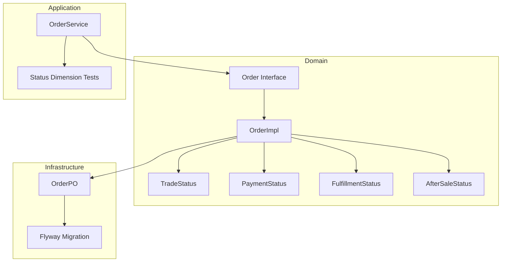
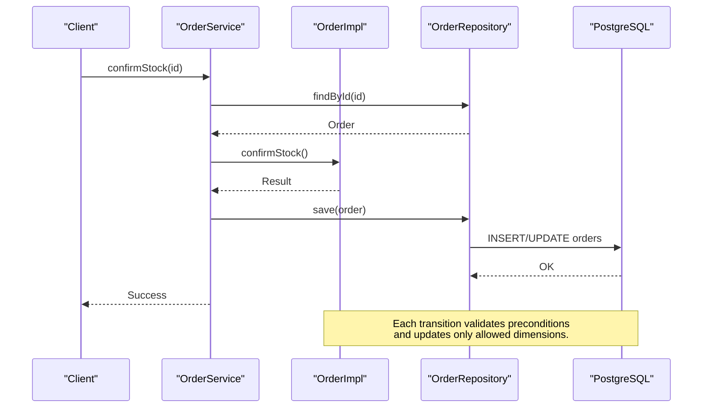
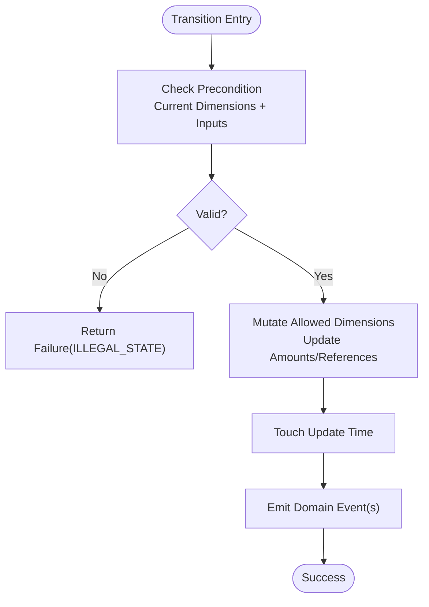
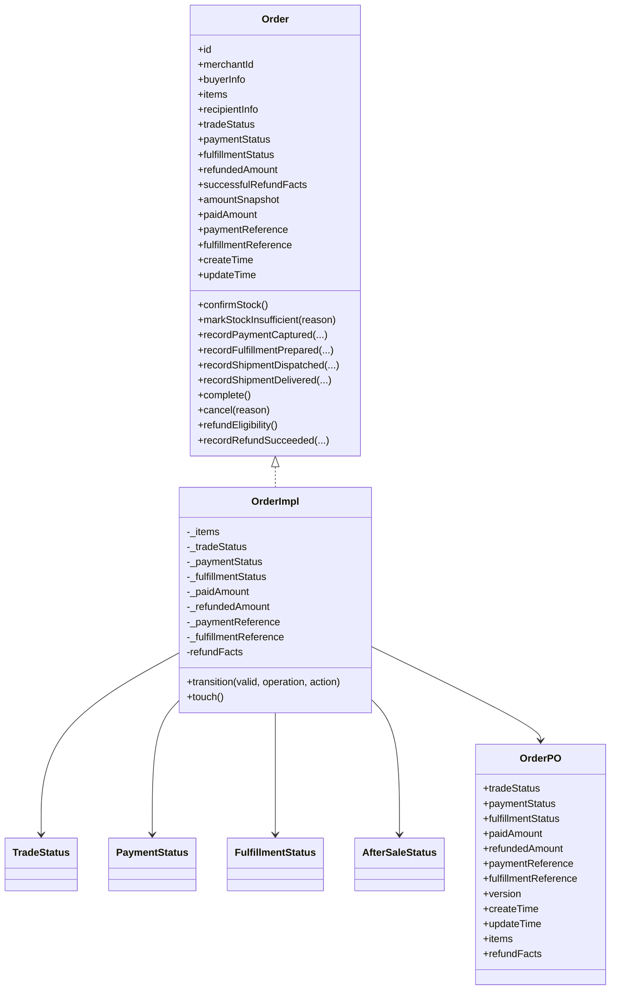

# Order Lifecycle & Status Management

<cite>
**Referenced Files in This Document**
- [Order.kt](file://j-store-order-domain/src/main/kotlin/com/jstore/order/domain/order/Order.kt)
- [OrderImpl.kt](file://j-store-order-domain/src/main/kotlin/com/jstore/order/domain/order/OrderImpl.kt)
- [TradeStatus.kt](file://j-store-order-domain/src/main/kotlin/com/jstore/order/domain/order/TradeStatus.kt)
- [PaymentStatus.kt](file://j-store-order-domain/src/main/kotlin/com/jstore/order/domain/order/PaymentStatus.kt)
- [FulfillmentStatus.kt](file://j-store-order-domain/src/main/kotlin/com/jstore/order/domain/order/FulfillmentStatus.kt)
- [AfterSaleStatus.kt](file://j-store-order-domain/src/main/kotlin/com/jstore/order/domain/aftersale/AfterSaleStatus.kt)
- [OrderPO.kt](file://j-store-order-infrastructure/src/main/kotlin/com/jstore/order/domain/order/persistence/OrderPO.kt)
- [V20260731__order_status_dimensions.sql](file://j-store-boot/src/main/resources/db/migration/V20260731__order_status_dimensions.sql)
- [OrderServiceStatusDimensionsTest.kt](file://j-store-order-application/src/test/kotlin/com/jstore/order/service/OrderServiceStatusDimensionsTest.kt)
- [design.md](file://docs/spec/order-status-dimensions/design.md)
</cite>

## Table of Contents
1. Introduction
2. Project Structure
3. Core Components
4. Architecture Overview
5. Detailed Component Analysis
6. Dependency Analysis
7. Performance Considerations
8. Troubleshooting Guide
9. Conclusion

## Introduction
This document explains the order lifecycle and status management across four parallel, independent dimensions: TradeStatus, PaymentStatus, FulfillmentStatus, and AfterSaleStatus. It details state transitions per dimension, their interactions, database schema design with separate columns for each dimension, concrete progression examples from creation to completion or cancellation, and guidance on concurrent updates and consistency guarantees.

## Project Structure
The order domain is implemented as a DDD aggregate with clear separation between domain, application, infrastructure, and boot layers. The core status model lives in the order domain; persistence mapping and migrations live in infrastructure and boot modules. Tests validate behavior and API contracts.

**Diagram sources**
- [Order.kt](file://j-store-order-domain/src/main/kotlin/com/jstore/order/domain/order/Order.kt)
- [OrderImpl.kt](file://j-store-order-domain/src/main/kotlin/com/jstore/order/domain/order/OrderImpl.kt)
- [TradeStatus.kt](file://j-store-order-domain/src/main/kotlin/com/jstore/order/domain/order/TradeStatus.kt)
- [PaymentStatus.kt](file://j-store-order-domain/src/main/kotlin/com/jstore/order/domain/order/PaymentStatus.kt)
- [FulfillmentStatus.kt](file://j-store-order-domain/src/main/kotlin/com/jstore/order/domain/order/FulfillmentStatus.kt)
- [AfterSaleStatus.kt](file://j-store-order-domain/src/main/kotlin/com/jstore/order/domain/aftersale/AfterSaleStatus.kt)
- [OrderPO.kt](file://j-store-order-infrastructure/src/main/kotlin/com/jstore/order/domain/order/persistence/OrderPO.kt)
- [V20260731__order_status_dimensions.sql](file://j-store-boot/src/main/resources/db/migration/V20260731__order_status_dimensions.sql)

**Section sources**
- [Order.kt](file://j-store-order-domain/src/main/kotlin/com/jstore/order/domain/order/Order.kt)
- [OrderImpl.kt](file://j-store-order-domain/src/main/kotlin/com/jstore/order/domain/order/OrderImpl.kt)
- [OrderPO.kt](file://j-store-order-infrastructure/src/main/kotlin/com/jstore/order/domain/order/persistence/OrderPO.kt)
- [V20260731__order_status_dimensions.sql](file://j-store-boot/src/main/resources/db/migration/V20260731__order_status_dimensions.sql)

## Core Components
- Four parallel status dimensions:
  - TradeStatus: CREATED → ACTIVE → CLOSED / COMPLETED
  - PaymentStatus: UNPAID → PAID → PARTIALLY_REFUNDED / REFUNDED
  - FulfillmentStatus: UNFULFILLED → PENDING_SHIPMENT → SHIPPED → DELIVERED
  - AfterSaleStatus: REQUESTED → RETURN_REQUIRED → REFUND_PENDING → REFUND_FAILED → COMPLETED / REJECTED / CANCELLED (per after-sale process)
- Order interface exposes operations that mutate these dimensions independently while preserving invariants.
- OrderImpl implements transitions with strict preconditions and side effects, ensuring atomicity within a single transaction boundary managed by the repository layer.
- Persistence maps each dimension to its own column with constraints and indexes.

Key responsibilities:
- Domain: enforce business rules, maintain consistent state combinations, emit domain events.
- Application: orchestrate use cases, persist changes, publish events.
- Infrastructure: map domain to persistent entities and manage migrations.

**Section sources**
- [Order.kt](file://j-store-order-domain/src/main/kotlin/com/jstore/order/domain/order/Order.kt)
- [OrderImpl.kt](file://j-store-order-domain/src/main/kotlin/com/jstore/order/domain/order/OrderImpl.kt)
- [TradeStatus.kt](file://j-store-order-domain/src/main/kotlin/com/jstore/order/domain/order/TradeStatus.kt)
- [PaymentStatus.kt](file://j-store-order-domain/src/main/kotlin/com/jstore/order/domain/order/PaymentStatus.kt)
- [FulfillmentStatus.kt](file://j-store-order-domain/src/main/kotlin/com/jstore/order/domain/order/FulfillmentStatus.kt)
- [AfterSaleStatus.kt](file://j-store-order-domain/src/main/kotlin/com/jstore/order/domain/aftersale/AfterSaleStatus.kt)

## Architecture Overview
The order lifecycle flows through well-defined operations that update one or more status dimensions. Each operation validates preconditions, mutates state atomically, and emits domain events. The persistence layer ensures durability and integrity via constraints and indexes.

**Diagram sources**
- [OrderImpl.kt](file://j-store-order-domain/src/main/kotlin/com/jstore/order/domain/order/OrderImpl.kt)
- [OrderPO.kt](file://j-store-order-infrastructure/src/main/kotlin/com/jstore/order/domain/order/persistence/OrderPO.kt)

**Section sources**
- [OrderImpl.kt](file://j-store-order-domain/src/main/kotlin/com/jstore/order/domain/order/OrderImpl.kt)
- [OrderPO.kt](file://j-store-order-infrastructure/src/main/kotlin/com/jstore/order/domain/order/persistence/OrderPO.kt)

## Detailed Component Analysis

### Status Dimensions and Enumerations
- TradeStatus: CREATED, ACTIVE, CLOSED, COMPLETED
- PaymentStatus: UNPAID, PAID, PARTIALLY_REFUNDED, REFUNDED
- FulfillmentStatus: UNFULFILLED, PENDING_SHIPMENT, SHIPPED, DELIVERED
- AfterSaleStatus: REQUESTED, RETURN_REQUIRED, REFUND_PENDING, REFUND_FAILED, COMPLETED, REJECTED, CANCELLED

These enums define the universe of valid values for each dimension. They are persisted as strings and constrained at the database level.

**Section sources**
- [TradeStatus.kt](file://j-store-order-domain/src/main/kotlin/com/jstore/order/domain/order/TradeStatus.kt)
- [PaymentStatus.kt](file://j-store-order-domain/src/main/kotlin/com/jstore/order/domain/order/PaymentStatus.kt)
- [FulfillmentStatus.kt](file://j-store-order-domain/src/main/kotlin/com/jstore/order/domain/order/FulfillmentStatus.kt)
- [AfterSaleStatus.kt](file://j-store-order-domain/src/main/kotlin/com/jstore/order/domain/aftersale/AfterSaleStatus.kt)

### Order Interface and Operations
The Order interface exposes methods that drive lifecycle transitions:
- Stock confirmation and cancellation
- Payment capture recording
- Fulfillment milestones (prepared, dispatched, delivered)
- Completion
- Refund eligibility and successful refund recording

Each method enforces preconditions based on current dimension values and returns a result type indicating success or failure.

**Section sources**
- [Order.kt](file://j-store-order-domain/src/main/kotlin/com/jstore/order/domain/order/Order.kt)

### OrderImpl Transitions and Invariants
OrderImpl implements transitions with explicit preconditions:
- confirmStock: moves TradeStatus from CREATED to ACTIVE when unpaid.
- markStockInsufficient: closes order when stock insufficient during CREATED/ACTIVE unpaid phase.
- recordPaymentCaptured: sets PaymentStatus to PAID and records reference/amount.
- recordFulfillmentPrepared/Dispatched/Delivered: advances FulfillmentStatus sequentially.
- complete: finalizes TradeStatus to COMPLETED when payment and fulfillment allow.
- cancel: closes order in unpaid phase and marks items canceled.
- refundEligibility: computes eligible items and amounts based on paid/refunded facts.
- recordRefundSucceeded: updates refundedAmount, adjusts PaymentStatus to PARTIALLY_REFUNDED or REFUNDED, and may close TradeStatus upon full refund.

Transitions are guarded by inline validation and touch timestamps consistently.

**Diagram sources**
- [OrderImpl.kt](file://j-store-order-domain/src/main/kotlin/com/jstore/order/domain/order/OrderImpl.kt)

**Section sources**
- [OrderImpl.kt](file://j-store-order-domain/src/main/kotlin/com/jstore/order/domain/order/OrderImpl.kt)

### Database Schema Design
The orders table stores each status dimension in its own column:
- trade_status
- payment_status
- fulfillment_status
Additionally, after_sale_status is modeled in the domain; if persisted separately, it would follow the same pattern. The schema includes constraints and indexes per dimension to support queries and ordering by create_time.

Key points:
- Columns are non-null with default initial values.
- CHECK constraints enforce enum values.
- Indexes enable efficient filtering/sorting per dimension.

**Section sources**
- [OrderPO.kt](file://j-store-order-infrastructure/src/main/kotlin/com/jstore/order/domain/order/persistence/OrderPO.kt)
- [V20260731__order_status_dimensions.sql](file://j-store-boot/src/main/resources/db/migration/V20260731__order_status_dimensions.sql)

### State Transition Rules Across Dimensions
- TradeStatus transitions are driven by stock confirmation, cancellation, and completion.
- PaymentStatus transitions occur upon payment capture and refund success.
- FulfillmentStatus transitions occur upon fulfillment milestones.
- AfterSaleStatus evolves through after-sale processes; refund success affects PaymentStatus and potentially TradeStatus.

Cross-dimensional invariants ensure consistency:
- Payment cannot proceed until stock confirmed (ACTIVE).
- Fulfillment requires PAID payment.
- Refunds require PAID or PARTIALLY_REFUNDED payment and appropriate fulfillment states.
- Full refund can close the trade and set payment to REFUNDED.

**Section sources**
- [OrderImpl.kt](file://j-store-order-domain/src/main/kotlin/com/jstore/order/domain/order/OrderImpl.kt)
- [design.md](file://docs/spec/order-status-dimensions/design.md)

### Concrete Progression Examples
- Creation to completion:
  - Created/UNPAID/UNFULFILLED/NONE → Active/UNPAID/UNFULFILLED/NONE (confirmStock)
  - Active/PAID/UNFULFILLED/NONE (recordPaymentCaptured)
  - Active/PAID/PENDING_SHIPMENT/NONE (recordFulfillmentPrepared)
  - Active/PAID/SHIPPED/NONE (recordShipmentDispatched)
  - Active/PAID/DELIVERED/NONE (recordShipmentDelivered)
  - Completed/PAID/DELIVERED/NONE (complete)
- Cancellation:
  - Created/Active with UNPAID → Closed/UNPAID/UNFULFILLED/NONE (cancel or markStockInsufficient)
- Partial refund:
  - Active/PAID/DELIVERED/NONE → request refund → recordRefundSucceeded partially → Active/PARTIALLY_REFUNDED/DELIVERED/NONE
- Full refund:
  - Active/PAID/DELIVERED/NONE → recordRefundSucceeded fully → Closed/REFUNDED/DELIVERED/NONE

**Section sources**
- [OrderImpl.kt](file://j-store-order-domain/src/main/kotlin/com/jstore/order/domain/order/OrderImpl.kt)
- [design.md](file://docs/spec/order-status-dimensions/design.md)

### Concurrent Updates and Consistency Guarantees
- Transaction boundaries: Repository saves aggregate within a transaction; domain methods do not start transactions.
- Atomicity: Each transition validates preconditions before mutating state; failures return without side effects.
- Concurrency: Last-writer-wins applies unless additional mechanisms (e.g., versioning) are introduced; this design does not add optimistic locking here.
- Consistency: Database constraints and domain invariants prevent illegal combinations; event payloads remain stable.

**Section sources**
- [OrderImpl.kt](file://j-store-order-domain/src/main/kotlin/com/jstore/order/domain/order/OrderImpl.kt)
- [OrderPO.kt](file://j-store-order-infrastructure/src/main/kotlin/com/jstore/order/domain/order/persistence/OrderPO.kt)
- [design.md](file://docs/spec/order-status-dimensions/design.md)

## Dependency Analysis
The following diagram shows how components depend on each other for status management:

**Diagram sources**
- [Order.kt](file://j-store-order-domain/src/main/kotlin/com/jstore/order/domain/order/Order.kt)
- [OrderImpl.kt](file://j-store-order-domain/src/main/kotlin/com/jstore/order/domain/order/OrderImpl.kt)
- [TradeStatus.kt](file://j-store-order-domain/src/main/kotlin/com/jstore/order/domain/order/TradeStatus.kt)
- [PaymentStatus.kt](file://j-store-order-domain/src/main/kotlin/com/jstore/order/domain/order/PaymentStatus.kt)
- [FulfillmentStatus.kt](file://j-store-order-domain/src/main/kotlin/com/jstore/order/domain/order/FulfillmentStatus.kt)
- [AfterSaleStatus.kt](file://j-store-order-domain/src/main/kotlin/com/jstore/order/domain/aftersale/AfterSaleStatus.kt)
- [OrderPO.kt](file://j-store-order-infrastructure/src/main/kotlin/com/jstore/order/domain/order/persistence/OrderPO.kt)

**Section sources**
- [Order.kt](file://j-store-order-domain/src/main/kotlin/com/jstore/order/domain/order/Order.kt)
- [OrderImpl.kt](file://j-store-order-domain/src/main/kotlin/com/jstore/order/domain/order/OrderImpl.kt)
- [OrderPO.kt](file://j-store-order-infrastructure/src/main/kotlin/com/jstore/order/domain/order/persistence/OrderPO.kt)

## Performance Considerations
- Indexing: Per-dimension indexes on (status, create_time DESC) support efficient listing and sorting.
- Minimal writes: Each transition updates only necessary fields and timestamps.
- Constraints: Database-level checks reduce invalid state risk and avoid expensive runtime validations.
- Event emission: Events are emitted once per transition, keeping downstream processing predictable.

[No sources needed since this section provides general guidance]

## Troubleshooting Guide
Common issues and resolutions:
- Illegal state errors: Occur when preconditions are not met; verify current dimension values and input parameters.
- Payment reference conflicts: Ensure unique payment references per order; duplicate attempts are rejected.
- Fulfillment fact invalid: Validate fulfillment reference matches expected sequence and current fulfillment status.
- Refund projection invalid: Check refundable quantities/amounts and cumulative refunds against paid amount.

Diagnostic steps:
- Inspect domain method preconditions and error messages.
- Verify database constraints and indexes.
- Review test coverage for status transitions and edge cases.

**Section sources**
- [OrderImpl.kt](file://j-store-order-domain/src/main/kotlin/com/jstore/order/domain/order/OrderImpl.kt)
- [OrderServiceStatusDimensionsTest.kt](file://j-store-order-application/src/test/kotlin/com/jstore/order/service/OrderServiceStatusDimensionsTest.kt)

## Conclusion
The order lifecycle is modeled with four independent status dimensions that evolve according to well-defined transitions and invariants. The design ensures data integrity through domain validation, database constraints, and indexed columns. Clear progression paths exist for completion and cancellation, with robust handling for partial and full refunds. Concurrent updates rely on existing transactional semantics, and consistency is maintained via strict preconditions and immutable event payloads.

[No sources needed since this section summarizes without analyzing specific files]