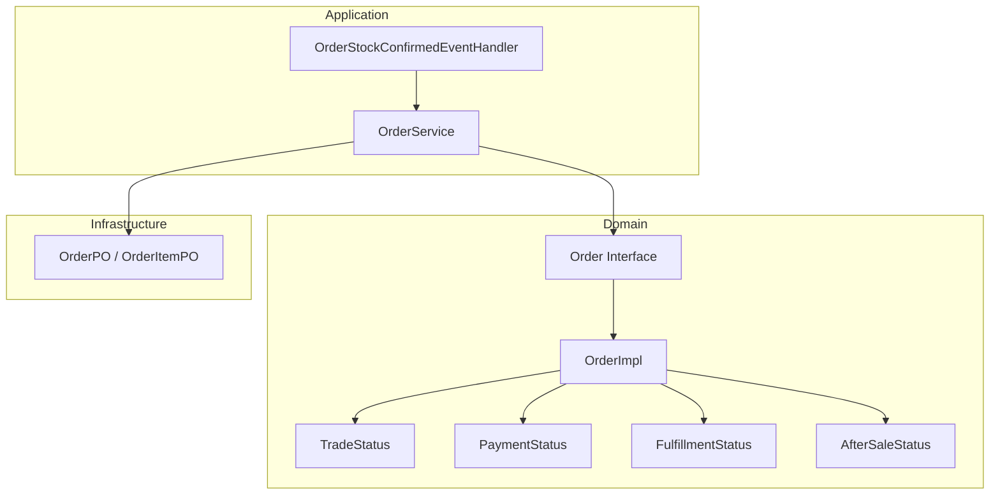
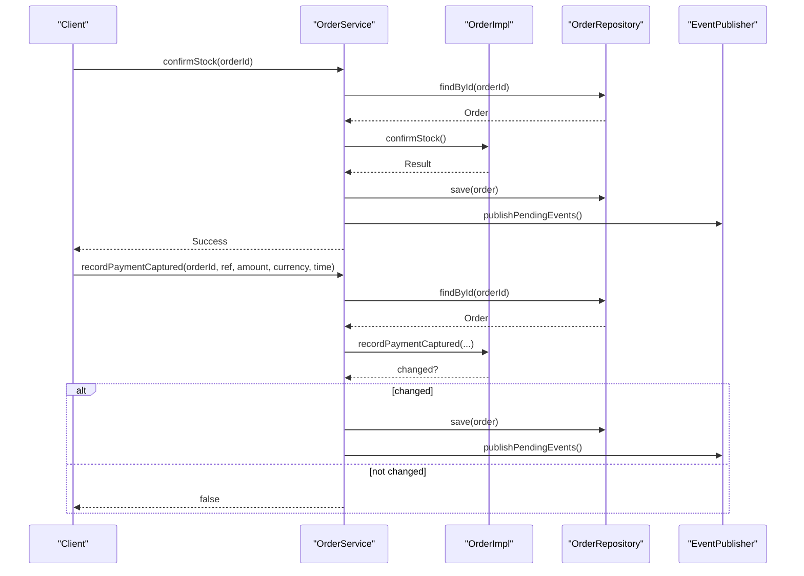
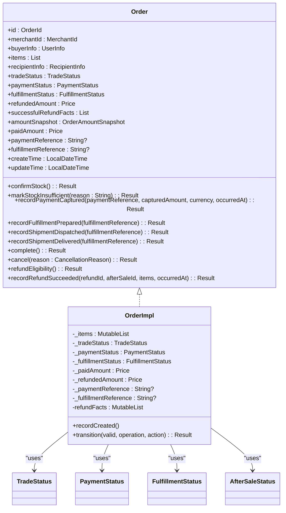
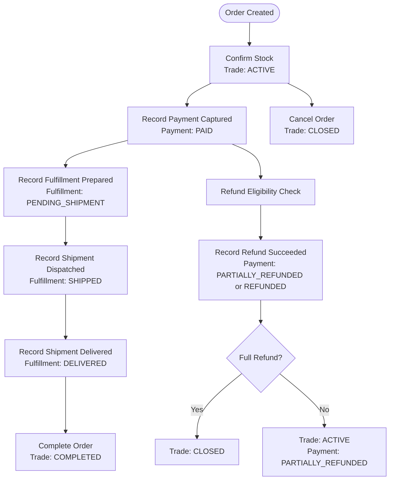
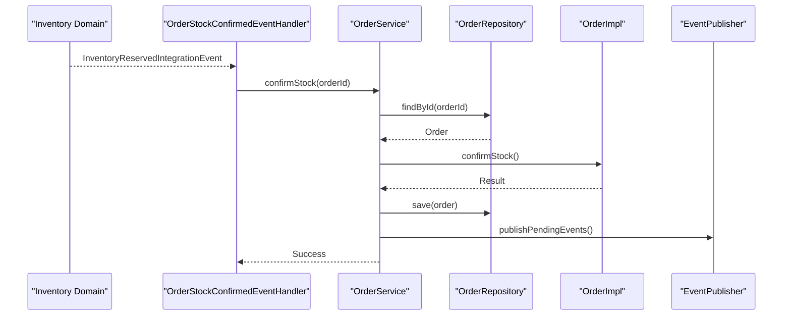
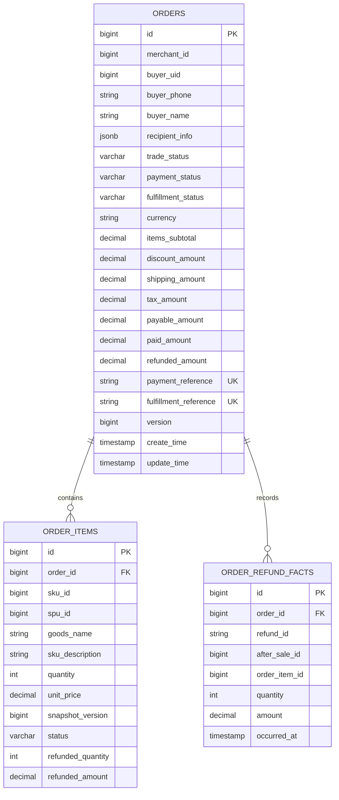
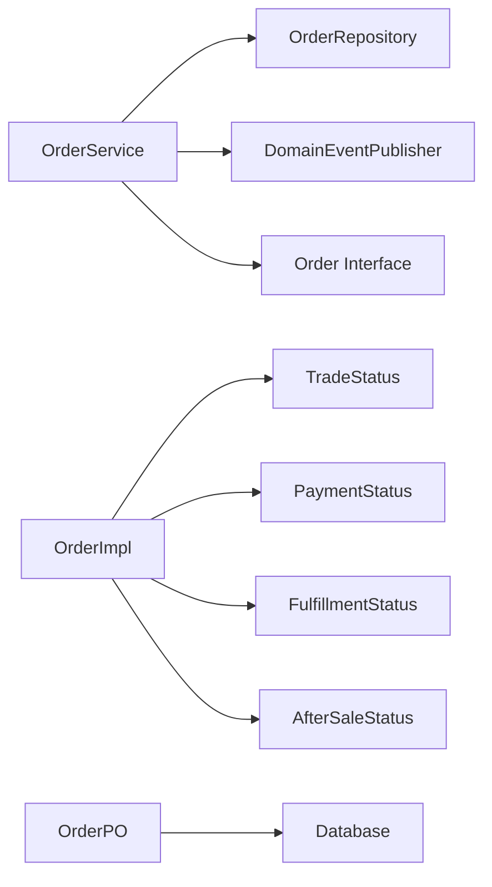

# Order Management Module

<cite>
**Referenced Files in This Document**
- [Order.kt](file://j-store-order-domain/src/main/kotlin/com/jstore/order/domain/order/Order.kt)
- [OrderImpl.kt](file://j-store-order-domain/src/main/kotlin/com/jstore/order/domain/order/OrderImpl.kt)
- [TradeStatus.kt](file://j-store-order-domain/src/main/kotlin/com/jstore/order/domain/order/TradeStatus.kt)
- [PaymentStatus.kt](file://j-store-order-domain/src/main/kotlin/com/jstore/order/domain/order/PaymentStatus.kt)
- [FulfillmentStatus.kt](file://j-store-order-domain/src/main/kotlin/com/jstore/order/domain/order/FulfillmentStatus.kt)
- [AfterSaleStatus.kt](file://j-store-order-domain/src/main/kotlin/com/jstore/order/domain/aftersale/AfterSaleStatus.kt)
- [OrderService.kt](file://j-store-order-application/src/main/kotlin/com/jstore/order/service/OrderService.kt)
- [OrderStockEventHandler.kt](file://j-store-order-application/src/main/kotlin/com/jstore/order/service/OrderStockEventHandler.kt)
- [OrderPO.kt](file://j-store-order-infrastructure/src/main/kotlin/com/jstore/order/domain/order/persistence/OrderPO.kt)
- [design.md](file://docs/spec/order-status-dimensions/design.md)
</cite>

## Table of Contents
1. Introduction
2. Project Structure
3. Core Components
4. Architecture Overview
5. Detailed Component Analysis
6. Dependency Analysis
7. Performance Considerations
8. Troubleshooting Guide
9. Conclusion

## Introduction
This document explains the Order Management module with a focus on the order aggregate design that uses multi-dimensional status tracking across trade, payment, fulfillment, and after-sale dimensions. It covers the order lifecycle from creation through completion, including stock reservation, payment integration, and fulfillment coordination. It also documents command handlers, event processing, state transitions, database schema with status dimensions and versioning, and common issues such as concurrent access, optimistic locking, and data consistency. The content is designed to be accessible to beginners while providing sufficient technical depth for experienced developers.

## Project Structure
The Order Management module spans multiple layers:
- Domain layer defines the Order aggregate, its four status dimensions, and business behaviors.
- Application layer orchestrates use cases by loading aggregates, invoking domain methods, persisting changes, and publishing events.
- Infrastructure layer persists orders and items using JPA entities and manages versioning.

**Diagram sources**
- [Order.kt](file://j-store-order-domain/src/main/kotlin/com/jstore/order/domain/order/Order.kt)
- [OrderImpl.kt](file://j-store-order-domain/src/main/kotlin/com/jstore/order/domain/order/OrderImpl.kt)
- [TradeStatus.kt](file://j-store-order-domain/src/main/kotlin/com/jstore/order/domain/order/TradeStatus.kt)
- [PaymentStatus.kt](file://j-store-order-domain/src/main/kotlin/com/jstore/order/domain/order/PaymentStatus.kt)
- [FulfillmentStatus.kt](file://j-store-order-domain/src/main/kotlin/com/jstore/order/domain/order/FulfillmentStatus.kt)
- [AfterSaleStatus.kt](file://j-store-order-domain/src/main/kotlin/com/jstore/order/domain/aftersale/AfterSaleStatus.kt)
- [OrderService.kt](file://j-store-order-application/src/main/kotlin/com/jstore/order/service/OrderService.kt)
- [OrderStockEventHandler.kt](file://j-store-order-application/src/main/kotlin/com/jstore/order/service/OrderStockEventHandler.kt)
- [OrderPO.kt](file://j-store-order-infrastructure/src/main/kotlin/com/jstore/order/domain/order/persistence/OrderPO.kt)

**Section sources**
- [Order.kt](file://j-store-order-domain/src/main/kotlin/com/jstore/order/domain/order/Order.kt)
- [OrderImpl.kt](file://j-store-order-domain/src/main/kotlin/com/jstore/order/domain/order/OrderImpl.kt)
- [OrderService.kt](file://j-store-order-application/src/main/kotlin/com/jstore/order/service/OrderService.kt)
- [OrderPO.kt](file://j-store-order-infrastructure/src/main/kotlin/com/jstore/order/domain/order/persistence/OrderPO.kt)

## Core Components
- Order aggregate interface exposes four status dimensions and key behaviors for stock confirmation, payment capture, fulfillment updates, refund projection, cancellation, and completion.
- OrderImpl implements these behaviors with strict preconditions and idempotency checks where applicable.
- OrderService orchestrates use cases: load aggregate, invoke behavior, save, publish pending events.
- OrderStockConfirmedEventHandler integrates inventory confirmation into order flow by transitioning the order to paid-ready state.
- OrderPO models persistence with four status columns and versioning via @Version.

Key responsibilities:
- Trade dimension tracks order lifecycle stages (CREATED → ACTIVE → CLOSED/COMPLETED).
- Payment dimension records captured facts and partial/full refunds.
- Fulfillment dimension reflects shipping progress (UNFULFILLED → PENDING_SHIPMENT → SHIPPED → DELIVERED).
- After-sale dimension captures refund eligibility and successful refund projections.

**Section sources**
- [Order.kt](file://j-store-order-domain/src/main/kotlin/com/jstore/order/domain/order/Order.kt)
- [OrderImpl.kt](file://j-store-order-domain/src/main/kotlin/com/jstore/order/domain/order/OrderImpl.kt)
- [OrderService.kt](file://j-store-order-application/src/main/kotlin/com/jstore/order/service/OrderService.kt)
- [OrderStockEventHandler.kt](file://j-store-order-application/src/main/kotlin/com/jstore/order/service/OrderStockEventHandler.kt)
- [OrderPO.kt](file://j-store-order-infrastructure/src/main/kotlin/com/jstore/order/domain/order/persistence/OrderPO.kt)

## Architecture Overview
The order workflow integrates inventory, payment, and fulfillment domains through application services and domain events. Stock confirmation transitions the order to active; payment capture marks it paid; fulfillment steps advance shipping states; refund success updates payment and trade statuses accordingly.

**Diagram sources**
- [OrderService.kt](file://j-store-order-application/src/main/kotlin/com/jstore/order/service/OrderService.kt)
- [OrderImpl.kt](file://j-store-order-domain/src/main/kotlin/com/jstore/order/domain/order/OrderImpl.kt)

**Section sources**
- [OrderService.kt](file://j-store-order-application/src/main/kotlin/com/jstore/order/service/OrderService.kt)
- [OrderImpl.kt](file://j-store-order-domain/src/main/kotlin/com/jstore/order/domain/order/OrderImpl.kt)

## Detailed Component Analysis

### Order Aggregate Design and Multi-Dimensional Status Tracking
- Four independent status enums define orthogonal business facts:
  - TradeStatus: CREATED, ACTIVE, CLOSED, COMPLETED
  - PaymentStatus: UNPAID, PAID, PARTIALLY_REFUNDED, REFUNDED
  - FulfillmentStatus: UNFULFILLED, PENDING_SHIPMENT, SHIPPED, DELIVERED
  - AfterSaleStatus: REQUESTED, RETURN_REQUIRED, REFUND_PENDING, REFUND_FAILED, COMPLETED, REJECTED, CANCELLED
- The aggregate enforces cross-dimensional invariants during each operation, ensuring consistent state transitions.
- Refund eligibility and successful refund projection are modeled explicitly to avoid ambiguous states.

**Diagram sources**
- [Order.kt](file://j-store-order-domain/src/main/kotlin/com/jstore/order/domain/order/Order.kt)
- [OrderImpl.kt](file://j-store-order-domain/src/main/kotlin/com/jstore/order/domain/order/OrderImpl.kt)
- [TradeStatus.kt](file://j-store-order-domain/src/main/kotlin/com/jstore/order/domain/order/TradeStatus.kt)
- [PaymentStatus.kt](file://j-store-order-domain/src/main/kotlin/com/jstore/order/domain/order/PaymentStatus.kt)
- [FulfillmentStatus.kt](file://j-store-order-domain/src/main/kotlin/com/jstore/order/domain/order/FulfillmentStatus.kt)
- [AfterSaleStatus.kt](file://j-store-order-domain/src/main/kotlin/com/jstore/order/domain/aftersale/AfterSaleStatus.kt)

**Section sources**
- [Order.kt](file://j-store-order-domain/src/main/kotlin/com/jstore/order/domain/order/Order.kt)
- [OrderImpl.kt](file://j-store-order-domain/src/main/kotlin/com/jstore/order/domain/order/OrderImpl.kt)
- [TradeStatus.kt](file://j-store-order-domain/src/main/kotlin/com/jstore/order/domain/order/TradeStatus.kt)
- [PaymentStatus.kt](file://j-store-order-domain/src/main/kotlin/com/jstore/order/domain/order/PaymentStatus.kt)
- [FulfillmentStatus.kt](file://j-store-order-domain/src/main/kotlin/com/jstore/order/domain/order/FulfillmentStatus.kt)
- [AfterSaleStatus.kt](file://j-store-order-domain/src/main/kotlin/com/jstore/order/domain/aftersale/AfterSaleStatus.kt)

### Order Lifecycle and State Transitions
The lifecycle progresses through well-defined transitions validated by the aggregate:
- Creation: initial state with CREATED trade, UNPAID payment, UNFULFILLED fulfillment, NONE after-sale.
- Stock confirmation: transitions trade to ACTIVE.
- Payment capture: marks payment PAID and records reference.
- Fulfillment preparation: moves to PENDING_SHIPMENT.
- Shipment dispatched: moves to SHIPPED.
- Delivery confirmed: moves to DELIVERED.
- Completion: finalizes trade to COMPLETED.
- Cancellation: closes order when unpaid and unfulfilled.
- Refund eligibility: computes eligible items and amounts.
- Successful refund: updates payment/trade statuses based on full or partial refund.

**Diagram sources**
- [OrderImpl.kt](file://j-store-order-domain/src/main/kotlin/com/jstore/order/domain/order/OrderImpl.kt)
- [OrderService.kt](file://j-store-order-application/src/main/kotlin/com/jstore/order/service/OrderService.kt)

**Section sources**
- [OrderImpl.kt](file://j-store-order-domain/src/main/kotlin/com/jstore/order/domain/order/OrderImpl.kt)
- [OrderService.kt](file://j-store-order-application/src/main/kotlin/com/jstore/order/service/OrderService.kt)

### Command Handlers and Event Processing
- OrderService handles commands like create, confirm stock, mark insufficient stock, record payment capture, fulfillment updates, complete, cancel, and refund success.
- Each handler loads the aggregate, invokes the corresponding method, saves changes, and publishes pending events.
- OrderStockConfirmedEventHandler listens to inventory reserved events and triggers stock confirmation.

**Diagram sources**
- [OrderStockEventHandler.kt](file://j-store-order-application/src/main/kotlin/com/jstore/order/service/OrderStockEventHandler.kt)
- [OrderService.kt](file://j-store-order-application/src/main/kotlin/com/jstore/order/service/OrderService.kt)
- [OrderImpl.kt](file://j-store-order-domain/src/main/kotlin/com/jstore/order/domain/order/OrderImpl.kt)

**Section sources**
- [OrderService.kt](file://j-store-order-application/src/main/kotlin/com/jstore/order/service/OrderService.kt)
- [OrderStockEventHandler.kt](file://j-store-order-application/src/main/kotlin/com/jstore/order/service/OrderStockEventHandler.kt)

### Database Schema with Status Dimensions and Versioning
- OrderPO includes four status columns aligned with domain enums.
- Versioning is implemented via @Version to support optimistic locking.
- Items and refund facts are persisted as related entities.

**Diagram sources**
- [OrderPO.kt](file://j-store-order-infrastructure/src/main/kotlin/com/jstore/order/domain/order/persistence/OrderPO.kt)

**Section sources**
- [OrderPO.kt](file://j-store-order-infrastructure/src/main/kotlin/com/jstore/order/domain/order/persistence/OrderPO.kt)

### Concrete Workflows

#### Order Creation
- Create an order via OrderFactory and persist it through OrderService.
- Initial statuses: CREATED, UNPAID, UNFULFILLED, NONE.
- Publishes created event.

**Section sources**
- [OrderService.kt](file://j-store-order-application/src/main/kotlin/com/jstore/order/service/OrderService.kt)

#### Payment Processing
- Record payment capture with reference, amount, currency, and timestamp.
- Validates current state (ACTIVE, UNPAID), ensures idempotency, updates paid amount and payment status to PAID.
- Publishes paid event.

**Section sources**
- [OrderImpl.kt](file://j-store-order-domain/src/main/kotlin/com/jstore/order/domain/order/OrderImpl.kt)
- [OrderService.kt](file://j-store-order-application/src/main/kotlin/com/jstore/order/service/OrderService.kt)

#### Cancellation
- Cancel an unpaid order (CREATED or ACTIVE, UNPAID, UNFULFILLED).
- Sets trade status to CLOSED and marks all items canceled.
- Publishes cancelled event.

**Section sources**
- [OrderImpl.kt](file://j-store-order-domain/src/main/kotlin/com/jstore/order/domain/order/OrderImpl.kt)
- [OrderService.kt](file://j-store-order-application/src/main/kotlin/com/jstore/order/service/OrderService.kt)

#### Refund Workflow
- Check refund eligibility based on payment and trade statuses and item-level refundable quantities/amounts.
- Record successful refund with refund ID, after-sale ID, and item details.
- Updates refunded amount, sets payment status to PARTIALLY_REFUNDED or REFUNDED, and adjusts trade status accordingly.

**Section sources**
- [OrderImpl.kt](file://j-store-order-domain/src/main/kotlin/com/jstore/order/domain/order/OrderImpl.kt)
- [OrderService.kt](file://j-store-order-application/src/main/kotlin/com/jstore/order/service/OrderService.kt)

## Dependency Analysis
- OrderService depends on OrderRepository and DomainEventPublisher.
- OrderImpl depends on domain enums and internal item implementations.
- OrderPO depends on JPA annotations and enum mappings.
- Integration handlers depend on message contracts and application use cases.

**Diagram sources**
- [OrderService.kt](file://j-store-order-application/src/main/kotlin/com/jstore/order/service/OrderService.kt)
- [OrderImpl.kt](file://j-store-order-domain/src/main/kotlin/com/jstore/order/domain/order/OrderImpl.kt)
- [OrderPO.kt](file://j-store-order-infrastructure/src/main/kotlin/com/jstore/order/domain/order/persistence/OrderPO.kt)

**Section sources**
- [OrderService.kt](file://j-store-order-application/src/main/kotlin/com/jstore/order/service/OrderService.kt)
- [OrderImpl.kt](file://j-store-order-domain/src/main/kotlin/com/jstore/order/domain/order/OrderImpl.kt)
- [OrderPO.kt](file://j-store-order-infrastructure/src/main/kotlin/com/jstore/order/domain/order/persistence/OrderPO.kt)

## Performance Considerations
- Use optimistic locking via @Version to detect concurrent modifications.
- Minimize object graph traversal by fetching only necessary fields.
- Ensure event publishing is efficient and does not block critical paths.
- Index frequently queried status columns for faster filtering and sorting.

[No sources needed since this section provides general guidance]

## Troubleshooting Guide
Common issues and resolutions:
- Concurrent access conflicts: Detected by optimistic locking; retry logic should handle transient failures.
- Invalid state transitions: Validate preconditions before invoking aggregate methods; log detailed error messages.
- Idempotency failures: Ensure operations like payment capture and fulfillment updates check existing references and states.
- Data consistency errors: Verify invariant checks in aggregate constructors and recovery paths.

**Section sources**
- [OrderImpl.kt](file://j-store-order-domain/src/main/kotlin/com/jstore/order/domain/order/OrderImpl.kt)
- [OrderService.kt](file://j-store-order-application/src/main/kotlin/com/jstore/order/service/OrderService.kt)

## Conclusion
The Order Management module implements a robust, multi-dimensional status model that clearly separates trade, payment, fulfillment, and after-sale concerns. The aggregate enforces strict invariants and supports idempotent operations. Application services orchestrate workflows seamlessly, while infrastructure ensures persistence with versioning. This design promotes clarity, maintainability, and scalability for complex order lifecycles.

[No sources needed since this section summarizes without analyzing specific files]