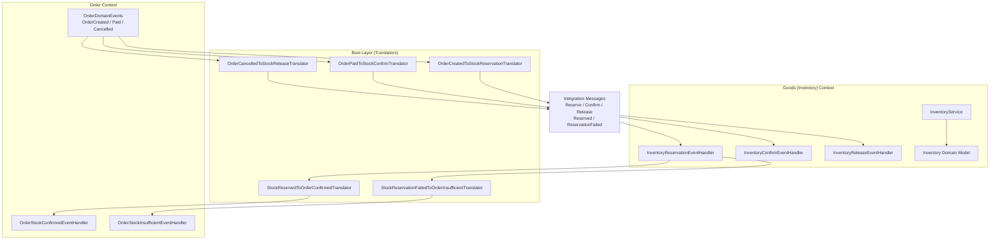
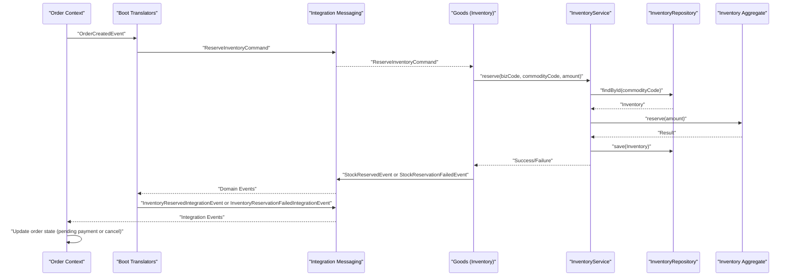
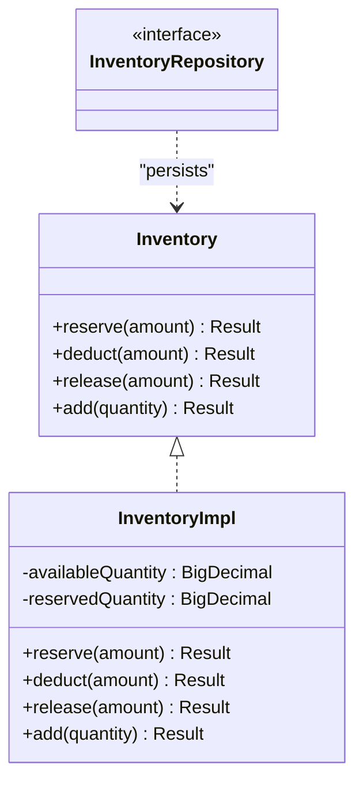
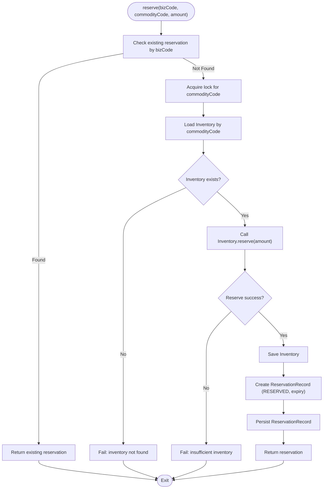
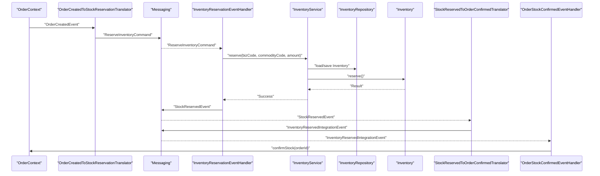
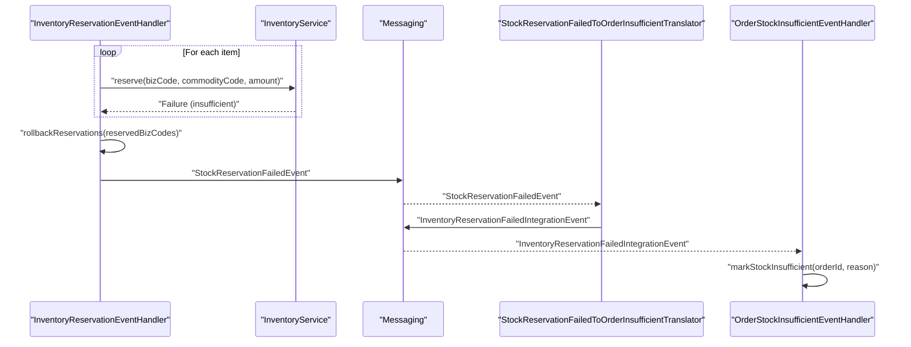
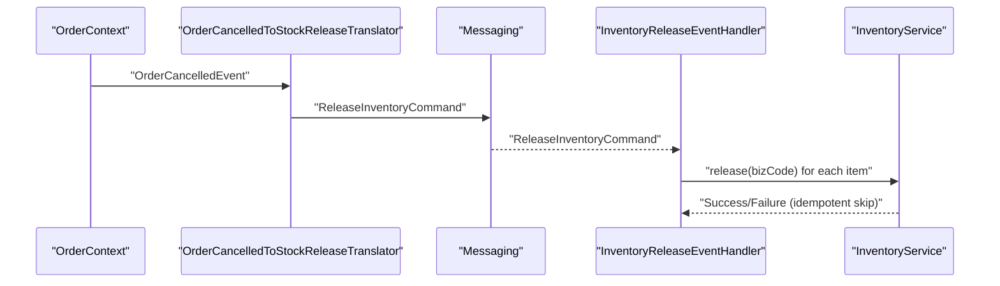
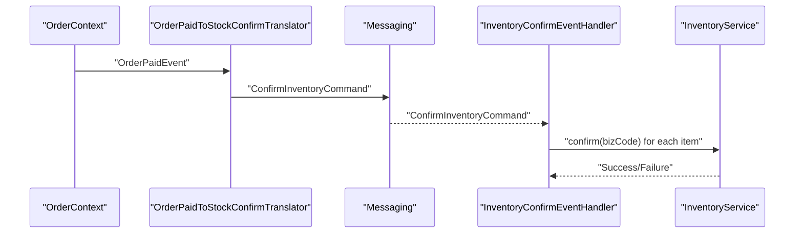
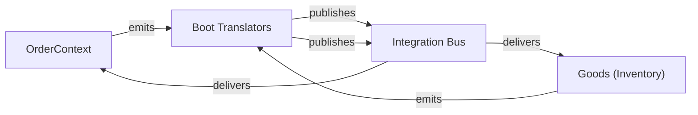

# Stock Integration & Reservation

<cite>
**Referenced Files in This Document**
- [Inventory.kt](file://j-store-goods-domain/src/main/kotlin/com/jstore/goods/domain/inventory/Inventory.kt)
- [InventoryService.kt](file://j-store-goods-application/src/main/kotlin/com/jstore/goods/service/InventoryService.kt)
- [InventoryRepository.kt](file://j-store-goods-domain/src/main/kotlin/com/jstore/goods/domain/inventory/InventoryRepository.kt)
- [InventoryEventHandler.kt](file://j-store-goods-application/src/main/kotlin/com/jstore/goods/service/InventoryEventHandler.kt)
- [InventoryConfirmEventHandler.kt](file://j-store-goods-application/src/main/kotlin/com/jstore/goods/service/InventoryConfirmEventHandler.kt)
- [InventoryReleaseEventHandler.kt](file://j-store-goods-application/src/main/kotlin/com/jstore/goods/service/InventoryReleaseEventHandler.kt)
- [OrderToStockEventTranslator.kt](file://j-store-boot/src/main/kotlin/com/jstore/translator/OrderToStockEventTranslator.kt)
- [StockToOrderEventTranslator.kt](file://j-store-boot/src/main/kotlin/com/jstore/translator/StockToOrderEventTranslator.kt)
- [CommerceIntegrationMessages.kt](file://j-store-integration-contracts/src/main/kotlin/com/jstore/contracts/commerce/CommerceIntegrationMessages.kt)
- [OrderStockEventHandler.kt](file://j-store-order-application/src/main/kotlin/com/jstore/order/service/OrderStockEventHandler.kt)
- [OrderStockInsufficientEventHandler.kt](file://j-store-order-application/src/main/kotlin/com/jstore/order/service/OrderStockInsufficientEventHandler.kt)
</cite>

## Table of Contents
1. [Introduction](#introduction)
2. [Project Structure](#project-structure)
3. [Core Components](#core-components)
4. [Architecture Overview](#architecture-overview)
5. [Detailed Component Analysis](#detailed-component-analysis)
6. [Dependency Analysis](#dependency-analysis)
7. [Performance Considerations](#performance-considerations)
8. [Troubleshooting Guide](#troubleshooting-guide)
9. [Conclusion](#conclusion)

## Introduction
This document explains the stock integration and reservation mechanisms that coordinate orders with inventory management through domain events and integration messages. It covers:
- How orders trigger stock reservations, confirmations, and releases
- The event-driven architecture for cross-boundary synchronization between Order and Goods (Inventory) contexts
- Insufficient stock handling and automatic order cancellation scenarios
- Retry and idempotency considerations for failed operations
- Edge cases such as race conditions and eventual consistency patterns

## Project Structure
The stock integration spans three modules:
- Order module: emits domain events on order lifecycle changes; listens to inventory outcomes to update order state
- Goods (Inventory) module: owns inventory state transitions (reserve, deduct, release) and publishes domain events
- Boot layer: translates domain events into integration commands/events across bounded contexts using an outbox-based messaging system

**Diagram sources**
- [OrderToStockEventTranslator.kt:1-96](file://j-store-boot/src/main/kotlin/com/jstore/translator/OrderToStockEventTranslator.kt#L1-L96)
- [StockToOrderEventTranslator.kt:1-51](file://j-store-boot/src/main/kotlin/com/jstore/translator/StockToOrderEventTranslator.kt#L1-L51)
- [CommerceIntegrationMessages.kt:1-382](file://j-store-integration-contracts/src/main/kotlin/com/jstore/contracts/commerce/CommerceIntegrationMessages.kt#L1-L382)
- [InventoryEventHandler.kt:1-76](file://j-store-goods-application/src/main/kotlin/com/jstore/goods/service/InventoryEventHandler.kt#L1-L76)
- [InventoryConfirmEventHandler.kt:1-33](file://j-store-goods-application/src/main/kotlin/com/jstore/goods/service/InventoryConfirmEventHandler.kt#L1-L33)
- [InventoryReleaseEventHandler.kt:1-31](file://j-store-goods-application/src/main/kotlin/com/jstore/goods/service/InventoryReleaseEventHandler.kt#L1-L31)
- [InventoryService.kt:1-156](file://j-store-goods-application/src/main/kotlin/com/jstore/goods/service/InventoryService.kt#L1-L156)
- [OrderStockEventHandler.kt:1-27](file://j-store-order-application/src/main/kotlin/com/jstore/order/service/OrderStockEventHandler.kt#L1-L27)
- [OrderStockInsufficientEventHandler.kt:1-27](file://j-store-order-application/src/main/kotlin/com/jstore/order/service/OrderStockInsufficientEventHandler.kt#L1-L27)

**Section sources**
- [OrderToStockEventTranslator.kt:1-96](file://j-store-boot/src/main/kotlin/com/jstore/translator/OrderToStockEventTranslator.kt#L1-L96)
- [StockToOrderEventTranslator.kt:1-51](file://j-store-boot/src/main/kotlin/com/jstore/translator/StockToOrderEventTranslator.kt#L1-L51)
- [CommerceIntegrationMessages.kt:1-382](file://j-store-integration-contracts/src/main/kotlin/com/jstore/contracts/commerce/CommerceIntegrationMessages.kt#L1-L382)

## Core Components
- Inventory aggregate and repository: encapsulates available/reserved quantities and provides reserve/deduct/release/add operations with validation
- Inventory application service: orchestrates reservation creation, confirmation, and release with locking and idempotency via a reservation record keyed by business code
- Event handlers: translate integration commands into domain operations and publish domain events upon success or failure
- Translators: bridge domain events from Order and Goods contexts into integration messages and back
- Order event handlers: react to inventory outcomes to transition order states (e.g., mark pending payment or cancel due to insufficient stock)

Key responsibilities:
- Reserve: decrement available, increment reserved, create a reservation record with a unique bizCode per SKU
- Confirm: move reserved quantity to deducted (consumed)
- Release: return reserved quantity back to available
- Rollback on partial failure during multi-item reservation

**Section sources**
- [Inventory.kt:1-77](file://j-store-goods-domain/src/main/kotlin/com/jstore/goods/domain/inventory/Inventory.kt#L1-L77)
- [InventoryRepository.kt:1-6](file://j-store-goods-domain/src/main/kotlin/com/jstore/goods/domain/inventory/InventoryRepository.kt#L1-L6)
- [InventoryService.kt:1-156](file://j-store-goods-application/src/main/kotlin/com/jstore/goods/service/InventoryService.kt#L1-L156)
- [InventoryEventHandler.kt:1-76](file://j-store-goods-application/src/main/kotlin/com/jstore/goods/service/InventoryEventHandler.kt#L1-L76)
- [InventoryConfirmEventHandler.kt:1-33](file://j-store-goods-application/src/main/kotlin/com/jstore/goods/service/InventoryConfirmEventHandler.kt#L1-L33)
- [InventoryReleaseEventHandler.kt:1-31](file://j-store-goods-application/src/main/kotlin/com/jstore/goods/service/InventoryReleaseEventHandler.kt#L1-L31)

## Architecture Overview
The stock integration follows an event-driven pattern with clear boundaries:
- Order context emits domain events on order lifecycle changes
- Boot layer translates these into integration commands targeting the Goods context
- Goods context processes commands, updates inventory, and emits domain events
- Boot layer translates Goods domain events back into integration events consumed by the Order context to update order state

**Diagram sources**
- [OrderToStockEventTranslator.kt:1-96](file://j-store-boot/src/main/kotlin/com/jstore/translator/OrderToStockEventTranslator.kt#L1-L96)
- [StockToOrderEventTranslator.kt:1-51](file://j-store-boot/src/main/kotlin/com/jstore/translator/StockToOrderEventTranslator.kt#L1-L51)
- [CommerceIntegrationMessages.kt:1-382](file://j-store-integration-contracts/src/main/kotlin/com/jstore/contracts/commerce/CommerceIntegrationMessages.kt#L1-L382)
- [InventoryService.kt:1-156](file://j-store-goods-application/src/main/kotlin/com/jstore/goods/service/InventoryService.kt#L1-L156)
- [Inventory.kt:1-77](file://j-store-goods-domain/src/main/kotlin/com/jstore/goods/domain/inventory/Inventory.kt#L1-L77)

## Detailed Component Analysis

### Inventory Aggregate and Operations
The Inventory aggregate enforces valid state transitions:
- reserve(amount): checks availableQuantity >= amount; moves amount from available to reserved
- deduct(amount): checks reservedQuantity >= amount; moves amount from reserved to deducted
- release(amount): checks reservedQuantity >= amount; moves amount from reserved back to available
- add(quantity): increases availableQuantity (used for restocking)

Concurrency is protected at the application layer via a lock per commodity code and persisted reservation records keyed by bizCode for idempotency.

**Diagram sources**
- [Inventory.kt:1-77](file://j-store-goods-domain/src/main/kotlin/com/jstore/goods/domain/inventory/Inventory.kt#L1-L77)
- [InventoryRepository.kt:1-6](file://j-store-goods-domain/src/main/kotlin/com/jstore/goods/domain/inventory/InventoryRepository.kt#L1-L6)

**Section sources**
- [Inventory.kt:1-77](file://j-store-goods-domain/src/main/kotlin/com/jstore/goods/domain/inventory/Inventory.kt#L1-L77)

### Inventory Application Service: Reservation Lifecycle
The InventoryService implements TCC-like semantics:
- reserve(bizCode, commodityCode, amount):
  - Idempotency check via reservationRecordRepository.findByBizCode
  - Acquire a lock for commodityCode
  - Load Inventory, call reserve(), save Inventory
  - Create and persist ReservationRecord with status RESERVED and expiry time
- confirm(bizCode):
  - Load ReservationRecord, transition to confirmed
  - Load Inventory, call deduct(), save Inventory
- release(bizCode):
  - Load ReservationRecord, transition to released
  - Load Inventory, call release(), save Inventory

**Diagram sources**
- [InventoryService.kt:1-156](file://j-store-goods-application/src/main/kotlin/com/jstore/goods/service/InventoryService.kt#L1-L156)

**Section sources**
- [InventoryService.kt:1-156](file://j-store-goods-application/src/main/kotlin/com/jstore/goods/service/InventoryService.kt#L1-L156)

### Order-to-Stock Translation and Stock Confirmation Flow
When an order is created, paid, or cancelled, the boot layer publishes integration commands to the Goods context. Upon successful reservation, Goods emits domain events which are translated back to integration events for the Order context to update order state.

**Diagram sources**
- [OrderToStockEventTranslator.kt:1-96](file://j-store-boot/src/main/kotlin/com/jstore/translator/OrderToStockEventTranslator.kt#L1-L96)
- [StockToOrderEventTranslator.kt:1-51](file://j-store-boot/src/main/kotlin/com/jstore/translator/StockToOrderEventTranslator.kt#L1-L51)
- [InventoryEventHandler.kt:1-76](file://j-store-goods-application/src/main/kotlin/com/jstore/goods/service/InventoryEventHandler.kt#L1-L76)
- [InventoryService.kt:1-156](file://j-store-goods-application/src/main/kotlin/com/jstore/goods/service/InventoryService.kt#L1-L156)
- [OrderStockEventHandler.kt:1-27](file://j-store-order-application/src/main/kotlin/com/jstore/order/service/OrderStockEventHandler.kt#L1-L27)

**Section sources**
- [OrderToStockEventTranslator.kt:1-96](file://j-store-boot/src/main/kotlin/com/jstore/translator/OrderToStockEventTranslator.kt#L1-L96)
- [StockToOrderEventTranslator.kt:1-51](file://j-store-boot/src/main/kotlin/com/jstore/translator/StockToOrderEventTranslator.kt#L1-L51)
- [InventoryEventHandler.kt:1-76](file://j-store-goods-application/src/main/kotlin/com/jstore/goods/service/InventoryEventHandler.kt#L1-L76)
- [OrderStockEventHandler.kt:1-27](file://j-store-order-application/src/main/kotlin/com/jstore/order/service/OrderStockEventHandler.kt#L1-L27)

### Insufficient Stock Handling and Automatic Cancellation
If any item fails to reserve, the Goods handler rolls back previously reserved items for the same order and publishes a failure event. The Order context cancels the order accordingly.

**Diagram sources**
- [InventoryEventHandler.kt:1-76](file://j-store-goods-application/src/main/kotlin/com/jstore/goods/service/InventoryEventHandler.kt#L1-L76)
- [StockToOrderEventTranslator.kt:1-51](file://j-store-boot/src/main/kotlin/com/jstore/translator/StockToOrderEventTranslator.kt#L1-L51)
- [OrderStockInsufficientEventHandler.kt:1-27](file://j-store-order-application/src/main/kotlin/com/jstore/order/service/OrderStockInsufficientEventHandler.kt#L1-L27)

**Section sources**
- [InventoryEventHandler.kt:1-76](file://j-store-goods-application/src/main/kotlin/com/jstore/goods/service/InventoryEventHandler.kt#L1-L76)
- [OrderStockInsufficientEventHandler.kt:1-27](file://j-store-order-application/src/main/kotlin/com/jstore/order/service/OrderStockInsufficientEventHandler.kt#L1-L27)

### Stock Release Upon Order Cancellation
When an order is cancelled, the boot layer publishes a release command to the Goods context. The Goods handler iterates over items and calls release for each reservation.

**Diagram sources**
- [OrderToStockEventTranslator.kt:1-96](file://j-store-boot/src/main/kotlin/com/jstore/translator/OrderToStockEventTranslator.kt#L1-L96)
- [InventoryReleaseEventHandler.kt:1-31](file://j-store-goods-application/src/main/kotlin/com/jstore/goods/service/InventoryReleaseEventHandler.kt#L1-L31)
- [InventoryService.kt:1-156](file://j-store-goods-application/src/main/kotlin/com/jstore/goods/service/InventoryService.kt#L1-L156)

**Section sources**
- [OrderToStockEventTranslator.kt:1-96](file://j-store-boot/src/main/kotlin/com/jstore/translator/OrderToStockEventTranslator.kt#L1-L96)
- [InventoryReleaseEventHandler.kt:1-31](file://j-store-goods-application/src/main/kotlin/com/jstore/goods/service/InventoryReleaseEventHandler.kt#L1-L31)

### Stock Confirmation After Payment
After payment succeeds, the boot layer publishes a confirm command to convert reserved stock to deducted stock.

**Diagram sources**
- [OrderToStockEventTranslator.kt:1-96](file://j-store-boot/src/main/kotlin/com/jstore/translator/OrderToStockEventTranslator.kt#L1-L96)
- [InventoryConfirmEventHandler.kt:1-33](file://j-store-goods-application/src/main/kotlin/com/jstore/goods/service/InventoryConfirmEventHandler.kt#L1-L33)
- [InventoryService.kt:1-156](file://j-store-goods-application/src/main/kotlin/com/jstore/goods/service/InventoryService.kt#L1-L156)

**Section sources**
- [OrderToStockEventTranslator.kt:1-96](file://j-store-boot/src/main/kotlin/com/jstore/translator/OrderToStockEventTranslator.kt#L1-L96)
- [InventoryConfirmEventHandler.kt:1-33](file://j-store-goods-application/src/main/kotlin/com/jstore/goods/service/InventoryConfirmEventHandler.kt#L1-L33)

## Dependency Analysis
- OrderContext depends on translators to emit integration commands and consumes integration events to update order state
- GoodsContext depends on InventoryService and InventoryRepository for state mutations and persistence
- Boot layer depends on both contexts’ domain events and the integration message bus to translate and route messages

**Diagram sources**
- [OrderToStockEventTranslator.kt:1-96](file://j-store-boot/src/main/kotlin/com/jstore/translator/OrderToStockEventTranslator.kt#L1-L96)
- [StockToOrderEventTranslator.kt:1-51](file://j-store-boot/src/main/kotlin/com/jstore/translator/StockToOrderEventTranslator.kt#L1-L51)
- [CommerceIntegrationMessages.kt:1-382](file://j-store-integration-contracts/src/main/kotlin/com/jstore/contracts/commerce/CommerceIntegrationMessages.kt#L1-L382)

**Section sources**
- [CommerceIntegrationMessages.kt:1-382](file://j-store-integration-contracts/src/main/kotlin/com/jstore/contracts/commerce/CommerceIntegrationMessages.kt#L1-L382)

## Performance Considerations
- Concurrency control: InventoryService uses a lock per commodity code to serialize concurrent modifications and prevent race conditions
- Idempotency: ReservationRecord keyed by bizCode ensures duplicate commands are safely ignored
- Batch processing: Multi-item reservations are processed sequentially with rollback on first failure to maintain consistency
- Outbox-based delivery: Integration messages are published reliably, enabling eventual consistency and retryability

[No sources needed since this section provides general guidance]

## Troubleshooting Guide
Common issues and remedies:
- Insufficient inventory:
  - Symptoms: StockReservationFailedEvent emitted; Order marked as insufficient and cancelled
  - Actions: Verify availableQuantity vs requested amount; ensure no concurrent reservations exceed capacity
- Lock contention:
  - Symptoms: Concurrent conflict errors when acquiring locks
  - Actions: Review lock timeout configuration; consider increasing timeouts or optimizing hot paths
- Idempotency failures:
  - Symptoms: Duplicate commands causing unexpected skips
  - Actions: Ensure stable bizCode generation (ORDER-{orderId}-SKU-{skuId}); verify reservation record existence before processing
- Rollback failures:
  - Symptoms: Partial reservations not fully rolled back
  - Actions: Investigate release() failures; implement dead-lettering or manual reconciliation if necessary

**Section sources**
- [InventoryService.kt:1-156](file://j-store-goods-application/src/main/kotlin/com/jstore/goods/service/InventoryService.kt#L1-L156)
- [InventoryEventHandler.kt:1-76](file://j-store-goods-application/src/main/kotlin/com/jstore/goods/service/InventoryEventHandler.kt#L1-L76)

## Conclusion
The stock integration leverages an event-driven architecture to decouple Order and Goods contexts while ensuring strong consistency within each boundary. Through TCC-like reservation semantics, robust idempotency, and reliable messaging, the system handles normal flows (reserve-confirm-release), insufficient stock scenarios (automatic cancellation), and edge cases (race conditions). Operational reliability is enhanced by locking, outbox publishing, and explicit rollback strategies.

[No sources needed since this section summarizes without analyzing specific files]
