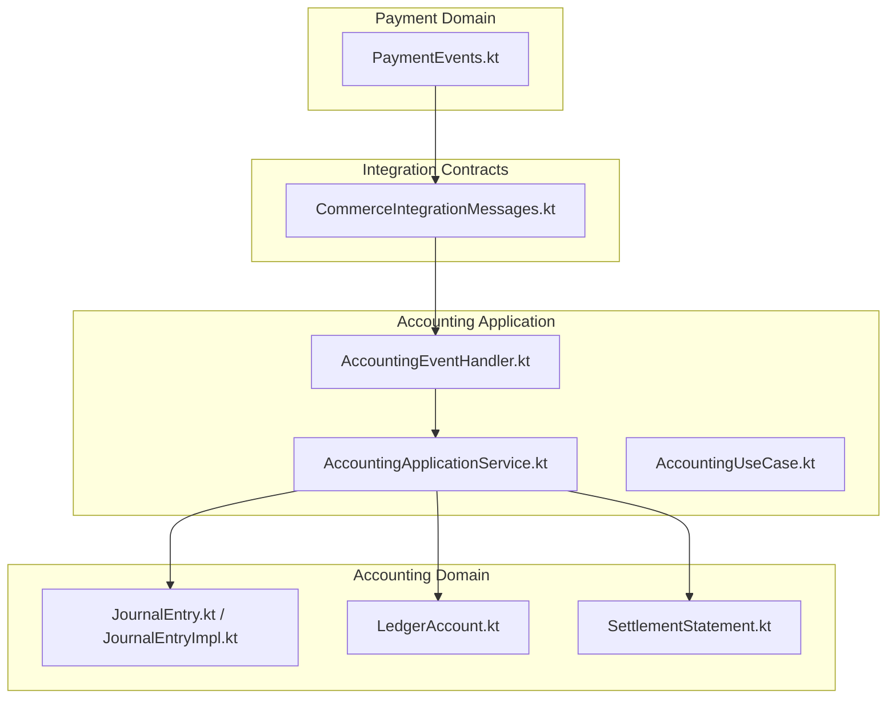
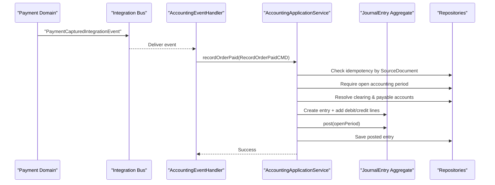
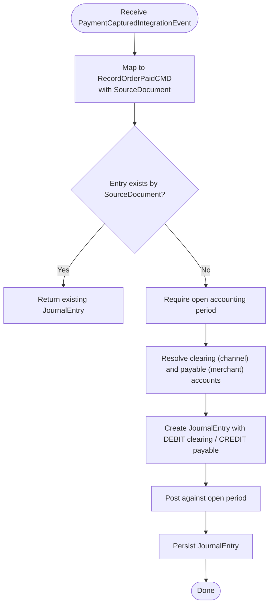
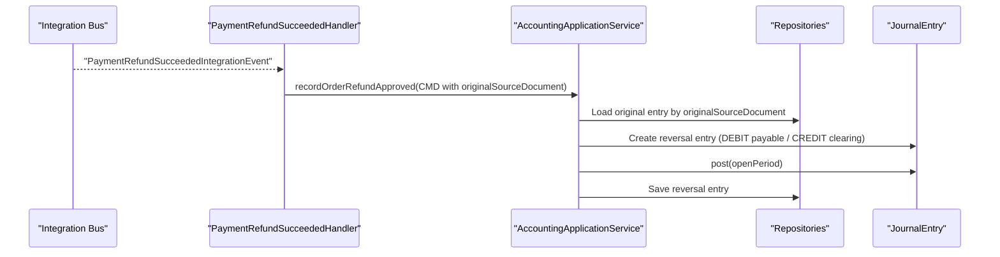
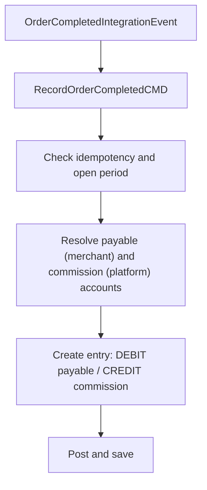
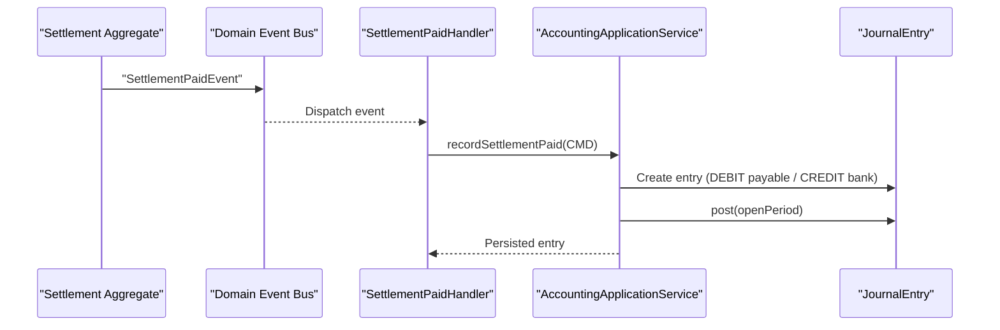
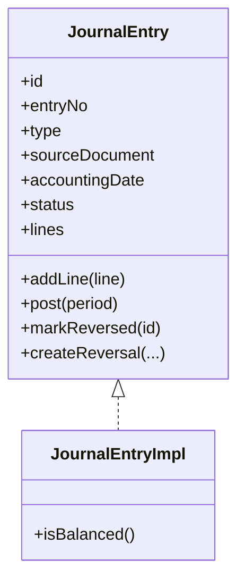
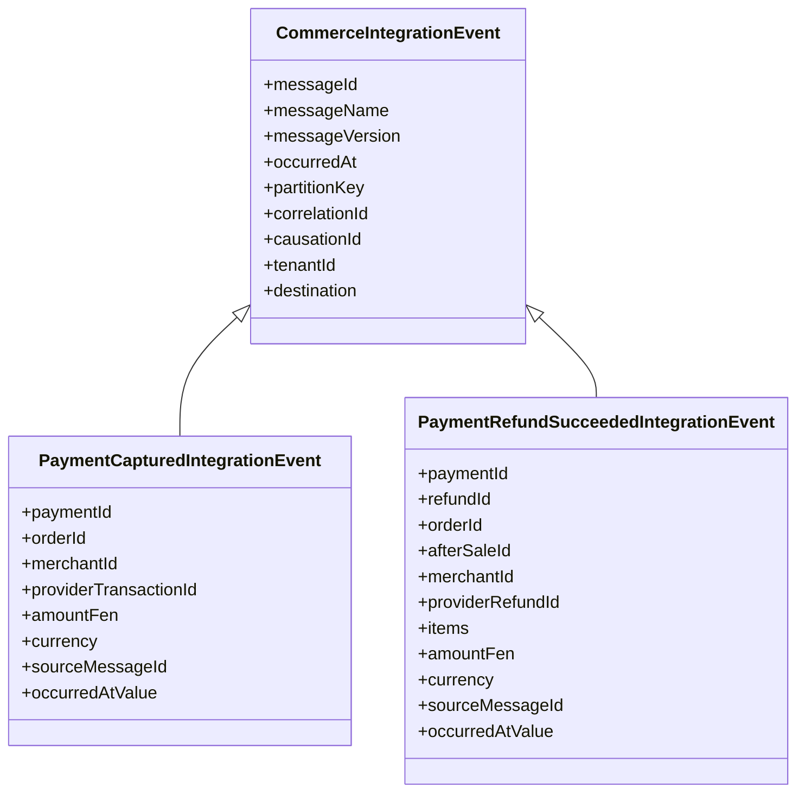
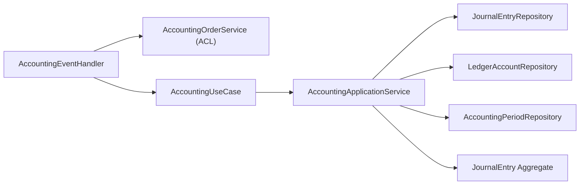

# Accounting System Integration

<cite>
**Referenced Files in This Document**
- [AccountingApplicationService.kt](file://j-store-accounting-application/src/main/kotlin/com/jstore/accounting/service/AccountingApplicationService.kt)
- [AccountingEventHandler.kt](file://j-store-accounting-application/src/main/kotlin/com/jstore/accounting/service/AccountingEventHandler.kt)
- [CommerceIntegrationMessages.kt](file://j-store-integration-contracts/src/main/kotlin/com/jstore/contracts/commerce/CommerceIntegrationMessages.kt)
- [PaymentEvents.kt](file://j-store-payment-domain/src/main/kotlin/com/jstore/payment/domain/payment/event/PaymentEvents.kt)
- [JournalEntry.kt](file://j-store-accounting-domain/src/main/kotlin/com/jstore/accounting/domain/journal/JournalEntry.kt)
- [JournalEntryImpl.kt](file://j-store-accounting-domain/src/main/kotlin/com/jstore/accounting/domain/journal/JournalEntryImpl.kt)
- [LedgerAccount.kt](file://j-store-accounting-domain/src/main/kotlin/com/jstore/accounting/domain/account/LedgerAccount.kt)
- [SettlementStatement.kt](file://j-store-accounting-domain/src/main/kotlin/com/jstore/accounting/domain/settlement/SettlementStatement.kt)
- [AccountingUseCase.kt](file://j-store-accounting-application/src/main/kotlin/com/jstore/accounting/service/AccountingUseCase.kt)
- [RecordOrderPaidCMD.kt](file://j-store-accounting-application/src/main/kotlin/com/jstore/accounting/service/command/RecordOrderPaidCMD.kt)
- [DomainEvent.kt](file://j-store-common-core/src/main/kotlin/com/jstore/common/framework/event/DomainEvent.kt)
</cite>

## Table of Contents
1. [Introduction](#introduction)
2. [Project Structure](#project-structure)
3. [Core Components](#core-components)
4. [Architecture Overview](#architecture-overview)
5. [Detailed Component Analysis](#detailed-component-analysis)
6. [Dependency Analysis](#dependency-analysis)
7. [Performance Considerations](#performance-considerations)
8. [Troubleshooting Guide](#troubleshooting-guide)
9. [Conclusion](#conclusion)

## Introduction
This document explains how the accounting system integrates with payment processing to maintain double-entry bookkeeping consistency. It details how payment events trigger journal entries for captures, refunds, and settlement payments; describes event-driven communication between payment and accounting modules; and outlines reconciliation patterns and consistency requirements across payment states and accounting records.

## Project Structure
The integration spans multiple modules:
- Payment domain emits domain events on capture/refund outcomes.
- Integration contracts define stable cross-service messages used by consumers.
- Accounting application services translate these events into journal entries using domain aggregates (journal entry, ledger accounts, accounting periods).
- Settlement statements model merchant settlement and payment outflows.

**Diagram sources**
- [PaymentEvents.kt](file://j-store-payment-domain/src/main/kotlin/com/jstore/payment/domain/payment/event/PaymentEvents.kt)
- [CommerceIntegrationMessages.kt](file://j-store-integration-contracts/src/main/kotlin/com/jstore/contracts/commerce/CommerceIntegrationMessages.kt)
- [AccountingEventHandler.kt](file://j-store-accounting-application/src/main/kotlin/com/jstore/accounting/service/AccountingEventHandler.kt)
- [AccountingApplicationService.kt](file://j-store-accounting-application/src/main/kotlin/com/jstore/accounting/service/AccountingApplicationService.kt)
- [JournalEntry.kt](file://j-store-accounting-domain/src/main/kotlin/com/jstore/accounting/domain/journal/JournalEntry.kt)
- [JournalEntryImpl.kt](file://j-store-accounting-domain/src/main/kotlin/com/jstore/accounting/domain/journal/JournalEntryImpl.kt)
- [LedgerAccount.kt](file://j-store-accounting-domain/src/main/kotlin/com/jstore/accounting/domain/account/LedgerAccount.kt)
- [SettlementStatement.kt](file://j-store-accounting-domain/src/main/kotlin/com/jstore/accounting/domain/settlement/SettlementStatement.kt)

**Section sources**
- [AccountingApplicationService.kt](file://j-store-accounting-application/src/main/kotlin/com/jstore/accounting/service/AccountingApplicationService.kt)
- [AccountingEventHandler.kt](file://j-store-accounting-application/src/main/kotlin/com/jstore/accounting/service/AccountingEventHandler.kt)
- [CommerceIntegrationMessages.kt](file://j-store-integration-contracts/src/main/kotlin/com/jstore/contracts/commerce/CommerceIntegrationMessages.kt)
- [PaymentEvents.kt](file://j-store-payment-domain/src/main/kotlin/com/jstore/payment/domain/payment/event/PaymentEvents.kt)

## Core Components
- AccountingApplicationService: Orchestrates creation of double-entry journal entries for order payment, order completion commission, refund reversal, and settlement payment. It enforces idempotency via source documents, validates open accounting periods, resolves ledger accounts by code and subject, and persists posted entries.
- AccountingEventHandler: Bridges integration events (payment captured, order completed, payment refund succeeded) and internal domain events (settlement paid) into use-case commands.
- JournalEntry and JournalEntryImpl: Double-entry aggregate ensuring balanced debits/credits, valid period posting, and reversal support.
- LedgerAccount: Defines account codes, subjects (platform, merchant, channel), types, and status.
- SettlementStatement: Models settlement lines and lifecycle (draft, confirmed, paid).

Key responsibilities:
- Idempotent recording through SourceDocument uniqueness checks.
- Period validation before posting.
- Account resolution with fallback to default subject where applicable.
- Reversal linkage for refunds.

**Section sources**
- [AccountingApplicationService.kt](file://j-store-accounting-application/src/main/kotlin/com/jstore/accounting/service/AccountingApplicationService.kt)
- [AccountingEventHandler.kt](file://j-store-accounting-application/src/main/kotlin/com/jstore/accounting/service/AccountingEventHandler.kt)
- [JournalEntry.kt](file://j-store-accounting-domain/src/main/kotlin/com/jstore/accounting/domain/journal/JournalEntry.kt)
- [JournalEntryImpl.kt](file://j-store-accounting-domain/src/main/kotlin/com/jstore/accounting/domain/journal/JournalEntryImpl.kt)
- [LedgerAccount.kt](file://j-store-accounting-domain/src/main/kotlin/com/jstore/accounting/domain/account/LedgerAccount.kt)
- [SettlementStatement.kt](file://j-store-accounting-domain/src/main/kotlin/com/jstore/accounting/domain/settlement/SettlementStatement.kt)

## Architecture Overview
The system uses an event-driven architecture:
- Payment domain emits domain events on capture/refund success.
- These are published as integration events consumed by accounting handlers.
- Handlers map events to accounting use cases that create and post journal entries.
- Settlement events drive settlement payment entries.

**Diagram sources**
- [CommerceIntegrationMessages.kt](file://j-store-integration-contracts/src/main/kotlin/com/jstore/contracts/commerce/CommerceIntegrationMessages.kt)
- [AccountingEventHandler.kt](file://j-store-accounting-application/src/main/kotlin/com/jstore/accounting/service/AccountingEventHandler.kt)
- [AccountingApplicationService.kt](file://j-store-accounting-application/src/main/kotlin/com/jstore/accounting/service/AccountingApplicationService.kt)
- [JournalEntry.kt](file://j-store-accounting-domain/src/main/kotlin/com/jstore/accounting/domain/journal/JournalEntry.kt)

## Detailed Component Analysis

### Event-to-Journal Flow for Payment Capture
- Integration event: PaymentCapturedIntegrationEvent carries orderId, merchantId, amountFen, currency, occurredAt.
- Handler maps to RecordOrderPaidCMD with a SourceDocument keyed by order and event type.
- Application service ensures idempotency, opens period, resolves accounts, builds balanced entry, posts, and saves.

**Diagram sources**
- [AccountingEventHandler.kt](file://j-store-accounting-application/src/main/kotlin/com/jstore/accounting/service/AccountingEventHandler.kt)
- [AccountingApplicationService.kt](file://j-store-accounting-application/src/main/kotlin/com/jstore/accounting/service/AccountingApplicationService.kt)
- [JournalEntryImpl.kt](file://j-store-accounting-domain/src/main/kotlin/com/jstore/accounting/domain/journal/JournalEntryImpl.kt)

**Section sources**
- [AccountingEventHandler.kt](file://j-store-accounting-application/src/main/kotlin/com/jstore/accounting/service/AccountingEventHandler.kt)
- [AccountingApplicationService.kt](file://j-store-accounting-application/src/main/kotlin/com/jstore/accounting/service/AccountingApplicationService.kt)
- [RecordOrderPaidCMD.kt](file://j-store-accounting-application/src/main/kotlin/com/jstore/accounting/service/command/RecordOrderPaidCMD.kt)

### Refund Reversal Journal Entry
- On PaymentRefundSucceededIntegrationEvent, handler retrieves original source document for the related payment.
- Application service validates original entry is POSTED, then creates a reversal entry linking back to the original.
- Debit reduces merchant payable; credit reduces clearing account.

**Diagram sources**
- [AccountingEventHandler.kt](file://j-store-accounting-application/src/main/kotlin/com/jstore/accounting/service/AccountingEventHandler.kt)
- [AccountingApplicationService.kt](file://j-store-accounting-application/src/main/kotlin/com/jstore/accounting/service/AccountingApplicationService.kt)
- [JournalEntry.kt](file://j-store-accounting-domain/src/main/kotlin/com/jstore/accounting/domain/journal/JournalEntry.kt)

**Section sources**
- [AccountingEventHandler.kt](file://j-store-accounting-application/src/main/kotlin/com/jstore/accounting/service/AccountingEventHandler.kt)
- [AccountingApplicationService.kt](file://j-store-accounting-application/src/main/kotlin/com/jstore/accounting/service/AccountingApplicationService.kt)

### Order Completion Commission Posting
- On OrderCompletedIntegrationEvent, handler computes commission from order accounting info.
- Application service creates a commission entry: debit merchant payable, credit platform revenue.

**Diagram sources**
- [AccountingEventHandler.kt](file://j-store-accounting-application/src/main/kotlin/com/jstore/accounting/service/AccountingEventHandler.kt)
- [AccountingApplicationService.kt](file://j-store-accounting-application/src/main/kotlin/com/jstore/accounting/service/AccountingApplicationService.kt)

**Section sources**
- [AccountingEventHandler.kt](file://j-store-accounting-application/src/main/kotlin/com/jstore/accounting/service/AccountingEventHandler.kt)
- [AccountingApplicationService.kt](file://j-store-accounting-application/src/main/kotlin/com/jstore/accounting/service/AccountingApplicationService.kt)

### Settlement Payment Posting
- Internal domain event SettlementPaidEvent triggers settlement payment entry.
- Application service debits merchant payable and credits platform bank account.

**Diagram sources**
- [AccountingEventHandler.kt](file://j-store-accounting-application/src/main/kotlin/com/jstore/accounting/service/AccountingEventHandler.kt)
- [AccountingApplicationService.kt](file://j-store-accounting-application/src/main/kotlin/com/jstore/accounting/service/AccountingApplicationService.kt)
- [SettlementStatement.kt](file://j-store-accounting-domain/src/main/kotlin/com/jstore/accounting/domain/settlement/SettlementStatement.kt)

**Section sources**
- [AccountingEventHandler.kt](file://j-store-accounting-application/src/main/kotlin/com/jstore/accounting/service/AccountingEventHandler.kt)
- [AccountingApplicationService.kt](file://j-store-accounting-application/src/main/kotlin/com/jstore/accounting/service/AccountingApplicationService.kt)
- [SettlementStatement.kt](file://j-store-accounting-domain/src/main/kotlin/com/jstore/accounting/domain/settlement/SettlementStatement.kt)

### Journal Entry Model and Posting Rules
- JournalEntry enforces:
  - At least two lines.
  - Balanced debits and credits.
  - Open accounting period containing the accounting date.
  - State transitions: DRAFT -> POSTED; POSTED can be reversed.
- Reversals flip sides and link to original entry.

**Diagram sources**
- [JournalEntry.kt](file://j-store-accounting-domain/src/main/kotlin/com/jstore/accounting/domain/journal/JournalEntry.kt)
- [JournalEntryImpl.kt](file://j-store-accounting-domain/src/main/kotlin/com/jstore/accounting/domain/journal/JournalEntryImpl.kt)

**Section sources**
- [JournalEntry.kt](file://j-store-accounting-domain/src/main/kotlin/com/jstore/accounting/domain/journal/JournalEntry.kt)
- [JournalEntryImpl.kt](file://j-store-accounting-domain/src/main/kotlin/com/jstore/accounting/domain/journal/JournalEntryImpl.kt)

### Event Contracts and Domain Events
- Integration events provide stable message schemas for cross-service communication.
- Domain events describe aggregate state changes within the payment module.

**Diagram sources**
- [CommerceIntegrationMessages.kt](file://j-store-integration-contracts/src/main/kotlin/com/jstore/contracts/commerce/CommerceIntegrationMessages.kt)

**Section sources**
- [CommerceIntegrationMessages.kt](file://j-store-integration-contracts/src/main/kotlin/com/jstore/contracts/commerce/CommerceIntegrationMessages.kt)
- [PaymentEvents.kt](file://j-store-payment-domain/src/main/kotlin/com/jstore/payment/domain/payment/event/PaymentEvents.kt)
- [DomainEvent.kt](file://j-store-common-core/src/main/kotlin/com/jstore/common/framework/event/DomainEvent.kt)

## Dependency Analysis
- AccountingEventHandler depends on AccountingOrderService (ACL) to fetch order accounting info and original source documents for reversals.
- AccountingApplicationService depends on repositories for journals, ledger accounts, and accounting periods.
- JournalEntryImpl depends on Price arithmetic and period validation logic.
- Integration contracts decouple payment and accounting modules.

**Diagram sources**
- [AccountingEventHandler.kt](file://j-store-accounting-application/src/main/kotlin/com/jstore/accounting/service/AccountingEventHandler.kt)
- [AccountingApplicationService.kt](file://j-store-accounting-application/src/main/kotlin/com/jstore/accounting/service/AccountingApplicationService.kt)
- [AccountingUseCase.kt](file://j-store-accounting-application/src/main/kotlin/com/jstore/accounting/service/AccountingUseCase.kt)

**Section sources**
- [AccountingEventHandler.kt](file://j-store-accounting-application/src/main/kotlin/com/jstore/accounting/service/AccountingEventHandler.kt)
- [AccountingApplicationService.kt](file://j-store-accounting-application/src/main/kotlin/com/jstore/accounting/service/AccountingApplicationService.kt)
- [AccountingUseCase.kt](file://j-store-accounting-application/src/main/kotlin/com/jstore/accounting/service/AccountingUseCase.kt)

## Performance Considerations
- Idempotency check by SourceDocument avoids duplicate postings and redundant work.
- Repository lookups should be indexed by source document fields for fast deduplication.
- Batch operations for high-volume settlements can reduce transaction overhead.
- Keep event payloads minimal; rely on ACL queries for enriched data.

[No sources needed since this section provides general guidance]

## Troubleshooting Guide
Common issues and resolutions:
- Duplicate journal entry: Ensure SourceDocument uniqueness and verify idempotency path in application service.
- Accounting period closed: Confirm the accounting date falls within an open period; adjust dates or reopen periods as needed.
- Unbalanced entry: Verify at least two lines exist and total debits equal total credits.
- Missing ledger account: Ensure accounts exist for the given code and subject; fallback to DEFAULT subject may apply for merchants.
- Invalid state for reversal: Original entry must be POSTED before creating a reversal.

**Section sources**
- [AccountingApplicationService.kt](file://j-store-accounting-application/src/main/kotlin/com/jstore/accounting/service/AccountingApplicationService.kt)
- [JournalEntryImpl.kt](file://j-store-accounting-domain/src/main/kotlin/com/jstore/accounting/domain/journal/JournalEntryImpl.kt)

## Conclusion
The accounting integration leverages stable integration events and robust double-entry aggregates to ensure consistent financial recording across payment captures, refunds, and settlements. Idempotency, period validation, and reversal mechanisms protect data integrity, while clear separation of concerns enables scalable evolution of both payment and accounting domains.

[No sources needed since this section summarizes without analyzing specific files]