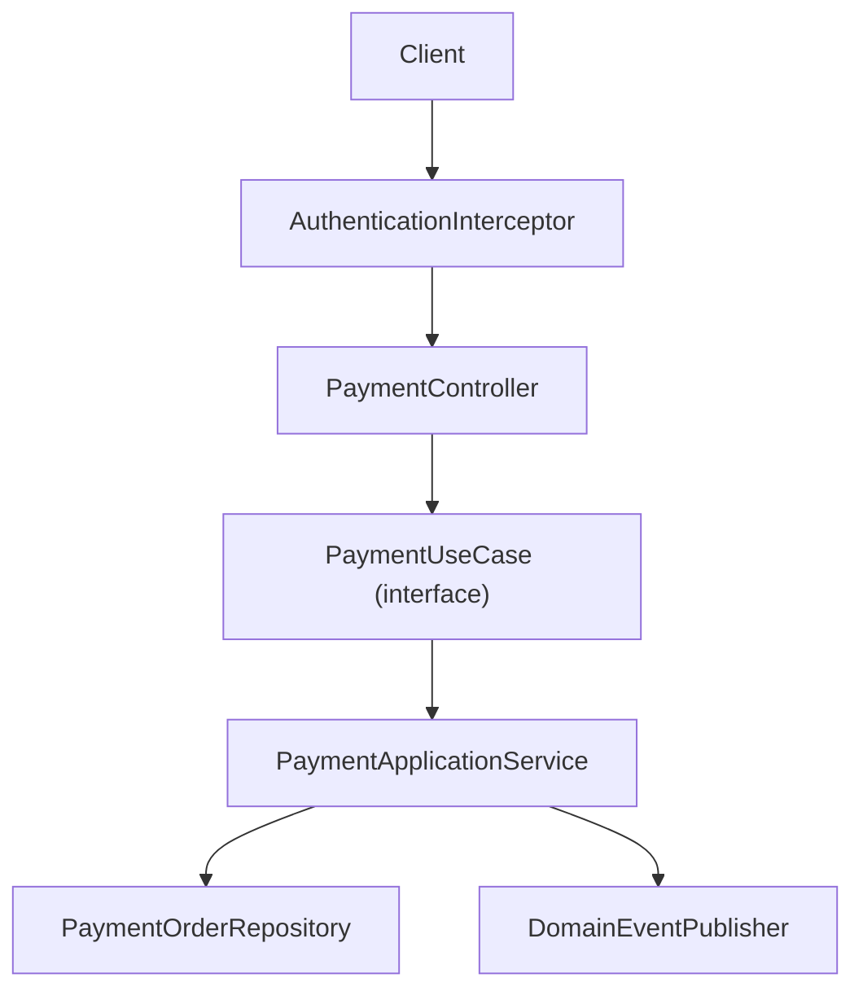
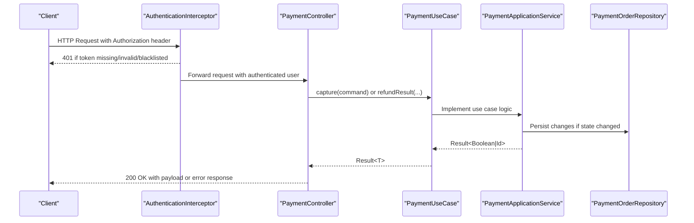
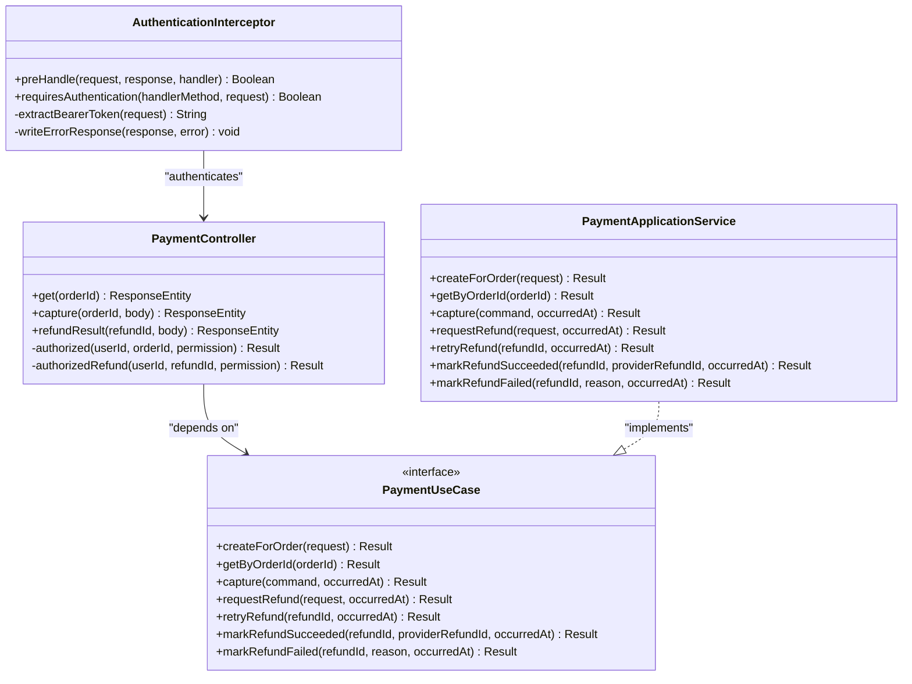

# Payment API Endpoints

<cite>
**Referenced Files in This Document**
- [PaymentController.kt](file://j-store-payment-boot/src/main/kotlin/com/jstore/payment/controller/PaymentController.kt)
- [PaymentUseCase.kt](file://j-store-payment-application/src/main/kotlin/com/jstore/payment/service/PaymentUseCase.kt)
- [PaymentApplicationService.kt](file://j-store-payment-application/src/main/kotlin/com/jstore/payment/service/PaymentApplicationService.kt)
- [PaymentErrors.kt](file://j-store-payment-domain/src/main/kotlin/com/jstore/payment/domain/payment/PaymentErrors.kt)
- [AuthenticationInterceptor.kt](file://j-store-authentication-spring-sdk/src/main/kotlin/com/jstore/authentication/spring/AuthenticationInterceptor.kt)
- [RequireLogin.kt](file://j-store-authentication-spring-sdk/src/main/kotlin/com/jstore/authentication/annotation/RequireLogin.kt)
- [CurrentUserId.kt](file://j-store-authentication-spring-sdk/src/main/kotlin/com/jstore/authentication/annotation/CurrentUserId.kt)
</cite>

## Table of Contents
1. Introduction
2. Project Structure
3. Core Components
4. Architecture Overview
5. Detailed Component Analysis
6. Dependency Analysis
7. Performance Considerations
8. Troubleshooting Guide
9. Conclusion

## Introduction
This document provides API documentation for payment processing endpoints exposed by the payment module. It covers HTTP methods, URL patterns, request/response schemas, authentication and merchant authorization requirements, error codes, validation rules, and response formatting standards. The scope includes payment capture, refund result updates, and payment status queries.

## Project Structure
The payment API is implemented as a Spring REST controller with application use cases and domain error definitions:
- Controller layer defines HTTP endpoints and request/response DTOs.
- Application service implements business logic for capture and refund operations.
- Domain errors define standardized error codes and HTTP status mappings.
- Authentication middleware enforces login and token handling.

**Diagram sources**
- [PaymentController.kt](file://j-store-payment-boot/src/main/kotlin/com/jstore/payment/controller/PaymentController.kt)
- [PaymentUseCase.kt](file://j-store-payment-application/src/main/kotlin/com/jstore/payment/service/PaymentUseCase.kt)
- [PaymentApplicationService.kt](file://j-store-payment-application/src/main/kotlin/com/jstore/payment/service/PaymentApplicationService.kt)
- [AuthenticationInterceptor.kt](file://j-store-authentication-spring-sdk/src/main/kotlin/com/jstore/authentication/spring/AuthenticationInterceptor.kt)

**Section sources**
- [PaymentController.kt](file://j-store-payment-boot/src/main/kotlin/com/jstore/payment/controller/PaymentController.kt)
- [PaymentUseCase.kt](file://j-store-payment-application/src/main/kotlin/com/jstore/payment/service/PaymentUseCase.kt)
- [PaymentApplicationService.kt](file://j-store-payment-application/src/main/kotlin/com/jstore/payment/service/PaymentApplicationService.kt)
- [AuthenticationInterceptor.kt](file://j-store-authentication-spring-sdk/src/main/kotlin/com/jstore/authentication/spring/AuthenticationInterceptor.kt)

## Core Components
- PaymentController: Exposes REST endpoints under /api/payments with login-required behavior and merchant permission checks.
- PaymentUseCase: Defines application-level operations for creating payments, capturing payments, requesting refunds, retrying refunds, and marking refund outcomes.
- PaymentApplicationService: Implements use case logic including persistence and event publishing.
- PaymentErrors: Centralized error definitions with human-readable messages, machine-readable error codes, and HTTP status codes.
- AuthenticationInterceptor: Enforces authentication via Bearer tokens and populates authenticated user context.

Key responsibilities:
- Input validation and mapping to domain commands.
- Merchant authorization based on user ID and resource ownership.
- State transitions for capture and refund lifecycle.
- Consistent error responses with standardized schema.

**Section sources**
- [PaymentController.kt](file://j-store-payment-boot/src/main/kotlin/com/jstore/payment/controller/PaymentController.kt)
- [PaymentUseCase.kt](file://j-store-payment-application/src/main/kotlin/com/jstore/payment/service/PaymentUseCase.kt)
- [PaymentApplicationService.kt](file://j-store-payment-application/src/main/kotlin/com/jstore/payment/service/PaymentApplicationService.kt)
- [PaymentErrors.kt](file://j-store-payment-domain/src/main/kotlin/com/jstore/payment/domain/payment/PaymentErrors.kt)
- [AuthenticationInterceptor.kt](file://j-store-authentication-spring-sdk/src/main/kotlin/com/jstore/authentication/spring/AuthenticationInterceptor.kt)

## Architecture Overview
The payment API follows a layered architecture:
- HTTP layer: Spring REST controller handles requests and responses.
- Application layer: Use case interface and implementation orchestrate business operations.
- Domain layer: Error definitions and repository abstractions encapsulate business rules and persistence.
- Security layer: Authentication interceptor validates tokens and sets user context.

**Diagram sources**
- [PaymentController.kt](file://j-store-payment-boot/src/main/kotlin/com/jstore/payment/controller/PaymentController.kt)
- [PaymentUseCase.kt](file://j-store-payment-application/src/main/kotlin/com/jstore/payment/service/PaymentUseCase.kt)
- [PaymentApplicationService.kt](file://j-store-payment-application/src/main/kotlin/com/jstore/payment/service/PaymentApplicationService.kt)
- [AuthenticationInterceptor.kt](file://j-store-authentication-spring-sdk/src/main/kotlin/com/jstore/authentication/spring/AuthenticationInterceptor.kt)

## Detailed Component Analysis

### Authentication and Authorization
- All endpoints require login via @RequireLogin annotation at class level.
- User identity is injected via @CurrentUserId parameter.
- Merchant authorization is enforced using MerchantAuthorizationService with specific permissions:
  - PAYMENT_READ for querying payment status.
  - PAYMENT_MANAGE for capture and refund operations.
- AuthenticationInterceptor validates Bearer tokens, checks blacklist, and sets AuthenticatedUserContext.

Request flow:
1. Client sends request with Authorization: Bearer <token>.
2. Interceptor extracts and validates token.
3. If valid, user ID is set in context and request proceeds.
4. Controller performs merchant authorization check before processing.

**Section sources**
- [PaymentController.kt](file://j-store-payment-boot/src/main/kotlin/com/jstore/payment/controller/PaymentController.kt)
- [AuthenticationInterceptor.kt](file://j-store-authentication-spring-sdk/src/main/kotlin/com/jstore/authentication/spring/AuthenticationInterceptor.kt)
- [RequireLogin.kt](file://j-store-authentication-spring-sdk/src/main/kotlin/com/jstore/authentication/annotation/RequireLogin.kt)
- [CurrentUserId.kt](file://j-store-authentication-spring-sdk/src/main/kotlin/com/jstore/authentication/annotation/CurrentUserId.kt)

### Payment Status Query
- Endpoint: GET /api/payments/orders/{orderId}
- Purpose: Retrieve payment order details including status, amount, currency, and refund information.
- Authentication: Requires valid Bearer token and PAYMENT_READ permission for the merchant.
- Path parameters:
  - orderId: Long value identifying the payment order.
- Response schema:
  - id: Long - Payment order ID
  - orderId: Long - Associated order ID
  - merchantId: Long - Merchant ID
  - payableAmount: Long - Amount in smallest currency unit (e.g., cents/fen)
  - currency: String - Currency code (e.g., "CNY")
  - status: String - Payment status name
  - providerTransactionId: String? - Provider transaction ID if captured
  - refunds: Array of RefundResponse objects

RefundResponse schema:
- id: Long - Refund ID
- afterSaleId: Long - Associated after-sale ID
- amount: Long - Refund amount in smallest currency unit
- status: String - Refund status name
- failureReason: String? - Failure reason if failed

Error responses:
- 404: Payment.Order.NotFound - Payment order not found
- 403: Unauthorized access due to insufficient merchant permissions

**Section sources**
- [PaymentController.kt](file://j-store-payment-boot/src/main/kotlin/com/jstore/payment/controller/PaymentController.kt)
- [PaymentErrors.kt](file://j-store-payment-domain/src/main/kotlin/com/jstore/payment/domain/payment/PaymentErrors.kt)

### Payment Capture
- Endpoint: POST /api/payments/orders/{orderId}/capture
- Purpose: Capture payment using provider transaction details.
- Authentication: Requires valid Bearer token and PAYMENT_MANAGE permission for the merchant.
- Path parameters:
  - orderId: Long value identifying the payment order.
- Request body schema:
  - providerTransactionId: String - Provider's transaction identifier
  - amount: Long - Captured amount in smallest currency unit
  - currency: String - Currency code (default: "CNY")
- Response schema:
  - changed: Boolean - Indicates if payment state was modified
- Validation rules:
  - Amount must match expected payable amount
  - Currency must be consistent with payment order
  - Provider transaction ID must be unique per payment order
- Error responses:
  - 404: Payment.Order.NotFound - Payment order not found
  - 409: Payment.Capture.Invalid - Invalid capture data
  - 409: Payment.Capture.Conflict - Duplicate capture attempt

Processing flow:
1. Validate merchant authorization for the payment order.
2. Execute capture command through use case.
3. Update payment state if successful.
4. Return boolean indicating state change.

**Section sources**
- [PaymentController.kt](file://j-store-payment-boot/src/main/kotlin/com/jstore/payment/controller/PaymentController.kt)
- [PaymentApplicationService.kt](file://j-store-payment-application/src/main/kotlin/com/jstore/payment/service/PaymentApplicationService.kt)
- [PaymentErrors.kt](file://j-store-payment-domain/src/main/kotlin/com/jstore/payment/domain/payment/PaymentErrors.kt)

### Refund Result Update
- Endpoint: POST /api/payments/refunds/{refundId}/result
- Purpose: Update refund status based on provider result (success or failure).
- Authentication: Requires valid Bearer token and PAYMENT_MANAGE permission for the merchant.
- Path parameters:
  - refundId: Long value identifying the refund.
- Request body schema:
  - providerRefundId: String? - Provider's refund identifier (for success)
  - failureReason: String? - Reason for failure (when no providerRefundId)
- Response schema:
  - changed: Boolean - Indicates if refund state was modified
- Validation rules:
  - Either providerRefundId or failureReason must be provided
  - Refund must exist and belong to authorized merchant
- Error responses:
  - 404: Payment.Refund.NotFound - Refund not found
  - 409: Payment.Refund.ProviderConflict - Duplicate provider refund ID

Processing flow:
1. Validate merchant authorization for the refund.
2. Determine operation type based on request body.
3. Mark refund as succeeded or failed accordingly.
4. Return boolean indicating state change.

**Section sources**
- [PaymentController.kt](file://j-store-payment-boot/src/main/kotlin/com/jstore/payment/controller/PaymentController.kt)
- [PaymentApplicationService.kt](file://j-store-payment-application/src/main/kotlin/com/jstore/payment/service/PaymentApplicationService.kt)
- [PaymentErrors.kt](file://j-store-payment-domain/src/main/kotlin/com/jstore/payment/domain/payment/PaymentErrors.kt)

### Payment Creation (Use Case Only)
Note: While the PaymentUseCase interface includes createForOrder method, there is no corresponding REST endpoint in PaymentController. This functionality may be exposed through other services or internal APIs.

Use case signature:
- createForOrder(request: PaymentOrderRequest): Result<PaymentOrder, BusinessError>

Request schema:
- orderId: Long - Order identifier
- merchantId: Long - Merchant identifier
- payableAmount: Price - Amount object with fen value and currency
- currency: String - Currency code

**Section sources**
- [PaymentUseCase.kt](file://j-store-payment-application/src/main/kotlin/com/jstore/payment/service/PaymentUseCase.kt)
- [PaymentApplicationService.kt](file://j-store-payment-application/src/main/kotlin/com/jstore/payment/service/PaymentApplicationService.kt)

## Dependency Analysis
The payment system has clear dependency boundaries:
- PaymentController depends on PaymentUseCase interface and MerchantAuthorizationService
- PaymentApplicationService implements PaymentUseCase and depends on PaymentOrderRepository and DomainEventPublisher
- AuthenticationInterceptor depends on TokenProvider, TokenStore, and configuration
- All components use common error types from PaymentErrors

**Diagram sources**
- [PaymentController.kt](file://j-store-payment-boot/src/main/kotlin/com/jstore/payment/controller/PaymentController.kt)
- [PaymentUseCase.kt](file://j-store-payment-application/src/main/kotlin/com/jstore/payment/service/PaymentUseCase.kt)
- [PaymentApplicationService.kt](file://j-store-payment-application/src/main/kotlin/com/jstore/payment/service/PaymentApplicationService.kt)
- [AuthenticationInterceptor.kt](file://j-store-authentication-spring-sdk/src/main/kotlin/com/jstore/authentication/spring/AuthenticationInterceptor.kt)

**Section sources**
- [PaymentController.kt](file://j-store-payment-boot/src/main/kotlin/com/jstore/payment/controller/PaymentController.kt)
- [PaymentUseCase.kt](file://j-store-payment-application/src/main/kotlin/com/jstore/payment/service/PaymentUseCase.kt)
- [PaymentApplicationService.kt](file://j-store-payment-application/src/main/kotlin/com/jstore/payment/service/PaymentApplicationService.kt)
- [AuthenticationInterceptor.kt](file://j-store-authentication-spring-sdk/src/main/kotlin/com/jstore/authentication/spring/AuthenticationInterceptor.kt)

## Performance Considerations
- Database operations are optimized with repository pattern for efficient data access.
- Event publishing uses outbox pattern for reliable async processing.
- Authentication checks are performed once per request via interceptor.
- Merchant authorization is cached where possible to reduce overhead.
- Response serialization is handled efficiently with minimal object creation.

[No sources needed since this section provides general guidance]

## Troubleshooting Guide
Common issues and their resolutions:

Authentication failures:
- Missing Authorization header: Ensure client sends Bearer token
- Invalid token format: Verify JWT token structure and signing
- Blacklisted token: Check token revocation status

Merchant authorization errors:
- Insufficient permissions: Verify user has required merchant role
- Wrong merchant context: Ensure user belongs to correct merchant

Business validation errors:
- Payment not found: Verify orderId exists and is accessible
- Capture conflicts: Check for duplicate provider transaction IDs
- Refund not found: Confirm refundId validity and merchant ownership

Error response format:
All errors follow consistent schema:
{
  "message": "Human-readable error description",
  "errorCode": "Machine-readable error code"
}

HTTP status codes:
- 200: Success
- 401: Authentication failure
- 403: Authorization failure  
- 404: Resource not found
- 409: Business conflict/validation error

**Section sources**
- [PaymentErrors.kt](file://j-store-payment-domain/src/main/kotlin/com/jstore/payment/domain/payment/PaymentErrors.kt)
- [AuthenticationInterceptor.kt](file://j-store-authentication-spring-sdk/src/main/kotlin/com/jstore/authentication/spring/AuthenticationInterceptor.kt)

## Conclusion
The payment API provides secure, well-structured endpoints for payment capture and refund management. The system enforces strong authentication and merchant authorization while maintaining clean separation of concerns across layers. Standardized error handling and response formats ensure predictable client integration. The modular design supports future enhancements while maintaining backward compatibility.

[No sources needed since this section summarizes without analyzing specific files]