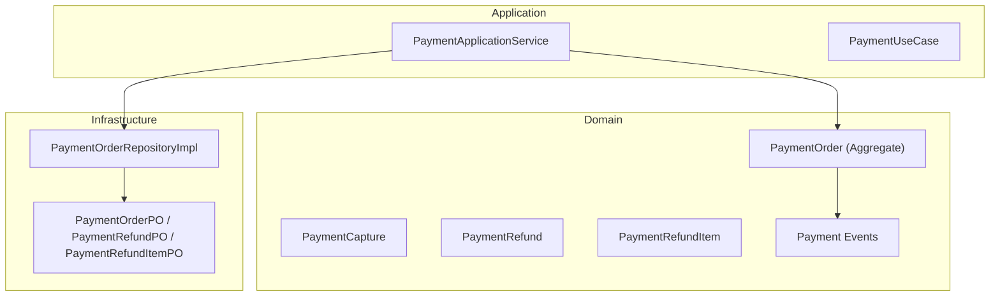
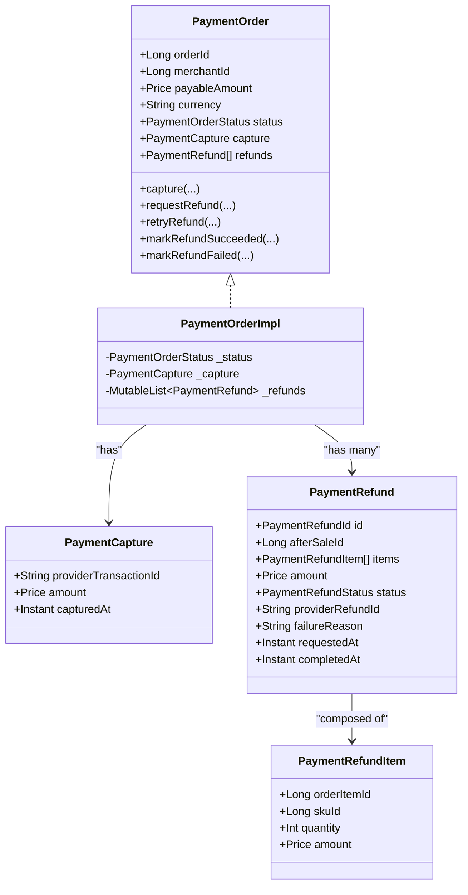
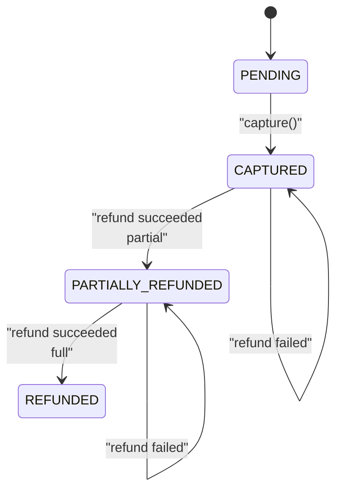
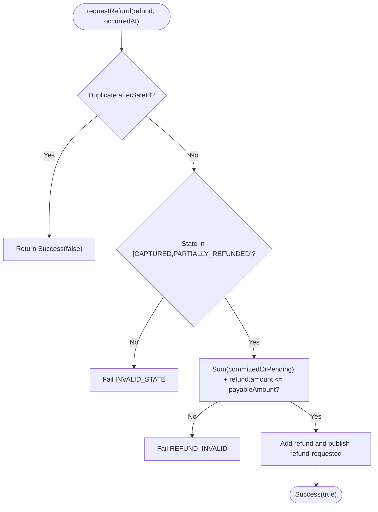
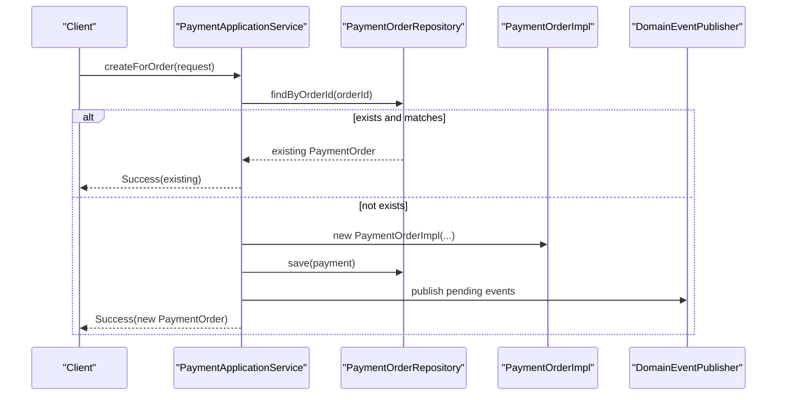
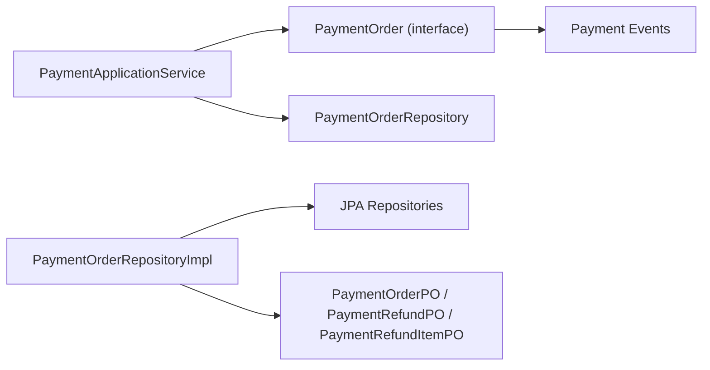

# Payment Domain Model

<cite>
**Referenced Files in This Document**
- [PaymentOrder.kt](file://j-store-payment-domain/src/main/kotlin/com/jstore/payment/domain/payment/PaymentOrder.kt)
- [PaymentOrderImpl.kt](file://j-store-payment-domain/src/main/kotlin/com/jstore/payment/domain/payment/PaymentOrderImpl.kt)
- [PaymentErrors.kt](file://j-store-payment-domain/src/main/kotlin/com/jstore/payment/domain/payment/PaymentErrors.kt)
- [PaymentEvents.kt](file://j-store-payment-domain/src/main/kotlin/com/jstore/payment/domain/payment/event/PaymentEvents.kt)
- [PaymentOrderRepository.kt](file://j-store-payment-domain/src/main/kotlin/com/jstore/payment/domain/payment/PaymentOrderRepository.kt)
- [PaymentOrderPO.kt](file://j-store-payment-infrastructure/src/main/kotlin/com/jstore/payment/domain/payment/persistence/PaymentOrderPO.kt)
- [PaymentOrderRepositoryImpl.kt](file://j-store-payment-infrastructure/src/main/kotlin/com/jstore/payment/domain/payment/PaymentOrderRepositoryImpl.kt)
- [PaymentApplicationService.kt](file://j-store-payment-application/src/main/kotlin/com/jstore/payment/service/PaymentApplicationService.kt)
- [PaymentUseCase.kt](file://j-store-payment-application/src/main/kotlin/com/jstore/payment/service/PaymentUseCase.kt)
- [PaymentOrderTest.kt](file://j-store-payment-domain/src/test/kotlin/com/jstore/payment/domain/payment/PaymentOrderTest.kt)
</cite>

## Table of Contents
1. Introduction
2. Project Structure
3. Core Components
4. Architecture Overview
5. Detailed Component Analysis
6. Dependency Analysis
7. Performance Considerations
8. Troubleshooting Guide
9. Conclusion

## Introduction
This document explains the Payment domain model with a focus on the PaymentOrder aggregate, its lifecycle states (PENDING, CAPTURED, PARTIALLY_REFUNDED, REFUNDED), and core entities PaymentCapture and PaymentRefund. It details how payment orders are created, captured, refunded, retried, and finalized, including business rules and validation constraints. It also clarifies the relationship between payment orders and refund processing and shows concrete examples of state transitions and event emissions.

## Project Structure
The Payment domain is implemented across three layers:
- Domain layer: defines aggregates, entities, enums, errors, and events
- Application layer: orchestrates use cases, persists changes, and publishes domain events
- Infrastructure layer: maps domain objects to persistence models and provides repository implementations

**Diagram sources**
- [PaymentOrder.kt:1-94](file://j-store-payment-domain/src/main/kotlin/com/jstore/payment/domain/payment/PaymentOrder.kt#L1-L94)
- [PaymentOrderImpl.kt:1-192](file://j-store-payment-domain/src/main/kotlin/com/jstore/payment/domain/payment/PaymentOrderImpl.kt#L1-L192)
- [PaymentEvents.kt:1-74](file://j-store-payment-domain/src/main/kotlin/com/jstore/payment/domain/payment/event/PaymentEvents.kt#L1-L74)
- [PaymentApplicationService.kt:1-170](file://j-store-payment-application/src/main/kotlin/com/jstore/payment/service/PaymentApplicationService.kt#L1-L170)
- [PaymentOrderRepositoryImpl.kt:1-112](file://j-store-payment-infrastructure/src/main/kotlin/com/jstore/payment/domain/payment/PaymentOrderRepositoryImpl.kt#L1-L112)
- [PaymentOrderPO.kt:1-73](file://j-store-payment-infrastructure/src/main/kotlin/com/jstore/payment/domain/payment/persistence/PaymentOrderPO.kt#L1-L73)

**Section sources**
- [PaymentOrder.kt:1-94](file://j-store-payment-domain/src/main/kotlin/com/jstore/payment/domain/payment/PaymentOrder.kt#L1-L94)
- [PaymentOrderImpl.kt:1-192](file://j-store-payment-domain/src/main/kotlin/com/jstore/payment/domain/payment/PaymentOrderImpl.kt#L1-L192)
- [PaymentApplicationService.kt:1-170](file://j-store-payment-application/src/main/kotlin/com/jstore/payment/service/PaymentApplicationService.kt#L1-L170)
- [PaymentOrderRepositoryImpl.kt:1-112](file://j-store-payment-infrastructure/src/main/kotlin/com/jstore/payment/domain/payment/PaymentOrderRepositoryImpl.kt#L1-L112)
- [PaymentOrderPO.kt:1-73](file://j-store-payment-infrastructure/src/main/kotlin/com/jstore/payment/domain/payment/persistence/PaymentOrderPO.kt#L1-L73)

## Core Components
- PaymentOrder aggregate: owns orderId, merchantId, payableAmount, currency, status, capture, and refunds; enforces lifecycle transitions and business rules
- PaymentCapture: immutable record of provider transaction id, amount, and timestamp
- PaymentRefund: represents a refund request tied to an after-sale id, containing items and total amount, with status transitions
- PaymentRefundItem: line-level detail for refund composition (order item id, sku id, quantity, amount)
- Domain events: payment.captured, payment.refund-requested, payment.refund-succeeded, payment.refund-failed

Key attributes and relationships:
- PaymentOrder.payableAmount is the maximum refundable sum across succeeded refunds
- PaymentRefund.amount must equal the sum of its items
- Refunds are identified by unique afterSaleId per payment order
- Capture is idempotent by providerTransactionId

**Section sources**
- [PaymentOrder.kt:11-60](file://j-store-payment-domain/src/main/kotlin/com/jstore/payment/domain/payment/PaymentOrder.kt#L11-L60)
- [PaymentOrderImpl.kt:15-37](file://j-store-payment-domain/src/main/kotlin/com/jstore/payment/domain/payment/PaymentOrderImpl.kt#L15-L37)
- [PaymentEvents.kt:12-74](file://j-store-payment-domain/src/main/kotlin/com/jstore/payment/domain/payment/event/PaymentEvents.kt#L12-L74)

## Architecture Overview
The Payment domain follows DDD patterns:
- Aggregate root: PaymentOrderImpl encapsulates state and behavior
- Repository abstraction: PaymentOrderRepository with find-by-order-id and find-by-refund-id
- Application service: PaymentApplicationService coordinates commands, persistence, and event publishing
- Persistence mapping: PaymentOrderRepositoryImpl converts between domain and POs

**Diagram sources**
- [PaymentOrder.kt:28-60](file://j-store-payment-domain/src/main/kotlin/com/jstore/payment/domain/payment/PaymentOrder.kt#L28-L60)
- [PaymentOrderImpl.kt:15-37](file://j-store-payment-domain/src/main/kotlin/com/jstore/payment/domain/payment/PaymentOrderImpl.kt#L15-L37)

## Detailed Component Analysis

### PaymentOrder Aggregate Lifecycle and States
Lifecycle states:
- PENDING: initial state after creation
- CAPTURED: after successful capture with matching amount and currency
- PARTIALLY_REFUNDED: when at least one refund succeeds but total refunded < payableAmount
- REFUNDED: when total refunded equals payableAmount

State transitions:
- PENDING → CAPTURED via capture()
- CAPTURED or PARTIALLY_REFUNDED → refund operations (request, retry, mark success/failure)
- PARTIALLY_REFUNDED → REFUNDED when cumulative succeeded refunds reach payableAmount

Validation and business rules:
- Creation requires positive orderId, merchantId, payableAmount, and valid 3-letter currency code
- capture() requires PENDING state, exact amount match, matching currency, non-blank providerTransactionId; idempotent by providerTransactionId
- requestRefund() validates no duplicate afterSaleId, ensures state allows refund, and that cumulative committed/pending refund amounts do not exceed payableAmount
- retryRefund() allowed only for FAILED refunds; resets to PENDING
- markRefundSucceeded() transitions refund to SUCCEEDED, updates payment status accordingly, and emits event
- markRefundFailed() transitions refund to FAILED with reason

**Diagram sources**
- [PaymentOrderImpl.kt:39-176](file://j-store-payment-domain/src/main/kotlin/com/jstore/payment/domain/payment/PaymentOrderImpl.kt#L39-L176)

**Section sources**
- [PaymentOrder.kt:15-26](file://j-store-payment-domain/src/main/kotlin/com/jstore/payment/domain/payment/PaymentOrder.kt#L15-L26)
- [PaymentOrderImpl.kt:39-176](file://j-store-payment-domain/src/main/kotlin/com/jstore/payment/domain/payment/PaymentOrderImpl.kt#L39-L176)

### PaymentCapture Entity
- Immutable record capturing providerTransactionId, amount, and capturedAt
- Enforced during capture(): amount must equal payableAmount, currency must match, and providerTransactionId must be non-blank
- Idempotency: repeated capture with same providerTransactionId and amount returns no-op without error

**Section sources**
- [PaymentOrder.kt:28-32](file://j-store-payment-domain/src/main/kotlin/com/jstore/payment/domain/payment/PaymentOrder.kt#L28-L32)
- [PaymentOrderImpl.kt:39-73](file://j-store-payment-domain/src/main/kotlin/com/jstore/payment/domain/payment/PaymentOrderImpl.kt#L39-L73)

### PaymentRefund Entity and Items
- PaymentRefund ties to afterSaleId (unique per payment order), contains list of PaymentRefundItem, and total amount
- PaymentRefundItem includes orderItemId, skuId, quantity, and amount; validated to be positive and amount > zero
- PaymentRefund.amount must equal sum of items.amount
- Status transitions: PENDING → SUCCEEDED or FAILED; FAILED can be retried back to PENDING
- On success, payment order status moves to PARTIALLY_REFUNDED or REFUNDED based on cumulative refunded amount

**Diagram sources**
- [PaymentOrderImpl.kt:75-97](file://j-store-payment-domain/src/main/kotlin/com/jstore/payment/domain/payment/PaymentOrderImpl.kt#L75-L97)

**Section sources**
- [PaymentOrder.kt:34-60](file://j-store-payment-domain/src/main/kotlin/com/jstore/payment/domain/payment/PaymentOrder.kt#L34-L60)
- [PaymentOrderImpl.kt:75-97](file://j-store-payment-domain/src/main/kotlin/com/jstore/payment/domain/payment/PaymentOrderImpl.kt#L75-L97)

### Domain Events
- payment.captured: emitted on successful capture
- payment.refund-requested: emitted when a refund is requested or retried
- payment.refund-succeeded: emitted on refund success, includes items and final amount
- payment.refund-failed: emitted on refund failure with reason

These events are raised by the aggregate and published through the application layer.

**Section sources**
- [PaymentEvents.kt:25-74](file://j-store-payment-domain/src/main/kotlin/com/jstore/payment/domain/payment/event/PaymentEvents.kt#L25-L74)
- [PaymentOrderImpl.kt:61-73](file://j-store-payment-domain/src/main/kotlin/com/jstore/payment/domain/payment/PaymentOrderImpl.kt#L61-L73)
- [PaymentOrderImpl.kt:178-190](file://j-store-payment-domain/src/main/kotlin/com/jstore/payment/domain/payment/PaymentOrderImpl.kt#L178-L190)

### Application Use Cases and Business Rules
- createForOrder(): prevents duplicates by orderId; if existing matches merchantId, payableAmount, and currency, returns existing; otherwise fails with conflict
- capture(): loads payment by orderId, delegates to aggregate capture(), persists and publishes if changed
- requestRefund(): constructs PaymentRefund with generated id, validates via aggregate, persists and publishes
- retryRefund()/markRefundSucceeded()/markRefundFailed(): locate payment by refundId, mutate refund, persist and publish if changed

**Diagram sources**
- [PaymentApplicationService.kt:49-70](file://j-store-payment-application/src/main/kotlin/com/jstore/payment/service/PaymentApplicationService.kt#L49-L70)

**Section sources**
- [PaymentApplicationService.kt:49-170](file://j-store-payment-application/src/main/kotlin/com/jstore/payment/service/PaymentApplicationService.kt#L49-L170)
- [PaymentUseCase.kt:9-43](file://j-store-payment-application/src/main/kotlin/com/jstore/payment/service/PaymentUseCase.kt#L9-L43)

### Concrete Examples of Payment Creation and State Transitions
- Create payment for order:
  - Input: orderId, merchantId, payableAmount, currency
  - Behavior: if duplicate with same merchant/amount/currency, return existing; otherwise create PENDING and publish events
- Capture payment:
  - Input: orderId, providerTransactionId, amount, currency
  - Validation: state must be PENDING; amount must equal payableAmount; currency must match; idempotent by providerTransactionId
  - Outcome: status becomes CAPTURED; emit payment.captured
- Request refund:
  - Input: orderId, afterSaleId, items, amount
  - Validation: no duplicate afterSaleId; state must allow refund; cumulative refund amounts must not exceed payableAmount
  - Outcome: refund added with PENDING; emit payment.refund-requested
- Mark refund succeeded:
  - Input: refundId, providerRefundId
  - Validation: refund must be PENDING; providerRefundId non-blank
  - Outcome: refund SUCCEEDED; payment status updated to PARTIALLY_REFUNDED or REFUNDED; emit payment.refund-succeeded
- Retry failed refund:
  - Input: refundId
  - Validation: refund must be FAILED
  - Outcome: reset to PENDING; emit payment.refund-requested

These flows are verified in tests demonstrating idempotency and status transitions.

**Section sources**
- [PaymentApplicationService.kt:49-170](file://j-store-payment-application/src/main/kotlin/com/jstore/payment/service/PaymentApplicationService.kt#L49-L170)
- [PaymentOrderTest.kt:12-54](file://j-store-payment-domain/src/test/kotlin/com/jstore/payment/domain/payment/PaymentOrderTest.kt#L12-L54)

## Dependency Analysis
- Domain depends on common framework types (AggregateRoot, Price, Result)
- Application depends on domain interfaces and uses SnowFlakSequence for IDs
- Infrastructure depends on JPA entities and maps to/from domain objects
- Repository interface abstracts persistence; implementation handles conversion and transactions

**Diagram sources**
- [PaymentApplicationService.kt:44-48](file://j-store-payment-application/src/main/kotlin/com/jstore/payment/service/PaymentApplicationService.kt#L44-L48)
- [PaymentOrderRepository.kt:1-10](file://j-store-payment-domain/src/main/kotlin/com/jstore/payment/domain/payment/PaymentOrderRepository.kt#L1-L10)
- [PaymentOrderRepositoryImpl.kt:1-112](file://j-store-payment-infrastructure/src/main/kotlin/com/jstore/payment/domain/payment/PaymentOrderRepositoryImpl.kt#L1-L112)
- [PaymentOrderPO.kt:1-73](file://j-store-payment-infrastructure/src/main/kotlin/com/jstore/payment/domain/payment/persistence/PaymentOrderPO.kt#L1-L73)

**Section sources**
- [PaymentOrderRepository.kt:1-10](file://j-store-payment-domain/src/main/kotlin/com/jstore/payment/domain/payment/PaymentOrderRepository.kt#L1-L10)
- [PaymentOrderRepositoryImpl.kt:1-112](file://j-store-payment-infrastructure/src/main/kotlin/com/jstore/payment/domain/payment/PaymentOrderRepositoryImpl.kt#L1-L112)

## Performance Considerations
- Capture idempotency avoids redundant writes and ensures safety under retries
- Refund requests guard against over-refunding by summing committed/pending amounts before adding new refund
- Eager loading of refunds in persistence model simplifies read paths but may increase payload size; consider lazy loading if needed for large datasets
- Event publishing occurs only when state changes, minimizing unnecessary downstream processing

[No sources needed since this section provides general guidance]

## Troubleshooting Guide
Common errors and their causes:
- ORDER_NOT_FOUND: attempting operations on a non-existent payment order
- ORDER_CONFLICT: creating a payment with conflicting merchant/amount/currency for the same orderId
- INVALID_STATE: calling methods in wrong aggregate state (e.g., capture when not PENDING)
- CAPTURE_INVALID: mismatched amount or currency, or blank providerTransactionId
- CAPTURE_CONFLICT: capture attempted with different providerTransactionId than existing capture
- REFUND_INVALID: refund amount exceeds remaining payable amount or invalid items
- REFUND_NOT_FOUND: operating on a refund id that does not exist
- REFUND_PROVIDER_CONFLICT: marking refund succeeded with a different providerRefundId than already set

Resolution strategies:
- Verify existence of payment and refund ids before mutation
- Ensure capture parameters exactly match payableAmount and currency
- For refund failures, use retryRefund to reattempt from FAILED to PENDING
- Inspect domain events to trace state transitions and identify anomalies

**Section sources**
- [PaymentErrors.kt:5-16](file://j-store-payment-domain/src/main/kotlin/com/jstore/payment/domain/payment/PaymentErrors.kt#L5-L16)
- [PaymentOrderImpl.kt:39-176](file://j-store-payment-domain/src/main/kotlin/com/jstore/payment/domain/payment/PaymentOrderImpl.kt#L39-L176)

## Conclusion
The Payment domain model centers on a robust PaymentOrder aggregate that enforces strict lifecycle transitions and business rules around capture and refund processing. PaymentCapture and PaymentRefund provide clear, validated structures for financial operations. The application layer orchestrates use cases while ensuring persistence and event publication. Together, these components deliver a reliable foundation for payment workflows with strong consistency guarantees and clear auditability through domain events.