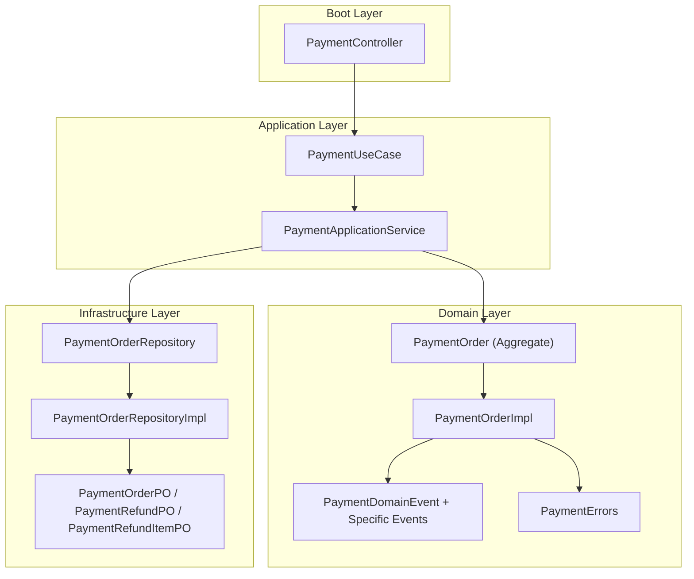
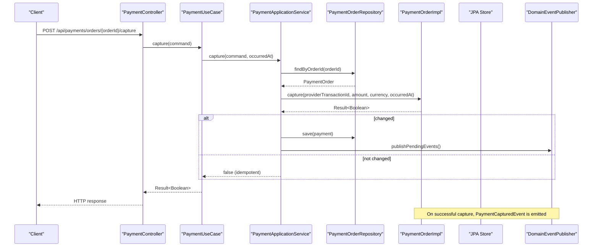
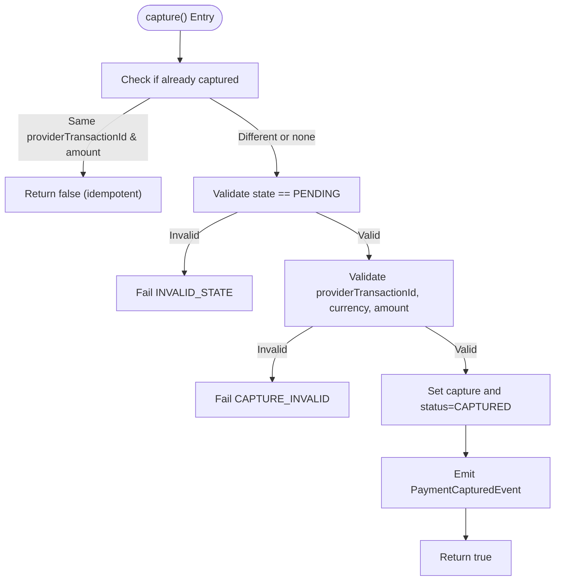
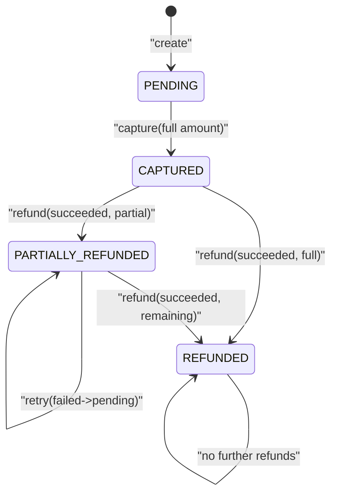
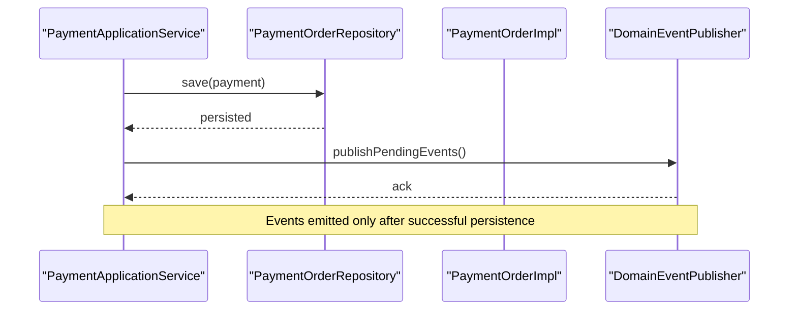
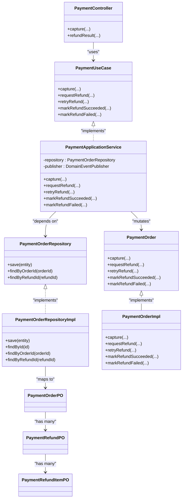

# Payment Lifecycle Management

<cite>
**Referenced Files in This Document**
- [PaymentOrder.kt](file://j-store-payment-domain/src/main/kotlin/com/jstore/payment/domain/payment/PaymentOrder.kt)
- [PaymentOrderImpl.kt](file://j-store-payment-domain/src/main/kotlin/com/jstore/payment/domain/payment/PaymentOrderImpl.kt)
- [PaymentEvents.kt](file://j-store-payment-domain/src/main/kotlin/com/jstore/payment/domain/payment/event/PaymentEvents.kt)
- [PaymentErrors.kt](file://j-store-payment-domain/src/main/kotlin/com/jstore/payment/domain/payment/PaymentErrors.kt)
- [PaymentUseCase.kt](file://j-store-payment-application/src/main/kotlin/com/jstore/payment/service/PaymentUseCase.kt)
- [PaymentApplicationService.kt](file://j-store-payment-application/src/main/kotlin/com/jstore/payment/service/PaymentApplicationService.kt)
- [PaymentOrderRepository.kt](file://j-store-payment-domain/src/main/kotlin/com/jstore/payment/domain/payment/PaymentOrderRepository.kt)
- [PaymentOrderRepositoryImpl.kt](file://j-store-payment-infrastructure/src/main/kotlin/com/jstore/payment/domain/payment/PaymentOrderRepositoryImpl.kt)
- [PaymentOrderPO.kt](file://j-store-payment-infrastructure/src/main/kotlin/com/jstore/payment/domain/payment/persistence/PaymentOrderPO.kt)
- [PaymentController.kt](file://j-store-payment-boot/src/main/kotlin/com/jstore/payment/controller/PaymentController.kt)
- [PaymentOrderTest.kt](file://j-store-payment-domain/src/test/kotlin/com/jstore/payment/domain/payment/PaymentOrderTest.kt)
</cite>

## Table of Contents
1. Introduction
2. Project Structure
3. Core Components
4. Architecture Overview
5. Detailed Component Analysis
6. Dependency Analysis
7. Performance Considerations
8. Troubleshooting Guide
9. Conclusion

## Introduction
This document explains the payment lifecycle management in the project, focusing on:
- Payment capture from PENDING to CAPTURED with provider transaction integration and amount validation
- Complete refund workflow including request, success/failure handling, and retry
- Idempotency guarantees for capture and refund operations
- Error handling strategies and consistent state transitions
- Transaction consistency and audit trail via domain events
- Practical examples for capture with provider transaction IDs, partial refunds with item-level details, and refund retries

## Project Structure
The payment capability is implemented across three layers:
- Domain layer: aggregates, value objects, enums, errors, and domain events
- Application layer: use cases orchestrating repository access and event publishing
- Infrastructure layer: persistence mapping and JPA repositories
- Boot layer: REST endpoints for capture and refund result callbacks

**Diagram sources**
- [PaymentController.kt](file://j-store-payment-boot/src/main/kotlin/com/jstore/payment/controller/PaymentController.kt)
- [PaymentUseCase.kt](file://j-store-payment-application/src/main/kotlin/com/jstore/payment/service/PaymentUseCase.kt)
- [PaymentApplicationService.kt](file://j-store-payment-application/src/main/kotlin/com/jstore/payment/service/PaymentApplicationService.kt)
- [PaymentOrderRepository.kt](file://j-store-payment-domain/src/main/kotlin/com/jstore/payment/domain/payment/PaymentOrderRepository.kt)
- [PaymentOrderRepositoryImpl.kt](file://j-store-payment-infrastructure/src/main/kotlin/com/jstore/payment/domain/payment/PaymentOrderRepositoryImpl.kt)
- [PaymentOrderPO.kt](file://j-store-payment-infrastructure/src/main/kotlin/com/jstore/payment/domain/payment/persistence/PaymentOrderPO.kt)
- [PaymentOrder.kt](file://j-store-payment-domain/src/main/kotlin/com/jstore/payment/domain/payment/PaymentOrder.kt)
- [PaymentOrderImpl.kt](file://j-store-payment-domain/src/main/kotlin/com/jstore/payment/domain/payment/PaymentOrderImpl.kt)
- [PaymentEvents.kt](file://j-store-payment-domain/src/main/kotlin/com/jstore/payment/domain/payment/event/PaymentEvents.kt)
- [PaymentErrors.kt](file://j-store-payment-domain/src/main/kotlin/com/jstore/payment/domain/payment/PaymentErrors.kt)

**Section sources**
- [PaymentController.kt](file://j-store-payment-boot/src/main/kotlin/com/jstore/payment/controller/PaymentController.kt)
- [PaymentUseCase.kt](file://j-store-payment-application/src/main/kotlin/com/jstore/payment/service/PaymentUseCase.kt)
- [PaymentApplicationService.kt](file://j-store-payment-application/src/main/kotlin/com/jstore/payment/service/PaymentApplicationService.kt)
- [PaymentOrderRepository.kt](file://j-store-payment-domain/src/main/kotlin/com/jstore/payment/domain/payment/PaymentOrderRepository.kt)
- [PaymentOrderRepositoryImpl.kt](file://j-store-payment-infrastructure/src/main/kotlin/com/jstore/payment/domain/payment/PaymentOrderRepositoryImpl.kt)
- [PaymentOrderPO.kt](file://j-store-payment-infrastructure/src/main/kotlin/com/jstore/payment/domain/payment/persistence/PaymentOrderPO.kt)
- [PaymentOrder.kt](file://j-store-payment-domain/src/main/kotlin/com/jstore/payment/domain/payment/PaymentOrder.kt)
- [PaymentOrderImpl.kt](file://j-store-payment-domain/src/main/kotlin/com/jstore/payment/domain/payment/PaymentOrderImpl.kt)
- [PaymentEvents.kt](file://j-store-payment-domain/src/main/kotlin/com/jstore/payment/domain/payment/event/PaymentEvents.kt)
- [PaymentErrors.kt](file://j-store-payment-domain/src/main/kotlin/com/jstore/payment/domain/payment/PaymentErrors.kt)

## Core Components
- PaymentOrder aggregate defines states and business rules for capture and refunds
- PaymentOrderImpl implements state transitions, validations, and emits domain events
- PaymentApplicationService orchestrates persistence and event publishing
- Repository interface and implementation map between domain and persistence models
- Controller exposes HTTP endpoints for capture and refund results
- Domain events provide an immutable audit trail for all lifecycle changes

Key responsibilities:
- Capture validates providerTransactionId, currency, and full amount; enforces idempotency by provider transaction
- Refund supports partial amounts with item-level details; tracks status per refund
- Retry allows re-attempting failed refunds
- Success/failure outcomes update order-level status accordingly

**Section sources**
- [PaymentOrder.kt](file://j-store-payment-domain/src/main/kotlin/com/jstore/payment/domain/payment/PaymentOrder.kt)
- [PaymentOrderImpl.kt](file://j-store-payment-domain/src/main/kotlin/com/jstore/payment/domain/payment/PaymentOrderImpl.kt)
- [PaymentApplicationService.kt](file://j-store-payment-application/src/main/kotlin/com/jstore/payment/service/PaymentApplicationService.kt)
- [PaymentOrderRepository.kt](file://j-store-payment-domain/src/main/kotlin/com/jstore/payment/domain/payment/PaymentOrderRepository.kt)
- [PaymentOrderRepositoryImpl.kt](file://j-store-payment-infrastructure/src/main/kotlin/com/jstore/payment/domain/payment/PaymentOrderRepositoryImpl.kt)
- [PaymentController.kt](file://j-store-payment-boot/src/main/kotlin/com/jstore/payment/controller/PaymentController.kt)
- [PaymentEvents.kt](file://j-store-payment-domain/src/main/kotlin/com/jstore/payment/domain/payment/event/PaymentEvents.kt)

## Architecture Overview
The payment lifecycle flows through a layered architecture that ensures strong invariants and an auditable event log.

**Diagram sources**
- [PaymentController.kt](file://j-store-payment-boot/src/main/kotlin/com/jstore/payment/controller/PaymentController.kt)
- [PaymentUseCase.kt](file://j-store-payment-application/src/main/kotlin/com/jstore/payment/service/PaymentUseCase.kt)
- [PaymentApplicationService.kt](file://j-store-payment-application/src/main/kotlin/com/jstore/payment/service/PaymentApplicationService.kt)
- [PaymentOrderRepository.kt](file://j-store-payment-domain/src/main/kotlin/com/jstore/payment/domain/payment/PaymentOrderRepository.kt)
- [PaymentOrderRepositoryImpl.kt](file://j-store-payment-infrastructure/src/main/kotlin/com/jstore/payment/domain/payment/PaymentOrderRepositoryImpl.kt)
- [PaymentOrderImpl.kt](file://j-store-payment-domain/src/main/kotlin/com/jstore/payment/domain/payment/PaymentOrderImpl.kt)
- [PaymentEvents.kt](file://j-store-payment-domain/src/main/kotlin/com/jstore/payment/domain/payment/event/PaymentEvents.kt)

## Detailed Component Analysis

### Payment Capture Process
Capture enforces strict validation and idempotency:
- State must be PENDING
- Amount must equal payableAmount and currency must match
- Provider transaction ID must be non-blank
- If already captured with same providerTransactionId and amount, returns no-op (idempotent)
- Otherwise, transitions to CAPTURED and emits PaymentCapturedEvent

**Diagram sources**
- [PaymentOrderImpl.kt](file://j-store-payment-domain/src/main/kotlin/com/jstore/payment/domain/payment/PaymentOrderImpl.kt)
- [PaymentErrors.kt](file://j-store-payment-domain/src/main/kotlin/com/jstore/payment/domain/payment/PaymentErrors.kt)
- [PaymentEvents.kt](file://j-store-payment-domain/src/main/kotlin/com/jstore/payment/domain/payment/event/PaymentEvents.kt)

Practical example:
- Capture with provider transaction ID "txn-1", amount equal to payableAmount, currency "CNY"
- Subsequent identical capture returns no change (idempotent)

**Section sources**
- [PaymentOrderImpl.kt](file://j-store-payment-domain/src/main/kotlin/com/jstore/payment/domain/payment/PaymentOrderImpl.kt)
- [PaymentOrderTest.kt](file://j-store-payment-domain/src/test/kotlin/com/jstore/payment/domain/payment/PaymentOrderTest.kt)

### Refund Workflow
Refunds support partial amounts with item-level detail and track per-refund status:
- Request: Validates allowed states (CAPTURED or PARTIALLY_REFUNDED), prevents exceeding payableAmount, creates refund record, emits PaymentRefundRequestedEvent
- Mark succeeded: Validates pending state and unique providerRefundId, updates refund status, adjusts order status to PARTIALLY_REFUNDED or REFUNDED, emits PaymentRefundSucceededEvent
- Mark failed: Validates pending state, sets failure reason, emits PaymentRefundFailedEvent
- Retry: Allows re-attempt when refund status is FAILED; resets to PENDING and emits PaymentRefundRequestedEvent

**Diagram sources**
- [PaymentOrder.kt](file://j-store-payment-domain/src/main/kotlin/com/jstore/payment/domain/payment/PaymentOrder.kt)
- [PaymentOrderImpl.kt](file://j-store-payment-domain/src/main/kotlin/com/jstore/payment/domain/payment/PaymentOrderImpl.kt)
- [PaymentEvents.kt](file://j-store-payment-domain/src/main/kotlin/com/jstore/payment/domain/payment/event/PaymentEvents.kt)

Practical examples:
- Partial refund with items: specify orderItemId, skuId, quantity, and amount per item; total must equal refund amount
- Refund retry scenario: after markRefundFailed, call retryRefund to reset to PENDING and reprocess

**Section sources**
- [PaymentOrder.kt](file://j-store-payment-domain/src/main/kotlin/com/jstore/payment/domain/payment/PaymentOrder.kt)
- [PaymentOrderImpl.kt](file://j-store-payment-domain/src/main/kotlin/com/jstore/payment/domain/payment/PaymentOrderImpl.kt)
- [PaymentOrderTest.kt](file://j-store-payment-domain/src/test/kotlin/com/jstore/payment/domain/payment/PaymentOrderTest.kt)

### Idempotency Requirements
- Capture idempotency: Repeated calls with the same providerTransactionId and amount return no change without error
- Refund success idempotency: Repeated markRefundSucceeded with the same providerRefundId returns no change; conflicting providerRefundId fails
- Refund failure idempotency: Repeated markRefundFailed with the same reason returns no change
- Duplicate refund requests: Same afterSaleId cannot be requested twice

These guarantees are enforced within the domain logic and validated before state mutations.

**Section sources**
- [PaymentOrderImpl.kt](file://j-store-payment-domain/src/main/kotlin/com/jstore/payment/domain/payment/PaymentOrderImpl.kt)
- [PaymentErrors.kt](file://j-store-payment-domain/src/main/kotlin/com/jstore/payment/domain/payment/PaymentErrors.kt)

### Error Handling Strategies
- Business errors are modeled with explicit codes and HTTP status mappings
- Invalid state transitions return INVALID_STATE
- Capture invalid inputs return CAPTURE_INVALID
- Conflicts (duplicate capture or provider refund) return conflict errors
- Not found scenarios return appropriate 404 errors

Error types include:
- ORDER_NOT_FOUND, ORDER_CONFLICT
- NOT_FOUND
- INVALID_STATE
- CAPTURE_INVALID, CAPTURE_CONFLICT
- REFUND_INVALID, REFUND_NOT_FOUND, REFUND_PROVIDER_CONFLICT

**Section sources**
- [PaymentErrors.kt](file://j-store-payment-domain/src/main/kotlin/com/jstore/payment/domain/payment/PaymentErrors.kt)
- [PaymentOrderImpl.kt](file://j-store-payment-domain/src/main/kotlin/com/jstore/payment/domain/payment/PaymentOrderImpl.kt)

### Retry Mechanisms
- retryRefund resets a FAILED refund to PENDING and clears failure metadata
- Emits PaymentRefundRequestedEvent to trigger downstream processing again
- Only allowed when current status is FAILED; otherwise returns INVALID_STATE

**Section sources**
- [PaymentOrderImpl.kt](file://j-store-payment-domain/src/main/kotlin/com/jstore/payment/domain/payment/PaymentOrderImpl.kt)

### Transaction Consistency and Audit Trail
- All mutations are persisted within mandatory transactions via repository.save
- Domain events are published after persistence to ensure eventual consistency
- Events provide an immutable audit trail for capture and refund lifecycle
- Persistence uses optimistic versioning on PaymentOrderPO to detect concurrent modifications

**Diagram sources**
- [PaymentApplicationService.kt](file://j-store-payment-application/src/main/kotlin/com/jstore/payment/service/PaymentApplicationService.kt)
- [PaymentOrderRepositoryImpl.kt](file://j-store-payment-infrastructure/src/main/kotlin/com/jstore/payment/domain/payment/PaymentOrderRepositoryImpl.kt)
- [PaymentOrderPO.kt](file://j-store-payment-infrastructure/src/main/kotlin/com/jstore/payment/domain/payment/persistence/PaymentOrderPO.kt)

**Section sources**
- [PaymentApplicationService.kt](file://j-store-payment-application/src/main/kotlin/com/jstore/payment/service/PaymentApplicationService.kt)
- [PaymentOrderRepositoryImpl.kt](file://j-store-payment-infrastructure/src/main/kotlin/com/jstore/payment/domain/payment/PaymentOrderRepositoryImpl.kt)
- [PaymentOrderPO.kt](file://j-store-payment-infrastructure/src/main/kotlin/com/jstore/payment/domain/payment/persistence/PaymentOrderPO.kt)

## Dependency Analysis
The payment module exhibits clear separation of concerns:
- Controller depends on PaymentUseCase for authorization and orchestration
- Application service depends on PaymentOrderRepository and DomainEventPublisher
- Domain aggregate encapsulates business rules and emits events
- Infrastructure maps domain entities to persistence models

**Diagram sources**
- [PaymentController.kt](file://j-store-payment-boot/src/main/kotlin/com/jstore/payment/controller/PaymentController.kt)
- [PaymentUseCase.kt](file://j-store-payment-application/src/main/kotlin/com/jstore/payment/service/PaymentUseCase.kt)
- [PaymentApplicationService.kt](file://j-store-payment-application/src/main/kotlin/com/jstore/payment/service/PaymentApplicationService.kt)
- [PaymentOrderRepository.kt](file://j-store-payment-domain/src/main/kotlin/com/jstore/payment/domain/payment/PaymentOrderRepository.kt)
- [PaymentOrderRepositoryImpl.kt](file://j-store-payment-infrastructure/src/main/kotlin/com/jstore/payment/domain/payment/PaymentOrderRepositoryImpl.kt)
- [PaymentOrder.kt](file://j-store-payment-domain/src/main/kotlin/com/jstore/payment/domain/payment/PaymentOrder.kt)
- [PaymentOrderImpl.kt](file://j-store-payment-domain/src/main/kotlin/com/jstore/payment/domain/payment/PaymentOrderImpl.kt)
- [PaymentOrderPO.kt](file://j-store-payment-infrastructure/src/main/kotlin/com/jstore/payment/domain/payment/persistence/PaymentOrderPO.kt)

**Section sources**
- [PaymentController.kt](file://j-store-payment-boot/src/main/kotlin/com/jstore/payment/controller/PaymentController.kt)
- [PaymentUseCase.kt](file://j-store-payment-application/src/main/kotlin/com/jstore/payment/service/PaymentUseCase.kt)
- [PaymentApplicationService.kt](file://j-store-payment-application/src/main/kotlin/com/jstore/payment/service/PaymentApplicationService.kt)
- [PaymentOrderRepository.kt](file://j-store-payment-domain/src/main/kotlin/com/jstore/payment/domain/payment/PaymentOrderRepository.kt)
- [PaymentOrderRepositoryImpl.kt](file://j-store-payment-infrastructure/src/main/kotlin/com/jstore/payment/domain/payment/PaymentOrderRepositoryImpl.kt)
- [PaymentOrder.kt](file://j-store-payment-domain/src/main/kotlin/com/jstore/payment/domain/payment/PaymentOrder.kt)
- [PaymentOrderImpl.kt](file://j-store-payment-domain/src/main/kotlin/com/jstore/payment/domain/payment/PaymentOrderImpl.kt)
- [PaymentOrderPO.kt](file://j-store-payment-infrastructure/src/main/kotlin/com/jstore/payment/domain/payment/persistence/PaymentOrderPO.kt)

## Performance Considerations
- Capture and refund operations are O(1) state checks plus list scans over refunds; typical refund counts are small
- Persistence uses eager loading of refunds and refund items; consider pagination or lazy loading if refund lists grow large
- Optimistic concurrency control on PaymentOrderPO avoids lost updates under contention
- Event publishing occurs after persistence; ensure downstream consumers are scalable and idempotent

[No sources needed since this section provides general guidance]

## Troubleshooting Guide
Common issues and resolutions:
- Capture fails with INVALID_STATE: Ensure payment is still PENDING before capture
- Capture fails with CAPTURE_INVALID: Verify amount equals payableAmount and currency matches
- Capture conflict: A different providerTransactionId was used for the same payment; reconcile with upstream system
- Refund invalid: Total refund amount exceeds remaining payable amount; adjust items and amounts
- Refund not found: Provide correct refundId; verify lookup path
- Refund provider conflict: Duplicate providerRefundId detected; ensure uniqueness per refund
- Order not found: Confirm orderId exists and user has permission

Operational tips:
- Inspect domain events for audit trail and root cause analysis
- Use retryRefund to recover from transient failures
- Validate merchant permissions at controller layer to avoid unauthorized operations

**Section sources**
- [PaymentErrors.kt](file://j-store-payment-domain/src/main/kotlin/com/jstore/payment/domain/payment/PaymentErrors.kt)
- [PaymentOrderImpl.kt](file://j-store-payment-domain/src/main/kotlin/com/jstore/payment/domain/payment/PaymentOrderImpl.kt)
- [PaymentController.kt](file://j-store-payment-boot/src/main/kotlin/com/jstore/payment/controller/PaymentController.kt)

## Conclusion
The payment lifecycle is implemented with strong domain invariants, idempotency guarantees, and an auditable event-driven design. Capture enforces full amount validation and provider transaction uniqueness, while refunds support partial itemized amounts with robust state transitions and retry capabilities. The layered architecture ensures clear responsibilities, testability, and maintainability, making it suitable for production-grade payment processing.

[No sources needed since this section summarizes without analyzing specific files]