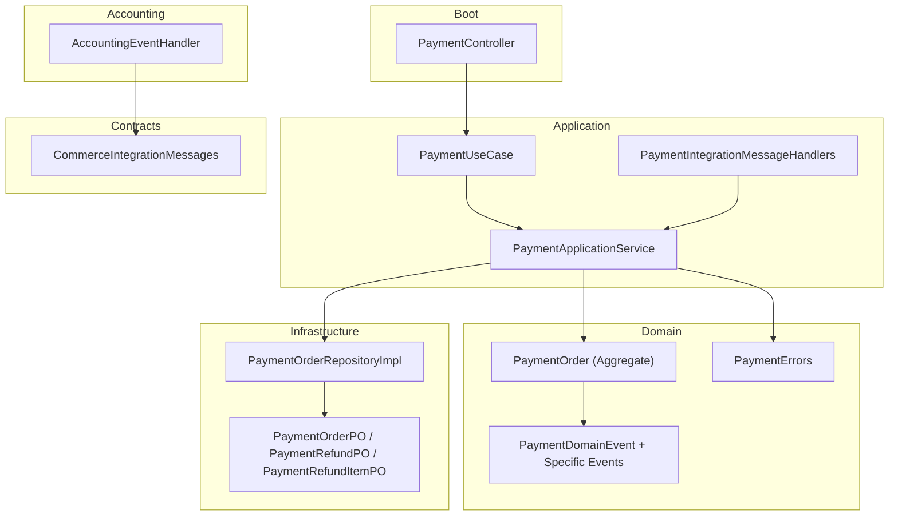
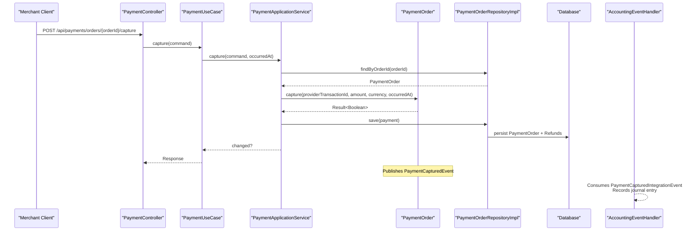
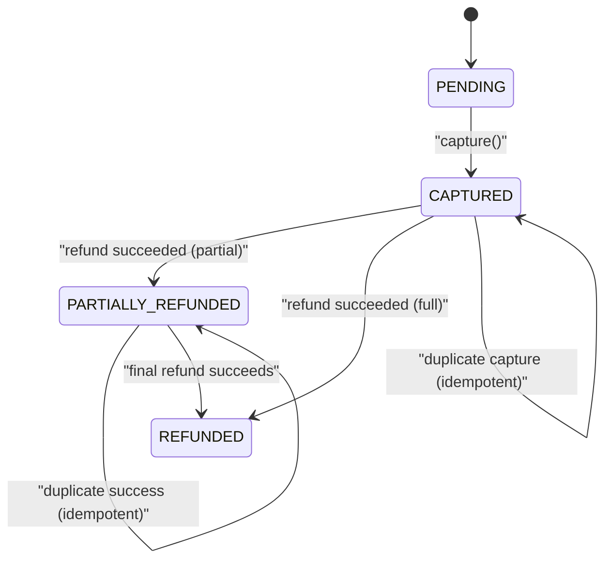
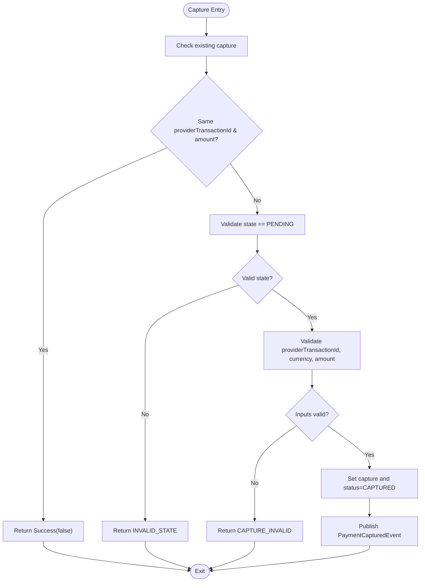
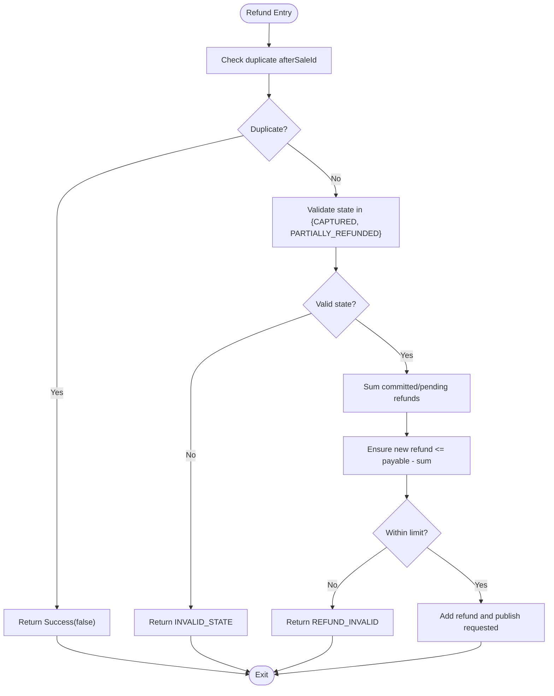
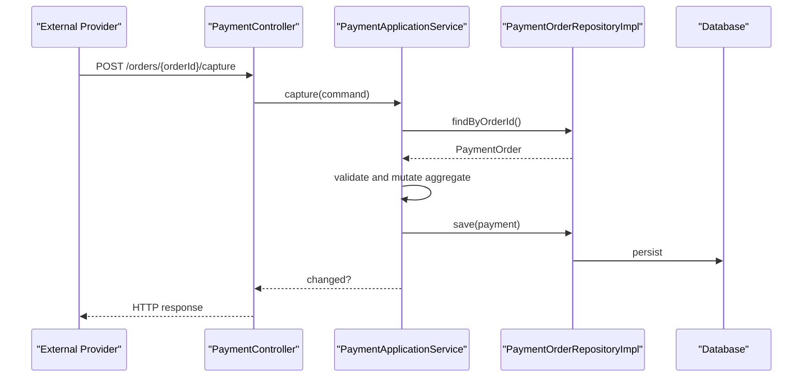
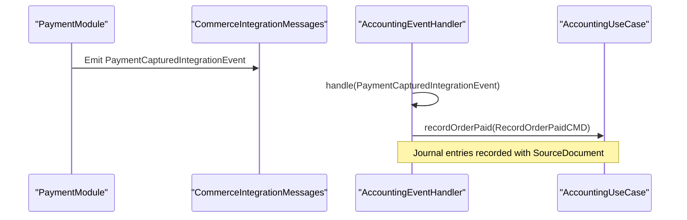
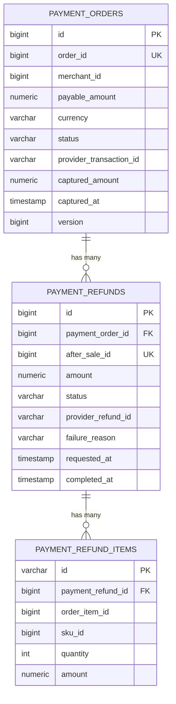
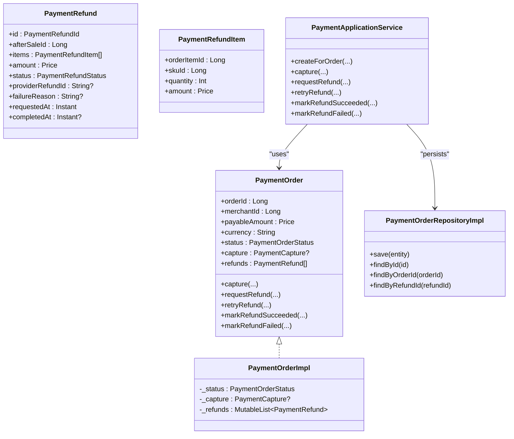
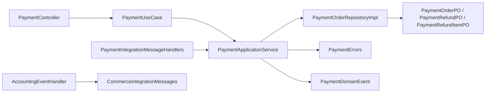

# Payment Processing Module

<cite>
**Referenced Files in This Document**
- [PaymentOrder.kt](file://j-store-payment-domain/src/main/kotlin/com/jstore/payment/domain/payment/PaymentOrder.kt)
- [PaymentOrderImpl.kt](file://j-store-payment-domain/src/main/kotlin/com/jstore/payment/domain/payment/PaymentOrderImpl.kt)
- [PaymentEvents.kt](file://j-store-payment-domain/src/main/kotlin/com/jstore/payment/domain/payment/event/PaymentEvents.kt)
- [PaymentErrors.kt](file://j-store-payment-domain/src/main/kotlin/com/jstore/payment/domain/payment/PaymentErrors.kt)
- [PaymentUseCase.kt](file://j-store-payment-application/src/main/kotlin/com/jstore/payment/service/PaymentUseCase.kt)
- [PaymentApplicationService.kt](file://j-store-payment-application/src/main/kotlin/com/jstore/payment/service/PaymentApplicationService.kt)
- [PaymentIntegrationMessageHandlers.kt](file://j-store-payment-application/src/main/kotlin/com/jstore/payment/service/PaymentIntegrationMessageHandlers.kt)
- [PaymentController.kt](file://j-store-payment-boot/src/main/kotlin/com/jstore/payment/controller/PaymentController.kt)
- [PaymentOrderRepositoryImpl.kt](file://j-store-payment-infrastructure/src/main/kotlin/com/jstore/payment/domain/payment/PaymentOrderRepositoryImpl.kt)
- [PaymentOrderPO.kt](file://j-store-payment-infrastructure/src/main/kotlin/com/jstore/payment/domain/payment/persistence/PaymentOrderPO.kt)
- [CommerceIntegrationMessages.kt](file://j-store-integration-contracts/src/main/kotlin/com/jstore/contracts/commerce/CommerceIntegrationMessages.kt)
- [AccountingEventHandler.kt](file://j-store-accounting-application/src/main/kotlin/com/jstore/accounting/service/AccountingEventHandler.kt)
</cite>

## Table of Contents
1. Introduction
2. Project Structure
3. Core Components
4. Architecture Overview
5. Detailed Component Analysis
6. Dependency Analysis
7. Performance Considerations
8. Troubleshooting Guide
9. Conclusion

## Introduction
This document explains the Payment Processing module with a focus on:
- Payment order lifecycle and status transitions
- Capture workflow and idempotency
- Refund processing (full and partial), retry, and failure handling
- Integration with external payment providers via commands/events
- Accounting integration through double-entry bookkeeping journal entries
- Idempotency, transaction consistency, and audit trails
- Practical examples for creation, capture, refund, and reconciliation

The module follows DDD principles with clear separation between domain, application, infrastructure, and boot layers. Events drive asynchronous integration with accounting and other systems.

## Project Structure
The payment module is organized into layered modules:
- Domain: aggregates, events, errors, and repository interface
- Application: use cases, command handlers, and orchestration
- Infrastructure: JPA persistence mapping and repository implementation
- Boot: REST controller exposing APIs and authorization
- Contracts: shared integration messages across services
- Accounting: event handlers that record financials

**Diagram sources**
- [PaymentController.kt](file://j-store-payment-boot/src/main/kotlin/com/jstore/payment/controller/PaymentController.kt)
- [PaymentUseCase.kt](file://j-store-payment-application/src/main/kotlin/com/jstore/payment/service/PaymentUseCase.kt)
- [PaymentApplicationService.kt](file://j-store-payment-application/src/main/kotlin/com/jstore/payment/service/PaymentApplicationService.kt)
- [PaymentOrder.kt](file://j-store-payment-domain/src/main/kotlin/com/jstore/payment/domain/payment/PaymentOrder.kt)
- [PaymentEvents.kt](file://j-store-payment-domain/src/main/kotlin/com/jstore/payment/domain/payment/event/PaymentEvents.kt)
- [PaymentErrors.kt](file://j-store-payment-domain/src/main/kotlin/com/jstore/payment/domain/payment/PaymentErrors.kt)
- [PaymentOrderRepositoryImpl.kt](file://j-store-payment-infrastructure/src/main/kotlin/com/jstore/payment/domain/payment/PaymentOrderRepositoryImpl.kt)
- [PaymentOrderPO.kt](file://j-store-payment-infrastructure/src/main/kotlin/com/jstore/payment/domain/payment/persistence/PaymentOrderPO.kt)
- [CommerceIntegrationMessages.kt](file://j-store-integration-contracts/src/main/kotlin/com/jstore/contracts/commerce/CommerceIntegrationMessages.kt)
- [AccountingEventHandler.kt](file://j-store-accounting-application/src/main/kotlin/com/jstore/accounting/service/AccountingEventHandler.kt)

**Section sources**
- [PaymentController.kt](file://j-store-payment-boot/src/main/kotlin/com/jstore/payment/controller/PaymentController.kt)
- [PaymentUseCase.kt](file://j-store-payment-application/src/main/kotlin/com/jstore/payment/service/PaymentUseCase.kt)
- [PaymentApplicationService.kt](file://j-store-payment-application/src/main/kotlin/com/jstore/payment/service/PaymentApplicationService.kt)
- [PaymentOrder.kt](file://j-store-payment-domain/src/main/kotlin/com/jstore/payment/domain/payment/PaymentOrder.kt)
- [PaymentEvents.kt](file://j-store-payment-domain/src/main/kotlin/com/jstore/payment/domain/payment/event/PaymentEvents.kt)
- [PaymentErrors.kt](file://j-store-payment-domain/src/main/kotlin/com/jstore/payment/domain/payment/PaymentErrors.kt)
- [PaymentOrderRepositoryImpl.kt](file://j-store-payment-infrastructure/src/main/kotlin/com/jstore/payment/domain/payment/PaymentOrderRepositoryImpl.kt)
- [PaymentOrderPO.kt](file://j-store-payment-infrastructure/src/main/kotlin/com/jstore/payment/domain/payment/persistence/PaymentOrderPO.kt)
- [CommerceIntegrationMessages.kt](file://j-store-integration-contracts/src/main/kotlin/com/jstore/contracts/commerce/CommerceIntegrationMessages.kt)
- [AccountingEventHandler.kt](file://j-store-accounting-application/src/main/kotlin/com/jstore/accounting/service/AccountingEventHandler.kt)

## Core Components
- PaymentOrder aggregate defines state, invariants, and transitions for capture and refunds.
- PaymentApplicationService orchestrates commands, persists changes, and publishes domain events.
- PaymentIntegrationMessageHandlers translate external commands into application use cases.
- PaymentController exposes secure endpoints for capture and refund results.
- PaymentOrderRepositoryImpl maps domain entities to JPA persistent objects.
- CommerceIntegrationMessages define stable contracts for cross-service communication.
- AccountingEventHandler consumes commerce events to record double-entry journal entries.

Key responsibilities:
- Enforce business rules and state transitions within the aggregate.
- Ensure idempotent operations for capture and refund updates.
- Persist changes atomically and publish events only when state actually changes.
- Provide integration points for external providers and accounting system.

**Section sources**
- [PaymentOrder.kt](file://j-store-payment-domain/src/main/kotlin/com/jstore/payment/domain/payment/PaymentOrder.kt)
- [PaymentOrderImpl.kt](file://j-store-payment-domain/src/main/kotlin/com/jstore/payment/domain/payment/PaymentOrderImpl.kt)
- [PaymentApplicationService.kt](file://j-store-payment-application/src/main/kotlin/com/jstore/payment/service/PaymentApplicationService.kt)
- [PaymentIntegrationMessageHandlers.kt](file://j-store-payment-application/src/main/kotlin/com/jstore/payment/service/PaymentIntegrationMessageHandlers.kt)
- [PaymentController.kt](file://j-store-payment-boot/src/main/kotlin/com/jstore/payment/controller/PaymentController.kt)
- [PaymentOrderRepositoryImpl.kt](file://j-store-payment-infrastructure/src/main/kotlin/com/jstore/payment/domain/payment/PaymentOrderRepositoryImpl.kt)
- [PaymentOrderPO.kt](file://j-store-payment-infrastructure/src/main/kotlin/com/jstore/payment/domain/payment/persistence/PaymentOrderPO.kt)
- [CommerceIntegrationMessages.kt](file://j-store-integration-contracts/src/main/kotlin/com/jstore/contracts/commerce/CommerceIntegrationMessages.kt)
- [AccountingEventHandler.kt](file://j-store-accounting-application/src/main/kotlin/com/jstore/accounting/service/AccountingEventHandler.kt)

## Architecture Overview
The payment flow uses an event-driven architecture:
- Commands create or mutate payment orders.
- Domain events are published after successful mutations.
- External provider callbacks update capture/refund outcomes.
- Accounting subsystem listens to commerce events to record journals.

**Diagram sources**
- [PaymentController.kt](file://j-store-payment-boot/src/main/kotlin/com/jstore/payment/controller/PaymentController.kt)
- [PaymentUseCase.kt](file://j-store-payment-application/src/main/kotlin/com/jstore/payment/service/PaymentUseCase.kt)
- [PaymentApplicationService.kt](file://j-store-payment-application/src/main/kotlin/com/jstore/payment/service/PaymentApplicationService.kt)
- [PaymentOrder.kt](file://j-store-payment-domain/src/main/kotlin/com/jstore/payment/domain/payment/PaymentOrder.kt)
- [PaymentOrderRepositoryImpl.kt](file://j-store-payment-infrastructure/src/main/kotlin/com/jstore/payment/domain/payment/PaymentOrderRepositoryImpl.kt)
- [AccountingEventHandler.kt](file://j-store-accounting-application/src/main/kotlin/com/jstore/accounting/service/AccountingEventHandler.kt)

## Detailed Component Analysis

### Payment Order Lifecycle and State Transitions
- Initial state: PENDING
- Capture transitions to CAPTURED; validates provider transaction id, amount, and currency.
- Refund requests allowed from CAPTURED or PARTIALLY_REFUNDED; enforces total refundable amount <= payableAmount.
- Successful refund transitions to PARTIALLY_REFUNDED or REFUNDED based on cumulative refunded amount.
- Failed refund marks refund item FAILED; supports retry back to PENDING.

**Diagram sources**
- [PaymentOrder.kt](file://j-store-payment-domain/src/main/kotlin/com/jstore/payment/domain/payment/PaymentOrder.kt)
- [PaymentOrderImpl.kt](file://j-store-payment-domain/src/main/kotlin/com/jstore/payment/domain/payment/PaymentOrderImpl.kt)

**Section sources**
- [PaymentOrder.kt](file://j-store-payment-domain/src/main/kotlin/com/jstore/payment/domain/payment/PaymentOrder.kt)
- [PaymentOrderImpl.kt](file://j-store-payment-domain/src/main/kotlin/com/jstore/payment/domain/payment/PaymentOrderImpl.kt)

### Capture Workflow and Idempotency
- Capture validates:
  - Existing capture idempotency by providerTransactionId and amount
  - State must be PENDING
  - Amount equals payableAmount and currency matches
- On success:
  - Sets capture details and status to CAPTURED
  - Publishes PaymentCapturedEvent
- Idempotency:
  - Duplicate capture with same providerTransactionId and amount returns no change
  - Conflicting capture raises error

**Diagram sources**
- [PaymentOrderImpl.kt](file://j-store-payment-domain/src/main/kotlin/com/jstore/payment/domain/payment/PaymentOrderImpl.kt)

**Section sources**
- [PaymentOrderImpl.kt](file://j-store-payment-domain/src/main/kotlin/com/jstore/payment/domain/payment/PaymentOrderImpl.kt)
- [PaymentApplicationService.kt](file://j-store-payment-application/src/main/kotlin/com/jstore/payment/service/PaymentApplicationService.kt)

### Refund Processing and Retry
- Request refund:
  - Prevents duplicate afterSaleId
  - Validates state is CAPTURED or PARTIALLY_REFUNDED
  - Ensures sum(refund amounts) does not exceed payableAmount minus already committed/pending refunds
  - Adds refund item and publishes PaymentRefundRequestedEvent
- Mark refund succeeded:
  - Validates state PENDING and non-empty providerRefundId
  - Updates refund status and completedAt
  - Computes cumulative refunded amount to set order status to PARTIALLY_REFUNDED or REFUNDED
  - Publishes PaymentRefundSucceededEvent
- Mark refund failed:
  - Validates state PENDING and non-empty reason
  - Updates refund status and completedAt
  - Publishes PaymentRefundFailedEvent
- Retry refund:
  - Only allowed from FAILED state
  - Resets status to PENDING and clears failure metadata
  - Publishes PaymentRefundRequestedEvent

**Diagram sources**
- [PaymentOrderImpl.kt](file://j-store-payment-domain/src/main/kotlin/com/jstore/payment/domain/payment/PaymentOrderImpl.kt)

**Section sources**
- [PaymentOrderImpl.kt](file://j-store-payment-domain/src/main/kotlin/com/jstore/payment/domain/payment/PaymentOrderImpl.kt)
- [PaymentApplicationService.kt](file://j-store-payment-application/src/main/kotlin/com/jstore/payment/service/PaymentApplicationService.kt)

### Integration with External Payment Providers
- Capture endpoint simulates provider callback during pre-launch; replace with signature verification adapter in production.
- Refund result endpoint accepts success or failure outcomes from providers.
- Authorization ensures merchant permission checks per request.

**Diagram sources**
- [PaymentController.kt](file://j-store-payment-boot/src/main/kotlin/com/jstore/payment/controller/PaymentController.kt)
- [PaymentApplicationService.kt](file://j-store-payment-application/src/main/kotlin/com/jstore/payment/service/PaymentApplicationService.kt)
- [PaymentOrderRepositoryImpl.kt](file://j-store-payment-infrastructure/src/main/kotlin/com/jstore/payment/domain/payment/PaymentOrderRepositoryImpl.kt)

**Section sources**
- [PaymentController.kt](file://j-store-payment-boot/src/main/kotlin/com/jstore/payment/controller/PaymentController.kt)
- [PaymentApplicationService.kt](file://j-store-payment-application/src/main/kotlin/com/jstore/payment/service/PaymentApplicationService.kt)

### Accounting Integration Through Double-Entry Bookkeeping
- AccountingEventHandler listens to commerce events:
  - PaymentCapturedIntegrationEvent -> RecordOrderPaidCMD
  - PaymentRefundSucceededIntegrationEvent -> RecordOrderRefundApprovedCMD
  - OrderCompletedIntegrationEvent -> RecordOrderCompletedCMD
  - SettlementPaidEvent -> RecordSettlementPaidCMD
- Each handler fetches accounting info via AccountingOrderService and records journal entries with source documents for traceability.

**Diagram sources**
- [AccountingEventHandler.kt](file://j-store-accounting-application/src/main/kotlin/com/jstore/accounting/service/AccountingEventHandler.kt)
- [CommerceIntegrationMessages.kt](file://j-store-integration-contracts/src/main/kotlin/com/jstore/contracts/commerce/CommerceIntegrationMessages.kt)

**Section sources**
- [AccountingEventHandler.kt](file://j-store-accounting-application/src/main/kotlin/com/jstore/accounting/service/AccountingEventHandler.kt)
- [CommerceIntegrationMessages.kt](file://j-store-integration-contracts/src/main/kotlin/com/jstore/contracts/commerce/CommerceIntegrationMessages.kt)

### Data Model and Persistence
- PaymentOrderPO stores payment order fields including capture details and versioning.
- PaymentRefundPO stores refund metadata and items.
- PaymentRefundItemPO captures per-item refund details (orderItemId, skuId, quantity, amount).
- Repository implementation converts between domain models and persistent objects with eager loading of refunds and items.

**Diagram sources**
- [PaymentOrderPO.kt](file://j-store-payment-infrastructure/src/main/kotlin/com/jstore/payment/domain/payment/persistence/PaymentOrderPO.kt)

**Section sources**
- [PaymentOrderPO.kt](file://j-store-payment-infrastructure/src/main/kotlin/com/jstore/payment/domain/payment/persistence/PaymentOrderPO.kt)
- [PaymentOrderRepositoryImpl.kt](file://j-store-payment-infrastructure/src/main/kotlin/com/jstore/payment/domain/payment/PaymentOrderRepositoryImpl.kt)

### Class Relationships

**Diagram sources**
- [PaymentOrder.kt](file://j-store-payment-domain/src/main/kotlin/com/jstore/payment/domain/payment/PaymentOrder.kt)
- [PaymentOrderImpl.kt](file://j-store-payment-domain/src/main/kotlin/com/jstore/payment/domain/payment/PaymentOrderImpl.kt)
- [PaymentApplicationService.kt](file://j-store-payment-application/src/main/kotlin/com/jstore/payment/service/PaymentApplicationService.kt)
- [PaymentOrderRepositoryImpl.kt](file://j-store-payment-infrastructure/src/main/kotlin/com/jstore/payment/domain/payment/PaymentOrderRepositoryImpl.kt)

**Section sources**
- [PaymentOrder.kt](file://j-store-payment-domain/src/main/kotlin/com/jstore/payment/domain/payment/PaymentOrder.kt)
- [PaymentOrderImpl.kt](file://j-store-payment-domain/src/main/kotlin/com/jstore/payment/domain/payment/PaymentOrderImpl.kt)
- [PaymentApplicationService.kt](file://j-store-payment-application/src/main/kotlin/com/jstore/payment/service/PaymentApplicationService.kt)
- [PaymentOrderRepositoryImpl.kt](file://j-store-payment-infrastructure/src/main/kotlin/com/jstore/payment/domain/payment/PaymentOrderRepositoryImpl.kt)

## Dependency Analysis
- Controllers depend on use case interfaces for decoupling.
- Application service depends on repository abstraction and sequence generator for IDs.
- Domain aggregate encapsulates business logic and emits events.
- Infrastructure implements repository with JPA mappings.
- Integration message handlers bridge external commands to application use cases.
- Accounting handlers consume commerce events to record journals.

**Diagram sources**
- [PaymentController.kt](file://j-store-payment-boot/src/main/kotlin/com/jstore/payment/controller/PaymentController.kt)
- [PaymentUseCase.kt](file://j-store-payment-application/src/main/kotlin/com/jstore/payment/service/PaymentUseCase.kt)
- [PaymentApplicationService.kt](file://j-store-payment-application/src/main/kotlin/com/jstore/payment/service/PaymentApplicationService.kt)
- [PaymentOrderRepositoryImpl.kt](file://j-store-payment-infrastructure/src/main/kotlin/com/jstore/payment/domain/payment/PaymentOrderRepositoryImpl.kt)
- [PaymentOrderPO.kt](file://j-store-payment-infrastructure/src/main/kotlin/com/jstore/payment/domain/payment/persistence/PaymentOrderPO.kt)
- [PaymentErrors.kt](file://j-store-payment-domain/src/main/kotlin/com/jstore/payment/domain/payment/PaymentErrors.kt)
- [PaymentEvents.kt](file://j-store-payment-domain/src/main/kotlin/com/jstore/payment/domain/payment/event/PaymentEvents.kt)
- [PaymentIntegrationMessageHandlers.kt](file://j-store-payment-application/src/main/kotlin/com/jstore/payment/service/PaymentIntegrationMessageHandlers.kt)
- [AccountingEventHandler.kt](file://j-store-accounting-application/src/main/kotlin/com/jstore/accounting/service/AccountingEventHandler.kt)
- [CommerceIntegrationMessages.kt](file://j-store-integration-contracts/src/main/kotlin/com/jstore/contracts/commerce/CommerceIntegrationMessages.kt)

**Section sources**
- [PaymentController.kt](file://j-store-payment-boot/src/main/kotlin/com/jstore/payment/controller/PaymentController.kt)
- [PaymentUseCase.kt](file://j-store-payment-application/src/main/kotlin/com/jstore/payment/service/PaymentUseCase.kt)
- [PaymentApplicationService.kt](file://j-store-payment-application/src/main/kotlin/com/jstore/payment/service/PaymentApplicationService.kt)
- [PaymentOrderRepositoryImpl.kt](file://j-store-payment-infrastructure/src/main/kotlin/com/jstore/payment/domain/payment/PaymentOrderRepositoryImpl.kt)
- [PaymentOrderPO.kt](file://j-store-payment-infrastructure/src/main/kotlin/com/jstore/payment/domain/payment/persistence/PaymentOrderPO.kt)
- [PaymentErrors.kt](file://j-store-payment-domain/src/main/kotlin/com/jstore/payment/domain/payment/PaymentErrors.kt)
- [PaymentEvents.kt](file://j-store-payment-domain/src/main/kotlin/com/jstore/payment/domain/payment/event/PaymentEvents.kt)
- [PaymentIntegrationMessageHandlers.kt](file://j-store-payment-application/src/main/kotlin/com/jstore/payment/service/PaymentIntegrationMessageHandlers.kt)
- [AccountingEventHandler.kt](file://j-store-accounting-application/src/main/kotlin/com/jstore/accounting/service/AccountingEventHandler.kt)
- [CommerceIntegrationMessages.kt](file://j-store-integration-contracts/src/main/kotlin/com/jstore/contracts/commerce/CommerceIntegrationMessages.kt)

## Performance Considerations
- Eager loading of refunds and items simplifies reads but may increase payload size; consider lazy loading if queries become heavy.
- Version field on PaymentOrderPO provides optimistic concurrency control to prevent lost updates.
- Transactional boundaries:
  - Repository save uses mandatory propagation to ensure transactions are active.
  - Application service persists only when aggregate changes occur, minimizing writes.
- Event publishing occurs post-persist to avoid inconsistent states.

[No sources needed since this section provides general guidance]

## Troubleshooting Guide
Common errors and strategies:
- ORDER_NOT_FOUND: Verify orderId exists before capture/refund operations.
- ORDER_CONFLICT: Ensure payment creation parameters match existing snapshot.
- INVALID_STATE: Confirm current aggregate state allows the operation.
- CAPTURE_INVALID: Validate providerTransactionId, currency, and amount against payableAmount.
- CAPTURE_CONFLICT: Avoid duplicate captures with different providerTransactionId or amount.
- REFUND_INVALID: Ensure refund amount respects remaining payable amount.
- REFUND_NOT_FOUND: Confirm refundId exists before mutation.
- REFUND_PROVIDER_CONFLICT: Avoid associating multiple providerRefundIds to the same refund.

Operational tips:
- Use idempotency keys for external provider callbacks to prevent duplicates.
- Log all state transitions and event emissions for audit trails.
- Monitor failed refunds and implement retry mechanisms with backoff.

**Section sources**
- [PaymentErrors.kt](file://j-store-payment-domain/src/main/kotlin/com/jstore/payment/domain/payment/PaymentErrors.kt)
- [PaymentOrderImpl.kt](file://j-store-payment-domain/src/main/kotlin/com/jstore/payment/domain/payment/PaymentOrderImpl.kt)
- [PaymentApplicationService.kt](file://j-store-payment-application/src/main/kotlin/com/jstore/payment/service/PaymentApplicationService.kt)

## Conclusion
The Payment Processing module provides a robust, event-driven foundation for capturing payments and processing refunds with strong invariants and idempotency guarantees. It integrates seamlessly with external providers and the accounting system through stable contracts and domain events. The design emphasizes clarity, testability, and maintainability, making it suitable for both beginners and experienced developers.

[No sources needed since this section summarizes without analyzing specific files]