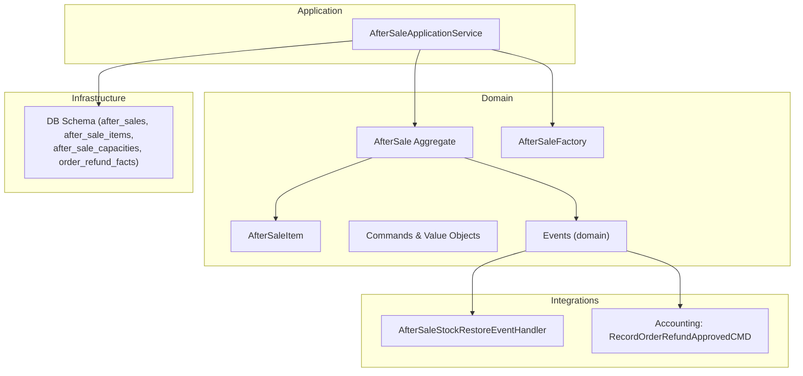
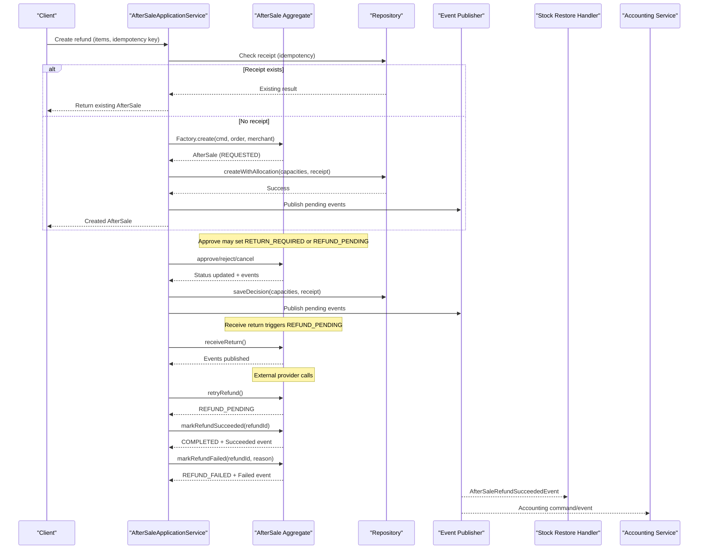
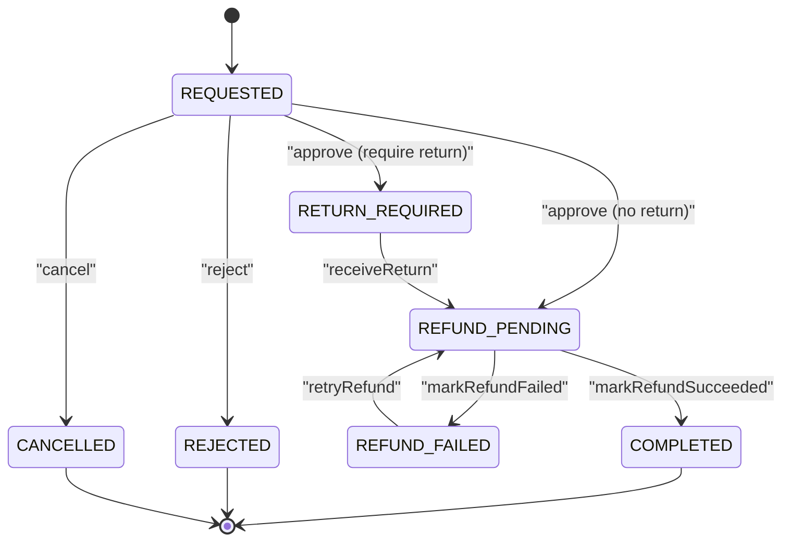
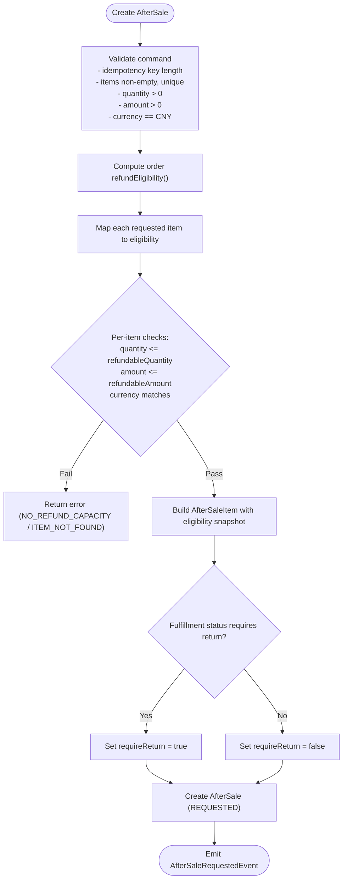
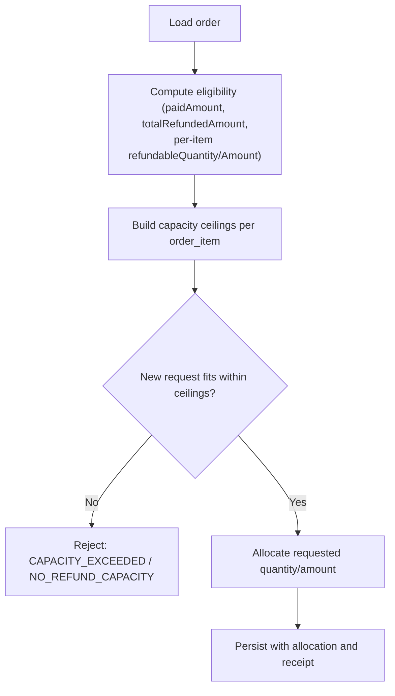
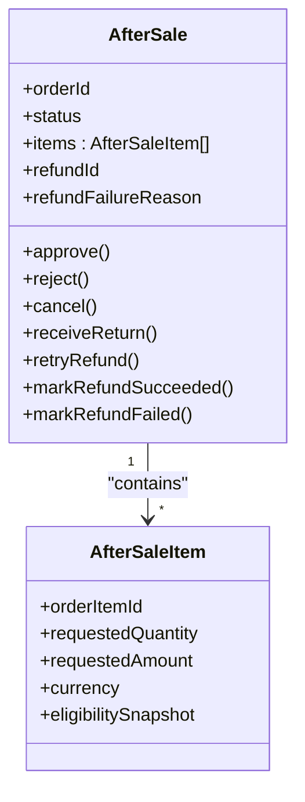
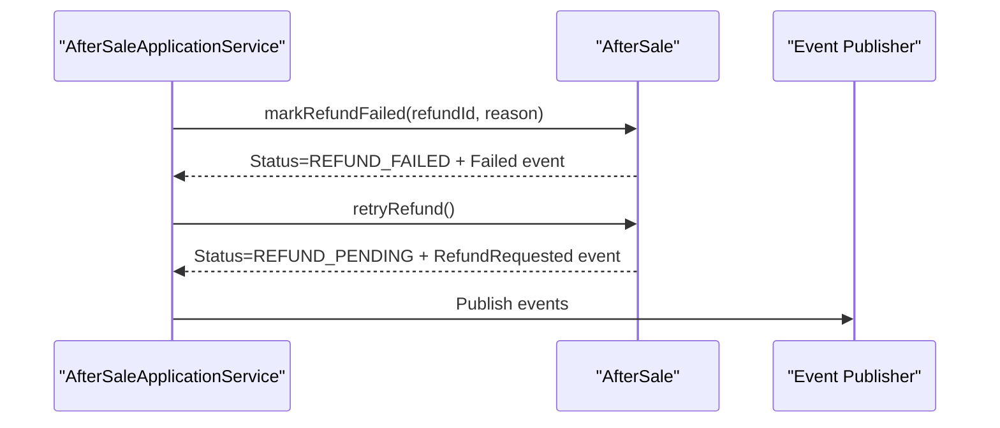
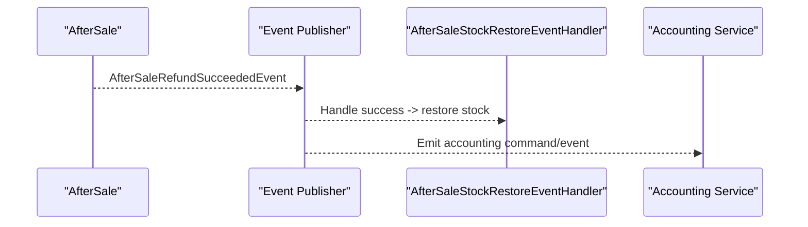
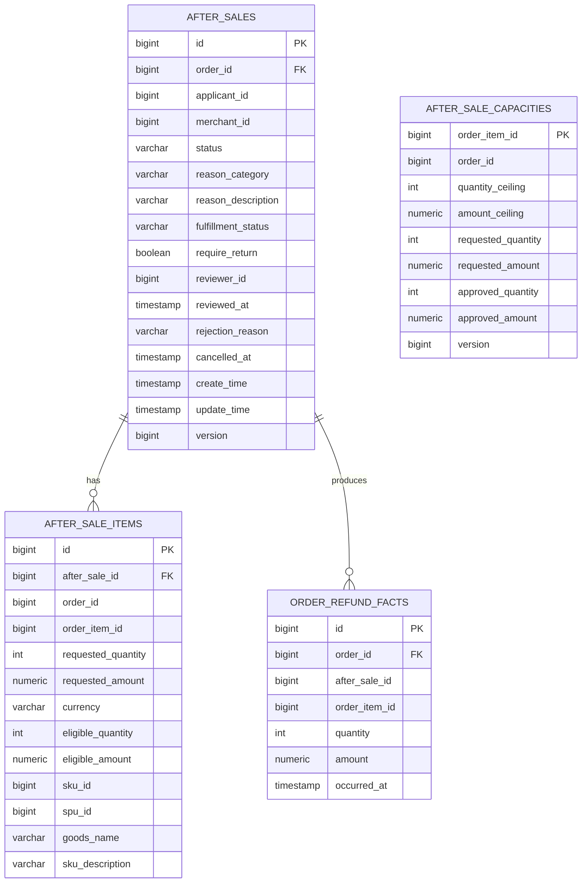
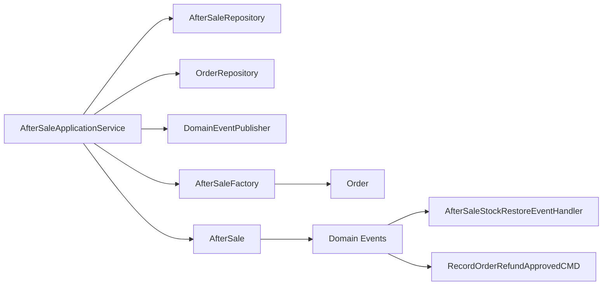

# Refund Processing

<cite>
**Referenced Files in This Document**
- [AfterSale.kt](file://j-store-order-domain/src/main/kotlin/com/jstore/order/domain/aftersale/AfterSale.kt)
- [AfterSaleImpl.kt](file://j-store-order-domain/src/main/kotlin/com/jstore/order/domain/aftersale/AfterSaleImpl.kt)
- [AfterSaleStatus.kt](file://j-store-order-domain/src/main/kotlin/com/jstore/order/domain/aftersale/AfterSaleStatus.kt)
- [AfterSaleItem.kt](file://j-store-order-domain/src/main/kotlin/com/jstore/order/domain/aftersale/AfterSaleItem.kt)
- [AfterSaleFactory.kt](file://j-store-order-domain/src/main/kotlin/com/jstore/order/domain/aftersale/AfterSaleFactory.kt)
- [AfterSaleCommands.kt](file://j-store-order-domain/src/main/kotlin/com/jstore/order/domain/aftersale/command/AfterSaleCommands.kt)
- [AfterSaleValueObjects.kt](file://j-store-order-domain/src/main/kotlin/com/jstore/order/domain/aftersale/AfterSaleValueObjects.kt)
- [AfterSaleErrors.kt](file://j-store-order-domain/src/main/kotlin/com/jstore/order/domain/aftersale/AfterSaleErrors.kt)
- [OrderRefundFact.kt](file://j-store-order-domain/src/main/kotlin/com/jstore/order/domain/order/OrderRefundFact.kt)
- [AfterSaleApplicationService.kt](file://j-store-order-application/src/main/kotlin/com/jstore/order/service/AfterSaleApplicationService.kt)
- [V20260803__order_after_sale_aggregate.sql](file://j-store-boot/src/main/resources/db/migration/V20260803__order_after_sale_aggregate.sql)
- [V20260731__order_status_dimensions.sql](file://j-store-boot/src/main/resources/db/migration/V20260731__order_status_dimensions.sql)
- [AfterSaleStockRestoreEventHandler.kt](file://j-store-goods-application/src/main/kotlin/com/jstore/goods/service/AfterSaleStockRestoreEventHandler.kt)
- [RecordOrderRefundApprovedCMD.kt](file://j-store-accounting-application/src/main/kotlin/com/jstore/accounting/service/command/RecordOrderRefundApprovedCMD.kt)
</cite>

## Table of Contents
1. [Introduction](#introduction)
2. [Project Structure](#project-structure)
3. [Core Components](#core-components)
4. [Architecture Overview](#architecture-overview)
5. [Detailed Component Analysis](#detailed-component-analysis)
6. [Dependency Analysis](#dependency-analysis)
7. [Performance Considerations](#performance-considerations)
8. [Troubleshooting Guide](#troubleshooting-guide)
9. [Conclusion](#conclusion)

## Introduction
This document explains the refund processing functionality within the after-sale domain. It covers the end-to-end workflow from creating a refund request to final status resolution, including item-level calculations, amount validation, state transitions (REQUESTED, RETURN_REQUIRED, REFUND_PENDING, REFUND_FAILED, COMPLETED), partial refunds across multiple items, retry mechanisms, and integration points with inventory restoration and accounting systems. It also documents business rules enforced against original payment amounts and capacities, and provides concrete examples for creation, updates, and error recovery patterns.

## Project Structure
The refund processing spans three layers:
- Domain layer: AfterSale aggregate, value objects, commands, and events define the core logic and invariants.
- Application layer: Orchestrates commands, idempotency, capacity allocation, persistence, and event publishing.
- Infrastructure and integrations: Database schema migrations, stock restore handler, and accounting command emission.

**Diagram sources**
- [AfterSale.kt](file://j-store-order-domain/src/main/kotlin/com/jstore/order/domain/aftersale/AfterSale.kt)
- [AfterSaleImpl.kt](file://j-store-order-domain/src/main/kotlin/com/jstore/order/domain/aftersale/AfterSaleImpl.kt)
- [AfterSaleItem.kt](file://j-store-order-domain/src/main/kotlin/com/jstore/order/domain/aftersale/AfterSaleItem.kt)
- [AfterSaleFactory.kt](file://j-store-order-domain/src/main/kotlin/com/jstore/order/domain/aftersale/AfterSaleFactory.kt)
- [AfterSaleCommands.kt](file://j-store-order-domain/src/main/kotlin/com/jstore/order/domain/aftersale/command/AfterSaleCommands.kt)
- [AfterSaleApplicationService.kt](file://j-store-order-application/src/main/kotlin/com/jstore/order/service/AfterSaleApplicationService.kt)
- [V20260803__order_after_sale_aggregate.sql](file://j-store-boot/src/main/resources/db/migration/V20260803__order_after_sale_aggregate.sql)
- [AfterSaleStockRestoreEventHandler.kt](file://j-store-goods-application/src/main/kotlin/com/jstore/goods/service/AfterSaleStockRestoreEventHandler.kt)
- [RecordOrderRefundApprovedCMD.kt](file://j-store-accounting-application/src/main/kotlin/com/jstore/accounting/service/command/RecordOrderRefundApprovedCMD.kt)

**Section sources**
- [AfterSale.kt](file://j-store-order-domain/src/main/kotlin/com/jstore/order/domain/aftersale/AfterSale.kt)
- [AfterSaleImpl.kt](file://j-store-order-domain/src/main/kotlin/com/jstore/order/domain/aftersale/AfterSaleImpl.kt)
- [AfterSaleApplicationService.kt](file://j-store-order-application/src/main/kotlin/com/jstore/order/service/AfterSaleApplicationService.kt)
- [V20260803__order_after_sale_aggregate.sql](file://j-store-boot/src/main/resources/db/migration/V20260803__order_after_sale_aggregate.sql)

## Core Components
- AfterSale aggregate: Encapsulates lifecycle operations (approve, reject, cancel, receive return, retry refund, mark succeeded/failed). Maintains refundId and failure reason fields for external provider linkage.
- AfterSaleItem: Represents per-item refund requests with quantity and amount validated against eligibility snapshots.
- AfterSaleFactory: Builds an AfterSale from a create command, validates eligibility against the order, and determines whether a physical return is required based on fulfillment status.
- Commands and value objects: Enforce input validation (idempotency keys, item uniqueness, quantities, amounts, currency).
- Application service: Implements idempotent command handling, capacity allocation, persistence, and event publishing. Provides recordRefundSucceeded/Failed hooks for external outcomes.

Key responsibilities:
- Item-level refund calculation and validation against eligible quantities and amounts.
- Business rule enforcement: total refund cannot exceed paid amount; per-item refund cannot exceed purchased amount and remaining capacity.
- State management: REQUESTED → RETURN_REQUIRED or REFUND_PENDING → REFUND_FAILED → COMPLETED.
- Idempotency: Command receipts prevent duplicate processing.
- Event-driven integrations: Stock restore and accounting updates are triggered by domain events.

**Section sources**
- [AfterSale.kt](file://j-store-order-domain/src/main/kotlin/com/jstore/order/domain/aftersale/AfterSale.kt)
- [AfterSaleImpl.kt](file://j-store-order-domain/src/main/kotlin/com/jstore/order/domain/aftersale/AfterSaleImpl.kt)
- [AfterSaleItem.kt](file://j-store-order-domain/src/main/kotlin/com/jstore/order/domain/aftersale/AfterSaleItem.kt)
- [AfterSaleFactory.kt](file://j-store-order-domain/src/main/kotlin/com/jstore/order/domain/aftersale/AfterSaleFactory.kt)
- [AfterSaleCommands.kt](file://j-store-order-domain/src/main/kotlin/com/jstore/order/domain/aftersale/command/AfterSaleCommands.kt)
- [AfterSaleApplicationService.kt](file://j-store-order-application/src/main/kotlin/com/jstore/order/service/AfterSaleApplicationService.kt)

## Architecture Overview
The refund flow is event-driven and uses explicit state transitions within the AfterSale aggregate. The application service ensures idempotency and persists changes atomically while publishing domain events. Downstream systems react to these events to update inventory and accounting records.

**Diagram sources**
- [AfterSaleApplicationService.kt](file://j-store-order-application/src/main/kotlin/com/jstore/order/service/AfterSaleApplicationService.kt)
- [AfterSaleImpl.kt](file://j-store-order-domain/src/main/kotlin/com/jstore/order/domain/aftersale/AfterSaleImpl.kt)
- [AfterSaleFactory.kt](file://j-store-order-domain/src/main/kotlin/com/jstore/order/domain/aftersale/AfterSaleFactory.kt)
- [AfterSaleStockRestoreEventHandler.kt](file://j-store-goods-application/src/main/kotlin/com/jstore/goods/service/AfterSaleStockRestoreEventHandler.kt)
- [RecordOrderRefundApprovedCMD.kt](file://j-store-accounting-application/src/main/kotlin/com/jstore/accounting/service/command/RecordOrderRefundApprovedCMD.kt)

## Detailed Component Analysis

### AfterSale Aggregate and Lifecycle
The AfterSale aggregate manages the full lifecycle of a refund request:
- Approve: Transitions to RETURN_REQUIRED if goods must be returned, otherwise directly to REFUND_PENDING.
- Reject: Moves to REJECTED with a valid rejection reason.
- Cancel: Moves to CANCELLED by the applicant.
- Receive return: Moves to REFUND_PENDING when goods are received.
- Retry refund: Resets from REFUND_FAILED to REFUND_PENDING and publishes a new refund requested event.
- Mark succeeded/failed: Updates refundId and failure reason, transitions to COMPLETED or REFUND_FAILED respectively, and emits corresponding events.

**Diagram sources**
- [AfterSaleImpl.kt](file://j-store-order-domain/src/main/kotlin/com/jstore/order/domain/aftersale/AfterSaleImpl.kt)
- [AfterSaleStatus.kt](file://j-store-order-domain/src/main/kotlin/com/jstore/order/domain/aftersale/AfterSaleStatus.kt)

**Section sources**
- [AfterSaleImpl.kt](file://j-store-order-domain/src/main/kotlin/com/jstore/order/domain/aftersale/AfterSaleImpl.kt)
- [AfterSaleStatus.kt](file://j-store-order-domain/src/main/kotlin/com/jstore/order/domain/aftersale/AfterSaleStatus.kt)

### Item-Level Refund Calculations and Validation
- Each AfterSaleItem carries requestedQuantity and requestedAmount, validated against eligibilitySnapshot.refundableQuantity and refundableAmount.
- Currency must match the eligibility snapshot (CNY).
- The factory enforces that requested quantity and amount do not exceed per-item refundable limits derived from the order’s eligibility.
- Total refund amount equals the sum of item requested amounts; currency is taken from the first item.

**Diagram sources**
- [AfterSaleFactory.kt](file://j-store-order-domain/src/main/kotlin/com/jstore/order/domain/aftersale/AfterSaleFactory.kt)
- [AfterSaleItem.kt](file://j-store-order-domain/src/main/kotlin/com/jstore/order/domain/aftersale/AfterSaleItem.kt)
- [AfterSaleCommands.kt](file://j-store-order-domain/src/main/kotlin/com/jstore/order/domain/aftersale/command/AfterSaleCommands.kt)
- [AfterSaleValueObjects.kt](file://j-store-order-domain/src/main/kotlin/com/jstore/order/domain/aftersale/AfterSaleValueObjects.kt)

**Section sources**
- [AfterSaleFactory.kt](file://j-store-order-domain/src/main/kotlin/com/jstore/order/domain/aftersale/AfterSaleFactory.kt)
- [AfterSaleItem.kt](file://j-store-order-domain/src/main/kotlin/com/jstore/order/domain/aftersale/AfterSaleItem.kt)
- [AfterSaleCommands.kt](file://j-store-order-domain/src/main/kotlin/com/jstore/order/domain/aftersale/command/AfterSaleCommands.kt)
- [AfterSaleValueObjects.kt](file://j-store-order-domain/src/main/kotlin/com/jstore/order/domain/aftersale/AfterSaleValueObjects.kt)

### Amount Validation Against Original Payment and Capacity
- Order-level eligibility includes paidAmount, totalRefundedAmount, and per-item refundableAmount/refundableQuantity.
- The application service constructs RefundCapacityCeiling entries from order items to constrain subsequent requests.
- Business rules enforced:
  - Per-item requested amount cannot exceed eligible refundable amount.
  - Cumulative approved/requested amounts cannot exceed per-item and order ceilings.
  - Currency must be consistent (CNY).
- These constraints ensure refunds never exceed original payment amounts.

**Diagram sources**
- [AfterSaleApplicationService.kt](file://j-store-order-application/src/main/kotlin/com/jstore/order/service/AfterSaleApplicationService.kt)
- [OrderRefundFact.kt](file://j-store-order-domain/src/main/kotlin/com/jstore/order/domain/order/OrderRefundFact.kt)

**Section sources**
- [AfterSaleApplicationService.kt](file://j-store-order-application/src/main/kotlin/com/jstore/order/service/AfterSaleApplicationService.kt)
- [OrderRefundFact.kt](file://j-store-order-domain/src/main/kotlin/com/jstore/order/domain/order/OrderRefundFact.kt)

### Partial Refunds and Multiple Items
- AfterSale supports multiple items in a single request.
- Each item has independent eligibility and capacity tracking.
- The total refund amount is the sum of all item requested amounts.
- Partial refunds are allowed as long as per-item and order-level ceilings are respected.

**Diagram sources**
- [AfterSale.kt](file://j-store-order-domain/src/main/kotlin/com/jstore/order/domain/aftersale/AfterSale.kt)
- [AfterSaleItem.kt](file://j-store-order-domain/src/main/kotlin/com/jstore/order/domain/aftersale/AfterSaleItem.kt)

**Section sources**
- [AfterSale.kt](file://j-store-order-domain/src/main/kotlin/com/jstore/order/domain/aftersale/AfterSale.kt)
- [AfterSaleItem.kt](file://j-store-order-domain/src/main/kotlin/com/jstore/order/domain/aftersale/AfterSaleItem.kt)

### Refund Retry Mechanisms and Failure Handling
- When a refund fails externally, markRefundFailed sets status to REFUND_FAILED and stores refundId and failure reason.
- Merchant can call retryRefund to reset to REFUND_PENDING and publish a new refund requested event.
- Idempotency guards prevent duplicate retries and conflicting references.

**Diagram sources**
- [AfterSaleImpl.kt](file://j-store-order-domain/src/main/kotlin/com/jstore/order/domain/aftersale/AfterSaleImpl.kt)
- [AfterSaleApplicationService.kt](file://j-store-order-application/src/main/kotlin/com/jstore/order/service/AfterSaleApplicationService.kt)

**Section sources**
- [AfterSaleImpl.kt](file://j-store-order-domain/src/main/kotlin/com/jstore/order/domain/aftersale/AfterSaleImpl.kt)
- [AfterSaleApplicationService.kt](file://j-store-order-application/src/main/kotlin/com/jstore/order/service/AfterSaleApplicationService.kt)

### Integration with After-Sale Processes and Provider APIs
- AfterSaleRefundSucceededEvent triggers stock restoration via AfterSaleStockRestoreEventHandler.
- Accounting integration is driven by commands/events such as RecordOrderRefundApprovedCMD.
- The application service publishes pending events after successful mutations, ensuring eventual consistency.

**Diagram sources**
- [AfterSaleImpl.kt](file://j-store-order-domain/src/main/kotlin/com/jstore/order/domain/aftersale/AfterSaleImpl.kt)
- [AfterSaleApplicationService.kt](file://j-store-order-application/src/main/kotlin/com/jstore/order/service/AfterSaleApplicationService.kt)
- [AfterSaleStockRestoreEventHandler.kt](file://j-store-goods-application/src/main/kotlin/com/jstore/goods/service/AfterSaleStockRestoreEventHandler.kt)
- [RecordOrderRefundApprovedCMD.kt](file://j-store-accounting-application/src/main/kotlin/com/jstore/accounting/service/command/RecordOrderRefundApprovedCMD.kt)

**Section sources**
- [AfterSaleImpl.kt](file://j-store-order-domain/src/main/kotlin/com/jstore/order/domain/aftersale/AfterSaleImpl.kt)
- [AfterSaleApplicationService.kt](file://j-store-order-application/src/main/kotlin/com/jstore/order/service/AfterSaleApplicationService.kt)
- [AfterSaleStockRestoreEventHandler.kt](file://j-store-goods-application/src/main/kotlin/com/jstore/goods/service/AfterSaleStockRestoreEventHandler.kt)
- [RecordOrderRefundApprovedCMD.kt](file://j-store-accounting-application/src/main/kotlin/com/jstore/accounting/service/command/RecordOrderRefundApprovedCMD.kt)

### Data Model and Persistence
- after_sales: Tracks refund request lifecycle, reviewer info, reasons, and timestamps.
- after_sale_items: Stores per-item refund details and eligibility snapshots.
- after_sale_capacities: Enforces ceiling constraints per order_item and tracks requested/approved quantities and amounts.
- order_refund_facts: Records successful refund facts per order_item for audit and projections.
- Orders include total_refunded_amount and version for consistency.

**Diagram sources**
- [V20260803__order_after_sale_aggregate.sql](file://j-store-boot/src/main/resources/db/migration/V20260803__order_after_sale_aggregate.sql)

**Section sources**
- [V20260803__order_after_sale_aggregate.sql](file://j-store-boot/src/main/resources/db/migration/V20260803__order_after_sale_aggregate.sql)

### Concrete Examples

- Creating a refund with item details:
  - Provide orderId, applicantId, reason, list of items (orderItemId, quantity, amount, currency=CNY), and idempotencyKey.
  - System validates eligibility and capacity, creates AfterSale (REQUESTED), allocates capacities, and publishes AfterSaleRequestedEvent.

- Updating refund status:
  - Approve: If requireReturn is true, status becomes RETURN_REQUIRED; otherwise REFUND_PENDING.
  - Receive return: Transition to REFUND_PENDING and publish refund requested event.
  - Retry refund: From REFUND_FAILED back to REFUND_PENDING.
  - Mark succeeded: Set refundId, transition to COMPLETED, emit succeeded event.
  - Mark failed: Set refundId and failure reason, transition to REFUND_FAILED, emit failed event.

- Error recovery patterns:
  - Idempotency conflicts: Reuse existing result when idempotency key matches.
  - Concurrent modifications: Use versioned receipts and capacity tables to enforce consistency.
  - Reference conflicts: Prevent associating different refundIds once completed.

**Section sources**
- [AfterSaleCommands.kt](file://j-store-order-domain/src/main/kotlin/com/jstore/order/domain/aftersale/command/AfterSaleCommands.kt)
- [AfterSaleFactory.kt](file://j-store-order-domain/src/main/kotlin/com/jstore/order/domain/aftersale/AfterSaleFactory.kt)
- [AfterSaleImpl.kt](file://j-store-order-domain/src/main/kotlin/com/jstore/order/domain/aftersale/AfterSaleImpl.kt)
- [AfterSaleApplicationService.kt](file://j-store-order-application/src/main/kotlin/com/jstore/order/service/AfterSaleApplicationService.kt)

## Dependency Analysis
- AfterSaleApplicationService depends on AfterSaleRepository, OrderRepository, and DomainEventPublisher.
- AfterSaleFactory depends on Order to compute eligibility and determine requireReturn.
- AfterSaleImpl raises domain events consumed by downstream handlers (stock restore, accounting).
- Database schema enforces constraints on statuses, quantities, and amounts.

**Diagram sources**
- [AfterSaleApplicationService.kt](file://j-store-order-application/src/main/kotlin/com/jstore/order/service/AfterSaleApplicationService.kt)
- [AfterSaleFactory.kt](file://j-store-order-domain/src/main/kotlin/com/jstore/order/domain/aftersale/AfterSaleFactory.kt)
- [AfterSaleImpl.kt](file://j-store-order-domain/src/main/kotlin/com/jstore/order/domain/aftersale/AfterSaleImpl.kt)
- [AfterSaleStockRestoreEventHandler.kt](file://j-store-goods-application/src/main/kotlin/com/jstore/goods/service/AfterSaleStockRestoreEventHandler.kt)
- [RecordOrderRefundApprovedCMD.kt](file://j-store-accounting-application/src/main/kotlin/com/jstore/accounting/service/command/RecordOrderRefundApprovedCMD.kt)

**Section sources**
- [AfterSaleApplicationService.kt](file://j-store-order-application/src/main/kotlin/com/jstore/order/service/AfterSaleApplicationService.kt)
- [AfterSaleFactory.kt](file://j-store-order-domain/src/main/kotlin/com/jstore/order/domain/aftersale/AfterSaleFactory.kt)
- [AfterSaleImpl.kt](file://j-store-order-domain/src/main/kotlin/com/jstore/order/domain/aftersale/AfterSaleImpl.kt)

## Performance Considerations
- Capacity allocation and receipts are persisted atomically to avoid race conditions during concurrent refund requests.
- Idempotency keys reduce redundant processing and network retries overhead.
- Event publishing is deferred until transaction commit to ensure consistency.
- Indexes on after_sales and related tables optimize queries by order_id, applicant_id, merchant_id, and status.

[No sources needed since this section provides general guidance]

## Troubleshooting Guide
Common errors and resolutions:
- NOT_FOUND: AfterSale or Order not found; verify identifiers and existence.
- ORDER_NOT_ELIGIBLE: Order does not allow after-sale; check trade/payment/fulfillment statuses.
- NO_REFUND_CAPACITY: Request exceeds eligible quantity/amount; adjust request or confirm prior refunds.
- CAPACITY_EXCEEDED: Concurrent modification exceeded ceilings; retry with fresh data.
- ILLEGAL_STATE: Invalid state transition; ensure correct sequence of operations.
- APPLICANT_FORBIDDEN / MERCHANT_FORBIDDEN: Actor mismatch; validate caller identity.
- IDEMPOTENCY_KEY_INVALID / IDEMPOTENCY_CONFLICT: Key format or conflict; normalize key and handle conflict response.
- REFUND_REFERENCE_CONFLICT: Duplicate or conflicting refundId; ensure unique refundId per completion.

Operational tips:
- Use retryRefund to recover from transient failures.
- Inspect refundFailureReason to diagnose provider-side issues.
- Monitor events for stock restore and accounting updates to confirm downstream effects.

**Section sources**
- [AfterSaleErrors.kt](file://j-store-order-domain/src/main/kotlin/com/jstore/order/domain/aftersale/AfterSaleErrors.kt)
- [AfterSaleImpl.kt](file://j-store-order-domain/src/main/kotlin/com/jstore/order/domain/aftersale/AfterSaleImpl.kt)
- [AfterSaleApplicationService.kt](file://j-store-order-application/src/main/kotlin/com/jstore/order/service/AfterSaleApplicationService.kt)

## Conclusion
The refund processing system enforces robust business rules through explicit domain modeling, idempotent command handling, and event-driven integrations. Item-level validations and capacity ceilings ensure refunds remain within original payment limits. Clear state transitions and retry mechanisms provide resilience against failures, while downstream handlers maintain consistency across inventory and accounting domains.

[No sources needed since this section summarizes without analyzing specific files]